## Supabase 源码学习: 2 应用 (Applications)  
  
### 作者  
digoal  
  
### 日期  
2025-11-27  
  
### 标签  
Supabase , Firebase , 源码学习 , 后端即服务 , BaaS , backend platform , 后端平台 , 开源项目缝合 , 前端 , 后端 , 自动生成API , 数据库 , 包管理 , 日志  
  
----  
  
## 背景  
Supabase 的 **monorepo (单体仓库)** 包含三个主要的 **Next.js (应用框架)** 应用，它们服务于不同的用户需求：**Studio (数据库仪表板)** 、**Docs (文档门户)** 和 **WWW (营销网站)** 。这些应用通过用于 **UI 组件 (UI components)** 、身份验证和工具的工作区包 (workspace packages) 共享通用基础设施。其他应用，如设计系统 (design-system)、UI 库 (ui-library) 和 CMS (内容管理系统)，则支持开发和内容工作流程。  
  
## 主要应用概述 (Primary Applications Overview)  
  
这三个主要应用均使用 Next.js (应用框架) 构建，共享一套通用的 **技术栈 (technology stack)** ，同时在 Supabase 生态系统中扮演着不同的角色：  
  
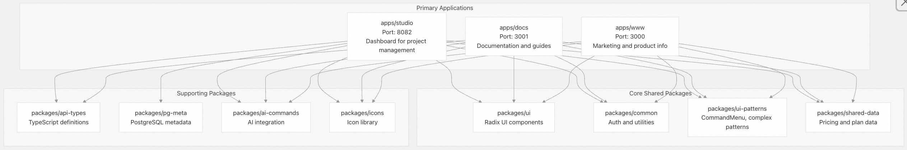  
  
来源:  
[`package.json` 8-46](https://github.com/supabase/supabase/blob/7490ca9e/package.json#L8-L46)  
[`pnpm-workspace.yaml` 1-4](https://github.com/supabase/supabase/blob/7490ca9e/pnpm-workspace.yaml#L1-L4)  
[`apps/studio/package.json` 1-4](https://github.com/supabase/supabase/blob/7490ca9e/apps/studio/package.json#L1-L4)  
[`apps/docs/package.json` 1-4](https://github.com/supabase/supabase/blob/7490ca9e/apps/docs/package.json#L1-L4)  
[`apps/www/package.json` 1-4](https://github.com/supabase/supabase/blob/7490ca9e/apps/www/package.json#L1-L4)  
  
## 主要应用 (Main Applications)  
  
### Studio (仪表板 UI) (Studio (Dashboard UI))  
  
Studio 应用（位于 `apps/studio/`）是用于管理 Supabase 项目的主要仪表板 UI。它提供了一个全面的界面，用于与所有 Supabase 服务进行交互。  
  
#### 关键特性 (Key Features):  
  
  * **数据库管理 (Database management)** （SQL 编辑器、表编辑器、模式可视化）  
  * **身份验证 (Authentication)** 配置和用户管理  
  * **存储桶 (Storage bucket)** 和文件管理  
  * **Edge Functions (边缘函数)** 编辑和部署  
  * API 探索器（REST 和 GraphQL）  
  * 项目设置和配置  
  * **复制管理 (Replication management)**  
  * **AI 集成 (AI integration)**  
  
#### 技术实现 (Technical Implementation):  
  
Studio 使用 Next.js (应用框架) 构建，并依赖于一套丰富的依赖项：  
  
  * **状态管理 (State management)** ：`@tanstack/react-query`、`valtio`  
  * **UI 组件 (UI components)** ：`monaco-editor`、`react-data-grid` 和自定义 UI 组件  
  * **API 客户端 (API clients)** ：`@supabase/supabase-js`、`@supabase/auth-js` 和 `@supabase/pg-meta`  
  * AI 集成：`@ai-sdk/react`、`@ai-sdk/openai`、`openai`  
  * **样式 (Styling)** ：使用 **容器查询 (container queries)** 的 TailwindCSS  
  
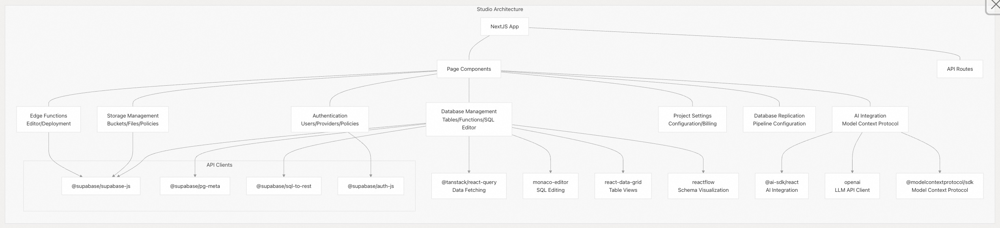  
  
来源:  
[`apps/studio/package.json` 27-147](https://github.com/supabase/supabase/blob/7490ca9e/apps/studio/package.json#L27-L147)  
  
### 文档网站 (Documentation Site)  
  
文档网站（位于 `apps/docs/`）提供全面的指南、API 参考和示例，用于使用 Supabase 服务。  
  
#### 关键特性 (Key Features):  
  
  * 按主题组织的指南和教程  
  * 通过 **OpenAPI 规范 (OpenAPI specifications)** 生成的 API 参考  
  * 多种语言的代码示例  
  * 具有 **矢量嵌入 (vector embeddings)** 的搜索功能  
  * 交互式代码示例  
  * **AI 驱动的文档辅助**  
  * 故障排除指南  
  
#### 技术实现 (Technical Implementation):  
  
文档网站使用 Next.js (应用框架) 构建，并利用了：  
  
  * 使用 **React 组件 (React components)** 进行内容创作的 **MDX (Markdown with JSX)**  
  * 用于路由和 **服务器组件 (server components)** 的 Next.js **App Router (应用路由)**  
  * 用于 API 文档的**自定义参考生成器 (Custom reference generators)**  
  * 用于搜索功能的矢量嵌入  
  * 用于 AI 辅助文档的 OpenAI 集成  
  
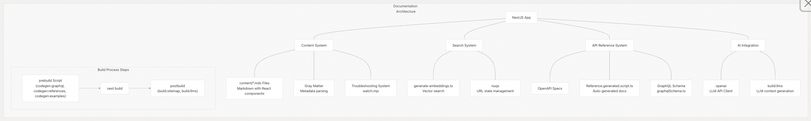  
  
来源:  
[`apps/docs/package.json` 6-42](https://github.com/supabase/supabase/blob/7490ca9e/apps/docs/package.json#L6-L42)  
[`apps/docs/package.json` 44-123](https://github.com/supabase/supabase/blob/7490ca9e/apps/docs/package.json#L44-L123)  
  
### 营销网站 (Marketing Website)  
  
营销网站（位于 `apps/www/`）是 Supabase 主要的公共对外网站，展示产品、定价和公司信息。  
  
#### 关键特性 (Key Features):  
  
  * 产品信息和功能描述  
  * 包含计划比较的定价页面  
  * 用于公告和技术文章的博客  
  * **Launch Week (发布周)** 活动内容  
  * **客户案例研究 (Customer case studies)**  
  * 交互式演示  
  
#### 技术实现 (Technical Implementation):  
  
WWW 网站使用了：  
  
  * Next.js (应用框架) 作为其框架  
  * MDX (Markdown with JSX) 进行内容创作  
  * 用于动画的 Framer Motion  
  * **自定义静态内容生成脚本**  
  * 用于轮播和交互元素的 Swiper  
  * 用于动态 **Open Graph 图像 (Open Graph images)** 的 Vercel OG  
  
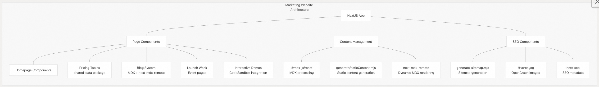  
  
来源:  
[`apps/www/package.json` 20-82](https://github.com/supabase/supabase/blob/7490ca9e/apps/www/package.json#L20-L82)  
  
### 辅助应用 (Supporting Applications)  
  
除了这三个主要应用之外，monorepo (单体仓库) 还包括支持内部开发工作流程的辅助应用：  
  
#### 设计系统 (Design System) (apps/design-system)  
  
在端口 3003 上运行的**组件展示 (Component showcase)** ，用实时示例和主题演示记录 **UI 组件 (UI components)** 。使用 Next.js (应用框架) 和 **ContentLayer2 (内容层)** 构建。  
  
来源:  
[`apps/design-system/package.json` 6-17](https://github.com/supabase/supabase/blob/7490ca9e/apps/design-system/package.json#L6-L17)  
  
#### UI 库 (UI Library) (apps/ui-library)  
  
在端口 3004 上的**组件注册表 (Component registry)** ，提供所有 UI 组件的可搜索目录和代码片段。使用 Shadcn 进行注册表管理。  
  
来源:  
[`apps/ui-library/package.json` 6-17](https://github.com/supabase/supabase/blob/7490ca9e/apps/ui-library/package.json#L6-L17)  
  
#### CMS (内容管理系统) (apps/cms)  
  
在端口 3030 上的 Payload CMS (内容管理系统) 应用，用于管理博客内容和营销材料。与 WWW 应用集成以进行内容发布。  
  
来源:  
[`apps/cms/package.json` 6-21](https://github.com/supabase/supabase/blob/7490ca9e/apps/cms/package.json#L6-L21)  
  
## 共享技术栈 (Shared Technology Stack)  
  
所有应用都使用通过 **pnpm 工作区目录 (pnpm workspace catalog)** 管理的通用技术基础：  
  
| 组件 | 技术 | 目录版本 | 目的/用途 |  
| :--- | :--- | :--- | :--- |  
| Framework (框架) | Next.js (应用框架) | `catalog:` (^15.5.2) | 带有 App Router 的 React 框架 |  
| UI Library (UI 库) | React | `catalog:` (^18.3.0) | 组件渲染 |  
| Language (语言) | TypeScript | `catalog:` (\~5.9.0) | **类型安全开发** |  
| Styling (样式) | Tailwind CSS | `catalog:` (3.4.1) | **实用优先 (Utility-first)** 的 CSS |  
| Content (内容) | MDX (Markdown with JSX) | ^2.3.0 | 带有 React 组件的 Markdown |  
| Package Manager (包管理器) | pnpm | 10.18 | **工作区管理** |  
| Monorepo Tool (单体仓库工具) | Turborepo | 2.3.3 | **并行构建和缓存** |  
| Supabase Client (客户端) | @supabase/supabase-js | `catalog:` (2.74.0) | API 客户端 |  
| Auth Client (身份验证客户端) | @supabase/auth-js | `catalog:` (2.74.0) | 身份验证 |  
| State Management (状态管理) | valtio | `catalog:` (^1.12.0) | **基于代理的状态** |  
| Validation (验证) | zod | `catalog:` (^3.25.76) | **模式验证 (Schema validation)** |  
  
`catalog:` 标识表明版本在 [`pnpm-workspace.yaml` 7-21](https://github.com/supabase/supabase/blob/7490ca9e/pnpm-workspace.yaml#L7-L21) 中**集中管理 (centrally managed)** ，以确保所有应用之间的一致性。  
  
来源:  
[`pnpm-workspace.yaml` 7-21](https://github.com/supabase/supabase/blob/7490ca9e/pnpm-workspace.yaml#L7-L21)  
[`package.json` 48-70](https://github.com/supabase/supabase/blob/7490ca9e/package.json#L48-L70)  
  
## 共享包 (Shared Packages)  
  
这些应用共享一组通用包，以确保 UI、工具和功能的一致性：  
  
### UI 包 (UI Package)  
  
`packages/ui/` 包提供跨所有应用使用的核心 **UI 组件 (UI components)** ：  
  
  * 使用 Radix UI **基元 (primitives)** 构建的 React 组件  
  * 具有一致**设计代币 (design tokens)** 的 TailwindCSS 样式  
  * 通过 `next-themes` 支持亮/暗模式  
  * 遵循 **ARIA 模式 (ARIA patterns)** 的可访问组件  
  
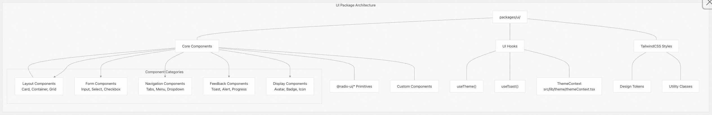  
  
来源:  
[`packages/ui/package.json` 21-80](https://github.com/supabase/supabase/blob/7490ca9e/packages/ui/package.json#L21-L80)  
[`packages/ui/src/lib/theme/themeContext.tsx` 1-69](https://github.com/supabase/supabase/blob/7490ca9e/packages/ui/src/lib/theme/themeContext.tsx#L1-L69)  
[`packages/ui/src/components/ThemeProvider/ThemeProvider.tsx` 1-18](https://github.com/supabase/supabase/blob/7490ca9e/packages/ui/src/components/ThemeProvider/ThemeProvider.tsx#L1-L18)  
  
### Common 包 (Common Package)  
  
`packages/common/` 包提供共享的工具和辅助函数 (helpers)：  
  
  * 通过 `gotrue.ts` 提供的**身份验证工具 (Authentication utilities)**  
  * 共享的**钩子 (hooks)** 和辅助函数  
  * **类型定义 (Type definitions)**  
  * **环境感知配置**  
  * 通过 ConfigCat 进行**功能标志 (Feature flag)** 管理  
  
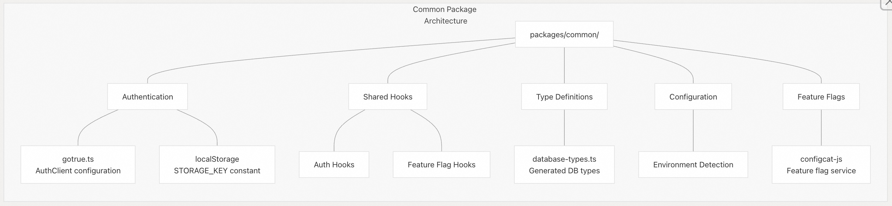  
  
来源:  
[`packages/common/package.json` 14-26](https://github.com/supabase/supabase/blob/7490ca9e/packages/common/package.json#L14-L26)  
[`packages/common/gotrue.ts` 1-130](https://github.com/supabase/supabase/blob/7490ca9e/packages/common/gotrue.ts#L1-L130)  
  
### UI-Patterns 包 (UI-Patterns Package)  
  
`packages/ui-patterns/` 包在核心 UI 组件的基础上提供**更高级别的 UI 模式 (UI patterns)** ：  
  
  * **复杂的 UI 组合 (UI compositions)**  
  * 特定于功能的组件  
  * **命令菜单系统 (Command menu system)**  
  * AI 集成组件  
  * 表单布局和模式  
  
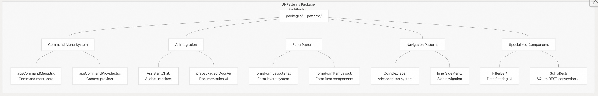  
  
来源:  
[`packages/ui-patterns/package.json` 15-480](https://github.com/supabase/supabase/blob/7490ca9e/packages/ui-patterns/package.json#L15-L480)  
[`packages/ui-patterns/package.json` 482-524](https://github.com/supabase/supabase/blob/7490ca9e/packages/ui-patterns/package.json#L482-L524)  
  
### AI Commands 包 (AI Commands Package)  
  
`packages/ai-commands/` 包提供 AI 集成的工具：  
  
  * OpenAI 客户端集成  
  * **提示工程 (Prompt engineering)** 工具  
  * 令牌计数和管理  
  * AI 命令定义  
  
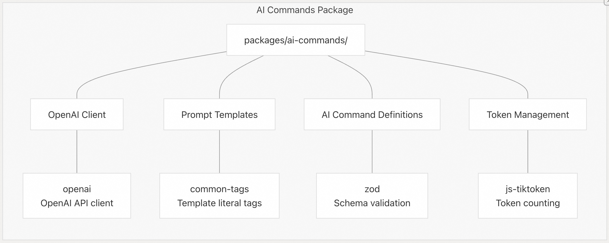  
  
来源:  
[`packages/ai-commands/package.json` 14-23](https://github.com/supabase/supabase/blob/7490ca9e/packages/ai-commands/package.json#L14-L23)  
  
### PG-Meta 包 (PG-Meta Package)  
  
`packages/pg-meta/` 包提供一个 **PostgreSQL 元数据 (metadata) API**：  
  
  * **数据库模式内省 (schema introspection)**  
  * PostgreSQL 对象的类型定义  
  * Zod **模式验证 (schema validation)**  
  
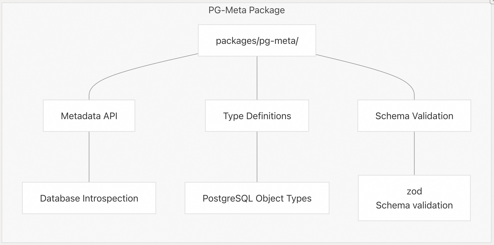  
  
来源:  
[`packages/pg-meta/package.json` 6-31](https://github.com/supabase/supabase/blob/7490ca9e/packages/pg-meta/package.json#L6-L31)  
  
## 开发工作流程 (Development Workflow)  
  
### 本地开发命令 (Local Development Commands)  
  
根目录的 [`package.json` 8-22](https://github.com/supabase/supabase/blob/7490ca9e/package.json#L8-L22) 定义了运行应用的脚本。  
  
```  
# Run all applications in parallel  
pnpm dev  
  
# Run individual applications  
pnpm dev:studio          # Port 8082 - Dashboard  
pnpm dev:studio-local    # Studio with local Supabase CLI instance  
pnpm dev:docs            # Port 3001 - Documentation  
pnpm dev:www             # Port 3000 - Marketing  
pnpm dev:design-system   # Port 3003 - Design System  
pnpm dev:cms             # Port 3030 - Content Management  
```  
  
来源:  
[`package.json` 8-22](https://github.com/supabase/supabase/blob/7490ca9e/package.json#L8-L22)  
  
### 构建过程 (Build Process)  
  
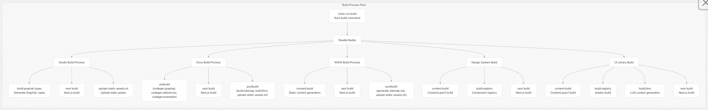  
  
来源:  
[`package.json` 8-46](https://github.com/supabase/supabase/blob/7490ca9e/package.json#L8-L46)  
[`apps/docs/package.json` 6-42](https://github.com/supabase/supabase/blob/7490ca9e/apps/docs/package.json#L6-L42)  
[`apps/studio/package.json` 6-25](https://github.com/supabase/supabase/blob/7490ca9e/apps/studio/package.json#L6-L25)  
[`apps/www/package.json` 6-18](https://github.com/supabase/supabase/blob/7490ca9e/apps/www/package.json#L6-L18)  
[`apps/design-system/package.json` 6-16](https://github.com/supabase/supabase/blob/7490ca9e/apps/design-system/package.json#L6-L16)  
[`apps/ui-library/package.json` 6-17](https://github.com/supabase/supabase/blob/7490ca9e/apps/ui-library/package.json#L6-L17)  
  
## 身份验证和共享状态 (Authentication and Shared State)  
  
应用通过 `@supabase/auth-js` 客户端共享身份验证，从而实现在整个生态系统中的**统一的登录体验**。  
  
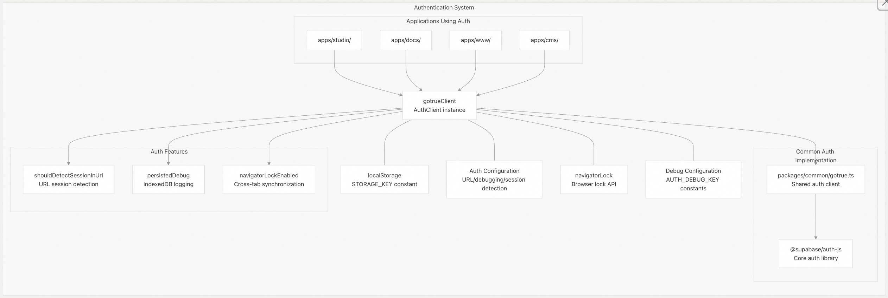  
  
来源:  
[`packages/common/gotrue.ts` 1-130](https://github.com/supabase/supabase/blob/7490ca9e/packages/common/gotrue.ts#L1-L130)  
[`pnpm-lock.yaml` 8-11](https://github.com/supabase/supabase/blob/7490ca9e/pnpm-lock.yaml#L8-L11)  
  
## 跨应用集成 (Cross-Application Integration)  
  
这些应用被设计为一个**内聚系统 (cohesive system)** ，通过交叉链接和共享资源协同工作：  
  
  * **营销网站 (WWW)** 链接到特定的文档页面  
  * **文档**链接到相关的 **Studio** 功能  
  * **Studio** 链接回**文档**以提供上下文  
  * **共享身份验证 (Shared authentication)** 允许应用之间**无缝切换 (seamless transitions)**  
  * **共享 UI 组件 (UI components)** 确保一致的用户体验  
  * 通过共享包实现的**通用数据结构**  
  
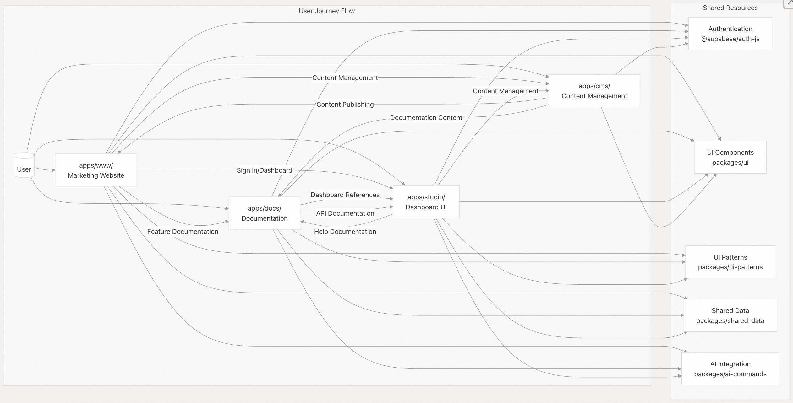  
  
来源:  
[`apps/studio/package.json` 75-146](https://github.com/supabase/supabase/blob/7490ca9e/apps/studio/package.json#L75-L146)  
[`apps/docs/package.json` 44-123](https://github.com/supabase/supabase/blob/7490ca9e/apps/docs/package.json#L44-L123)  
[`apps/www/package.json` 20-82](https://github.com/supabase/supabase/blob/7490ca9e/apps/www/package.json#L20-L82)  
[`apps/cms/package.json` 99-132](https://github.com/supabase/supabase/blob/7490ca9e/apps/cms/package.json#L99-L132)  
  
## 结论 (Conclusion)  
  
Supabase monorepo (单体仓库) 中的应用形成了一个**内聚的生态系统 (cohesive ecosystem)** ，提供完整的用户体验：  
  
1.  **营销网站 (Marketing Website) (apps/www/)** 帮助用户发现和了解 Supabase  
2.  **文档网站 (Documentation Site) (apps/docs/)** 提供技术信息和实施指南  
3.  **Studio 仪表板 (Studio Dashboard) (apps/studio/)** 是管理 Supabase 项目的主要界面  
4.  **设计系统 (Design System)** 和 **UI 库 (UI Library)** 应用确保了整个平台的一致性  
  
这些应用通过共享包、一致的设计模式和集成身份验证实现统一，在允许每个应用拥有独特用途的专业化开发的同时，创造了**无缝体验 (seamless experience)** 。  
  
来源:  
[`package.json`](https://github.com/supabase/supabase/blob/7490ca9e/package.json)  
[`pnpm-workspace.yaml`](https://github.com/supabase/supabase/blob/7490ca9e/pnpm-workspace.yaml)  
  
-----  
  
# 附录1: 跨应用状态管理与用户体验 (Developer / User Perspective)  
  
**背景痛点：** 尽管使用了 monorepo 和共享包，但 **Studio**、**Docs** 和 **WWW** 仍然是三个独立的 Next.js 应用，它们在浏览器中作为独立实例运行。要实现“无缝体验”和“共享身份验证”，必须确保用户上下文（例如，当前选定的 Supabase 项目 ID、主题设置或功能标志状态）在这些不同的应用之间保持一致和同步。  
  
**关键问题：**  
  
> 既然 **Studio**、**Docs** 和 **WWW** 是三个独立的 Next.js 应用，那么 Supabase 如何利用 **`@supabase/auth-js`** 和 **`valtio`** 等工具来管理和**跨越应用边界**同步用户的**全局状态**（例如，当前活动的 Supabase 项目上下文），以确保用户在应用之间“无缝切换”时，上下文不会丢失或不一致？  
  
## 回答  
  
  
Supabase 通过统一的 **Cookie-based 认证机制**和**共享域名**来实现跨应用状态同步，而不是直接使用 `valtio` 进行跨应用通信。    
  
### 关键实现机制  
  
#### 1. 统一认证基础  
所有三个应用（Studio、Docs、WWW）都使用 `@supabase/ssr` 包，通过 **cookies** 存储用户会话：    
  
```typescript  
// Cookie 命名规范：sb-<project_ref>-auth-token  
const supabase = createServerClient(url, key, {  
  cookies: {  
    getAll() { return request.cookies.getAll() },  
    setAll(cookiesToSet) { /* 设置 cookies */ }  
  }  
})  
```  
  
#### 2. Middleware 会话刷新  
每个应用都部署 middleware 来自动刷新过期会话：    
  
#### 3. 共享域名策略  
由于所有应用都在 `supabase.com` 域名下运行：  
- Studio: `supabase.com/dashboard`    
- Docs: `supabase.com/docs`    
- WWW: `supabase.com`    
  
cookies 可以在子域间共享，实现认证状态自动同步。  
  
### 状态同步架构  
  
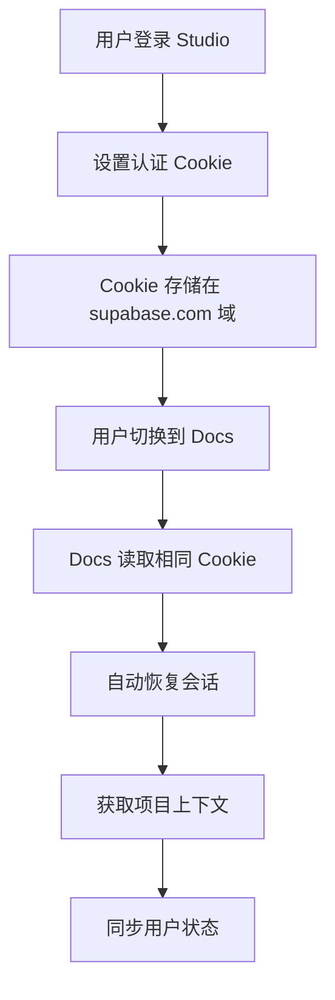
  
## 技术细节  
  
### 认证流程  
1. **用户登录**：任一应用调用 `supabase.auth.signIn()`    
2. **Cookie 设置**：会话令牌存储为 `sb-<project_ref>-auth-token`    
3. **跨应用访问**：其他应用自动读取相同 cookie  
4. **会话验证**：通过 `getUser()` 重新验证令牌    
  
### 项目上下文同步  
虽然认证状态通过 cookies 同步，但**项目特定的上下文**（如当前选定的项目 ID）需要：  
1. 存储在 Supabase 数据库的用户元数据中  
2. 或通过 URL 参数在应用间传递  
3. 或使用 localStorage（仅限同域）  
  
### 关于 Valtio  
基于提供的代码上下文，**没有发现 `valtio` 在跨应用状态同步中的直接使用**。`valtio` 可能用于单个应用内的状态管理，但跨应用同步主要依靠：  
- 共享的认证 cookies  
- 统一的 Supabase 客户端配置  
- 相同的域名策略  
  
## Notes  
  
- 跨应用状态同步的核心是 **Cookie-based 认证**而非 `valtio`  
- 三个应用共享 `supabase.com` 域名是技术前提  
- `@supabase/auth-helpers` 已被 `@supabase/ssr` 替代    
- 项目上下文等业务状态需要额外的同步机制（数据库存储或 URL 传递）  
  
  
  
-----  
  
# 附录2: Monorepo 性能与工程效率 (Architect / Developer Perspective)  
  
**背景痛点：** 随着 monorepo 的增长，**并行构建和缓存 (Parallel builds and caching)** 成为维护工程效率的关键挑战。配置复杂的 **Next.js App Router**、大量的 **UI 组件 (UI components)** 和定制的构建流程（如文档站点的参考生成器）可能会导致构建时间过长。  
  
**关键问题：**  
  
> 在包含三个 Next.js 应用和多个共享包的 monorepo 中，Supabase 具体是如何配置 **Turborepo** 和 **pnpm 工作区目录**的？在日常开发和 CI/CD 流程中，这些工具如何确保在更改一个共享包（例如 **`packages/ui/`**）时，只有依赖它的应用会被重新构建和测试，从而实现真正的**并行构建**，并最大限度地缩短开发者的等待时间？  
  
## 回答  
  
## 核心答案  
  
Supabase 通过 **Turborepo 的依赖图分析**和 **pnpm 的工作区管理**实现智能并行构建，当共享包变更时只重建依赖它的应用。     
  
### 关键配置  
  
#### 1. pnpm 工作区配置  
`pnpm-workspace.yaml` 定义了工作区结构：    
```yaml  
packages:  
  - apps/*  
  - packages/*  
  - blocks/*  
  - e2e/*  
```  
  
#### 2. Turborepo 依赖管理  
在 `turbo.json` 中，Studio 应用的构建配置：    
- `"dependsOn": ["^build"]` - 确保所有依赖包先构建  
- `"outputs": [".next/**", "!.next/cache/**"]` - 定义缓存输出  
  
#### 3. 共享包传递配置  
Studio 的 `next.config.js` 中配置了需要转译的共享包：    
```javascript  
transpilePackages: [  
  'ui',  
  'ui-patterns',   
  'common',  
  'shared-data',  
  'api-types',  
  'icons',  
  'libpg-query',  
]  
```  
  
### 并行构建流程  
  
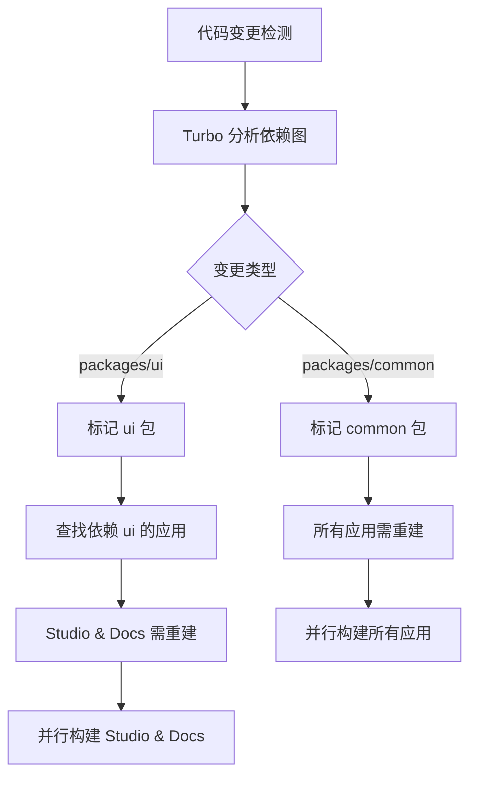
  
## 技术实现细节  
  
### 开发环境并行启动  
根目录 `package.json` 中的开发脚本：    
```json  
{  
  "dev": "turbo run dev --parallel",  
  "dev:studio": "turbo run dev --filter=studio --parallel",  
  "dev:docs": "turbo run dev --filter=docs --parallel"  
}  
```  
  
### CI/CD 中的智能构建  
  
#### UI 包变更触发  
`.github/workflows/ui-tests.yml` 仅在 `packages/ui/**` 变更时触发：    
```yaml  
paths:  
  - 'packages/ui/**'  
```  
  
#### Studio 测试的依赖感知  
`.github/workflows/studio-unit-tests.yml` 使用 sparse-checkout 只拉取相关代码：    
```yaml  
sparse-checkout: |  
  apps/studio  
  packages  
```  
  
### Docker 构建优化  
Studio 的 `Dockerfile` 使用 Turbo 的 prune 功能优化依赖：    
```dockerfile  
FROM base AS turbo  
COPY . .  
RUN pnpm dlx turbo@2.3.3 prune studio --docker  
```  
  
### 缓存策略  
  
#### Turbo 缓存配置  
- **构建缓存**：`.next/**` 目录（排除 cache）  
- **环境变量隔离**：83 个显式声明的环境变量  
- **传递变量**：`CURRENT_CLI_VERSION` 和 `VERCEL_GIT_COMMIT_SHA`  
  
#### pnpm 缓存优化  
`pnpm-workspace.yaml` 中的配置：    
- `ignoredBuiltDependencies` - 忽略特定内置依赖  
- `catalog` - 统一版本管理  
- `overrides` - 依赖版本覆盖  
  
## 实际工作流程  
  
### 1. 修改 packages/ui  
```bash  
# Turbo 检测到 ui 包变更  
pnpm build:studio  # 只重建依赖 ui 的应用  
```  
  
### 2. 并行开发  
```bash  
# 同时启动所有应用的开发服务器  
pnpm dev  # turbo run dev --parallel  
```  
  
### 3. CI/CD 增量构建  
- GitHub Actions 根据文件路径智能触发  
- 只拉取和测试相关的应用与包  
- 利用 Turbo 缓存避免重复构建  
  
## Notes  
  
- Turborepo 的 `^build` 语法确保依赖包先构建  
- pnpm 的 workspace 协议实现高效的依赖链接  
- CI/CD 中的 sparse-checkout 减少不必要的文件拉取  
- Docker 构建使用 `turbo prune` 优化镜像大小  
  
  
  
-----  
  
# 附录3: 设计一致性与功能发布策略 (Architect / Developer / User Perspective)  
  
**背景痛点：** 统一的设计系统（**Design System** / **UI Package**）的目的是确保所有应用的视觉一致性，而 **Feature Flag** 的引入是为了安全地控制新功能发布。如果这些系统的集成不够完善，可能导致 UI 组件被绕过或功能标志的使用混乱。  
  
**关键问题：**  
  
> 鉴于 Supabase 使用了专用的 **Design System** (设计系统) 和 **ConfigCat** 进行**功能标志 (Feature flag)** 管理，请问在将一个大型新功能或 UI 模式（例如 **`packages/ui-patterns/`** 中的新组件）推向用户时，架构师如何确保：**a) UI 样式**在 **Studio**、**Docs** 和 **WWW** 中是 100% 一致的；**b) 功能标志**的控制粒度能够支持对特定用户群或项目进行 **A/B 测试**，并能够被所有三个 Next.js 应用统一读取和响应？  
  
  
## 回答  
  
## 简要回答  
  
Supabase 通过共享包架构和统一的提供者模式确保 UI 一致性和功能标志统一管理：UI 组件通过 `packages/ui` 和 `packages/ui-patterns` 共享，功能标志通过 `packages/common` 中的 ConfigCat 集成和 `FeatureFlagProvider` 在三个应用中统一部署。  
  
---  
  
## 详细分析  
  
### a) UI 样式一致性保障机制  
  
#### 共享组件架构  
Supabase 采用分层组件系统确保跨应用一致性：  
  
- **基础组件层**：`packages/ui` 提供 Radix UI 基础组件，所有应用通过 `import { Button, Badge } from 'ui'` 统一使用    
- **模式组件层**：`packages/ui-patterns` 提供复杂 UI 组合，如 CommandMenu、AI 集成组件等    
- **设计系统文档**：`apps/design-system` 作为组件展示和规范文档，确保设计规范统一    
  
#### 样式系统统一  
- 使用 Tailwind CSS 与统一的设计令牌，颜色系统通过 Figma 变量同步到 CSS 自定义属性    
- 严格的样式类使用规范，避免硬编码颜色值，使用语义化的背景和文本类    
  
### b) 功能标志统一管理架构  
  
#### ConfigCat 集成实现  
功能标志通过 `packages/common/configcat.ts` 统一管理：  
  
```typescript  
// 核心获取函数支持用户属性定制  
export async function getFlags(userEmail: string = '', customAttributes?: Record<string, string>) {  
  const client = await getClient()  
  return client.getAllValuesAsync(  
    new configcat.User(userEmail, undefined, undefined, customAttributes)  
  )  
}  
```    
  
#### 统一提供者模式  
三个应用都通过 `FeatureFlagProvider` 统一集成：  
  
- **Studio**：在 `_app.tsx` 中配置，支持云提供商属性传递    
- **WWW**：在 `_app.tsx` 和 `app/providers.tsx` 中双重配置确保兼容性     
- **Docs**：在 `app.providers.tsx` 中配置    
  
#### A/B 测试支持机制  
功能标志支持细粒度控制：  
  
- **用户级别定向**：通过 `userEmail` 参数实现用户群定向    
- **自定义属性**：支持 `cloud_provider` 等项目级别属性    
- **统一响应**：通过 `useFlag` hook 在所有应用中统一读取标志值    
  
#### 实际使用示例  
在 Studio 中的功能页面展示完整的使用流程：  
  
```typescript  
// 检查功能标志并控制页面访问  
const authOverviewPageEnabled = useFlag('authOverviewPage')  
useEffect(() => {  
  if (hasLoaded && !authOverviewPageEnabled) {  
    router.replace(`/project/${ref}/auth/users`)  
  }  
}, [authOverviewPageEnabled, router, ref])  
```    
  
### 架构优势  
  
这种设计确保了：  
1. **UI 一致性**：通过共享包和统一设计令牌避免组件重复实现  
2. **功能标志统一**：单点配置，多应用生效，支持细粒度定向  
3. **开发效率**：新组件在 `packages/ui-patterns` 实现后，三个应用自动获得一致的功能和样式  
4. **A/B 测试能力**：基于用户邮箱和自定义属性的精确控制  
  
## Notes  
  
- 功能标志系统同时支持 ConfigCat 和 PostHog 两个提供者，但主要通过 ConfigCat 进行细粒度控制    
- 设计系统应用运行在端口 3003，用于组件文档和示例展示    
- 所有应用使用相同的主题系统，支持 dark、light、classic-dark 三种主题    
  
    
#### [PolarDB 学习图谱](https://www.aliyun.com/database/openpolardb/activity "8642f60e04ed0c814bf9cb9677976bd4")
  
  
#### [PostgreSQL 解决方案集合](../201706/20170601_02.md "40cff096e9ed7122c512b35d8561d9c8")
  
  
#### [德哥 / digoal's Github - 公益是一辈子的事.](https://github.com/digoal/blog/blob/master/README.md "22709685feb7cab07d30f30387f0a9ae")
  
  
#### [About 德哥](https://github.com/digoal/blog/blob/master/me/readme.md "a37735981e7704886ffd590565582dd0")
  
  

  
