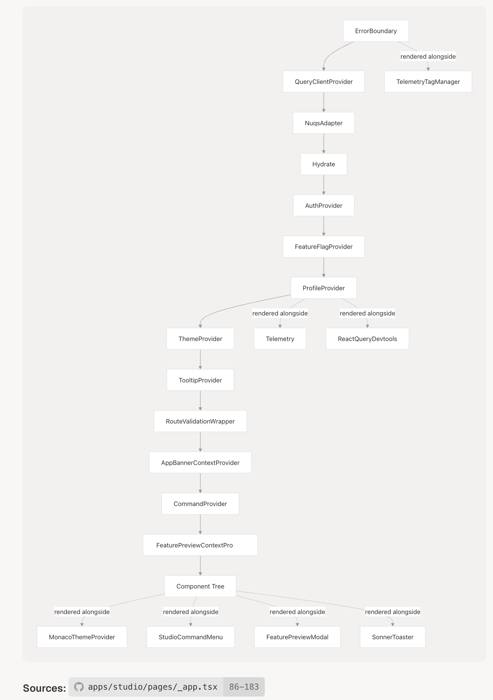
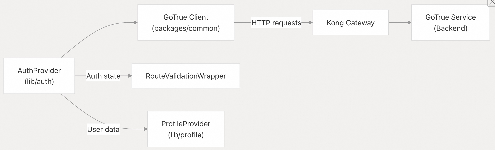
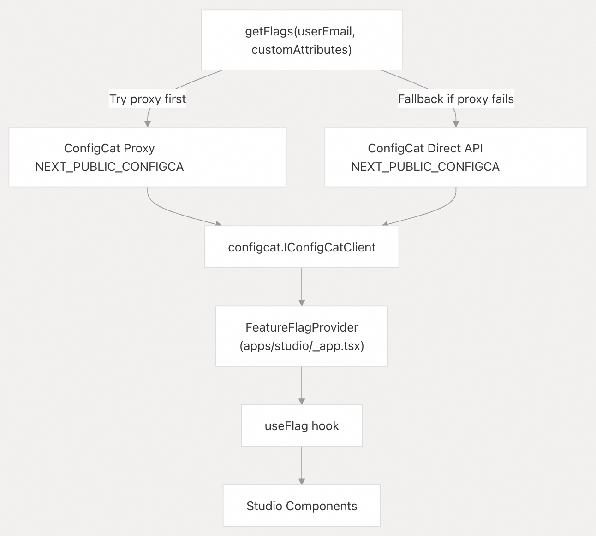
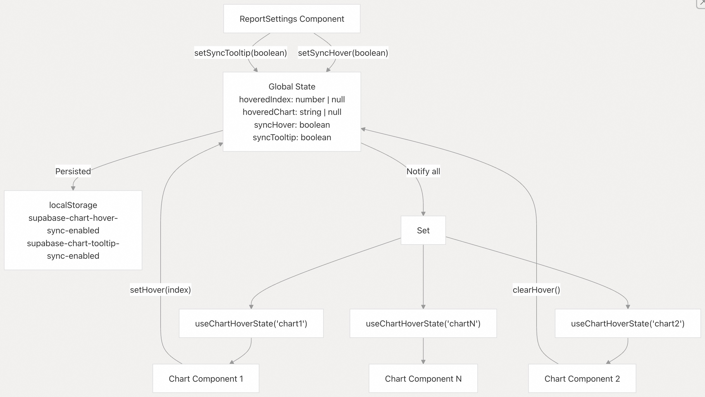
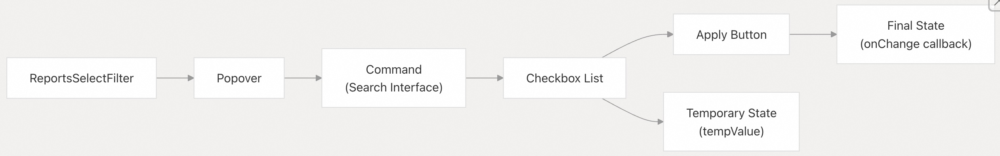
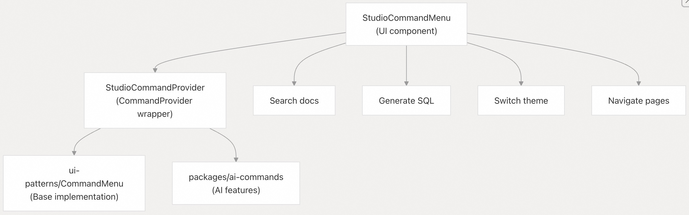
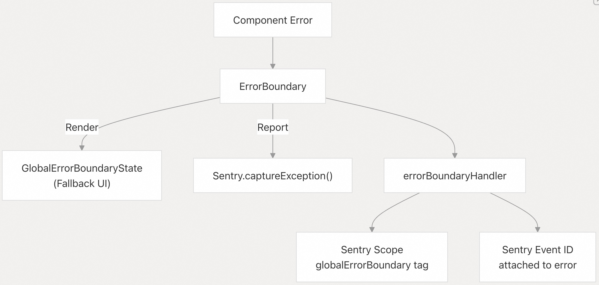
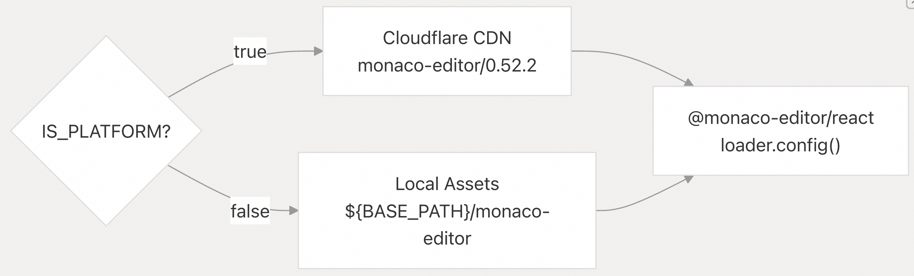

## Supabase 源码学习: 2.1 Studio 控制面板 (Studio Dashboard)  
    
### 作者    
digoal    
    
### 日期    
2025-11-27    
    
### 标签    
Supabase , Firebase , 源码学习 , 后端即服务 , BaaS , backend platform , 后端平台 , 开源项目缝合 , 前端 , 后端 , 自动生成API , 数据库 , 包管理 , 日志    
    
----    
    
## 背景    
Studio 控制面板（位于 [`apps/studio`](https://github.com/supabase/supabase/blob/7490ca9e/apps/studio)）是 Supabase **主要的基于 Web 的项目管理界面 (primary web-based project management interface)** 。它提供了一个全面的 **UI (用户界面)** ，用于管理数据库模式 (database schemas)、认证设置 (authentication settings)、存储桶 (storage buckets)、边缘函数 (edge functions) 和项目分析 (project analytics)。本文档涵盖了该应用的架构 (application's architecture)、提供者层级结构 (provider hierarchy)、核心系统 (core systems) 和关键 UI 组件 (key UI components)。  
  
-----  
  
## 应用架构 (Application Architecture)  
  
### 提供者层级结构 (Provider Hierarchy)  
  
Studio 应用使用一种**深度嵌套的提供者组合模式 (deeply nested provider composition pattern)** 来管理**全局状态 (global state)** 、认证 (authentication)、主题化 (theming) 和**特性标志 (feature flags)** 。根应用组件 (root application component) 以特定的依赖顺序来编排 (orchestrates) 这些提供者 (providers)。  
  
  
  
**来源:**  
[`apps/studio/pages/_app.tsx` 86-183](https://github.com/supabase/supabase/blob/7490ca9e/apps/studio/pages/_app.tsx#L86-L183)  
  
### 提供者初始化与配置 (Provider Initialization and Configuration)  
  
主应用入口点 `CustomApp` 函数使用特定配置初始化**提供者栈 (provider stack)** ：  
  
| Provider (提供者) | Purpose (目的) | Key Configuration (关键配置) |  
| :--- | :--- | :--- |  
| `ErrorBoundary` | 全局错误处理，带有 **Sentry 集成 (Sentry integration)** | `FallbackComponent={GlobalErrorBoundaryState}`，自定义 `onError` 处理器 |  
| `QueryClientProvider` | 用于数据获取的 **React Query 客户端 (React Query client)** | 使用 `useRootQueryClient()` 钩子 (hook) |  
| `NuqsAdapter` | **URL 状态管理 (URL state management)** | Next.js Pages Router 适配器 (adapter) |  
| `AuthProvider` | **认证状态管理 (Authentication state management)** | 来自 `lib/auth` |  
| `FeatureFlagProvider` | **ConfigCat 特性标志 (feature flag) 集成** | `API_URL`，`enabled={IS_PLATFORM}`，自定义 `getConfigCatFlags` |  
| `ProfileProvider` | 用户资料和偏好设置 | 来自 `lib/profile` |  
| `ThemeProvider` | 主题切换 (暗色/亮色/经典暗色) | `defaultTheme="system"`，`enableSystem`，`disableTransitionOnChange` |  
| `CommandProvider` | Cmd+K **命令菜单 (command menu)** | 自定义 `StudioCommandProvider` 实现 |  
| `MonacoThemeProvider` | **Monaco 编辑器 (Monaco editor)** 主题同步 | 与全局主题同步 |  
  
**来源:**  
[`apps/studio/pages/_app.tsx` 86-183](https://github.com/supabase/supabase/blob/7490ca9e/apps/studio/pages/_app.tsx#L86-L183)  
  
-----  
  
## 核心系统 (Core Systems)  
  
### 认证系统 (Authentication System)  
  
  
  
`AuthProvider` 管理着整个应用中的**认证状态 (authentication state)** 和 **JWT 令牌处理 (JWT token handling)** 。它包装了来自 `packages/common` 的 GoTrue 客户端 (client)，并向子组件提供了认证上下文 (authentication context)。  
  
**来源:**  
[`apps/studio/pages/_app.tsx` 124](https://github.com/supabase/supabase/blob/7490ca9e/packages/common)  
  
### 特性标志系统 (Feature Flag System)  
  
  
  
**特性标志系统 (feature flag system)** 使用 **ConfigCat**，并采用**代理优先 (proxy-first)** 的方法以确保可靠性。其实现包括：  
  
1.  **代理配置 (Proxy Configuration)** ：首先尝试通过 `NEXT_PUBLIC_CONFIGCAT_PROXY_URL` 获取标志  
2.  **直接回退 (Direct Fallback)** ：如果代理不可用，则回退到直接的 **ConfigCat API**  
3.  **用户上下文 (User Context)** ：支持带有电子邮件和自定义属性（例如 `cloud_provider`）的**用户特定目标定位 (user-specific targeting)**  
4.  **轮询间隔 (Poll Interval)** ：7 分钟的轮询间隔以获取标志更新  
  
**自定义标志检索 (Custom Flag Retrieval)** ：  
  
Studio 应用提供了一个自定义的 `getConfigCatFlags` 回调函数，其中包括云提供者 (cloud provider) 属性：  
  
```  
const getConfigCatFlags = useCallback(  
  (userEmail?: string) => {  
    const customAttributes = cloudProvider ? { cloud_provider: cloudProvider } : undefined  
    return getFlags(userEmail, customAttributes)  
  },  
  [cloudProvider]  
)  
```  
  
**来源:**  
[`apps/studio/pages/_app.tsx` 111-117](https://github.com/supabase/supabase/blob/7490ca9e/apps/studio/pages/_app.tsx#L111-L117)、[`packages/common/configcat.ts` 1-77](https://github.com/supabase/supabase/blob/7490ca9e/packages/common/configcat.ts#L1-L77)  
  
### Monaco 编辑器集成 (Monaco Editor Integration)  
  
Studio 应用集成了 **Monaco 编辑器 (Monaco editor)** ，用于提供 SQL 和代码编辑功能。配置优先考虑**离线支持 (offline support)** 和 **ISP 可靠性 (ISP reliability)** ：  
  
**加载器配置 (Loader Configuration)** ：  
  
  * **平台模式 (Platform Mode)** (`IS_PLATFORM=true`)：使用 **Cloudflare CDN (内容分发网络)** ，地址为 `https://cdnjs.cloudflare.com/ajax/libs/monaco-editor/0.52.2/min/vs`  
  * **自托管模式 (Self-Hosted Mode)** (`IS_PLATFORM=false`)：使用本地资源，地址为 `${BASE_PATH}/monaco-editor`  
  
**主题同步 (Theme Synchronization)** ：  
  
`MonacoThemeProvider` 组件将 **Monaco 编辑器主题**与全局应用主题（暗色/亮色/经典暗色）同步。  
  
**来源:**  
[`apps/studio/pages/_app.tsx` 68-79](https://github.com/supabase/supabase/blob/7490ca9e/apps/studio/pages/_app.tsx#L68-L79)、[`apps/studio/pages/_app.tsx` 160](https://github.com/supabase/supabase/blob/7490ca9e/apps/studio/pages/_app.tsx#L160-L160)  
  
-----  
  
## UI 组件和模式 (UI Components and Patterns)  
  
### 图表悬停状态同步 (Chart Hover State Synchronization)  
  
Studio 实现了一个复杂的**全局图表悬停状态系统 (global chart hover state system)** ，用于同步同一页面上多个图表的悬停状态。  
  
  
  
**实现细节 (Implementation Details)** ：  
  
该钩子 (hook) 提供：  
  
  * **全局状态管理 (Global State Management)** ：使用**订阅模式 (subscription pattern)** 在所有图表实例之间共享状态  
  * **持久设置 (Persistent Settings)** ：将同步偏好设置保存到 `localStorage`  
  * **条件渲染 (Conditional Rendering)** ：图表根据 `isCurrentChart` 标志决定是否显示同步状态  
  * **依赖管理 (Dependency Management)** ：**工具提示同步 (Tooltip sync)** 自动启用悬停同步，禁用悬停同步则禁用工具提示同步  
  
**关键函数 (Key Functions)** ：  
  
| Function (函数) | Purpose (目的) |  
| :--- | :--- |  
| `setHover(index)` | 设置当前图表的悬停状态 |  
| `clearHover()` | 清除所有悬停状态 |  
| `setSyncHover(enabled)` | 切换悬停同步 |  
| `setSyncTooltip(enabled)` | 切换工具提示同步 |  
  
**来源:**  
[`apps/studio/components/ui/Charts/useChartHoverState.tsx` 1-167](https://github.com/supabase/supabase/blob/7490ca9e/apps/studio/components/ui/Charts/useChartHoverState.tsx#L1-L167)、[`apps/studio/components/ui/Charts/ReportSettings.tsx` 1-66](https://github.com/supabase/supabase/blob/7490ca9e/apps/studio/components/ui/Charts/ReportSettings.tsx#L1-L66)  
  
### 报告筛选组件 (Report Filter Components)  
  
Studio 为报告提供了可重用的**筛选组件 (filter components)** ，具有一致的 **UX 模式 (UX patterns)** ：  
  
**选择筛选组件 (Select Filter Component)** ：  
  
  
  
**特性 (Features)** ：  
  
  * **临时状态管理 (Temporary state management)** （仅在单击“Apply”时应用更改）  
  * 可选的搜索功能  
  * 使用**计数徽章 (count badge)** 直观显示活动筛选器  
  * 支持键盘导航（Enter 键应用）  
  
**数字筛选组件 (Numeric Filter Component)** ：  
  
类似的模式，带有**运算符选择 (operator selection)** （=, \>=, \<=, \>, \<, \!=）和**数字输入验证 (numeric input validation)** 。  
  
**来源:**  
[`apps/studio/components/interfaces/Reports/v2/ReportsSelectFilter.tsx` 1-148](https://github.com/supabase/supabase/blob/7490ca9e/apps/studio/components/interfaces/Reports/v2/ReportsSelectFilter.tsx#L1-L148)、[`apps/studio/components/interfaces/Reports/v2/ReportsNumericFilter.tsx` 1-202](https://github.com/supabase/supabase/blob/7490ca9e/apps/studio/components/interfaces/Reports/v2/ReportsNumericFilter.tsx#L1-L202)  
  
### 命令菜单系统 (Command Menu System)  
  
Studio 命令菜单 (`Cmd+K`) 通过自定义**提供者 (provider)** 实现：  
  
  
  
**来源:**  
[`apps/studio/pages/_app.tsx` 44](https://github.com/supabase/supabase/blob/7490ca9e/apps/studio/pages/_app.tsx#L44-L44)、[`apps/studio/pages/_app.tsx` 153](https://github.com/supabase/supabase/blob/7490ca9e/apps/studio/pages/_app.tsx#L153-L153)、[`apps/studio/pages/_app.tsx` 156](https://github.com/supabase/supabase/blob/7490ca9e/apps/studio/pages/_app.tsx#L156-L156)  
  
-----  
  
## 配置和构建设置 (Configuration and Build Setup)  
  
### 环境变量 (Environment Variables)  
  
用于 Studio 配置的关键**环境变量 (Environment Variables)** ：  
  
| Variable (变量) | Purpose (目的) | Default (默认值) |  
| :--- | :--- | :--- |  
| `NEXT_PUBLIC_API_URL` | 平台 API 端点 (endpoint) | - |  
| `NEXT_PUBLIC_CONFIGCAT_SDK_KEY` | ConfigCat 直接 API 密钥 | - |  
| `NEXT_PUBLIC_CONFIGCAT_PROXY_URL` | ConfigCat 代理端点 | - |  
| `NEXT_PUBLIC_IS_PLATFORM` | 启用平台特性 | - |  
| `NEXT_PUBLIC_NODE_ENV` | Node 环境 | - |  
| `BASE_PATH` | 路由基础路径 | - |  
  
**来源:**  
[`apps/studio/lib/constants`](https://github.com/supabase/supabase/blob/7490ca9e/apps/studio/lib/constants)  
  
### 样式表组织结构 (Stylesheet Organization)  
  
Studio 应用以特定顺序导入样式表，以管理 **CSS 优先级 (CSS precedence)** ：  
  
1.  **第三方库 (Third-party libraries)** ：`react-data-grid`、GraphiQL、ReactFlow  
2.  **特性特定样式 (Feature-specific styles)** ：代码高亮、上下文菜单、编辑器主题  
3.  **网格和布局 (Grid and layout)** ：数据网格、存储、Markdown 预览  
4.  **UI 库主题 (UI library themes)** ：来自 `ui` 包的亮色和暗色主题 CSS  
  
**来源:**  
[`apps/studio/pages/_app.tsx` 1-18](https://github.com/supabase/supabase/blob/7490ca9e/apps/studio/pages/_app.tsx#L1-L18)  
  
### 错误处理 (Error Handling)  
  
  
  
**错误边界处理程序 (error boundary handler)** ：  
  
1.  在 **Sentry 作用域 (Sentry scope)** 上设置自定义标签 `globalErrorBoundary: true`  
2.  捕获异常 (exception) 并接收一个事件 ID (event ID)  
3.  将事件 ID 附加到错误对象上，以便在 UI 中引用  
  
**来源:**  
[`apps/studio/pages/_app.tsx` 92-103](https://github.com/supabase/supabase/blob/7490ca9e/apps/studio/pages/_app.tsx#L92-L103)  
  
### 开发工具 (Development Tools)  
  
Studio 在非生产环境中包含**对开发者友好的工具 (developer-friendly tools)** ：  
  
  * **React Query Devtools**：位于右下角的面板，用于检查查询和缓存  
  * **遥测 (Telemetry)** ：在授予同意后进行页面视图和事件跟踪  
  * **旧版热键迁移 (Legacy Hotkey Migration)** ：用于内联编辑器热键的临时迁移脚本  
  
**来源:**  
[`apps/studio/pages/_app.tsx` 166-171](https://github.com/supabase/supabase/blob/7490ca9e/apps/studio/pages/_app.tsx#L166-L171)  
  
-----  
  
## 与其他应用的比较 (Comparison with Other Applications)  
  
### 共享提供者模式 (Shared Provider Pattern)  
  
所有三个主要应用（Studio、Docs、WWW）都使用了相似的**提供者层级结构 (provider hierarchies)** ，但侧重点不同：  
  
| Provider (提供者) | Studio (控制面板) | Docs (文档) | WWW (营销网站) |  
| :--- | :--- | :--- | :--- |  
| `QueryClientProvider` | ✓ (必需) | ✓ (必需) | ✗ |  
| `AuthProvider` | ✓ (完整认证) | ✓ (只读) | ✓ (只读) |  
| `FeatureFlagProvider` | ✓ (完整的 ConfigCat) | ✓ (完整的 ConfigCat) | ✓ (受限: 仅 cc) |  
| `ThemeProvider` | ✓ (3 个主题) | ✓ (2 个主题) | ✓ (动态主题) |  
| `CommandProvider` | ✓ (完整功能) | ✓ (文档搜索) | ✓ (受限) |  
| `ProfileProvider` | ✓ (用户设置) | ✗ | ✗ |  
| `RouteValidationWrapper`| ✓ (认证检查) | ✗ | ✗ |  
  
**来源:**  
[`apps/studio/pages/_app.tsx` 86-183](https://github.com/supabase/supabase/blob/7490ca9e/apps/studio/pages/_app.tsx#L86-L183)、[`apps/www/pages/_app.tsx` 31-117](https://github.com/supabase/supabase/blob/7490ca9e/apps/www/pages/_app.tsx#L31-L117)  
  
### Monaco 编辑器使用情况 (Monaco Editor Usage)  
  
Studio 是唯一一个集成 **Monaco 编辑器 (Monaco editor)** 进行代码编辑的应用。其配置基于**部署环境 (deployment environment)** 使用**条件 CDN 加载 (conditional CDN loading)** ：  
  
  
  
**来源:**  
[`apps/studio/pages/_app.tsx` 68-79](https://github.com/supabase/supabase/blob/7490ca9e/apps/studio/pages/_app.tsx#L68-L79)  
  
-----  
  
## 关键特性 (Key Features)  
  
### Day.js 插件配置 (Day.js Plugin Configuration)  
  
Studio 使用多个**插件 (plugins)** 扩展 **Day.js**，以实现全面的**日期/时间处理 (date/time handling)** ：  
  
```  
dayjs.extend(customParseFormat)  // Custom date parsing  
dayjs.extend(utc)                 // UTC timezone support  
dayjs.extend(timezone)            // Timezone conversion  
dayjs.extend(relativeTime)        // "2 hours ago" formatting  
dayjs.extend(duration)            // Duration calculations  
```  
  
**来源:**  
[`apps/studio/pages/_app.tsx` 62-66](https://github.com/supabase/supabase/blob/7490ca9e/apps/studio/pages/_app.tsx#L62-L66)  
  
### 字体配置 (Font Configuration)  
  
Studio 使用在 `fonts` 包中定义的**自定义字体 (custom fonts)** ：  
  
  * **主字体 (Primary Font)** ：自定义字体（变量：`--font-custom`）  
  * **等宽字体 (Monospace Font)** ：Source Code Pro（变量：`--font-source-code-pro`）  
  
字体通过 **Head 组件 (Head component)** 中的内联样式标签 (inline style tag) 注入，以确保正确的 Next.js 字体优化。  
  
**来源:**  
[`apps/studio/pages/_app.tsx` 52](https://github.com/supabase/supabase/blob/7490ca9e/apps/studio/pages/_app.tsx#L52-L52)、[`apps/studio/pages/_app.tsx` 137-141](https://github.com/supabase/supabase/blob/7490ca9e/apps/studio/pages/_app.tsx#L137-L141)  
  
### Toast 通知和提醒 (Toaster and Notifications)  
  
Studio 使用 **Sonner** 作为 **Toast 通知 (toast notifications)** ，并定位在右上角。这为用户操作和异步操作提供了**非侵入性的反馈 (non-intrusive feedback)** 。  
  
**来源:**  
[`apps/studio/pages/_app.tsx` 159](https://github.com/supabase/supabase/blob/7490ca9e/apps/studio/pages/_app.tsx#L159-L159)  
  
-----  
  
# 附录1: 架构师与开发者角度：提供者堆栈的性能与状态管理挑战  
  
**背景痛点：** 在大型 React 应用中，深度嵌套的 **提供者组合模式 (Provider Composition Pattern)** 是导致渲染性能下降和不必要的组件重新渲染的主要原因。  
  
**问题：**  
  
考虑到 Studio 仪表板使用了包含 `QueryClientProvider`、`AuthProvider`、`FeatureFlagProvider` 等在内的**深度嵌套提供者层级结构 (deeply nested provider hierarchy)** ，从架构层面来看，团队如何确保应用的**初始加载时间 (initial load time)** 和**运行时性能 (runtime performance)** ？  
  
具体而言：  
  
* 对于不常变动或不依赖其他提供者的上下文（例如 `ProfileProvider`），是否采用了 **Memoization** 或 **Selector Pattern** 等特定的性能优化技术，以避免一个非关键提供者（如 `ProfileProvider`）的更新触发整个提供者树下游的大规模重渲染？  
* **特性标志系统 (Feature Flag System)** 的 **7 分钟轮询间隔 (7-minute poll interval)** 如何平衡数据新鲜度与**后端服务 (Backend Services)** 的负载，是否存在基于 WebSocket 或类似机制的**即时更新回退方案 (instant update fallback)** ？  
  
## 回答  
  
## Studio Dashboard Provider 性能优化分析  
  
### Provider 层级结构与性能优化  
  
Studio Dashboard 确实采用了深度嵌套的 Provider 结构，包含 `QueryClientProvider`、`AuthProvider`、`FeatureFlagProvider`、`ProfileProvider` 等多个层级  。  
  
#### ProfileProvider 的 Memoization 优化  
  
对于 `ProfileProvider`，团队确实采用了性能优化技术。在 `apps/studio/lib/profile.tsx` 中，`ProfileProvider` 使用了 `useMemo` 来缓存计算结果，避免不必要的重新渲染  ：  
  
```typescript  
const value = useMemo(() => {  
  const isLoading = isLoadingProfile || isCreatingProfile || isLoadingPermissions  
  return {  
    error,  
    profile,  
    isLoading,  
    isError,  
    isSuccess,  
  }  
}, [  
  isLoadingProfile,  
  isCreatingProfile,  
  isLoadingPermissions,  
  profile,  
  error,  
  isError,  
  isSuccess,  
])  
```  
  
这种优化确保了只有当相关的 loading 状态、profile 数据或错误状态实际发生变化时，才会重新计算 context value，从而避免下游组件的不必要重渲染。  
  
### 特性标志系统的轮询机制  
  
#### 7 分钟轮询间隔的实现  
  
特性标志系统确实使用 7 分钟轮询间隔来平衡数据新鲜度和后端负载。在 `packages/common/configcat.ts` 中明确配置了 `pollIntervalSeconds: 7 * 60`  。  
  
#### 轮询机制的工作原理  
  
ConfigCat 客户端使用 `AutoPoll` 模式，按照配置的间隔定期获取最新的配置数据  。根据代码注释，这种设计是基于 ConfigCat 的官方建议：轮询会下载 config.json 并存储在内部缓存中，后续所有的 `getValueAsync()` 调用都从缓存中提供服务  。  
  
#### 即时更新回退方案  
  
从现有代码来看，**没有发现基于 WebSocket 的即时更新回退方案**。系统完全依赖 ConfigCat 的轮询机制。特性标志的加载逻辑在 `FeatureFlagProvider` 中通过 `useEffect` 实现，会在组件挂载和依赖项变化时触发  。  
  
### 架构层面的性能考虑  
  
1. **并行加载**：特性标志系统使用 `Promise.all` 并行加载 PostHog 和 ConfigCat 标志，减少串行等待时间    
  
2. **条件渲染**：某些功能（如 ReactQueryDevtools）只在非测试环境下渲染，减少生产环境的包体积    
  
3. **错误边界**：应用使用 `ErrorBoundary` 包装整个 Provider 树，防止单个 Provider 的错误影响整个应用    
  
## Notes  
  
- Studio Dashboard 的 Provider 层级结构确实存在深度嵌套，但通过 `useMemo`、条件渲染和并行加载等技术进行了性能优化  
- 特性标志系统采用 7 分钟轮询间隔是基于 ConfigCat 的标准实践，没有实现 WebSocket 即时更新机制  
- `ProfileProvider` 的 `useMemo` 优化是防止不必要重渲染的关键措施  
- 整个架构在初始加载时通过并行请求和条件渲染来优化性能，但在运行时主要依赖 React 的标准优化机制  
  
  
  
-----  
  
# 附录2: 开发者与维护者角度：复杂 UI 状态同步的可靠性保障  
  
**背景痛点：** 像 **图表悬停状态同步 (Chart Hover State Synchronization)** 这种跨多个独立 UI 组件的全局状态功能，在开发和维护中极易产生难以复现的**竞态条件 (race conditions)** 或同步错误。  
  
**问题：**  
  
`useChartHoverState` 钩子实现了复杂的**订阅模式 (subscription pattern)** 来同步图表间的悬停状态和工具提示。从维护角度出发，团队如何保障这个**核心状态系统 (core state system)** 的长期可靠性？  
  
具体的**维护动作 (maintenance actions)** 和**保障措施 (safeguards)** 包括什么：  
  
* 是否有针对 `useChartHoverState` 本身及其与 `ReportSettings` 交互的**端到端测试 (E2E testing)** 或**快照测试 (snapshot testing)** 策略，以防止新报表组件意外破坏现有的同步逻辑？  
* 在功能开发过程中，是否有强制性的代码审查规则，确保新的图表组件严格遵守 **依赖管理 (Dependency Management)** 规则（即：工具提示同步必须启用悬停同步），以减少开发者引入**状态不一致 (state inconsistency)** 的风险？  
  
## 回答  
  
## 核心发现  
  
基于代码分析，`useChartHoverState` 钩子通过订阅模式实现了图表悬停状态同步，但现有的保障措施有限。系统依赖开发者自觉遵循依赖规则，缺乏强制性的测试覆盖和代码审查机制。  
  
## 测试策略现状  
  
### 现有测试覆盖  
代码库中存在 `useChartHoverState.test.tsx` 文件（在 wiki 上下文中提及），但提供的代码片段中未显示具体测试内容。从钩子实现来看，关键测试点应包括：  
  
- **订阅模式测试**：验证多个图表组件的状态同步    
- **localStorage 持久化**：测试设置的保存和恢复    
- **依赖规则强制**：确保 tooltip sync 必须启用 hover sync    
  
### 测试缺口  
当前缺乏：  
- 与 `ReportSettings` 组件的集成测试  
- 端到端测试验证多图表同步场景  
- 快照测试防止 UI 回归  
  
## 依赖管理保障  
  
### 现有规则实现  
钩子内部已实现依赖管理逻辑：  
  
```typescript  
// 启用 tooltip 同步时强制启用 hover 同步  
const setSyncTooltip = useCallback((enabled: boolean) => {  
  updateGlobalState({  
    syncTooltip: enabled,  
    ...(enabled === true && { syncHover: true }),  
  })  
}, [])  
```    
  
### 强制机制缺失  
代码中未发现：  
- TypeScript 类型层面的依赖约束  
- ESLint 规则强制依赖检查  
- 运行时验证机制  
  
## 维护建议  
  
### 1. 增强测试覆盖  
- 为 `useChartHoverState` 添加集成测试，验证与各图表组件的交互  
- 实现 E2E 测试覆盖多图表同步场景  
- 添加快照测试防止意外 UI 变更  
  
### 2. 强化依赖管理  
- 在 TypeScript 类型系统中编码依赖规则  
- 添加 ESLint 自定义规则检查 syncId 使用一致性  
- 在 `ReportSettings` 组件中添加运行时验证  
  
### 3. 改进错误处理  
当前已有基本的 localStorage 错误处理  ，但可考虑：  
- 添加订阅失败的重试机制  
- 实现状态恢复策略  
  
## Notes  
  
从代码实现看，`useChartHoverState` 采用了发布-订阅模式管理全局状态，通过 `subscribers` Set 集合跟踪所有订阅者  。各图表组件如 `AreaChart`、`BarChart`、`ComposedChart` 都通过 `syncId` 参数参与同步  。  
  
虽然系统设计合理，但缺乏足够的测试保障和强制机制来确保长期可靠性。建议团队优先补充测试覆盖和类型安全保障。  
  
  
  
-----  
  
# 附录3: 自托管用户与安全角度：配置的隔离性与敏感数据处理  
  
**背景痛点：** 自托管部署 (Self-Hosted Deployment) 的用户对基础设施的安全性和对外部服务的依赖性有更高的要求。  
  
**问题：**  
  
在 **自托管模式** (`IS_PLATFORM=false`) 下，应用如何确保敏感配置的**隔离性 (isolation)** 和**安全性 (security)** ？  
  
具体来说，用户或架构师需要采取哪些**维护行动 (maintenance action)** ：  
  
* 如何验证 **Monaco 编辑器加载器 (Monaco Editor Loader)** 确实切换到了本地资产 (`${BASE_PATH}/monaco-editor`)，从而**避免 (mitigate)** 对 **CDN (内容分发网络)** 的外部依赖（这可能导致网络不可靠或意外的数据泄露）？  
* 如果自托管环境选择不使用 **ConfigCat**，或通过本地代理运行，是否有明确的指导说明来确保 **Feature Flag Provider** 在初始化时不会意外尝试将敏感的**用户上下文属性 (user context attributes)** （如电子邮件）发送给外部服务，从而满足**数据隐私 (data privacy)** 要求？  
  
  
## 回答  
  
## 自托管模式下的安全隔离验证指南  
  
### Monaco Editor 本地资产验证  
  
在自托管模式 (`IS_PLATFORM=false`) 下，Monaco 编辑器的配置在 `apps/studio/pages/_app.tsx` 中通过 `loader.config()` 设置  。  
  
**验证步骤：**  
1. 检查网络请求：打开浏览器开发者工具，确认没有向 `cdnjs.cloudflare.com` 发起请求  
2. 验证本地路径：确认 Monaco 资源从 `${BASE_PATH}/monaco-editor` 加载  
3. 环境变量确认：确保 `IS_PLATFORM` 设置为 `false`  
  
### ConfigCat 数据隐私保护  
  
ConfigCat 的配置在 `packages/common/configcat.ts` 中实现了多层保护机制  。  
  
**维护行动：**  
  
1. **完全禁用 ConfigCat**  
   - 不设置 `NEXT_PUBLIC_CONFIGCAT_SDK_KEY` 和 `NEXT_PUBLIC_CONFIGCAT_PROXY_URL` 环境变量  
   - 系统会自动跳过 ConfigCat 设置    
  
2. **使用本地代理**  
   - 设置 `NEXT_PUBLIC_CONFIGCAT_PROXY_URL` 指向本地代理  
   - 代码会优先尝试代理，失败后才回退到直接 SDK    
  
3. **用户上下文保护**  
   - `getFlags` 函数支持匿名用户，避免发送邮箱等敏感信息    
   - 在 `FeatureFlagProvider` 中，只有启用时才会加载 ConfigCat 标志    
  
**验证方法：**  
- 检查控制台日志：确认看到 "Skipping ConfigCat set up as env vars are not present"  
- 监控网络请求：确认没有向 `cdn-global.configcat.com` 发起请求  
- 代码审查：确认 `enabled={false}` 或 `enabled={{ cc: false, ph: true }}` 在 `FeatureFlagProvider` 中正确设置  
  
---  
  
## Notes  
  
- Monaco Editor 的本地资产路径 `${BASE_PATH}/monaco-editor` 需要在部署时确保相应文件存在  
- ConfigCat 的代理端点 `/configuration-files/configcat-proxy/frontend-v2/config_v6.json` 在代码中硬编码    
- CSP 配置中包含了 `CONFIGCAT_URL` 和 `CONFIGCAT_PROXY_URL`  ，在完全禁用时需要相应调整  
  
    
#### [PolarDB 学习图谱](https://www.aliyun.com/database/openpolardb/activity "8642f60e04ed0c814bf9cb9677976bd4")
  
  
#### [PostgreSQL 解决方案集合](../201706/20170601_02.md "40cff096e9ed7122c512b35d8561d9c8")
  
  
#### [德哥 / digoal's Github - 公益是一辈子的事.](https://github.com/digoal/blog/blob/master/README.md "22709685feb7cab07d30f30387f0a9ae")
  
  
#### [About 德哥](https://github.com/digoal/blog/blob/master/me/readme.md "a37735981e7704886ffd590565582dd0")
  
  

  
