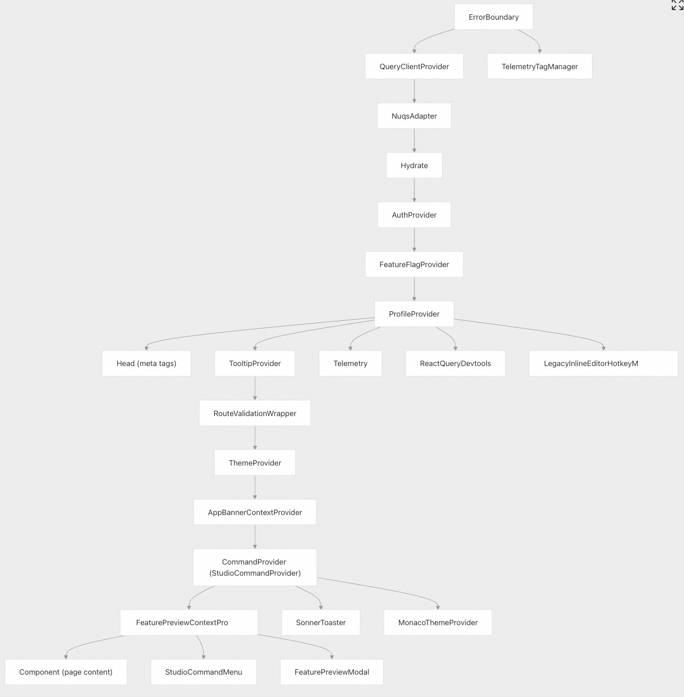
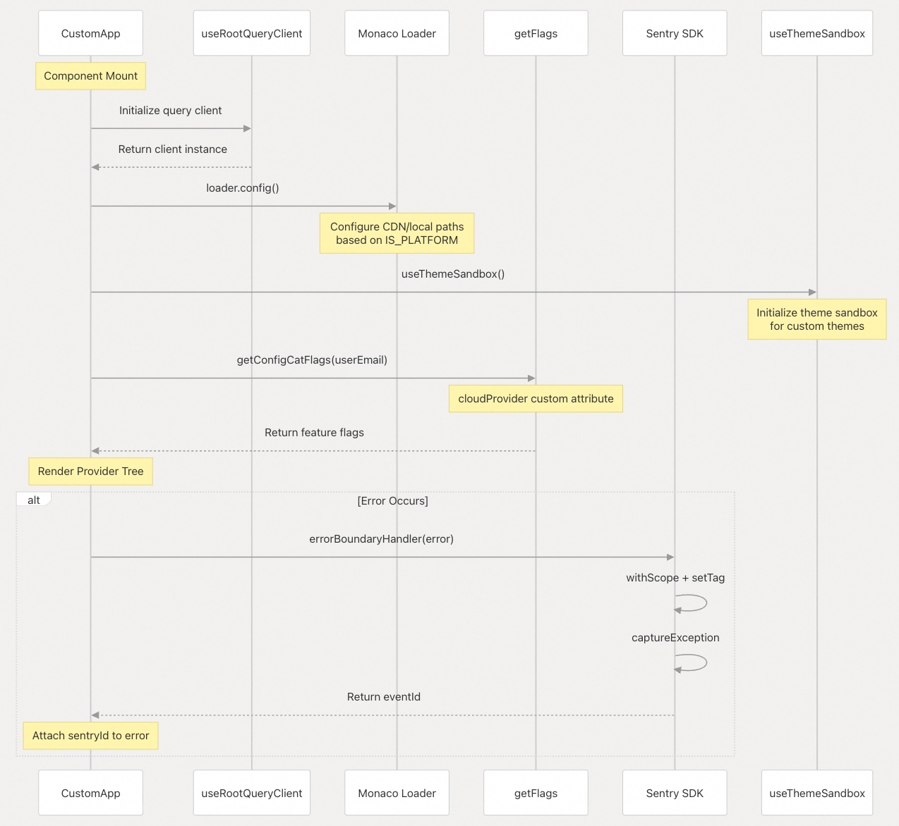
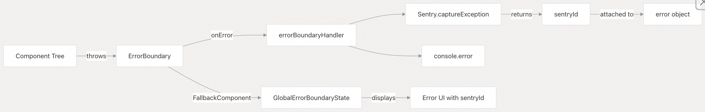
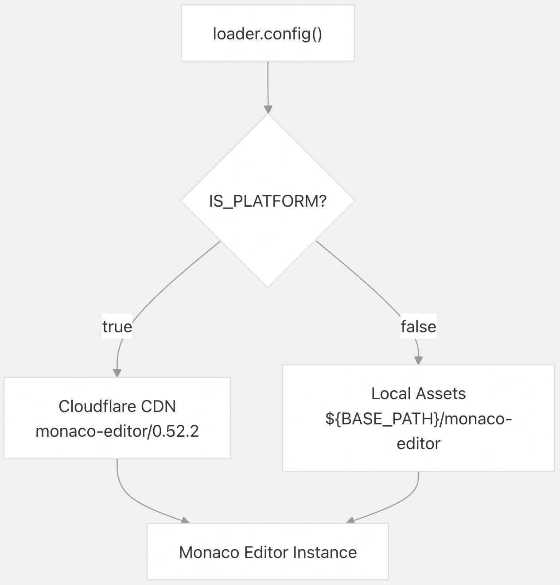
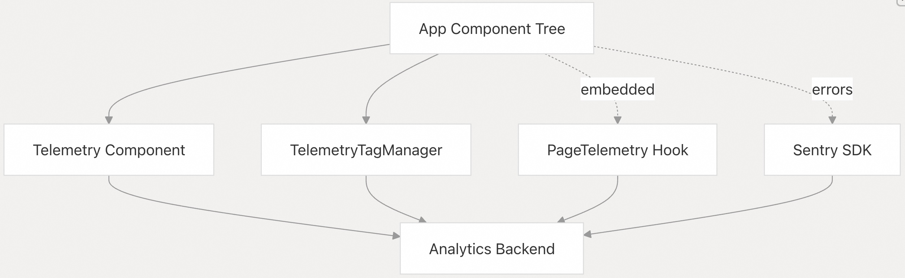
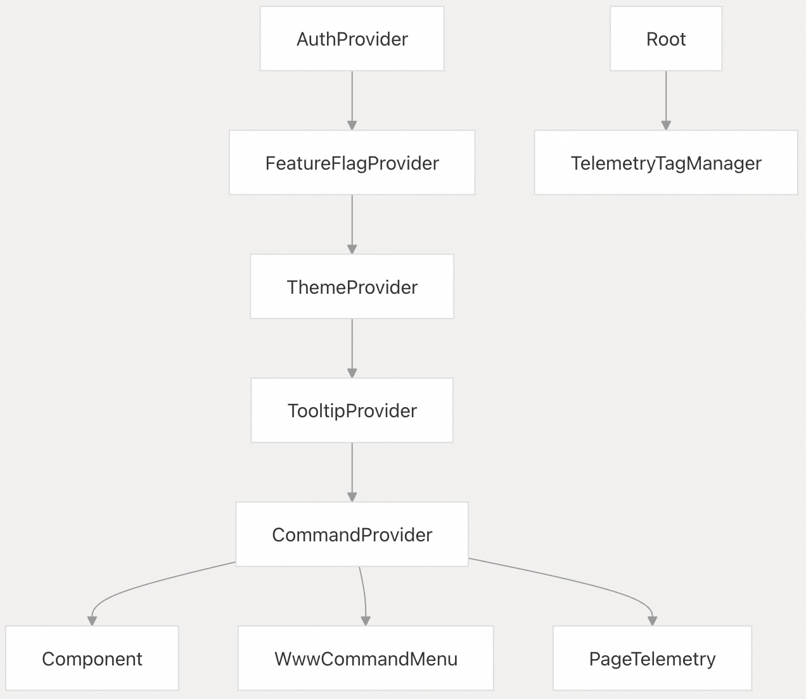
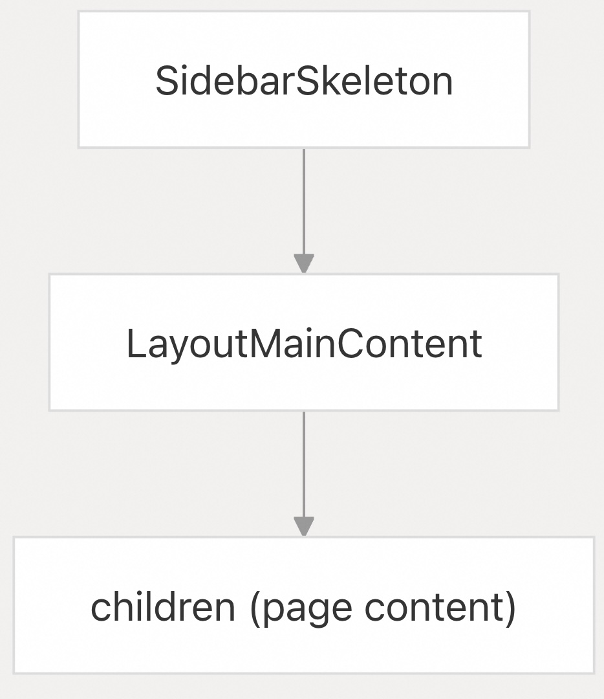
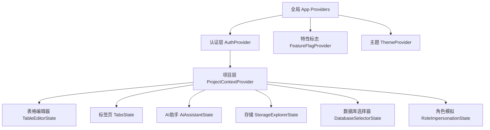

 ## Supabase 源码学习: 2.1.1 应用程序架构 (Application Architecture)
    
### 作者    
digoal    
    
### 日期    
2025-11-27    
    
### 标签    
Supabase , Firebase , 源码学习 , 后端即服务 , BaaS , backend platform , 后端平台 , 开源项目缝合 , 前端 , 后端 , 自动生成API , 数据库 , 包管理 , 日志    
    
----    
    
## 背景    
本文档描述了 **Studio Dashboard** 应用程序的架构 (Application Architecture)，重点关注其提供者 (Provider) 层次结构、全局状态管理 (Global State Management)、错误处理 (Error Handling) 和 Monaco 编辑器 (Editor) 集成。**Studio** 应用程序（`apps/studio`）作为 **Supabase** 项目的主要管理界面，需要通过嵌套的 **React Context** 提供者 (Providers) 进行复杂的（State）状态编排。

## 提供者 (Provider) 层次结构概览

**Studio** 应用程序采用了深度嵌套的提供者 (Provider) 结构来管理认证 (Authentication)、特性标志 (Feature Flags)、用户档案 (User Profiles)、主题 (Theming)、命令面板 (Command Palette) 和其他横切关注点 (Cross-cutting Concerns)。此架构确保所有组件都能访问必要的上下文 (Context)，同时保持清晰的职责分离。

### 完整的提供者树 (Complete Provider Tree)



来源: [`apps/studio/pages/_app.tsx` 1-183](https://github.com/supabase/supabase/blob/7490ca9e/apps/studio/pages/_app.tsx#L1-L183)

### 提供者职责 (Provider Responsibilities)

| Provider | 目的 (Purpose) | 关键属性/配置 (Key Props/Config) |
| :--- | :--- | :--- |
| `ErrorBoundary` | 集成 **Sentry** 的顶层错误捕获 (Top-level Error Catching) | `FallbackComponent={GlobalErrorBoundaryState}` |
| `QueryClientProvider` | 用于服务器状态管理 (Server State Management) 的 **React Query** 客户端 (Client) | `client={queryClient}` from `useRootQueryClient()` |
| `NuqsAdapter` | URL 搜索参数 (Search Parameter) 状态管理 | Pages router adapter (页面路由适配器) |
| `Hydrate` | 重新水合 (Rehydrates) 服务器端查询 (Query) 数据 | `state={pageProps.dehydratedState}` |
| `AuthProvider` | 认证状态 (Authentication State) 和 **GoTrue** 客户端 (Client) | From `lib/auth` (来自 `lib/auth`) |
| `FeatureFlagProvider` | **ConfigCat** 特性标志 (Feature Flags) | `enabled={IS_PLATFORM}`, `getConfigCatFlags` |
| `ProfileProvider` | 用户档案 (User Profile) 和组织 (Organization) 状态 | From `lib/profile` (来自 `lib/profile`) |
| `ThemeProvider` | 主题切换 (暗色/亮色/经典暗色) | `defaultTheme="system"`, `enableSystem` |
| `TooltipProvider` | 全局提示工具 (Tooltip) 配置 | `delayDuration={0}` |
| `RouteValidationWrapper` | 路由级别 (Route-level) 访问控制 (Access Control) | 自定义 Studio 组件 |
| `AppBannerContextProvider` | 顶层横幅通知 (Banner Notifications) | 自定义 Context |
| `CommandProvider` | 命令面板 (**Cmd+K**) 状态 | `StudioCommandProvider` 实现 |
| `FeaturePreviewContextProvider` | **Beta** 特性预览管理 | 自定义 Context |
| `MonacoThemeProvider` | **Monaco** 编辑器主题同步 | 与应用主题同步 |

来源: [`apps/studio/pages/_app.tsx` 86-183](https://github.com/supabase/supabase/blob/7490ca9e/apps/studio/pages/_app.tsx#L86-L183)

## 应用程序初始化流程 (Application Initialization Flow)

### 启动序列 (Startup Sequence)



来源: [`apps/studio/pages/_app.tsx` 86-118](https://github.com/supabase/supabase/blob/7490ca9e/apps/studio/pages/_app.tsx#L86-L118) [`apps/studio/pages/_app.tsx` 68-79](https://github.com/supabase/supabase/blob/7490ca9e/apps/studio/pages/_app.tsx#L68-L79)

### 关键初始化步骤 (Key Initialization Steps)

1.  **查询客户端设置 (Query Client Setup)**

      * 通过 `useRootQueryClient()` 检索共享的 **React Query** 客户端 (Client)。
      * 配置用于服务器状态同步 (Server State Synchronization) 和缓存 (Caching)。
        来源: [`apps/studio/pages/_app.tsx` 87](https://github.com/supabase/supabase/blob/7490ca9e/apps/studio/pages/_app.tsx#L87-L87)

2.  **自定义内容 Hook (Custom Content Hook)**

      * `useCustomContent(['app:title'])` 加载可自定义的应用标题 (App Title)。
      * 允许用于自托管部署 (Self-hosted Deployments) 的白标 (White-labeling)。
        来源: [`apps/studio/pages/_app.tsx` 88](https://github.com/supabase/supabase/blob/7490ca9e/apps/studio/pages/_app.tsx#L88-L88)

3.  **Monaco 编辑器配置 (Monaco Editor Configuration)**

      * 平台构建使用 **Cloudflare CDN**：`https://cdnjs.cloudflare.com/ajax/libs/monaco-editor/0.52.2/min/vs`
      * 自托管构建使用本地资源 (Local Assets)：`${BASE_PATH}/monaco-editor`
      * 减少对外部 **CDN** 的依赖，适用于气隙 (Air-gapped) 部署。
        来源: [`apps/studio/pages/_app.tsx` 68-79](https://github.com/supabase/supabase/blob/7490ca9e/apps/studio/pages/_app.tsx#L68-L79)

4.  **主题沙箱 (Theme Sandbox)**

      * `useThemeSandbox()` 启用实验性主题特性 (Experimental Theme Features)。
      * 支持自定义主题开发和测试。
        来源: [`apps/studio/pages/_app.tsx` 105](https://github.com/supabase/supabase/blob/7490ca9e/apps/studio/pages/_app.tsx#L105-L105)

5.  **ConfigCat 集成 (ConfigCat Integration)**

      * 传递云提供商 (Cloud Provider) 作为自定义属性 (Custom Attribute) 用于目标定位 (Targeting)。
      * 启用针对特定提供商的特性推出 (**AWS vs Azure vs GCP**)。
        来源: [`apps/studio/pages/_app.tsx` 86-118](https://github.com/supabase/supabase/blob/7490ca9e/apps/studio/pages/_app.tsx#L86-L118)

      ```
      const getConfigCatFlags = useCallback(
        (userEmail?: string) => {
          const customAttributes = cloudProvider ? { cloud_provider: cloudProvider } : undefined
          return getFlags(userEmail, customAttributes)
        },
        [cloudProvider]
      )
      ```

## 错误边界 (Error Boundary) 实现

### 错误处理架构 (Error Handling Architecture)



来源: [`apps/studio/pages/_app.tsx` 92-103](https://github.com/supabase/supabase/blob/7490ca9e/apps/studio/pages/_app.tsx#L92-L103) [`apps/studio/pages/_app.tsx` 120](https://github.com/supabase/supabase/blob/7490ca9e/apps/studio/pages/_app.tsx#L120-L120)

### 错误处理程序实现 (Error Handler Implementation)

错误边界处理程序执行三项关键操作：

1.  **Sentry 上下文增强 (Sentry Context Enhancement)**

      ```
      Sentry.withScope(function (scope) {
        scope.setTag('globalErrorBoundary', true)
        const eventId = Sentry.captureException(error)
      ```

      * 用 `globalErrorBoundary: true` 标记错误以便过滤 (Filtering)。
      * 能够区分捕获到 (Caught) 和未捕获到 (Uncaught) 的错误。
        来源: [`apps/studio/pages/_app.tsx` 93-95](https://github.com/supabase/supabase/blob/7490ca9e/apps/studio/pages/_app.tsx#L93-L95)

2.  **事件 ID 附加 (Event ID Attachment)**

      ```
      if (eventId && error && typeof error === 'object') {
        (error as any).sentryId = eventId
      }
      ```

      * 将 **Sentry** 事件 ID (Event ID) 附加到错误对象 (Error Object)。
      * 允许错误边界的回退 UI (Fallback UI) 显示跟踪信息。
        来源: [`apps/studio/pages/_app.tsx` 96-99](https://github.com/supabase/supabase/blob/7490ca9e/apps/studio/pages/_app.tsx#L96-L99)

3.  **控制台日志记录 (Console Logging)**

      * 记录完整的错误堆栈跟踪 (Stack Trace) 以进行开发调试。
      * 即使 **Sentry** 不可用，也能保留错误信息。
        来源: [`apps/studio/pages/_app.tsx` 102](https://github.com/supabase/supabase/blob/7490ca9e/apps/studio/pages/_app.tsx#L102-L102)

## Monaco 编辑器配置

### CDN 与本地资源 (Local Asset) 策略

**Monaco** 编辑器配置基于部署环境采用了双路径策略：



来源: [`apps/studio/pages/_app.tsx` 68-79](https://github.com/supabase/supabase/blob/7490ca9e/apps/studio/pages/_app.tsx#L68-L79)

### 实现细节 (Implementation Details)

**配置代码 (Configuration Code)**

```
loader.config({
  paths: {
    vs: IS_PLATFORM
      ? 'https://cdnjs.cloudflare.com/ajax/libs/monaco-editor/0.52.2/min/vs'
      : `${BASE_PATH}/monaco-editor`,
  },
})
```

来源: [`apps/studio/pages/_app.tsx` 68-79](https://github.com/supabase/supabase/blob/7490ca9e/apps/studio/pages/_app.tsx#L68-L79)

**设计理念 (Design Rationale)** :

  * **平台部署 (Platform deployments)** ：利用 **Cloudflare CDN** 以减少带宽和改进缓存。
  * **自托管部署 (Self-hosted deployments)** ：使用本地资源 (Local Assets) 以支持气隙环境 (Air-gapped Environments) 和避免 **ISP** 问题。
  * **版本锁定 (Version pinning)** ：锁定到 **Monaco 0.52.2** 以确保跨部署的一致性。
  * **最小资源子集 (Minimal asset subset)** ：基于网络标签分析，仅包含所需的 **Monaco** 文件（`vs`、`languages`、`workers`）。

**维护说明 (Maintenance Notes)**
来源: [`apps/studio/pages/_app.tsx` 69-73](https://github.com/supabase/supabase/blob/7490ca9e/apps/studio/pages/_app.tsx#L69-L73):

> 注释表明，这是通过在本地存储所需的 **Monaco** 资源来尝试离线支持/绕过 **ISP** 问题。另一种方案是完整的 `import * as monaco from 'monaco-editor'`，但未能成功。

## 遥测 (Telemetry) 与分析 (Analytics)

### 遥测系统架构 (Telemetry System Architecture)



来源: [`apps/studio/pages/_app.tsx` 168](https://github.com/supabase/supabase/blob/7490ca9e/apps/studio/pages/_app.tsx#L168-L168) [`apps/studio/pages/_app.tsx` 178](https://github.com/supabase/supabase/blob/7490ca9e/apps/studio/pages/_app.tsx#L178-L178) [`apps/studio/pages/_app.tsx` 21](https://github.com/supabase/supabase/blob/7490ca9e/apps/studio/pages/_app.tsx#L21-L21)

### 遥测组件 (Telemetry Components)

| 组件 (Component) | 目的 (Purpose) | 范围 (Scope) |
| :--- | :--- | :--- |
| `Telemetry` | 通用应用程序遥测跟踪 (General App Telemetry Tracking) | 全局，渲染一次 [`apps/studio/pages/_app.tsx` 168](https://github.com/supabase/supabase/blob/7490ca9e/apps/studio/pages/_app.tsx#L168-L168) |
| `TelemetryTagManager` | 标签管理器 (Tag Manager) 集成 (**GTM** / 类似) | 在主要提供者树之外 [`apps/studio/pages/_app.tsx` 178](https://github.com/supabase/supabase/blob/7490ca9e/apps/studio/pages/_app.tsx#L178-L178) |
| `Sentry Integration` | 错误跟踪 (Error Tracking) 和性能监控 (Performance Monitoring) | `@sentry/nextjs` [`apps/studio/pages/_app.tsx` 21](https://github.com/supabase/supabase/blob/7490ca9e/apps/studio/pages/_app.tsx#L21-L21) |

**放置策略 (Placement Strategy)** :

  * `Telemetry` 位于 `ProfileProvider` 内部，以访问用户上下文 (User Context)。
  * `TelemetryTagManager` 位于所有其他提供者树之外。

## Style and Asset Loading (样式和资产加载)

### CSS Import Order (CSS 导入顺序)

Studio 应用程序以特定的顺序加载样式，以确保正确的 **级联行为 (cascade behavior)**：

**全局样式 (Global Styles)**：
[`apps/studio/pages/_app.tsx` 1-18](https://github.com/supabase/supabase/blob/7490ca9e/apps/studio/pages/_app.tsx#L1-L18)

```
1. react-data-grid/lib/styles.css
2. styles/code.scss
3. styles/contextMenu.scss
4. styles/editor.scss
5. styles/graphiql-base.scss
6. styles/grid.scss
7. styles/main.scss
8. styles/markdown-preview.scss
9. styles/monaco.scss
10. styles/react-data-grid-logs.scss
11. styles/reactflow.scss
12. styles/storage.scss
13. styles/stripe.scss
14. styles/toast.scss
15. styles/typography.scss
16. styles/ui.scss
17. ui/build/css/themes/dark.css
18. ui/build/css/themes/light.css
```

**主题样式 (Theme Styles)**：最后加载，以确保 **主题覆盖 (theme overrides)** 正常工作。

**来源**:
[`apps/studio/pages/_app.tsx` 1-18](https://github.com/supabase/supabase/blob/7490ca9e/apps/studio/pages/_app.tsx#L1-L18)

### Custom Fonts (自定义字体)

字体通过 **内联样式标签 (inline style tag)** 注入，以配合 Next.js **字体优化 (font optimization)**：

**字体配置 (Font Configuration)**：
[`apps/studio/pages/_app.tsx` 136-141](https://github.com/supabase/supabase/blob/7490ca9e/apps/studio/pages/_app.tsx#L136-L141)

```
<style
  dangerouslySetInnerHTML={{
    __html: `:root{--font-custom:${customFont.style.fontFamily};--font-source-code-pro:${sourceCodePro.style.fontFamily};}`,
  }}
/>
```

**使用的字体 (Fonts Used)**：

  * `customFont`：主要 **用户界面字体 (Primary UI font)** [`apps/studio/pages/_app.tsx` 52](https://github.com/supabase/supabase/blob/7490ca9e/apps/studio/pages/_app.tsx#L52-L52)
  * `sourceCodePro`：代码的 **等宽字体 (Monospace font)** [`apps/studio/pages/_app.tsx` 52](https://github.com/supabase/supabase/blob/7490ca9e/apps/studio/pages/_app.tsx#L52-L52)

**来源**:
[`apps/studio/pages/_app.tsx` 52](https://github.com/supabase/supabase/blob/7490ca9e/apps/studio/pages/_app.tsx#L52-L52)
[`apps/studio/pages/_app.tsx` 136-141](https://github.com/supabase/supabase/blob/7490ca9e/apps/studio/pages/_app.tsx#L136-L141)

## Development vs Production Configuration (开发环境与生产环境配置对比)

### Environment-Specific Behavior (环境特定行为)

| 特性 (Feature) | 开发环境 (Development) | 测试/生产环境 (Test/Production) |
| :--- | :--- | :--- |
| React Query Devtools | 启用 (Enabled) [`apps/studio/pages/_app.tsx` 169-171](https://github.com/supabase/supabase/blob/7490ca9e/apps/studio/pages/_app.tsx#L169-L171) | 当 `NEXT_PUBLIC_NODE_ENV === 'test'` 时禁用 (Disabled) |
| ConfigCat | 使用代理 + 直接回退 (Uses proxy + direct fallback) | 使用代理 + 直接回退 (Uses proxy + direct fallback) |
| Monaco 资产 (Monaco Assets) | 基于 `IS_PLATFORM` 判定本地或 CDN (Local or CDN based on `IS_PLATFORM`) | 相同 (Same) |
| 错误报告 (Error Reporting) | 完整的 Sentry 集成 (Full Sentry integration) | 完整的 Sentry 集成 (Full Sentry integration) |

**测试环境检查 (Test Environment Check)**：
[`apps/studio/pages/_app.tsx` 107-171](https://github.com/supabase/supabase/blob/7490ca9e/apps/studio/pages/_app.tsx#L107-L171)

```
const isTestEnv = process.env.NEXT_PUBLIC_NODE_ENV === 'test'

{!isTestEnv && (
  <ReactQueryDevtools initialIsOpen={false} position="bottom-right" />
)}
```

**来源**:
[`apps/studio/pages/_app.tsx` 107](https://github.com/supabase/supabase/blob/7490ca9e/apps/studio/pages/_app.tsx#L107-L107)
[`apps/studio/pages/_app.tsx` 169-171](https://github.com/supabase/supabase/blob/7490ca9e/apps/studio/pages/_app.tsx#L169-L171)

## Comparison with Other Applications (与其他应用程序的对比)

### WWW App (Marketing Site) (WWW 应用程序 (营销网站))

**简化的 Provider 层次结构 (Simplified Provider Hierarchy)**：
[`apps/www/pages/_app.tsx` 31-117](https://github.com/supabase/supabase/blob/7490ca9e/apps/www/pages/_app.tsx#L31-L117)



**主要区别 (Key Differences)**：

  * 没有 `ProfileProvider`（不需要经过身份验证的用户上下文 (no authenticated user context needed)）
  * 没有 `QueryClientProvider`（最小化的服务器状态 (minimal server state)）
  * 使用 `PageTelemetry` 而非 `Telemetry` 组件
  * 使用 `WwwCommandMenu` 而非 `StudioCommandMenu`
  * 更简单的功能标志配置 (Simpler feature flag configuration)：`enabled={{ cc: true, ph: false }}`
  * 为 **发布周 (Launch Week)** 强制启用深色模式：`forcedTheme={forceDarkMode ? 'dark' : undefined}`

**来源**:
[`apps/www/pages/_app.tsx` 31-117](https://github.com/supabase/supabase/blob/7490ca9e/apps/www/pages/_app.tsx#L31-L117)

### Docs App (Documentation Portal) (Docs 应用程序 (文档门户))

**最小化架构 (Minimal Architecture)**：
[`apps/docs/layouts/guides/index.tsx` 1-24](https://github.com/supabase/supabase/blob/7490ca9e/apps/docs/layouts/guides/index.tsx#L1-L24)

Docs 应用程序使用 **布局组件 (layout components)**，而非复杂的 **Provider 层次结构 (provider hierarchy)**：



**特点 (Characteristics)**：

  * 没有 **身份验证 Provider (authentication providers)**（公共内容 (public content)）
  * 功能标志主要用于导航可见性 (navigation visibility)
  * 简单的 **布局组合 (layout composition)**：`SidebarSkeleton` + `LayoutMainContent`
  * 专注于 **内容渲染 (content rendering)**，而非 **状态管理 (state management)**

**来源**:
[`apps/docs/layouts/guides/index.tsx` 1-24](https://github.com/supabase/supabase/blob/7490ca9e/apps/docs/layouts/guides/index.tsx#L1-L24)
[`apps/docs/layouts/DefaultLayout.tsx` 1-8](https://github.com/supabase/supabase/blob/7490ca9e/apps/docs/layouts/DefaultLayout.tsx#L1-L8)

### Provider 对比表 (Provider Comparison Table)

| 提供者 (Provider) | Studio | WWW | Docs |
| :--- | :--- | :--- | :--- |
| `ErrorBoundary` (错误边界) | ✓ | ✗ | ✗ |
| `QueryClientProvider` (查询客户端 Provider) | ✓ | ✗ | ✓ (独立文件 (separate file)) |
| `AuthProvider` (身份验证 Provider) | ✓ | ✓ | ✗ |
| `FeatureFlagProvider` (功能标志 Provider) | ✓ (完整 (full)) | ✓ (有限 (limited)) | ✗ |
| `ProfileProvider` (用户资料 Provider) | ✓ | ✗ | ✗ |
| `ThemeProvider` (主题 Provider) | ✓ | ✓ | ✗ |
| `CommandProvider` (命令 Provider) | ✓ (Studio) | ✓ (WWW) | ✗ |
| `RouteValidationWrapper` (路由验证包装器) | ✓ | ✗ | ✗ |
| `MonacoThemeProvider` (Monaco 主题 Provider) | ✓ | ✗ | ✗ |

**来源**:
[`apps/studio/pages/_app.tsx` 1-183](https://github.com/supabase/supabase/blob/7490ca9e/apps/studio/pages/_app.tsx#L1-L183)
[`apps/www/pages/_app.tsx` 1-118](https://github.com/supabase/supabase/blob/7490ca9e/apps/www/pages/_app.tsx#L1-L183)
[`apps/docs/layouts/guides/index.tsx` 1-24](https://github.com/supabase/supabase/blob/7490ca9e/apps/docs/layouts/guides/index.tsx#L1-L24)

## 遗留迁移与维护 (Legacy Migrations and Maintenance)

### 内联编辑器热键迁移 (Inline Editor Hotkey Migration)

**临时组件 (Temporary Component)** [`apps/studio/pages/_app.tsx` 166-167](https://github.com/supabase/supabase/blob/7490ca9e/apps/studio/pages/_app.tsx#L166-L167)

```
{/* Temporary migration, to be removed by 2025-11-28 */}
<LegacyInlineEditorHotkeyMigration />
```

此组件将用户偏好设置从旧的热键系统 (hotkey system) 迁移到新的系统。该组件计划于 2025 年 11 月 28 日移除，表明这是一项计划中的技术债务 (technical debt) 清理工作。

**来源**: [`apps/studio/pages/_app.tsx` 166-167](https://github.com/supabase/supabase/blob/7490ca9e/apps/studio/pages/_app.tsx#L166-L167) [`apps/studio/pages/_app.tsx` 54](https://github.com/supabase/supabase/blob/7490ca9e/apps/studio/pages/_app.tsx#L54-L54)

### Monaco 资源管理 (Monaco Asset Management)

**维护挑战 (Maintenance Challenge)** [`apps/studio/pages/_app.tsx` 69-73](https://github.com/supabase/supabase/blob/7490ca9e/apps/studio/pages/_app.tsx#L69-L73)

> 评论 (Comment): "如果我们最终花费更多精力来维护此项工作，可能应该考虑使用 Cloudflare 或找到通过 CLI 从 CDN 拉取所有文件的方法，而不是跟踪单个文件"

当前方法是根据网络标签 (network tab) 分析来跟踪单个 Monaco 文件。潜在的未来改进包括：

1.  通过命令行工具 (CLI) 自动拉取 CDN 文件
2.  完全迁移到 Cloudflare
3.  完整的 Monaco 包捆绑 (package bundling)

**来源**: [`apps/studio/pages/_app.tsx` 68-79](https://github.com/supabase/supabase/blob/7490ca9e/apps/studio/pages/_app.tsx#L68-L79)

## 元配置 (Meta Configuration)

### Head 元素设置 (Head Element Setup)

**元标签 (Meta Tags)** [`apps/studio/pages/_app.tsx` 131-142](https://github.com/supabase/supabase/blob/7490ca9e/apps/studio/pages/_app.tsx#L131-L142)

```
<Head>
  <title>{appTitle ?? 'Supabase'}</title>
  <meta name="viewport" content="initial-scale=1.0, width=device-width" />
  <meta property="og:image" content={`${BASE_PATH}/img/supabase-logo.png`} />
  <meta name="googlebot" content="notranslate" />
  <style dangerouslySetInnerHTML={{
    __html: `:root{--font-custom:${customFont.style.fontFamily};--font-source-code-pro:${sourceCodePro.style.fontFamily};}`
  }} />
</Head>
```

**关键元标签 (Key Meta Tags)**：

  * 来自 `useCustomContent(['app:title'])` 的动态标题
  * 用于响应式设计 (responsive design) 的视口 (Viewport) 配置
  * 用于社交分享 (social sharing) 的 OpenGraph 图像
  * `googlebot` 的 `notranslate` 指令（防止自动翻译）
  * 内联字体 CSS 变量注入 (Inline font CSS variable injection)

**网站图标配置 (Favicon Configuration)** [`apps/studio/pages/_app.tsx` 143](https://github.com/supabase/supabase/blob/7490ca9e/apps/studio/pages/_app.tsx#L143-L143)

```
<MetaFaviconsPagesRouter applicationName="Supabase Studio" includeManifest />
```

**来源**: [`apps/studio/pages/_app.tsx` 131-143](https://github.com/supabase/supabase/blob/7490ca9e/apps/studio/pages/_app.tsx#L131-L143)

## Day.js 插件配置

Studio 应用程序通过多个插件扩展 (extends) 了 Day.js，用于时间/日期操作：

**已加载的插件 (Plugins Loaded)** [`apps/studio/pages/_app.tsx` 62-66](https://github.com/supabase/supabase/blob/7490ca9e/apps/studio/pages/_app.tsx#L62-L66)

```
dayjs.extend(customParseFormat)
dayjs.extend(utc)
dayjs.extend(timezone)
dayjs.extend(relativeTime)
dayjs.extend(duration)
```

| 插件 (Plugin) | 用途 (Purpose) |
| :--- | :--- |
| `customParseFormat` | 使用自定义格式 (custom formats) 解析日期 |
| `utc` | UTC 时间操作 (time manipulation) |
| `timezone` | 时区转换 (Timezone conversions) |
| `relativeTime` | “2 小时前”的相对时间格式 (relative time formatting) |
| `duration` | 时间长度计算 (Time duration calculations) |

**来源**: [`apps/studio/pages/_app.tsx` 24-29](https://github.com/supabase/supabase/blob/7490ca9e/apps/studio/pages/_app.tsx#L24-L29) [`apps/studio/pages/_app.tsx` 62-66](https://github.com/supabase/supabase/blob/7490ca9e/apps/studio/pages/_app.tsx#L62-L66)

-----

# 附录1: 核心架构问题：深度嵌套 Provider 的性能与维护挑战

**【角度：架构师/资深开发者】**

架构描述中指出 **Studio Dashboard** 使用了**深度嵌套的提供者 (Provider) 结构**来管理从认证、特性标志到主题的各种跨越关注点。在大型 **React** 应用程序中，这种结构可能会导致 **“上下文地狱”（Context Hell）** 和因顶层 Context 变化而引起的**不必要组件重渲染 (Re-rendering)** 的**背景痛点**。

**关键问题：**

> **Supabase** 是如何确保这套深度嵌套的 **Provider** 体系在**日常使用**中仍能保持高性能和高响应性的？具体而言，在**日常维护**和开发中，**架构师或开发者**采用了哪些特定的性能优化策略（例如：使用 **Selector/Observer** 模式，或对 Context 进行精细化的**分拆/懒加载**）来有效解决不必要的重渲染，并确保状态变更只影响到最小范围的组件？

## 回答

## Supabase Studio 的 Provider 性能优化策略

Supabase Studio 通过多种策略确保深度嵌套的 Provider 结构保持高性能，主要包括分层架构、状态管理优化和精细化 Context 分拆。

### 核心优化策略

#### 1. 分层 Provider 架构

Studio 采用分层 Provider 架构，将不同关注点的 Provider 分离到不同层级：

- **全局层**：在 `_app.tsx` 中管理应用级状态如认证、特性标志、主题  
- **项目层**：在 `ProjectContextProvider` 中管理项目特定状态  
- **布局层**：在 `DefaultLayout` 中管理 UI 相关状态  

#### 2. 状态管理优化

使用 **valtio** 作为主要状态管理库（在 `package.json` 中定义），它基于 Proxy 的响应式系统避免了 Context 的重渲染问题  。

#### 3. Context 精细化分拆

将大型 Context 拆分为多个专门的 Provider：



#### 4. 状态生命周期管理

使用 `key` 属性强制重新创建状态，确保项目切换时状态隔离：

```tsx
<TableEditorStateContextProvider key={`table-editor-state-${projectRef}`}>
  <TabsStateContextProvider key={`tabs-state-${projectRef}`}>
    {/* 其他项目级 Provider */}
  </TabsStateContextProvider>
</TableEditorStateContextProvider>
```  

#### 5. 懒加载和条件渲染

- **条件 Provider**：只在需要时渲染特定 Provider，如 `showProductMenu` 条件渲染  
- **客户端检测**：使用 `isClient` 状态避免服务端渲染问题  

#### 6. 本地存储优化

特性预览 Context 使用 localStorage 进行状态持久化，减少重复计算：

```tsx
const [flags, setFlags] = useState(() =>
  FEATURE_PREVIEWS.reduce((a, b) => {
    return { ...a, [b.key]: false }
  }, {})
)
```  

### 跨应用一致性

所有 Supabase 应用（Studio、Docs、WWW）都采用类似的 Provider 分层策略，确保架构一致性：

- **Studio**：最复杂的 Provider 嵌套，包含项目级状态管理  
- **Docs**：简化的 Provider 结构，专注于文档功能  
- **WWW**：营销网站的轻量级 Provider 配置  

## Notes

- Studio 的 Provider 架构虽然深度嵌套，但通过分层管理和状态隔离有效避免了 Context Hell
- valtio 的使用是关键性能优化，它提供了比 Context 更细粒度的响应式更新
- 项目级 Provider 使用 `key` 属性确保状态在项目间正确隔离和重置
- 条件渲染和懒加载进一步减少了不必要的组件创建和重渲染


-----

# 附录2: 运维问题：Monaco 编辑器双路径策略的技术债务与自动化

**【角度：开发者/运维工程师】**

为了支持自托管部署的**气隙 (Air-gapped) 环境**和解决 **ISP** 问题，**Monaco 编辑器配置**采用了 **“CDN 与本地资源”的双路径策略** ，并手动锁定了版本并维护了**最小资源子集**。这种定制化的解决方案虽然解决了**背景痛点**，但也增加了复杂性。

**关键问题：**

> 这种定制化的 **Monaco** 资源管理策略（本地存储、版本锁定）的**维护动作**是否已经通过 **Supabase** 的构建系统（例如 **Next.js/webpack**）完全自动化和抽象化，以减少**日常运维**负担？在未来进行**Monaco** 或其他外部依赖的**版本升级**时，开发者如何避免因手动维护的“最小资源子集”而引入额外的**技术债务**和高昂的**维护成本**？

## 回答


Monaco编辑器的资源管理策略**未完全自动化**。版本锁定在`_app.tsx`中硬编码为0.52.2  ，构建系统仅通过webpack规则处理模块解析  ，但资源子集的维护仍需手动操作。

---

## 详细分析

### 当前实现状态

**双路径策略配置**：
Monaco编辑器在`apps/studio/pages/_app.tsx`中通过`loader.config()`配置路径策略  ：
- 平台环境：使用CDN `https://cdnjs.cloudflare.com/ajax/libs/monaco-editor/0.52.2/min/vs`
- 自托管环境：使用本地路径 `${BASE_PATH}/monaco-editor`

**构建系统集成**：
webpack配置在`next.config.js`中修改了模块规则以支持Monaco编辑器  ，但仅处理模块解析，不涉及资源管理。

### 维护自动化程度

**未完全自动化的部分**：
1. **版本锁定**：版本号0.52.2硬编码在代码中，无自动化更新机制
2. **资源子集维护**：注释显示仅存储所需资源，但无自动化脚本管理
3. **手动维护负担**：开发者需手动跟踪和更新Monaco资源

### 技术债务风险

**升级挑战**：
- 版本升级需要手动修改多处代码
- 最小资源子集需要重新评估和提取
- 缺乏自动化测试验证资源完整性

### 建议改进方向

1. **版本管理自动化**：通过构建脚本从package.json读取版本
2. **资源同步机制**：创建CLI工具自动下载和更新本地资源
3. **依赖管理优化**：考虑使用Monaco的npm包替代CDN策略

## Notes

当前实现解决了气隙环境和ISP问题，但确实增加了维护复杂性。构建系统提供了基础支持，但资源管理的核心动作仍需人工干预。建议团队考虑开发专门的资源管理工具来降低技术债务。


-----

# 附录3: 安全与隐私问题：错误边界中用户上下文的界限

**【角度：用户/安全审计师/产品经理】**

架构中的 **错误边界 (Error Boundary)** 通过 **Sentry** 集成，能够捕获顶层错误并附加 **Event ID**，允许回退 UI 显示跟踪信息。然而，**Telemetry** 系统和 **ProfileProvider** 也位于 Provider 树中，包含用户数据。

**关键问题：**

> **Studio** 的 **Sentry** 错误处理机制在**日常使用**中是如何严格执行数据隐私原则的？当错误边界捕获错误并生成报告时，**需要展开的细节**是：系统是否会（或被配置为不会）在 Sentry 事件中包含**敏感的用户上下文 (User Context)** ，例如 `ProfileProvider` 中存储的个人身份信息（PII）、当前会话 **Token** 或操作的项目数据？**背景知识**是：为了在提供高价值错误报告和遵守严格的**数据隐私安全**之间取得平衡，**Supabase** 采取了哪些具体的过滤或数据脱敏措施？


## 回答

## Studio的Sentry错误处理与数据隐私保护机制

Studio通过多层防护措施确保Sentry错误报告不包含敏感用户数据，同时保持错误诊断的有效性。

### 核心隐私保护措施

#### 1. 用户身份匿名化
`Telemetry`组件使用SHA-256哈希算法对用户ID进行不可逆匿名化处理  ，确保Sentry只能看到哈希值而非原始用户ID：

```typescript
const getAnonId = async (id: string) => {
  const encoder = new TextEncoder()
  const data = encoder.encode(id)
  const hashBuffer = await crypto.subtle.digest('SHA-256', data)
  // ...转换为base64字符串
}
```

#### 2. 严格的发送前过滤
`instrumentation-client.ts`中的`beforeSend`函数实施多重检查  ：

- **同意检查**：只有在用户同意(`hasConsented()`)且为平台环境(`IS_PLATFORM`)时才发送  
- **第三方错误过滤**：过滤掉非应用静态文件产生的错误（如浏览器扩展）  
- **特定错误类型过滤**：忽略hCaptcha相关错误、无效URL错误、会话超时错误等  

#### 3. 数据脱敏处理
- **URL参数清理**：导航面包屑中的URL哈希参数会被清理  
- **面包屑数据清理**：所有面包屑数据通过`sanitizeArrayOfObjects`函数处理  

### 错误边界实现

全局错误边界(`ErrorBoundary`)在`_app.tsx`中实现  ，仅捕获错误并生成Sentry事件ID，不附加任何用户上下文数据：

```typescript
const errorBoundaryHandler = (error: Error, info: ErrorInfo) => {
  Sentry.withScope(function (scope) {
    scope.setTag('globalErrorBoundary', true)
    const eventId = Sentry.captureException(error)
    // 仅附加事件ID到错误对象
    if (eventId && error && typeof error === 'object') {
      ;(error as any).sentryId = eventId
    }
  })
}
```

### ProfileProvider数据处理

`ProfileProvider`虽然包含用户数据，但其错误处理仅发送消息而非敏感数据  ：

```typescript
onError: (error) => {
  if (error.code === 409) {
    Sentry.captureMessage('Profile already exists: ' + error.message)
  } else {
    Sentry.captureMessage('Failed to create users profile: ' + error.message)
  }
}
```

## Notes

- Studio的Sentry配置通过`beforeSend`回调实现了严格的数据过滤，确保只有经过处理的错误数据被发送
- 用户ID的SHA-256哈希处理确保了用户身份的匿名化
- 系统明确过滤了多种非关键错误类型，减少了数据传输量同时保护隐私
- ProfileProvider的错误处理仅发送错误消息，不包含PII数据
- URL和面包屑数据的清理确保了导航信息中的敏感参数被移除


    
#### [PolarDB 学习图谱](https://www.aliyun.com/database/openpolardb/activity "8642f60e04ed0c814bf9cb9677976bd4")
  
  
#### [PostgreSQL 解决方案集合](../201706/20170601_02.md "40cff096e9ed7122c512b35d8561d9c8")
  
  
#### [德哥 / digoal's Github - 公益是一辈子的事.](https://github.com/digoal/blog/blob/master/README.md "22709685feb7cab07d30f30387f0a9ae")
  
  
#### [About 德哥](https://github.com/digoal/blog/blob/master/me/readme.md "a37735981e7704886ffd590565582dd0")
  
  

  
