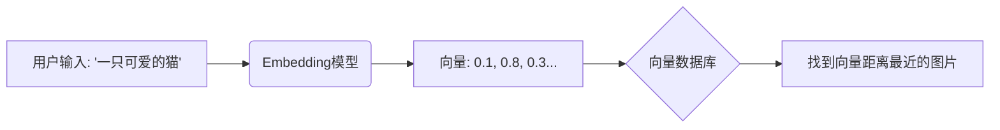
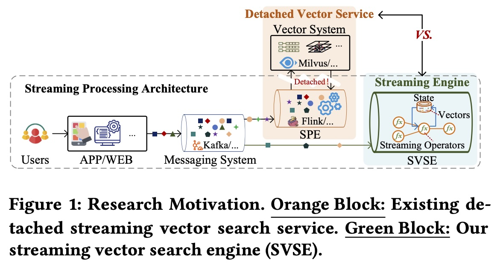
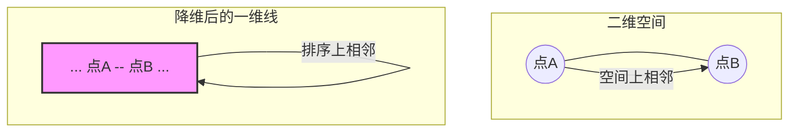
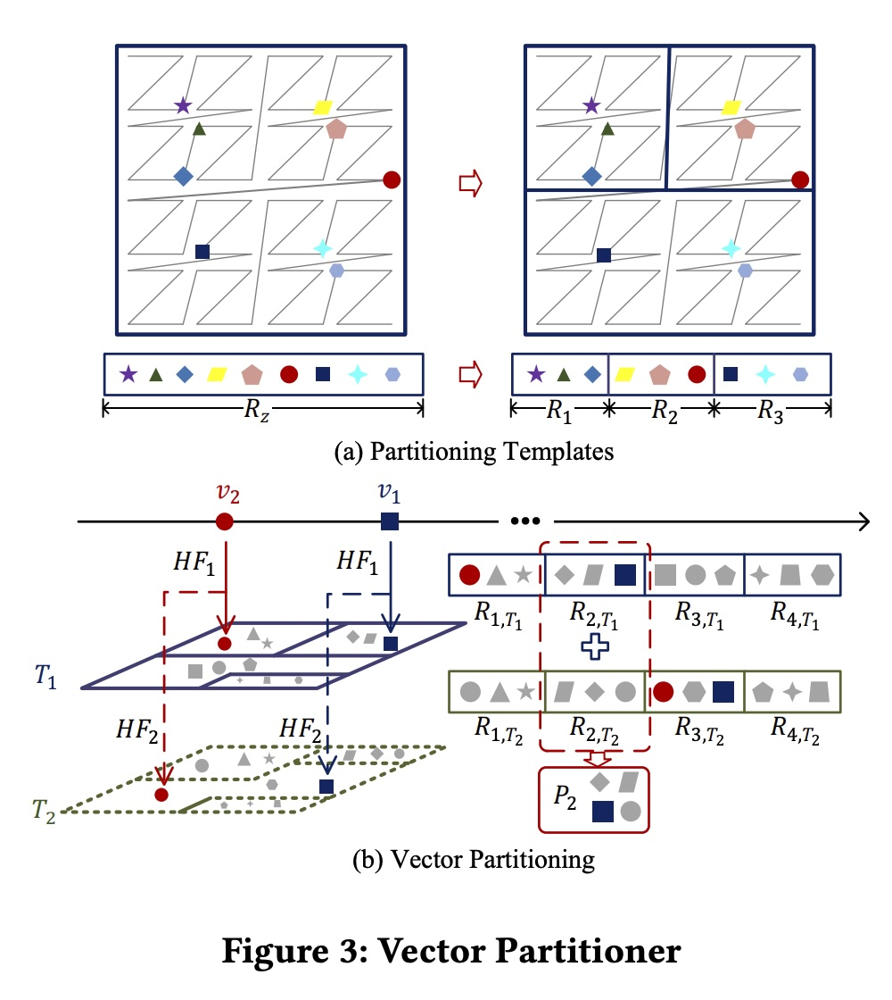
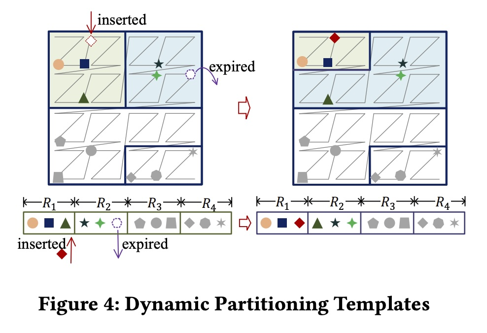
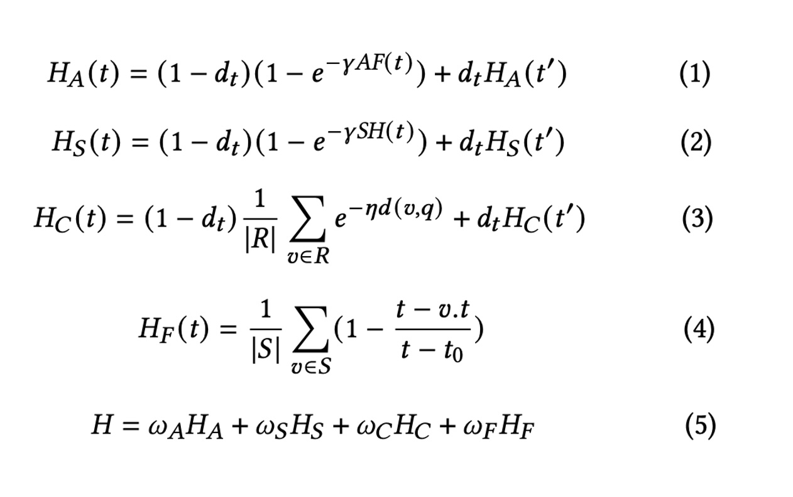
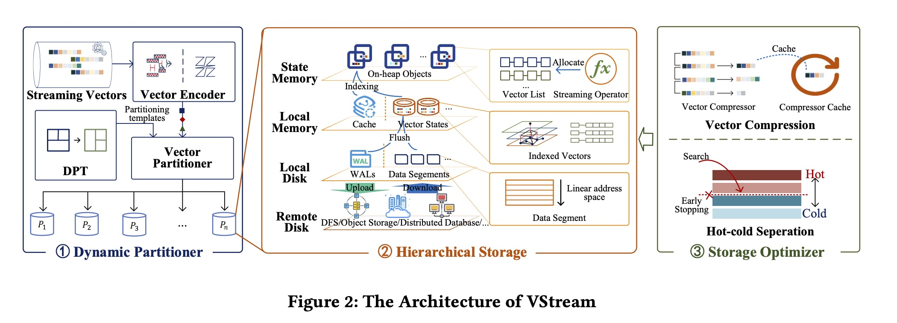
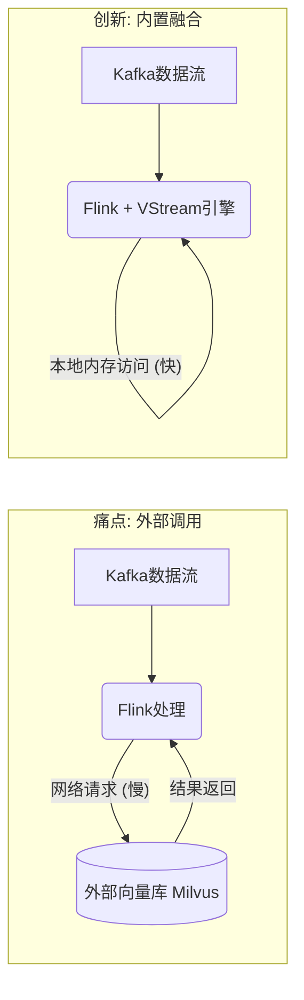

## AI论文解读 | VStream: A Distributed Streaming Vector Search System
        
### 作者        
digoal        
        
### 日期        
2025-11-27        
        
### 标签        
PostgreSQL , PolarDB , DuckDB , AI , 论文解读        
        
----        
        
## 背景  
      
https://www.vldb.org/pvldb/vol18/p1593-gao.pdf        
  
提示:          
```          
读懂《VStream: A Distributed Streaming Vector Search System》这篇论文需要提前掌握哪些基础知识, 请使用中文通熟易懂的讲解这些基础知识, 可以引用论文中的图、表或使用Markdown支持的图形(text,mermaid等)增加解释性. 
  
使用中文通熟易懂的解读《VStream: A Distributed Streaming Vector Search System》这篇论文, 其中的关键内容请着重讲解, 可以引用论文中的图、表或使用Markdown支持的图形(text,mermaid等)增加解释性. 
  
提取《VStream: A Distributed Streaming Vector Search System》这篇论文中的重要术语, 使用中文对这些术语进行通熟易懂的讲解, 可以引用论文中的图、表或使用Markdown支持的图形(text,mermaid等)增加解释性. 
```     
  
## 1 前置知识 
  
要读懂《VStream: A Distributed Streaming Vector Search System》这篇论文，你需要跨越两个核心领域的知识鸿沟： **“向量检索（Vector Search）”** 和 **“流式计算（Stream Processing）”** 。此外，论文还涉及了一些特定的**分布式系统**和**算法**知识。

为了帮助你轻松理解，我将这些基础知识拆解为四个模块，并配合通俗的解释和图表。

-----

### 1\. 核心概念：什么是“向量检索” (Vector Search)？

**通俗解释：**
想象你在图书馆找一本书。传统数据库是按“书名”或“书号”精确查找（关键词匹配）。但如果你只记得“这是一本关于如何在火星种土豆的科幻小说”，传统数据库就很难办了。
向量检索是把文本、图片、音频都变成一组数字（**向量/Embedding**）。在这个数字空间里，含义相近的东西距离更近。“火星种土豆”和《火星救援》在空间上挨得很近。

**你需要掌握的关键点：**

  * **Embedding (嵌入):** 将非结构化数据（图片、文本）转换成高维向量的过程 。
  * **KNN vs. ANN:**
      * **KNN (K-Nearest Neighbors):** 精确找出最近的K个邻居。缺点：数据量大时太慢，要算几亿次距离。
      * **ANN (Approximate Nearest Neighbor):** 近似最近邻。牺牲一点点精度，换取极快的速度。**VStream 就是为了解决 ANN 问题**。
  * **索引结构 (HNSW):** 论文中提到了 HNSW 。你可以把它想象成“空间里的高速公路网”，通过分层结构快速定位到目标区域，而不需要遍历所有数据。




-----

### 2\. 核心架构：什么是“流式计算” (Stream Processing)？

**通俗解释：**

  * **批处理 (Batch):** 就像去水库打水，攒满一桶再处理。传统的向量系统（如 Milvus 早期版本）通常是外部服务，数据攒一批导进去建索引 。
  * **流处理 (Streaming):** 就像接自来水管，水（数据）来一滴处理一滴。**VStream 的核心创新就是把向量检索直接做进了流处理引擎里** 。

**你需要掌握的关键点：**

  * **Apache Flink:** VStream 是基于 Flink 构建的 。Flink 是目前最流行的流计算引擎。
  * **State (状态):** 在流计算中，程序需要“记住”之前处理过的数据（比如计算过去一小时的平均值）。VStream 巧妙地利用 Flink 的 **State Backend** 来存储向量数据 ，而不是存到外部数据库。
  * **Source & Sink:** 数据的源头（如 Kafka）和出口。

> **论文图解关联：** 论文 **Figure 1**  展示了传统架构（左边橙色块，外挂数据库）和 VStream 架构（右边绿色块，融合在流引擎内部）的区别。
  
 

-----

### 3\. 分布式挑战：如何切分蛋糕 (Partitioning)？

当数据量达到十亿级（Billion-scale）时，一台机器存不下，必须分给多台机器存。这就涉及**分区 (Partitioning)** 。

**基础知识：**

  * **ID Partitioning (哈希分区):** 按 ID 随机分。简单，但查询时必须问遍所有机器（Scatter-Gather），效率低 。
  * **Spatial Partitioning (空间分区):** 按向量的相似度分。相似的向量存在同一台机器上。查询时只需要问少数几台机器。

**VStream 用的高级技巧 (需要简单了解)：**

1.  **LSH (局部敏感哈希):** 一种哈希算法，保证相似的内容哈希值也相同或相近 。
2.  **空间填充曲线 (Space Filling Curves):** 比如 **Z-order curve** 或 **Hilbert curve**。
      * *作用：* 它可以把二维或高维的空间（地图），“一笔画”连成一条线（一维）。这样就可以把高维向量映射成一个简单的数字进行排序和切分，同时保持空间相邻性 。

**图解空间填充曲线 (Z-curve):**



*理解这个概念，你就能看懂论文 **Figure 3** 和 **Figure 4** 关于动态分区的操作了。*

 

 

-----

### 4\. 存储优化：LSM-Tree 与 压缩算法

VStream 为了快且省钱，设计了复杂的存储结构 。这部分涉及数据库内核知识。

**基础知识：**

  * **LSM-Tree (Log-Structured Merge-tree) 思想:**
      * 写入时先写内存（快）。
      * 内存满了“刷写”到磁盘（变成不可变文件）。
      * 磁盘文件多了进行“合并”。
      * **VStream 的分层存储 (Hierarchical Storage)**  就是类似思想：State Memory (热) -\> Local Memory -\> Local Disk -\> Remote Disk (冷)。
  * **WAL (Write-Ahead Log):** 预写日志。在把数据真正存好之前，先记一笔流水账。如果系统崩溃，重启后可以通过 WAL 恢复数据，保证不丢数据 。
  * **Gorilla 压缩算法:**
      * Facebook 发明的一种针对时间序列浮点数的压缩算法。
      * *原理：* 记录数值的**变化量 (XOR)** 而不是数值本身。因为相邻向量可能数值相近，记录差值可以省很多空间。VStream 改进了它来压缩向量 。

-----

### 总结：读论文时的思维导图

当你阅读这篇 PDF 时，可以按照这个路径将知识点串联起来：

1.  **背景 (Introduction):** 现在的 AI 应用（如推荐系统）数据产生得太快了，我们要用 **流计算 (Flink)** 来处理。
2.  **痛点 (Motivation):** 以前是“流计算引擎”调用“外部向量数据库”，网络开销大，延迟高。我们想把它们**合二为一**。
3.  **挑战 1 (Partitioning):** 数据流是动态的，怎么分片？
      * *知识点：* **LSH + 空间填充曲线** (把相似向量分到一起)。
4.  **挑战 2 (Storage):** 内存存不下咋办？磁盘又太慢。
      * *知识点：* **分层存储 (类似 LSM-Tree)** + **Gorilla 压缩** (省空间)。
5.  **挑战 3 (Efficiency):** 怎么查得更快？
      * *知识点：* **冷热分离** (基于访问频率，热数据放内存优先查)。

掌握了以上这些基础，你再去读论文中的具体公式（如公式 1-5）和架构图（Figure 2），就会感觉像在看拼图，每一块都能找到对应的位置。


  
  
## 2 解读论文 
  
这是一篇关于**大数据流式计算**与**向量检索**深度融合的顶会论文（PVLDB 2025）。为了让你轻松读懂，我将它拆解为“背景痛点”、“核心方案”、“三大关键技术”和“性能效果”四个部分。

-----

### 1\. 核心背景：为什么要发明 VStream？

**现状痛点：**
现在的推荐系统或搜索引擎，数据产生得非常快（比如抖音的用户实时点击流）。我们需要把这些数据变成向量，存起来供后续检索。
目前的通用做法是“**两张皮**”（Detached Architecture）：

1.  **流计算引擎**（如 Flink）负责处理实时数据。
2.  **向量数据库**（如 Milvus, Qdrant）负责存向量和查向量。

**问题在于**：Flink 处理完数据，必须通过网络发给外部的 Milvus，查完再发回来。这种“跨部门沟通”导致了两个大问题：

  * **慢**：网络传输和系统切换带来了高延迟 。
  * **更新难**：传统向量库更擅长批量处理，面对每秒几千条的实时写入流，索引更新效率低 。

**VStream 的思路：**
不要外挂数据库，直接把向量检索引擎**做进**流计算引擎里！
VStream 是业界第一个专门为流式处理设计的分布式向量检索引擎（SVSE），它就像是给 Flink 引擎装上了一个“内置向量大脑” 。



-----

### 2\. 三大核心技术挑战与解决方案

要在流式引擎里直接做向量检索，并不容易。论文提出了三个主要挑战，并一一给出了极其巧妙的解法。

#### 挑战一：数据怎么分片？（动态分区器）

**问题**：传统做法是按 ID 哈希分片，这会导致查询时必须问遍所有节点（Scatter-Gather），效率很低。而且流式数据的分布是会变的（比如白天大家搜新闻，晚上搜娱乐），固定分片会导致负载不均 。

**VStream 方案：基于 LSH 和空间填充曲线的动态分区**

  * **把相似的放在一起**：利用 LSH（局部敏感哈希）和 Z-order 曲线，把高维向量映射到一维空间，保证相似的向量在存储上也是相邻的 。
  * **动态调整地盘**：系统会实时监控每个分区的负载。如果某个分区（比如“娱乐类”）数据太多，它会自动分裂；反之则合并。这就是**动态分区模板 (DPT)** 。

> **直观理解**：
> 以前是按“身份证号”分班，找个喜欢打篮球的人得去所有班级问。
> VStream 是按“兴趣”分班，打篮球的都在一班。而且如果打篮球的人变多了，一班自动拆成两个班。

#### 挑战二：海量数据存在哪？（分层存储架构）

**问题**：内存快但贵（存不下海量向量），磁盘大但慢（实时检索跟不上）。

**VStream 方案：四级流水线存储**
VStream 设计了一个金字塔式的存储结构，数据像流水一样从上往下流 ：

| 层级 | 名称 | 介质 | 存放内容 | 速度 |
| :--- | :--- | :--- | :--- | :--- |
| **L1** | **State Memory** | 堆内内存 (On-heap) | 最热、最新的少量数据，直接用于计算 | 极快  |
| **L2** | **Local Memory** | 堆外内存 (Off-heap) | 较新的数据，构建了内存索引 | 快  |
| **L3** | **Local Disk** | 本地 SSD | 也就是 **Data Segments**，历史数据 | 中等  |
| **L4** | **Remote Disk** | S3 / HDFS | 超大规模的冷数据归档 | 慢  |

*注：VStream 利用了流计算引擎的 Checkpoint 机制来保证数据一致性 。*

#### 挑战三：如何查得更快？（存储优化器）

**问题**：即使分了层，磁盘 I/O 依然是瓶颈。

**VStream 方案：两个“加速器”**

1.  **向量压缩 (Vector Compression)** ：
      * 利用 **Gorilla 算法** 的变体。因为 VStream 已经把相似向量排在一起了，相邻向量的数值很接近。
      * 它不存原始值，而是存“差值”（XOR 运算后的结果）。这能极大压缩空间，减少磁盘读取量 。
2.  **冷热分离 (Hot-cold Separation)** ：
      * 根据查询频率、新鲜度给数据打分。
      * **热数据**（常被搜的）会被放在更容易访问的位置。
      * **提前终止 (Early Stopping)** ：在搜索时，如果已经找到了足够好的结果（通常在热数据区），就直接停止，不再去搜冷数据区 。

-----

### 3\. VStream 的核心数据结构：Data Segment

为了支持磁盘上的快速检索，VStream 设计了一种特殊的文件格式叫 **Data Segment** 。

```text
[ Data Segment 结构图解 ]
------------------------------------------------
| 1. Vector Area       | 存具体的向量数据 (压缩后)
------------------------------------------------
| 2. kNN Index Area    | 存索引 (如 HNSW 图结构)
------------------------------------------------
| 3. Vector Address    | 存向量的物理地址映射
------------------------------------------------
| 4. Meta Area         | 存元数据 (统计信息)
------------------------------------------------
```

这种结构支持直接把索引加载到内存，而向量数据按需读取，平衡了性能和内存占用 。

-----

### 4\. 实验效果：真的比 Milvus 强吗？

论文在 10 个物理节点的集群上，使用了 10 亿级规模的数据集（SIFT1B, Deep1B）进行了对比测试 。

**竞争对手**：Milvus, Chroma DB, Qdrant 。

**关键战绩**：

1.  **查询延迟 (Query Latency)** ：
      * 在高吞吐场景下（9.5k ops/s），VStream 的查询效率比现有系统提升了 **115倍 到 1127倍** 。
      * *原因*：VStream 就在流引擎内部，没有跨网络开销，且动态分区减少了搜索范围 。
2.  **资源消耗**：
      * CPU 使用率降低了 **2.2-2.5倍** 。
      * 内存占用降低了 **1.5-2.0倍** 。
3.  **召回率 (Recall)** ：
      * 在相同条件下，VStream 的召回率高于 Milvus。因为 Milvus 需要“积攒一批”数据才能构建索引，导致实时数据有时查不到，而 VStream 是实时处理的 。

-----

### 5\. 总结

**VStream** 的核心逻辑是： **“近水楼台先得月”** 。

通过将向量检索能力**内嵌**到 Flink 这样的流式引擎中，并配合**动态分区**（解决分布不均）和**分层存储**（解决存不下），VStream 成功解决了实时大数据场景下“写入快”和“查询快”不可兼得的难题。

**一句话总结**：如果你需要处理超高速的实时数据流，并要求毫秒级的向量检索响应，VStream 是比外挂 Milvus 更高效的选择。
  
## 3 术语 
  
《VStream: A Distributed Streaming Vector Search System》是一篇将**流式计算（Streaming）** 和 **向量检索（Vector Search）** 深度融合的系统论文。论文中的重要术语，都是围绕如何解决在**实时、海量、动态**数据流下进行高效向量搜索这一核心问题而提出的。

以下是论文中关键术语的通俗易懂讲解，并引用了论文思想来辅助理解。

---

### 1. 核心系统与架构对比

#### 术语一：VStream (Streaming Vector Search System)

* **中文全称：** 分布式流式向量检索系统
* **通俗解释：** 想象一下，你有一个水龙头（数据流）不断流出水（实时数据），而你需要一个能实时过滤和识别这些水滴的机器。传统的向量数据库是水桶（批量处理），VStream 是一个**内嵌在水管里**的智能过滤器。
* **关键点：** VStream 的核心创新在于**融合架构**。它不是一个独立的外部数据库，而是将向量检索能力直接构建在流式计算引擎（如 Apache Flink）的内部，从而消除了网络延迟和外部服务调用开销，实现真正的实时向量搜索。

#### 术语二：Detached Architecture (分离式架构)

* **中文解释：** 分离式架构
* **通俗解释：** 这是 VStream 出现之前，主流向量搜索系统的运行模式。
* **问题描述：** 流式计算引擎（如 Flink）处理数据后，必须通过**网络**把数据发送给**外部独立的**向量数据库（如 Milvus, Vespa）进行索引和查询。这种架构就像两个部门隔着一座山用对讲机沟通，沟通成本高，速度慢，尤其在数据量大时，延迟非常高。VStream 的提出正是为了解决这种架构带来的次优性能。

---

### 2. 挑战一：流式适应性与动态分区

#### 术语三：Dynamic Partitioner (动态分区器)

* **中文解释：** 动态分区器
* **通俗解释：** 向量数据库需要把数据分配给不同的机器存储（分区）。传统的分配方式是固定的。但流式数据的特点是**分布会随时间变化**（例如，早上用户搜索“新闻”的向量多，晚上搜索“电影”的向量多）。动态分区器就像一个智能的“土地管理员”，能根据实时的数据流量和向量的相似性，**自动调整**每台机器负责的数据范围，确保每台机器的负载均衡。
* **价值：** 解决了流式场景下，数据分布不均导致的负载倾斜问题，提高了系统的可扩展性和稳定性。

#### 术语四：LSH-Z (LSH-based Z-order curve)

* **中文解释：** 基于局部敏感哈希的 Z 阶曲线
* **通俗解释：** 这是实现“动态分区器”的核心技术。
    * **目标：** 在高维空间中，相似的向量应该被分到同一台机器上，这样查询时就不用问遍所有机器了。
    * **LSH (局部敏感哈希):** 一种哈希算法，能把相似的向量分配到相同的“篮子”里。
    * **Z-order Curve (Z 阶曲线):** 一种空间填充曲线，能将多维空间中的点，映射成一个一维的数字。这就像把一个地图上的所有位置，按某种顺序“一笔画”连起来，然后你可以通过这个数字对所有位置进行排序和切分。
* **结合作用：** VStream 先用 LSH 对向量进行初步聚类，再用 Z-order Curve 将这些聚类结果映射成一维的数字，然后根据数字范围进行高效的分区和动态调整。

---

### 3. 挑战二：系统可扩展性与存储

#### 术语五：Hierarchical Storage Architecture (分层存储架构)

* **中文解释：** 分层存储架构
* **通俗解释：** 为了解决“内存贵但快，磁盘便宜但慢”的矛盾，VStream 将存储介质分成了四个层次，数据从最快最热的内存层，流向最慢最冷的远程磁盘层，实现了一个存储金字塔。
    * **L1 (State Memory):** 最热、最新的数据，在 Flink 状态内存中。
    * **L2 (Local Memory):** 较热的数据，在堆外内存中。
    * **L3 (Local Disk):** 历史数据，存储在本地 SSD 上。
    * **L4 (Remote Disk):** 大规模冷数据归档，存储在 HDFS 或 S3 上。
* **意义：** 这种设计最大限度地利用了不同存储介质的优势，既能存储海量数据（L3/L4），又能保证实时检索的性能（L1/L2）。

#### 术语六：Streaming State Management (流式状态管理)

* **中文解释：** 流式状态管理
* **通俗解释：** 这是 VStream 能实现分层存储的**技术基石**。流计算引擎（Flink）需要一种机制来“记住”它处理过的数据，这个机制就是**状态管理**。VStream 巧妙地利用了 Flink 内置的状态管理能力来存储和管理所有的向量数据和索引。
* **好处：** Flink 的状态管理天然支持容错和一致性（通过 Checkpoint 机制），VStream 继承了这些能力，确保了即使系统宕机，向量数据也不会丢失，并且数据写入和索引构建能自动与流式 Checkpoint 机制同步。

---

### 4. 挑战三：实时响应与查询优化

#### 术语七：Data Segment (数据段)

* **中文解释：** 数据段
* **通俗解释：** Data Segment 是 VStream 存储在磁盘上的基本文件单元。一个 Data Segment 文件中不仅存有压缩后的**向量数据**，还存有用于快速查询的 **kNN 索引**（如 HNSW 图结构）和各种**元数据**。
* **设计目的：** 这种结构设计是为了提高磁盘 I/O 效率。系统在查询时可以直接将 Data Segment 里的索引（很小）加载到内存中进行搜索，而只需要按需读取特定的向量数据，大大减少了磁盘读取量。

#### 术语八：Vector Compression (Gorilla-based) (向量压缩)

* **中文解释：** 向量压缩（基于 Gorilla 算法）
* **通俗解释：** 为了节省存储空间和减少网络传输（及磁盘 I/O），VStream 对向量数据进行了压缩。它使用的是 **Gorilla 算法**的思想。
* **原理：** 由于 VStream 的动态分区器把相似的向量放得很近，因此相邻向量的数值很可能非常接近。Gorilla 算法（原本用于时间序列数据）不是存储每个向量的完整值，而是存储它们之间的**差异（Delta-of-Delta）** ，并用 **XOR** 运算进行高效编码。这种方法能以很小的精度损失换取巨大的压缩比。

#### 术语九：Dynamic Hot-Cold Patterns (动态冷热模式)

* **中文解释：** 动态冷热模式/分离
* **通俗解释：** 就像图书馆里，有的书每天都被借阅（热数据），有的书一年没人碰一次（冷数据）。VStream 会根据**查询频率**和**数据新鲜度**来实时判断哪些向量是“热”的，哪些是“冷”的。
* **优化作用：**
    1.  **存储分配：** 热数据优先存储在 L1、L2 这样的快速存储层。
    2.  **查询加速：** 在进行向量搜索时，系统会优先搜索热数据区域。当找到足够多的近邻结果后，可以执行**提前终止（Early Stopping）** ，停止搜索冷数据，从而极大地提高了查询响应速度。
  
## 参考        
         
https://www.vldb.org/pvldb/vol18/p1593-gao.pdf    
        
<b> 以上内容基于DeepSeek、Qwen、Gemini及诸多AI生成, 轻微人工调整, 感谢杭州深度求索人工智能、阿里云、Google等公司. </b>        
        
<b> AI 生成的内容请自行辨别正确性, 当然也多了些许踩坑的乐趣, 毕竟冒险是每个男人的天性.  </b>        
  
    
#### [PolarDB 学习图谱](https://www.aliyun.com/database/openpolardb/activity "8642f60e04ed0c814bf9cb9677976bd4")
  
  
#### [PostgreSQL 解决方案集合](../201706/20170601_02.md "40cff096e9ed7122c512b35d8561d9c8")
  
  
#### [德哥 / digoal's Github - 公益是一辈子的事.](https://github.com/digoal/blog/blob/master/README.md "22709685feb7cab07d30f30387f0a9ae")
  
  
#### [About 德哥](https://github.com/digoal/blog/blob/master/me/readme.md "a37735981e7704886ffd590565582dd0")
  
  

  
