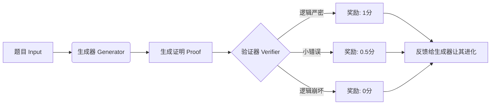
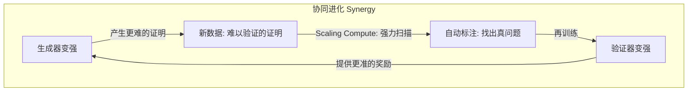
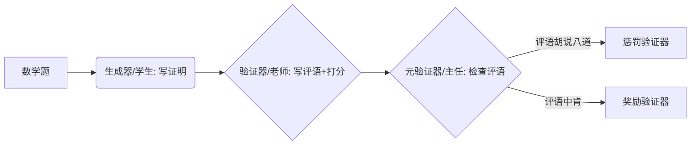
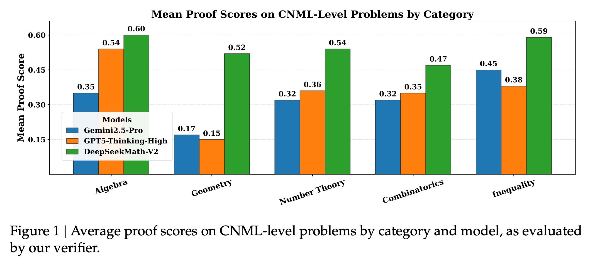
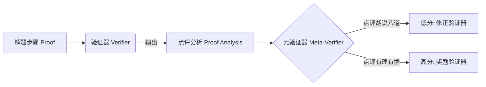
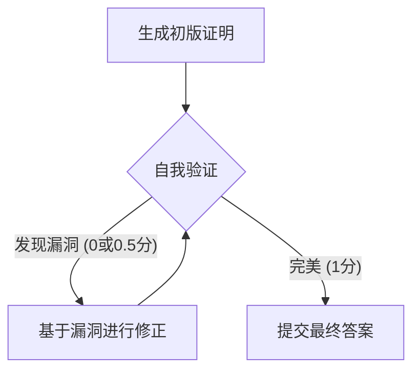

## AI论文解读 | DeepSeekMath-V2: Towards Self-Verifiable Mathematical Reasoning
        
### 作者        
digoal        
        
### 日期        
2025-11-28        
        
### 标签        
PostgreSQL , PolarDB , DuckDB , AI , 论文解读        
        
----        
        
## 背景  
      
https://github.com/deepseek-ai/DeepSeek-Math-V2/blob/main/DeepSeekMath_V2.pdf        
  
提示:          
```          
读懂《DeepSeekMath-V2: Towards Self-Verifiable Mathematical Reasoning》这篇论文需要提前掌握哪些基础知识, 请使用中文通熟易懂的讲解这些基础知识, 可以引用论文中的图、表或使用Markdown支持的图形(text,mermaid等)增加解释性. 
  
使用中文通熟易懂的解读《DeepSeekMath-V2: Towards Self-Verifiable Mathematical Reasoning》这篇论文, 其中的关键内容请着重讲解, 可以引用论文中的图、表或使用Markdown支持的图形(text,mermaid等)增加解释性. 
  
提取《DeepSeekMath-V2: Towards Self-Verifiable Mathematical Reasoning》这篇论文中的重要术语, 使用中文对这些术语进行通熟易懂的讲解, 可以引用论文中的图、表或使用Markdown支持的图形(text,mermaid等)增加解释性. 
```     
  
## 1 前置知识 
  
阅读《DeepSeekMath-V2: Towards Self-Verifiable Mathematical Reasoning》这篇论文，你需要理解它是如何通过“自我验证”来提升大模型解决复杂数学证明题能力的。

为了帮你轻松读懂，我将基础知识分为四个核心板块，并使用通俗的比喻和图解来解释。

-----

### 1\. 数学推理的任务差异：计算 vs. 证明

首先，你需要理解这篇论文解决的问题与普通数学题有什么不同。

  * **定量推理 (Quantitative Reasoning)** ：

      * **定义**：类似于做填空题。比如计算 $12 \times 12$ 或解方程。
      * **AI 的现状**：目前的 AI（如之前的 DeepSeekMath-V1 或 GPT-4）通过“结果奖励”（Outcome Reward）已经做得很好 。只要最后答案对了，AI 就觉得自己做对了。
      * **局限性**：答案对不代表过程对（可能是蒙的），且无法处理不需要数字答案的题目 。

  * **定理证明 (Theorem Proving)** ：

      * **定义**：类似于做几何大题或奥数证明题（如 IMO、Putnam 竞赛）。
      * **核心**：没有简单的“答案数字”，重点是**逻辑推导的严密性** 。
      * **论文目标**：DeepSeekMath-V2 专注于此，它需要像人类专家一样，一步步写出严谨的推导过程 。

**图解任务区别：**

| 特性 | 定量推理 (旧方法) | 定理证明 (本文重点) |
| :--- | :--- | :--- |
| **例子** | AIME, HMMT 竞赛题 | IMO (国际奥数), Putnam |
| **评判标准** | 最终答案是否匹配 (Match Answer) | 逻辑是否严密 (Rigorous Derivation) |
| **验证难点** | 容易 (直接比对数字) | 很难 (需要懂数学的人读过程) |
| **引用** |  |  |

-----

### 2\. 强化学习 (RL) 与 验证器 (Verifier)

要读懂论文的方法论部分，必须了解大模型是如何通过强化学习“进化”的。

#### 基础概念：生成器与验证器

  * **生成器 (Generator / Actor)** ：负责做题的学生。它生成解题步骤。
  * **验证器 (Verifier / Critic)** ：负责批改的老师。它不仅看答案，还看过程，并打分。
  * **奖励模型 (Reward Model)** ：在 RL 中，模型每走一步或做完一题，环境会给一个反馈（奖励）。在本文中，验证器充当了奖励模型的角色 。

#### 论文中的评分机制

这篇论文不再是简单的“对/错”，而是引入了更细致的评分标准 ：

  * **1分**：完美，逻辑严密。
  * **0.5分**：大体正确，有小瑕疵。
  * **0分**：有重大逻辑漏洞。




-----

### 3\. “元验证” (Meta-Verification)：监管“批改老师”

这是论文中一个非常有趣且关键的概念。

  * **问题**：如果负责批改的“老师”（验证器）水平很烂，乱扣分或者瞎给分怎么办？模型会学坏（Reward Hacking）。论文提到，验证器很容易产生幻觉，指鹿为马 。
  * **解决方案 - 元验证**：这是一个“教导主任”，专门用来检查“老师”批改得对不对。
  * **工作流程**：
    1.  生成器写出解答。
    2.  验证器写出“点评分析”。
    3.  **元验证器 (Meta-Verifier)** 检查这个“点评分析”是否合理 。

> **通俗理解**：  
>  
>   * **做题**：解这道微积分题。  
>   * **验证**：指出解题步骤第3行公式用错了。  
>   * **元验证**：检查解题步骤第3行其实是**对**的，所以“验证”在胡说八道。  

论文通过这种机制，确保 AI 能够真正识别出逻辑错误，而不是瞎猜 。

-----

### 4\. 自我验证 (Self-Verification) 与 迭代进化

这是 DeepSeekMath-V2 的核心灵魂。你需要理解为什么模型需要“自省”。

  * **自我验证 (Self-Verification)** ：
    模型在输出最终答案前，自己先生成解题步骤，然后自己扮演验证器给自己找茬（Self-Analysis），最后修正错误 。这就像我们在考试交卷前，自己在草稿纸上检查一遍。

  * **迭代进化循环 (The Loop)** ：
    论文描述了一个“左脚踩右脚上天”的螺旋上升过程 ：

    1.  **验证器更强**：能挑出更隐蔽的毛病。
    2.  **生成器更强**：为了拿高分，必须写出更无懈可击的证明。
    3.  **数据更难**：生成器写出了以前没见过的复杂证明。
    4.  **自动标注**：用算力换数据，把这些新证明自动标注好，反过来再训练验证器 。




### 总结：读论文时的关注点

当你阅读这篇论文时，带着以下视角会非常顺畅：

1.  **看它怎么克服“只看答案”的弊端**：关注它如何定义 0/0.5/1 的评分标准（Section 2.1.1）。
2.  **看它怎么防止 AI 瞎指挥**：关注 Meta-Verification 是如何训练的（Section 2.1.2）。
3.  **看它怎么让 AI 自己改错**：关注 Proof Generation 中是如何要求模型先写 Proof 再写 Self-Evaluation 的（Section 2.2.2）。
4.  **看结果**：看它在 IMO（奥数）和 Putnam（大学生竞赛）上的分数提升，证明了这种“严谨逻辑训练”是有效的 。

掌握了这些，你就可以开始阅读正文了！
  
## 2 解读论文 
  
这篇论文 **《DeepSeekMath-V2: Towards Self-Verifiable Mathematical Reasoning》** 展示了 DeepSeek 团队在大模型数学推理领域的最新突破。

简单来说，他们不再满足于让 AI 仅仅算出“正确答案”（像做填空题），而是训练 AI 像数学家一样进行**严谨的定理证明**（像做奥数大题），并且具备**自我纠错**的能力。

以下是这篇论文的通俗解读，重点讲解了它是如何做到的。

-----

### 1\. 核心背景：为什么要搞“自我验证”？

在过去，训练数学 AI（如 DeepSeekMath-V1）主要靠“结果奖励”：只要 AI 算出的最终数字是对的，就给奖励 。

  * **旧方法的局限**：这种方法适合做填空题（AIME 等），但对于需要严密逻辑的**定理证明**（如 IMO 国际奥数、Putnam 竞赛）完全失效。因为这些题没有简单的数字答案，且即便答案对了，过程可能是瞎蒙的 。
  * **新目标**：DeepSeekMath-V2 的目标是让 AI不仅能解题，还能**验证**自己的推理过程是否严密，就像人类专家一样一步步检查逻辑 。

-----

### 2\. 核心方法：三大法宝

为了实现这一目标，团队设计了一套复杂的训练系统，我们可以把它比喻为一个 **“学生-老师-教导主任”** 的进化系统。

#### 法宝一：训练一个会批改的“老师” (Proof Verification)

首先，团队训练了一个**验证器（Verifier）** ，它的角色是老师。它不直接做题，而是专门给解题过程找茬 。

  * **评分标准**：验证器会将证明过程分为三档 ：
      * **1分**：完美，逻辑严密，无懈可击。
      * **0.5分**：思路对了，但有小错误或细节遗漏。
      * **0分**：逻辑有重大漏洞或完全错误。

#### 法宝二：引入“教导主任”进行元验证 (Meta-Verification)

这是论文的一个大亮点。团队发现，“老师”（验证器）有时候也会乱批改，比如为了拿奖励而瞎编错误（幻觉） 。于是，他们引入了**元验证（Meta-Verification）** 。

  * **角色**：教导主任。
  * **任务**：它不看数学题本身，而是看“老师”写的评语 。它会检查：“老师”指出的那个错误真的存在吗？“老师”给的分数合理吗？
  * **作用**：通过这种监管，强制验证器必须诚实、准确地指出逻辑漏洞，不能指鹿为马 。




#### 法宝三：让“学生”学会自省 (Self-Verification)

当“老师”足够强后，团队开始训练**生成器（Generator）** ，也就是做题的“学生”。

  * **以前的 AI**：只管输出答案，不管对错，像是在赌博。
  * **现在的 AI**：被要求输出两部分内容—— **“解答过程” + “自我评价”** 。
  * **关键机制**：如果 AI 做错了，但它在“自我评价”中诚实地承认“我这里好像推导不严谨”，它反而会获得奖励！ 。
  * **结果**：AI 学会了在交卷前自己检查，尽可能修补漏洞；实在修补不了时，它会诚实地指出来，而不是硬凑答案 。

-----

### 3\. 进化循环：左脚踩右脚上天

DeepSeekMath-V2 的强大来自于一个**自动化的迭代循环**。

随着“学生”（生成器）越来越强，它生成的证明越来越复杂，旧的“老师”（验证器）可能看不懂了。这时，团队利用算力生成大量数据，自动标注新的难题，重新训练“老师”，让“老师”也升级。

这个过程就像武侠小说里的左右互搏，两者交替上升 。

**图解迭代过程：**

| 阶段 | 动作 | 目的 |
| :--- | :--- | :--- |
| **Step 1** | 训练验证器 (老师) | 学会找逻辑漏洞 |
| **Step 2** | 训练生成器 (学生) | 利用老师的反馈，学会写严谨证明 |
| **Step 3** | **自我验证 (Self-Verify)** | 学生学会自己检查作业，不仅做对，还要知其所以然 |
| **Step 4** | 扩大规模 (Scaling) | 生成海量难题，自动筛选出最难的用来升级老师  |

-----

### 4\. 惊人的战绩 (Experimental Results)

这套方法训练出来的 DeepSeekMath-V2 在数学竞赛中取得了极高的成绩，完全超越了简单的计算能力。

#### 核心战绩概览 

  * **Putnam 2024 (普特南数学竞赛)** ：这是北美最顶尖的本科生数学竞赛。
      * DeepSeekMath-V2 得分： **118 / 120** (近乎满分)。
      * 人类最高分： **90**。AI 已经超越了人类最顶尖选手的表现。
  * **IMO 2025 (国际奥数)** ：
      * 解决了 6 道题中的 5 道，达到**金牌水平**。
  * **CMO 2024 (中国奥数)** ：
      * 同样达到**金牌水平**。

#### 对比其他模型

在处理像 IMO 这种高难度证明题时，DeepSeekMath-V2 在代数、几何、数论等各个领域都显著优于 GPT-5-Thinking-High 和 Gemini 2.5-Pro 。

*(注：该图基于论文 Figure 1 数据重绘，展示了 DeepSeekMath-V2 在各学科上的领先优势 )*

  

-----

### 5\. 总结：这篇论文告诉了我们什么？

1.  **从“做对”到“严谨”** ：数学 AI 的下一步不仅仅是算出答案，而是要像数学家一样进行可验证的逻辑推导 。
2.  **诚实是第一生产力**：通过奖励模型承认错误（Self-Verification），AI 的推理能力反而得到了质的飞跃。它不再为了得分而撒谎 。
3.  **自动化的未来**：通过“元验证”和自动标注，AI 可以自我产生高质量训练数据，不再完全依赖人类专家的手工标注 。

DeepSeekMath-V2 证明了，让模型**自我验证**是通向解决未解数学难题（Research-level Mathematics）的一条可行之路 。
  
## 3 术语 
  
这篇论文引入了许多关于大模型数学推理的新颖概念。为了让你轻松读懂，我提取了其中的**7个核心术语**，并使用通俗易懂的语言配合图表进行解读。

-----

### 1\. 定理证明 (Theorem Proving) vs. 定量推理 (Quantitative Reasoning)

这是理解论文的前提，也是 DeepSeekMath-V2 与以往模型最大的区别。

  * **定量推理 (Quantitative Reasoning)** ：
      * **含义**：类似于做填空题或计算题，最后只需要一个具体的数字答案 。
      * **局限**：模型可能为了凑出正确答案而“瞎蒙”过程，这种只看结果的训练方式被称为“结果奖励” 。
  * **定理证明 (Theorem Proving)** ：
      * **含义**：类似于做几何证明大题。题目往往不需要算出一个数，而是要求给出一段严密的逻辑推导，证明某个结论成立 。
      * **论文重点**：DeepSeekMath-V2 专注于此，旨在解决那些无法简单用数字核对答案的复杂数学问题 。

| 特性 | 定量推理 (旧模式) | 定理证明 (新模式 - 本文) |
| :--- | :--- | :--- |
| **例子** | 计算 $12 \times 15 = ?$ | 证明对于所有质数 $p$ ，... |
| **评判** | 答案数字对不对 | 逻辑推导是否严密  |
| **难度** | 容易验证 | 难以自动验证  |

-----

### 2\. 证明验证器 (Proof Verifier) —— “阅卷老师”

在强化学习中，光有做题的学生（模型）是不够的，还需要一个能改卷子的老师。

  * **含义**：这是一个专门训练出来的模型，用来检查解题过程的质量 。
  * **评分标准**：它不再非黑即白，而是按三个档次打分 ：
      * **1分**：完美。逻辑严密，步骤清晰。
      * **0.5分**：大体正确。逻辑通顺，但有小瑕疵或细节遗漏。
      * **0分**：错误。有重大逻辑漏洞或没做出来。

> **通俗理解**：以前的 AI 训练是“只要答案对就给糖吃”；现在的验证器是“必须步骤写得漂亮才给糖吃”。

-----

### 3\. 元验证 (Meta-Verification) —— “教导主任”

这是论文中最具创新性的术语之一。

  * **问题**：“阅卷老师”（验证器）也是 AI，它也会犯错，甚至为了某种目的乱改卷子（产生幻觉，指鹿为马） 。
  * **含义**：引入第二层验证机制，专门检查“阅卷老师”的评语写得对不对 。
  * **工作流程**：
    1.  验证器输出一段“点评分析”。
    2.  **元验证器**检查这段分析是否合理，指出的错误是否真实存在 。




这一机制大大减少了验证器的误判，确保它是一个公正的“老师” 。

-----

### 4\. 自我验证 (Self-Verification) —— “自省”

这是模型最终具备的能力，也是论文标题的核心。

  * **含义**：模型在生成解答后，通过**自我分析 (Self-Analysis)** 来评估自己的解题质量 。
  * **机制**：模型被训练按照验证器的标准，自己给自己找茬。如果模型能诚实地指出自己证明中的漏洞，它会获得奖励 。
  * **目的**：让模型从“盲目自信”变为“严谨求实”，宁愿承认没做出来，也不要编造错误的证明 。

-----

### 5\. 顺序修正 (Sequential Refinement) —— “多轮修改”

针对很难的一道题，人类很难一次性写出完美证明，AI 也是如此。

  * **含义**：模型先写一版草稿，然后进行自我验证。如果发现有问题，就把草稿和自我评价作为输入，重新生成一版更好的证明 。
  * **过程**：这个过程可以循环多次（例如最多 8 次），直到模型觉得自己写得完美（自评 1 分）或者达到次数上限 。




实验显示，随着修正轮数的增加，解题正确率（Pass@1）显著上升 。

-----

### 6\. 生成-验证差距 (Generation-Verification Gap)

这是一个指导训练策略的重要概念。

  * **含义**：通常来说，**检查**一道题比**做**一道题要容易。这个难度差就是“差距” 。
  * **应用**：
      * 如果验证器太强，生成器怎么做都拿不到分，训练会卡住。
      * 如果生成器太强（写出的证明太高深），验证器看不懂，也就没法指导。
  * **策略**：论文提出要通过不断升级验证器（使用更多算力自动标注数据），确保证明验证器始终比生成器“高明”一点点，这样才能持续拉动生成器进步 。

-----

### 7\. 冷启动数据 (Cold Start Data)

在训练的最开始，模型什么都不会，怎么教它？

  * **含义**：构建第一批高质量训练数据的方法 。
  * **做法**：
    1.  收集大量数学竞赛题（如 AoPS 题库） 。
    2.  用更强的模型（如 DeepSeek-V3.2-Exp-Thinking）生成一堆解题草稿，并强制它多轮修改以提高质量 。
    3.  找**人类数学专家**对这些草稿进行评分（0/0.5/1），作为最初的教材 。

有了这批“冷启动数据”，才能训练出第一代的“阅卷老师”（验证器），开启后续的自动化进化之路。
  
## 参考        
         
https://github.com/deepseek-ai/DeepSeek-Math-V2/blob/main/DeepSeekMath_V2.pdf    
        
<b> 以上内容基于DeepSeek、Qwen、Gemini及诸多AI生成, 轻微人工调整, 感谢杭州深度求索人工智能、阿里云、Google等公司. </b>        
        
<b> AI 生成的内容请自行辨别正确性, 当然也多了些许踩坑的乐趣, 毕竟冒险是每个男人的天性.  </b>        
  
    
#### [PolarDB 学习图谱](https://www.aliyun.com/database/openpolardb/activity "8642f60e04ed0c814bf9cb9677976bd4")
  
  
#### [PostgreSQL 解决方案集合](../201706/20170601_02.md "40cff096e9ed7122c512b35d8561d9c8")
  
  
#### [德哥 / digoal's Github - 公益是一辈子的事.](https://github.com/digoal/blog/blob/master/README.md "22709685feb7cab07d30f30387f0a9ae")
  
  
#### [About 德哥](https://github.com/digoal/blog/blob/master/me/readme.md "a37735981e7704886ffd590565582dd0")
  
  

  
