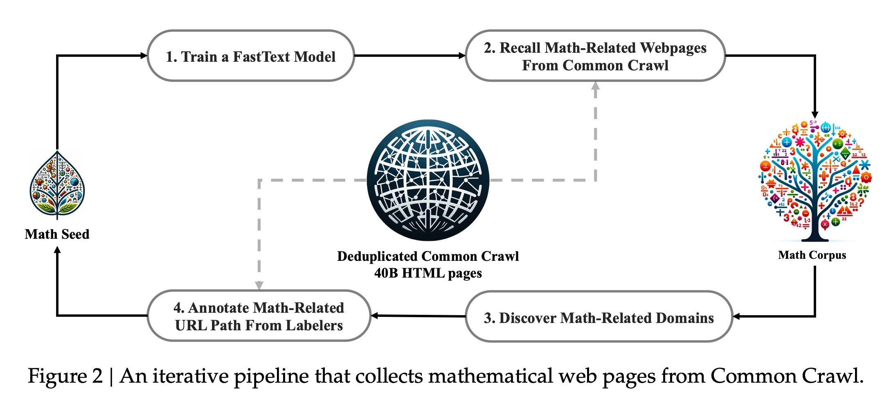
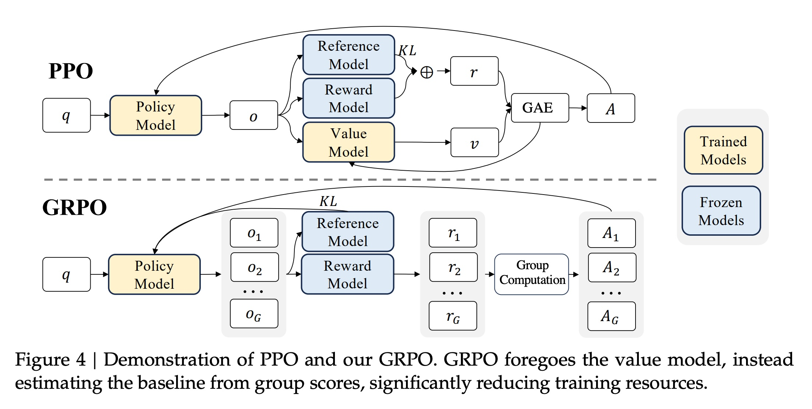
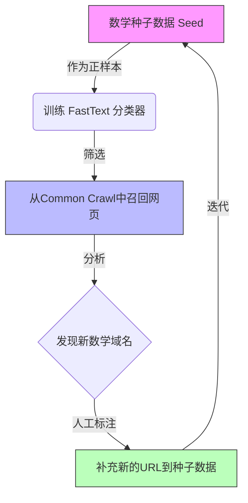
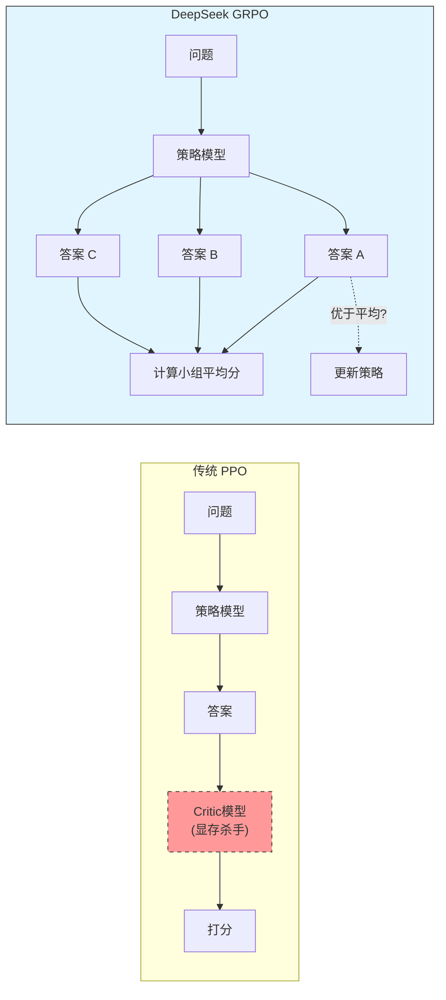
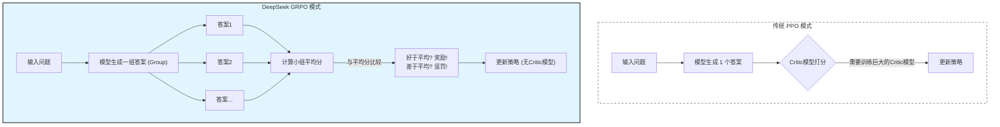

## AI论文解读 | DeepSeekMath: Pushing the Limits of Mathematical Reasoning in Open Language Models
        
### 作者        
digoal        
        
### 日期        
2025-11-28        
        
### 标签        
PostgreSQL , PolarDB , DuckDB , AI , 论文解读        
        
----        
        
## 背景  
      
https://arxiv.org/pdf/2402.03300        
  
提示:          
```          
读懂《DeepSeekMath: Pushing the Limits of Mathematical Reasoning in Open Language Models》这篇论文需要提前掌握哪些基础知识, 请使用中文通熟易懂的讲解这些基础知识, 可以引用论文中的图、表或使用Markdown支持的图形(text,mermaid等)增加解释性. 
  
使用中文通熟易懂的解读《DeepSeekMath: Pushing the Limits of Mathematical Reasoning in Open Language Models》这篇论文, 其中的关键内容请着重讲解, 可以引用论文中的图、表或使用Markdown支持的图形(text,mermaid等)增加解释性. 
  
提取《DeepSeekMath: Pushing the Limits of Mathematical Reasoning in Open Language Models》这篇论文中的重要术语, 使用中文对这些术语进行通熟易懂的讲解, 可以引用论文中的图、表或使用Markdown支持的图形(text,mermaid等)增加解释性. 
```     
  
## 1 前置知识 
  
阅读这篇论文《DeepSeekMath: Pushing the Limits of Mathematical Reasoning in Open Language Models》，你需要理解大语言模型（LLM）从“预训练”到“强化学习”的完整生命周期。

为了让你更轻松地读懂DeepSeekMath的核心创新（特别是其中的**GRPO**算法和**数据清洗流水线**），我将基础知识梳理为四个模块，配合通俗的比喻和论文中的图表进行讲解。

-----

### 模块一：LLM的“三级火箭”训练模式

这篇论文的结构严格遵循了LLM训练的三个经典阶段。你需要知道每个阶段在做什么，才能理解DeepSeekMath在每一步做了哪些改进。

1.  **预训练 (Pre-training/Base Model):**
      * **通俗解释**：这是让模型“博览群书”的阶段。模型阅读海量文本，学习语法、逻辑和世界知识，但此时它还不太会听指令，只是通过预测下一个字来续写文本。
      * **论文对应**： **DeepSeekMath-Base** 就是在这个阶段诞生的。作者主要是在讲如何从互联网海量数据中“提纯”出高质量的数学语料（见下文模块二）。
2.  **监督微调 (Supervised Fine-Tuning, SFT):**
      * **通俗解释**：这是让模型“学会考试”的阶段。给模型看很多“问题+标准答案”的例子，教它如何按照人类期望的格式（如：一步步推理）回答问题。
      * **论文对应**： **DeepSeekMath-Instruct** 是这个阶段的产物。
3.  **强化学习 (Reinforcement Learning, RL):**
      * **通俗解释**：这是“题海战术+刷题技巧”阶段。模型自己生成很多答案，然后有一个“判卷老师”（Reward Model）给它打分，得分高的答案被鼓励，得分低的被抑制。
      * **论文对应**： **DeepSeekMath-RL** 是最终形态。这也是论文最硬核的算法创新点（GRPO）所在（见下文模块四）。


-----

### 模块二：数据挖掘与清洗 (FastText 与 迭代流程)

论文花大量篇幅介绍如何从网页（Common Crawl）中提取数学内容。你需要了解以下概念：

  * **Common Crawl (CC):** 一个包含互联网上数千亿网页的公开数据库，里面的数据非常杂乱（广告、乱码、非数学内容）。
  * **FastText 分类器:**
      * **通俗解释**：把它想象成一个“极速筛选器”。你给它一些“正样本”（高质量数学网页）和“负样本”（普通网页），它能训练出一个极快的判断标准，把互联网上的数学网页捞出来。
  * **迭代式数据收集 (Iterative Pipeline):**
      * **通俗解释**：一开始筛选器不够准，漏掉了很多数学网页。DeepSeek的做法是：先捞一波 $\rightarrow$ 人工看看漏掉了哪些网站 $\rightarrow$ 把这些网站加进去重新训练筛选器 $\rightarrow$ 再去捞。这就好比滚雪球，越滚越纯。

**论文图解：**
请看论文中的 **Figure 2**，它展示了这个循环过程：从种子数据(Seed)出发，训练模型，找回网页，发现新域名，人工标注，再回到起点增强种子。

  

Figure 2: Iterative pipeline for collecting math webpages

-----

### 模块三：提示工程 (Prompting) —— CoT 与 PoT

在评估数学能力时，仅仅让模型输出答案是不够的，你需要了解两种解题模式：

1.  **思维链 (Chain-of-Thought, CoT):**

      * **定义**：要求模型在给出最终答案前，先输出推理步骤。
      * **例子**：
          * *普通模式*：问“1+1等于几？” 答“2”。
          * *CoT模式*：问“1+1等于几？” 答“首先，我们要把两个单位合并...因此答案是2”。
      * **意义**：对于数学题，CoT能显著提高准确率。论文中大量对比了CoT的性能。

2.  **思维程序/工具使用 (Program-of-Thought, PoT / Tool-use):**

      * **定义**：让模型不直接算数，而是写一段Python代码来计算答案。
      * **意义**：LLM不擅长做多位数的加减乘除（容易算错），但它擅长写代码。让Python解释器来做计算，准确率会飙升。
      * **论文对应**：论文中提到的 **"W/ Tool Use"** 或 **"Python"** 指的就是这种能力。

-----

### 模块四：强化学习与 PPO vs GRPO (核心难点)

这是论文最硬核的部分。为了理解作者提出的 **GRPO (Group Relative Policy Optimization)** ，你需要先懂传统的 **PPO**。

#### 1\. 传统的 PPO (Proximal Policy Optimization)

在ChatGPT等模型的训练中，PPO是主流算法。它有两个核心角色：

  * **Actor (演员/学生)** ：负责写答案的模型。
  * **Critic (评论家/老师)** ：负责预估这个答案能得多少分（Value Function）。
  * **痛点**：Critic模型通常和Actor一样大。如果你训练一个70B的大模型，你还得再加载一个70B的Critic模型，**显存直接爆炸**，训练成本极高。

#### 2\. DeepSeek的创新：GRPO (分组相对策略优化)

DeepSeekMath 提出了一个去掉了 Critic 的方法。

  * **核心逻辑**：
      * **不请“老师”了 (No Critic)** ：不再需要一个额外的模型来预估分数。
      * **搞“小组赛” (Group Sampling)** ：对于同一个数学题，让模型生成一组（比如64个）不同的答案。
      * **相对打分 (Relative Reward)** ：
          * 有的答案对，有的错。
          * 算出这组答案的平均分。
          * 比平均分好的答案，给奖励（强化）；比平均分差的，给惩罚。
  * **优势**：节省了巨量的显存（因为不需要加载那个庞大的Critic模型），计算效率更高。

**论文图解：**
请看论文 **Figure 4**。左边是PPO（需要Value Model），右边是GRPO（不需要Value Model，直接通过Group Scores计算基准）。

  

Figure 4: Demonstration of PPO and GRPO 

  * **PPO (左图)** ：需要一个 Value Model 来作为基准 (Baseline)。
  * **GRPO (右图)** ：通过对同一个问题生成多个输出 ( $o_1, o_2...o_G$ )，计算它们的平均值作为基准。

-----

### 总结：读这篇论文的“通关秘籍”

当你阅读时，请带着这三个问题：

1.  **数据层**：他们是怎么利用FastText和迭代流程把OpenWebMath的数据量扩充到120B token的？（对应 Section 2）
2.  **模型层**：为什么他们说先进行代码训练（Code Training）能提升数学逻辑？（对应 Section 5.1.1）
3.  **算法层**：GRPO 是如何利用“组内相对优势”来替代“Critic模型”的？公式里那个 $\frac{r_i - \text{mean}}{\text{std}}$ 是什么意思？（对应 Section 4，其实就是一种标准化的相对分数）。

掌握了以上知识，你就能顺畅地理解这篇论文是如何在开源模型中通过数据工程和算法优化，把数学推理能力推向极致的。
  
## 2 解读论文 
  
这是一篇在大语言模型（LLM）数学推理领域具有里程碑意义的论文。DeepSeek（深度求索）团队发布的 **DeepSeekMath-7B** 模型，在没有使用外部工具（如计算器）的情况下，在竞赛级数学基准测试（MATH benchmark）上达到了 **51.7%** 的准确率 。

**核心亮点**：这就好比一个只有7岁的“神童”（7B参数的小模型），在数学考试中打败了许多几十岁的“成年人”（70B的大模型），甚至逼近了最顶尖的“教授”（GPT-4, Gemini-Ultra）的水平 。

以下是对这篇论文核心技术的通俗解读，分为三个关键部分： **数据挖掘**、**预训练发现**、以及最核心的算法创新 **GRPO**。

-----

### 1\. 数据的艺术：如何从互联网大海捞针？

要想数学好，教材必须好。DeepSeek 发现，光靠现有的数学数据集（如 arXiv 论文）是不够的，互联网网页中隐藏着大量优质的数学讨论。

#### 核心策略：迭代式“滚雪球”数据清洗

论文展示了一个名为 **DeepSeekMath Corpus** 的语料库构建过程，包含 120B（1200亿）个数学相关的 Token 。他们设计了一个“迭代流水线”来从海量的 Common Crawl（网页快照）中挖掘数据。

**流程图解（基于论文 Figure 2 ）：**

  



1.  **种子出发**：先找一批高质量的数学网页（如 OpenWebMath）作为“种子” 。
2.  **训练雷达**：用这些种子训练一个快速分类器（FastText），让它学会“什么长得像数学网页” 。
3.  **全网搜寻**：用这个雷达去扫描几百亿个网页，捞出一批疑似数学的内容 。
4.  **人工查漏**：发现有些好的数学论坛（域名）被漏掉了，人工把它们加回去，更新“种子”，让雷达更精准 。
5.  **循环迭代**：这个过程重复了4次，最终收集到了 **120B** 高质量数学语料 。

-----

### 2\. 颠覆认知的预训练发现

在训练 DeepSeekMath-Base 模型时，作者分享了两个非常反直觉且重要的经验，这为后续的研究指明了方向。

#### (1) arXiv 论文竟然对数学推理没啥用？

通常大家认为 arXiv 上全是高深的理工科论文，应该最能提升数学能力。但实验结果显示： **arXiv 论文对于提升模型的数学推理能力（如做 GSM8K 或 MATH 题目）几乎无效，甚至不如不加** 。

> **原因推测**：论文可能太形式化、太深奥，而互联网上的数学讨论（如 StackExchange, 博客）更接近人类解决问题的自然语言推理过程。

#### (2) 代码训练（Code）是数学的助燃剂

很多人猜测学写代码能变相提高逻辑推理能力。DeepSeek 证实了这一点： **先训练代码，再训练数学，效果最好** 。代码数据能显著提升模型处理数学问题的能力，尤其是通过写程序（Python）来解题的能力 。

-----

### 3\. 核心算法创新：GRPO (分组相对策略优化)

这是论文最“硬核”的贡献。为了让模型在微调后进一步变强，通常使用强化学习（RL）。主流方法是 PPO（Proximal Policy Optimization），但 PPO 有个大缺点：它需要一个额外的“判卷老师”模型（Critic/Value Model），这非常占显存，训练很慢 。

DeepSeek 提出了 **GRPO (Group Relative Policy Optimization)** ，**扔掉了“判卷老师”，让学生们互相比拼**。

#### GRPO 的通俗原理解析

  * **传统 PPO (需要裁判)** ：

      * 模型生成一个答案。
      * Critic 模型打分：“这个答案值 80 分”。
      * 模型根据这个绝对分数调整参数。
      * *缺点*：需要训练并加载一个巨大的 Critic 模型 。

  * **DeepSeek GRPO (小组赛制)** ：

      * **分组采样**：对于同一个数学题，让模型一口气生成一组（比如 64 个）不同的答案 。
      * **相对打分**：不需要 Critic 模型。算出这一组答案的平均分。
      * **优胜劣汰**：
          * 比平均分好的答案，给奖励（强化它）。
          * 比平均分差的答案，给惩罚（抑制它）。
          * 公式核心思想： $优势 = \frac{当前得分 - 小组平均分}{小组标准差}$ 。

**可视化对比（基于论文 Figure 4 ）：**

  



**GRPO 的效果：**

1.  **省资源**：不需要 Critic 模型，训练使用的内存大幅减少 。
2.  **效果好**：仅使用 GSM8K 和 MATH 的题目进行强化学习，DeepSeekMath-RL 在这些任务上分别达到了 **88.2%** 和 **51.7%** 的准确率，甚至在没有见过的分布外测试集上也有提升 。

-----

### 4\. 总结：统一的强化学习视角

论文最后还提出了一个宏大的视角，认为 SFT（监督微调）、RFT（拒绝采样）、PPO 和 GRPO 本质上都是一样的，可以用同一个公式来概括 。

  * 它们都在做三件事：找数据源、定奖励函数、算梯度系数 。
  * **DeepSeekMath 的成功秘诀** = **高质量的互联网数学数据** (DeepSeekMath Corpus) + **代码预训练基础** + **高效的强化学习算法** (GRPO) 。

**一句话总结**：
这篇论文告诉我们，开源小模型通过极致的数据清洗和聪明的强化学习算法（GRPO），完全有能力在逻辑密集的数学任务上挑战顶尖闭源模型。
  
## 3 术语 
  
这篇论文《DeepSeekMath: Pushing the Limits of Mathematical Reasoning in Open Language Models》介绍了一个在数学推理能力上能与顶尖闭源模型（如GPT-4）相抗衡的开源模型。

为了让你读懂这篇技术硬核的论文，我提取了其中的**核心术语**，并用通俗易懂的语言配合图表进行解读。

-----

### 1\. 核心算法创新：GRPO (分组相对策略优化)

这是全篇论文最“值钱”的术语，也是 DeepSeekMath 能够以小博大的关键。

  * **术语全称**：Group Relative Policy Optimization
  * **通俗解读**：
    传统的强化学习（如 PPO）像是一个学生（模型）写作业，必须要有一个专门的“私教老师”（Critic Model/Value Model）来给每道题打分。这个“私教”非常占资源，不仅也要训练，还占显存。
    **GRPO** 则取消了“私教老师”。它让模型针对同一道题生成一组（比如64个）不同的答案，形成一个“学习小组”。然后算出小组的平均分，谁比平均分高谁就受奖励，谁低就受惩罚。
      * **省资源**：不需要额外的“私教模型”（Critic），大幅降低训练成本 。
      * **效果好**：利用“同行衬托”（组内相对优势）来优化策略 。

**图解 GRPO 与 PPO 的区别 (基于论文 Figure 4 ):**

  



-----

### 2\. 数据工程：Iterative Pipeline (迭代式数据收集流水线)

DeepSeekMath 之所以强，是因为它用了 1200 亿 (120B) 个高质量的数学 Token 进行预训练 。这些数据不是一次性找齐的，而是像“滚雪球”一样收集来的。

  * **术语**：Iterative Data Selection Pipeline
  * **通俗解读**：
    互联网数据（Common Crawl）像个巨大的垃圾场，里面混杂着广告、闲聊和真正的数学知识。为了捞出数学知识，DeepSeek 设计了一个循环系统：
    1.  **种子 (Seed)** ：先找少量确定的高质量数学网页（如 OpenWebMath）。
    2.  **雷达 (FastText)** ：用种子训练一个快速分类器（FastText），让它学会“数学网页长什么样” 。
    3.  **搜寻与扩充**：用雷达去扫全网数据，捞出疑似数学的网页。如果发现某些数学网站（域名）之前的种子没覆盖到，就人工把它们加回种子库 。
    4.  **循环**：种子变多了 $\rightarrow$ 雷达更准了 $\rightarrow$ 捞到的数据更多了。这个过程重复了4轮 。

**流程示意 (基于论文 Figure 2 ):**

  

`种子数据` $\rightarrow$ `训练分类器` $\rightarrow$ `全网召回` $\rightarrow$ `人工标注新来源` $\rightarrow$ `回到起点(种子变大)`

-----

### 3\. 解题模式：CoT vs. Tool-Integrated Reasoning

论文在评估模型时，区分了两种不同的解题“流派”。

#### (1) CoT (Chain-of-Thought, 思维链)

  * **定义**：要求模型在给出答案前，把推理过程一步步写出来 。
  * **通俗解读**：就像数学考试中，老师要求“必须写出计算步骤，不能只写得数”。DeepSeekMath-Base 在使用 CoT 时，准确率远超同类模型 。

#### (2) Tool-Integrated Reasoning / PoT (Program-of-Thought)

  * **定义**：模型不直接心算，而是写一段 Python 代码来解决问题，并将代码的运行结果作为答案 。
  * **通俗解读**：
    大模型有时候会算错简单的加减乘除（幻觉）。这个模式就是允许模型“按计算器”或“写代码”。
      * **例子**：问“9876 x 1234 等于几？”
      * **CoT**：试图一位一位乘，容易出错。
      * **Tool/PoT**：写代码 `print(9876 * 1234)`，运行得到精准结果。
  * **结论**：论文发现，先进行**代码训练** (Code Training)，能显著提升模型在这一项上的能力 。

-----

### 4\. 监督方式：Outcome vs. Process Supervision

在强化学习阶段，如何给模型打分也是个关键术语。

  * **Outcome Supervision (结果监督)**

      * **含义**：只看最终答案对不对 。
      * **通俗解读**：不管你过程写得怎么样，只要最后答案是 "42"，就给你满分；否则0分。这比较粗糙，模型可能“蒙”对答案。

  * **Process Supervision (过程监督)**

      * **含义**：对推理的每一个步骤进行打分 。
      * **通俗解读**：老师按步骤给分。第一步公式列对了给2分，第二步代入对了给2分。
      * **论文发现**：在使用 GRPO 时，如果配合过程监督（哪怕只是简单的步骤级奖励），效果通常会更好 。

-----

### 5\. 两个容易混淆的模型版本

论文中提到了同一个模型的不同阶段，阅读时需区分：

| 术语 | 阶段 | 特点 |
| :--- | :--- | :--- |
| **DeepSeekMath-Base** | 预训练 | 读了120B数学语料，懂很多数学知识，但不太会按指令做题 。 |
| **DeepSeekMath-Instruct** | 监督微调 (SFT) | 学会了 CoT 和使用工具，能像考生一样回答问题 。 |
| **DeepSeekMath-RL** | 强化学习 (RL) | 使用了 **GRPO** 算法进行“刷题”特训，数学推理能力最强 。 |

**总结**：DeepSeekMath 的成功可以概括为：用**迭代流水线**清洗出的海量数据打底，先学**代码**再学数学，最后用**GRPO**这种无需“私教模型”的高效强化学习算法进行最终提升。
  
## 参考        
         
https://arxiv.org/pdf/2402.03300    
        
<b> 以上内容基于DeepSeek、Qwen、Gemini及诸多AI生成, 轻微人工调整, 感谢杭州深度求索人工智能、阿里云、Google等公司. </b>        
        
<b> AI 生成的内容请自行辨别正确性, 当然也多了些许踩坑的乐趣, 毕竟冒险是每个男人的天性.  </b>        
  
    
#### [PolarDB 学习图谱](https://www.aliyun.com/database/openpolardb/activity "8642f60e04ed0c814bf9cb9677976bd4")
  
  
#### [PostgreSQL 解决方案集合](../201706/20170601_02.md "40cff096e9ed7122c512b35d8561d9c8")
  
  
#### [德哥 / digoal's Github - 公益是一辈子的事.](https://github.com/digoal/blog/blob/master/README.md "22709685feb7cab07d30f30387f0a9ae")
  
  
#### [About 德哥](https://github.com/digoal/blog/blob/master/me/readme.md "a37735981e7704886ffd590565582dd0")
  
  

  
