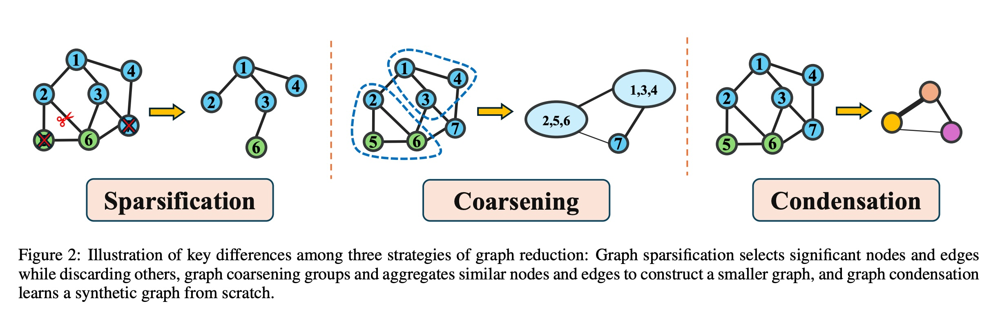
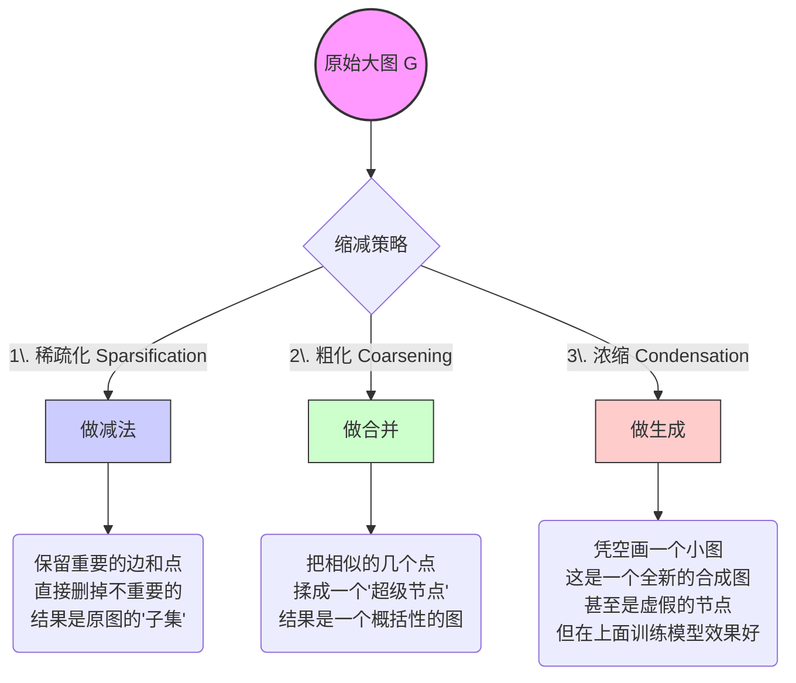
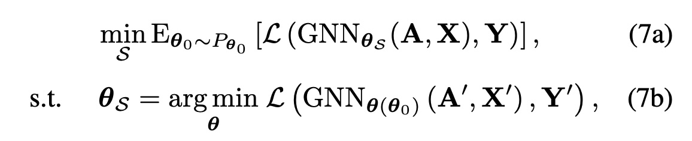
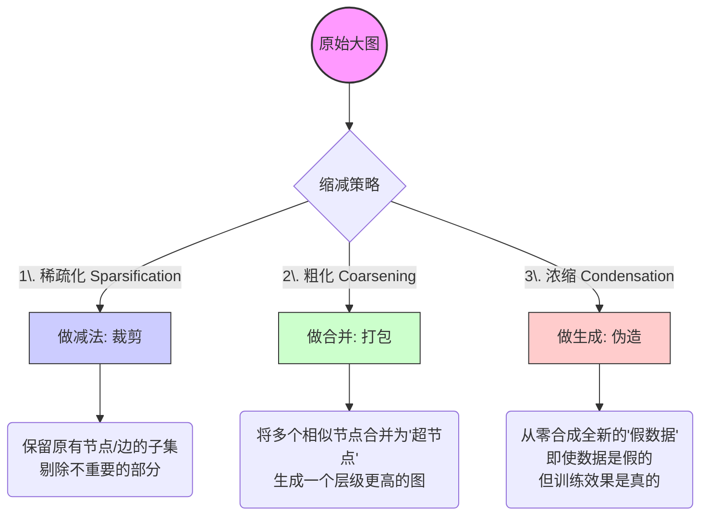
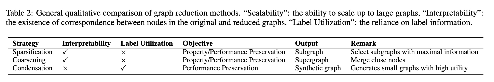
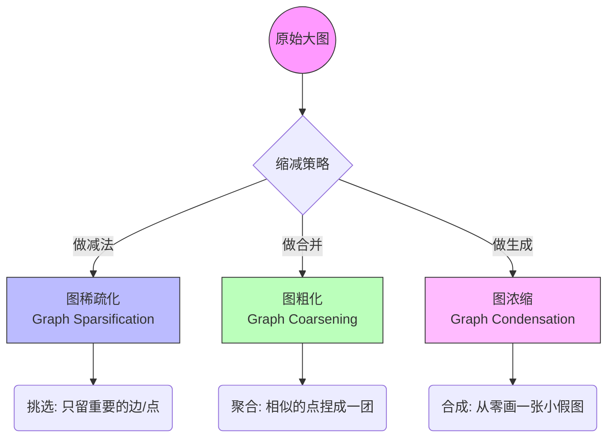

## AI论文解读 | A Comprehensive Survey on Graph Reduction: Sparsification, Coarsening, and Condensation
        
### 作者        
digoal        
        
### 日期        
2025-11-28        
        
### 标签        
PostgreSQL , PolarDB , DuckDB , AI , 论文解读        
        
----        
        
## 背景  
      
https://arxiv.org/pdf/2402.03358        
  
提示:          
```          
读懂《A Comprehensive Survey on Graph Reduction: Sparsification, Coarsening, and Condensation》这篇论文需要提前掌握哪些基础知识, 请使用中文通熟易懂的讲解这些基础知识, 可以引用论文中的图、表或使用Markdown支持的图形(text,mermaid等)增加解释性. 
  
使用中文通熟易懂的解读《A Comprehensive Survey on Graph Reduction: Sparsification, Coarsening, and Condensation》这篇论文, 其中的关键内容请着重讲解, 可以引用论文中的图、表或使用Markdown支持的图形(text,mermaid等)增加解释性. 
  
提取《A Comprehensive Survey on Graph Reduction: Sparsification, Coarsening, and Condensation》这篇论文中的重要术语, 使用中文对这些术语进行通熟易懂的讲解, 可以引用论文中的图、表或使用Markdown支持的图形(text,mermaid等)增加解释性. 
```     
  
## 1 前置知识 
  
要深入理解这篇关于**图缩减（Graph Reduction）的综述论文《A Comprehensive Survey on Graph Reduction》，你需要掌握以下几个核心领域的“通俗版”基础知识。这篇论文讨论的是如何把一个巨大且复杂**的图（比如几十亿人的社交网络）变**小**，同时还得保证在这个小图上做计算（比如推荐好友）的结果和在大图上差不多。

以下是阅读本文必备的四大知识模块：

-----

### 1\. 图论基础 (Graph Theory Basics)

这是最底层的“语言”。你需要理解图是如何被数学化描述的。

  * **图的构成 ( $G, V, E$ )** ：
      * **概念**：图由**节点 ( Nodes/Vertices, $V$ )** 和 **边 ( Edges, $E$ )** 组成。
      * **论文中的符号**：论文用 $N$ 表示节点数量，用 $E$ 表示边数量 。
      * **例子**：在微信里，你是节点，你和朋友的关系是边。
  * **矩阵表示 (Matrices)** ：计算机看不懂画出来的图，它只看矩阵。
      * **邻接矩阵 ( $A$ , Adjacency Matrix )** ：一个 $N \times N$ 的表格，如果节点 $i$ 和 $j$ 是朋友，格子填 1，否则填 0 。
      * **拉普拉斯矩阵 ( $L$ , Laplacian Matrix )** ： $L = D - A$ 。它是图的“核心指纹”，在**谱稀疏化 (Spectral Sparsification)** 中非常关键 。它描述了图的能量流动或扩散特性。
  * **节点特征 ( $X$ , Node Features )** ：每个节点不仅是个点，还带着属性（比如你的年龄、性别、兴趣向量）。论文中 $X$ 就是这些属性的矩阵 。

-----

### 2\. 图神经网络 (Graph Neural Networks, GNNs)

论文中大量的缩减方法（尤其是“图浓缩”）都是为了服务于 GNN 的训练。

  * **核心逻辑（消息传递）** ：GNN 的工作原理是“近朱者赤”。一个节点的特征会根据它的邻居特征来更新。
  * **为什么要缩减？**：现在的 GNN 遇到大图（比如几亿个节点）就算不动了，显存会爆。所以我们需要把图变小，但让 GNN 在小图上训练出来的**模型效果**（Performance）和在大图上训练的一样好 。
  * **下游任务**：论文常提到 **Node Classification (节点分类)** 或 **Graph Classification (图分类)** ，这些是检验缩减后的图好不好用的“考试题目” 。

-----

### 3\. 三种缩减策略的直观理解 (The Three Strategies)

这是论文的核心分类。你可以把“把图变小”想象成要把一本厚书变薄，有三种方法。我们可以用 **Mermaid** 流程图来直观展示论文图 2 的逻辑：

  



  * **稀疏化 (Sparsification)** ：像修剪树枝，去掉细枝末节，只留主干。通常为了保留图的物理属性（如距离、频谱） 。
  * **粗化 (Coarsening)** ：像看地图，从“街道视图”缩放到“城市视图”，把一个社区的人看作一个点 。
  * **浓缩 (Condensation)** ：这是最新的技术（类似蒸馏）。它不一定从原图里选点，而是通过机器学习“学”出一个非常小的假图，虽然图是假的，但它包含的信息量足以训练出好模型 。

-----

### 4\. 数学优化与谱理论 (Optimization & Spectral Theory)

当你读到论文的方法论部分（Methodology），会遇到一些数学概念。

  * **谱 (Spectrum) 与 特征值 (Eigenvalues)** ：
      * **通俗理解**：图也有“频率”。如果把图想象成吉他弦，特征值就是它振动的频率。
      * **应用**： **稀疏化**和**粗化**常试图保留图的“频谱” 。因为如果两个图的频谱一致，它们的结构性质就非常相似。论文里提到的 $\epsilon$-sparsifier 就是指频谱误差极小 。
  * **梯度匹配 (Gradient Matching)** ：
      * 这是**图浓缩**最常用的技术。
      * **原理**：我们调整那个“小合成图”的参数，使得模型在“小图”上计算出的梯度（学习方向），跟在“大真图”上算出的梯度一模一样 。
      * **目的**：如果梯度的方向一样，那模型在小图上学到的东西，就等于在真图上学到的东西。
  * **双层优化 (Bi-level Optimization)** ：
      * 图浓缩通常是一个“套娃”问题：外层循环在找最好的“小图”，内层循环在用这个小图“训练 GNN” 。理解这一点对看懂公式 (7a) 和 (7b) 至关重要。

  

### 总结

在阅读这篇论文时，如果你看到：

  * **$L$ (Laplacian)** $\rightarrow$ 联想到 **谱/结构保留** (常用于稀疏化/粗化)。
  * **$\nabla$ (Gradient)** $\rightarrow$ 联想到 **梯度匹配/训练效果** (常用于浓缩)。
  * **Super-node (超节点)** $\rightarrow$ 联想到 **粗化** (合并节点)。

掌握了这些，你就可以顺畅地理解这篇综述是如何将原本孤立的研究领域（传统算法与现代深度学习）串联起来的 。
  
## 2 解读论文 
  
这篇论文《A Comprehensive Survey on Graph Reduction: Sparsification, Coarsening, and Condensation》主要解决了一个核心痛点： **现在的图数据（Graph Data）太大了，计算太慢了，怎么在变小（图缩减）的同时，还能保留核心信息？**

以下是对这篇综述的通俗解读，我将其分为四个关键部分来讲解。

-----

### 1\. 核心概念：什么是图缩减？

简单来说，**图缩减 (Graph Reduction)** 就是把一个庞大的原始图数据集（比如数亿人的社交网络），变成一个**更小**的图数据集。

  * **目标**：输入一个大图 $\mathcal{T}$ ，输出一个小图 $\mathcal{S}$ 。
  * **要求**：虽然个头变小了（节点 $N$ 或边 $E$ 变少了），但在这个小图上训练出的 AI 模型，效果要和在大图上训练的差不多 。

论文将目前的缩减方法归纳为**三大门派**，我们可以用下图来直观展示它们的区别：



*(此图逻辑基于论文 Figure 2 和 Section 2 的定义)*  

  

-----

### 2\. 三大流派详解

#### 第一派：图稀疏化 (Graph Sparsification) —— “修剪枝叶”

这是最直观的方法。就像修剪盆栽一样，去掉多余的叶子（边）或树枝（节点），只保留主干。

  * **原理**：从原图中**挑选**出最重要的节点或边，其他的直接扔掉 。
  * **怎么挑？**
      * **传统方法**：为了保留数学性质（如最短路径、图的频谱）。比如 Spanner 算法就是为了保证剩下的图中，两点间距离不要变太远 。
      * **现代方法 (AI导向)** ：为了让图神经网络 (GNN) 跑得好。通过算法给边打分（比如用 PageRank 或 GNN 解释器），分数低的边就剪掉 。

#### 第二派：图粗化 (Graph Coarsening) —— “地图缩放”

这就像看地图，从“街道视图”缩放到“城市视图”。很多个具体的地点被合并成了一个大点（城市）。

  * **原理**：不删节点，而是把相似的节点**聚合**（Group）在一起，变成“超节点”（Super nodes）。原来的边也合并成“超边” 。
  * **关键技术**：需要一个映射矩阵 $C$ ，把原图的节点映射到粗化图上 。
  * **应用**：常用于加速计算或图的可视化（太密了看不清，粗化一下看大概结构） 。

#### 第三派：图浓缩 (Graph Condensation) —— “提炼精华”

这是近年来最火的新方向（受图像领域的“知识蒸馏”启发）。

  * **原理**：它**不是**从原图里选点，而是通过机器学习“学”出一个全新的、非常小的合成图。这个图里的节点可能是虚构的，但在它上面训练模型，效果能媲美真实大图 。
  * **核心方法 - 梯度匹配 (Gradient Matching)** ：
    让 AI 模型在“小合成图”上学到的参数更新方向（梯度），尽量和在“大真图”上学到的一样。如果方向一样，那终点（模型效果）也就一样了 。
  * **特点**：极度压缩（可以把几千个点压缩成几十个点），但极其依赖标签数据 。

-----

### 3\. 方法对比 (关键差异)

论文在 **Table 2** 中对这三种策略进行了定性对比，这是理解它们适用场景的关键：

| 特性 | 稀疏化 (Sparsification) | 粗化 (Coarsening) | 浓缩 (Condensation) |
| :--- | :--- | :--- | :--- |
| **产出物** | 原图的**子图** (Subgraph) | 原图的**概括图** (Supergraph) | 全新的**合成图** (Synthetic) |
| **可解释性** | **高** (留下的都是真实存在的点) | **中** (知道哪些点合并成了超节点) | **低** (生成的点很难对应到现实含义) |
| **依赖标签** | 不需要 (通常无监督) | 不需要 (通常无监督) | **必须** (需要标签来指导合成) |
| **主要目标** | 保留图的物理属性/结构 | 保留结构特征/加速 | 仅仅为了**保住模型性能** |

*[数据来源: Table 2]*

  

-----

### 4\. 为什么要搞图缩减？(应用场景)

除了单纯的“省内存、算得快”，论文还列举了几个有趣的应用 ：

1.  **神经架构搜索 (NAS)** ：想找最好的 AI 模型架构，得试很多次。在大图上试太慢，先在缩减的小图上快速试错，找到最好的架构再回大图训练 。
2.  **持续学习 (Continual Learning)** ：AI 需要不断学新知识，又不能忘旧知识。可以把旧知识“浓缩”成一个小图存起来，时不时拿出来复习一下 。
3.  **隐私保护 (Privacy)** ：缩减后的图（特别是粗化和浓缩图）已经不是原始数据了，很难还原出具体某个人的敏感信息，天然起到了脱敏作用 。
4.  **可视化 (Visualization)** ：几亿个点的图画出来就是一团黑。粗化或稀疏化后，人类才能看清结构 。

### 总结

这篇论文告诉我们，面对海量图数据，我们不需要总是“硬算”。

  * 如果你在乎图的**物理结构**且想保留真实数据 $\rightarrow$ 用 **稀疏化**。
  * 如果你想看**宏观结构**或做层级化处理 $\rightarrow$ 用 **粗化**。
  * 如果你只在乎**训练出的模型准不准**，且想极致压缩数据 $\rightarrow$ 用 **浓缩**。
  
## 3 术语 
  
基于论文《A Comprehensive Survey on Graph Reduction: Sparsification, Coarsening, and Condensation》，我提取了其中最核心的术语，并将其分类为“核心框架”、“关键技术”和“基础概念”三个部分进行通俗解读。

-----

### 1\. 核心框架术语 (The "Big Three")

这是论文对图缩减技术进行分类的三个主要流派。我们可以用一个 Mermaid 图来直观展示它们的区别：



#### **1. Graph Sparsification (图稀疏化)**

  * **通俗解释**：就像**修剪盆栽**。树还是那棵树（节点通常不变），但是把多余的、细小的、不重要的树枝（边）剪掉，只留下主干。
  * **定义**：从原始图中选择一部分节点或边，输出的图是原图的“子集” 。
  * **目的**：让图变“稀疏”，计算更快，但保留原图的物理属性（如两点间距离、图的连通性）。

#### **2. Graph Coarsening (图粗化)**

  * **通俗解释**：就像**看地图缩放**。原本地图上显示每栋房子（原始节点），当你缩小地图（粗化）时，整个小区变成了一个点（超节点），原本连接两栋房子的路，变成了连接两个小区的路。
  * **定义**：将原图的节点分组，合并成“超节点”（Super-nodes），原来的边聚合成“超边” 。
  * **目的**：降低图的分辨率，保留宏观结构。

#### **3. Graph Condensation (图浓缩)**

  * **通俗解释**：就像**写摘要**或者**炼丹**。这是一种较新的技术。它不一定要保留原图里真实存在的点，而是通过算法“生成”一张非常小的假图（合成图）。虽然图里的点可能是假的，但如果你在这个小假图上训练AI模型，效果竟然和在几亿数据的大真图上训练一样好。
  * **定义**：合成一个包含可学习参数的小型图数据集，使得在上面训练的GNN（图神经网络）性能与在原图上训练相当 。

-----

### 2\. 关键技术术语 (Key Techniques)

#### **Spanner vs. Sparsifier (生成树与稀疏器)**

这是图稀疏化中的两个细分概念，用于衡量“修剪”得好不好。

  * **Spanner (生成树/支撑子图)** ：
      * **解释**：关注**距离**。修剪完后，两点之间的最短路径长度不能比原来增加太多 。
      * *比喻*：虽然封了几条路，但我回家本来走1公里，现在走1.2公里，还能接受。
  * **Sparsifier (稀疏器)** ：
      * **解释**：关注**结构/频谱**。修剪完后，图的切分性质（Cut）或能量流动（频谱）保持不变 。
      * *比喻*：虽然把水管变细了，但整个水网的流量分布和原本差不多。

#### **Super-node (超节点)**

  * **归属**：图粗化。
  * **解释**：在粗化过程中，我们将一组相似的原始节点（比如同一类别的点，或者距离很近的点）打包在一起，形成的一个新节点。
  * **映射矩阵 ( $C$ 或 $P$ )** ：论文中提到的 $C \in \{0,1\}^{N \times N'}$ 是一个“分配表”，它记录了原图中的哪几个点被分配到了哪一个超节点中 。

#### **Gradient Matching (梯度匹配)**

  * **归属**：图浓缩。
  * **解释**：这是生成“小假图”的核心魔法。
      * **原理**：让模型在“小假图”上学习时的步伐方向（ 梯度 $\nabla$ ），尽量和在“大真图”上学习时的步伐方向保持一致 。
      * *比喻*：如果两个学生（模型），一个读精简版教材（小图），一个读原版书（大图），只要他们每一步的学习心得（梯度）是一样的，那么最后的考试成绩也会一样。

#### **Synthetic Graph (合成图/S)**

  * **归属**：图浓缩。
  * **解释**：这是图浓缩的产出物。它的节点特征（Features）甚至边（Edges）往往不是直接采样的，而是像训练神经网络参数一样“学”出来的连续值。虽然它很难让人类看懂（可解释性差），但对机器来说由于信息密度极高，非常好用 。

-----

### 3\. 基础数学概念 (Foundations)

#### **Adjacency Matrix (邻接矩阵/A)**

  * **解释**：计算机看不懂画出来的图，它只看表格。这是一个 $N \times N$ 的表格，如果节点 $i$ 和节点 $j$ 之间有连线，表格里对应的格子就是 1，否则是 0 。
  * **作用**：描述图的**连接关系**。

#### **Laplacian Matrix (拉普拉斯矩阵/L)**

  * **公式**： $L = D - A$ （其中 $D$ 是度矩阵，记录每个点连了几条线）。
  * **解释**：这是图的“指纹”。虽然邻接矩阵描述了谁连着谁，但拉普拉斯矩阵描述了图上的**能量如何扩散**。
  * **重要性**：在**谱稀疏化**（Spectral Sparsification）中，目标就是让修剪后的图的拉普拉斯矩阵 ( $L'$ ) 和原图的 ( $L$ ) 尽可能相似 。

#### **Bi-level Optimization (双层优化)**

  * **解释**：这是一个“套娃”式的数学问题，常见于图浓缩。
      * **外层目标**：寻找最佳的“合成小图”。
      * **内层目标**：在这个“合成小图”上训练 GNN 模型，让损失最小。
      * **难点**：因为要算两层，所以计算量通常很大 。
  
## 参考        
         
https://arxiv.org/pdf/2402.03358    
        
<b> 以上内容基于DeepSeek、Qwen、Gemini及诸多AI生成, 轻微人工调整, 感谢杭州深度求索人工智能、阿里云、Google等公司. </b>        
        
<b> AI 生成的内容请自行辨别正确性, 当然也多了些许踩坑的乐趣, 毕竟冒险是每个男人的天性.  </b>        
  
    
#### [PolarDB 学习图谱](https://www.aliyun.com/database/openpolardb/activity "8642f60e04ed0c814bf9cb9677976bd4")
  
  
#### [PostgreSQL 解决方案集合](../201706/20170601_02.md "40cff096e9ed7122c512b35d8561d9c8")
  
  
#### [德哥 / digoal's Github - 公益是一辈子的事.](https://github.com/digoal/blog/blob/master/README.md "22709685feb7cab07d30f30387f0a9ae")
  
  
#### [About 德哥](https://github.com/digoal/blog/blob/master/me/readme.md "a37735981e7704886ffd590565582dd0")
  
  

  
