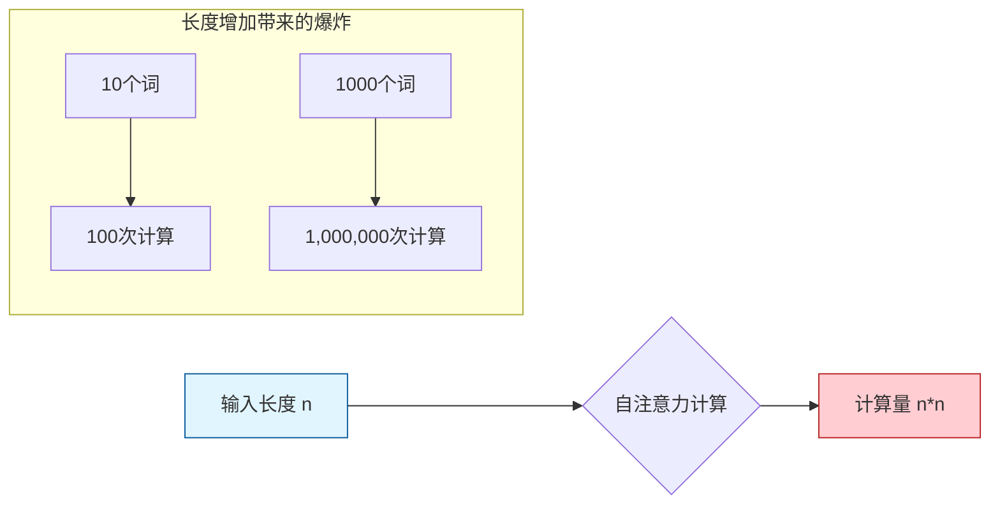
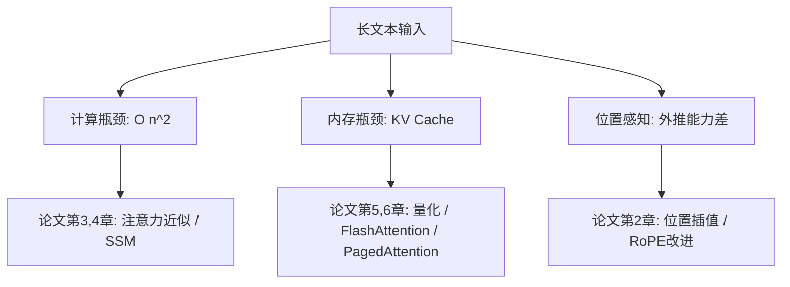
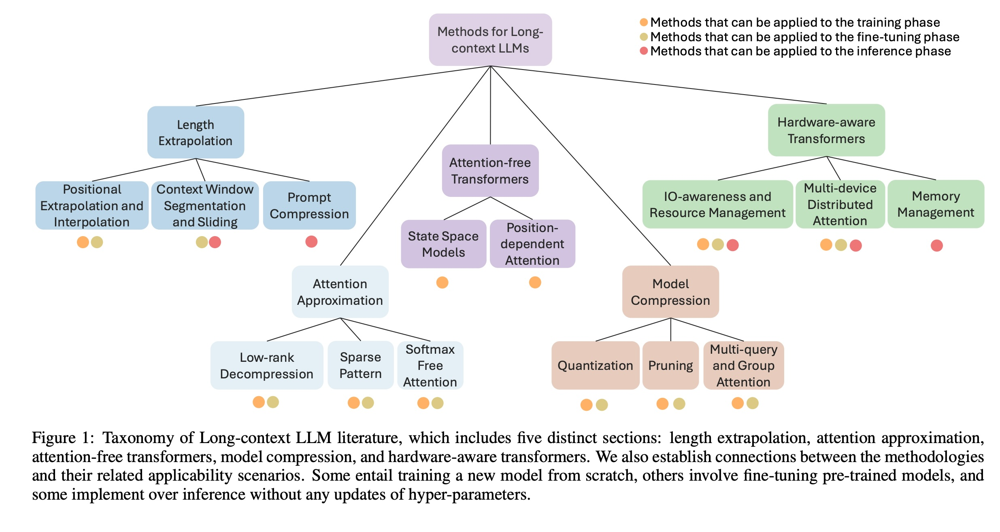
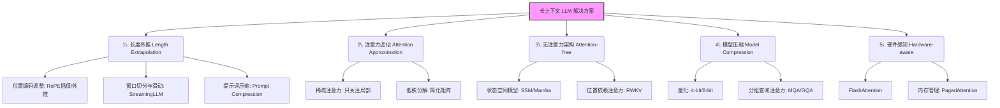
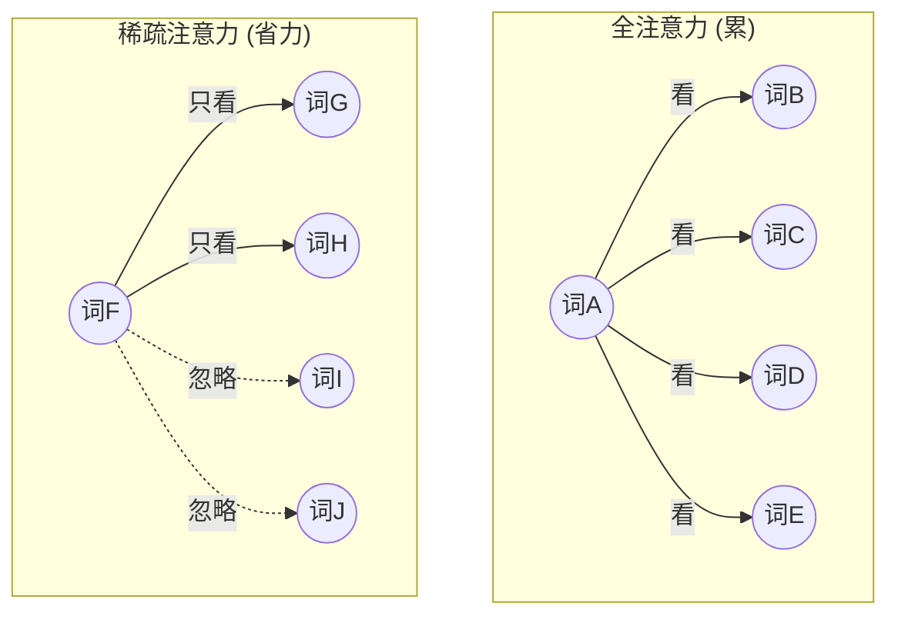
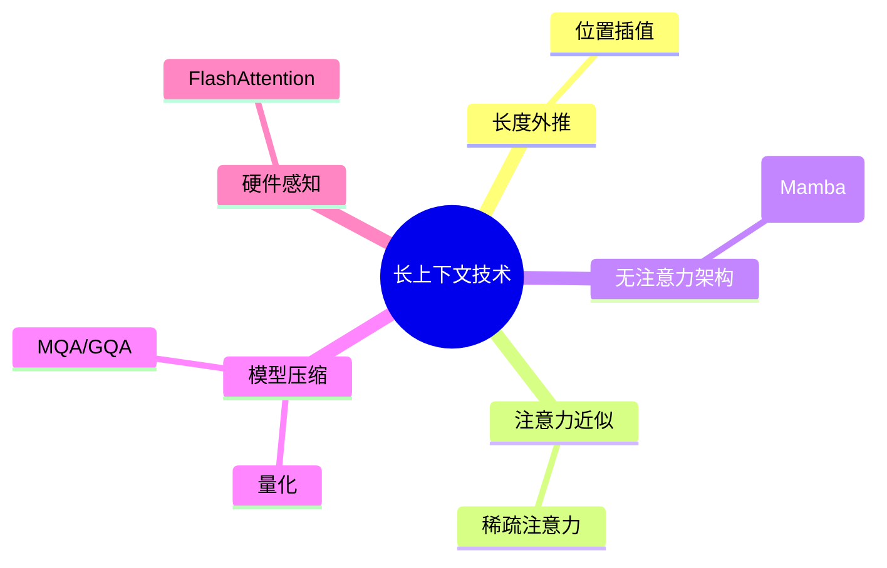

## AI论文解读 | Beyond The Limits: A Survey of Techniques to Extend The Context Length in Large Language Models
        
### 作者        
digoal        
        
### 日期        
2025-11-28        
        
### 标签        
PostgreSQL , PolarDB , DuckDB , AI , 论文解读        
        
----        
        
## 背景  
      
https://arxiv.org/pdf/2402.02244        
  
提示:          
```          
读懂《Beyond The Limits: A Survey of Techniques to Extend The Context Length in Large Language Models》这篇论文需要提前掌握哪些基础知识, 请使用中文通熟易懂的讲解这些基础知识, 可以引用论文中的图、表或使用Markdown支持的图形(text,mermaid等)增加解释性. 
  
使用中文通熟易懂的解读《Beyond The Limits: A Survey of Techniques to Extend The Context Length in Large Language Models》这篇论文, 其中的关键内容请着重讲解, 可以引用论文中的图、表或使用Markdown支持的图形(text,mermaid等)增加解释性. 
  
提取《Beyond The Limits: A Survey of Techniques to Extend The Context Length in Large Language Models》这篇论文中的重要术语, 使用中文对这些术语进行通熟易懂的讲解, 可以引用论文中的图、表或使用Markdown支持的图形(text,mermaid等)增加解释性. 
```     
  
## 1 前置知识 
  
要读懂《Beyond The Limits: A Survey of Techniques to Extend The Context Length in Large Language Models》这篇综述论文，你需要掌握以下几个核心的基础知识领域。这篇论文讨论的是如何让大模型“读”得更长（Long Context），因此你需要理解为什么标准的模型“读”不长，以及其中的瓶颈在哪里。

以下是为你整理的通俗易懂的基础知识清单：

### 1\. Transformer 的核心机制：自注意力 (Self-Attention)

这是所有现代大语言模型（LLM）的基石。你需要理解它是如何工作的，因为论文中大量的改进都是针对这一机制的“魔改”。

  * **通俗解释**：
    想象你在读一段长文，当你读到“它”这个词时，你需要回过头去看前面的内容，确定“它”指代的是“小猫”还是“桌子”。**Self-Attention** 就是模型在计算每个词时，都会去查看上下文中所有其他词，计算它们之间的关联度（Attention Score）。
  * **关键公式概念**：
    你需要知道 $Q$ (Query), $K$ (Key), $V$ (Value) 这三个矩阵的概念。
    $$\text{Attention}(Q, K, V) = \text{softmax}(\frac{QK^T}{\sqrt{d_k}})V$$
  * **论文关联**：
    论文第 3 章节 **"Attention Approximation"**  专门讨论如何简化这个计算过程。

### 2\. 计算复杂度的噩梦： $O(n^2)$ 问题

这是长文本处理面临的最大拦路虎。

  * **通俗解释**：
    如果一句话有 10 个字，每个字都要和另外 10 个字计算关系，需要计算 $10 \times 10 = 100$ 次。
    但是，如果文本长度变成 1000 字，计算量不是变成 1000，而是 $1000 \times 1000 = 1,000,000$ (一百万) 次！
    随着文本长度 ( $n$ ) 的增加，计算量和内存消耗呈现**平方级 ( $n^2$ )** 爆炸式增长。
  * **图解 $O(n^2)$ 困境**：




  * **论文关联**：
    论文明确指出，标准自注意力的计算和内存复杂度是 $O(n^2)$ ，这阻碍了模型处理长序列 。为了解决这个问题，论文介绍了很多近似方法（如 Sparse Pattern）来降低这个复杂度。

### 3\. 位置编码 (Positional Encoding, PE)

Transformer 架构本身是并行处理的，它不知道“我爱你”和“你爱我”中词序的区别，必须人为给每个词贴上一个“位置标签”。

  * **基础概念**：
      * **绝对位置编码 (Absolute PE)** ：给第一个词标记“1”，第二个标记“2”。
      * **相对位置编码 (Relative PE)** ：记录词与词之间的距离（例如，A 在 B 后面 3 个位置）。
  * **进阶概念 (必须了解)** ：
      * **RoPE (Rotary Positional Embedding)** ：目前最流行的位置编码方式，通过旋转向量来表示位置。
      * **ALiBi**：一种不使用显式位置编码，而是根据距离对注意力加偏置的方法。
  * **论文关联**：
    论文第 2 章 **"Length Extrapolation"**  重点讨论了如何通过修改位置编码（如 RoPE 的插值或外推），让模型在推理时能处理比训练时更长的文本 。

### 4\. 推理时的显存杀手：KV Cache

当大模型在生成回答时（例如 ChatGPT 一个字一个字往外蹦），为了不重复计算，它会把之前算过的 Key 和 Value 矩阵存起来，这就是 KV Cache。

  * **通俗解释**：
    如果你要写一篇长作文，每写一个新字，你不需要把你之前写的 1000 字重新从头读一遍并分析语法，你只需要记得之前的“要点”和“语境”即可。KV Cache 就是这个“记忆”。
    但是，如果上下文很长，这个“记忆”会变得超级大，直接把显卡显存撑爆（OOM）。
  * **论文关联**：
    论文在 **"Hardware-aware Transformers"**  和 **"Memory Management"**  部分，讨论了 **PagedAttention**  和 **FlashAttention** ，这些技术的核心目的就是优化显存读写和 KV Cache 的管理。

### 5\. 模型压缩基础：量化 (Quantization) 与 剪枝 (Pruning)

为了塞进更长的上下文，有时必须把模型变小。

  * **基础知识**：
      * **FP16 / FP32**：通常模型参数用 16 位或 32 位浮点数存储。
      * **INT8 / INT4 量化**：把参数压缩成 8 位甚至 4 位整数，虽然精度稍微损失，但内存占用大幅减少。
  * **论文关联**：
    论文第 5 章 **"Model Compression"**  介绍了如何通过量化（如 LLM.int8() ）来减少内存占用，从而腾出空间处理更长的序列。

### 6\. 非 Transformer 架构：RNN 与 SSM

为了彻底解决 $O(n^2)$ 问题，学术界尝试复活“老古董”RNN 的思想。

  * **基础知识**：
      * **RNN (循环神经网络)** ：读一个字，更新一下内部状态，忘掉这个字。优点是内存占用极低且固定，缺点是容易“遗忘”前面的内容，且无法并行训练。
      * **SSM (State Space Models)** ：一种结合了 RNN 推理效率和 Transformer 训练并行优势的新架构（如最近火热的 Mamba）。
  * **论文关联**：
    论文第 4 章 **"Attention-free Transformers"**  专门探讨了 SSM、Mamba  和 RWKV  等架构，它们天生适合处理超长文本。

### 总结：阅读路线图

建议在阅读论文前，先确保你理解下图中的**核心瓶颈**：



如果你对 "Self-Attention"、"KV Cache" 和 "Positional Encoding" 这三个概念有基本的直觉，那么阅读这篇论文就会变得非常顺畅。
  
## 2 解读论文 
  
这篇论文《Beyond The Limits: A Survey of Techniques to Extend The Context Length in Large Language Models》是对当前大语言模型（LLM）如何实现“读得更长、记得更多”技术的全面综述 。

为了让你轻松读懂，我将论文的核心逻辑拆解为**一个核心痛点**和**五大解决方案**，并配合图表进行解读。

-----

### 1\. 核心痛点：为什么 LLM 读不长？

现在的 LLM（如 GPT-3, LLaMA）虽然强大，但通过增加输入长度（Context Length）来提升能力面临着巨大的代价 。

  * **计算与显存爆炸**：主流 Transformer 模型使用的是“自注意力机制（Self-Attention）”。随着输入长度 $n$ 的增加，计算量和内存消耗呈**平方级增长 ( $O(n^2)$ )** 。
      * *通俗比喻*：读 10 页书，大脑累积消耗 100 个单位能量；读 1000 页书，消耗的不是 1000，而是 1,000,000 个单位！
  * **训练与推理脱节**：模型在训练时通常只看过固定长度（比如 2048 或 4096 词），推理时如果强行塞入更长的内容，模型会“发懵”，因为位置编码（Positional Encoding）超出了它见过的范围 。

-----

### 2\. 五大解决方案（核心架构图）

论文将现有的长文本技术归纳为五大类 。为了直观理解，我根据论文图 1 绘制了下面的分类图：    



下面详细解读这五大关键技术：

#### 方案一：长度外推 (Length Extrapolation) —— “硬撑着读”

这类方法旨在让模型处理比训练时更长的序列 。

  * **位置插值 (Position Interpolation)** ：
      * *原理*：与其让模型去预测没见过的“第 5000 个位置”，不如把“5000 个位置”压缩到模型熟悉的“2048 个位置”范围内 。
      * *效果*：通过线性缩放位置索引，可以让模型只需少量微调就能处理更长文本 。
  * **ALiBi 与 RoPE**：这些是改进的位置编码技术。ALiBi 不使用显式位置编码，而是根据距离添加偏置，具有很好的外推能力 。RoPE（旋转位置编码）及其变体（如 YaRN）通过旋转角度来编码位置，是目前最主流的方法 。
  * **提示词压缩 (Prompt Compression)** ：如果文本太长，就先用一个小模型把废话删掉，只保留精华再喂给大模型 。

#### 方案二：注意力近似 (Attention Approximation) —— “偷懒计算”

为了解决 $O(n^2)$ 的复杂度问题，这类方法试图简化注意力计算 。

  * **稀疏注意力 (Sparse Pattern)** ：
      * *原理*：不是让每个词都看一遍文中所有词（全连接），而是只让它看“附近的词”或者“固定的几个词” 。
      * *代表作*：Longformer（看局部窗口）、LongNet（扩张注意力） 。
      * *效果*：可以将复杂度降到线性 $O(n)$ 或 $O(n \log n)$ 。

#### 方案三：无注意力 Transformer (Attention-free) —— “换个脑子”

这类方法干脆抛弃了传统的自注意力机制，换用计算效率更高的结构 。

  * **状态空间模型 (SSM)** ：
      * *代表作*： **Mamba** 、S4 。
      * *原理*：类似于 RNN，它们在推理时只需要更新一个固定大小的“状态”，而不需要回头看整个历史。这使得它们在处理无限长序列时，内存和计算量几乎不增加 。
  * **RWKV**：结合了 RNN 的推理效率和 Transformer 的并行训练优势，通过线性衰减来处理记忆 。

#### 方案四：模型压缩 (Model Compression) —— “给大脑瘦身”

既然显存有限，那就把模型变小，腾出空间给上下文 。

  * **量化 (Quantization)** ：把模型参数从高精度（FP16）压缩到低精度（INT8 或 INT4）。例如，LLM.int8() 可以让内存占用减半，从而能塞进更长的文本 。
  * **多查询注意力 (MQA/GQA)** ：
      * *痛点*：推理时 KV Cache（键值缓存）占用巨大显存。
      * *解法*：让多个注意力头（Heads）共享同一组 KV 矩阵，大幅降低显存搬运压力 。现在 LLaMA-2/3 等模型普遍采用了 GQA。

#### 方案五：硬件感知 (Hardware-aware) —— “软硬结合”

通过优化 GPU 的读写操作来提升效率 。

  * **FlashAttention**：
      * *核心*：它是 IO 感知的。它减少了 GPU 高带宽内存（HBM）和快速缓存（SRAM）之间的数据搬运次数。通过分块计算，速度极快且节省显存 。
  * **PagedAttention (vLLM)** ：
      * *原理*：灵感来自操作系统的“虚拟内存分页”。它将 KV Cache 切分成块，不再需要连续的显存空间，极大减少了内存碎片浪费 。

-----

### 3\. 总结与未来 (Conclusion)

这篇综述指出，虽然我们有了很多技术（如 RoPE、FlashAttention、SSM），但依然面临挑战：

1.  **权衡 (Trade-offs)** ：往往需要在计算速度、显存占用和模型精度之间做取舍 。
2.  **评估 (Benchmarking)** ：现有的测试集可能无法真实反映模型处理超长文本的能力，需要更好的评估标准 。
3.  **未来方向**：包括课程学习（Curriculum Learning，从短到长慢慢练）以及更好地结合外部知识库 。

**一句话总结**：这篇论文展示了学术界和工业界如何通过算法优化（注意力近似）、架构创新（SSM）和工程落地（FlashAttention），一步步打破 LLM 的长度限制，让 AI 能够阅读整本书甚至处理无限流数据。
  
## 3 术语 
  
这篇论文《Beyond The Limits: A Survey of Techniques to Extend The Context Length in Large Language Models》通过详尽的分类，介绍了如何让大模型突破“读不长”的限制 。

为了帮助你透彻理解，我从论文中提取了最核心的**8个关键术语**，并使用通俗的比喻和图解进行讲解。

### 1\. 长度外推 (Length Extrapolation)

**定义**：指模型在推理阶段能够处理比训练阶段更长的序列的能力 。
**通俗解读**：这就好比你只练习过背诵 100 字的文章（训练长度），但在考试时突然让你背诵 500 字的文章。如果模型具备“长度外推”能力，它就能通过某种技巧（比如调整位置编码），硬着头皮把长文章读下来，而不会读到第 101 个字就崩溃。

  * **关键技术 - 位置插值 (Positional Interpolation)** ：这是一种具体的实现手段。假设模型只认识位置 1 到 2048。与其让它去猜从未见过的“位置 5000”，不如把 5000 个位置的刻度压缩，塞进它熟悉的 1-2048 的范围内 。

### 2\. 滑动窗口与上下文切分 (Sliding Window & Segmentation)

**定义**：由于模型一次能处理的窗口有限，因此将长输入切分成小块，或者移动窗口来分段处理 。
**通俗解读**：就像你透过一个窄小的放大镜看清明上河图。你一眼看不完整个画卷（长文本），所以你必须把放大镜（窗口）一点点往后移，或者把画卷剪成几段看完后再拼接起来。

  * **StreamingLLM** 是这方面的一个代表作，它解决了窗口移动时丢失开头重要信息（Attention Sink）的问题 。

### 3\. 提示词压缩 (Prompt Compression)

**定义**：在保留重要信息的前提下，缩短原始提示词（Prompt）的长度 。
**通俗解读**：这就好比是做“缩句练习”。把“一只黑色的、毛茸茸的、正在睡觉的小猫”压缩成“睡猫”。
**作用**：可以直接减少喂给模型的 token 数量，让原本塞不进窗口的内容能塞进去，同时还能提升处理速度 。

### 4\. 稀疏注意力 (Sparse Attention)

**定义**：通过减少每个 Token 需要关注的对象数量，来降低计算和内存复杂度 。
**通俗解读**：在标准的“全注意力”机制中，每个人（Token）都要和屋子里的其他所有人握手（计算相关性），人越多越累（ $O(n^2)$ 复杂度 ）。“稀疏注意力”规定：你只许和坐在你旁边的 3 个人，以及特定的几个人握手。工作量瞬间减少。




### 5\. 无注意力 Transformer / 状态空间模型 (Attention-free / SSM)

**定义**：一类不依赖传统自注意力机制（Self-Attention）的架构，旨在实现线性复杂度的序列建模 。
**通俗解读**：

  * **传统 Transformer**：像是一个有“完美记忆”但“脑容量有限”的图书管理员，每次回答问题都要把之前看过的书全部翻一遍（推理时还要缓存 KV Cache，很占地）。
  * **SSM (如 Mamba)** ：像是一个“记性稍差”但“反应极快”的速记员。他在阅读时会实时更新脑子里的一个“状态总结”（State），看完就忘掉原文，只保留总结。这样读多长的书，脑子里的负担都是一样重的 。

### 6\. 量化 (Quantization)

**定义**：降低模型参数或计算时的数值精度（例如从 16 位浮点数变成 4 位整数），以减少显存占用和计算量 。
**通俗解读**：为了省纸（显存），把原本写得很精确的数字 `3.1415926535`，记成 `3.14`。虽然精度丢了一点点，但是一张纸能写下的数字变多了，处理长文本时显存就不容易爆了 。

### 7\. 多查询注意力 (Multi-Query Attention, MQA)

**定义**：让所有的注意力“头”（Heads）共享同一组 Key (K) 和 Value (V) 矩阵，而不是每组都有自己独立的 KV 。
**通俗解读**：

  * **多头注意力 (MHA)** ：就像 8 个学生（Query），每个人都发一套课本（KV），非常占桌子（显存带宽）。
  * **多查询注意力 (MQA)** ：8 个学生（Query）围在一起，只给他们发一套课本（KV）大家共用。桌子（显存）立刻就宽敞了，推理速度也变快了。
    这是 LLaMA-2/3 等现代大模型常用的技术 。

### 8\. 硬件感知 Transformer (Hardware-aware / FlashAttention)

**定义**：通过优化算法对 GPU 内存的读写模式（IO-awareness），来提升计算效率 。
**通俗解读**：

  * **普通计算**：像是一个不会做饭的厨师，切完洋葱把刀放回抽屉，再拿出来切土豆，再放回去。大部分时间都浪费在“拿工具”（读写显存）上。
  * **FlashAttention**：这是一个聪明的厨师，他把所有菜一次性拿出来切好（分块计算），并在显卡最快的缓存（SRAM）里完成操作，极大地减少了来回跑腿的时间 。

**术语关系图谱**
为了理清这些术语在论文中的位置，可以参考以下结构：




  
## 参考        
         
https://arxiv.org/pdf/2402.02244    
        
<b> 以上内容基于DeepSeek、Qwen、Gemini及诸多AI生成, 轻微人工调整, 感谢杭州深度求索人工智能、阿里云、Google等公司. </b>        
        
<b> AI 生成的内容请自行辨别正确性, 当然也多了些许踩坑的乐趣, 毕竟冒险是每个男人的天性.  </b>        
  
    
#### [PolarDB 学习图谱](https://www.aliyun.com/database/openpolardb/activity "8642f60e04ed0c814bf9cb9677976bd4")
  
  
#### [PostgreSQL 解决方案集合](../201706/20170601_02.md "40cff096e9ed7122c512b35d8561d9c8")
  
  
#### [德哥 / digoal's Github - 公益是一辈子的事.](https://github.com/digoal/blog/blob/master/README.md "22709685feb7cab07d30f30387f0a9ae")
  
  
#### [About 德哥](https://github.com/digoal/blog/blob/master/me/readme.md "a37735981e7704886ffd590565582dd0")
  
  

  
