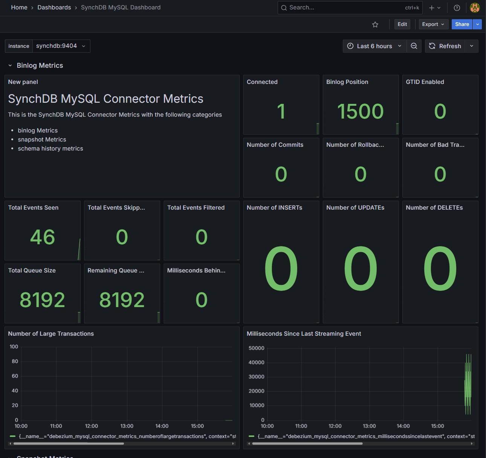
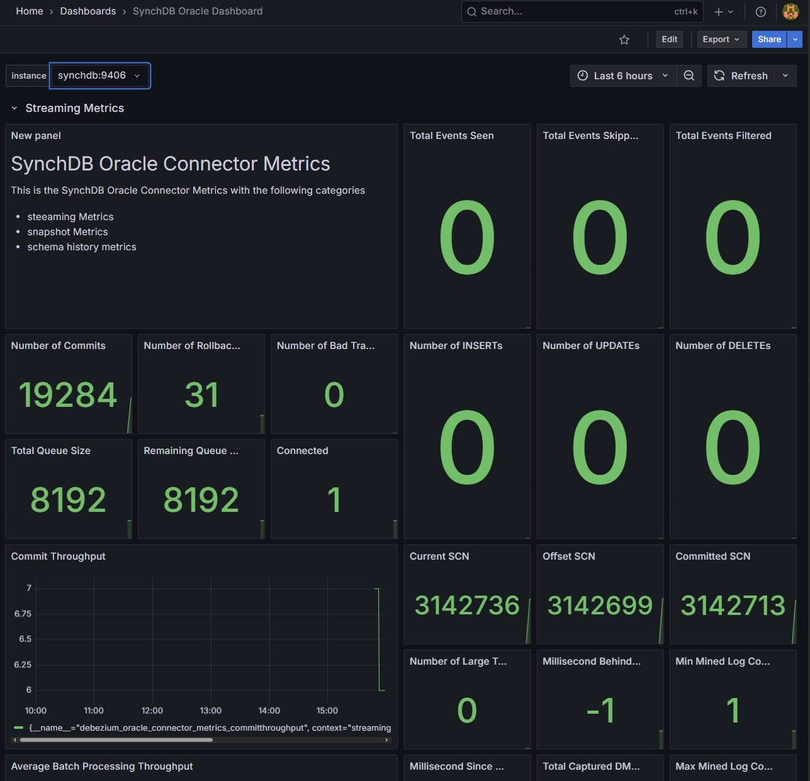

## 世界排名前3的数据库, 正在被这个产品“放血”  
                                                        
### 作者                                                        
digoal                                                        
                                                        
### 日期                                                        
2025-11-28                                                       
                                                        
### 标签                                                        
PostgreSQL , DuckDB , SynchDB , MySQL , Oracle , SQL Server , CDC                               
                                                        
----                                                        
                                                        
## 背景          
世界排名前三的数据库 Oracle , MySQL , SQL Server.  
  
抱歉, 因为PG太好用了, 一传十十传百, 已经形成了不可逆转的趋势.  
  
导致很多用户迫不及待的要把原来的数据库迁移到PG.  
  
怎么迁? 有没有开源的工具? 经常有盆友问我这个问题. 其实不用担心, 因为这个需求量巨大, 市面上会出现越来越多支持将TOP 3的数据库迁移到PG的工具, 也包括开源的.  
  
这不, 马上就来了一个SynchDB.  
  
https://github.com/Hornetlabs/synchdb  
  
来详细了解一下.  
  
## Introduction (引言)  
  
SynchDB 是一个 **PostgreSQL extension** (PostgreSQL 扩展)，旨在实现从多个 **heterogeneous databases** (异构数据库) 到 PostgreSQL 的快速可靠的**data replication** (数据复制)。它消除了对 **middleware** (中间件) 或第三方软件的需求，无需额外的 **orchestration** (编排) 即可实现直接同步。  
  
SynchDB 是一个 **dual-language module** (双语言模块)，结合了 **Java**（用于利用 **Debezium Embedded connectors** (Debezium 嵌入式连接器)）和 **C**（用于与 **PostgreSQL core** (PostgreSQL 核心) 交互）组件，并需要 **Java Virtual Machine (JVM)** (Java 虚拟机) 和 **Java Native Interface (JNI)** (Java 本机接口) 协同工作。  
  
### Supported PostgreSQL Versions (支持的 PostgreSQL 版本)  
  
  * PostgreSQL: 16, 17, 18  
  * IvorySQL: 3, 4, 5  
  
### Supported Source Databases (支持的源数据库)  
  
  * MySQL: 8.0.x, 8.2  
  * SQL Server: 2017, 2019, 2022  
  * Oracle: 12c, 19c, 21c, 23ai  
  * Openlog Replicator: 1.3.0 \~ 1.8.5  
  
请访问 SynchDB 文档站点 [此处](https://docs.synchdb.com/) 获取更多设计细节。  
  
## Architecture (架构)  
  
SynchDB 扩展主要由以下组件构成：  
  
  * **Debezium Runner (Java)** - 负责连接到源数据库并获取**change events** (变更事件)。  
  * **SynchDB Worker** - 负责通过 **JNI** 从 Debezium Runner 轮询**change events** (变更事件)。  
  * **Event Processor** (事件处理器) - 负责将原始事件处理成内部结构。  
  * **Data Converter** (数据转换器) - 负责转换数据值。  
  * **Replication Agent** (复制代理) - 负责将变更应用到 PostgreSQL。  
  
  
  
-----  
  
## Build Requirement (构建要求)  
  
构建和运行 SynchDB 需要以下软件。列出的版本是开发过程中经过测试的版本。较旧的版本可能仍然有效。  
  
  * **Java Development Kit 17** 或更高版本。从 [此处](https://www.oracle.com/ca-en/java/technologies/downloads/) 下载  
  * **Apache Maven 3.6.3** 或更高版本。从 [此处](https://maven.apache.org/download.cgi) 下载  
  * PostgreSQL 源代码或**build enviornment** (构建环境)。从 [此处](https://github.com/postgres/postgres) Git 克隆。请参阅此 [wiki](https://wiki.postgresql.org/wiki/Compile_and_Install_from_source_code) 从源代码构建 PostgreSQL 或参阅此 [page](https://www.postgresql.org/download/linux/) 通过软件包安装 PostgreSQL  
  * **Docker compose 2.28.1** (用于测试)。请参阅 [此处](https://docs.docker.com/compose/install/linux/)  
  * 基于 Unix 的操作系统，如 **Ubuntu 22.04** 或 **MacOS**  
  
**如果在构建中启用了 Openlog Replicator Connector，则需要以下条件**  
  
  * **libprotobuf-c v1.5.2**。请参阅 [此处](https://github.com/protobuf-c/protobuf-c.git) 从源代码构建。  
  
**如果您想使用基于 FDW 的快照 (snapshot)，则需要以下条件**  
  
  * **OCI v23.9.0**。请参阅 [此处](https://docs.synchdb.com/user-guide/configure_snapshot_engine/) 了解更多信息  
  * **oracle\_fdw v2.8.0**。请参阅 [此处](https://github.com/laurenz/oracle_fdw) 从源代码构建。  
  
-----  
  
## Build Procedure (构建过程)  
  
### Default SynchDB Build - Support MySQL, SQLServer and Oracle Connectors (默认 SynchDB 构建 - 支持 MySQL, SQL Server 和 Oracle 连接器)  
  
如果您已安装 PostgreSQL，则可以使用 **PGXS** (PostgreSQL 扩展构建系统) 来构建和安装默认的 SynchDB。请注意，您的 PostgreSQL 安装必须具有 SynchDB 所需的 **pgcrypto extension** (pgcrypto 扩展)。  
  
```bash  
USE_PGXS=1 make PG_CONFIG=$(which pg_config)  
USE_PGXS=1 make build_dbz PG_CONFIG=$(which pg_config)  
  
sudo USE_PGXS=1 make PG_CONFIG=$(which pg_config) install  
sudo USE_PGXS=1 make install_dbz PG_CONFIG=$(which pg_config)  
```  
  
### Build SynchDB with Openlog Replicator Connector Support (构建支持 Openlog Replicator 连接器的 SynchDB)  
  
要构建支持 Openlog Replicator Connector 的 SynchDB，还必须额外构建一个 `Synchdb Oracle Parser` 组件。此组件基于 IvorySQL 的 Oracle Parser，经过修改以适应 SynchDB，它需要 PostgreSQL 后端源代码才能成功构建。以下是具体步骤：  
  
**Prepare Source (准备源代码) (以 16.3 为例)**  
  
```bash  
# Clone the PostgreSQL source and switch to 16.3 release tag  
git clone https://github.com/postgres/postgres.git --branch REL_16_3  
cd postgres  
  
# Clone the SynchDB source from within the extension folder  
cd contrib/  
git clone https://github.com/Hornetlabs/synchdb.git  
```  
  
**Build and Install PostgreSQL from Source (从源代码构建和安装 PostgreSQL)**  
  
这可以通过遵循 [此处](https://www.postgresql.org/docs/current/install-make.html) 所述的标准构建和安装过程来完成。  
  
```bash  
cd /home/$USER/postgres  
./configure --with-ssl=openssl   
make  
sudo make install  
  
```  
  
**Build pgcrypto as required by SynchDB (构建 SynchDB 所需的 pgcrypto)**  
  
```bash  
cd /home/$USER/postgres/contrib/pgcrypto  
make  
sudo make install  
```  
  
**Build SynchDB with Additional Openlog Replicator Connector Support (构建支持 Openlog Replicator 连接器的 SynchDB)**  
  
```bash  
# build and install debezium runner  
cd /home/$USER/postgres/contrib/synchdb  
make build_dbz  
sudo make install_dbz  
  
# build and install oracle parser  
make oracle_parser  
sudo make install_oracle_parser  
  
# build and install synchdb  
make WITH_OLR=1  
sudo make WITH_OLR=1 install  
```  
  
### Configure your Linker (Ubuntu) (配置您的链接器 - Ubuntu)  
  
最后，我们还需要告诉系统的**linker** (链接器) 新添加的 Java 库 (`libjvm.so`) 在系统中的位置。  
  
```bash  
# Dynamically set JDK paths  
JAVA_PATH=$(which java)  
JDK_HOME_PATH=$(readlink -f ${JAVA_PATH} | sed 's:/bin/java::')  
JDK_LIB_PATH=${JDK_HOME_PATH}/lib  
  
echo $JDK_LIB_PATH  
echo $JDK_LIB_PATH/server  
  
sudo echo "$JDK_LIB_PATH" ｜ sudo tee -a /etc/ld.so.conf.d/x86_64-linux-gnu.conf  
sudo echo "$JDK_LIB_PATH/server" | sudo tee -a /etc/ld.so.conf.d/x86_64-linux-gnu.conf  
```  
  
请注意，对于带有 M1/M2 芯片的 Mac，链接器文件位于 `/etc/ld.so.conf.d/aarch64-linux-gnu.conf`。  
  
运行 `ldconfig` 以重新加载：  
  
```bash  
sudo ldconfig  
```  
  
确保 `synchdb.so` 扩展可以链接到系统上的 **libjvm Java library** (libjvm Java 库)：  
  
```bash  
ldd synchdb.so  
    linux-vdso.so.1 (0x00007ffeae35a000)  
    libjvm.so => /usr/lib/jdk-22.0.1/lib/server/libjvm.so (0x00007fc1276c1000)  
    libc.so.6 => /lib/x86_64-linux-gnu/libc.so.6 (0x00007fc127498000)  
...  
```  
  
如果 SynchDB 是在支持 **openlog replicator** (openlog 复制器) 的情况下构建的，请确保它可以链接到系统上的 **libprotobuf-c library** (libprotobuf-c 库)：  
  
```bash  
ldd synchdb.so  
    linux-vdso.so.1 (0x00007ffde6ba5000)  
    libjvm.so => /home/ubuntu/java/jdk-22.0.1/lib/server/libjvm.so (0x00007f3c8e191000)  
    libprotobuf-c.so.1 => /usr/local/lib/libprotobuf-c.so.1 (0x00007f3c8e186000)  
...  
```  
  
-----  
  
## Quick Start (快速入门)  
  
开始使用 SynchDB 的最快方法是使用 `ezdeploy.sh` 实用脚本，它可以部署预编译的 SynchDB 以及所有支持的 **heterogeneous databases** (异构数据库)。  
  
请参阅 [此处](https://docs.synchdb.com/getting-started/quick_start/) 的快速入门指南。  
  
-----  
  
## Basic Usages (基本用法)  
  
安装 SynchDB 扩展。  
  
```sql  
CREATE EXTENSION synchdb CASCADE;  
```  
  
### Create a Connector (创建一个连接器)  
  
**Connector** (连接器) 代表了连接到远程 **heterogeneous database** (异构数据库) 的详细信息，并描述了要从中 **replicate** (复制) 哪些表。它可以使用 `synchdb_add_conninfo()` **function** (函数) 创建。  
  
创建一个 MySQL **connector** (连接器) 并复制 `inventory` 数据库下的 `inventory.orders` 和 `inventory.customers` 表：  
  
```sql  
SELECT synchdb_add_conninfo('mysqlconn','127.0.0.1', 3306, 'mysqluser', 'mysqlpwd', 'inventory', 'postgres', 'inventory.orders,inventory.customers', 'null', 'mysql');  
```  
  
创建一个 SQL Server **connector** (连接器) 并复制 `testDB` 数据库下的所有表：  
  
```sql  
SELECT synchdb_add_conninfo('sqlserverconn','127.0.0.1', 1433, 'sa', 'Password!', 'testDB', 'postgres', 'null', 'null', 'sqlserver');  
```  
  
创建一个 Oracle **connector** (连接器) 并复制 `mydb` 数据库下的所有表：  
  
```sql  
SELECT synchdb_add_conninfo('oracleconn','127.0.0.1', 1521, 'c##dbzuser', 'dbz', 'mydb', 'postgres', 'null', 'null', 'oracle');  
```  
  
创建一个 Openlog Replicator Connector (如果支持) 并复制 `mydb` 数据库下的所有表。注意：我们需要通过 `synchdb_add_conninfo()` 指定连接到 Oracle 的参数，并通过 `synchdb_add_olr_conninfo()` 指定连接到 Openlog Replicator 的参数。  
  
```sql  
SELECT synchdb_add_conninfo('olrconn','127.0.0.1', 1521, 'DBZUSER', 'dbz', 'mydb', 'postgres', 'null', 'null', 'olr');  
SELECT synchdb_add_olr_conninfo('olrconn', '127.0.0.1', 7070, 'ORACLE');  
```  
  
### Review all Connectors Created (查看所有已创建的连接器)  
  
所有已创建的 **connector** (连接器) 都存储在 `synchdb_conninfo` 表中。请注意，用户密码在创建时由 SynchDB **encrypted** (加密)，因此请勿直接修改密码字段。  
  
```sql  
postgres=# \x  
Expanded display is on.  
  
postgres=# select * from synchdb_conninfo;  
-[ RECORD 1 ]-----------------------------------------------------------------------------------------------------------------------------------------------------------------------------------------------------------------------------------------------------------------------------------------------------------------  
name  | oracleconn  
isactive | f  
data  | {"pwd": "\\xc30d04070302e3baf1293d0d553066d234014f6fc52e6eea425884b1f65f1955bf504b85062dfe538ca2e22bfd6db9916662406fc45a3a530b7bf43ce4cfaa2b049a1c9af8", "port": 1521, "user": "c##dbzuser", "dstdb": "postgres", "srcdb": "mydb", "table": null, "snapshottable": null, "hostname": "127.0.0.1", "connector": "oracle"}  
-[ RECORD 2 ]-----------------------------------------------------------------------------------------------------------------------------------------------------------------------------------------------------------------------------------------------------------------------------------------------------------------  
name  | sqlserverconn  
isactive | t  
data  | {"pwd": "\\xc30d0407030245ca4a983b6304c079d23a0191c6dabc1683e4f66fc538db65b9ab2788257762438961f8201e6bcefafa60460fbf441e55d844e7f27b31745f04e7251c0123a159540676c4", "port": 1433, "user": "sa", "dstdb": "postgres", "srcdb": "testDB", "table": null, "snapshottable": null, "hostname": "127.0.0.1", "connector": "sqlserver"}  
-[ RECORD 3 ]-----------------------------------------------------------------------------------------------------------------------------------------------------------------------------------------------------------------------------------------------------------------------------------------------------------------  
name  | mysqlconn  
isactive | t  
data  | {"pwd": "\\xc30d04070302986aff858065e96b62d23901b418a1f0bfdf874ea9143ec096cd648a1588090ee840de58fb6ba5a04c6430d8fe7f7d466b70a930597d48b8d31e736e77032cb34c86354e", "port": 3306, "user": "mysqluser", "dstdb": "postgres", "srcdb": "inventory", "table": "inventory.orders,inventory.customers", "snapshottable": null, "hostname": "127.0.0.1", "connector": "mysql"}  
-[ RECORD 4 ]-----------------------------------------------------------------------------------------------------------------------------------------------------------------------------------------------------------------------------------------------------------------------------------------------------------------  
name  | olrconn  
isactive | t  
data  | {"pwd": "\\xc30d04070302ab2b11bb2c9ece2f7dd2340138f4f541e38fd92119799a4e444b2dcbce9d702efe4f7e7337e7fb11383a577c0f0d3abe0c63022c9d79a6573fcbdbd15e12ba", "port": 1521, "user": "DBZUSER", "dstdb": "postgres", "srcdb": "FREE", "table": null, "hostname": "10.55.13.17", "olr_host": "10.55.13.17", "olr_port": 7070, "connector": "olr", "olr_source": "ORACLE", "snapshottable": null}  
  
```  
  
### Start a Connector (启动一个连接器)  
  
**Connector** (连接器) 可以通过 `synchdb_start_engine_bgw()` **function** (函数) 启动。它接受一个 **connector name argument** (连接器名称参数)，该参数必须在此之前已通过 `synchdb_add_conninfo()` 创建。以下命令以默认快照模式启动连接器，该模式复制指定的表结构、其初始数据，然后继续**stream live changes (CDC)** (流式传输实时变更 - 变更数据捕获)。  
  
```sql  
select synchdb_start_engine_bgw('mysqlconn');  
select synchdb_start_engine_bgw('oracleconn');  
select synchdb_start_engine_bgw('sqlserverconn');  
select synchdb_start_engine_bgw('olrconn');  
```  
  
### View Connector Running States (查看连接器的运行状态)  
  
使用 `synchdb_state_view()` 查看所有连接器的运行状态。  
  
```sql  
postgres=# select * from synchdb_state_view;  
  name   | connector_type  | pid |    stage    | state | err  |                     last_dbz_offset  
---------------+--------------------+--------+---------------------+---------+----------+------------------------------------------------------------------------------------------------------  
sqlserverconn | sqlserver     | 579820 | change data capture | polling | no error | {"commit_lsn":"0000006a:00006608:0003","snapshot":true,"snapshot_completed":false}  
mysqlconn  | mysql       | 579845 | change data capture | polling | no error | {"ts_sec":1741301103,"file":"mysql-bin.000009","pos":574318212,"row":1,"server_id":223344,"event":2}  
oracleconn  | oracle      | 580053 | change data capture | polling | no error | {"commit_scn":"2311579","snapshot_scn":"2311578","scn":"2311578"}  
olrconn   | olr        | 121673 | change data capture | polling | no error | {"scn":2362817, "c_scn":2362820, "c_idx":4}  
(4 rows)  
  
```  
  
### Stop a Connector (停止一个连接器)  
  
使用 `synchdb_stop_engine_bgw()` **SQL function** (SQL 函数) 停止一个 **connector** (连接器)。它接受一个 **connector name argument** (连接器名称参数)，该参数必须在此之前已通过 `synchdb_add_conninfo()` **function** (函数) 创建。  
  
```sql  
select synchdb_stop_engine_bgw('mysqlconn');  
select synchdb_stop_engine_bgw('sqlserverconn');  
select synchdb_stop_engine_bgw('oracleconn');  
select synchdb_stop_engine_bgw('olrconn');  
```  
  
除了查看synchdb_state_view试图, 还有可视化监控:  
  
  
  
  
  
  
#### [PolarDB 学习图谱](https://www.aliyun.com/database/openpolardb/activity "8642f60e04ed0c814bf9cb9677976bd4")
  
  
#### [PostgreSQL 解决方案集合](../201706/20170601_02.md "40cff096e9ed7122c512b35d8561d9c8")
  
  
#### [德哥 / digoal's Github - 公益是一辈子的事.](https://github.com/digoal/blog/blob/master/README.md "22709685feb7cab07d30f30387f0a9ae")
  
  
#### [About 德哥](https://github.com/digoal/blog/blob/master/me/readme.md "a37735981e7704886ffd590565582dd0")
  
  

  
