## Supabase 源码学习: 2.1.2 构建配置（Build Configuration）  
      
### 作者      
digoal      
      
### 日期      
2025-11-28      
      
### 标签      
Supabase , Firebase , 源码学习 , 后端即服务 , BaaS , backend platform , 后端平台 , 开源项目缝合 , 前端 , 后端 , 自动生成API , 数据库 , 包管理 , 日志      
      
----      
      
## 背景      
本文档详细介绍了 **Studio Dashboard** 应用程序（位于 [`apps/studio`]）的**构建配置**（Build Configuration），涵盖了 **Next.js 配置**（Next.js configuration）、**webpack 定制**（webpack customization）、**Sentry 集成**（Sentry integration）、**环境变量管理**（environment variable management）、**CDN 资源交付**（CDN asset delivery）以及 **Turbo 构建编排**（Turbo build orchestration）。  
  
## 构建配置概述（Build Configuration Overview）  
  
Studio 应用程序使用 **Next.js** 15.5.2，并带有用于 **Vercel** **生产部署**（production deployment）、**Docker 容器**（Docker containers）的**独立输出**（standalone output）以及基于**环境的特性标志**（environment-based feature flags）的广泛定制配置。  
  
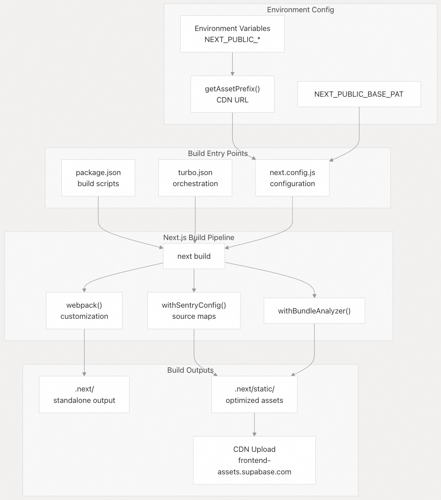    
  
**来源:**  
[`apps/studio/next.config.js` 1-601](https://github.com/supabase/supabase/blob/7490ca9e/apps/studio/next.config.js#L1-L601)  
[`apps/studio/package.json` 1-205](https://github.com/supabase/supabase/blob/7490ca9e/apps/studio/package.json#L1-L205)  
[`turbo.json` 46-129](https://github.com/supabase/supabase/blob/7490ca9e/turbo.json#L46-L129)  
  
## 构建脚本（Build Scripts）  
  
Studio 应用程序定义了几个用于编排构建流程的**构建脚本**：  
  
| Script | Command | Purpose |  
| :--- | :--- | :--- |  
| `build` | `next build && ./../../scripts/upload-static-assets.sh` | 生产构建并上传 CDN 资源 |  
| `dev` | `next dev --turbopack -p 8082` | 使用 **Turbopack** 的开发服务器 |  
| `build:graphql-types` | `tsx scripts/download-graphql-schema.mts && pnpm graphql-codegen --config scripts/codegen.ts` | 生成 **GraphQL** 类型定义 |  
| `build:deno-types` | `tsx scripts/deno-types.ts` | 生成 **Deno TypeScript 声明** |  
| `pretypecheck` | `next typegen` | 在类型检查前生成 **Next.js 路由类型** |  
  
**来源:**  
[`apps/studio/package.json` 5-26](https://github.com/supabase/supabase/blob/7490ca9e/apps/studio/package.json#L5-L26)  
  
### 构建流程（Build Process Flow）  
  
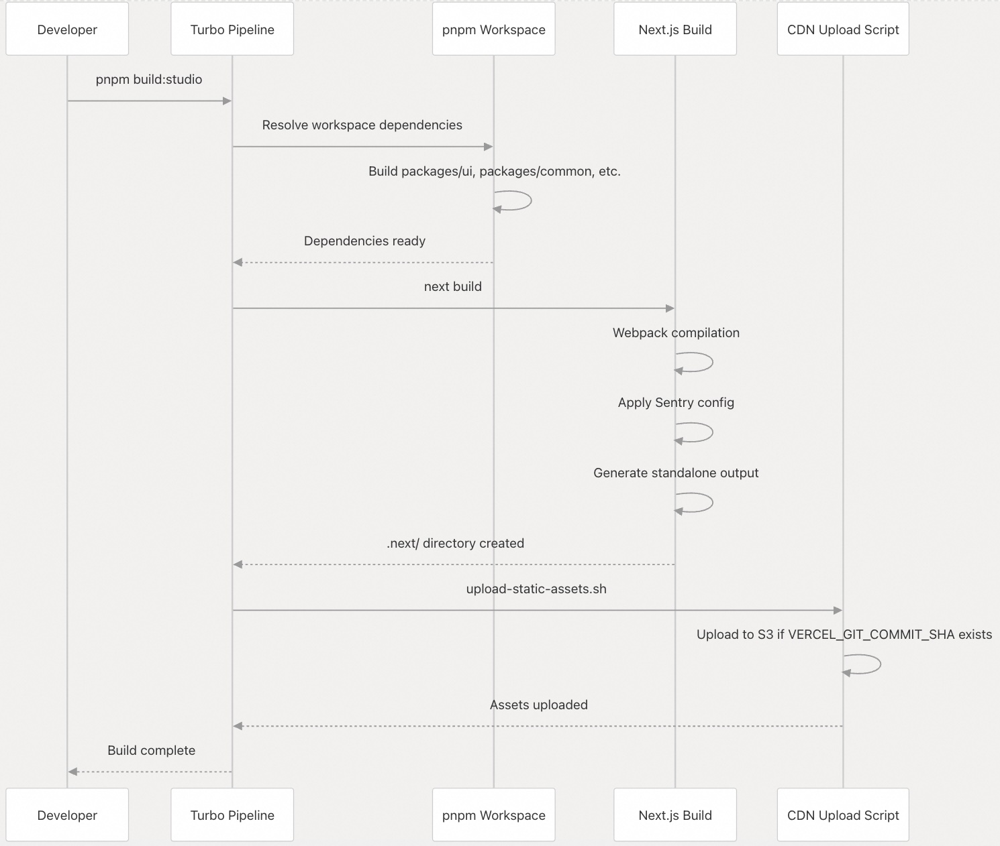    
  
**来源:**  
[`apps/studio/package.json` 8](https://github.com/supabase/supabase/blob/7490ca9e/apps/studio/package.json#L8-L8)  
[`turbo.json` 46-129](https://github.com/supabase/supabase/blob/7490ca9e/turbo.json#L46-L129)  
  
## Next.js 配置结构（Next.js Configuration Structure）  
  
主配置从 `next.config.js` 导出，带有条件 **Sentry 封装**（Sentry wrapping）：  
  
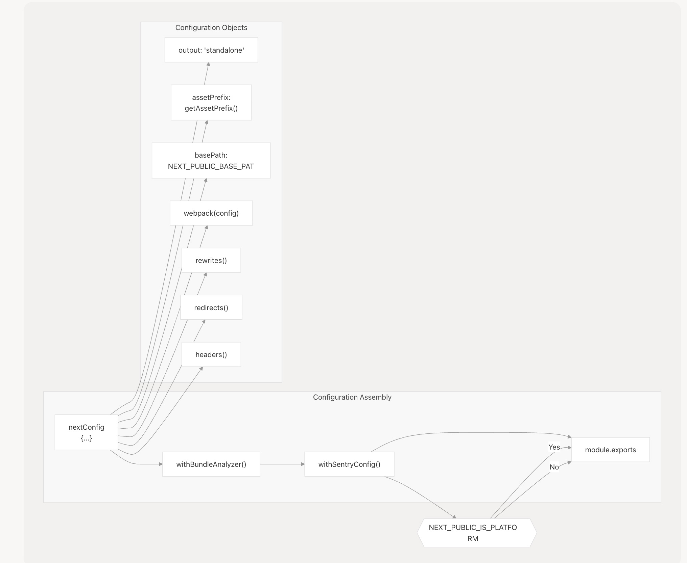    
  
**来源:**  
[`apps/studio/next.config.js` 29-601](https://github.com/supabase/supabase/blob/7490ca9e/apps/studio/next.config.js#L29-L601)  
  
### 核心配置属性（Core Configuration Properties）  
  
`nextConfig` 对象定义了以下关键属性：  
  
**输出配置（Output Configuration）:**  
  
  * `output: 'standalone'` - 启用用于**容器化**（containerization）的**独立输出**（standalone build） [`apps/studio/next.config.js` 35](https://github.com/supabase/supabase/blob/7490ca9e/apps/studio/next.config.js#L35-L35)  
  * `basePath: process.env.NEXT_PUBLIC_BASE_PATH` - 可配置的**基础路径**（base path）用于部署 [`apps/studio/next.config.js` 33](https://github.com/supabase/supabase/blob/7490ca9e/apps/studio/next.config.js#L33-L33)  
  * `assetPrefix: getAssetPrefix()` - **静态资源**（static assets）的 **CDN URL** [`apps/studio/next.config.js` 34](https://github.com/supabase/supabase/blob/7490ca9e/apps/studio/next.config.js#L34-L34)  
  
**实验性特性（Experimental Features）:**  
  
  * `webpackBuildWorker: true` - 启用**并行 webpack 构建**（parallel webpack builds） [`apps/studio/next.config.js` 36-38](https://github.com/supabase/supabase/blob/7490ca9e/apps/studio/next.config.js#L36-L38)  
  
**转译包（Transpiled Packages）:**  
  
```  
transpilePackages: [  
  'ui',  
  'ui-patterns',  
  'common',  
  'shared-data',  
  'api-types',  
  'icons',  
  'libpg-query',  
]  
```  
  
[`apps/studio/next.config.js` 517-525](https://github.com/supabase/supabase/blob/7490ca9e/apps/studio/next.config.js#L517-L525)  
  
**来源:**  
[`apps/studio/next.config.js` 32-567](https://github.com/supabase/supabase/blob/7490ca9e/apps/studio/next.config.js#L32-L567)  
  
## Webpack 定制（Webpack Customization）  
  
Studio 应用程序**定制**（customizes）了 **webpack** 以处理特定文件类型和 **Monaco Editor 兼容性**（Monaco Editor compatibility）：  
  
### Monaco Editor 规则修改（Monaco Editor Rule Modification）  
  
配置修改了 **webpack 的模块规则**（webpack's module rules）以正确处理 **Monaco Editor 导入**（Monaco Editor imports）：  
  
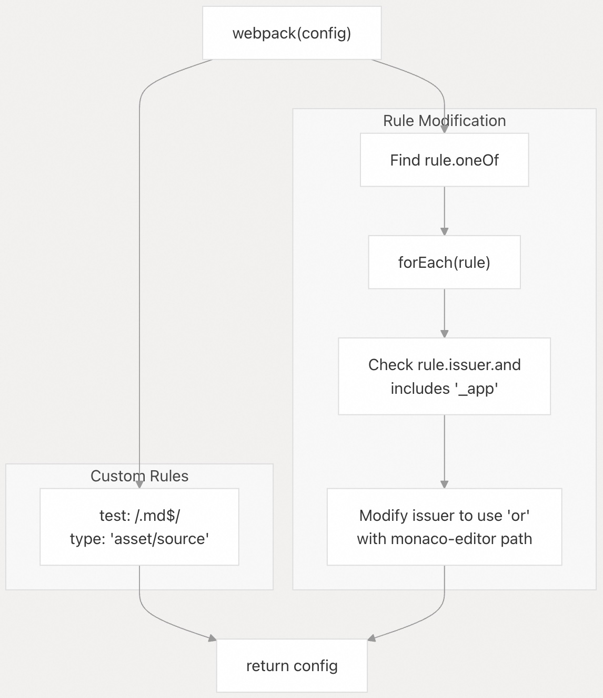    
  
位于 `apps/studio/next.config.js` 文件中的 Webpack 函数执行了两个关键修改：  
  
1.  **Monaco Editor 依赖修复 (Monaco Editor Issuer Fix):**  
    * 修改了用于检查 `_app` 文件的规则的发布者（issuer）模式，以包含 Monaco Editor 的路径。  
    * *来源:* `apps/studio/next.config.js` 第 536-544 行  
2.  **Markdown 文件处理 (Markdown File Handling):**  
    * 添加了一条规则，使用 `asset/source` 类型将 **`.md`**（Markdown）文件作为原始文本加载。  
    * *来源:* `apps/studio/next.config.js` 第 547-550 行  
  
## Sentry 集成 (Sentry Integration)  
  
Sentry 仅在 **`NEXT_PUBLIC_IS_PLATFORM === 'true'`** 时有条件地集成。  
  
| Sentry 配置选项 (Option) | 值 (Value) | 目的 (Purpose) |  
| :--- | :--- | :--- |  
| **`silent`** | `true` | 抑制构建期间的日志信息。 |  
| **`widenClientFileUpload`** | `true` | 上传更多的 Source Map 以获取更完整的堆栈跟踪（Stack Traces）。 |  
| **`reactComponentAnnotation.enabled`** | `true` | 为 React 组件添加注释，以方便调试。 |  
| **`hideSourceMaps`** | `true` | 防止 Source Map 文件被客户端访问。 |  
| **`disableLogger`** | `true` | 在 Tree-shaking 过程中移除 Sentry logger 语句。 |  
| **`automaticVercelMonitors`** | `true` | 启用 Vercel Cron 任务监控。 |  
  
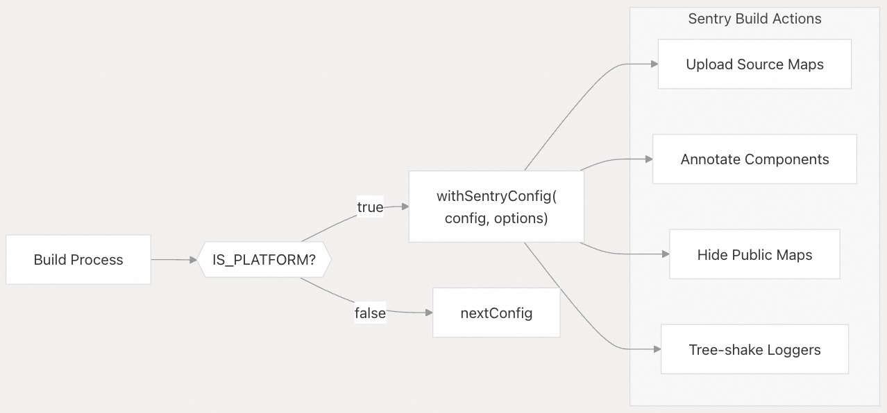    
  
**使用的环境变量**  
  
| 变量名称 | 目的 |  
| :--- | :--- |  
| **`SENTRY_ORG`** | Sentry 组织的标识符。 |  
| **`SENTRY_PROJECT`** | Sentry 中的项目标识符。 |  
| **`SENTRY_AUTH_TOKEN`** | 用于上传 Source Map 的身份验证令牌。 |  
| **`NEXT_PUBLIC_SENTRY_DSN`** | 客户端使用的 Sentry DSN（Data Source Name）。 |  
  
*来源:* `apps/studio/next.config.js` 第 572-600 行; `turbo.json` 第 109-112 行  
  
  
## 环境变量 (Environment Variables)  
  
Studio 的构建依赖于通过 Turbo 配置的大量环境变量：  
  
### 1. 构建时变量 (Build-Time Variables)  
  
这些变量在构建期间被嵌入到最终的输出中，会影响构建结果：  
  
| 变量 (Variable) | 目的 (Purpose) | 默认值/示例 (Default/Example) |  
| :--- | :--- | :--- |  
| **`NEXT_PUBLIC_BASE_PATH`** | URL 基础路径 | `/studio` 或空值 |  
| **`NEXT_PUBLIC_IS_PLATFORM`** | 平台模式 vs. 自托管模式 | `'true'` 或 `'false'` |  
| **`NEXT_PUBLIC_ENVIRONMENT`** | 环境标识符 | `'staging'` 或 `'production'` |  
| **`NEXT_PUBLIC_SITE_URL`** | Studio 的 URL | `https://supabase.com` |  
| **`NEXT_PUBLIC_API_URL`** | 平台 API URL | 平台后端的端点 |  
| **`NEXT_PUBLIC_DOCS_URL`** | 文档 URL | `https://supabase.com/docs` |  
| **`VERCEL_GIT_COMMIT_SHA`** | Git 提交哈希值（用于 CDN 缓存） | SHA 字符串 |  
| **`SITE_NAME`** | 站点标识符（用于 CDN） | `'studio'` |  
| **`FORCE_ASSET_CDN`** | 强制执行 CDN 行为 | `'1'`、 `'-1'` 或未设置 |  
  
*来源:* `turbo.json` 第 46-129 行  
  
### 2. 运行时变量（透传） (Runtime Variables - Pass-Through)  
  
这些变量不会嵌入到构建输出中，而是在**应用运行时**才可用（通常用于后端连接或敏感配置）。  
  
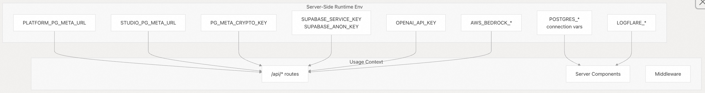    
  
* **数据库连接 (Database Connection):**  
    * `POSTGRES_HOST`, `POSTGRES_PORT`, `POSTGRES_DB`  
    * `POSTGRES_USER_READ_WRITE`, `POSTGRES_USER_READ_ONLY`  
    * `POSTGRES_PASSWORD`  
* **服务密钥 (Service Keys):**  
    * `SUPABASE_SERVICE_KEY` (管理员访问 Supabase 服务)  
    * `SUPABASE_ANON_KEY` (公开匿名密钥)  
    * `READ_ONLY_API_KEY` (只读访问密钥)  
* **AI 服务 (AI Services):**  
    * `OPENAI_API_KEY` (OpenAI API 访问)  
    * `AWS_BEDROCK_PROFILE`, `AWS_BEDROCK_ROLE_ARN` (AWS Bedrock 配置)  
  
*来源:* `turbo.json` 第 86-126 行  
  
### Environment Variable Flow  
  
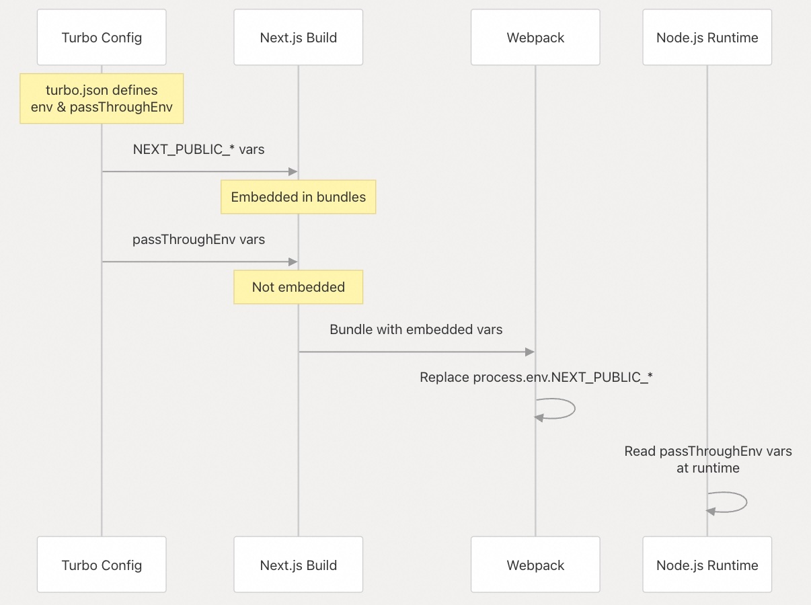    
  
## 资产 CDN 配置 (Asset CDN Configuration)  
  
Studio 应用程序在生产环境中会使用 CDN 来处理静态资产。  
  
### `getAssetPrefix()` 函数  
  
**资源前缀**（asset prefix）由 [`apps/studio/next.config.js` 10-27](https://github.com/supabase/supabase/blob/7490ca9e/apps/studio/next.config.js#L10-L27) 中的 `getAssetPrefix()` 函数确定：  
  
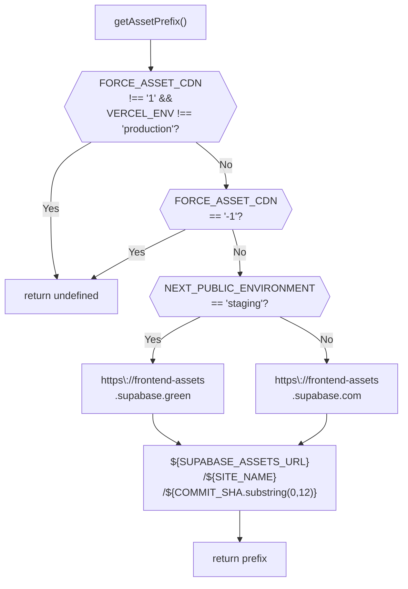
  
  
**CDN URL 结构（CDN URL Structure）:**  
  
```  
https://frontend-assets.supabase.com/studio/{12-char-commit-sha}/_next/static/...  
```  
  
**来源:**  
[`apps/studio/next.config.js` 10-27](https://github.com/supabase/supabase/blob/7490ca9e/apps/studio/next.config.js#L10-L27)  
  
### 资源上传流程（Asset Upload Process）  
  
在 **Next.js 构建**完成后，`upload-static-assets.sh` 脚本会将**静态资源**（static assets）上传到 **S3**：  
  
**必需的环境变量（Required Environment Variables）:**  
  
  * `VERCEL_GIT_COMMIT_SHA` - 必须存在才能触发上传  
  * `AWS_ACCESS_KEY_ID` - **S3 访问凭证**（S3 access credentials）  
  * `AWS_SECRET_ACCESS_KEY` - **S3 密钥**  
  * `ASSET_CDN_S3_ENDPOINT` - **S3 端点 URL**（S3 endpoint URL）  
  * `SITE_NAME` - **S3 中的目录前缀**（Directory prefix in S3）  
  
**来源:**  
[`apps/studio/package.json` 8](https://github.com/supabase/supabase/blob/7490ca9e/apps/studio/package.json#L8-L8)  
[`turbo.json` 117-120](https://github.com/supabase/supabase/blob/7490ca9e/turbo.json#L117-L120)  
  
## 路由配置（Routing Configuration）  
  
Studio 应用程序为**平台模式**（platform）和**自托管模式**（self-hosted modes）定义了广泛的**路由规则**（routing rules）：  
  
### 重写（Rewrites）  
  
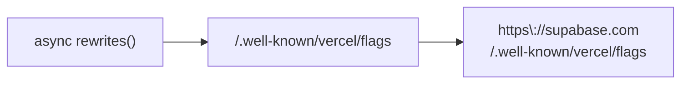
  
单个**重写规则**（rewrite rule）将 **Vercel 特性标志**（Vercel feature flags）从主 `supabase.com` 域**代理**（proxies）出来 [`apps/studio/next.config.js` 39-47](https://github.com/supabase/supabase/blob/7490ca9e/apps/studio/next.config.js#L39-L47)  
  
**来源:**  
[`apps/studio/next.config.js` 39-47](https://github.com/supabase/supabase/blob/7490ca9e/apps/studio/next.config.js#L39-L47)  
  
### 重定向（Redirects）  
  
**重定向配置**（redirect configuration）根据**平台模式**（platform mode）的不同而变化：  
  
#### 平台模式重定向（Platform Mode Redirects）  
  
当 `NEXT_PUBLIC_IS_PLATFORM === 'true'` 时：  
  
| Source | Destination | Purpose |  
| :--- | :--- | :--- |  
| `/` | `/org` | **根路径到组织页面**（Root to organizations page） |  
| `/` with `?next=new-project` | `/new/new-project` | **新项目流程**（New project flow） |  
| `/register`, `/signup` | `/sign-up` | **认证 URL 规范化**（Auth URL normalization） |  
| `/signin`, `/login`, `/log-in` | `/sign-in` | **认证 URL 规范化**（Auth URL normalization） |  
  
#### 自托管模式重定向（Self-Hosted Mode Redirects）  
  
当 `NEXT_PUBLIC_IS_PLATFORM !== 'true'` 时：  
  
| Source | Destination | Purpose |  
| :--- | :--- | :--- |  
| `/` | `/project/default` | **根路径到默认项目**（Root to default project） |  
| Auth URLs | `/project/default` | **所有认证流程重定向到项目**（All auth flows redirect to project） |  
  
#### 常见重定向（Common Redirects）  
  
两种模式共享 40 多个用于 URL 结构更改的重定向，包括：  
  
  * **数据库设置整合**（Database settings consolidation）：`/project/:ref/settings/database` → `/project/:ref/database/settings`  
  * **存储设置迁移**（Storage settings moves）：`/project/:ref/settings/storage` → `/project/:ref/storage/files/settings`  
  * **计费 URL 更新**（Billing URL updates）：各种计费 URL 重定向到组织计费  
  * **功能重组**（Feature reorganization）：**API 日志**（API logs）、**密码库**（vault）、**Webhook**（webhooks）等  
  
**来源:**  
[`apps/studio/next.config.js` 48-432](https://github.com/supabase/supabase/blob/7490ca9e/apps/studio/next.config.js#L48-L432)  
  
### 安全头（Security Headers）  
  
`headers()` 函数为所有路由定义了**安全头**（security headers）：  
  
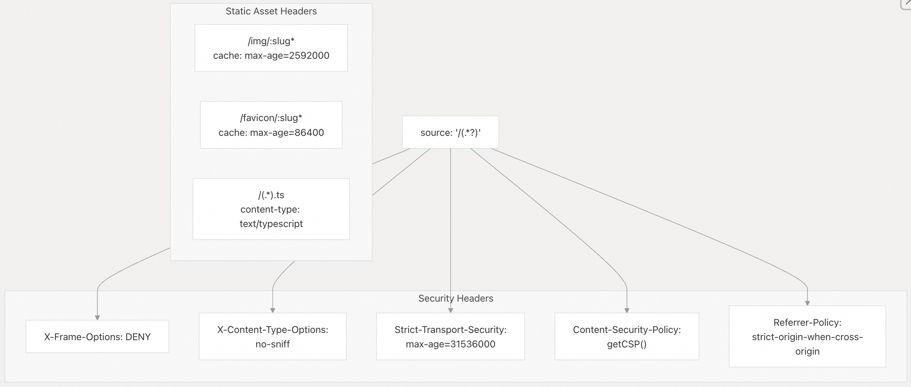    
  
**值得注意的头部规则（Notable Header Rules）:**  
  
1.  **仅限平台模式的 CSP**（Platform-Only CSP）：**内容安全策略**（Content Security Policy）仅在 `NEXT_PUBLIC_IS_PLATFORM === 'true'` 时应用，使用 `csp.js` 中的 `getCSP()` 函数 [`apps/studio/next.config.js` 454-456](https://github.com/supabase/supabase/blob/7490ca9e/apps/studio/next.config.js#L454-L456)  
2.  **HSTS**：仅在 **Vercel 生产部署**（Vercel production deployments）上启用 [`apps/studio/next.config.js` 447-452](https://github.com/supabase/supabase/blob/7490ca9e/apps/studio/next.config.js#L447-L452)  
3.  **TypeScript 内容类型**：针对 `.ts` 文件进行特殊处理，以正确的 **MIME 类型**（MIME type）提供服务 [`apps/studio/next.config.js` 482-484](https://github.com/supabase/supabase/blob/7490ca9e/apps/studio/next.config.js#L482-L484)  
  
**来源:**  
[`apps/studio/next.config.js` 433-486](https://github.com/supabase/supabase/blob/7490ca9e/apps/studio/next.config.js#L433-L486)  
  
## Turbo 构建流水线（Turbo Build Pipeline）  
  
**Turbo** 通过**依赖管理**（dependency management）在 **monorepo** 中编排构建流程：  
  
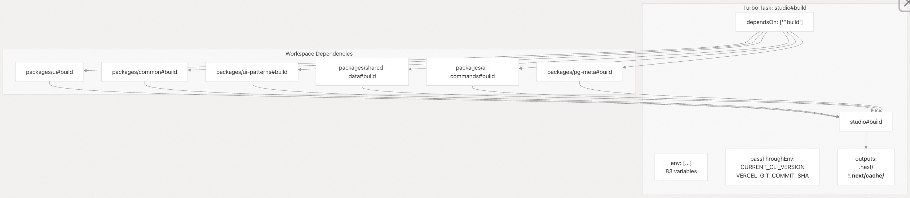    
  
### Studio 构建配置（Studio Build Configuration）  
  
**关键配置属性（Key Configuration Properties）:**  
  
  * **依赖顺序（Dependency Order）** ：`"dependsOn": ["^build"]` 确保所有**工作区包**（workspace packages）都在 Studio 构建之前构建 [`turbo.json` 47](https://github.com/supabase/supabase/blob/7490ca9e/turbo.json#L47-L47)  
  * **环境隔离（Environment Isolation）** ：显式列出了 83 个环境变量以确保**可复现性**（reproducibility） [`turbo.json` 48-126](https://github.com/supabase/supabase/blob/7490ca9e/turbo.json#L48-L126)  
  * **透传变量（Pass-Through Variables）** ：`CURRENT_CLI_VERSION` 和 `VERCEL_GIT_COMMIT_SHA` 被**透传**（passed through）而不嵌入 [`turbo.json` 127](https://github.com/supabase/supabase/blob/7490ca9e/turbo.json#L127-L127)  
  * **缓存输出（Cache Outputs）** ：`.next/**` 除了缓存目录 [`turbo.json` 128](https://github.com/supabase/supabase/blob/7490ca9e/turbo.json#L128-L128)  
  
**来源:**  
[`turbo.json` 46-129](https://github.com/supabase/supabase/blob/7490ca9e/turbo.json#L46-L129)  
  
### 构建执行顺序（Build Execution Order）  
  
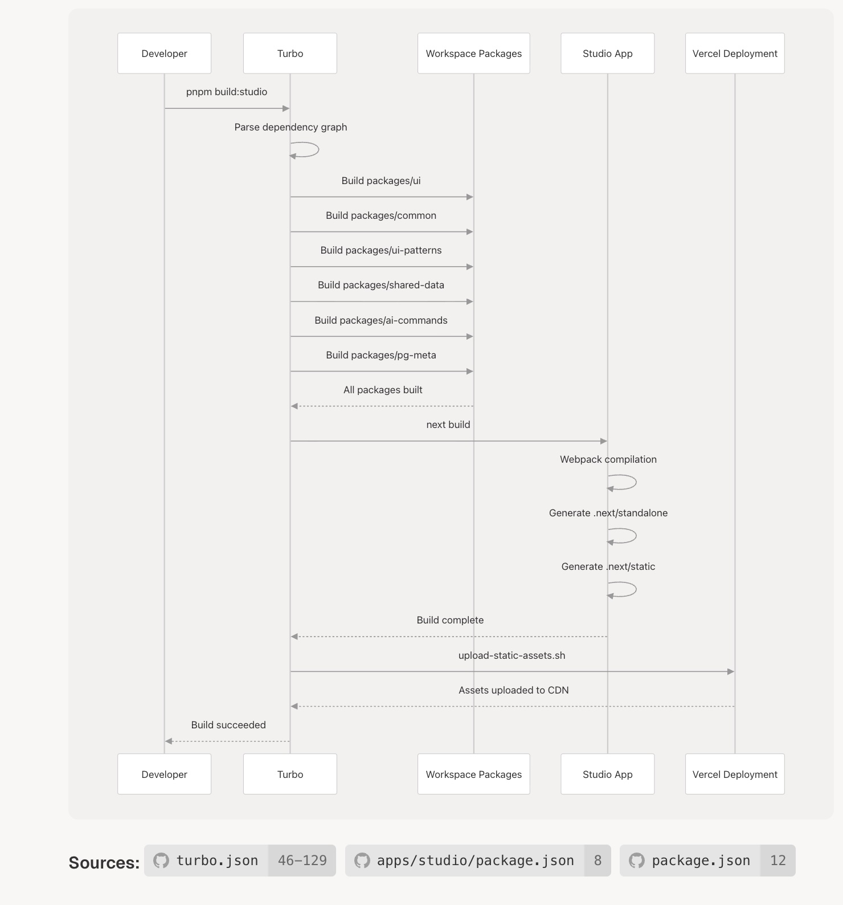    
  
**来源:**  
[`turbo.json` 46-129](https://github.com/supabase/supabase/blob/7490ca9e/turbo.json#L46-L129)  
[`apps/studio/package.json` 8](https://github.com/supabase/supabase/blob/7490ca9e/apps/studio/package.json#L8-L8)  
[`package.json` 12](https://github.com/supabase/supabase/blob/7490ca9e/package.json#L12-L12)  
  
## 构建优化（Build Optimization）  
  
Studio 构建包含了几种**优化策略**：  
  
### Bundle 分析（Bundle Analysis）  
  
可以通过 `ANALYZE` 环境变量启用 **Bundle 分析**（Bundle analysis）：  
  
```  
const withBundleAnalyzer = require('@next/bundle-analyzer')({  
  enabled: process.env.ANALYZE === 'true',  
})  
```  
  
[`apps/studio/next.config.js` 2-4](https://github.com/supabase/supabase/blob/7490ca9e/apps/studio/next.config.js#L2-L4)  
  
**用法（Usage）:**  
  
```  
ANALYZE=true pnpm build:studio  
```  
  
  
### TypeScript 配置（TypeScript Configuration）  
  
**TypeScript 类型检查**（TypeScript type checking）为了效率而与构建流程分离：  
  
  * **构建时（Build Time）** ：`ignoreBuildErrors: true` [`apps/studio/next.config.js` 561](https://github.com/supabase/supabase/blob/7490ca9e/apps/studio/next.config.js#L561-L561)  
  * **CI/CD 阶段（CI Time）** ：单独的 `pnpm typecheck` 命令在 `next typegen` 之后运行 `tsc --noEmit` [`apps/studio/package.json` 19-20](https://github.com/supabase/supabase/blob/7490ca9e/apps/studio/package.json#L19-L20)  
  
### 按需条目缓存（On-Demand Entry Caching）  
  
配置增加了**按需条目缓存**（on-demand entries cache）：  
  
```  
onDemandEntries: {  
  maxInactiveAge: 24 * 60 * 60 * 1000, // 24 hours  
  pagesBufferLength: 100,              // Keep 100 pages in memory  
}  
```  
  
[`apps/studio/next.config.js` 554-557](https://github.com/supabase/supabase/blob/7490ca9e/apps/studio/next.config.js#L554-L557)  
  
**来源:**  
[`apps/studio/next.config.js` 2-4](https://github.com/supabase/supabase/blob/7490ca9e/apps/studio/next.config.js#L2-L4)  
[`apps/studio/next.config.js` 554-567](https://github.com/supabase/supabase/blob/7490ca9e/apps/studio/next.config.js#L554-L567)  
  
## 本地开发配置（Local Development Configuration）  
  
对于针对**自托管 Supabase 堆栈**（self-hosted Supabase stack）的本地开发，代码库中包含**设置脚本**（setup scripts）：  
  
### 本地环境设置（Local Environment Setup）  
  
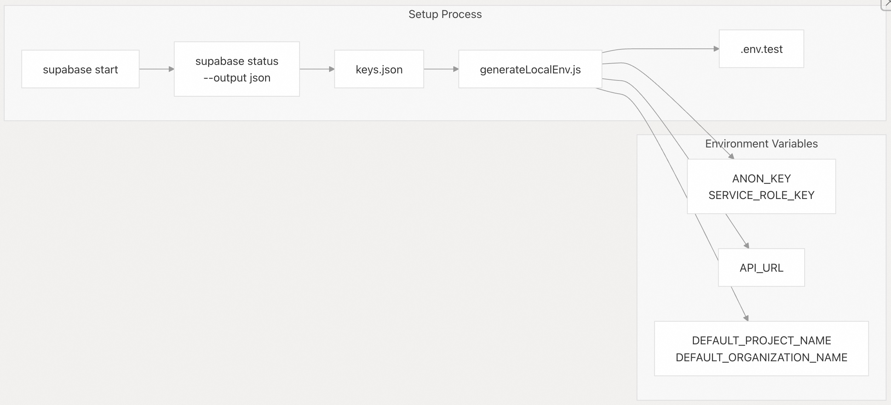    
  
**设置命令（Setup Command）:**  
  
```  
pnpm setup:cli  
```  
  
该命令会执行以下操作：  
  
1.  启动**本地 Supabase 服务**（Local Supabase services），**排除 Studio**（excluding Studio） [`package.json` 43](https://github.com/supabase/supabase/blob/7490ca9e/package.json#L43-L43)  
2.  将**服务凭证**（service credentials）捕获到 `keys.json` 中  
3.  运行 `generateLocalEnv.js` 来创建 `.env.test` [`scripts/generateLocalEnv.js` 1-43](https://github.com/supabase/supabase/blob/7490ca9e/scripts/generateLocalEnv.js#L1-L43)  
  
**生成的环境变量（Generated Environment Variables）:**  
  
| Variable | Source | Purpose |  
| :--- | :--- | :--- |  
| `SUPABASE_URL` | `keys.json.$API_URL` | **本地 API 端点**（Local API endpoint） |  
| `SUPABASE_ANON_KEY` | `keys.json.$ANON_KEY` | **本地匿名密钥**（Local anon key） |  
| `SUPABASE_SERVICE_KEY` | `keys.json.$SERVICE_ROLE_KEY` | **本地服务密钥**（Local service key） |  
| `STUDIO_PG_META_URL` | `${API_URL}/pg` | **本地 pg-meta 端点**（Local pg-meta endpoint） |  
| `NEXT_PUBLIC_GOTRUE_URL` | `${API_URL}/auth/v1` | **本地 GoTrue 端点**（Local GoTrue endpoint） |  
| `LOGFLARE_URL` | `http://127.0.0.1:54327` | **本地 Logflare**（Local Logflare） |  
  
**来源:**  
[`package.json` 43](https://github.com/supabase/supabase/blob/7490ca9e/package.json#L43-L43)  
[`scripts/generateLocalEnv.js` 1-43](https://github.com/supabase/supabase/blob/7490ca9e/scripts/generateLocalEnv.js#L1-L43)  
  
## 跨应用一致性（Cross-Application Consistency）  
  
**Studio**、**Docs**（文档）和 **WWW**（营销网站）的**构建配置**共享**共同模式**（common patterns），但在具体细节上有所不同：  
  
### 配置比较（Configuration Comparison）  
  
| Feature | Studio | Docs | WWW |  
| :--- | :--- | :--- | :--- |  
| **Next.js Version** | 15.5.2 | 15.5.2 | 15.5.2 |  
| **Output Mode**（输出模式） | `standalone` | 未设置 | 未设置 |  
| **Base Path**（基础路径） | 可配置 | `/docs` | 空 |  
| **Sentry Integration**（Sentry 集成） | 仅限平台模式 | 始终 | 始终 |  
| **MDX Support**（MDX 支持） | 否 | 是 | 是 |  
| **CDN Assets**（CDN 资源） | 是 | 否 | 否 |  
  
  
**关键差异**  
  
| 应用 (Application) | 关键配置差异 (Key Configuration Difference) | 目的 (Purpose) | 来源 (Source) |  
| :--- | :--- | :--- | :--- |  
| **Studio** | 使用 **`standalone`** 输出模式。 | 优化 **容器化** (Containerization) 和 Docker 部署的效率。 | `apps/studio/next.config.js` 第 35 行 |  
| **Docs** | 需要 **MDX 插件**和 **OpenAPI 处理**。 | 用于处理文档内容，集成 MDX 格式，并可能从 OpenAPI 规范生成文档。 | `apps/docs/next.config.mjs` 第 15-22 行 |  
| **WWW** | 使用 **Code Hike**。 | 用于网站 (WWW) 应用程序中的**代码语法高亮**和交互式代码块展示。 | `apps/www/next.config.mjs` 第 12-33 行 |  
  
-----  
  
# 附录1: 【架构师/部署】CDN 资产交付和版本回滚的原子性（Atomicity）  
  
Studio 使用提交 **SHA** 作为 `assetPrefix` 并通过 **`upload-static-assets.sh`** 上传静态资源到 S3，构建了自定义的 **CDN 资产交付流程**（CDN Asset Delivery Pipeline）。  
  
**关键问题：**  
  
> 请问在进行**热修复**（Hotfix）或**版本回滚**（Rollback）时，**CDN 的缓存失效**（Cache Invalidation）机制是什么？我们如何确保新版本的 `assetPrefix` 生效时，所有必要的静态资源（特别是关键字体和图片）已在 S3 上**原子性**（Atomically）地就绪并可访问，以避免用户看到混合版本或损坏的 UI？  
  
**(展开的细节： 这涉及到生产环境的性能和稳定性，需要了解 `upload-static-assets.sh` 如何与 Vercel 部署流程协调，以及是否使用了 S3 的版本控制或专门的 CDN 预热/刷新服务。)**   
  
## 回答  
  
## CDN 缓存失效机制分析  
  
基于当前代码库上下文，我无法完全回答关于热修复和版本回滚时 CDN 缓存失效机制的问题，因为关键的实现细节不在提供的代码片段中。  
  
### 当前可见的实现  
  
**assetPrefix 生成机制：**  
Studio 应用通过 `getAssetPrefix()` 函数使用提交 SHA 作为版本标识  ：  
  
```javascript  
function getAssetPrefix() {  
  // 环境检查逻辑  
  const SUPABASE_ASSETS_URL =  
    process.env.NEXT_PUBLIC_ENVIRONMENT === 'staging'  
      ? 'https://frontend-assets.supabase.green'  
      : 'https://frontend-assets.supabase.com'  
    
  return `${SUPABASE_ASSETS_URL}/${process.env.SITE_NAME}/${process.env.VERCEL_GIT_COMMIT_SHA.substring(0, 12)}`  
}  
```  
  
**构建流程：**  
构建脚本在 `apps/studio/package.json` 中定义  ：  
```json  
"build": "next build && ./../../scripts/upload-static-assets.sh"  
```  
  
### 缺失的关键信息  
  
要完整回答您的问题，需要查看以下未在当前上下文中提供的代码：  
  
1. **`upload-static-assets.sh` 脚本实现** - 了解 S3 上传的具体流程和原子性保证  
2. **CDN 缓存失效机制** - 没有找到明确的缓存刷新或失效代码  
3. **Vercel 部署集成** - 需要了解部署流程如何与 CDN 上传协调  
  
### 相关的 Smart CDN 机制  
  
从博客文章中可以看到，Supabase Storage 有 Smart CDN 机制  ，但这主要针对 Storage 服务，而非 Studio 应用的静态资源 CDN。  
  
## 建议  
  
要获得完整的答案，建议查看：  
- `scripts/upload-static-assets.sh` 脚本  
- Vercel 部署配置  
- CDN 提供商的缓存失效配置  
  
## Notes  
  
当前代码库上下文主要展示了 `assetPrefix` 的生成逻辑和构建脚本调用，但缺少关键的 S3 上传脚本和 CDN 缓存失效机制的实现细节。其他应用（www、docs）使用类似的 `getAssetPrefix()` 模式   ，但同样缺少缓存失效的具体实现。  
  
  
  
-----  
  
# 附录2: 【开发者/日常维护】复杂路由规则的回归测试（Regression Testing）  
  
Studio 的 **`next.config.js`** 中定义了超过 **40 条常见重定向**（Common Redirects）以及平台模式（Platform Mode）和自托管模式（Self-Hosted Mode）下的复杂路由规则。  
  
**关键问题：**  
  
> 日常开发中，开发者如何**高效、全面**地测试所有这些重定向和重写（Rewrites）以防止**路由回归**（Routing Regression）？是否有专门的**集成测试**（Integration Tests）或**路由测试工具**（Routing Test Harness）来确保在两种**平台模式**（Platform Mode）下的路由一致性和稳定性，从而降低维护成本？  
  
**(展开的细节： 大量硬编码的路由规则是潜在的维护痛点。开发者需要了解用于自动化测试这些路由的工具链和实践，以确保每次部署都是安全的。)**    
  
## 回答  
  
根据提供的代码库上下文，目前**没有明确的证据显示存在专门的集成测试或路由测试工具**来验证 Studio 复杂的重定向和重写规则。  
  
### 路由配置现状分析  
  
Studio 应用程序的路由规则被**硬编码**在 **`next.config.js`** 文件中，这使得维护和验证变得困难。  
  
#### 路由复杂度  
  
Studio 路由存在以下复杂性：  
  
* **条件重定向：** 路由逻辑根据环境变量 **`NEXT_PUBLIC_IS_PLATFORM`** 的值而变化：  
    * **平台模式 (Platform Mode)：** 根路径 `/` 重定向到 `/org`。  
    * **自托管模式 (Self-Hosted Mode)：** 根路径 `/` 重定向到 `/project/default`。  
* **大量通用规则：** 包含 **40+ 条**永久重定向规则（`permanent: true`），用于处理 URL 结构变更、功能重组和旧版链接兼容性（例如，将 `/project/:ref/database/webhooks` 永久重定向到 `/project/:ref/integrations/webhooks/overview`）。  
* **多应用模式：** 另一个应用 **`www`** 在 **`apps/www/lib/redirects.js`** 中包含超过 **1000 条**重定向规则，进一步凸显了对自动化测试的巨大需求。  
  
  
### 🛑 存在的测试缺失  
  
根据上下文，以下关键的测试基础设施缺失：  
  
* **集成测试 (Integration Tests)：** 缺乏端到端验证，无法确认路由在实际的 Next.js 环境中是否正确工作，以及是否返回正确的 **HTTP 状态码**（例如，308/永久重定向）。  
* **自动化重定向验证：** 没有工具来自动检查所有 40+ 条重定向规则是否有效，或防止旧链接失效（即**路由回归**）。  
* **模式特定测试：** 缺乏针对 **Platform Mode** 和 **Self-Hosted Mode** 两种部署环境的独立路由测试。  
  
  
  
### ✅ 推荐的测试方法  
  
为防止路由回归，应实施以下自动化测试策略：  
  
1.  **单元测试 (Unit Tests) 🧪**  
    * **目的：** 验证 `redirects()` 函数在不同环境变量（如 `NEXT_PUBLIC_IS_PLATFORM`）下的**输出数组结构**是否正确。  
    * **优势：** 快速验证配置逻辑，确保配置文件的有效性。  
  
2.  **静态分析 (Static Analysis)**  
    * **目的：** 自动检查硬编码的重定向数组中是否存在**规则冲突**（例如，多个规则具有相同的 `source`）或**循环重定向**（A -> B -> A）。  
  
3.  **集成测试 (Integration Tests) 🔗**  
    * **工具：** 使用 **Playwright** 或 **Cypress** 等 E2E 测试框架。  
    * **目的：** 部署应用并模拟用户访问 **`source`** URL，然后断言浏览器是否被正确导航到 **`destination`** URL，并检查服务器返回的 **HTTP 状态码**是否符合预期（如 308/永久重定向）。  
    * **关键：** 必须在 CI 流程中配置和运行针对**两种模式（平台/自托管）** 的测试，以确保覆盖差异化路由。  
  
4.  **CI 管道 (CI Pipeline) 集成**  
    * 在持续集成流程中，将路由测试设置为 **`next.config.js`** 文件更改时的**强制门禁**，以防止任何路由问题进入部署。  
  
-----  
  
# 附录3: 【用户/本地环境】本地与生产环境的功能差异（Environment Parity）  
  
尽管本地开发配置可以生成 **`.env.test`** 文件并连接到本地 Supabase 堆栈，但生产环境集成了 Sentry、CDN 资产和 **Vercel 特性标志**（Vercel Feature Flags）等。  
  
**关键问题：**  
  
> 在**本地运行 Studio** 时，与**生产环境**（特别是平台模式）相比，**哪些核心功能（如计费、认证流、日志收集）仍无法完全模拟或测试？** 开发者在日常使用中如何处理这种**环境差异**（Environment Parity）导致的调试挑战，以及是否有针对本地环境的功能限制文档？  
  
**(展开的细节： 开发者运行 `pnpm start:local` 时，需要知道哪些功能是“假”的或不可用的。这影响到调试效率和功能实现的完整性，特别是对于涉及外部服务的特性。)**    
  
## 回答  
  
## 本地 Studio 与生产环境的核心功能差异  
  
本地运行 Studio 时（通过 `pnpm dev:studio-local` 或 `pnpm setup:cli`），以下核心功能无法完全模拟或测试：  
  
### 🔴 完全不可用的功能  
  
| 功能类别 | 本地状态 | 生产环境状态 | 影响 |  
|---------|---------|-------------|------|  
| **Sentry 错误监控** | 完全禁用   | 启用源码映射、组件注释、自动监控 | 无法测试错误追踪和性能监控 |  
| **CDN 静态资产** | 使用本地资源   | 从 `frontend-assets.supabase.com` 加载 | 无法测试 CDN 缓存和资产分发 |  
| **Vercel 特性标志** | 代理到主域名   | 完整集成 | 无法测试特性开关功能 |  
| **计费系统** | 不可用 | 完整集成 | 无法测试订阅、用量计费 |  
| **项目设置管理** | 需通过配置文件管理   | Dashboard 可编辑 | 无法测试设置更新流程 |  
  
### 🟡 部分可用的功能  
  
| 功能 | 本地限制 | 说明 |  
|------|---------|------|  
| **认证流** | 本地 GoTrue 实例   | 需手动配置 OAuth 提供商   |  
| **日志收集** | 本地 Logflare   | 功能受限，查询能力有限   |  
| **存储桶** | 需配置文件定义   | 无法测试动态创建 |  
  
### 🔧 处理环境差异的策略  
  
#### 1. 环境变量隔离  
本地环境通过 `generateLocalEnv.js` 生成专用配置  ：  
```javascript  
// 关键差异标识  
NEXT_PUBLIC_IS_PLATFORM: 'false',  // 注释掉但默认为 false  
NEXT_PUBLIC_NODE_ENV: 'test',  
SENTRY_IGNORE_API_RESOLUTION_ERROR: '1'  
```  
  
#### 2. 功能开关检测  
在代码中使用环境变量检测功能可用性：  
```javascript  
const isPlatform = process.env.NEXT_PUBLIC_IS_PLATFORM === 'true'  
if (isPlatform) {  
  // 平台特有功能（Sentry、计费等）  
}  
```  
  
#### 3. 调试建议  
- **错误监控**：本地使用 `console.error`，生产依赖 Sentry  
- **认证测试**：使用本地 SMTP 服务器测试邮件流    
- **日志验证**：检查本地 Logflare 实例而非生产查询  
  
### 📚 相关文档  
  
功能限制的官方文档位于：  
- 本地开发概述：明确说明了环境差异    
- Studio README：说明了功能范围    
  
## Notes  
  
- 本地环境默认为非平台模式（`NEXT_PUBLIC_IS_PLATFORM !== 'true'`），这是大多数功能差异的根本原因  
- `pnpm setup:cli` 命令会生成 `.env.test` 文件，但不会启用平台特有功能    
- 对于需要测试平台功能的场景，建议使用 Supabase 的预览分支功能而非本地环境  
    
#### [PolarDB 学习图谱](https://www.aliyun.com/database/openpolardb/activity "8642f60e04ed0c814bf9cb9677976bd4")
  
  
#### [PostgreSQL 解决方案集合](../201706/20170601_02.md "40cff096e9ed7122c512b35d8561d9c8")
  
  
#### [德哥 / digoal's Github - 公益是一辈子的事.](https://github.com/digoal/blog/blob/master/README.md "22709685feb7cab07d30f30387f0a9ae")
  
  
#### [About 德哥](https://github.com/digoal/blog/blob/master/me/readme.md "a37735981e7704886ffd590565582dd0")
  
  

  
