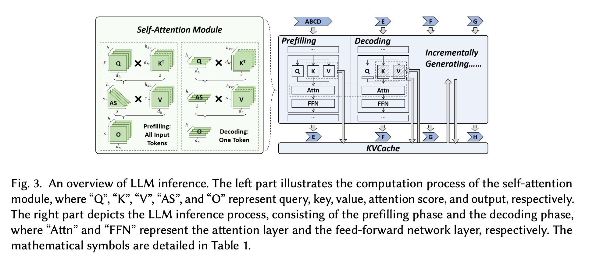
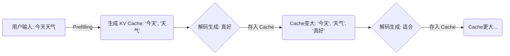
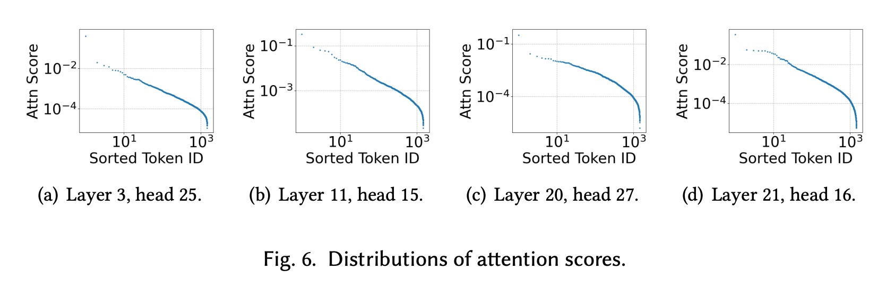
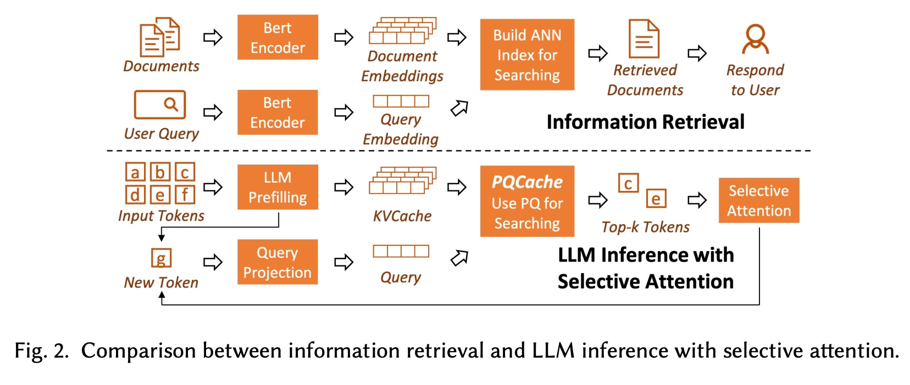
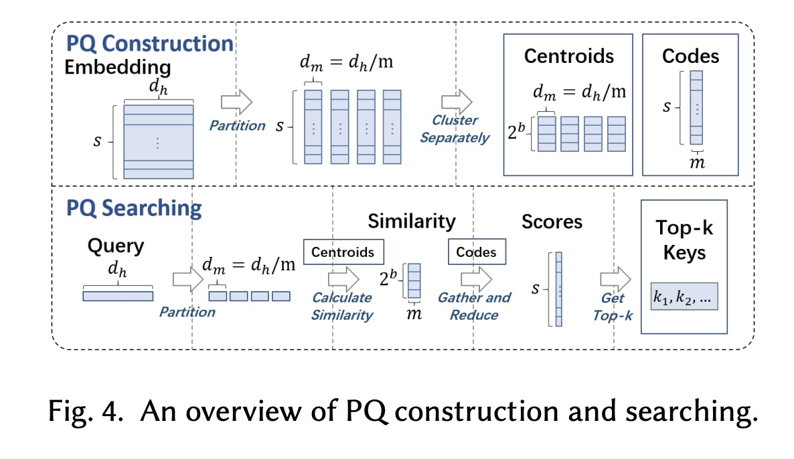
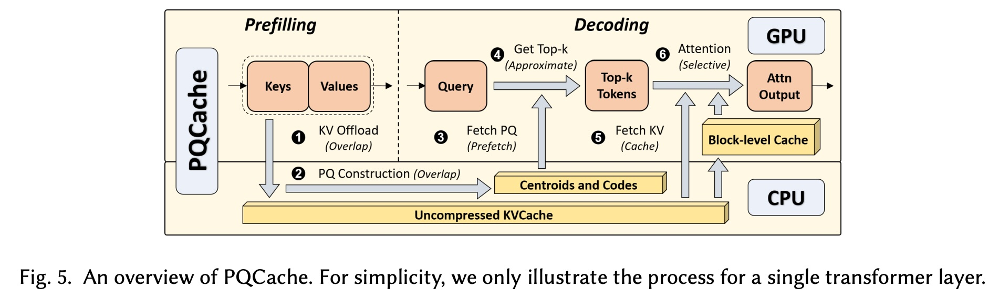
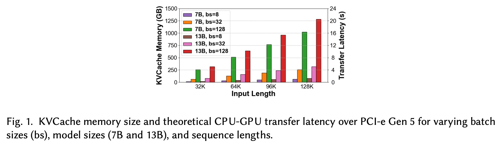
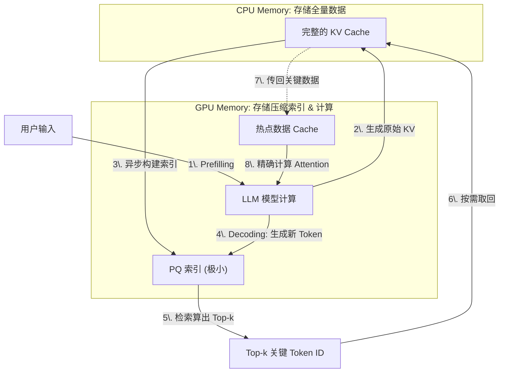

## AI论文解读 | PQCache: Product Quantization-based KVCache for Long Context LLM Inference
        
### 作者        
digoal        
        
### 日期        
2025-11-30        
        
### 标签        
PostgreSQL , PolarDB , DuckDB , AI , 论文解读        
        
----        
        
## 背景  
      
https://arxiv.org/pdf/2407.12820        
  
提示:          
```          
读懂《PQCache: Product Quantization-based KVCache for Long Context LLM Inference》这篇论文需要提前掌握哪些基础知识, 请使用中文通熟易懂的讲解这些基础知识, 可以引用论文中的图、表或使用Markdown支持的图形(text,mermaid等)增加解释性. 
  
使用中文通熟易懂的解读《PQCache: Product Quantization-based KVCache for Long Context LLM Inference》这篇论文, 其中的关键内容请着重讲解, 可以引用论文中的图、表或使用Markdown支持的图形(text,mermaid等)增加解释性. 
  
提取《PQCache: Product Quantization-based KVCache for Long Context LLM Inference》这篇论文中的重要术语, 使用中文对这些术语进行通熟易懂的讲解, 可以引用论文中的图、表或使用Markdown支持的图形(text,mermaid等)增加解释性. 
```     
  
## 1 前置知识 
  
要读懂《PQCache: Product Quantization-based KVCache for Long Context LLM Inference》这篇论文，你需要掌握以下四大块基础知识。我会用通俗的语言配合论文中的图表为你讲解。

-----

### 1\. LLM 推理机制与 KV Cache（键值缓存）

这是理解该论文解决的核心问题的关键。

  * **背景知识**：
    大型语言模型（LLM）生成文本是 **自回归（Autoregressive）** 的，也就是像接龙一样，每生成一个新字（Token），都要回头看之前所有的字。

  * **什么是 KV Cache？**

      * 在 Transformer 架构中，计算“注意力（Attention）”需要用到三个向量：Query（查询）、Key（键）、Value（值）。
      * 为了预测第 100 个字，模型需要计算它与前 99 个字的关系。如果不做缓存，每生成一个新字，都要重新计算前 99 个字的 Key 和 Value，计算量巨大。
      * **解决方法**：把之前算好的 Key 和 Value 存起来，这就叫 **KV Cache**。

  * **论文解决的痛点**：
    随着输入的上下文变长（例如 128K 长度），KV Cache 会变得极大。

    > 例如，对于 128K 长度的序列，一个 7B 的模型可能需要 **1TB** 的显存来存 KV Cache，而最强的 A100 GPU 也只有 80GB 显存。

    **图解（引用论文 Figure 3）：**    

      * **Prefilling（预填充阶段）** ：处理用户输入的一大段话，生成所有的 KV Cache 。
      * **Decoding（解码阶段）** ：一个字一个字生成，KV Cache 像滚雪球一样越来越大 。




-----

### 2\. 注意力机制即“信息检索” (Attention as Information Retrieval)

这是论文的核心思想转变。

  * **通俗解释**：
    通常我们认为 Attention 是矩阵乘法运算。但这篇论文提出，可以把它看作是**搜索引擎**。

      * **Query（当前字）** = 搜索框里的关键词。
      * **Key（历史字）** = 网页的标题或索引。
      * **Value（历史字的信息）** = 网页的具体内容。
      * **Attention Score** = 搜索结果的相关性打分。

  * **稀疏性（Sparsity）与 Top-k**：
    我们在生成下一个字时，其实不需要回顾所有的历史信息，只需要关注最相关的几个（Top-k）。

    > 论文中的 Figure 6 证明了这一点：注意力分数通常遵循幂律分布，只有极少数 Token 是重要的，其他的都不重要。       

    **图解（引用论文 Figure 2）：**
    论文将左边的“传统信息检索”流程与右边的“LLM推理”流程进行了类比 。这暗示了我们可以用搜索引擎的技术（如 PQ）来优化 LLM。

-----

### 3\. 乘积量化 (Product Quantization, PQ)

这是论文标题中的核心技术，也是实现“省显存”的关键手段。

  * **问题**：虽然我们只需要 Top-k 个相关 Token，但在算出谁是 Top-k 之前，我们还是得把所有 Key 都加载到显存里算一遍，这依然很慢且占内存。

  * **PQ 的核心思路**： **分块 + 聚类 = 极致压缩**。
    与其存原本的高精度向量（比如 4096 维的浮点数），不如把它切成小块，用一个简单的“代号”来表示。

  * **步骤详解（配合论文 Figure 4 理解）** ：    

    1.  **Partition（切分）** ：把一个长向量（例如 128 维）切成 $m$ 段（例如 4 段，每段 32 维）。
    2.  **Clustering（聚类）** ：对每一段，找到一些代表性的中心点（Centroids）。比如每一段有 256 个可能的中心点 。
    3.  **Encoding（编码）** ：原来的向量不再存具体数值，只存它属于哪个中心点（ID）。比如 256 个中心点只需要 8-bit (1字节) 就能存下 ID 。
    4.  **Searching（搜索）** ：当 Query 来的时候，不需要和原向量做乘法，直接查表算它和中心点的距离，就能快速估算出谁是 Top-k 。

    > **一句话总结 PQ**：就像调色板，虽然世界上有亿万种颜色（原始向量），但我只用 256 种标准色（Centroids）来近似描述一幅画，每种颜色只存编号（Code），从而极大地压缩体积。

-----

### 4\. 计算机体系结构：GPU/CPU 内存层级

要理解论文的系统优化部分（System Optimization），需要懂一点硬件知识。

  * **GPU 显存 (HBM)** ：速度极快，但容量小，贵。适合做矩阵计算。

  * **CPU 内存 (DRAM)** ：速度较慢，但容量极大，便宜。

  * **PCI-e 带宽**：连接 GPU 和 CPU 的通道。如果数据传得太多，这里会堵车。

  * **论文的策略（PQCache）** ：
    由于 GPU 放不下完整的 KV Cache，论文采用了 **Offloading（卸载）** 策略。

    1.  把完整的 KV Cache 扔到 **CPU 内存**里存着 。
    2.  在 **GPU** 上只保留极小的 **PQ 索引（Codes 和 Centroids）** 。
    3.  利用 PQ 在 GPU 上快速算出谁是重要的 Token。
    4.  只从 CPU 把那些重要的 Token (Top-k) 抓取回 GPU 进行计算 。

    **图解（引用论文 Figure 5）：**    
    这幅图展示了数据如何在 GPU 和 CPU 之间流动。注意图中绿色的箭头（计算）和红色的箭头（传输），论文的目标就是让它们**重叠（Overlap）** ，即“一边算别的，一边传数据”，以此掩盖传输延迟 。

-----

### 总结：读这篇论文的思维导图

1.  **痛点**：长文本推理 -\> KV Cache 太大 -\> 爆显存。
2.  **理论基础**：Attention 很稀疏 -\> 不需要全算 -\> 变成检索问题 (Top-k)。
3.  **算法核心 (PQ)** ：怎么快速检索？-\> 把向量切碎并聚类 (PQ) -\> 显存占用极小，计算极快。
4.  **系统实现**：怎么配合硬件？-\> 完整数据存 CPU，压缩索引存 GPU -\> 算出 Top-k 后再去 CPU 捞原数据 -\> 配合流水线掩盖延迟。

掌握了以上四点，你就可以顺畅地阅读这篇论文了。
  
## 2 解读论文 
  
这篇文章《PQCache: Product Quantization-based KVCache for Long Context LLM Inference》提出了一种创新的方法，旨在解决大语言模型（LLM）在长文本推理时面临的显存瓶颈问题。

以下是对这篇论文的通俗解读，重点讲解其核心逻辑和系统设计。

-----

### 1\. 核心痛点：长文本推理的“显存墙”

随着 LLM 支持的上下文越来越长（如 128K 甚至更长），显存不够用了。

  * **问题所在**：在推理过程中，模型必须保存历史 Token 的 Key 和 Value（即 **KV Cache**），以便生成下一个字。这个 Cache 会随着对话长度线性增长 。
  * **数据佐证**：如论文图 1 所示，使用 7B 模型处理 128K 长度的文本，Batch Size 为 128 时，KV Cache 需要 **1TB** 的显存，这远远超过了单张 A100 GPU (80GB) 的容量 。    
  * **现有方案的缺陷**：
      * **丢弃法 (Dropping)** ：直接扔掉不重要的 KV，但会变傻（精度下降）。
      * **卸载法 (Offloading)** ：把 KV 存到 CPU 内存，用的时候再取。但这太慢了，因为 CPU-GPU 传输速度是瓶颈 。

-----

### 2\. 核心灵感：注意力机制 = 搜索引擎

作者提出了一个关键视角的转变： **LLM 的注意力机制（Attention）本质上是一个“信息检索”过程** 。

  * **传统视角**：Attention 是矩阵乘法。
  * **新视角**：
      * **Query (当前字)** = 搜索框里的关键词。
      * **Key (历史字)** = 数据库里的索引。
      * 我们其实不需要跟所有历史字计算关系，只需要找到**最相关**的那几个（Top-k）。

基于这个发现，作者引入了数据库领域的经典技术——**乘积量化 (Product Quantization, PQ)** ，来解决 LLM 的显存问题。

> *图解：论文将信息检索（上）与 LLM 推理（下）进行了类比，认为寻找 Top-k 的 Attention 就像在数据库中检索相关文档 。*

-----

### 3\. 核心技术：PQCache 是怎么工作的？

PQCache 的核心思想是： **把完整的 KV Cache 存 CPU，把压缩后的“索引”存 GPU。**

#### 3.1 什么是乘积量化 (PQ)？

PQ 是一种极高压缩比的向量压缩技术。简单来说，它把高维向量切成几段，每一段只存一个“类别ID”，而不是原始数值。

  * **压缩效果**：原本庞大的向量被压缩成极小的 Code（代号）。
  * **计算优势**：在 GPU 上搜索这些 Code 非常快，显存占用几乎可以忽略不计 。

#### 3.2 工作流程 (Mermaid 图解)

论文设计了精密的 **Prefilling (预填充)** 和 **Decoding (解码)** 流程来实现这一目标 。



  * **第一步：预填充 (Prefilling)**
    在处理长文本输入时，GPU 计算 KV，然后**异步卸载**到 CPU。同时，CPU 利用空闲算力构建 PQ 索引（聚类生成中心点和编码）。

    > *优化点*：计算 PQ 索引的过程与 GPU 的计算是**重叠 (Overlapped)** 的，不会拖慢首字生成时间 。

  * **第二步：解码 (Decoding)**
    生成新 Token 时，不需要加载所有 KV：

    1.  **检索**：在 GPU 上用 PQ 索引快速估算出哪几个历史 Token 最重要（Top-k）。
    2.  **取数**：只从 CPU 内存中把这 Top-k 个 Token 的完整 KV 拿回来 。
    3.  **计算**：用拿回来的精准 KV 进行 Attention 计算。

-----

### 4\. 系统级优化：如何做到既快又准？

光有算法不够，必须有系统级的优化才能降低延迟。

#### 4.1 掩盖延迟 (Overlapping)

论文极力避免 GPU 等待 CPU 数据。

  * **异步流水线**：除了必须等待的“取 Top-k 数据”这一步，其他的 KV 卸载、PQ 索引构建、预取下一层索引，全部在后台与 GPU 计算并行执行 。

#### 4.2 块级缓存 (Block-level GPU Cache)

虽然是从 CPU 取数，但有些 Token 是“万人迷”（一直很重要，比如提示词开头的几个字）。

  * **策略**：在 GPU 上保留一个小小的 Cache，存放最常被访问的 Token 块（Block）。
  * **效果**：如果 Top-k 在 GPU Cache 里，就不用去 CPU 拿了。实验显示这能覆盖 50%-60% 的请求，大幅降低延迟 。

-----

### 5\. 实验结果：吊打现有方案

论文在 InfiniteBench（128K 长度基准测试）上进行了验证：

  * **精度更准**：
    相比于其他方法（如 H2O 丢弃法、InfLLM 卸载法），PQCache 的表现最好，InfiniteBench 分数提高了 **4.60%** 。它几乎达到了与“Oracle”（理想状态下保留所有 KV）相当的效果 。

    > *在“大海捞针”(Needle-in-a-Haystack) 测试中，PQCache 也能在 131K 长度下精准找到隐藏信息，而其他竞品（如 InfLLM）则表现不佳 。*

  * **速度够快**：
    在系统延迟方面，PQCache 保持了较低的 **TPOT** (每生成一个字的时间)，且延迟不会随着上下文长度增加而线性飙升，优于 SPARQ 等方法 。

### 总结

PQCache 的核心贡献在于将 **“KV Cache 管理”** 转化为了 **“向量检索问题”** 。通过引入 PQ 量化做快速初筛，配合 CPU/GPU 异构存储和流水线优化，成功实现了在有限 GPU 显存下进行超长文本的高精度推理。
  
## 3 术语 
  
为了让你更透彻地理解这篇论文，我提取了文中的核心专业术语，并配合通俗的比喻和图解进行讲解。

### 1\. 核心概念类

#### **KV Cache (键值缓存)**

  * **专业定义**：在 LLM 推理过程中，为了避免重复计算历史 Token 的 Key 和 Value 向量，将它们存储在显存中的数据结构 。
  * **通俗比喻**： **“会议纪要”** 。
    想象你在开一个无限长的会（生成文本），每讲一句话（生成一个 Token），你都需要回顾之前讲过的所有内容来确保逻辑连贯。如果你脑子记不住，就把之前每个人说的话（Key）和具体含义（Value）记在笔记本上。这个笔记本就是 KV Cache。随着会议越来越长，笔记本越来越厚，桌子（显存）就放不下了。
  * **论文中的作用**：这是论文要解决的“反派”。因为长文本下它太大了，挤爆了显存。

#### **Product Quantization (PQ, 乘积量化)**

  * **专业定义**：一种向量压缩技术。将高维向量切分为多个子空间，对每个子空间进行聚类，用聚类中心的索引（Code）代替原始向量 。
  * **通俗比喻**： **“数字油画”** 。
    也就是按数字填色。虽然现实世界（原始向量）有千万种颜色，但在画布上我们只用几十种标准颜料（Centroids/质心）。我们在存储画作时，不存每个格子的具体 RGB 值，只存“这个格子用 5 号颜料”（Code）。这样数据量就极大地缩小了。
  * **Mermaid 图解**：
    ```mermaid
    graph LR
        A[原始长向量: 128维] -->|切分 Partition| B(4个短向量: 各32维)
        B -->|聚类 Clustering| C(找到最近的标准向量/质心)
        C -->|编码 Encoding| D[存储为: ID代码]
        style D fill:#f9f,stroke:#333,stroke-width:2px
    ```
  * **论文中的作用**：论文的核心武器。用它把庞大的 KV Cache 压缩成极小的索引存放在 GPU 上，用于快速检索。

#### **Selective Attention (选择性注意力)**

  * **专业定义**：在计算注意力时，不涵盖所有历史 Token，只选择那些注意力分数（Attention Score）最高的 Token 参与计算 。
  * **通俗比喻**： **“划重点”** 。
    考试复习时，你不会把整本书从头背到尾，而是只看老师划的那几个重点段落。虽然书很厚（长上下文），但真正对解题（生成下一个字）有用的往往只有几句话。
  * **论文中的作用**：PQCache 的理论基础。论文通过实验证明（Figure 6），只有极少数 Token 是重要的，所以没必要把所有 KV 都加载回来算一遍 。    

-----

### 2\. 系统流程类

#### **Prefilling (预填充) vs. Decoding (解码)**

  * **专业定义**：LLM 推理的两个阶段 。
      * **Prefilling**：并行处理用户输入的整个 Prompt，生成初始 KV Cache。
      * **Decoding**：逐个 Token 自回归生成，每次只处理新生成的那个 Token。
  * **通俗比喻**： **“阅读理解” vs “写作文”** 。
      * Prefilling 是你在快速阅读题目和材料，一目十行，并行处理信息。
      * Decoding 是你开始动笔写答案，必须一个字一个字往外蹦，没法并行。
  * **论文中的作用**：PQCache 在这两个阶段策略不同。Prefilling 阶段通过 **重叠（Overlap）** 策略，利用 GPU 忙着“阅读”的时间，让 CPU 偷偷在后台把 PQ 索引建好，不浪费时间 。

#### **Offloading (卸载)**

  * **专业定义**：将显存放不下的数据（如 KV Cache）转移到 CPU 内存或硬盘中存储，需要时再通过 PCI-e 传输回来 。
  * **通俗比喻**： **“放仓库”** 。
    GPU 显存是昂贵的“展示柜”，CPU 内存是便宜量大的“仓库”。东西太多展示柜放不下，就把暂时不用的 KV Cache 搬到仓库里。
  * **论文中的作用**：PQCache 采用了完全卸载策略，把原始 KV Cache 全扔进 CPU 内存，只在 GPU 留个“目录”（PQ 索引）。

#### **Retrieval-based Generation (基于检索的生成)**

  * **专业定义**：将生成过程视为从历史上下文中检索相关信息的过程 。
  * **论文中的作用**：这是论文的**核心洞察**。作者认为长文本推理本质上就是个**搜索引擎**：用当前的字（Query）去庞大的历史记录（Database）里搜最相关的字（Key）。所以可以用搜索引擎的技术（PQ）来优化 LLM。

-----

### 3\. 评估指标类

#### **TTFT (Time To First Token)**

  * **中文含义**：首字延迟。
  * **通俗解释**：你问 AI 一个问题，它“思考”多久才蹦出第一个字。
  * **论文中的关注点**：PQCache 通过并行计算，确保构建索引的过程不拖慢 TTFT 。

#### **TPOT (Time Per Output Token)**

  * **中文含义**：每字生成时间。
  * **通俗解释**：AI 说话的“语速”。如果 TPOT 太高，AI 就会像结巴一样，一个字一个字往外挤，让人等得心急。
  * **论文中的表现**：PQCache 的 TPOT 保持在低水平，快于人类阅读速度（约 0.2秒/token）。

#### **Needle-in-a-Haystack (大海捞针测试)**

  * **专业定义**：一种评估长文本模型能力的测试。在极长的无关文本（干草堆）中插入一句关键信息（针），看模型能不能把它找出来回答问题 。
  * **通俗解释**：在一本 1000 页的小说里，第 500 页第 3 行写了“凶手喜欢吃苹果”。读完后问模型“凶手喜欢吃什么？”看它能不能答对。
  * **论文中的表现**：PQCache 在 131K 长度（约等于一本长篇小说）的测试中全绿（全对），证明了其检索的精准度。
  
## 参考        
         
https://arxiv.org/pdf/2407.12820    
        
<b> 以上内容基于DeepSeek、Qwen、Gemini及诸多AI生成, 轻微人工调整, 感谢杭州深度求索人工智能、阿里云、Google等公司. </b>        
        
<b> AI 生成的内容请自行辨别正确性, 当然也多了些许踩坑的乐趣, 毕竟冒险是每个男人的天性.  </b>        
  
    
#### [PolarDB 学习图谱](https://www.aliyun.com/database/openpolardb/activity "8642f60e04ed0c814bf9cb9677976bd4")
  
  
#### [PostgreSQL 解决方案集合](../201706/20170601_02.md "40cff096e9ed7122c512b35d8561d9c8")
  
  
#### [德哥 / digoal's Github - 公益是一辈子的事.](https://github.com/digoal/blog/blob/master/README.md "22709685feb7cab07d30f30387f0a9ae")
  
  
#### [About 德哥](https://github.com/digoal/blog/blob/master/me/readme.md "a37735981e7704886ffd590565582dd0")
  
  

  
