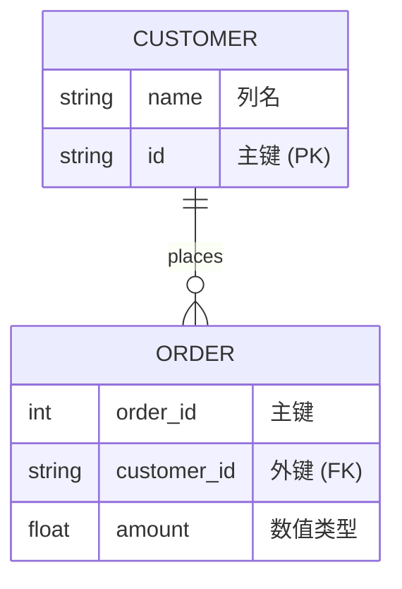
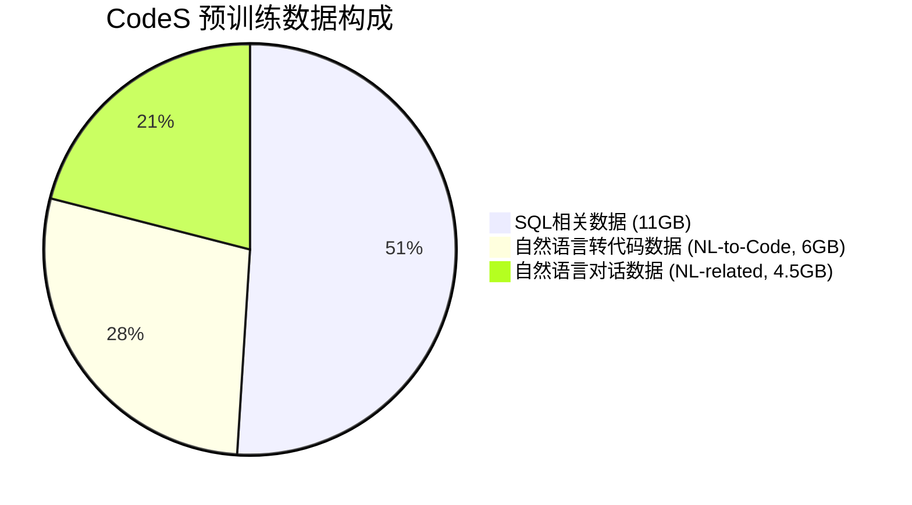
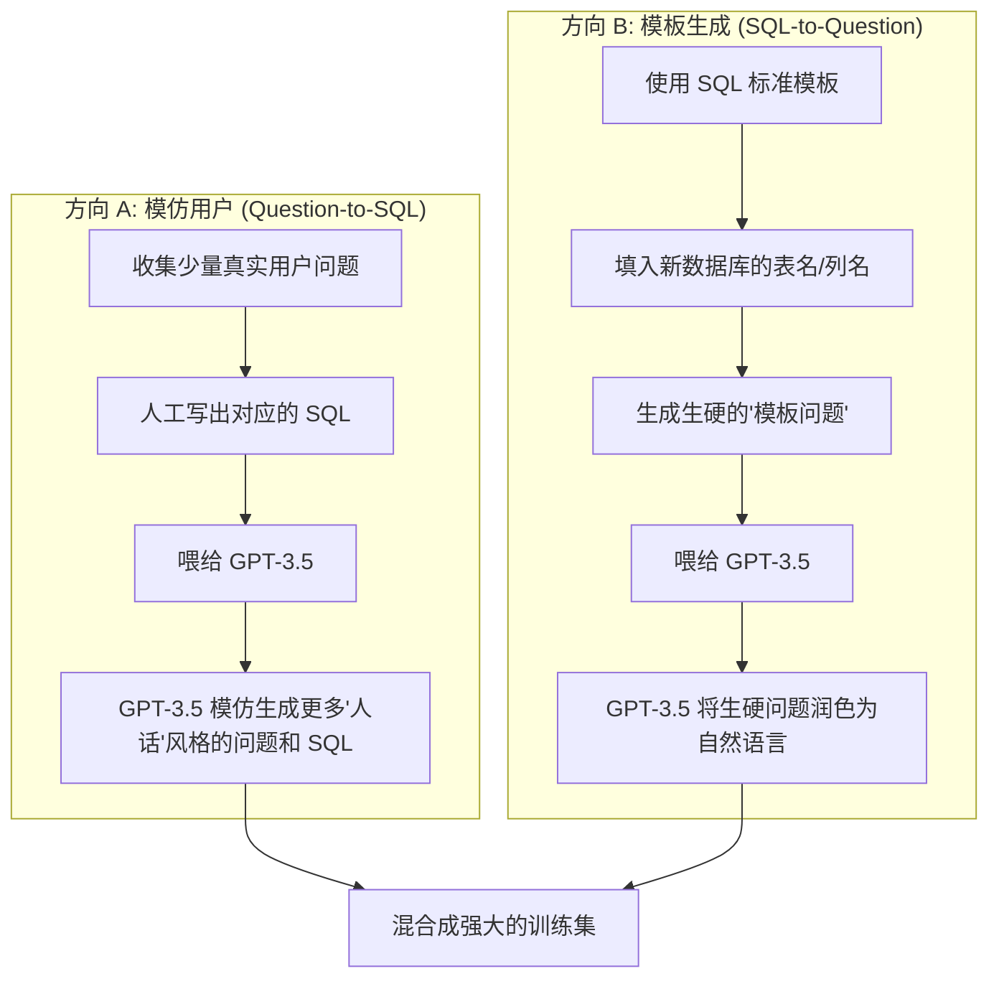
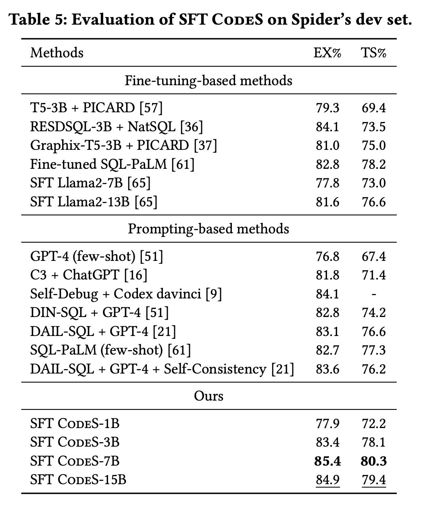
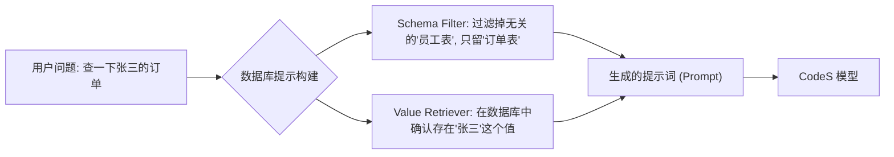
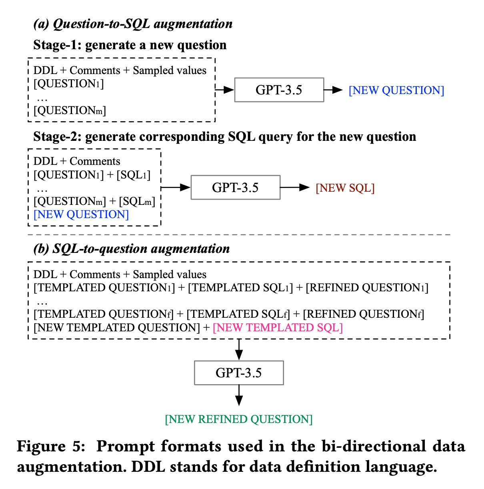

## AI论文解读 | CodeS: Towards Building Open-source Language Models for Text-to-SQL
        
### 作者        
digoal        
        
### 日期        
2025-11-30        
        
### 标签        
PostgreSQL , PolarDB , DuckDB , AI , 论文解读        
        
----        
        
## 背景  
      
https://arxiv.org/pdf/2402.16347        
  
提示:          
```          
读懂《CodeS: Towards Building Open-source Language Models for Text-to-SQL》这篇论文需要提前掌握哪些基础知识, 请使用中文通熟易懂的讲解这些基础知识, 可以引用论文中的图、表或使用Markdown支持的图形(text,mermaid等)增加解释性. 
  
使用中文通熟易懂的解读《CodeS: Towards Building Open-source Language Models for Text-to-SQL》这篇论文, 其中的关键内容请着重讲解, 可以引用论文中的图、表或使用Markdown支持的图形(text,mermaid等)增加解释性. 
  
提取《CodeS: Towards Building Open-source Language Models for Text-to-SQL》这篇论文中的重要术语, 使用中文对这些术语进行通熟易懂的讲解, 可以引用论文中的图、表或使用Markdown支持的图形(text,mermaid等)增加解释性. 
```     
  
## 1 前置知识 
  
要读懂《CodeS: Towards Building Open-source Language Models for Text-to-SQL》这篇论文，你需要建立从“数据库基础”到“大模型微调”的一系列知识框架。这篇论文的核心在于如何让开源的小参数量模型（CodeS）在写SQL语句的能力上通过特定技术（增量预训练、Prompt构建、数据增强）超越闭源大模型（如GPT-4）。

以下是为你整理的通俗易懂的基础知识清单，结合了论文中的概念进行解释：

### 1\. 核心任务：Text-to-SQL（文本转SQL）

**这是什么？**
简单来说，就是让机器当“翻译官”。输入是用户的自然语言问题（比如：“查一下谁的工资最高？”），输出是数据库能听懂的 SQL 代码（`SELECT name FROM salary_table ORDER BY amount DESC LIMIT 1`）。

**论文中的体现：**
论文明确指出 Text-to-SQL 的目标是将自然语言问题 $Q$ 和数据库 $D$ 转化为可执行的 SQL 查询 $S$ 。

**你需要了解的难点（Schema Linking）：**
模型不能瞎编列名。比如用户说“找名字”，数据库里可能叫 `f_name` 或 `c_name`。模型必须把用户的话和数据库的“模式（Schema）”（即表名、列名）对应起来。

  * **论文图示参考：** 请看 **Figure 2** ，它展示了一个金融领域的例子。左边是复杂的数据库表结构（Schema），右边是自然语言问题，模型必须精准地从左边的几百个列中找到 `Est Liab`（预计负债）和 `Net Inc IB Borrowings`（借款净增额）才能写出正确的 SQL。

  

-----

### 2\. 数据库基础 (Relational Database Basics)

**这是什么？**
理解 SQL 的运行环境。

  * **Schema (模式)：** 数据库的结构说明书，包含表名（Table）、列名（Column）、类型（Type）等。
  * **Metadata (元数据)：** 关于数据的数据，比如列的注释（Comment）、主键（Primary Key，唯一标识一行）、外键（Foreign Key，连接两张表的桥梁）。
  * **Query (查询)：** 获取数据的指令。

**论文中的体现：**
CodeS 也就是在这方面做了很多优化。它在输入给模型的信息中，不仅放了表名，还特意加了**注释（Comments）** 、**外键关系**甚至**代表性的数据值** 。



*图解：模型需要理解这种表与表之间的连接（JOIN）关系，论文提到利用外键信息可以帮助模型生成正确的 `JOIN ON` 子句 。*

-----

### 3\. 大语言模型 (LLM) 的三种“学习”阶段

论文中 CodeS 的构建过程涉及了 LLM 的三个关键阶段，理解它们的区别至关重要：

#### A. 预训练 (Pre-training)

  * **通俗解释：** 相当于“通识教育”。模型在海量文本上学习，学会了说话和基本的逻辑。
  * **论文背景：** CodeS 是基于 **StarCoder**  这个已经经过预训练的代码大模型构建的。

#### B. 增量预训练 (Incremental Pre-training)

  * **通俗解释：** 相当于“专业课深造”。通识教育学完后，CodeS 专门读了大量的 SQL 代码、数据分析相关的语料，让自己更懂 SQL。
  * **论文体现：** 论文提到通过 **11GB 的 SQL 相关数据** 对 StarCoder 进行了再训练，这叫 incremental pre-training 。

#### C. 监督微调 (Supervised Fine-Tuning, SFT)

  * **通俗解释：** 相当于“刷题备考”。给模型看具体的“问题-答案”对（Sample），让它学会针对特定考试（Text-to-SQL 任务）的答题格式。
  * **论文体现：** 论文中提到的 **SFT CodeS** 就是指经过这一步处理的模型，它在 Spider 和 BIRD 等数据集上进行了针对性训练 。

-----

### 4\. 提示工程 (Prompt Engineering) 与 上下文学习 (In-Context Learning)

**这是什么？**
有时候我们不修改模型参数（不训练），而是通过精心地“问问题”来让模型输出好结果。

  * **Zero-shot:** 直接问模型。
  * **Few-shot (In-Context Learning):** 问问题之前，先给模型看几个例子（Demonstrations）。

**论文中的体现：**
论文提到了两种用法：

1.  **微调 (Fine-tuning)：** 也就是上面说的“刷题” 。
2.  **Few-shot In-context learning：** 不训练，直接给 CodeS 几个 SQL 的例子让它照猫画虎。论文还设计了一个检索器（Retriever），专门去找那些“长得像”的例子给模型看 。

-----

### 5\. 数据增强 (Data Augmentation)

**这是什么？**
当训练数据不够时，用 AI 造假数据来训练 AI。

**论文中的体现：**
论文提出了**双向数据增强（Bi-directional data augmentation）** ：

1.  **Question-to-SQL:** 只有问题，没有 SQL？让人写几个，然后用 GPT-3.5 模仿着多写点。
2.  **SQL-to-Question:** 有很多 SQL 模板，但没有自然语言问题？用模板生成 SQL，再让 GPT-3.5 把这些死板的模板反向翻译成自然语言问题。

-----

### 6\. 评估指标 (Evaluation Metrics)

**这是什么？**
怎么判断模型写得好不好？

  * **Execution Accuracy (EX, 执行准确率)：** 模型写的 SQL 扔进数据库跑一下，如果结果（Result Set）和标准答案跑出来的结果一样，就算对 。
      * *注意：* 这种方法比较靠谱，因为不同的 SQL 写法可能得出相同的结果。
  * **Valid Efficiency Score (VES)：** BIRD 数据集特有的，不仅看对不对，还看 SQL 跑得快不快（效率） 。

-----

### 总结：读这篇论文的“地图”

你可以参照 **Figure 3**  来串联这些知识点：    

1.  **左上 (a)：** 从基础模型 (StarCoder) 开始，喂入 SQL 语料 -\> **增量预训练**。
2.  **中上 (b)：** 拿到用户问题后，如何从巨大数据库中筛选有用的表和列 -\> **Database Prompt Construction (Schema Filter)** 。
3.  **右上 (c)：** 数据不够怎么办 -\> **双向数据增强**。
4.  **下方 (d) & (e)：** 怎么用这个模型？要么直接用例子引导 (**In-context Learning**)，要么拿数据接着训 (**Fine-tuning**)。

掌握了以上这些概念，你就可以顺畅地阅读这篇论文，理解 CodeS 是如何通过“开源小模型 + 专精训练 + 精细化 Prompt”来挑战 GPT-4 的地位的。
  
## 2 解读论文 
  
这篇论文《CodeS: Towards Building Open-source Language Models for Text-to-SQL》介绍了一个专门为 **Text-to-SQL（自然语言转数据库查询语句）** 任务打造的开源大模型系列——**CodeS**。

它的核心目标是： **打破目前 Text-to-SQL 领域对 GPT-4 等闭源超级大模型的依赖，用更小参数量的开源模型实现同等甚至更好的效果** 。

以下是对这篇论文的通俗解读，我们将通过它解决的三大挑战来拆解其核心技术。

-----

### 1\. 背景与核心问题

  * **任务：** Text-to-SQL 就是让电脑把人话（比如“查一下去年谁赚得最多”）翻译成数据库能跑的 SQL 代码（`SELECT name FROM salary ORDER BY amount DESC LIMIT 1`）。
  * **现状：** 目前最厉害的方法大多依赖 GPT-4 或 ChatGPT 。
  * **痛点：**
    1.  **闭源与隐私：** 把银行或医院的数据库结构发给 GPT-4 的 API 存在隐私风险 。
    2.  **成本高：** GPT-4 调用很贵，而且延迟高 。
    3.  **开源模型能力弱：** 直接用 Llama 2 或 StarCoder 这种通用模型写 SQL，效果不如人意，因为它们没专门针对 SQL “特训”过 。

**CodeS 的解决方案：** 基于开源代码模型 **StarCoder**，通过一系列特殊手段“魔改”出一套专门写 SQL 的模型，参数量从 1B（10亿）到 15B（150亿）不等，却能匹敌 GPT-4 。

-----

### 2\. CodeS 的三大核心技术武器

为了让小模型变强，作者提出了三个关键策略，对应解决三个技术难题。我们可以参考论文中的架构图 **Figure 3** 来理解。    

#### 武器一：增量预训练 (Incremental Pre-training)

**解决问题：** 通用小模型不懂复杂的 SQL 逻辑 。

这就好比 StarCoder 本来是个“通才”，懂 Python、Java 各种语言。作者给它安排了一个“SQL 强化班”。他们收集了 **21.5GB** 的数据进行二次预训练 ，数据构成如下：



  * **重点：** 不仅给模型看 SQL 代码，还给它看自然语言对话。这是为了让模型既懂 SQL 语法，又能理解人类复杂的提问方式 。

#### 武器二：数据库提示构建 (Database Prompt Construction)

**解决问题：** 真实数据库太大了，把所有表和列都塞给模型，模型会“消化不良”（超过长度限制）或者“眼花缭乱”（找不到重点）。

作者设计了一套精密的流程来生成给模型的提示词（Prompt），这被称为“模式链接（Schema Linking）”的优化：

1.  **Schema Filter（表结构过滤器）：**

      * **做法：** 假设数据库有 100 张表，用户只问了关于“订单”的问题。模型会先通过一个分类器，把不相关的 98 张表扔掉，只保留最相关的几张表和列 。
      * **好处：** 极大地给模型“减负”。

2.  **Value Retriever（数据值检索器）：**

      * **做法：** 采用“粗筛转精筛”的策略。先用索引（BM25）快速找疑似值，再用算法（LCS）精确匹配 。
      * **例子：** 用户问“张三的订单”，数据库里存的是“Zhang San”。这个模块会帮模型找到这两个词的对应关系，并告诉模型 。

3.  **注入元数据（Metadata）：**

      * 提示词里不光有列名，还特意加入了**列的注释**、**数据类型**、**主键外键**以及**典型的数值例子**。这对模型理解“脏数据”或模糊的列名至关重要 。

#### 武器三：双向数据增强 (Bi-directional Data Augmentation)

**解决问题：** 如果我想把模型用到一个新的领域（比如“生物制药”），但我手头没有这就领域的问答对来训练模型，怎么办？。

作者提出了一种极低成本的“造数据”方法，分为两个方向 （见下图）：



  * **方向 A (Q-to-S)：** 保证数据像真实用户问出来的，捕捉用户的偏好 。
  * **方向 B (S-to-Q)：** 保证数据覆盖了各种复杂的 SQL 语法（如 Group By, Join 等）。
  * **结果：** 只需要很少的人工标注，就能通过 GPT-3.5 生成大量高质量训练数据，帮助 CodeS 快速适应新领域 。

-----

### 3\. CodeS 的实际表现

模型做出来效果如何？作者在两个最权威的榜单上进行了测试： **Spider**（经典榜单）和 **BIRD**（高难度、脏数据榜单）。

#### 性能对比 (Performance)

  * **吊打同行：** 哪怕是只有 **3B**（30亿参数）的 CodeS 版本，经过微调后，准确率也超过了基于 GPT-4 的知名方法（如 DIN-SQL）。
  * **新 SOTA（State-of-the-Art）：** CodeS-15B 在 Spider 和 BIRD 榜单上都取得了当时最好的成绩 。
  * **效率极高：** CodeS-7B 的推理速度极快，只需要 1.1 秒，而 GPT-4 方法可能需要 60 秒 。

> **引用图表数据：**
> 在 **Table 5** 中，SFT CodeS-3B 的执行准确率（EX%）达到了 **83.4%**，甚至超过了 SQL-PaLM 和基于 GPT-4 的 DIN-SQL 。这证明了小模型只要训练得当，完全可以超越大模型。  

  

#### 鲁棒性 (Robustness)

作者还在 Spider-DK 等“变态”测试集上测了模型。比如把列名改成同义词、把问题问得很绕。结果显示，CodeS 的抗干扰能力非常强，甚至优于专门为鲁棒性设计的 ChatGPT 方法 。

-----

### 4\. 总结与应用指南

**这篇论文的贡献总结：**
CodeS 证明了我们不需要迷信千亿参数的超大模型。通过**专注于 SQL 的增量训练**、**聪明的 Prompt 构造**以及**合成数据增强**，一个能够在消费级显卡上运行的 7B 或 15B 开源模型，完全可以胜任企业级的 Text-to-SQL 任务 。

**如果你想使用 CodeS：**

1.  **资源充足时：** 使用作者提供的双向数据增强方法生成数据，然后对 CodeS 进行**全量微调 (SFT)** ，效果最好 。
2.  **资源受限时：** 直接使用 CodeS 进行 **Few-shot (少样本)** 推理，给它几个例子，它也能依葫芦画瓢写出不错的 SQL，无需重新训练 。

CodeS 的模型、代码和数据均已开源 ，是目前构建私有化 Text-to-SQL 应用的极佳选择。
  
## 3 术语 
  
这篇论文《CodeS: Towards Building Open-source Language Models for Text-to-SQL》涉及许多 Text-to-SQL（文本转SQL）领域的专业概念。为了帮助你深入理解，我将提取其中的核心术语，用通俗易懂的语言进行解读，并辅以图表说明。

### 核心任务与模型

#### 1\. Text-to-SQL (文本转SQL)

  * **通俗解释：** 这就像是给数据库请了一个“翻译官”。用户用自然语言（比如“查一下谁的工资最高”）提问，这个翻译官（模型）将其转换成数据库能听懂并执行的 SQL 代码（如 `SELECT name FROM salary ORDER BY amount DESC LIMIT 1`）。
  * **作用：** 让不懂编程的用户也能直接查询复杂的数据库。

#### 2\. CodeS (论文提出的模型)

  * **通俗解释：** 这是作者基于开源代码模型 StarCoder 改造出的“特种兵”。普通的语言模型什么都学（通才），而 CodeS 经过特训，专门擅长写 SQL 语句 。
  * **特点：**
      * **开源：** 相比 GPT-4 这种“黑盒”，CodeS 是公开透明的 。
      * **小而精：** 参数量从 10亿 (1B) 到 150亿 (15B)，比 ChatGPT (约175B) 小得多，但在写 SQL 上能力相当 。

-----

### 关键训练技术

#### 3\. Incremental Pre-training (增量预训练)

  * **通俗解释：** 可以理解为“研究生深造”。基础模型（如 StarCoder）已经受过“九年义务教育”，懂基本的语言和代码。作者在此基础上，又给它喂了大量的 SQL 相关资料（约 21.5GB），让它在 SQL 这个垂直领域成为专家 。
  * **数据构成：**
      * **SQL相关数据：** 强化写 SQL 的能力 。
      * **自然语言对话：** 强化理解人话的能力 。
      * **自然语言转代码数据：** 强化把人话翻译成代码的逻辑 。

#### 4\. Supervised Fine-Tuning (SFT, 监督微调)

  * **通俗解释：** 这就像是“考前刷真题”。在预训练（深造）之后，为了适应具体的考试（Text-to-SQL 任务），给模型看大量标准的“问题 + 正确SQL”的试题对，调整模型的参数，让它答题更规范 。
  * **论文图示：** 见 **Figure 3(d)** ，使用标注好的数据对 CodeS 进行微调。    

-----

### 输入处理与优化 (Prompt Engineering)

#### 5\. Schema Linking (模式链接)

  * **通俗解释：** 这是 Text-to-SQL 最难的一步，即“对号入座”。用户说“找名字”，数据库里可能叫 `f_name`，模型必须把用户口中的词和数据库里真实的表名、列名对应起来 。
  * **挑战：** 数据库可能有重名的列、缩写或者非常多的表，容易让模型搞混 。

#### 6\. Database Prompt Construction (数据库提示构建)

  * **通俗解释：** 这是一个“划重点”的过程。因为数据库可能非常大（几百张表），不能把整本“字典”都塞给模型。作者设计了一套流程，只把和用户问题相关的表、列和数据摘出来发给模型 。
  * **核心组件：**
      * **Schema Filter (模式过滤器)：** 把不相关的表和列删掉，只保留有用的，给模型减负 。
      * **Value Retriever (值检索器)：** 帮模型去数据库里翻翻有没有用户提到的具体数据（比如用户问“张三的订单”，它会确认数据库里确实有个值叫“张三”），并告诉模型 。

**流程图解 (Mermaid):**



-----

### 数据增强策略

#### 7\. Bi-directional Data Augmentation (双向数据增强)

  * **通俗解释：** 当新领域的训练数据不够时，用 AI 来“造假数据”。作者使用了“双向”策略来保证造出来的数据既真实又多样 。
      * **Question-to-SQL (正向)：** 收集少量真实用户的提问，让 GPT-3.5 模仿这些提问的语气生成更多问题，并配上 SQL。这保证了问题像“人话” 。
      * **SQL-to-Question (反向)：** 用固定的 SQL 模板生成各种复杂的查询语句，再让 GPT-3.5 把这些死板的代码翻译成自然语言问题。这保证了覆盖各种复杂的查询逻辑 。

**图解双向增强 (引用 Figure 5 概念):**    

| 方向 | 起点 | 过程 | 终点 | 目的 |
| :--- | :--- | :--- | :--- | :--- |
| **Q-to-S** | 真实用户提问 | AI模仿提问 -\> AI写SQL | 拟真的问答对 | 模拟真实用户偏好  |
| **S-to-Q** | SQL 模板 | 填入新表名 -\> AI将SQL翻译为问题 | 复杂的问答对 | 覆盖复杂语法结构  |

-----

### 评估相关

#### 8\. Few-shot In-Context Learning (少样本上下文学习)

  * **通俗解释：** 这是一种“照猫画虎”的使用方式，不需要调整模型参数（不训练）。在使用 CodeS 时，先给它看几个“问题 -\> SQL”的例子（Demonstrations），然后立刻让它做新题。CodeS 会通过模仿例子来生成答案 。
  * **Demonstration Retriever (示例检索器)：** 为了让“照猫画虎”更准，系统会自动从题库里挑出和当前问题最像的几个例子给模型看 。

#### 9\. Execution Accuracy (EX, 执行准确率)

  * **通俗解释：** 這是判卷标准。不管模型写的 SQL 长什么样，只要把它放到数据库里运行，查出来的结果（Result Set）和标准答案一模一样，就算得分 。
  * **对比：** 另一种是比对代码文本是否一样，但那种太死板，因为同一个查询往往有多种写法。
  
## 参考        
         
https://arxiv.org/pdf/2402.16347    
        
<b> 以上内容基于DeepSeek、Qwen、Gemini及诸多AI生成, 轻微人工调整, 感谢杭州深度求索人工智能、阿里云、Google等公司. </b>        
        
<b> AI 生成的内容请自行辨别正确性, 当然也多了些许踩坑的乐趣, 毕竟冒险是每个男人的天性.  </b>        
  
    
#### [PolarDB 学习图谱](https://www.aliyun.com/database/openpolardb/activity "8642f60e04ed0c814bf9cb9677976bd4")
  
  
#### [PostgreSQL 解决方案集合](../201706/20170601_02.md "40cff096e9ed7122c512b35d8561d9c8")
  
  
#### [德哥 / digoal's Github - 公益是一辈子的事.](https://github.com/digoal/blog/blob/master/README.md "22709685feb7cab07d30f30387f0a9ae")
  
  
#### [About 德哥](https://github.com/digoal/blog/blob/master/me/readme.md "a37735981e7704886ffd590565582dd0")
  
  

  
