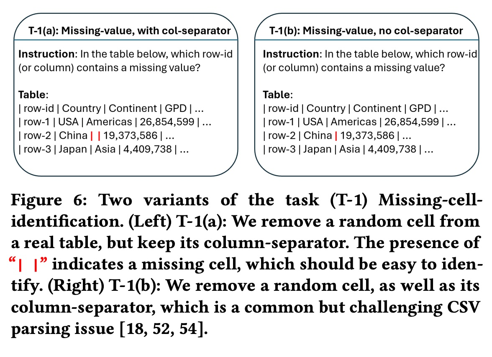
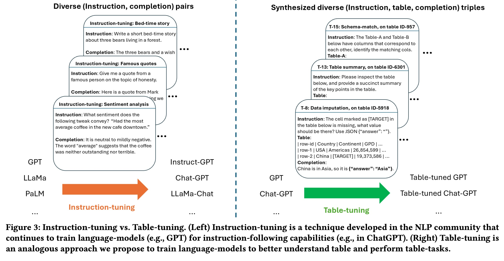
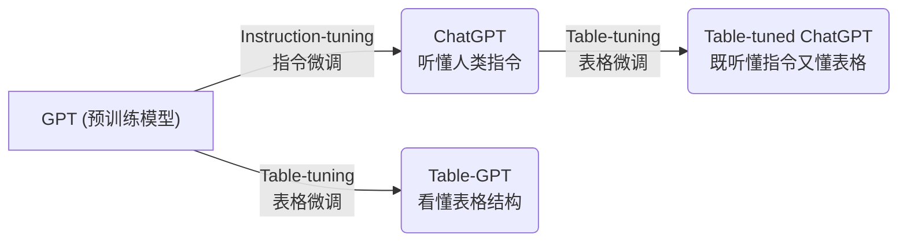
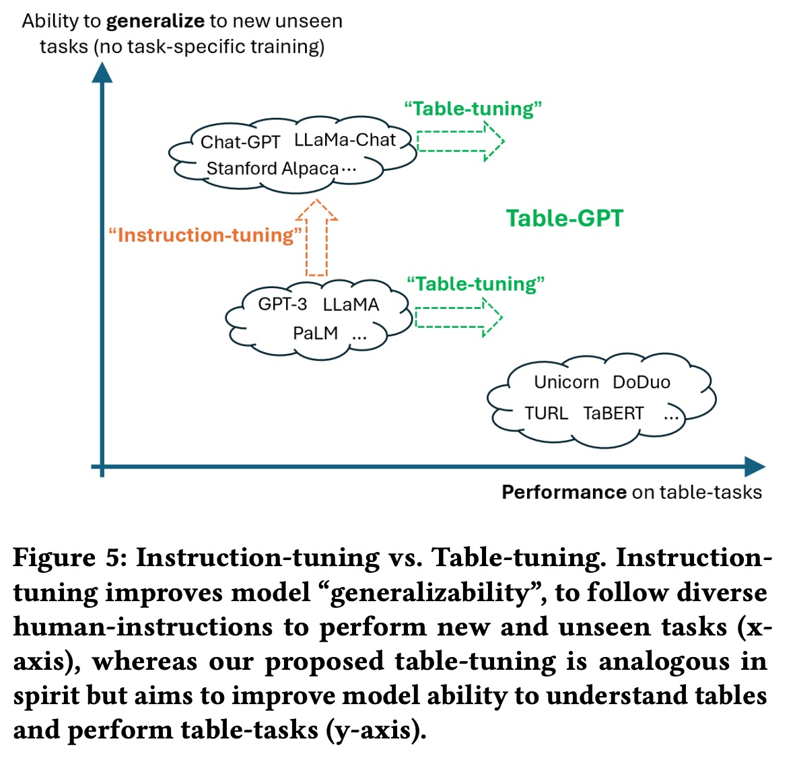
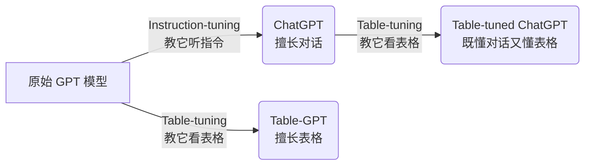
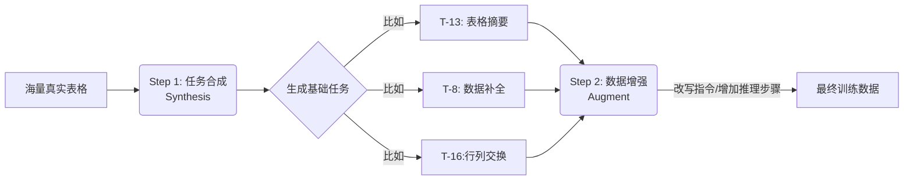
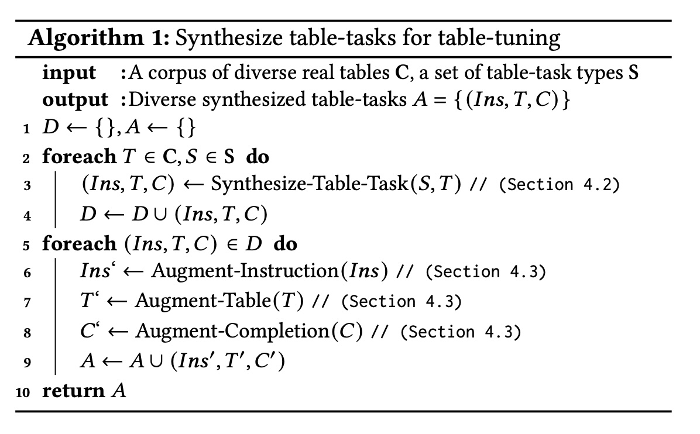

## AI论文解读 | Table-GPT: Table-tuned GPT for Diverse Table Tasks
        
### 作者        
digoal        
        
### 日期        
2025-11-30        
        
### 标签        
PostgreSQL , PolarDB , DuckDB , AI , 论文解读        
        
----        
        
## 背景  
      
https://arxiv.org/pdf/2310.09263        
  
提示:          
```          
读懂《Table-GPT: Table-tuned GPT for Diverse Table Tasks》这篇论文需要提前掌握哪些基础知识, 请使用中文通熟易懂的讲解这些基础知识, 可以引用论文中的图、表或使用Markdown支持的图形(text,mermaid等)增加解释性. 
  
使用中文通熟易懂的解读《Table-GPT: Table-tuned GPT for Diverse Table Tasks》这篇论文, 其中的关键内容请着重讲解, 可以引用论文中的图、表或使用Markdown支持的图形(text,mermaid等)增加解释性. 
  
提取《Table-GPT: Table-tuned GPT for Diverse Table Tasks》这篇论文中的重要术语, 使用中文对这些术语进行通熟易懂的讲解, 可以引用论文中的图、表或使用Markdown支持的图形(text,mermaid等)增加解释性. 
```     
  
## 1 前置知识 
  
要深入理解这篇论文《Table-GPT: Table-tuned GPT for Diverse Table Tasks》，你需要掌握以下几个核心领域的**基础知识**。这篇论文主要探讨如何让擅长写文章的“语言模型”也能看懂“Excel表格”。

为了让你更通俗易懂地掌握，我将这些知识点分为四个模块，并配合图表进行解释：

-----

### 1\. 语言模型的“偏科”问题：一维文本 vs 二维表格

**你需要知道什么：**
目前的语言模型（如 GPT-3.5, ChatGPT）主要是通过阅读大量的书籍、文章和代码训练出来的。这些数据通过被称为**一维（1D）序列**，因为我们阅读时通常是从左到右、逐字逐句进行的 。

**论文核心痛点：**
表格（Table）是 **二维（2D）** 的。理解表格不仅需要横着读（行），还需要竖着读（列）来对齐数据 。论文指出，普通的 GPT 模型因为习惯了“横着读”，导致它在处理表格时经常“眼花”，比如无法上下对齐列数据 。

**图解案例：**
论文中展示了一个简单的测试：去掉表格中间的一个单元格，问模型哪里缺了数据？

  * **普通模型 (GPT-3.5)：** 经常猜错列名，因为它不擅长“竖着看”数据对齐 。
  * **Table-GPT (本论文模型)：** 通过训练学会了“竖着看”，能准确定位 。

> **图示引用 (Figure 6)：** 左图是带有列分隔符的测试，右图是去掉分隔符的测试。即使在简单的找缺失值任务上，普通 GPT 的表现也不够好 。  
> *(注：此图为示意引用，描述了论文 Figure 6 中缺失值识别的挑战)*  

  

-----

### 2\. 模型训练的三阶段：预训练、指令微调与 Table-tuning

**你需要知道什么：**
要把一个模型训练好，通常有几个阶段。论文提出了一个新的概念叫 **Table-tuning**，它是模仿 NLP 领域的 **Instruction-tuning** (指令微调) 。

我们可以用“培养一个学生”来类比这三个阶段：

| 阶段 | 专业术语 | 类比解释 | 典型代表 |
| :--- | :--- | :--- | :--- |
| **1. 基础教育** | **Pre-training** (预训练) | 让学生阅读海量书籍，学会单词接龙，掌握语言规律，但不懂怎么回答问题。 | GPT-3  |
| **2. 职业培训** | **Instruction-tuning** (指令微调) | 老师给学生具体的任务指令（如“写个故事”），并提供标准答案，教学生如何听懂人话并执行任务。 | ChatGPT, InstructGPT  |
| **3. 表格特训** | **Table-tuning** (本论文提出) | 专门给学生上“Excel特训班”，用大量的表格任务（如“找缺失值”、“表格问答”）进行训练，强化表格理解能力。 | **Table-GPT**  |

**图解逻辑：**
论文中的 Figure 3 清晰地对比了“指令微调”和“表格微调”的区别。    

  * **左边 (Instruction-tuning)：** 训练数据是 `(指令, 文本回答)` 。
  * **右边 (Table-tuning)：** 训练数据是 `(指令, 表格, 回答)` 三元组 。




-----

### 3\. 与模型交互的两种方式：Prompt Engineering vs. Fine-tuning

**你需要知道什么：**
想要让模型完成特定任务（比如从表格里提取数据），有两种主要方法。论文强调 Table-tuning 是属于“模型权重调整”，但与 Prompt Engineering 是互补的 。

1.  **Prompt Engineering (提示工程)：**
      * **原理：** 不改变模型的大脑（权重），只是改变怎么问它。比如给它几个例子（Few-shot）让它照猫画虎 。
      * **局限：** 需要针对每个任务精心设计咒语，且模型本身能力有上限 。
2.  **Fine-tuning (微调)：**
      * **原理：** 直接改变模型的大脑连接（权重），让它更擅长某类任务 。
      * **Table-tuning 的位置：** 它是一种**通用的微调**。不是为了某一个具体的表格任务（比如只是为了分类），而是为了让模型从根本上理解表格，以后遇到任何新表格任务都能处理好 。

**核心区别图示：**
论文 Figure 5 展示了这两个维度的关系。    

  * X轴是表格任务的能力。
  * Y轴是泛化能力（举一反三的能力）。
  * **Table-tuning 的目标：** 既保留 ChatGPT 的泛化能力（Y轴高），又大幅提升表格处理能力（X轴右移） 。

-----

### 4\. 零样本学习 (Zero-shot) 与 少样本学习 (Few-shot)

**你需要知道什么：**
这是评估模型聪不聪明的标准，论文在实验部分大量使用了这两个术语 。

  * **Zero-shot (零样本)：**
      * **场景：** 老师直接出题，不给例题。
      * **例子：** “请找出表格中缺失的数据。” -\> 模型直接回答。
      * **意义：** 测试模型是否真的理解了任务和表格本身 。
  * **Few-shot (少样本)：**
      * **场景：** 老师出题前，先给3个例题（Input -\> Output）。
      * **例子：** “例1：... 答案：A。例2：... 答案：B。现在请回答这个问题：...”
      * **意义：** 测试模型是否有样学样（In-context learning）的能力 。

**论文结论：** Table-GPT 无论是在给不给例子（Zero-shot 或 Few-shot）的情况下，表现都比普通 GPT 更好 。

-----

### 5\. 数据合成 (Data Synthesis)

**你需要知道什么：**
训练模型需要海量数据。高质量的表格任务数据（比如有人工标注的）很难找。
**论文的解决方案：** "Synthesis-then-Augment" (先合成，再增强) 。

这篇论文的一大贡献就是它**不需要**人类去辛苦标注数据，而是利用现有的真实表格，**自动生成**任务 。

  * **真实数据：** 只有一张表 $T$ 。
  * **合成任务 (举例)：**
      * 把表里的一个格子挖掉，让模型填空 -\> 生成了 **Data Imputation** 任务 。
      * 把列名打乱，让模型还原 -\> 生成了 **Schema Matching** 任务 。
      * 把两行换位置，问模型发生了什么 -\> 生成了 **Row Swapping** 任务 。

通过这种方式，作者构造了大量的 `(指令, 表格, 答案)` 训练数据。

-----

### 总结：阅读路线图

当你开始读这篇论文时，请按以下心智模型进行理解：

1.  **背景：** GPT 很强，但看表格是弱项（因为表格是二维的）。
2.  **方法：** 作者没有只是优化 Prompt，而是直接**微调**了模型（Table-tuning）。
3.  **数据：** 作者没有雇人标注，而是巧妙地用程序**自动生成**了各种表格任务来训练模型。
4.  **结果：** 训练后的 Table-GPT，不仅看表格更准了，而且依然像 ChatGPT 一样聪明，能听懂各种新指令。
  
## 2 解读论文 
  
这篇论文《Table-GPT: Table-tuned GPT for Diverse Table Tasks》主要解决了一个痛点： **虽然现在的 AI（如 GPT-3.5, ChatGPT）写文章很厉害，但它们“看”表格的能力其实很弱。**

微软的研究团队提出了一种名为 **"Table-tuning"（表格微调）** 的方法，让模型学会像人类一样理解二维表格。

以下是通俗易懂的深度解读：

-----

### 1\. 核心痛点：GPT 有“阅读障碍”，看不懂表格结构

目前的语言模型（LLM）主要是通过读大量的文本（书、网页、代码）训练出来的。这些文本都是**一维**的，习惯从左到右读 。

但是，表格是**二维**对象。理解表格不仅要横着读（看这一行是谁），还要竖着读（看这一列是什么属性，数据是否对齐）。

**论文举了个生动的例子（见下图）：**
当研究人员把一个表格喂给 GPT-3.5，并去掉中间一个格子，问它：“哪里缺了数据？”

  * **GPT-3.5 的回答：** 经常指鹿为马，比如明明缺的是“Music”列的数据，它却说是“Art”列 。
  * **原因：** 模型无法在长长的文本序列中建立“垂直对齐”的概念，导致它看不准列与列的关系 。

> *图解：普通的 GPT-3.5 在简单的“找空缺”任务（T-1）和“找数值”任务（T-2）上经常出错，因为它难以理解二维结构 。*

-----

### 2\. 解决方案：Table-tuning (表格微调)

为了解决这个问题，作者并没有重新发明一个模型，而是在 GPT-3.5 或 ChatGPT 的基础上，进行了一次“职业培训”。这个过程被称为 **Table-tuning**。

这与让 GPT 变成 ChatGPT 的“指令微调”（Instruction-tuning）非常相似，但训练素材不同：

  * **指令微调 (Instruction-tuning)：** 也就是 ChatGPT 的训练方式。教模型听懂人话，比如 `(指令: 写个故事, 答案: 很久以前...)` 。
  * **表格微调 (Table-tuning)：** 本文提出的方法。教模型看懂表格，数据格式是 `(指令, 表格, 答案)` 的三元组 。

#### 核心对比图 (Mermaid 示意)



> *Table-tuning 的目标是让模型在保留通用能力的同时，大幅提升处理表格的能力 。*

-----

### 3\. 方法论：没有人工标注，数据从哪来？

训练大模型通常需要昂贵的人工标注数据。但这篇论文提出了一个聪明的办法： **“先合成，再增强” (Synthesis-then-Augment)** 。

他们利用现有的海量真实表格（来自网页和数据库），**自动生成**各种任务作为教材，不需要人类去填答案。

#### 步骤一：自动合成任务 (Synthesize)

作者设计了多种任务来“折磨”模型，迫使它理解表格结构 ：

1.  **缺失值识别：** 随机挖掉一个单元格，问模型哪里空了？（训练垂直对齐能力）。
2.  **列头匹配：** 把表头盖住，打乱顺序，让模型把表头填回去（训练理解列含义的能力）。
3.  **找茬（Error Detection）：** 故意把“Mississippi”改成“Missisipi”，让模型找错别字 。
4.  **表格问答/总结：** 让模型总结这个表说了什么 。

#### 步骤二：数据增强 (Augment)

为了防止模型死记硬背，作者还使用了“增强”技术 ：

  * **换着法子问：** 用 GPT 把同一个指令改写成多种问法 。
  * **推理增强 (Chain-of-Thought)：** 这是关键点。在训练数据中，**不直接给 Yes/No 的答案**，而是让模型学会“一步步推理”。
      * *例子：* 不只是回答“这两个产品不同”，而是教模型输出：“第一个产品价格是 $16，第二个是 $29，颜色也不同，所以它们不是同一个产品。” 。

-----

### 4\. 实验结果：效果如何？

作者将 Table-GPT 与原始的 GPT-3.5 和 ChatGPT 进行了对比，测试了多种任务，包括训练时**没见过的全新任务 (Unseen Tasks)** 。

#### 关键结论：

1.  **全面碾压：** 在所有测试的表格任务中，Table-GPT 几乎都显著优于原始模型 。
2.  **懂“举一反三”：** Table-GPT 不仅擅长它学过的任务（如数据清洗），在它**没学过**的任务（如“列类型分类”或“表格问答”）上表现也更好。这说明它真正“理解”了表格，而不仅仅是背题 。
3.  **小样本能力更强：** 在只有少量示例（Few-shot）的情况下，Table-GPT 的学习速度比原版 GPT 更快，准确率更高 。

> *图解：绿色柱子（Table-GPT）在几乎所有任务上都比灰色/蓝色柱子（原始 GPT-3.5）要高，无论是在零样本（Zero-shot）还是少样本（Few-shot）设置下 。*

-----

### 5\. 总结：这篇论文为什么重要？

1.  **揭示了短板：** 证明了强如 GPT-3.5 这样的模型，在面对简单的表格结构时其实很“笨” 。
2.  **低成本方案：** 证明了不需要昂贵的人工标注，只用**合成数据**（把现有的表挖空、打乱等）就能训练出很好的表格理解模型 。
3.  **通用性：** Table-tuning 是一种通用的增强手段。它让模型在成为“表格专家”的同时，并没有丢失原本作为“聊天机器人”的通用能力 。

**一句话概括：** 作者给 GPT 上了一个“Excel 强化补习班”，让它从一个只会读文章的文科生，变成了也能看懂复杂数据表的理科生。
  
## 3 术语 
  
这篇论文《Table-GPT: Table-tuned GPT for Diverse Table Tasks》提出了让大语言模型（LLM）更好地理解和操作“表格”的方法。为了帮助你轻松看懂，我提取了论文中的核心术语，并用通俗的语言进行解释。

-----

### 1\. 核心方法论术语

#### **Table-tuning (表格微调)**

  * **通俗解释：**
    这就好比给原本只读过大量文章（一维文本）的模型（如 GPT-3.5），专门报了一个“Excel 强化补习班”。在这个补习班里，模型不读小说，而是大量练习看表格、填表格、分析表格。
  * **专业定义：**
    Table-tuning 是一种继续训练（Continue Training）范式。它模仿了 NLP 中的“指令微调”（Instruction-tuning），但训练数据是 `(指令, 表格, 补全)` 的三元组 。
  * **目的：**
    不是为了让模型做某一个具体的任务（比如只做分类），而是改变模型内部的参数（权重），让它从根本上“看懂”表格的二维结构，从而能处理各种表格任务 。

#### **Synthesis-then-Augment (先合成，再增强)**

  * **通俗解释：**
    训练模型需要海量带答案的习题。人工去编这些习题太贵太慢。作者想了个办法：利用网上现成的几百万张表格，写程序自动“造题”。
      * **合成 (Synthesis)：** 比如拿一张完整的表，故意挖掉一个空，就生成了一道“填空题”；或者把列名遮住，生成一道“猜列名题” 。
      * **增强 (Augment)：** 造好题后，为了防止模型死记硬背，再把题目变变花样。比如换一种问法（改写指令），或者把表格里的列换个位置（表格增强），或者要求模型在回答前先写出推理步骤（补全增强）。




*(基于论文 Section 4.1 和 Algorithm 1 绘制 )*

  

-----

### 2\. 关于“为什么模型看不懂表格”的术语

#### **1D vs. 2D (一维文本 vs. 二维表格)**

  * **通俗解释：**
      * **1D (一维)：** 普通文章是像贪吃蛇一样一条线读下去的（从左到右）。GPT 以前就是这么训练的，它习惯了看前后文 。
      * **2D (二维)：** 表格不仅有行（横向），还有列（纵向）。要看懂表格，经常需要“竖着读”来对齐数据（比如看这一列的表头是什么）。
  * **痛点：**
    论文发现，强如 GPT-3.5，在简单的“找缺失值”任务中，因为它不习惯竖着看，经常搞不清空缺的是哪一列 。

#### **Permutation Invariance (排列不变性)**

  * **通俗解释：**
      * **文本：** “小明打了小红” 和 “小红打了小明”，词序换了，意思全变了。这叫“顺序敏感” 。
      * **表格：** 在 Excel 里，如果你把“姓名”列和“年龄”列互换位置，或者把第一行数据和第二行数据互换，表格记录的信息其实没变。这就叫“排列不变性” 。
  * **意义：**
    Table-tuning 通过打乱列顺序进行训练，教模型学会这个道理：表格的列换了位置，意思还是一样的，不要因此答错题 。

-----

### 3\. 评估模型能力的术语

#### **Zero-shot & Few-shot (零样本与少样本学习)**

  * **通俗解释：**
    这是考试的两种模式，用来测模型聪不聪明。
      * **Zero-shot (裸考)：** 只有题目要求，没有例题。比如直接把表给模型：“把这个表转成 SQL 语句” 。
      * **Few-shot (给例题)：** 给题目要求，并且先给几个例子。比如：“例1：输入表格A -\> 输出SQL A。例2：... 现在请做这道题：...” 。
  * **论文结论：**
    Table-GPT 在这两种模式下，都比原始的 GPT-3.5 和 ChatGPT 表现更好 。

#### **Unseen Tasks (未见过的任务)**

  * **通俗解释：**
    为了证明模型不是在“背题库”，作者特意保留了几个任务（如 T-1 找缺失值、T-2 找列名、T-3 表格问答等）在训练时**绝对不给模型看** 。
  * **意义：**
    如果模型在这些没练过的任务上也能表现好，说明它是真的学会了“理解表格”，具备了**泛化能力 (Generalizability)** 。

#### **Chain-of-thought (思维链/推理步骤)**

  * **通俗解释：**
    在让模型回答难题（比如：这两行数据是不是指同一个商品？）时，不让它直接猜 Yes 或 No。
  * **做法：**
    作者在训练数据里，强迫模型先“碎碎念”一段推理过程：“第一个商品价格是16块，第二个是29块，价格差太多了……所以答案是 No”。这种包含推理步骤的答案被称为“增强后的补全” (Augmented Completion) 。
  * **效果：**
    这样训练出来的模型，以后做题也会习惯先推理再下结论，准确率更高 。

-----

### 4\. 总结图：Table-GPT 的定位

论文中的 **Figure 5** 非常经典，它展示了 Table-GPT 想要达到的目标：    

| 维度 | 术语 | 解释 |
| :--- | :--- | :--- |
| **X轴** | **Table Performance** | **做表格题的能力。** 以前的专用模型（如 TURL）这方面很强，但只会做特定题。 |
| **Y轴** | **Generalizability** | **举一反三的能力。** ChatGPT 这方面很强，但做表格题容易错。 |
| **目标** | **Table-GPT** | **两者兼得。** 既保留了 ChatGPT 的聪明（高泛化），又像专用模型一样懂表格 。 |

希望这些通俗的解释能帮你快速掌握论文的核心思想！
  
## 参考        
         
https://arxiv.org/pdf/2310.09263    
        
<b> 以上内容基于DeepSeek、Qwen、Gemini及诸多AI生成, 轻微人工调整, 感谢杭州深度求索人工智能、阿里云、Google等公司. </b>        
        
<b> AI 生成的内容请自行辨别正确性, 当然也多了些许踩坑的乐趣, 毕竟冒险是每个男人的天性.  </b>        
  
    
#### [PolarDB 学习图谱](https://www.aliyun.com/database/openpolardb/activity "8642f60e04ed0c814bf9cb9677976bd4")
  
  
#### [PostgreSQL 解决方案集合](../201706/20170601_02.md "40cff096e9ed7122c512b35d8561d9c8")
  
  
#### [德哥 / digoal's Github - 公益是一辈子的事.](https://github.com/digoal/blog/blob/master/README.md "22709685feb7cab07d30f30387f0a9ae")
  
  
#### [About 德哥](https://github.com/digoal/blog/blob/master/me/readme.md "a37735981e7704886ffd590565582dd0")
  
  

  
