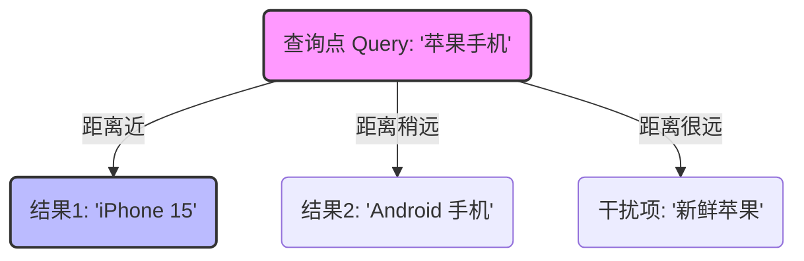
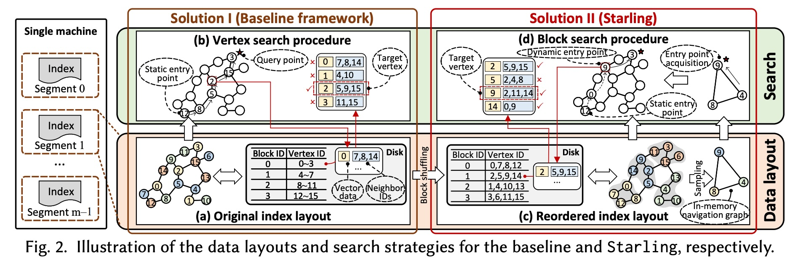
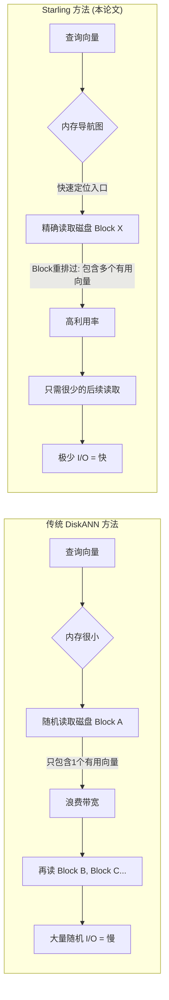
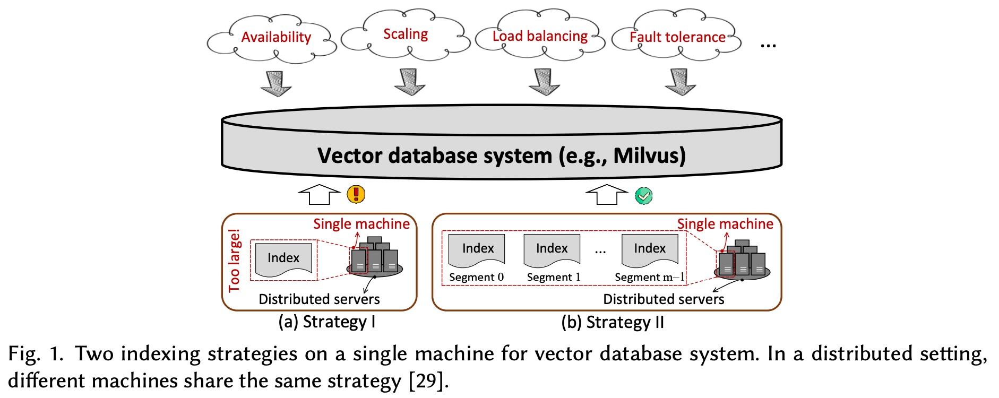
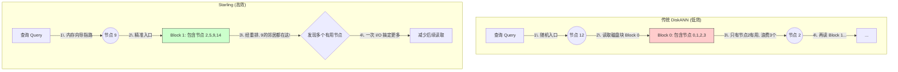
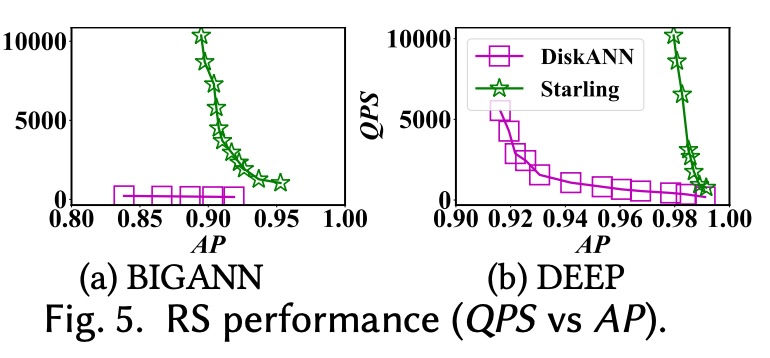

## AI论文解读 | Starling: An I/O-Efficient Disk-Resident Graph Index Framework for High-Dimensional Vector Similarity Search on Data Segment
        
### 作者        
digoal        
        
### 日期        
2025-11-30        
        
### 标签        
PostgreSQL , PolarDB , DuckDB , AI , 论文解读        
        
----        
        
## 背景  
      
https://arxiv.org/pdf/2401.02116v1        
  
提示:          
```          
读懂《Starling: An I/O-Efficient Disk-Resident Graph Index Framework for High-Dimensional Vector Similarity Search on Data Segment》这篇论文需要提前掌握哪些基础知识, 请使用中文通熟易懂的讲解这些基础知识, 可以引用论文中的图、表或使用Markdown支持的图形(text,mermaid等)增加解释性. 
  
使用中文通熟易懂的解读《Starling: An I/O-Efficient Disk-Resident Graph Index Framework for High-Dimensional Vector Similarity Search on Data Segment》这篇论文, 其中的关键内容请着重讲解, 可以引用论文中的图、表或使用Markdown支持的图形(text,mermaid等)增加解释性. 
  
提取《Starling: An I/O-Efficient Disk-Resident Graph Index Framework for High-Dimensional Vector Similarity Search on Data Segment》这篇论文中的重要术语, 使用中文对这些术语进行通熟易懂的讲解, 可以引用论文中的图、表或使用Markdown支持的图形(text,mermaid等)增加解释性. 
```     
  
## 1 前置知识 
  
要深入理解这篇论文《Starling: An I/O-Efficient Disk-Resident Graph Index Framework...》，你需要掌握以下五个核心领域的背景知识。我会用通俗的语言为你讲解，并结合图示帮助你直观理解。

### 1\. 高维向量与相似度搜索 (High-Dimensional Vectors & Similarity Search)

**基础概念：**
在 AI 领域，计算机不直接“理解”图片、文字或视频。它通过神经网络模型（如 BERT, ResNet）将这些非结构化数据转换成一串数字列表，这串数字就叫**向量 (Vector)** 或 **Embedding**。

  * **维度 (Dimension):** 一个向量可能包含 128、768 甚至更多的数字，这被称为“高维”。
  * **相似度:** 如果两个向量在空间中的距离很近，代表它们原本的图片或文字含义很相似。
  * **HVSS (High-Dimensional Vector Similarity Search):** 论文的核心任务就是在海量数据中，找到和“查询向量”距离最近的 K 个向量（即 K-Nearest Neighbors, KNN）。

**图解：**
假设这是一个简化的 2维空间（实际上是几百维）：



### 2\. 近似最近邻搜索 (ANNS) 与图索引

**为什么不能直接找？**
如果在 10 亿个向量中逐个计算距离（暴力搜索），速度太慢了。因此，业界通常使用 **ANNS (Approximate Nearest Neighbor Search)** ：允许牺牲极小的一点精度（比如找回 99% 的正确结果），换取极快的速度。

**图索引 (Graph Index):**
这是目前最主流的方法（如 HNSW, NSG）。

  * **原理：** 把向量看作图中的节点，把相似的向量连上线（边）。
  * **搜索过程：** 就像在一个城市里找路。你从一个任意的入口点出发，问：“这里离目标近吗？”如果不近，就沿着路走到邻居节点，直到找不到更近的邻居为止。

**论文中的关联：**
论文提到了 `DiskANN`、`HNSW`、`NSG` 。这些都是基于图的算法。

  * **挑战：** 这种“跳来跳去”的搜索方式在内存里很快，但在磁盘上很慢，因为每次跳跃都是一次 I/O。

### 3\. 内存 vs. 磁盘 与 I/O 瓶颈

**这篇论文的核心痛点：**

  * **内存 (RAM):** 速度极快（纳秒级），但很贵，容量有限。存不下海量向量。
  * **磁盘 (SSD):** 速度较慢（微秒/毫秒级），但便宜，容量大。
  * **I/O (Input/Output):** CPU 从磁盘读取数据的过程。

**关键概念：Block (块) 与 Page (页)**
磁盘读取数据不是一个字节一个字节读的，而是按“块”读取，通常一个 Block 是 **4KB**。

  * **问题：** 传统的图索引在磁盘上很低效。如果你只需要读取 1 个向量（比如 100 字节），但磁盘必须读整个 4KB 的 Block。如果这个 Block 里剩下的空间存的都是无关向量，那就是浪费了带宽。

> **论文图示引用 (Figure 2a vs 2c):**   
>  
>   * **传统方法 (Figure 2a):** 磁盘块里的数据是按 ID 顺序存的。但这没用，因为 ID 相邻不代表向量相似。读一个块，里面只有一个是有用的“邻居”，利用率极低（Vertex utilization ratio 低）。  
>   * **Starling (Figure 2c):** 论文通过算法把**图形上相邻**的节点，强行搬运到同一个磁盘 Block 里。这样读一次盘，能拿到好几个有用的候选者。  

  

### 4\. 数据局部性 (Data Locality)

**通俗解释：**
假设你去超市买薯片。

  * **没有局部性：** 薯片在第1排，萨尔萨酱在第10排，可乐在第20排。你需要跑断腿（多余的 I/O）。
  * **有局部性：** 超市把薯片、萨尔萨酱和可乐都放在同一个货架上。你伸手就能全拿到（高 I/O 效率）。

**论文中的 "Block Shuffling":**
这就是论文提出的核心技术——**块重排**。它试图解决一个 NP-hard 问题 ：如何重新排列数据在磁盘上的物理位置，使得经常被一起访问的向量（邻居），在物理上也住在一起（同一个 Block）。

### 5\. 向量数据库的“数据分段” (Data Segment)

**系统架构背景：**
工业界的向量数据库（如 Milvus, Zilliz）不会把所有数据存成一个大文件，而是切分成很多个 **Segment (分段)** 。

  * **原因：** 为了方便扩展、负载均衡和容错。
  * **配置：** 一个 Segment 可能有 2GB 内存和 10GB 磁盘 。
  * **Starling 的定位：** 它不是要解决跨机器的分布式搜索，而是要极致优化**单个 Segment 内部**的搜索效率。它要在有限的内存（存导航图）和有限的磁盘空间下，做到最快。

### 总结：Starling 的工作原理图解

为了读懂论文，你可以脑补这样一个流程图，对比传统方法和 Starling：



**阅读建议：**

1.  先看 **Figure 1** ：理解为什么要在 Segment 级别做优化（而不是在大单机上）。     
2.  重点看 **Figure 2** ：这是全篇最直观的图，对比了传统布局（左）和 Starling 的重排布局（右）。    
3.  关注 **Section 4.1 Block Shuffling**：这是它的核心算法，解释了如何把“薯片和可乐”放到一起。  

掌握了以上知识，你就能顺畅地理解这篇论文是如何通过“重新排列数据”和“优化内存索引”来解决磁盘 I/O 瓶颈的。
  
## 2 解读论文 
  
这篇论文《Starling: An I/O-Efficient Disk-Resident Graph Index Framework for High-Dimensional Vector Similarity Search on Data Segment》提出了一种名为 **Starling** 的新框架。

简单来说，它的目标是： **在内存和磁盘空间都很有限的“数据分段（Data Segment）”环境下，让向量搜索变得既快又省空间。**

以下是这篇论文的通俗解读和核心技术拆解：

-----

### 1\. 核心背景：为什么需要 Starling？

**场景痛点：**
现在的向量数据库（如 Milvus）为了方便扩展和管理，通常把海量数据切分成一个个小的 **“分段 (Segment)”** 。每个分段分配到的资源非常有限（例如：2GB 内存，10GB 磁盘）。

**现有方法的困境：**
要在这种受限环境下做高维向量搜索（HVSS），现有的两个流派都有缺陷：

  * **纯内存方案 (如 HNSW)：** 内存不够用，装不下 。
  * **现有磁盘方案 (如 DiskANN, SPANN)：**
      * **DiskANN：** 虽然省内存，但搜索时需要在磁盘上“乱跳”，产生大量随机 I/O，速度慢 。
      * **SPANN：** 为了快，需要把数据复制很多份（副本），磁盘空间占用太大，分段装不下 。

**Starling 的目标：** 既要像 DiskANN 一样省空间，又要比它快得多（目标是减少磁盘 I/O 次数）。

-----

### 2\. 核心洞察：为什么传统磁盘搜索这么慢？

论文指出了两个导致慢的根本原因（这也是 Starling 重点解决的问题）：

#### 问题一：极其糟糕的“数据局部性” (Poor Data Locality)

磁盘读取数据的最小单位是 **Block (块，通常 4KB)** 。

  * **现状：** 传统的图索引在磁盘上是按 ID 顺序存的。但在高维空间里，ID 挨着的两个向量，意思可能差了十万八千里 。
  * **结果：** 当你为了读取向量 A 而加载一个 4KB 的块时，这个块里剩下的几十个向量大多是没用的“废数据”。论文测试发现，**DiskANN 每次读取浪费了高达 94% 的带宽** 。

#### 问题二：搜索路径太长 (Long Search Path)

图搜索就像在一个迷宫里找路。如果你的入口（Entry Point）离终点很远，你就需要跳很多次（Hops）。在内存里跳几次没关系，但在磁盘上，每一跳就是一次慢速的 I/O 读取 。

-----

### 3\. Starling 的三大“魔法” (核心解决方案)

为了解决上述问题，Starling 重新设计了**数据在磁盘上的摆放方式**和**搜索策略**。

#### 魔法一：磁盘上的“块重排” (Block Shuffling) —— 解决局部性问题

这是 Starling 最关键的创新。既然每次都要读一个块，Starling 决定**把在图上互为邻居的向量，强行搬运到同一个物理磁盘块里** 。

> **通俗理解：**
> 就像在超市摆货。传统方法是按“进货时间”摆放，买薯片在第1排，买可乐在第10排，你需要跑两趟。Starling 的方法是把“经常一起买”的薯片和可乐摆在同一个货架上，你伸手一次就能全拿到。

  * **实现算法：** 论文证明了完美的重排是数学上的难题（NP-hard），所以提出了启发式算法 **BNF (Block Neighbor Frequency)** 。它通过迭代，把节点放到包含其最多邻居的块中 。
  * **效果：** 读一次盘，能拿到多个有用的候选向量，大幅提高了 I/O 利用率 。

#### 魔法二：内存中的“导航图” (In-Memory Navigation Graph) —— 解决路径长问题

Starling 不再盲目地从磁盘开始搜索，而是在内存里养了一个“小向导” 。

  * **做法：** 抽取一小部分数据（比如 10%）建立一个微型图索引，放在内存里 。
  * **流程：** 查询来了先问内存里的“向导”，快速定位到离目标很近的位置，然后再去磁盘上精搜。
  * **效果：** 大幅减少了在慢速磁盘上的跳跃次数（搜索路径变短）。

#### 魔法三：块级搜索策略 (Block Search Strategy)

因为使用了“魔法一”，现在读上来的 Block 里有很多都是“邻居”。Starling 改变了传统的逐个点搜索策略，改为 **“地毯式”搜索当前块** 。

  * **流程：** 加载一个 Block -\> 计算块里**所有**向量到查询点的距离 -\> 把近的都加入候选池 。
  * **优化：** 配合 **Pipeline（流水线）** 技术，一边让 CPU 算距离，一边让磁盘读下一个块，互不等待 。

-----

### 4\. 图解对比：DiskANN vs. Starling

为了更直观，我们可以参考论文中的 **Fig. 2**，用 Mermaid 图形来解释两者的区别：



*(基于论文 Fig. 2 的逻辑重绘 )*

  

-----

### 5\. 实验结果：到底有多快？

论文在四个真实数据集（如 3300万数据量的 BIGANN）上进行了测试，结果非常惊人：

1.  **吞吐量 (QPS)：** 在保证相同准确率（AP=0.9）的前提下，Starling 的吞吐量是 DiskANN 的 **43.9倍** 。
2.  **延迟 (Latency)：** 查询延迟降低了 **98%**，甚至能达到 1毫秒以下 。
3.  **I/O 效率：** Starling 的顶点利用率（Vertex Utilization Ratio）远高于 DiskANN，说明它每次读盘都没浪费 。

**图表证据：**
论文中的 **Fig. 5 (a)** 展示了 QPS 对比。可以看到代表 Starling 的红线在代表 DiskANN 的蓝线之上极远的位置，这意味着在同样的精度下，Starling 能处理的请求数是数量级上的碾压 。


  

### 6\. 总结

Starling 的核心思想就是： **不要让磁盘做随机的无用功。**

它通过**物理上的重新排队（Block Shuffling）和逻辑上的内存导航（Navigation Graph）** ，把原本支离破碎的图索引整合成适合磁盘读取的形态。这使得它非常适合部署在资源受限的向量数据库分段（Segment）中，是工业界解决海量向量搜索的一个高效方案。
  
## 3 术语 
  
这篇论文《Starling: An I/O-Efficient Disk-Resident Graph Index Framework for High-Dimensional Vector Similarity Search on Data Segment》主要解决的是在资源受限的环境下，如何高效地从磁盘中检索海量向量数据的问题。

以下是论文中的核心术语解读：

### 1\. Data Segment (数据分段)

  * **定义**：这是论文特定的应用场景背景。在工业级的向量数据库（如 Milvus）中，为了方便扩展、负载均衡和容错，大规模的数据不会存成一个大文件，而是被切分成许多小的“分段” 。
  * **通俗解释**：想象你有一个巨大的图书馆（数据库），为了管理方便，你把书按区（分段）管理。每个区只有很小的空间（例如 2GB 内存和 10GB 磁盘空间）。
  * **难点**：因为空间极其有限，传统的“大力出奇迹”（把所有索引都塞进内存）的方法在这里行不通，必须精打细算 。

### 2\. HVSS (High-Dimensional Vector Similarity Search, 高维向量相似度搜索)

  * **定义**：这是论文要执行的任务。即在海量的高维数据（如 128维或更复杂的数字列表）中，找到和“查询向量”最相似的那几个向量 。
  * **通俗解释**：
      * **高维向量**：计算机把图片、文字变成了一长串数字。
      * **相似度搜索**：给计算机一张“苹果”的照片，让它在几千万张图片里找出其他的“苹果”。
  * **两类主要查询** ：
      * **KNNS (K最近邻)** ：找最像的 K 个（比如最像的 10 张图）。
      * **Range Search (范围搜索)** ：找所有相似度在某个范围内的图（比如相似度 \> 90% 的所有图）。

### 3\. Disk-Resident Graph Index (磁盘驻留图索引)

  * **定义**：一种索引结构。因为数据太多，内存放不下，所以把这种“地图（图索引）”主要存放在磁盘（SSD）上，只在搜索时按需读取 。
  * **痛点**：磁盘读取速度比内存慢得多。传统的磁盘图索引（如 DiskANN）每次移动一步都需要读取一次磁盘，导致产生了大量的随机 I/O，速度很慢 。

### 4\. Starling (椋鸟框架)

  * **定义**：论文提出的新框架。它的目标是在不增加额外存储成本的前提下，通过优化“数据怎么摆放”和“怎么搜”，来大幅减少磁盘 I/O 次数 。

### 5\. Block Shuffling (块重排 / 块混洗)

  * **定义**：Starling 的核心技术之一。这是一种在磁盘上重新组织数据布局的算法。它将图索引中的**顶点（向量）和它的邻居们**重新排列，强行塞进同一个磁盘块（Block）里 。
  * **通俗解释**：
      * **传统做法 (按ID存)** ：就像超市按商品出厂编号摆货。你要买薯片和可乐（它们是“邻居”，经常一起买），结果薯片在第1排，可乐在第100排。你得跑两趟（读两次盘）。
      * **Block Shuffling (按关系存)** ：Starling 把经常一起被访问的薯片和可乐摆在同一个货架上。你伸手一次（读一次盘），就能把它们都拿走。
  * **图解对比**：


*(基于论文图2的概念绘制)*

  

### 6\. Vertex Utilization Ratio (顶点利用率)

  * **定义**：衡量每次磁盘读取效率的指标。指的是在一个加载进来的磁盘块（通常 4KB）中，有多少个顶点是真正对搜索有用的 。
  * **现状**：传统方法（如 DiskANN）利用率极低，读一个块通常只用其中 1 个数据，高达 94% 的读取数据被浪费了 。
  * **Starling 的改进**：通过 **Block Shuffling**，Starling 显著提高了这个比率，读一次盘能用到更多数据 。

### 7\. In-Memory Navigation Graph (内存导航图)

  * **定义**：Starling 的另一个核心组件。它在内存中维护一个小型的、稀疏的图索引（只包含少量采样点），用于指路 。
  * **通俗解释**：
      * 想象你要去一个复杂的迷宫（磁盘上的大图）寻宝。
      * 如果没有向导，你只能从迷宫边缘随机试探，要走很多冤枉路才能接近宝藏。
      * **内存导航图**就像一个**粗略的 GPS**。它先在内存里快速告诉你：“别从大门口进，直接空降到迷宫的第 5 区，宝藏就在那附近。”
      * 这样，你进入慢速磁盘时，起步点就已经离终点很近了，减少了跳跃次数 。

### 8\. Block Search Strategy (块搜索策略)

  * **定义**：配合“块重排”使用的搜索算法。传统算法是“查到一个点，读一次盘”。Starling 的策略是“读一个块，把块里所有有用的点都查一遍” 。
  * **流程**：
    1.  加载一个块。
    2.  计算块里**所有**点到查询目标的距离。
    3.  把其中比较近的点都拿出来，作为下一轮搜索的线索 。
  * **优势**：这种“地毯式”搜索充分利用了磁盘带宽，能更快找到目标。
  
## 参考        
         
https://arxiv.org/pdf/2401.02116v1    
        
<b> 以上内容基于DeepSeek、Qwen、Gemini及诸多AI生成, 轻微人工调整, 感谢杭州深度求索人工智能、阿里云、Google等公司. </b>        
        
<b> AI 生成的内容请自行辨别正确性, 当然也多了些许踩坑的乐趣, 毕竟冒险是每个男人的天性.  </b>        
  
    
#### [PolarDB 学习图谱](https://www.aliyun.com/database/openpolardb/activity "8642f60e04ed0c814bf9cb9677976bd4")
  
  
#### [PostgreSQL 解决方案集合](../201706/20170601_02.md "40cff096e9ed7122c512b35d8561d9c8")
  
  
#### [德哥 / digoal's Github - 公益是一辈子的事.](https://github.com/digoal/blog/blob/master/README.md "22709685feb7cab07d30f30387f0a9ae")
  
  
#### [About 德哥](https://github.com/digoal/blog/blob/master/me/readme.md "a37735981e7704886ffd590565582dd0")
  
  

  
