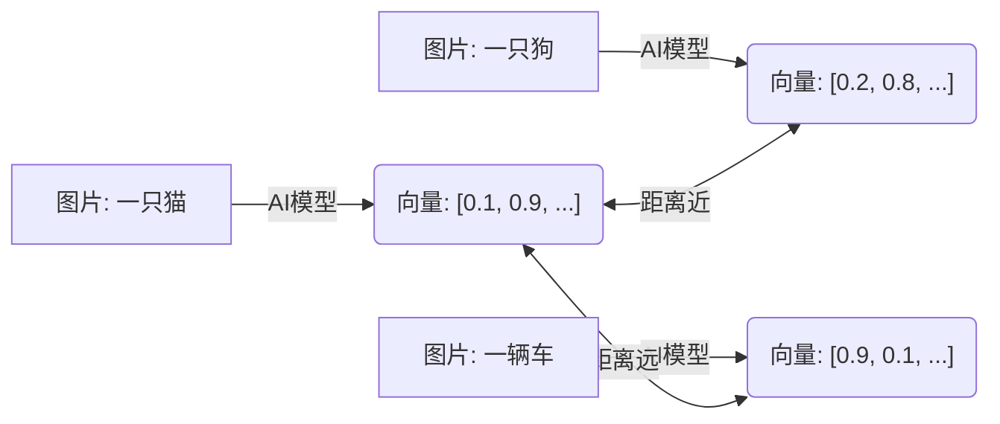
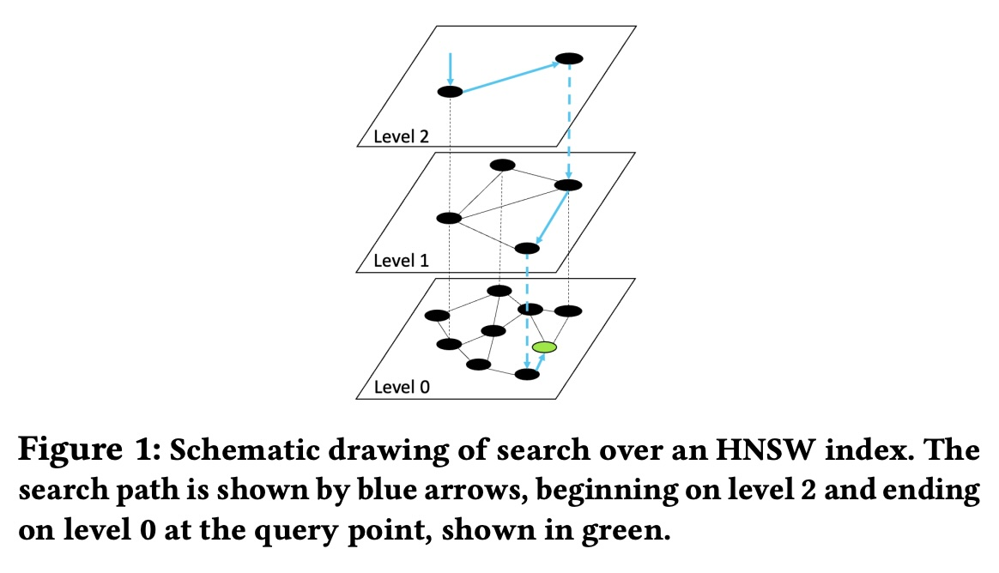
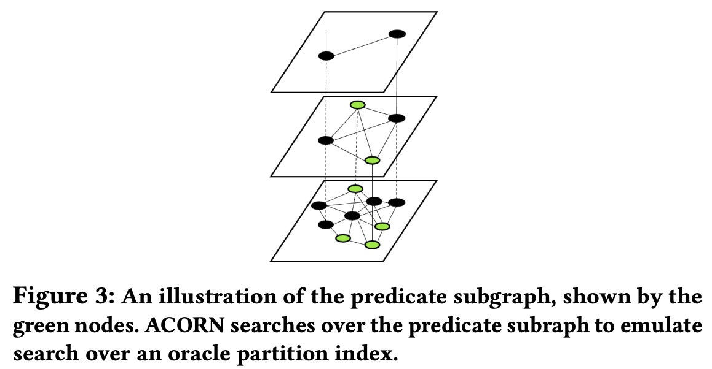
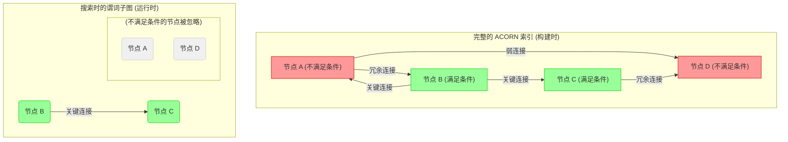
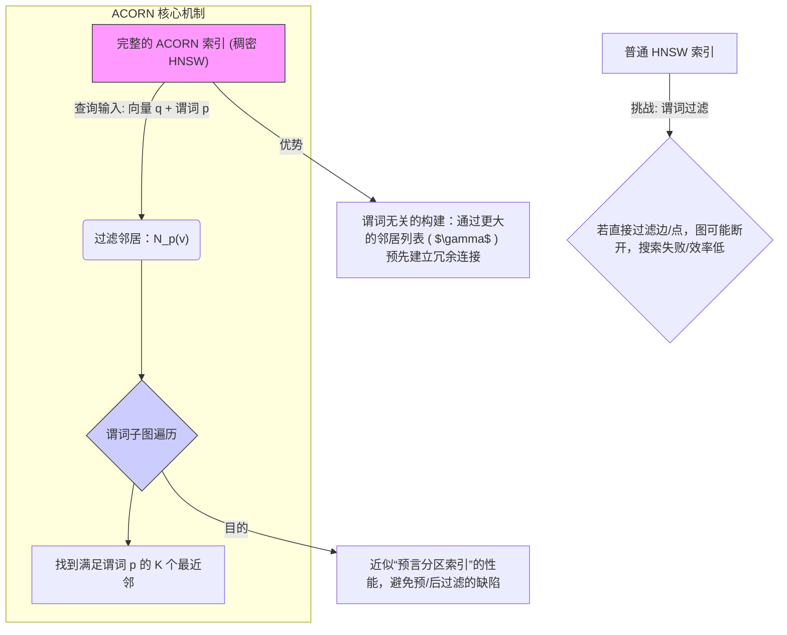

## AI论文解读 | ACORN: Performant and Predicate-Agnostic Search Over Vector Embeddings and Structured Data
        
### 作者        
digoal        
        
### 日期        
2025-12-01        
        
### 标签        
PostgreSQL , PolarDB , DuckDB , AI , 论文解读        
        
----        
        
## 背景  
      
https://arxiv.org/pdf/2403.04871        
  
提示:          
```          
读懂《ACORN: Performant and Predicate-Agnostic Search Over Vector Embeddings and Structured Data》这篇论文需要提前掌握哪些基础知识, 请使用中文通熟易懂的讲解这些基础知识, 可以引用论文中的图、表或使用Markdown支持的图形(text,mermaid等)增加解释性. 
  
使用中文通熟易懂的解读《ACORN: Performant and Predicate-Agnostic Search Over Vector Embeddings and Structured Data》这篇论文, 其中的关键内容请着重讲解, 可以引用论文中的图、表或使用Markdown支持的图形(text,mermaid等)增加解释性. 
  
提取《ACORN: Performant and Predicate-Agnostic Search Over Vector Embeddings and Structured Data》这篇论文中的重要术语, 使用中文对这些术语进行通熟易懂的讲解, 可以引用论文中的图、表或使用Markdown支持的图形(text,mermaid等)增加解释性. 
```     
  
## 1 前置知识 
  
要读懂《ACORN: Performant and Predicate-Agnostic Search Over Vector Embeddings and Structured Data》这篇论文，你需要跨越“传统数据库”和“AI向量检索”两个领域的知识鸿沟。

ACORN 的核心在于解决 **混合搜索（Hybrid Search）** 的效率问题，它是在著名的 **HNSW** 索引算法基础上进行的改进。

以下是阅读这篇论文前必须掌握的四个核心基础知识模块，我将用通俗易懂的语言配合图表为你讲解。

-----

### 1\. 向量嵌入与相似度搜索 (Vector Embeddings & Similarity Search)

**基础概念：**
在 AI 领域，我们将图片、文本或视频转换成一串数字，这串数字叫**向量（Embedding）** 。如果两个内容语义相似（比如两张猫的照片），它们对应的向量在数学空间中的距离就很近。

**你需要懂的：**

  * **语义搜索 vs 关键词搜索：** 传统数据库用关键词匹配（如 `WHERE type="cat"`），而向量数据库用距离计算（如“找出距离这串数字最近的 Top-K 个点”）。
  * **高维空间：** 向量通常有几百到几千个维度（论文中提到 SIFT1M 数据集是 128 维 ）。




-----

### 2\. 近似最近邻搜索 (ANN, Approximate Nearest Neighbor)

**基础概念：**
在一个包含百万级甚至亿级向量的数据库中，如果要找到和查询向量最近的 K 个点，逐个计算距离（暴力搜索）太慢了。
因此，我们通过牺牲一点点精度（比如只找回 99% 的正确结果），换取极快的速度。这被称为 **ANN**。

**你需要懂的：**

  * **召回率 (Recall)：** 衡量搜索质量的指标。论文中多次提到 `Recall@10`，意思是“真正的前10个最相似的项，你找回来了几个？”
  * **QPS (Queries Per Second)：** 衡量搜索速度的指标。论文的核心论点就是 ACORN 能在保持高 Recall 的同时，获得比现有方法高 2-1000倍的 QPS 。

-----

### 3\. HNSW 索引 (Hierarchical Navigable Small Worlds)

这是这篇论文的**地基**。ACORN 实际上是修改版的 HNSW。如果你不理解 HNSW，就看不懂 ACORN 做了什么。

**基础概念：**
HNSW 是一种基于“图”的索引结构。你可以把它想象成一个**多层的高速公路网**。

  * **图 (Graph)：** 每个数据点是一个节点，相近的点之间连着边。搜索就是沿着边“跳跃”。
  * **分层 (Hierarchical)：**
      * **顶层（Level 2+）：** 只有少量节点，点与点之间连接很长。就像“洲际高速”，用于快速逼近目标区域。
      * **底层（Level 0）：** 包含所有节点，连接很短。就像“街道小巷”，用于精确定位。

**论文中的图解 ：**
论文的 Figure 1 很好地展示了 HNSW 的结构：    

> 搜索从顶层（Level 2）开始，大步跳跃找到最近的点，然后降落到下一层（Level 1）继续跳跃，最后在底层（Level 0）完成最终搜索。

**你需要懂的术语：**

  * **Entry Point (入口点)：** 搜索开始的地方。
  * **NSW (Navigable Small World)：** 这种图的特性，保证你可以通过较少的步数（跳跃）从任意一点到达另一点。

-----

### 4\. 混合搜索的三种流派 (The Landscape of Hybrid Search)

**问题背景：**
用户不仅想搜“看起来像这件衣服的商品”（向量搜索），还想加个条件“价格在100元以下”（结构化过滤）。这就叫**混合搜索**。
论文在 **Introduction** 和 **Section 3.2** 中详细批评了现有的两种主流方法，你需要理解它们为什么不好：

#### A. 预过滤 (Pre-filtering)

  * **做法：** 先把“100元以下”的商品全挑出来，再在这些商品里算向量距离。
  * **缺点：** 如果“100元以下”的商品有几百万个，这一步之后的暴力计算依然很慢 。

#### B. 后过滤 (Post-filtering)

  * **做法：** 先用 HNSW 找到最相似的 100 件衣服，然后再看这 100 件里哪些是“100元以下”的。
  * **缺点：** 如果最相似的 100 件衣服全是贵的，过滤完可能结果就是 0。为了凑够结果，你不得不扩大搜索范围（比如搜前 10000 个），这会导致性能剧烈下降 。

#### C. ACORN 的思路 (Predicate-Agnostic Index)

  * **做法：** 论文提出的 ACORN 试图解决上述两者的痛点。它构建了一个特殊的图，使得即使你在图中只看“满足条件”的点（即论文说的 **Predicate Subgraph 谓词子图** ），这些点依然是连通的，依然可以像 HNSW 那样高效搜索。

**关键术语解释：**

  * **Predicate (谓词/过滤条件)：** 就是 SQL 中的 `WHERE` 条件，比如 `color = 'red'`。
  * **Selectivity (选择率)：** 满足条件的点占总数据的比例。比如“颜色=红色”可能只有 10% 的数据满足，选择率就是 0.1。
  * **Cardinality (基数)：** 一个属性有多少种可能的取值。比如“性别”基数很低（2种），但“用户ID”基数极高。论文强调 ACORN 能处理 **High-Cardinality（高基数）** 的场景 。

-----

### 总结：你需要构建的心理模型

在阅读论文前，请在脑海中建立这样一个画面：

1.  **目标：** 我们要在海量数据中，快速找到既**相似**又**满足特定条件**的数据。
2.  **现状：**
      * **HNSW** 找相似很快，但不懂“条件”。
      * **Pre-filter** 在数据多时太慢。
      * **Post-filter** 经常漏掉数据或为了找数据而变慢。
3.  **ACORN 的魔法：** 它修改了 HNSW 的建图方式（存更多的边），使得当我们把不满足条件的点“隐身”时，剩下的点依然构成一个完整的高速公路网（HNSW），让我们能顺畅地导航到目标。

掌握了以上四点，你就可以流畅地阅读这篇论文，理解它为何要提出 `Predicate Subgraph Traversal`（谓词子图遍历）以及 `Neighbor Expansion`（邻居扩展）等核心技术了。
  
## 2 解读论文 
  
《ACORN: Performant and Predicate-Agnostic Search Over Vector Embeddings and Structured Data》这篇论文提出了一个用于解决**混合搜索 (Hybrid Search)** 效率和通用性问题的革命性索引结构。

ACORN 基于目前最先进的向量检索算法 **HNSW (Hierarchical Navigable Small Worlds)** 进行了根本性改进，其核心思想是： **预先构建一个“超连接”的 HNSW 索引，以便在查询时可以忽略任何不满足过滤条件的节点，而剩下的有效节点仍能保持高速且准确的导航能力。**

以下是对这篇论文关键内容的通俗易懂解读，并着重讲解其核心创新点。

-----

## 关键内容一：解决现有混合搜索的困境

混合搜索是现代应用（如电商、内容推荐）的刚需，它要求同时满足两个条件：

1.  **向量相似度：** 找出与查询向量（例如一张参考图片）最相似的内容。
2.  **结构化过滤（谓词）：** 必须满足特定的结构化条件（例如“价格低于100元”或“发布日期在2024年之后”）。

论文指出，现有主流方法都存在致命缺陷 ：

| 方法 | 工作流程 | 核心缺陷 |
| :--- | :--- | :--- |
| **预过滤 (Pre-filtering)** | 先筛选出满足条件 $P$ 的数据，然后在剩下的子集上做暴力相似度搜索。 | 当数据集很大或满足条件的点很多时，暴力搜索依然很慢，性能差 ( $O(sn+K)$ ) 。 |
| **后过滤 (Post-filtering)** | 先用 HNSW 找到最相似的 $N$ 个点，然后从中过滤掉不满足条件的。 | 如果最相似的 $N$ 个点都不满足条件，就必须不断扩大搜索范围，导致速度急剧下降 。特别是当查询目标和过滤条件存在**负查询关联**时，性能最差 。 |
| **专用索引 (Specialized Indices)** | 为特定的低基数（取值少）条件预先构建专用索引。 | 只能处理简单的等于关系和数量有限的过滤条件，无法应对复杂的、高基数的、未知的过滤集合 。 |

ACORN 的目标是创建一个 **谓词无关 (Predicate-Agnostic)** 的索引，它不依赖于事先知道的任何过滤条件，但能在运行时高效地处理任何过滤需求 。

-----

## 关键内容二：理论理想与 ACORN 的核心思想

### 1\. 理论上的“完美”方案：预言分区索引 (Oracle Partition Index)

论文首先提出了一个“理论上理想但实际不可能”的方案： **预言分区索引** 。

  * 如果我们在**构建索引时**就知道查询的条件 $P_q$ ，我们就可以只为满足条件 $P_q$ 的向量集合 $X_p$ 构建一个标准的 HNSW 索引 。
  * 搜索这个索引的复杂度是 $O(\log(sn)+K)$ ，远优于预过滤的线性复杂度 。
  * **然而，** 实际应用中查询条件是无限且未知的，我们不可能为每个潜在条件都建一个 HNSW 。

### 2\. ACORN 的核心：谓词子图遍历 (Predicate Subgraph Traversal)

**ACORN 的核心创新是：在不实际构建预言分区索引的情况下，通过搜索一个特殊的子图来**近似**预言索引的性能** 。

  * **谓词子图：** 对于一个查询条件 $P$ ，这个子图只包含那些满足条件 $P$ 的节点 $X_p$ 。
  * **遍历策略：** ACORN 的搜索算法只沿着指向满足条件 $P$ 的邻居（节点）的边进行跳跃和遍历 。

如果原有的 HNSW 索引不够密集，一旦过滤掉大量不满足条件的节点，剩下的节点之间可能会“断开”，导致搜索无法继续。因此，为了保证即使在过滤后，子图仍能像 HNSW 一样导航，ACORN 必须在构建时下功夫。

**图解：ACORN 的搜索与子图** [引用论文 Figure 3 的概念]    



**关键在于：** 通过在构建时增加冗余连接（让图更密集），即使在运行时过滤掉节点 A 和 D，节点 B 和 C 之间的连接依然存在，搜索路径不会中断 。

-----

## 关键内容三：ACORN 的实现细节（邻居扩展与变体）

ACORN 通过修改 HNSW 的**构建算法**来实现上述“超连接”的特性，这种修改被称为**谓词无关的邻居扩展策略 (Predicate-Agnostic Neighbor Expansion)** 。

### ACORN- $\gamma$ (高性能版本)

ACORN- $\gamma$ 是为追求极致搜索效率而设计的 。

1.  **邻居扩展因子 ( $\gamma$ )：** HNSW 在构建时，每个节点连接的邻居数量有一个上限 $M$ 。ACORN- $\gamma$ 引入了扩展因子 $\gamma$ ，使得在构建时，它会考虑**多达 $\gamma \cdot M$ 个候选邻居** 。
2.  **构建更密集的图：** 通过考虑更多的候选邻居，并在其基础上进行更宽松的修剪，ACORN- $\gamma$ 构建的图比标准 HNSW 更密集 。这些额外的连接就是确保过滤后子图连通性的“冗余保险”。
3.  **搜索时的过滤：** 在搜索时，每当一个节点要访问其邻居列表时，它会实时检查每个邻居是否满足查询谓词 $P$ ，只有满足条件的邻居才会被加入到搜索路径中 。

最终，ACORN- $\gamma$ 的搜索复杂度 $O((d+\gamma) \log(sn) + \log(1/s))$ 成功地实现了对预言分区索引 $O(d \cdot \log(s \cdot n))$ 复杂度的近似 。

### ACORN-1 (低开销版本)

ACORN-1 是为了资源受限环境而设计的，它追求在保证一定性能的同时，大幅降低索引构建时间和空间占用 。

  * **区别：** ACORN-1 在**构建时**不进行 $\gamma$ 扩展，而是保持类似标准 HNSW 的结构，从而获得更快的构建速度（TTI, Time-To-Index） 。
  * **近似：** 它将邻居扩展从构建阶段转移到了**搜索阶段**。在搜索时，它通过额外的计算来近似 ACORN- $\gamma$ 的密集图结构 。
  * **折衷：** 实验证明，ACORN-1 的 QPS（每秒查询数）比 ACORN- $\gamma$ 低至多 5 倍，但 TTI（索引构建时间）可以降低 **9 到 53 倍** 。

-----

## 关键内容四：实验结果与性能提升

论文通过在 SIFTIM、Paper、LAION、TripClick 等多个数据集上进行系统评估，证明了 ACORN 的优越性 。

### 性能总结 

ACORN- $\gamma$ 在固定召回率（通常为 0.9 Recall@10）下，相比现有方法实现了：

  * **2-10 倍** 更高的 QPS（针对既有基准测试）。
  * **30 倍以上** 更高的 QPS（针对新的、复杂的混合查询数据集，如 TripClick 和 LAION）。
  * 在 2500 万向量的大规模数据集上，QPS 提升超过 **1,000 倍**。

### 稳健性

ACORN 的核心价值在于其**稳健性**。它在各种**谓词选择率 (Selectivity)** 和**查询关联 (Query Correlation)** 变化下都能保持高效的亚线性检索时间，这正是预过滤和后过滤等基线方法无法做到的 。

**结论：** ACORN 通过巧妙地改造 HNSW 的构建过程，以**谓词无关**的方式创建了一个“万能索引”，使得任何运行时施加的过滤条件都能形成一个高效的、可导航的子图，从而在高准确率下实现了前所未有的搜索吞吐量。
  
## 3 术语 
  
这篇论文《ACORN: Performant and Predicate-Agnostic Search Over Vector Embeddings and Structured Data》提出了一个解决向量搜索和结构化数据过滤相结合的“混合搜索”问题的先进方案。

以下是论文中的重要术语及其通俗易懂的中文讲解：

### 核心概念与解决方案

| 术语 (英文) | 术语 (中文) | 通俗讲解 | 引用来源 |
| :--- | :--- | :--- | :--- |
| **ACORN** (ANN Constraint-Optimized Retrieval Network) | **ACORN**（ANN约束优化检索网络） | 这是论文提出的核心索引方法。它是一种新型的索引方法，旨在实现**高性能**和**谓词无关**的混合搜索 。它通过修改和扩展业界领先的图基索引 HNSW 来实现 。 |  |
| **Hybrid Search** | **混合搜索** | 指的是**联合查询**非结构化的**向量数据**（如图像、文本的嵌入向量）和结构化的**属性数据**（如关键词、日期、价格等）的需求 。现有的方法难以同时保证性能和支持多样化的查询约束（谓词） 。|  |
| **Predicate-Agnostic** | **谓词无关** | 意味着索引的构建**不依赖于预先知道**或限制查询中可能出现的**谓词（过滤条件）** 。ACORN 的设计目标是支持**任意**、**无界**且**高基数**的谓词集，解决了现有专业索引（如 Filtered-DiskANN、HQANN）只能支持简单、低基数谓词的局限 。|  |
| **HNSW** (Hierarchical Navigable Small Worlds) | **分层可导航小世界** | 一种**基于图**的 近似最近邻（ANN）索引，是目前性能最好的向量搜索索引之一 。ACORN 正是以 HNSW 作为基础结构进行改造的 。|  |
| Predicate Subgraph Traversal | 谓词子图遍历 | 这是 ACORN 的核心搜索策略 。对于一个带有过滤条件的查询，ACORN 不在整个索引图上搜索，而是**只在满足该过滤条件的所有数据点构成的子图上进行遍历** 。其目的是为了模拟在理论理想的“预言分区索引”上搜索 。|  |
| **Oracle Partition Index** | **预言分区索引** | 这是一个**理论上理想**的性能基准 。它假设我们在**构建索引时就知道**所有查询谓词，并为**每个满足谓词的子集**单独构建一个 HNSW 索引 。虽然它的搜索性能最优，但由于谓词数量无限，实际中不可能构建 。ACORN 的目标是**近似**它的高性能 。|  |

### 混合搜索挑战和基线方法

| 术语 (英文) | 术语 (中文) | 通俗讲解 | 引用来源 |
| :--- | :--- | :--- | :--- |
| **Pre-filtering** | **预过滤** | 混合搜索的基线方法之一 。**先**使用结构化谓词过滤得到满足条件的向量子集 $X_p$ ，**后**在 $X_p$ 上进行向量相似性搜索 。缺点是对于大数据集或满足条件点多（高选择性）的情况，其搜索时间与 $X_p$ 大小成**线性关系**，效率很低 。|  |
| **Post-filtering** | **后过滤** | 混合搜索的基线方法之一 。**先**在完整的向量索引上进行近似最近邻搜索，**后**再对搜索结果进行结构化谓词过滤 。缺点是最近邻可能不满足谓词，因此需要**扩大搜索范围**以找到足够多的合格结果 。|  |
| **Selectivity ( $s$ )** | **选择性（区分度）** | 谓词 $p$ 的区分度，即**满足该谓词的数据实体占总体的比例** 。选择性低（ $s$ 接近 0 ）表示条件严格，过滤掉大多数点；选择性高（ $s$ 接近 1 ）表示条件宽松，大多数点满足条件 。|  |
| **Query Correlation** | **查询相关性** | 衡量**满足谓词的向量子集 $X_p$** 与**查询向量 $x_q$** 之间距离关系的一个概念 。如果查询向量更靠近它的目标（ $X_p$ 中的向量 ），则为**正相关** 。如果查询向量更远离它的目标，则为**负相关** 。查询相关性低（负相关）是**后过滤**方法的主要性能挑战 。|  |

### ACORN 变体与参数

| 术语 (英文) | 术语 (中文) | 通俗讲解 | 引用来源 |
| :--- | :--- | :--- | :--- |
| **ACORN- $\gamma$** | **ACORN- $\gamma$** | ACORN 的一个变体，专注于实现**最高效率**的搜索性能 。它在**索引构建时**就利用**邻居扩展因子 $\gamma$** 来创建更密集的 HNSW 索引 。|  |
| **ACORN-1** | **ACORN-1** | ACORN 的另一个变体，专注于**资源受限环境**下的应用，旨在**最小化索引构建开销（TTI）和空间占用 。它在构建时**只创建标准 HNSW 索引，而将**邻居扩展**的步骤留到**搜索时**进行 。|  |
| **$\gamma$** (Neighbor expansion factor) | **邻居扩展因子** | ACORN- $\gamma$ 索引构建时的关键参数 。标准的 HNSW 为每个节点收集 $M$ 个邻居，而 ACORN- $\gamma$ 则收集 $M \cdot \gamma$ 个邻居 。 $\gamma$ 的一个简单选择是 $1/s_{min}$ ，其中 $s_{min}$ 是计划支持的最小谓词选择性 。|  |

### 谓词子图遍历工作原理示意 (参考图 3)

  

ACORN 的核心在于通过构建一个**稠密**的 HNSW 索引，确保在搜索时，即使只保留通过谓词 $p$ 的节点和边，所形成的**谓词子图** $G(X_p)$ 依然能保持 HNSW 的良好特性（如层次结构、连通性），从而实现高效的贪婪搜索 。


  
## 参考        
         
https://arxiv.org/pdf/2403.04871    
        
<b> 以上内容基于DeepSeek、Qwen、Gemini及诸多AI生成, 轻微人工调整, 感谢杭州深度求索人工智能、阿里云、Google等公司. </b>        
        
<b> AI 生成的内容请自行辨别正确性, 当然也多了些许踩坑的乐趣, 毕竟冒险是每个男人的天性.  </b>        
  
    
#### [PolarDB 学习图谱](https://www.aliyun.com/database/openpolardb/activity "8642f60e04ed0c814bf9cb9677976bd4")
  
  
#### [PostgreSQL 解决方案集合](../201706/20170601_02.md "40cff096e9ed7122c512b35d8561d9c8")
  
  
#### [德哥 / digoal's Github - 公益是一辈子的事.](https://github.com/digoal/blog/blob/master/README.md "22709685feb7cab07d30f30387f0a9ae")
  
  
#### [About 德哥](https://github.com/digoal/blog/blob/master/me/readme.md "a37735981e7704886ffd590565582dd0")
  
  

  
