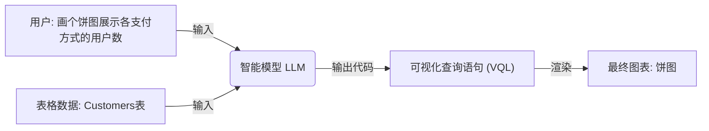
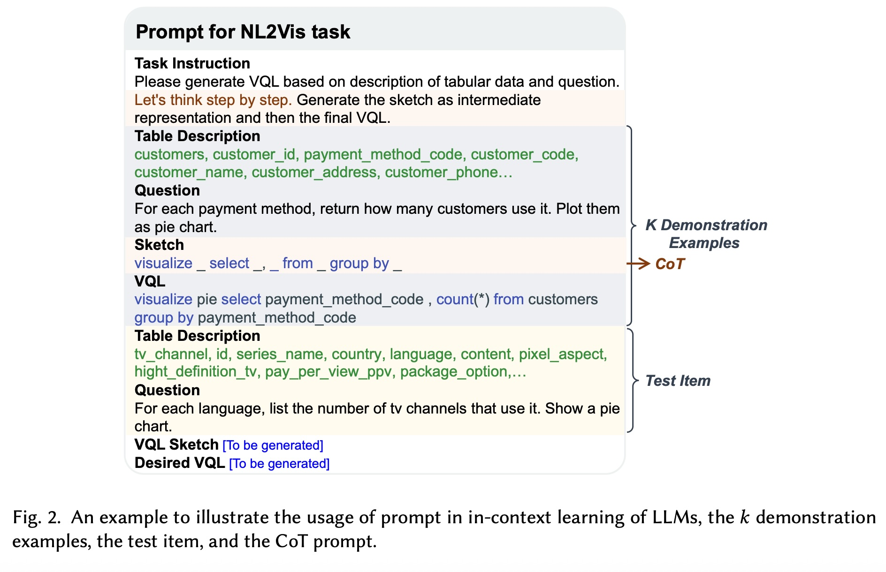
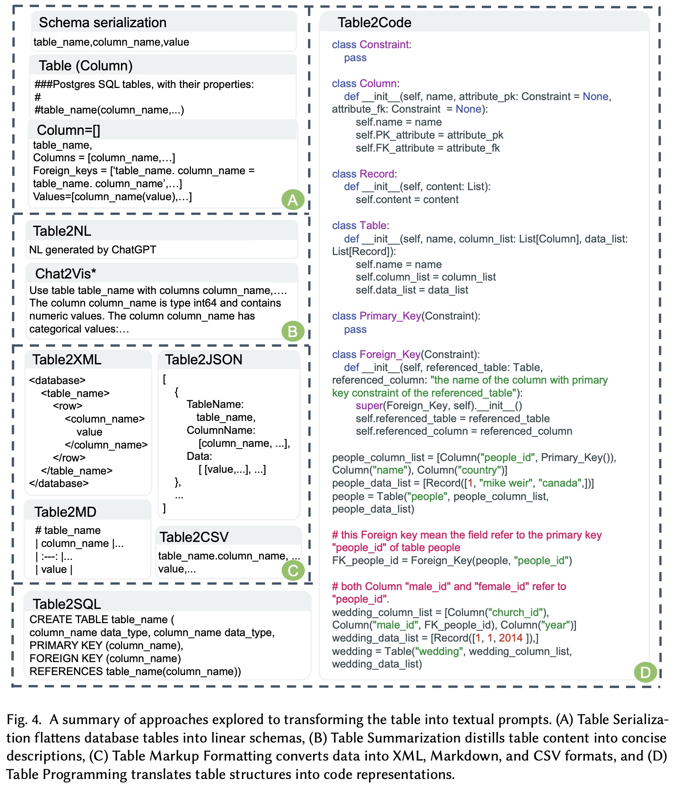
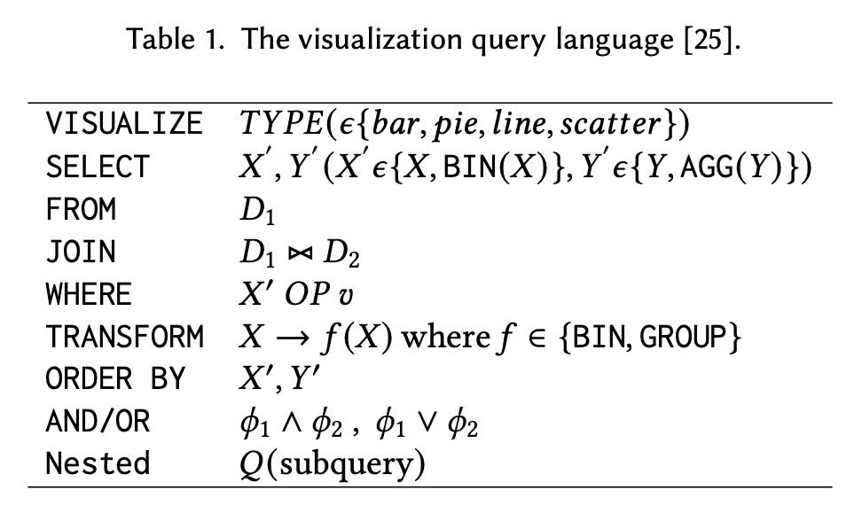
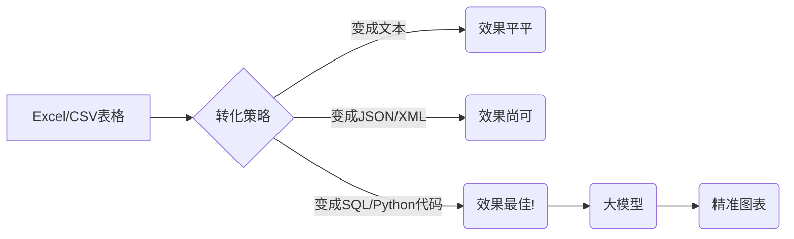
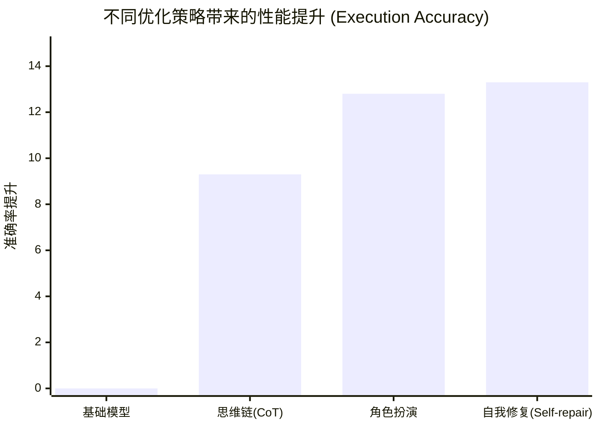

## AI论文解读 | Automated Data Visualization from Natural Language Via Large Language Models: An Exploratory Study
        
### 作者        
digoal        
        
### 日期        
2025-12-01        
        
### 标签        
PostgreSQL , PolarDB , DuckDB , AI , 论文解读        
        
----        
        
## 背景  
      
https://arxiv.org/pdf/2404.17136        
  
提示:          
```          
读懂《Automated Data Visualization from Natural Language Via Large Language Models: An Exploratory Study》这篇论文需要提前掌握哪些基础知识, 请使用中文通熟易懂的讲解这些基础知识, 可以引用论文中的图、表或使用Markdown支持的图形(text,mermaid等)增加解释性. 
  
使用中文通熟易懂的解读《Automated Data Visualization from Natural Language Via Large Language Models: An Exploratory Study》这篇论文, 其中的关键内容请着重讲解, 可以引用论文中的图、表或使用Markdown支持的图形(text,mermaid等)增加解释性. 
  
提取《Automated Data Visualization from Natural Language Via Large Language Models: An Exploratory Study》这篇论文中的重要术语, 使用中文对这些术语进行通熟易懂的讲解, 可以引用论文中的图、表或使用Markdown支持的图形(text,mermaid等)增加解释性. 
```     
  
## 1 前置知识 
  
要读懂这篇论文《Automated Data Visualization from Natural Language via Large Language Models: An Exploratory Study》（基于大语言模型的自然语言自动数据可视化：探索性研究），你需要掌握以下几个核心领域的**入门级知识**。

为了让你更轻松地理解，我将这些知识点拆解为通俗易懂的模块，并结合论文中的图表进行解释。

-----

### 1\. 核心任务：NL2Vis (自然语言生成可视化)

首先，你要明白这篇论文在解决什么问题。

  * **概念**： **NL2Vis (Natural Language to Visualization)** 是指让计算机理解人类的“大白话”（自然语言），然后自动画出对应的统计图表（如柱状图、饼图）。
  * **类比**：这就像你在公司里对数据分析实习生说：“帮我画个图，看看各部门去年的销售额对比。” 实习生（即模型）听懂后，在电脑上生成了一个柱状图。
  * **论文中的流程**：
    论文将这个过程比作一个“翻译”过程： **用户问题 + 表格数据 $\rightarrow$ 可视化查询语言 (VQL) $\rightarrow$ 渲染出图表** 。




-----

### 2\. 关键工具：大型语言模型 (LLMs) 与两种模式

论文主要研究如何用 **LLMs**（如 GPT-3.5, GPT-4）来做这件事。你需要理解 LLM 的两种主要使用方式：

#### A. 微调 (Fine-tuning)

  * **通俗解释**：这就像是“**考前突击补习**”。你拿着一堆特定的练习题（NL2Vis 的专用数据集），专门训练一个模型（比如 T5 模型），让它在这一科变得很强，但它可能因此变得不太“通才” 。

#### B. 提示工程 (Prompting / Inference-only)

  * **通俗解释**：这就像是“**开卷考试**”。你不需要重新训练模型，而是通过写一段很巧妙的**提示词 (Prompt)** ，告诉现成的聪明模型（如 ChatGPT）该怎么做。这是论文研究的重点 。

-----

### 3\. 核心技术：提示工程的三大法宝

为了让 LLM 听懂指令，论文用到了以下三个核心概念：

| 概念 | 英文 | 通俗解释 | 论文中的应用 |
| :--- | :--- | :--- | :--- |
| **零样本学习** | Zero-shot | 直接问，不给例子。“请把这句话变成代码。” | 基础测试  |
| **上下文学习** | **In-Context Learning (ICL)** | **给几个栗子**。在提问前，先给模型看几个“问题-答案”的范例，让它照猫画虎 。 | 论文发现给的例子越多，效果越好（见下图解释） |
| **思维链** | **Chain-of-Thought (CoT)** | **展示解题步骤**。不只给答案，还要写出中间的思考过程（如：“第一步先选列，第二步再过滤...”） 。 | 用来解决模型生成的错误，提升准确率  |

**图解 ICL (上下文学习) 原理** (参考论文 Figure 2 )：

   

**Prompt (提示词) 结构:**

1.  **任务说明**: "请根据表格和问题生成代码。"
2.  **范例 1 (Demonstration)** :
      * 表: 用户表
      * 问: "有多少用户?"
      * 答: `SELECT count(*) FROM users`
3.  **范例 2 (Demonstration)** : ...
4.  **真正的问题 (Test Item)** :
      * 表: 电视表
      * 问: "按语言统计频道数量，画个饼图。"
      * **模型需补全**: `[这里由模型生成]`

-----

### 4\. 数据处理难题：如何把“表格”喂给“文本模型”？

这是论文非常关键的一个研究点（RQ1）。

  * **问题**：LLM 本质上是处理**文本序列**的（像读文章一样），它看不懂 Excel 那样的二维网格结构 。
  * **解决方案 (表格序列化)** ：必须把表格转换成文本格式。论文尝试了多种方法，你需要理解这些格式的区别：

参考论文 Figure 4 ，主要有几种“喂养”方式：

   

1.  **Table2Text**: 用大白话描述。“这个表叫用户表，有姓名列和年龄列...” 。
2.  **Table Markup**: 用代码标记格式，如 JSON, XML, Markdown 。
3.  **Table Programming (论文推荐)** : 把表格写成 **SQL 创建语句 (Create Table)** 或 **Python 类 (Class)** 的代码形式。
      * *为什么有效？* 因为 LLM 读过很多代码，对代码结构非常敏感，能更好地理解表结构 。

-----

### 5\. 目标语言：VQL (可视化查询语言)

模型输出的不是一张图片（像素），而是一段**代码**。你需要了解论文中使用的中间语言 **VQL (Visualization Query Language)** 。

  * **它长什么样？** 它很像 SQL（数据库查询语言），但多了画图的指令。
  * **结构解析** (参考 Table 1 )：     

| 关键词 | 作用 | 例子 |
| :--- | :--- | :--- |
| **VISUALIZE** | 决定图表类型 | `VISUALIZE bar` (画柱状图) |
| **SELECT** | 选择X轴和Y轴的数据 | `SELECT name, COUNT(*)` (选名字和数量) |
| **FROM** | 选哪个表 | `FROM student` |
| **BIN** | 数据分桶（如按年份归类） | `BIN date BY year` |
| **GROUP BY** | 分组 | `GROUP BY name` |

**示例**：
用户说：“画个线图展示各年份的平均股价。”
模型生成的 VQL：
`VISUALIZE line SELECT date, AVG(share_count) FROM transactions BIN date BY year` 

-----

### 6\. 评估标准：怎么算“做对了”？

最后，你需要知道怎么评价模型好不好。论文用了两个指标 ：

1.  **Exact Accuracy (精准匹配率)** : 模型写的代码，和标准答案的代码**一模一样**才算对。这很严苛。
2.  **Execution Accuracy (执行准确率)** : 代码写法可能不一样，但只要**运行出来的图表数据是一样的**，就算对。这个更符合实际应用场景。

### 总结：读这篇论文的心理建设

当你阅读时，把自己想象成一个**老师**（用户），正在教一个**聪明的学生**（LLM）：

1.  你需要把教材（表格数据）转化成学生能读懂的文字（**数据序列化**）。
2.  你可以给学生看几道例题（**ICL**），或者教他一步步思考（**CoT**）。
3.  学生最后交上来的作业是一串代码（**VQL**），你需要检查这串代码能不能跑出正确的图（**Execution Accuracy**）。

掌握了以上背景，你就可以顺畅地阅读这篇论文的实验分析和结论了。
  
## 2 解读论文 
  
这是一篇非常有意思的“探索性研究”论文，全名为《Automated Data Visualization from Natural Language via Large Language Models: An Exploratory Study》（基于大语言模型的自然语言自动数据可视化：探索性研究）。

简单来说，这篇论文研究了一个核心问题： **我们能不能直接把 Excel 表格扔给像 GPT 这样的 AI，然后说一句“帮我画个图”，它就能自动生成准确的统计图表？**

为了回答这个问题，作者们像做实验一样，分三个步骤（即三个核心研究问题 RQ）进行了深入探索。下面我将用通俗易懂的语言为你解读这篇论文的精华。

-----

### 1\. 核心任务：NL2Vis 是什么？

在深入细节前，先理解任务背景。**NL2Vis (Natural Language to Visualization)** 就是把“人话”变成“图表”。

  * **输入**：一张数据表 + 一个自然语言问题（例如：“展示不同支付方式的用户数量”）。
  * **输出**：一段可视化的代码（VQL），这段代码可以被渲染成饼图、柱状图等 。

论文发现，以前的专用小模型（深度学习模型）一旦遇到没见过的表格（跨域场景）就容易“翻车”。而大语言模型（LLM）因为读过海量数据，可能更聪明 。

-----

### 2\. 第一关：怎么把“表格”喂给 AI？(RQ1)

这是论文最精彩的发现之一。LLM 本质上是读文本的，它看不懂 Excel 文件。如果不把表格处理好，AI 就理解不了数据结构。

论文尝试了四种“喂食”方法（Prompt Engineering）：

| 方法类型 | 具体做法 | 效果评价 |
| :--- | :--- | :--- |
| **A. 序列化 (Serialization)** | 把列名平铺成文本：“表名(列1, 列2...)” | 效果一般 |
| **B. 总结 (Summarization)** | 用 AI 先写一段话介绍这个表 | 效果一般 |
| **C. 标记格式 (Markup)** | 转成 XML, JSON, Markdown 等格式 | 还可以 |
| **D. 代码化 (Programming)** | **转成 SQL 建表语句或 Python 类代码** | **效果最好！** 🏆 |

**关键发现 ：**
最好的方法是把表格变成**代码**（比如 SQL 的 `CREATE TABLE` 语句或 Python 的 `Class` 定义）。

  * **为什么？** 因为 LLM 在训练时看过大量的代码，对代码结构非常敏感。把表格变成代码，就像是用 AI 最熟悉的母语跟它交流。
  * **细节**：只要告诉 AI **表头（Schema）** 就够了，不需要把表里的具体数据（行内容）都喂给它，因为数据太多 AI 也记不住，而且对画图逻辑影响不大 。




-----

### 3\. 第二关：LLM 到底强不强？(RQ2)

作者把 LLM（GPT-3.5, GPT-4, T5）和以前的专用模型（Seq2Vis, ncNet）拉出来跑了个分。

**主要结论：**

1.  **全面碾压**：LLM 的表现显著优于传统模型 。
2.  **陌生环境更强**：在“跨域设置”（Cross-domain，即测试没见过的数据库）下，传统模型正确率掉到了 26% 左右，而 **GPT-4 可以达到 61%** 的准确率 。这说明 LLM 的泛化能力极强，真正读懂了逻辑，而不是死记硬背。
3.  **“栗子”越多越好**：如果给 LLM 提供几个示例（Few-shot / In-Context Learning），它的表现会越来越好，甚至超过专门微调过的模型 。
      * *技巧*：找示例时，找不同领域的数据库作为示例，比找同领域的示例效果更好 。

-----

### 4\. 第三关：AI 画错了怎么办？(RQ3)

哪怕是 GPT-4 也会犯错。论文统计发现，**73.8% 的错误都是数据逻辑错误**（Data part），比如选错了列、过滤条件写错了；只有 26.2% 是图表类型选错了（比如该画柱状图画成了线图）。

**怎么救？论文提出了“迭代优化”策略 ：**

作者尝试了像教学生一样引导 AI 修改答案：

1.  **思维链 (CoT)** ：让 AI "Let's think step by step"（咱们一步步想），先写草稿再写代码。准确率提升了 **9.3%** 。
2.  **角色扮演 (Role-playing)** ：对 AI 说“你是一个数据可视化专家”。准确率提升了 **12.8%** 。
3.  **自我修复 (Self-repair)** ： **这是最强的！** 直接把生成的代码扔回给 AI，说“你可能错了，请修复它”。准确率提升了 **13.3%** 。

**图解优化策略效果：**



此外，作者还提到 **Code Interpreter**（代码解释器）非常有潜力，因为它能真的运行代码去验证数据，从而大幅减少错误 。

-----

### 5\. 总结与应用建议

这篇论文给我们的核心启示是：

1.  **用代码跟 AI 聊数据**：如果你想用 AI 处理表格，不要直接要把 Excel 里的字粘进去，试着把表头转成 `SQL CREATE` 语句发给它 。
2.  **多给示例**：在提示词（Prompt）里加几个“问题-SQL”的问答对，AI 会聪明很多 。
3.  **允许 AI 改错**：设计系统时，不要指望 AI 一次就对。给它一个“自我检查”的环节，让它自己 Review 一下代码，效果会好很多 。

这就好比带了一个实习生：给他看清楚**工作手册（代码格式的表结构）** ，给他几个**过往案例（Few-shot）** ，做完了让他**自己检查一遍（Self-repair）** ，他就能干出专家的水平！
  
## 3 术语 
  
这篇题为《Automated Data Visualization from Natural Language Via Large Language Models: An Exploratory Study》（通过大语言模型从自然语言自动生成数据可视化：一项探索性研究）的论文，探讨了如何利用大语言模型（LLMs）来完成从自然语言到数据可视化（NL2VIS）的任务。以下是论文中的重要术语及其通俗易懂的中文讲解。

-----

### 一、 核心任务与技术

#### 1\. NL2VIS (Natural Language to Visualization)

  * **中文全称：** 自然语言到可视化
  * **通俗讲解：** 简单来说，就是用户用日常语言（如：“给我用柱状图展示按部门划分的员工数量”）来描述自己想要的数据图表，系统就能自动生成对应的可视化图表。这项任务的目标是将基于表格数据的**自然语言描述**转化为**可视化表示**，使用户能从大量数据中获取洞察 。
  * **与NL2SQL的比较：** NL2VIS与将自然语言转化为SQL查询（NL2SQL）的任务相似 。但 NL2VIS 额外的挑战在于需要考虑复杂的**可视化属性**，例如选择合适的图表类型（如柱状图、饼图、折线图、散点图） 。

#### 2\. LLMs (Large Language Models)

  * **中文全称：** 大语言模型
  * **通俗讲解：** 指的是像 GPT-3.5、LLAMA 这样的大规模预训练模型 。论文研究了 LLMs 在数据可视化生成中的潜力，因为它们在代码生成和少样本学习等任务中表现出色 。
  * **在NL2VIS中的作用：** LLMs 的核心作用是接收经过文本序列化的表格数据和自然语言查询，然后输出 **可视化查询语言（VQL）** 形式的数据可视化代码 。

#### 3\. VQL (Visualization Query Language)

  * **中文全称：** 可视化查询语言
  * **通俗讲解：** 是一种用于表达可视化需求的结构化语言，类似于 SQL 。为了简化序列到序列模型的生成难度，VQL **移除了**像括号、逗号、引号等结构感知符号，将 JSON 对象转化为一系列关键词的序列 。
  * **VQL主要组成部分（基于Table 1）** ：     

| VQL 关键词 | 作用 | 示例功能 |
| :--- | :--- | :--- |
| **VISUALIZE** | 指定图表类型 | `bar` (柱状图)、`pie` (饼图)、`line` (折线图)、`scatter` (散点图)  |
| **SELECT** | 选择要显示的列 | 选定原始列或聚合后的值（如 `COUNT(Y)`、`AVG(Y)`）  |
| **FROM** | 指定数据源（表） | `FROM technician`  |
| **WHERE** | 过滤数据 | 设定条件进行数据筛选 (例如：`team != "NYY"`)  |
| **TRANSFORM** | 转换列数据 | 对数据进行分桶 (`BIN`) 或分组 (`GROUP`) 操作  |
| **ORDER BY** | 结果排序 | 按指定列和顺序排列结果 (例如：`ORDER BY name asc`)  |

-----

### 二、 LLMs 优化策略

#### 4\. ICL (In-Context Learning)

  * **中文全称：** 上下文学习
  * **通俗讲解：** 是一种特殊的提示学习方法。在向 LLM 提问时，不仅给出当前问题，还会在提示词（Prompt）中包含几个**示范示例**（Demonstration examples） 。模型通过观察这些示例及其对应的正确输出，来推断和学习任务模式，从而给出正确的预测 。
  * **示例结构（简化）：**
    ```markdown
    **任务指令：** 请根据表格描述和问题生成 VQL。
    **K个示范示例：**
    * 示例1 (表描述 + 问题) -> VQL
    * 示例2 (表描述 + 问题) -> VQL
    **测试项：**
    * 当前表描述 + 当前问题 -> [待生成的 VQL]
    ```

#### 5\. CoT (Chain-of-Thought) Prompting

  * **中文全称：** 思维链提示
  * **通俗讲解：** 是 ICL 的升级版。它在示范示例中不仅包含问题和答案，还加入了**中间推理步骤** 。这些推理步骤就像是“思考过程”，指导 LLM 一步步地得出最终答案，尤其擅长解决复杂的推理任务。在 NL2VIS 中，这些推理步骤可以包括 VQL 的**草图**或逻辑执行过程 。

#### 6\. 迭代优化策略 (Iterative Optimization Strategies)

  * **通俗讲解：** 由于 LLMs 偶尔会一次性生成错误的可视化查询 ，论文提出了通过**对话方式**迭代地改进结果的策略 。
  * **主要策略包括** ：
      * **Role-playing (角色扮演)：** 让模型扮演某个角色（例如“数据可视化专家”）来重新审视和修正结果。
      * **Self-repair (自我修复)：** 让模型分析自己第一次的失败输出，然后尝试进行自我修正。
      * **Code-interpreter (代码解释器)：** 利用内置的代码执行环境来运行生成的 VQL 或可视化代码，并根据执行结果或错误信息来进一步修正查询 。
  * **研究发现：** **自我修复**和 **Code-interpreter**（在 GPT-4 中）在更新失败结果方面表现优异 。

-----

### 三、 数据输入与基准

#### 7\. 表格表示策略 (Table Representation Strategies)

  * **通俗讲解：** LLMs 只能处理文本序列，因此必须将结构化的表格数据（如数据库中的表）转化为文本格式才能输入给模型 。
  * **论文探索的几种方式：** 表格序列化、表格摘要、表格标记格式（如 CSV、JSON、XML）和**表格编程** 。
  * **核心发现：**
    1.  将结构化表格数据转化为**程序（Programming）** （例如，使用类似 SQL `CREATE` 或 Python 类的形式来描述表格结构）是一种非常有效的方式 。
    2.  对于 NL2VIS 任务而言，**表格的 Schema（模式/结构）信息**是最关键的输入，而完整的表格内容（Table Content）反而不那么重要 。这一发现对于处理超大型数据库的输入长度限制非常重要 。

#### 8\. nvBench

  * **中文全称：** nvBench 基准数据集
  * **通俗讲解：** 是一个被广泛认可的、用于评估 NL2VIS 任务性能的基准数据集 。它是一个大规模的合成数据集，包含了来自 105 个不同领域、153 个数据库的 780 个关系表，以及 25,750 对自然语言描述和对应可视化结果的配对 。
  * **作用：** 论文使用该基准来全面评估 LLMs 的性能，包括**域内**（In-domain）和**跨域**（Cross-domain）设置下的表现 。
  
## 参考        
         
https://arxiv.org/pdf/2404.17136    
        
<b> 以上内容基于DeepSeek、Qwen、Gemini及诸多AI生成, 轻微人工调整, 感谢杭州深度求索人工智能、阿里云、Google等公司. </b>        
        
<b> AI 生成的内容请自行辨别正确性, 当然也多了些许踩坑的乐趣, 毕竟冒险是每个男人的天性.  </b>        
  
    
#### [PolarDB 学习图谱](https://www.aliyun.com/database/openpolardb/activity "8642f60e04ed0c814bf9cb9677976bd4")
  
  
#### [PostgreSQL 解决方案集合](../201706/20170601_02.md "40cff096e9ed7122c512b35d8561d9c8")
  
  
#### [德哥 / digoal's Github - 公益是一辈子的事.](https://github.com/digoal/blog/blob/master/README.md "22709685feb7cab07d30f30387f0a9ae")
  
  
#### [About 德哥](https://github.com/digoal/blog/blob/master/me/readme.md "a37735981e7704886ffd590565582dd0")
  
  

  
