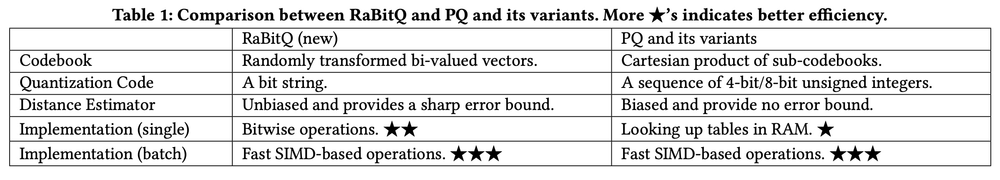
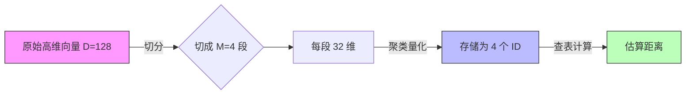
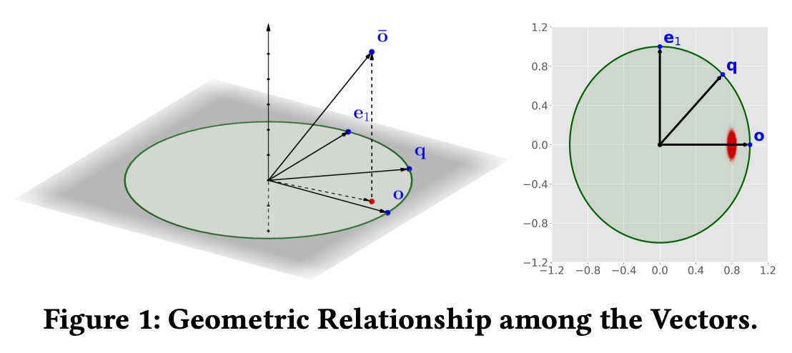
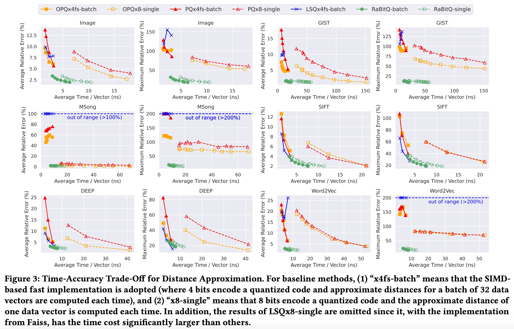
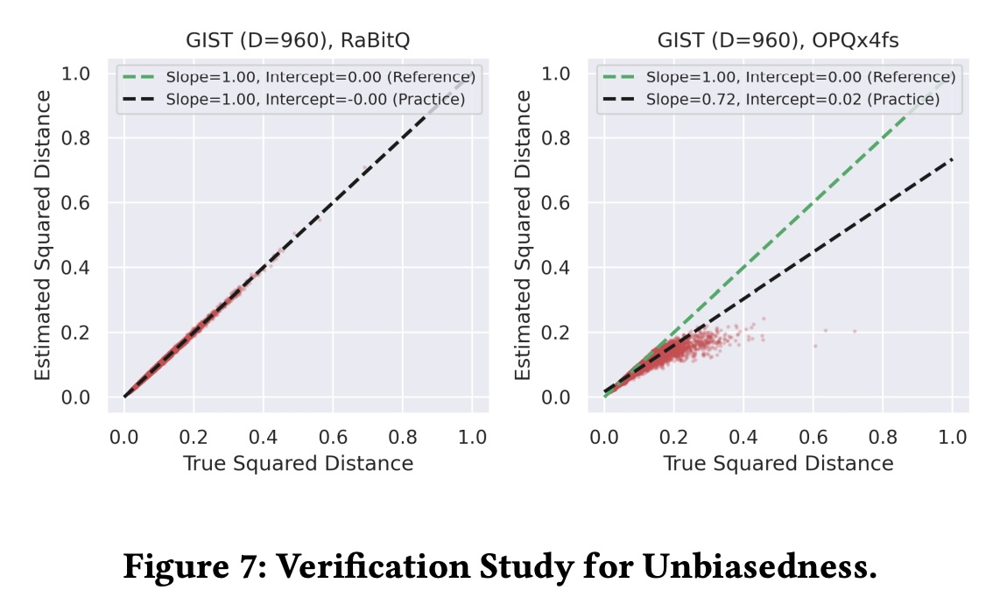

## AI论文解读 | RaBitQ: Quantizing High-Dimensional Vectors with A Theoretical Error Bound for Approximate Nearest Neighbor Search
        
### 作者        
digoal        
        
### 日期        
2025-12-01        
        
### 标签        
PostgreSQL , PolarDB , DuckDB , AI , 论文解读        
        
----        
        
## 背景  
      
https://arxiv.org/pdf/2405.12497        
  
提示:          
```          
读懂《RaBitQ: Quantizing High-Dimensional Vectors with A Theoretical Error Bound for Approximate Nearest Neighbor Search》这篇论文需要提前掌握哪些基础知识, 请使用中文通熟易懂的讲解这些基础知识, 可以引用论文中的图、表或使用Markdown支持的图形(text,mermaid等)增加解释性. 
  
使用中文通熟易懂的解读《RaBitQ: Quantizing High-Dimensional Vectors with A Theoretical Error Bound for Approximate Nearest Neighbor Search》这篇论文, 其中的关键内容请着重讲解, 可以引用论文中的图、表或使用Markdown支持的图形(text,mermaid等)增加解释性. 
  
提取《RaBitQ: Quantizing High-Dimensional Vectors with A Theoretical Error Bound for Approximate Nearest Neighbor Search》这篇论文中的重要术语, 使用中文对这些术语进行通熟易懂的讲解, 可以引用论文中的图、表或使用Markdown支持的图形(text,mermaid等)增加解释性. 
```     
  
## 1 前置知识 
  
要深入理解这篇名为《RaBitQ: Quantizing High-Dimensional Vectors with a Theoretical Error Bound for Approximate Nearest Neighbor Search》的论文，你需要掌握以下几个领域的背景知识。这篇论文的核心在于**用数学理论改进现有的向量搜索算法**，因此它的前置知识主要集中在“向量检索”和“概率统计”两方面。

为了让你更轻松地读懂，我将这些知识点拆解为五个部分，并结合论文内容进行通俗讲解。

-----

### 1\. 核心场景：近似最近邻搜索 (ANN Search)

**这是什么？**
在高维空间（比如 128维或更高）中，我们通常有一百万甚至十亿个数据向量（Data Vectors），当来了一个查询向量（Query Vector）时，我们需要找到和它最相似的那个向量。

  * **精确搜索 (Exact Search/KNN):** 暴力计算查询向量与库里所有向量的距离。这在数据量大时太慢了 。
  * **近似搜索 (ANN):** 允许牺牲一点点精度，换取极快的速度。比如“不一定要找到绝对最近的，找到前 100 个非常近的也可以”。

**论文中的关联：**
论文的目标就是提出一种新的 ANN 方法（RaBitQ），解决现有方法（如 PQ）虽然快但有时会“错得很离谱”的问题 。

-----

### 2\. 现有的“霸主”：乘积量化 (Product Quantization, PQ)

**这是什么？**
这是目前工业界（如 Faiss 库）最常用的压缩向量的方法。理解 PQ 是理解 RaBitQ 优势的前提。

  * **原理：** 把一个长向量切成很多小段（Sub-segments）。每一段单独做聚类（K-Means），然后用聚类中心的 ID 来代替原始的一段数据。
  * **后果：** 向量被压缩成了几个简短的 ID 编码（Code）。计算距离时，通过查表（Look-up Tables, LUT）来估算。

**论文为何提到它？**
论文将 RaBitQ 与 PQ 进行了全方位的对比。

  * **PQ 的缺点：** 它是启发式的（Heuristic），没有理论上的误差保证 ，计算出来的距离是“有偏”的（Biased）。
  * **对比图表：** 请看论文中的 **Table 1** ，RaBitQ 在“距离估计器”一栏标注为“无偏且有严格误差界”，而 PQ 是“有偏且无误差界”。

   



*(PQ 的基本流程，RaBitQ 试图用一种更数学化的方式替代这个流程)*

-----

### 3\. 几何基础：归一化与超球体 (Normalization & Hypersphere)

**这是什么？**
在高维几何中，处理任意分布的数据很难。一种常见的预处理手段是把所有向量的长度（Norm）都缩放为 1。

  * **归一化 (Normalization):** $o := \frac{o_r - c}{||o_r - c||}$ 。这把所有数据都投影到了一个单位超球体（Unit Hypersphere）的表面上 。
  * **内积与距离的关系：** 一旦向量归一化了，计算两个向量的欧氏距离（Squared Distance）就等价于计算它们的**内积**（Inner Product）。
      * 公式： $||o - q||^2 = 2 - 2\langle o, q \rangle$ 。因为 $||o||=1, ||q||=1$ 。

**论文中的关联：**
RaBitQ 的第一步就是把数据归一化 。论文后续所有的推导（比如 Figure 1），都是基于“单位向量”和“内积”来做的。     

> **图解引用 (Figure 1 左图 ):**
> 论文画了一个圆，o 和 q 都是从圆心出发的单位向量。这直观地展示了它们都在同一个球面上，RaBitQ 只需要估算它们夹角的余弦值（即内积）。

-----

### 4\. 核心魔法：随机投影与 Johnson-Lindenstrauss (JL) 变换

**这是什么？**
这是 RaBitQ 能够提供“理论误差界”的数学基石。

  * **JL 引理：** 只要把高维向量投影到一个维度较低的随机子空间，向量之间的距离大概率保持不变。
  * **随机正交矩阵 ( Random Orthogonal Matrix $P$ ):** 相当于在空间中随机旋转坐标系 。
      * 想象你手里拿个地球仪（超球体），随机转动一下。点之间的相对距离是不会变的。
  * **RaBitQ 的做法：** 它构造了一个特殊的“二值向量”集合（ 分量只有 $\pm 1/\sqrt{D}$ ），然后随机旋转这些向量来逼近原始数据 。

**论文中的关联：**
这是 RaBitQ 与 PQ 最大的不同。PQ 是基于数据训练出来的（K-Means），而 RaBitQ 是基于随机概率生成的。

  * **无偏估计 (Unbiased Estimator):** 意思是，虽然每次估算可能有误差，但只要尝试次数够多或者取期望，结果就是准确的真实值。论文证明了 RaBitQ 的估算是无偏的 ，而 PQ 是有偏的。

-----

### 5\. 计算机底层：位运算与 SIMD

**这是什么？**
为了让算法跑得快，必须利用 CPU 的硬件特性。

  * **Bitwise Operations (位运算):** RaBitQ 将向量量化为二进制串（Bit String，0和1）。
      * 计算两个二进制串的相似度（比如 Hamming Distance）可以用 `XOR` 和 `Popcount` 指令，这比浮点数乘法快得多。
  * **SIMD (单指令多数据流):** CPU 可以一条指令同时算 8 个或 16 个数的加法。
      * PQ 之所以现在很快，是因为有大神优化了它的 SIMD 实现（PQ Fast Scan）。RaBitQ 也可以利用这种优化 。

**论文中的关联：**

  * **Table 1 的对比:**    
      * RaBitQ 单个向量计算：用 **Bitwise operations** (快 ★★)。
      * PQ 单个向量计算：用 **Look-up tables** (慢 ★，因为要频繁读内存)。

### 总结：阅读路线建议

1.  **先看 Table 1 ：** 建立 RaBitQ 和 PQ 的对比印象。
2.  **理解 Figure 1 ：** 搞懂向量是如何被归一化到球面上，以及 $\bar{o}$ （量化后的向量）和 $o$ （原向量）的关系。     
3.  **跳过繁琐的数学证明：** 初读时，Section 3.2.2 中的定理证明可以先跳过，只需要接受结论： **RaBitQ 的误差是 $O(1/\sqrt{D})$** ，这是理论上的最优解。
4.  **关注实验 Figure 3 ：** 看左下角，理解为什么 RaBitQ 在“精度-速度”权衡上比 PQ 更好。     

掌握了以上 5 点，你就能流畅地阅读这篇 SIGMOD 顶会论文了。
  
## 2 解读论文 
  
这篇名为《RaBitQ: Quantizing High-Dimensional Vectors with a Theoretical Error Bound for Approximate Nearest Neighbor Search》的论文提出了一种新的**高维向量量化方法**。

为了让你快速理解，我们可以把这篇论文的核心故事概括为：“**现有的主流方法（PQ）虽然快但有时候很不靠谱，RaBitQ 用一种基于概率论的数学方法，既做到了更快，又保证了结果的可靠性。**”

以下是详细的通俗解读：

---

### 1. 背景：为什么需要 RaBitQ？

在高维空间（比如 128 维或更高）中找“最近邻居”（ANN Search）是一个经典难题，广泛用于推荐系统和图像搜索。
* **现有的霸主：** 乘积量化（Product Quantization, **PQ**）及其变体是目前最流行的方法。它们把长向量切碎、聚类，压缩成简短的代码。
* **存在的问题：** PQ 是“启发式”的（靠经验和试错），它**没有理论上的误差保证**。在某些数据集（如 Msong）上，PQ 的误差会非常大，导致搜索结果“灾难性”地失败 。

**RaBitQ 的目标：** 做一个既有**严格数学理论误差界限**（知道自己最多错多少），又在实际应用中**跑得飞快**的方法 。

---

### 2. 核心原理：RaBitQ 是怎么做的？

RaBitQ 的名字来源于 **Ra**ndomized **Bit** **Q**uantization（随机位量化）。它的处理流程非常巧妙，可以分为三步：

#### 第一步：归一化与随机旋转
RaBitQ 认为直接量化原始数据太难了。它首先把所有数据“归一化”到单位球面上，然后做一个**随机旋转**（类似于 Johnson-Lindenstrauss 变换）。
* **为什么旋转？** 就像把不规则的土豆削成正方体很难，但如果先把土豆旋转到一个合适的角度，再去套用一个标准的模具就容易多了。RaBitQ 通过随机旋转，消除数据在特定方向上的偏差 。

#### 第二步：二值化压缩 (Bi-valued Vectors)
旋转后，RaBitQ 强制把向量的每一维都变成只有两个值： $+1/\sqrt{D}$ 或 $-1/\sqrt{D}$ 。
* 这意味向量变成了一个**二进制字符串（Bit String）** ，只存 0 和 1 。
* **优势：** 相比于 PQ 需要存复杂的聚类中心 ID，RaBitQ 的存储极度紧凑。

#### 第三步：无偏距离估计 (Unbiased Estimator)
这是 RaBitQ 最厉害的地方。现有的 PQ 方法直接拿量化后的向量当原向量算距离，这是**有偏的**（Biased）。
RaBitQ 推导出了一个几何公式，通过量化向量 $\bar{o}$ 和查询向量 $q$ 来反推真实距离。

$$\text{估计值} = \frac{\langle \bar{o}, q \rangle}{\langle \bar{o}, o \rangle}$$

* 论文证明了这个估计器是**无偏的**（平均来看永远准确），并且误差被严格限制在 $O(1/\sqrt{D})$ 范围内 。

---

### 3. 图解核心优势

#### 对比一：机制与性能
论文在 **Table 1** 中清晰地对比了 RaBitQ 和 PQ：     

| 特性 | RaBitQ (新方法) | PQ 及其变体 (老方法) |
| :--- | :--- | :--- |
| **码本 (Codebook)** | 随机生成的二值向量，无需训练 | 基于 K-Means 聚类，训练耗时 |
| **距离估计** | **无偏**，有严格误差界限 | **有偏**，无误差界限 |
| **单个向量计算** | **位运算 (Bitwise)** ，速度极快 ★★ | 查表法 (Look-up tables)，较慢 ★ |
| **批量向量计算** | 支持 SIMD 加速 ★★★ | 支持 SIMD 加速 ★★★ |


#### 对比二：无偏性验证 (Figure 7 解读)
论文做了一个非常直观的实验来证明“无偏性”。
* **横轴：** 真实的距离。
* **纵轴：** 算法估算的距离。
* **理想情况：** 点应该落在对角虚线上（斜率为 1）。

   

> **论文图表解释：** 在 **Figure 7** 中，RaBitQ 的散点（左图）完美地沿着对角线分布，说明它是准确的；而 OPQ（PQ的一种变体，右图）的点明显偏离了对角线（斜率只有 0.72），说明它系统性地估算错了距离 。

---

### 4. 关键亮点：误差界限有什么用？

你可能会问：“我有理论误差界限（Error Bound）有什么实际用处？”
论文在 Section 4 中解释了这一点：它能极大地优化**重排序（Re-ranking）** 阶段。

* **传统做法 (PQ)：** 因为不知道误差多大，只能盲猜一个参数，比如“我就把前 1000 个最像的拿出来精排吧”。这很不稳定，有时取少了就漏掉了正确答案 。
* **RaBitQ 做法：** 因为有数学公式告诉你误差范围（Confidence Interval），你可以自信地说：“只要把距离在 X 范围内的向量拿出来，我有 99% 的把握正确答案一定在里面！” 。
    * **结果：** 不需要手动调参，就能在各种数据集上稳定工作。

---

### 5. 实验结果：真的更强吗？

论文在多个真实数据集（如 GIST, SIFT, Msong）上进行了测试。

1.  **精度更高：** 即便 RaBitQ 使用的编码长度只有 PQ 的**一半**（D bits vs 2D bits），它的精度依然比 PQ 高 。
2.  **速度更快：** 在处理单个数据向量时，RaBitQ 比 PQ 快 **3倍**，因为它只需要做简单的位运算（Bitwise operations），不需要像 PQ 那样频繁访问内存查表 。
3.  **更鲁棒：** 在 PQ 表现“灾难性”的 Msong 数据集上，RaBitQ 依然保持了高水准的召回率 。

### 总结
**RaBitQ** 是一个把“概率论几何”引入向量搜索的成功案例。它不再像 PQ 那样依赖“经验主义”的聚类，而是通过**随机旋转**和**位运算**，实现了一个**理论上可证明、计算上更高效、精度上更准确**的向量量化方案。

**下一步建议：**
如果你对具体的数学推导感兴趣，可以查看论文的 **Figure 1** 和 **Section 3.2**，那里展示了向量投影的几何关系 。如果关注工程落地，可以重点看 **Section 3.3** 关于位运算加速的实现 。

   
  
## 3 术语 
  
为了帮助你深入理解论文《RaBitQ: Quantizing High-Dimensional Vectors with a Theoretical Error Bound for Approximate Nearest Neighbor Search》，我提取了其中的核心术语，并按逻辑顺序分为“基础概念”、“RaBitQ 核心机制”和“性能与理论”三个部分进行通俗讲解。

-----

### 第一部分：基础概念 (The Problem & The Baseline)

#### 1\. 近似最近邻搜索 (Approximate Nearest Neighbor Search, ANN)

  * **通俗解释：** 在海量数据（如 10 亿张图片）中找最相似的那张图片太慢了。ANN 是一种“妥协”的搜索方式：不追求 100% 找到绝对最像的那个（精确最近邻），而是追求极快地找到“足够像”的一批数据 。
  * **论文中的地位：** 这是论文要解决的核心应用场景 。

#### 2\. 乘积量化 (Product Quantization, PQ)

  * **通俗解释：** 这是目前工业界最常用的“把长向量变短”的方法。
      * **原理：** 把一个长向量切成几段，每一段用一个简单的 ID 数字来代替。
      * **缺点：** 它是“经验主义”的（基于聚类），计算出来的距离往往是有偏差的（Biased），而且数学上无法保证误差范围 。
  * **论文中的地位：** 它是 RaBitQ 的主要对比对手（Baseline）。

#### 3\. 维度灾难 (Curse of Dimensionality)

  * **通俗解释：** 当数据的特征维度（比如 128 维、512 维）变得很高时，传统的搜索方法（如树结构）会失效，变得和暴力搜索一样慢 。这也是为什么需要量化（压缩）技术的原因。

-----

### 第二部分：RaBitQ 的核心机制 (How It Works)

#### 4\. 归一化 (Normalization)

  * **通俗解释：** RaBitQ 的第一步。为了方便处理，把所有数据的“长度”都缩放为 1。
      * **形象比喻：** 就像把散落在宇宙中的星星，全部投影到一个以地球为中心的巨大圆球表面（单位超球体 Unit Hypersphere）上 。
      * **作用：** 这样做之后，计算两个点的距离就简化成了计算它们的夹角（内积）。

#### 5\. 随机正交矩阵 ( Random Orthogonal Matrix, $P$ )

  * **通俗解释：** 这是一个旋转操作。RaBitQ 不直接处理原始数据，而是先拿着整个坐标系“随机转动”一下。
      * **目的：** 消除数据的特异性，让数据在球面上分布得更均匀，避免某些特殊角度的数据压缩后误差特别大。这也是 RaBitQ 名字中 "Ra" (Randomized) 的来源。

#### 6\. 二值向量 (Bi-valued Vectors)

  * **通俗解释：** 这是 RaBitQ 压缩后的数据形态。在这个向量里，每一个数字只能是两种固定值之一（ $+1/\sqrt{D}$ 或 $-1/\sqrt{D}$ ）。
      * **结果：** 既然只有两个值，我们就可以用计算机里的 **0** 和 **1** 来表示。原本需要 32 位浮点数存储的一个数字，现在只需要 **1 个比特 (Bit)** 。
  * **图示关系：**
    ```mermaid
    graph LR
        A[原始浮点数向量] -->|归一化 & 随机旋转| B[旋转后的向量]
        B -->|提取符号| C[二进制比特串 01011...]
        C -->|这就是 RaBitQ 的量化码| D[存储极小, 计算极快]
    ```

#### 7\. 随机位量化 (RaBitQ)

  * **通俗解释：** 论文提出的新方法全称。它结合了上述的“随机旋转”和“位量化”，把高维向量变成了 $D$-bit 的字符串 。

-----

### 第三部分：性能与理论 (Why It's Better)

#### 8\. 无偏估计器 (Unbiased Estimator)

  * **通俗解释：**
      * **有偏 (Biased, 如 PQ)：** 就像一把刻度尺，本身就是歪的。不管测多少次，平均值总是偏离真实长度。
      * **无偏 (Unbiased, 如 RaBitQ)：** 就像一把精准的尺子，虽然单次测量可能手抖有一点误差，但只要测量的次数多（或者从数学期望上看），它的平均值就是绝对准确的真实值 。
  * **论文图表证明 (Figure 7)：**
    论文中的图 7 展示了这一点：RaBitQ 的估计距离（红点）完美地沿着对角线分布（真实值=估计值），而 OPQ（蓝点）则明显偏离对角线 。     

#### 9\. 理论误差界 (Theoretical Error Bound)

  * **通俗解释：** 这是一个数学承诺。现有的方法（PQ）只能告诉你“大概挺准的”，但 RaBitQ 能用数学公式告诉你：“ 我有 99% 的把握，误差绝对不会超过 $X$ ” 。
      * **重要性：** 这让该算法在面对从未见过的新数据时，不会出现不可控的灾难性错误 。

#### 10\. 位运算 (Bitwise Operations)

  * **通俗解释：** 计算机最底层的运算方式。
      * 因为 RaBitQ 把向量变成了 0 和 1 的串，计算距离时不需要做复杂的乘法，只需要做“异或” (XOR) 和“数 1 的个数” (Popcount)。这在 CPU 上快得惊人 。
  * **对比：** 论文提到，RaBitQ 的单向量计算比 PQ 快 3 倍 。

#### 11\. 重排序 (Re-ranking)

  * **通俗解释：** ANN 搜索的最后一步。先用快速算法（RaBitQ）选出前 1000 个候选者，然后把这 1000 个的原始数据拿出来，精细地算一遍距离，排好序给用户。
  * **RaBitQ 的优势：** 因为有**理论误差界**，RaBitQ 可以自动决定“到底该选前多少个候选者”才能保证不错过正确答案，而不需要人工盲猜参数 。

#### 12\. SIMD (单指令多数据流)

  * **通俗解释：** 一种 CPU 加速技术，可以一次性处理多个数据。虽然 RaBitQ 可以用简单的位运算，但它同样支持这种高级的并行加速技术，使得批量处理速度和 PQ 一样快 。
  
## 参考        
         
https://arxiv.org/pdf/2405.12497    
        
<b> 以上内容基于DeepSeek、Qwen、Gemini及诸多AI生成, 轻微人工调整, 感谢杭州深度求索人工智能、阿里云、Google等公司. </b>        
        
<b> AI 生成的内容请自行辨别正确性, 当然也多了些许踩坑的乐趣, 毕竟冒险是每个男人的天性.  </b>        
  
    
#### [PolarDB 学习图谱](https://www.aliyun.com/database/openpolardb/activity "8642f60e04ed0c814bf9cb9677976bd4")
  
  
#### [PostgreSQL 解决方案集合](../201706/20170601_02.md "40cff096e9ed7122c512b35d8561d9c8")
  
  
#### [德哥 / digoal's Github - 公益是一辈子的事.](https://github.com/digoal/blog/blob/master/README.md "22709685feb7cab07d30f30387f0a9ae")
  
  
#### [About 德哥](https://github.com/digoal/blog/blob/master/me/readme.md "a37735981e7704886ffd590565582dd0")
  
  

  
