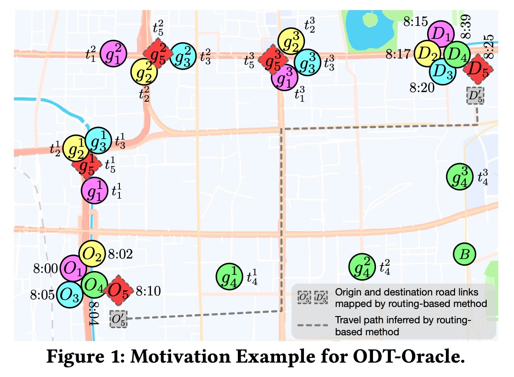
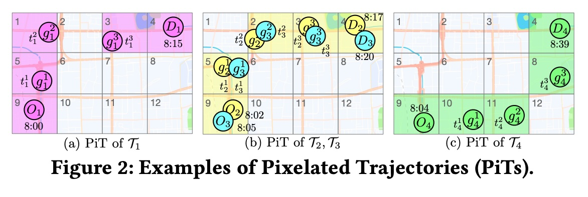
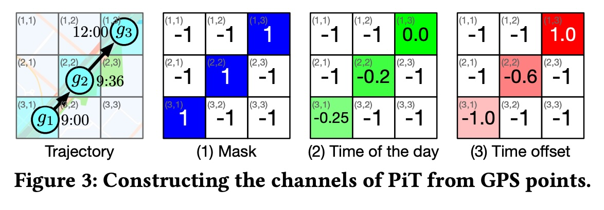
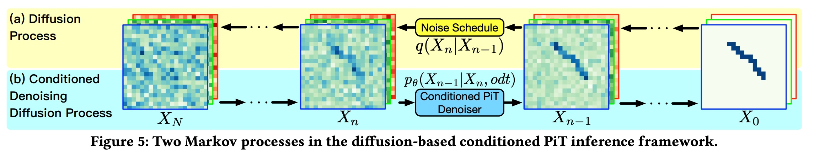
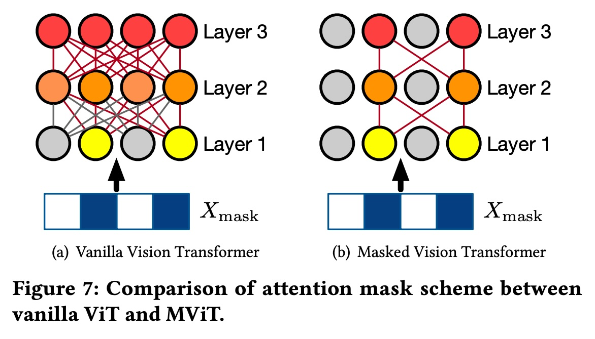

## AI论文解读 | Origin-Destination Travel Time Oracle for Map-based Services
        
### 作者        
digoal        
        
### 日期        
2025-12-01        
        
### 标签        
PostgreSQL , PolarDB , DuckDB , AI , 论文解读        
        
----        
        
## 背景  
      
https://arxiv.org/pdf/2307.03048   
  
提示:          
```          
读懂《Origin-Destination Travel Time Oracle for Map-based Services》这篇论文需要提前掌握哪些基础知识, 请使用中文通熟易懂的讲解这些基础知识, 可以引用论文中的图、表或使用Markdown支持的图形(text,mermaid等)增加解释性. 
  
使用中文通熟易懂的解读《Origin-Destination Travel Time Oracle for Map-based Services》这篇论文, 其中的关键内容请着重讲解, 可以引用论文中的图、表或使用Markdown支持的图形(text,mermaid等)增加解释性. 
  
提取《Origin-Destination Travel Time Oracle for Map-based Services》这篇论文中的重要术语, 使用中文对这些术语进行通熟易懂的讲解, 可以引用论文中的图、表或使用Markdown支持的图形(text,mermaid等)增加解释性. 
```     
  
## 1 前置知识 
  
要读懂这篇论文《Origin-Destination Travel Time Oracle for Map-based Services》（基于地图服务的起讫点通行时间预言机），你需要掌握几个核心领域的预备知识。这篇论文结合了**时空数据挖掘**、**计算机视觉（图像处理）** 和 **生成式AI（扩散模型）** 的技术。

为了让你更轻松地理解，我将这些基础知识拆解为四个通俗易懂的模块：

-----

### 1\. 基础场景：ODT-Oracle vs. 基于路径的估计

在深入算法之前，首先要明白“我们在解决什么问题”。

  * **传统路径估计 (Path-based TTE):** 就像你用导航软件，它先规划好一条具体的路线（Path），然后计算这条路线要多久。
  * **ODT-Oracle (本论文的场景):** 就像你打网约车（Uber/滴滴）在还没下单时的“预估一口价”场景。系统只知道你的**起点(Origin)** 、**终点(Destination)和出发时间(Time)** ，但并不知道司机实际会走哪条路。
  * **难点：** 同样的起点和终点，司机可能走不同的路（有的快，有的慢，有的绕路）。如果直接取平均值，容易被“绕远路”的异常数据（Outlier）误导 。

> **论文图解引用：**
> 参考论文中的 **Figure 1** ，即使起点（O）和终点（D）很接近，历史轨迹可能有 $T_1, T_2, T_3$ 这种正常路线，也可能有 $T_4$ 这种绕远路的“离群点”（Outlier）。如果不剔除 $T_4$ ，预测的时间就会虚高。

  

-----

### 2\. 数据表示：从“轨迹序列”到“像素化图像” (Pixelated Trajectory, PiT)

传统的轨迹是一串GPS坐标列表 $(x_1, y_1), (x_2, y_2)...$ 。但这篇论文把轨迹变成了一张“图”。

  * **网格化 (Grid/Pixelation):** 把地图切成这就好比把一张白纸打上格子女。
  * **图像化：** 如果车经过某个格子，就把那个格子涂黑（或者填入时间信息）。
  * **为什么这样做？** 计算机视觉（CV）技术处理“图片”非常厉害。变成图片后，AI更容易看清整体的**空间形状**，而不是纠结于具体的GPS坐标误差。

**通俗类比：**

  * **原始轨迹：** 像是“连点游戏”的一串数字。
  * **PiT (像素化轨迹)：** 像是你在方格纸上涂出来的“贪吃蛇”图案。

> **论文图解引用：**
> 参考 **Figure 2**  和 **Figure 3** 。图2展示了同样的轨迹如何被转化为像马赛克一样的图片。这使得 AI 可以用处理图片的方式（CNN, ViT）来处理交通数据。

  

  

-----

### 3\. 核心引擎：扩散模型 (Diffusion Models)

这是本论文最“硬核”的部分，也是近年AI绘画（如Midjourney, Stable Diffusion）的核心技术。

  * **基本原理：** 扩散模型包含两个过程——“加噪”和“去噪”。
      * **前向过程（加噪）：** 把一张清晰的轨迹图，一点点撒上沙子（噪声），直到变成全是沙子的一片混沌（高斯噪声）。
      * **反向过程（去噪/推理）：** AI 学习如何把沙子吹走，还原出原来的图形。
  * **在本论文中的作用：**
      * 传统的模型是直接“算”时间。
      * 这个模型是先“画”出一条最可能的轨迹图。给定起点O和终点D，AI 从一片混沌中“画”出一条合理的轨迹（PiT），这就自动过滤掉了那些奇怪的绕路轨迹（Outliers）。


**论文图解引用：**
参考 **Figure 5** 。    

  * **(a) Diffusion Process:** 向右走，把清晰轨迹变成噪声 $X_N$ 。
  * **(b) Denoising Process:** 向左走，从噪声 $X_N$ 逐步还原出轨迹 $X_0$ 。论文使用的是**条件扩散模型**，即在还原时告诉AI：“我要一张从O到D的图”，AI就会生成符合要求的轨迹。

-----

### 4\. 预测工具：Vision Transformer (ViT) 与 Masking

当你“画”出了轨迹图，最后一步是计算这张图代表多少时间。这里用到了 Transformer 技术。

  * **Transformer/Attention机制：** 也就是 ChatGPT 此时此刻在用的技术。它能关注到输入数据中最重要的部分。
  * **Vision Transformer (ViT)：** 把图片切成小块，像读文章一样读图片。
  * **Masked (掩码) 的意义：** 你的轨迹图（PiT）大部分是空白的背景（车没经过的地方），只有少部分是轨迹。如果AI去分析所有空白背景，非常浪费算力。
  * **Masked ViT (MVIT)：** 论文提出只让 AI 关注“有颜色”的格子，忽略背景。这大大加快了计算速度 。

**论文图解引用：**
参考 **Figure 7** 。    

  * **(a) Vanilla ViT:** 这种普通的ViT会计算所有格子之间的关系（红色线条连满所有点），计算量巨大。
  * **(b) Masked ViT:** 这里的ViT只计算有轨迹经过的格子（彩色球）之间的关系，灰色的背景球被忽略了。

-----

### 总结：阅读路径建议

如果你想顺畅地读懂这篇论文，建议按以下逻辑串联这些知识点：

1.  **目标：** 我们要预测打车时间，但不知道具体路线，且历史数据里有很多绕路的干扰项。
2.  **方法第一步（生成）：** 利用**扩散模型 (Diffusion Model)** ，根据起点终点，先“生成”一张最合理的**像素化轨迹图 (PiT)** 。这一步是为了以此排除干扰，模拟出正常的路线。
3.  **方法第二步（估算）：** 拿着这张生成的图，扔进一个**Masked ViT**模型中，让它只看有轨迹的部分，快速算出通行时间。

**下一步建议：**
如果你对其中某个具体数学原理（ 比如扩散模型的具体公式 $q(X_t|X_{t-1})$ ）感兴趣，或者想了解论文中提到的 U-Net 结构（用于去噪的神经网络），我可以为你详细拆解论文中的公式部分。请问需要这样做吗？
  
## 2 解读论文 
  
这篇文章《Origin-Destination Travel Time Oracle for Map-based Services》提出了一种名为 **DOT (Diffusion-based Origin-destination Travel Time Estimation)** 的新方法。

简单来说，它的目标是解决一个非常实用的问题： **在不知道具体行车路线的情况下，仅根据起点、终点和出发时间，精准预测“打车要多久”。**

为了让你轻松读懂，我将这篇论文的核心逻辑拆解为“一个痛点”和“三个大招”。

-----

### 1\. 核心痛点：由于“奇葩”路线导致的预测失准

在网约车或地图服务中，我们经常需要“预估一口价”或“预估时间”。此时系统只知道你的 **起点(O)、终点(D) 和 出发时间(T)** ，但并不知道司机实际上会走哪条路。

通常的做法是参考历史数据。但是历史数据里往往混杂着“噪音”。

**案例图解 (参考论文 Figure 1 )：**    
假设有从 $O$ 到 $D$ 的四次历史行程：

  * 行程 1、2、3：都走了正常路线，耗时约 15 分钟。
    * 行程 4 ( $T_4$ )：司机可能去加油或者买咖啡，绕了个大远路，经过了地点 B，耗时 35 分钟 。

  * **传统方法的笨办法：** 直接取平均值 $(15+15+15+35)/4 = 20$ 分钟 。
  * **结果：** 对大多数用户来说，预测结果偏高了（应该是15分钟才对）。
  * **论文的洞察：** 那个绕路的行程 4 是一个**离群点 (Outlier)** 。如果我们能像人一样，先在脑海里“脑补”出一条最合理的路线，把离群点剔除掉，预测就会准得多。

-----

### 2\. 解决方案：DOT 框架

论文提出了 **DOT** 框架，它模仿了人类的思维过程： **先“脑补”路线，再预估时间**。

这个过程分为两个阶段，如下图所示：


下面详细讲解其中的三个关键“大招”：

#### 大招一：把轨迹变成“马赛克图” (Pixelated Trajectory, PiT)

为了让 AI 更容易理解和处理，作者没有使用传统的 GPS 坐标列表，而是把轨迹变成了一张**像素图**。

  * **怎么变？** 把地图切成网格。如果车经过某个格子，那个格子就有颜色。
  * **包含什么信息？** 每个格子不仅记录“是否经过”，还记录了“什么时间经过” (Time of day) 和 “经过的顺序” (Time offset) 。

**图解 (参考论文 Figure 2 )：**    

  * 正常的轨迹（ $T_1, T_2, T_3$ ）生成的图片长得很像，都有一个特定的形状。
  * 异常的轨迹（ $T_4$ ）生成的图片形状完全不同。
    * **好处：** 这种图形化的方式，让 AI 一眼就能看出谁是合群的，谁是捣乱的（Outlier）。

#### 大招二：用“扩散模型”来画出路线 (Stage 1)

这是论文最核心的创新。既然我们不知道实际路线，那就让 AI **“画”** 一张出来。

作者使用了 **扩散模型 (Diffusion Model)** ，这和现在流行的 AI 绘画（如 Stable Diffusion）原理一样。

  * **原理：** 扩散模型擅长从一片模糊的噪声中，还原出清晰合理的图像。
  * **在论文中：** 给定起点、终点和时间作为条件，AI 从随机噪声开始，逐步“去噪”，最终生成一张最符合常理的 **PiT 轨迹图** 。
  * **为什么能抗干扰？** 因为扩散模型学习的是数据的**概率分布**。正常的路线出现概率高，绕路的路线出现概率低。所以在生成时，AI 会自动倾向于画出那条最“大众化”的路线，从而自然地过滤掉了那个绕路的 $T_4$ 。

#### 大招三：用“蒙面”视觉模型来算时间 (Stage 2)

现在我们有了一张“脑补”出来的轨迹图，下一步就是看着这张图算出时间。

作者使用了一种改进的 **Vision Transformer (ViT)** 技术，叫 **Masked ViT (MVIT)** 。

  * **普通 ViT 的问题：** 一张地图很大，但轨迹只占其中很小一部分（一条线）。如果 AI 去分析整张图所有的空白区域，非常浪费算力 。
  * **Masked ViT (MVIT)：** 给 AI 戴个“特制眼镜”，只盯着有轨迹经过的那些像素看（Masking），忽略空白背景。
  * **效果：** 这样不仅计算速度飞快，而且因为专注于有效信息，预测的时间也更准。

-----

### 3\. 实验结果与总结

论文在成都和哈尔滨的真实数据集上进行了测试，结果非常强劲：

1.  **更准：** 相比于之前的最优模型（DeepOD），DOT 的预测误差（MAE）显著降低。例如在成都数据集上，MAE 从 1.789 分钟降到了 **1.272 分钟** 。
2.  **抗干扰：** 即使历史数据里有很多噪音，DOT 依然稳如泰山，因为它生成的轨迹图自动过滤了杂音。
3.  **可解释性：** 以前的模型是个黑盒，直接吐出一个时间数字。DOT 模型不仅给你时间，还能通过中间生成的 PiT 图告诉你：“我是基于这条推测的路线算出来的”，让人更放心 。

**一句话总结：**
这篇论文通过把“算时间”的问题转化成“画路线”的问题，利用生成式 AI (扩散模型) 强大的去噪和生成能力，成功解决了网约车场景下因历史数据噪音导致预估时间不准的难题。
  
## 3 术语 
  
这篇论文《Origin-Destination Travel Time Oracle for Map-based Services》涉及了时空数据挖掘、计算机视觉和生成式AI的交叉领域。为了帮助你深入理解，我提取了文中的核心术语，并用通俗易懂的方式进行解读。

-----

### 1\. ODT-Oracle (起讫点通行时间预言机)

  * **原文定义：** 给定起点(O)、终点(D)和出发时间(T)，返回估计的通行时间 。
  * **通俗解读：**
    这就好比你在打车软件输入起点和终点准备叫车时，系统显示的“预估行驶时间”。
      * **关键点：** 此时系统只知道你要去哪（O和D）以及什么时候走（T），但**不知道**司机具体会走哪条路。
      * **难点：** 因为不知道具体路线，如果历史数据里有人绕路（比如去加油了），直接算平均时间就会不准。

### 2\. PiT (Pixelated Trajectory - 像素化轨迹)

  * **原文定义：** 将轨迹映射到网格上，形成一种类似图像的三维张量表示方式 。

  * **通俗解读：**
    传统的轨迹是一串长长的GPS坐标列表（数字）。**PiT** 是把地图切成很多小格子（像素），如果车经过某个格子，就把那个格子涂上颜色。
    这就像把“连点游戏”变成了“填色游戏”。这样做的好处是，可以让擅长处理图片的AI模型（比如CNN或Transformer）来处理轨迹数据。

    论文中，每个格子包含三个“颜色通道” ：

    1.  **Mask (掩码)：** 车有没有经过这里？（是/否）
    2.  **ToD (Time of Day)：** 经过这里是几点？（比如 8:00）
    3.  **Time Offset (时间偏移)：** 这是行程的第几步？（用来表示先后顺序）

    **图解（参考论文 Figure 3）：**    
    想象一个 $3 \times 3$ 的地图网格，轨迹穿过了其中几个格子：

    ```text
    [ ] [X] [ ]  <-- 车经过了中间
    [ ] [X] [X]  <-- 车经过了右下
    [X] [ ] [ ]  <-- 车从左下出发
    ```

    > 这种“图片化”的数据就是 PiT。

### 3\. DOT (Diffusion-based Origin-destination Travel Time Estimation)

  * **原文定义：** 论文提出的两阶段框架，包含“PiT推理”和“PiT通行时间估计” 。

  * **通俗解读：**
    这是作者提出的整个AI系统的名字。它的工作流程像是一个两步走的流水线：

      * **第一步（脑补路线）：** AI不知道司机走哪条路，所以它先用 **扩散模型** “画”出一条最可能的路线图（PiT）。
      * **第二步（计算时间）：** 拿着这张画好的路线图，交给另一个模型去算具体要多少分钟。

    

    ```mermaid
    graph LR
        User[用户输入: O, D, 时间T] --> Step1
        subgraph DOT框架
            Step1["第一阶段: PiT推理<br>(脑补画出路线图)"] --> Map[生成的PiT图像]
            Map --> Step2["第二阶段: MVIT估算<br>(看着图算时间)"]
        end
        Step2 --> Result[最终预测: 25分钟]
    ```

### 4\. Conditioned PiT Inference (条件化 PiT 推理)

  * **原文定义：** 基于ODT输入（条件），通过去噪扩散过程推断出PiT 。
  * **通俗解读：**
    这是 DOT 框架的第一步，利用了**扩散模型**（类似 AI 绘画的原理）。
      * **扩散过程：** 想象把一条清晰的路线图撒满沙子，直到完全看不清（变成噪声）。
      * **推理过程（去噪）：** AI 学习如何把沙子吹走，还原出路线。
      * **“条件化”的意思：** AI 不是瞎吹沙子，而是根据你给的“起点、终点、出发时间”作为指令（Condition），定向还原出符合这个行程的路线图。这样就能把那些乱绕路的“奇葩”轨迹过滤掉，只保留最合理的路线 。

### 5\. Outlier Trajectories (离群轨迹)

  * **原文定义：** 连接OD对但与其他轨迹差异巨大的历史轨迹，通常会导致预测不准 。
  * **通俗解读：**
    就是“捣乱”的数据。
      * **例子：** 大多数人从A到B都走直线，耗时15分钟。只有一辆车（Outlier）中间去绕路接了个人，耗时35分钟。
      * **论文的对策：** 如果直接取平均值，预测结果会变成20多分钟，不准。DOT模型通过“生成”最合理的路线图，自动就把这条绕路的轨迹给无视了 。

### 6\. MVIT (Masked Vision Transformer - 掩码视觉Transformer)

  * **原文定义：** 一种配备了高效自注意力掩码方案的视觉Transformer，用于从推断出的PiT中估计时间 。

  * **通俗解读：**
    这是 DOT 框架的第二步，负责“看图算时间”。

      * **背景：** 以前的视觉模型（ViT）会把整张图片每个像素都看一遍。但地图很大，轨迹只是一条细线，大部分区域是空白的。
      * **改进：** **MVIT** 给模型戴了一副“特制眼镜”，只盯着有轨迹（有颜色）的格子看，完全忽略空白背景。
      * **效果：** 这样计算量大大减少，速度飞快，而且算得更准 。

    **对比图解（参考论文 Figure 7）：**     

      * **普通 ViT (Figure 7a):** 所有格子（包括灰色的空白格）都要参与计算，连线密密麻麻，浪费资源。
      * **Masked ViT (Figure 7b):** 只有彩色格子（轨迹）参与计算，效率极高。

### 7\. ODT-Input (ODT输入)

  * **原文定义：** 一个包含三个元素的元组 $odt = (g_o, g_d, t_o)$ ，分别是起点坐标、终点坐标和出发时间 。
  * **通俗解读：**
    这就是用户给出的“考题”。
      * $g_o$ (Origin): 我在哪？
      * $g_d$ (Destination): 我要去哪？
      * $t_o$ (Time): 我几点出发？
        整个系统的目标就是根据这三个已知条件，解出未知的“通行时间” 。
  
## 参考        
         
https://arxiv.org/pdf/2307.03048    
        
<b> 以上内容基于DeepSeek、Qwen、Gemini及诸多AI生成, 轻微人工调整, 感谢杭州深度求索人工智能、阿里云、Google等公司. </b>        
        
<b> AI 生成的内容请自行辨别正确性, 当然也多了些许踩坑的乐趣, 毕竟冒险是每个男人的天性.  </b>        
  
    
#### [PolarDB 学习图谱](https://www.aliyun.com/database/openpolardb/activity "8642f60e04ed0c814bf9cb9677976bd4")
  
  
#### [PostgreSQL 解决方案集合](../201706/20170601_02.md "40cff096e9ed7122c512b35d8561d9c8")
  
  
#### [德哥 / digoal's Github - 公益是一辈子的事.](https://github.com/digoal/blog/blob/master/README.md "22709685feb7cab07d30f30387f0a9ae")
  
  
#### [About 德哥](https://github.com/digoal/blog/blob/master/me/readme.md "a37735981e7704886ffd590565582dd0")
  
  

  
