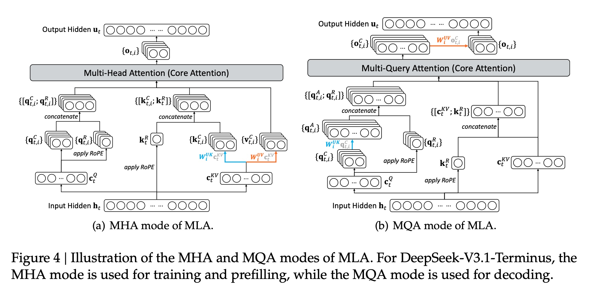
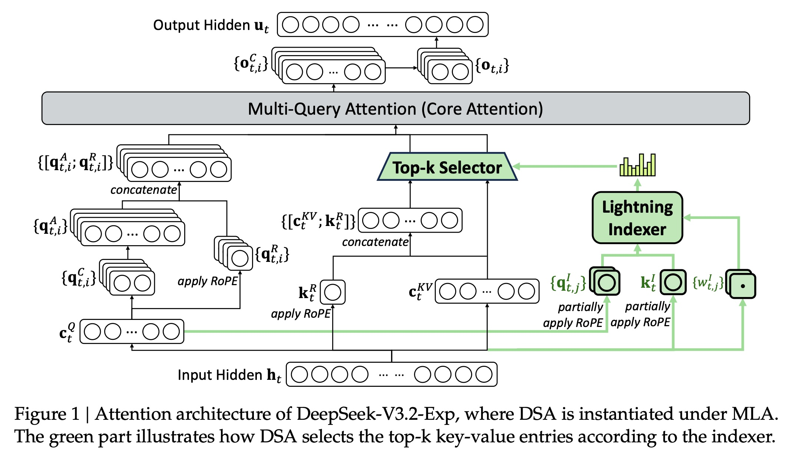
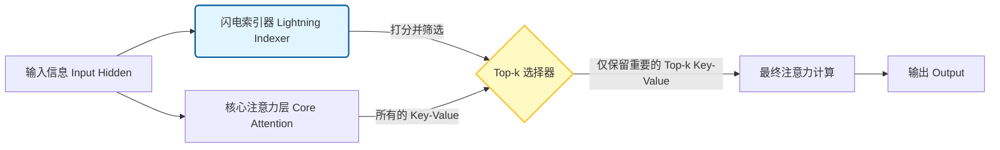
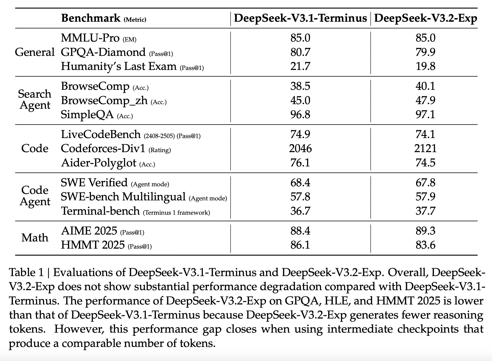
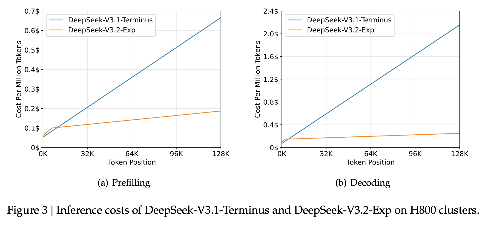
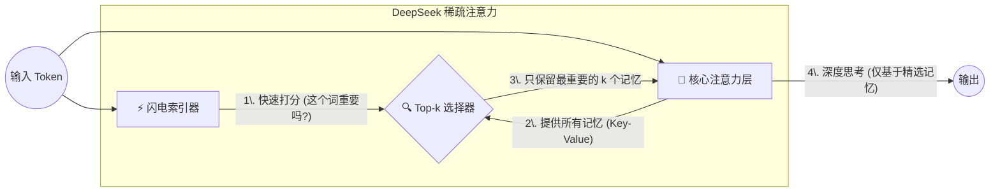

## AI论文解读 | DeepSeek-V3.2-Exp: Boosting Long-Context Efficiency with DeepSeek Sparse Attention
        
### 作者        
digoal        
        
### 日期        
2025-12-02        
        
### 标签        
PostgreSQL , PolarDB , DuckDB , AI , 论文解读        
        
----        
        
## 背景  
      
https://github.com/deepseek-ai/DeepSeek-V3.2-Exp/blob/main/DeepSeek_V3_2.pdf        
  
提示:          
```          
读懂《DeepSeek-V3.2-Exp: Boosting Long-Context Efficiency with DeepSeek Sparse Attention》这篇论文需要提前掌握哪些基础知识, 请使用中文通熟易懂的讲解这些基础知识, 可以引用论文中的图、表或使用Markdown支持的图形(text,mermaid等)增加解释性. 
  
使用中文通熟易懂的解读《DeepSeek-V3.2-Exp: Boosting Long-Context Efficiency with DeepSeek Sparse Attention》这篇论文, 其中的关键内容请着重讲解, 可以引用论文中的图、表或使用Markdown支持的图形(text,mermaid等)增加解释性. 
  
提取《DeepSeek-V3.2-Exp: Boosting Long-Context Efficiency with DeepSeek Sparse Attention》这篇论文中的重要术语, 使用中文对这些术语进行通熟易懂的讲解, 可以引用论文中的图、表或使用Markdown支持的图形(text,mermaid等)增加解释性. 
```     
  
## 1 前置知识 
  
了解《DeepSeek-V3.2-Exp: Boosting Long-Context Efficiency with DeepSeek Sparse Attention》这篇论文，您需要掌握以下几个关键的基础知识和概念，我将用通俗易懂的中文进行讲解：

## 📚 基础知识概述

这篇论文主要围绕**大型语言模型（LLM）** 、**注意力机制（Attention）** 、**稀疏注意力（Sparse Attention）** 以及 **模型训练（Training）** 展开。

---

### 1. 大型语言模型（LLM）基础

DeepSeek-V3.2-Exp 是一个基于 Transformer 架构的大型语言模型。

* **Transformer 架构**：这是现代 LLM 的基石。它主要由**编码器（Encoder）** 和**解码器（Decoder）** 组成，但大多数 LLM（包括 DeepSeek）只使用解码器部分。核心是**自注意力机制**和**前馈网络**。
* **上下文长度 (Context Length)** ：指模型在处理或生成文本时能同时“记住”的最大输入序列长度。这篇论文提到 DeepSeek-V3.1-Terminus 的上下文长度已扩展到 **128K**（128,000 个 token）。上下文越长，模型能处理的信息就越多。

---

### 2. 核心技术：自注意力机制 (Self-Attention Mechanism)

自注意力机制是 Transformer 的核心，它允许模型在处理一个 token 时，权衡序列中所有其他 token 的重要性。

* **注意力计算的复杂性**：在标准的自注意力机制中，每个 token 都需要关注（计算注意力得分）序列中的**所有**其他 token。如果序列长度为 $L$ ，计算复杂度是 $O(L^2)$ 。
    * **问题**：当上下文长度 $L$ 变得非常大（ 例如 $L=128K$ ）时， $O(L^2)$ 的复杂度会导致**计算成本极高**和**内存消耗巨大**，严重影响训练和推理效率。

---

### 3. 论文重点：稀疏注意力 (Sparse Attention)

稀疏注意力是解决 $O(L^2)$ 复杂度的关键技术，也是 DeepSeek-V3.2-Exp 的核心改进。

* **核心思想**：不是让每个 query token 关注**所有** key-value token，而是只关注**最重要**的 $k$ 个 token 。
    * $L$ 是总序列长度， $k$ 是选取的 token 数量，且 $k \ll L$ 。
* **效率提升**：通过稀疏化，主注意力机制的计算复杂度从 $O(L^2)$ 降到了 $O(Lk)$ 。
* **DeepSeek Sparse Attention (DSA)** ：DeepSeek 的稀疏注意力原型包含两个主要组件 ：
    1.  **Lightning Indexer (闪电索引器)** ：这是一个额外的、计算量很小的网络，用于计算每个 query token 和前面所有 key token 的“索引分数” $I_{t,s}$ 。
        * 虽然索引器本身的复杂度仍为 $O(L^2)$ ，但它的计算量**远小于**主注意力机制（因为它使用较少的索引头 $H^I$ 且可以实现 FP8 等低精度计算）。
    2.  **Fine-grained Token Selection (细粒度 token 选择机制)** ：根据索引器算出的分数 $\{I_{t,s}\}$ ，它只选择得分**最高的 $k$ 个** key-value 词条 $\{c_s\}$ 。
* **注意力计算公式（稀疏版）** ：
    $$u_{t}=Attn(h_{t},\{c_{s}|I_{t,s}\in Top-k(I_{t,\cdot})\})\text{ }$$
    其中 $u_t$ 是注意力输出， $h_t$ 是 query token，它只与得分在前 $k$ 的 key-value 词条 $\{c_s\}$ 进行注意力计算。

---

### 4. MLA/MQA 模式 (Multi-Query/Multi-Head Attention)

DeepSeek-V3.2-Exp 是在 **MLA (Multi-Layer Attention)** 基础上实现的，具体使用了 **MQA (Multi-Query Attention)** 模式 。

* **MHA (Multi-Head Attention)** ：标准模式，每个注意力头（Head）都有独立的 Key 和 Value 投影矩阵。
* **MQA (Multi-Query Attention)** ： **所有**注意力头**共享**一套 Key 和 Value 投影矩阵，可以显著减少推理时的内存占用和延迟 。
    * 在 DeepSeek-V3.2-Exp 中，MLA 的每个 Key-Value 词条会被**所有** Query 头共享 。图 4(b) 描绘了 MQA 模式 。  

---

### 5. 模型训练（Training）概念

DeepSeek-V3.2-Exp 是通过**持续训练 (Continued Training)** 和**后训练 (Post-Training)** 获得的 。

* **持续预训练 (Continued Pre-Training)** ：从 DeepSeek-V3.1-Terminus 的检查点开始，继续在数据上进行训练，并将 DSA 引入模型 。
    * **Dense Warm-up Stage（密集热身阶段）** ：首先使用**密集注意力**并**冻结所有模型参数**，只训练 **Lightning Indexer** 。目标是让索引器的输出分布（ $Softmax(I_{t, \cdot})$ ）对齐主注意力机制的得分分布 ( $p_{t, \cdot}$ )，使用 **KL 散度损失** $\mathcal{L}^I$ 进行训练 。
    * **Sparse Training Stage（稀疏训练阶段）** ：引入 **Top-k Token Selection** 机制，**优化所有模型参数**，使模型适应稀疏模式 。同时，索引器继续使用 KL 散度损失 $\mathcal{L}^I$ 训练（ 但只考虑选中的 token 集合 $S_t$ ），主模型则使用**语言模型损失**（Language Modeling Loss）进行优化 。
* **后训练 (Post-Training)** ：在持续预训练之后进行，旨在进一步提高模型在特定任务上的表现和对齐人类偏好 。
    * **专家模型蒸馏 (Specialist Distillation)** ：针对数学、编程、逻辑推理等领域开发专门的专家模型，然后用这些专家模型生成领域特定数据，用于最终检查点的训练 。
    * **混合强化学习 (Mixed RL Training)** ：采用 Group Relative Policy Optimization (GRPO) 算法，将推理、Agent 和人类对齐训练**合并为一个 RL 阶段**，以平衡不同领域的性能并避免灾难性遗忘 。

这些基础知识将帮助您理解 DeepSeek-V3.2-Exp 如何在保持与 DeepSeek-V3.1-Terminus 相当性能的同时，利用 DSA 在长上下文场景中实现显著的效率提升 。

您还想了解关于这篇论文的哪些具体信息或技术细节呢？
  
## 2 解读论文 
  
这篇论文《DeepSeek-V3.2-Exp: Boosting Long-Context Efficiency with DeepSeek Sparse Attention》介绍了 DeepSeek 团队为了解决 **长文本（Long-Context）** 处理效率问题而提出的一项新技术。

简单来说，他们把原来的旗舰模型 DeepSeek-V3.1-Terminus 进行了升级，加入了一种名为 **DSA (DeepSeek Sparse Attention)** 的稀疏注意力机制，从而诞生了 **DeepSeek-V3.2-Exp**。这个新模型在保持原有强大能力的同时，处理长文档的速度更快、成本更低。

下面我为您通俗易懂地解读其中的关键内容。

-----

### 1\. 核心痛点：长文本为何“贵”且“慢”？

在传统的模型中，当你要处理一篇 10 万字的长文时，模型每读一个字，都要回头去“关注”前面这 10 万个字里的每一个字。

  * **全注意力 (Dense Attention)** ：这种机制的计算量是平方级的 $O(L^2)$ 。如果你输入的文字长度翻倍，计算量会变成原来的 4 倍 。
  * **后果**：随着上下文越来越长（比如 DeepSeek 支持 128K），计算成本和内存消耗会爆炸式增长。

### 2\. 解决方案：DeepSeek 稀疏注意力 (DSA)

DeepSeek-V3.2-Exp 的核心魔法就是 **DSA**。它的思路是： **“不要盯着所有字看，只看重要的。”**

DSA 包含两个核心组件，就像给模型配了一个“图书管理员”：

1.  **闪电索引器 (Lightning Indexer)** ：
      * 这是一个轻量级的小神经网络。它的任务是快速扫描所有之前的 token（词），并计算出哪些 token 对当前正在处理的内容是重要的（打分）。
      * 虽然它也要扫描全文，但因为它的结构非常精简（头数少、可以用 FP8 低精度计算），所以速度极快 。
2.  **Top-k 选择器 (Top-k Selector)** ：
      * 根据索引器的打分，只选取得分最高的 $k$ 个内容（Key-Value）。
3.  **核心注意力计算**：
      * 模型最终只处理这 $k$ 个被选中的内容，而不是全部内容。这样计算复杂度就从 $O(L^2)$ 降到了 $O(Lk)$ 。

#### 🛠️ DSA 架构示意图 (基于论文 Figure 1)





*注：此流程简化自论文 [Figure 1] ，展示了 DSA 如何在 MLA（多头潜在注意力）架构下工作。*

-----

### 3\. 聪明的训练策略：如何教会模型“偷懒”？

直接把全注意力砍成稀疏注意力，模型可能会变笨。DeepSeek 采用了一种渐进式的训练方法 ：

#### 第一步：密集热身 (Dense Warm-up) —— "训练眼睛"

  * **做法**：冻结模型的主体参数，只训练“闪电索引器” 。
  * **目标**：让索引器去模仿原本“全注意力”的分布。也就是说，让索引器学会预测“如果我看完全文，我会觉得哪些部分最重要” 。
  * **比喻**：就像先不让图书管理员干活，让他先站在旁边看老专家是怎么查资料的，学会老专家的眼光。

#### 第二步：稀疏训练 (Sparse Training) —— "实战演练"

  * **做法**：解冻所有参数。模型开始真正使用 Top-k 选出来的稀疏数据进行计算 。
  * **目标**：让模型适应这种“只看重点”的工作模式，同时继续微调索引器，确保持续精准 。

#### 第三步：后训练 (Post-Training) —— "专家进修"

  * **做法**：使用强化学习（RL）和知识蒸馏。DeepSeek 采用了**混合 RL 训练**，将推理、Agent 和人类对齐合并在一个阶段，防止模型因为变“稀疏”了而忘记怎么做数学题或写代码 。

-----

### 4\. 效果如何？(基于论文评估)

论文通过对比 **DeepSeek-V3.1-Terminus** (原版) 和 **DeepSeek-V3.2-Exp** (新版) 给出了答案。

#### ✅ 能力没有明显下降 (Table 1)



从下表可以看出，V3.2-Exp 在各项任务上的得分与 V3.1 几乎持平，互有胜负 。

| 任务类型 | 评测集 (Benchmark) | DeepSeek-V3.1-Terminus | **DeepSeek-V3.2-Exp** |
| :--- | :--- | :--- | :--- |
| **通用能力** | MMLU-Pro | 85.0 | **85.0** |
| **搜索能力** | BrowseComp | 38.5 | **40.1** ⬆️ |
| **代码能力** | LiveCodeBench | 74.9 | **74.1** |
| **数学能力** | AIME 2025 | 88.4 | **89.3** ⬆️ |

*注：数据引用自 [Table 1] 。虽然部分推理任务（如 GPQA）略有下降，但作者指出这是因为 V3.2 生成的推理步骤较短，通过中间检查点对比差距会缩小 。*

#### ⚡️ 成本显著降低 (Figure 3)



这是这篇论文最大的亮点。随着文本长度的增加，DSA 的优势越来越大。

  * **预填充 (Prefilling)** ：处理超长提示词时，V3.2 的成本增长非常缓慢，而 V3.1 是直线飙升 。
  * **解码 (Decoding)** ：生成回复时，V3.2 的成本也远低于 V3.1 。

> **关键结论**：在 128K 长度的极端情况下，DeepSeek-V3.2-Exp 实现了极大的效率提升和成本节约，同时几乎没有牺牲模型的智能程度。

### 5\. 总结

**DeepSeek-V3.2-Exp** 是一次成功的实验。它证明了通过**稀疏注意力 (DSA)** 加上精妙的**训练策略（热身+稀疏训练+混合RL）** ，我们可以打破“长文本=高成本”的魔咒。

  * **对用户的好处**：未来处理长文档、长代码库分析、长对话时，响应速度会更快，价格可能会更便宜。
  * **下一步**：DeepSeek 团队表示虽然内部测试结果很好，但他们正在推进更大规模的真实场景测试，以验证这种“稀疏化”在现实世界中是否有局限性 。
  
## 3 术语 
  
这篇论文《DeepSeek-V3.2-Exp: Boosting Long-Context Efficiency with DeepSeek Sparse Attention》的核心在于通过一种新的注意力机制来提升大模型处理长文本的效率。

为了让你更轻松地理解其中的技术细节，我提取了论文中的**6个核心术语**，并用通俗易懂的语言配合图解进行解读。

-----

### 1\. 核心技术：DeepSeek Sparse Attention (DSA) / DeepSeek 稀疏注意力

  * **原文定义**：一种细粒度的稀疏注意力机制，通过“闪电索引器”驱动，旨在长上下文场景中显著提高训练和推理效率 。
  * **通俗解读**：
    传统的模型像是一个 **“强迫症阅读者”** ，每读一个新词，都要回头把之前读过的几万个词**全部**重新看一遍，这叫“全注意力”（Dense Attention），非常累且慢（ 复杂度 $O(L^2)$ ）。
    DSA 则是让模型变成 **“高效速读者”** 。它只挑选之前内容中 **最相关** 的那些词来回顾，忽略无关的信息。这样计算量大大减少（ 复杂度降为 $O(Lk)$ ），但理解能力不减 。

### 2\. 关键组件：Lightning Indexer / 闪电索引器

  * **原文定义**：DSA 的两个主要组件之一，用于计算查询 token 与前序 token 之间的索引分数 $I_{t,s}$ ，决定哪些 token 被选中 。
  * **通俗解读**：
    这是 DSA 的 **“快速扫描仪”** 或 **“图书管理员”** 。
    在模型真正进行深入思考之前，这个组件会先快速扫描一遍以前的内容，给每个词打分。由于它结构简单（头数少）且可以使用低精度计算（FP8），所以速度极快（闪电般的速度）。它负责告诉模型：“别全看，只看这几页！”

### 3\. 关键组件：Top-k Token Selection / Top-k 细粒度选择机制

  * **原文定义**：根据索引器算出的分数，只检索得分最高的 $k$ 个 Key-Value 条目进行后续计算 。
  * **通俗解读**：
    这是 **“过滤器”** 。
    如果“闪电索引器”是打分员，这个组件就是决策者。它直接把分数低的那些词（不重要的信息）扔掉，只保留分数最高的 $k$ 个（Top-k）。模型的主脑（Core Attention）最后只处理这筛选出来的 $k$ 个词 。

#### 🧩 图解：DSA 的工作流程 (基于论文 Figure 1)




*(参考来源: Figure 1 )*

-----

### 4\. 架构基础：MLA (MQA Mode) / 多头潜在注意力 (多查询模式)

  * **原文定义**：DeepSeek-V3.2-Exp 基于 MLA 架构实例化 DSA，具体采用了 MQA（Multi-Query Attention）模式，即每个潜在向量（Key-Value）被所有查询头共享 。
  * **通俗解读**：
    这是模型 **“存记忆”** 的方式。
    普通的模型（MHA）里，每个“思考单元”（Head）都有一本自己的笔记本，很占内存。
    **MLA 的 MQA 模式** 就像是让所有的“思考单元” **共享同一本笔记本**。这样不仅省内存，而且配合 DSA 筛选数据时，只需要筛选这一本共享笔记就行了，效率极高 。

### 5\. 训练策略：Dense Warm-up / 密集热身阶段

  * **原文定义**：持续预训练的第一阶段。保持密集注意力，冻结除索引器外的所有参数，通过 KL 散度损失将索引器的输出对齐到主注意力的分布 。
  * **通俗解读**：
    这是 **“学徒观察期”** 。
    刚开始训练时，不让模型真的去“跳读”（稀疏化），而是让它照常全读。此时，专门训练那个“闪电索引器”（学徒），让它去模仿全读时的注意力分布。目标是让索引器学会：“如果我看完全文，哪些词是真的重要的？” 。

### 6\. 训练策略：Sparse Training / 稀疏训练阶段

  * **原文定义**：引入细粒度 token 选择机制，优化所有模型参数以适应稀疏模式。索引器输入与计算图分离，仅通过 KL 损失优化 。
  * **通俗解读**：
    这是 **“实战演练期”** 。
    索引器（学徒）出师了，开始真正地进行筛选（Top-k）。此时解冻整个模型，让大脑适应“只看筛选后的信息”这种工作方式。有趣的是，索引器依然独立优化，只负责“选得准”，而模型大脑负责“理解好” 。

#### 📉 图解：从 V3.1 到 V3.2 的进化之路

| 阶段 | 核心动作 | 目的 |
| :--- | :--- | :--- |
| **0. 起点** | **DeepSeek-V3.1-Terminus** | 基础模型，拥有 128K 上下文能力，但计算是全注意力的（慢）。 |
| **1. 热身** | **Dense Warm-up** | 训练“索引器”学会识别重要信息，但暂时不开启筛选 。 |
| **2. 进化** | **Sparse Training** | 正式开启 DSA（筛选+稀疏计算），让模型适应高效模式 。 |
| **3. 最终** | **DeepSeek-V3.2-Exp** | 经过后训练（RL），获得长文本处理效率极高的新模型 。 |

-----

### 总结

这篇论文的精髓在于： **DeepSeek-V3.2-Exp** 并没有改变模型“懂什么”（知识量），而是通过 **DSA（稀疏注意力）** 彻底改变了模型“怎么看”（处理方式）。它从“逐字精读”进化为“智能速读”，从而在处理长达 128K 的内容时，实现了巨大的成本节约和速度提升。
  
## 参考        
         
https://github.com/deepseek-ai/DeepSeek-V3.2-Exp/blob/main/DeepSeek_V3_2.pdf    
        
<b> 以上内容基于DeepSeek、Qwen、Gemini及诸多AI生成, 轻微人工调整, 感谢杭州深度求索人工智能、阿里云、Google等公司. </b>        
        
<b> AI 生成的内容请自行辨别正确性, 当然也多了些许踩坑的乐趣, 毕竟冒险是每个男人的天性.  </b>        
  
    
#### [PolarDB 学习图谱](https://www.aliyun.com/database/openpolardb/activity "8642f60e04ed0c814bf9cb9677976bd4")
  
  
#### [PostgreSQL 解决方案集合](../201706/20170601_02.md "40cff096e9ed7122c512b35d8561d9c8")
  
  
#### [德哥 / digoal's Github - 公益是一辈子的事.](https://github.com/digoal/blog/blob/master/README.md "22709685feb7cab07d30f30387f0a9ae")
  
  
#### [About 德哥](https://github.com/digoal/blog/blob/master/me/readme.md "a37735981e7704886ffd590565582dd0")
  
  

  
