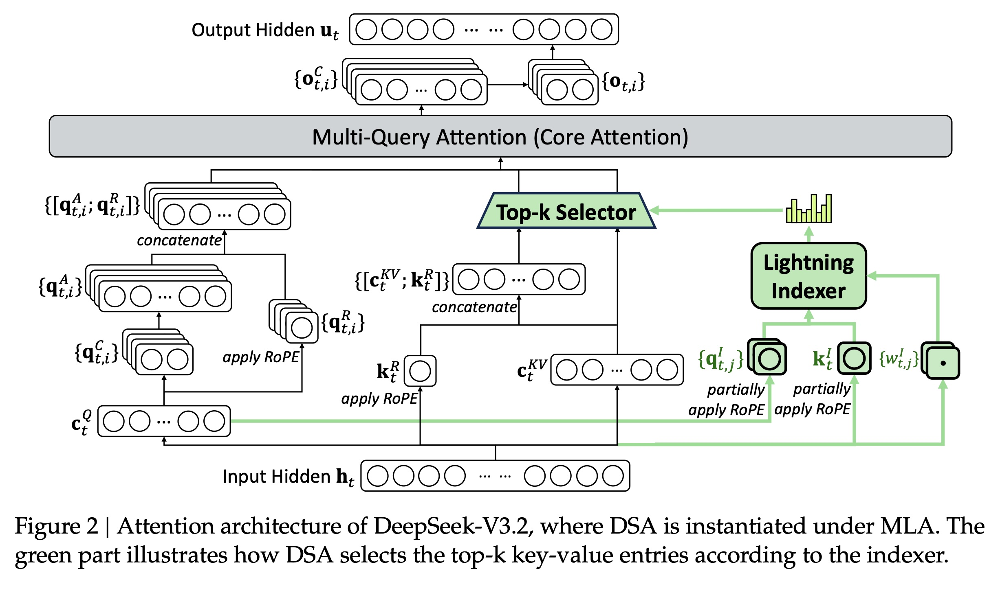
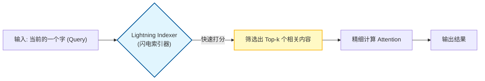
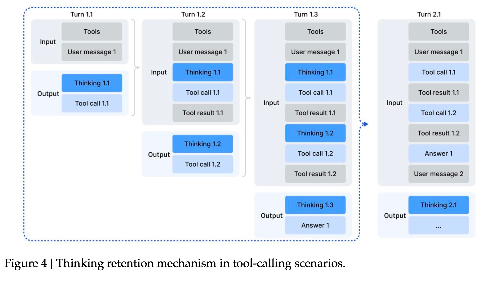
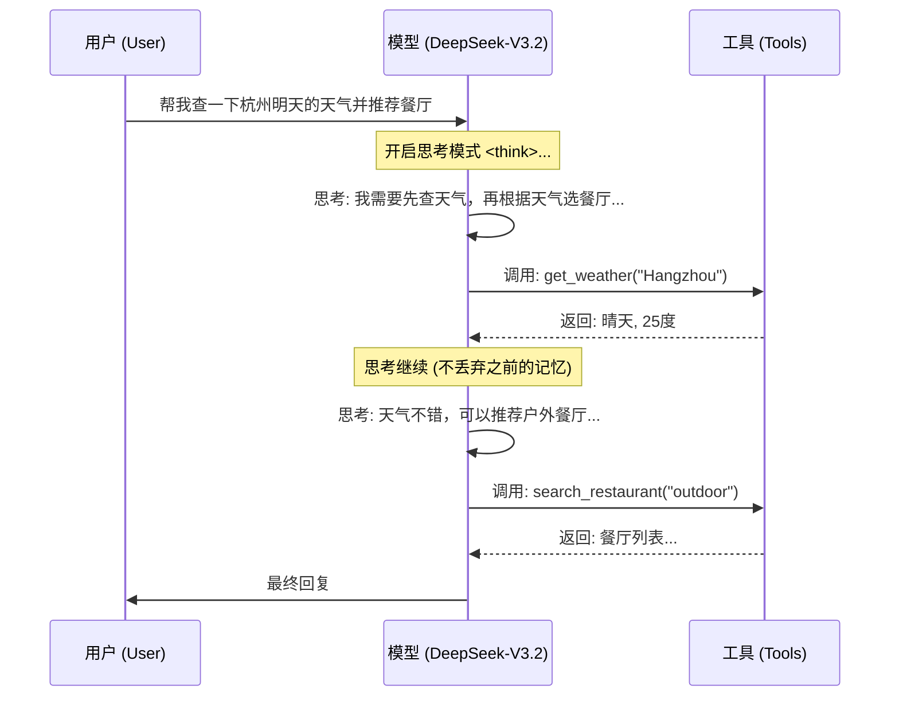
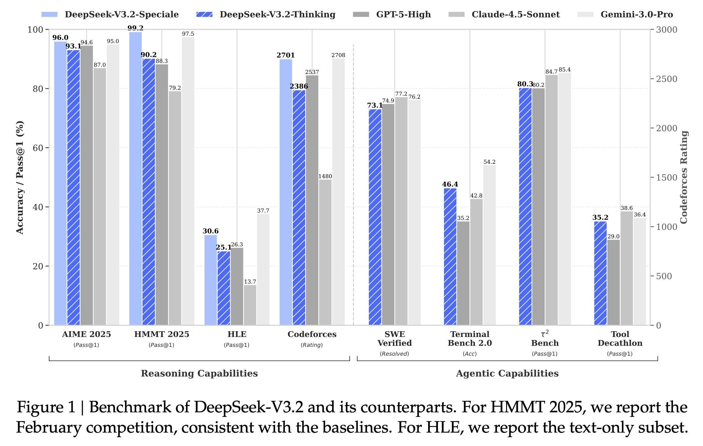
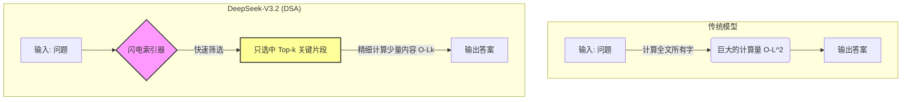
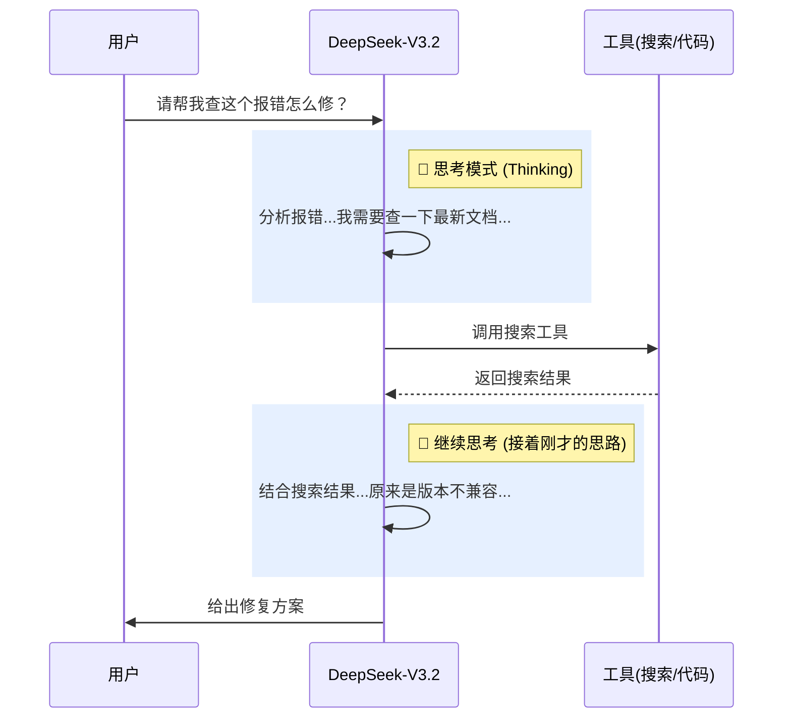
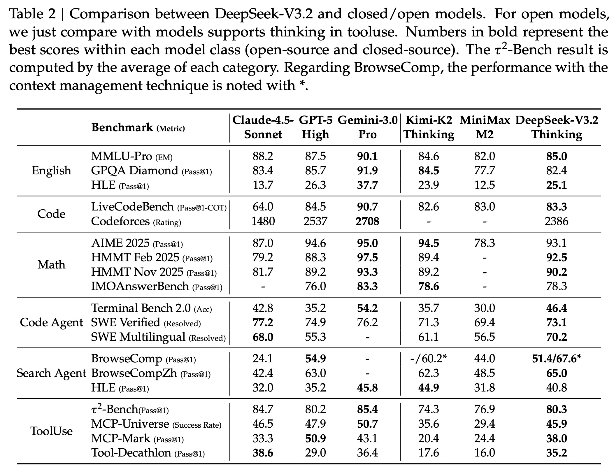
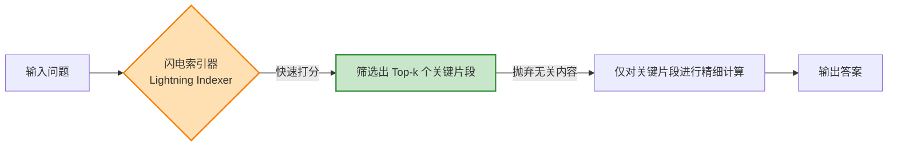
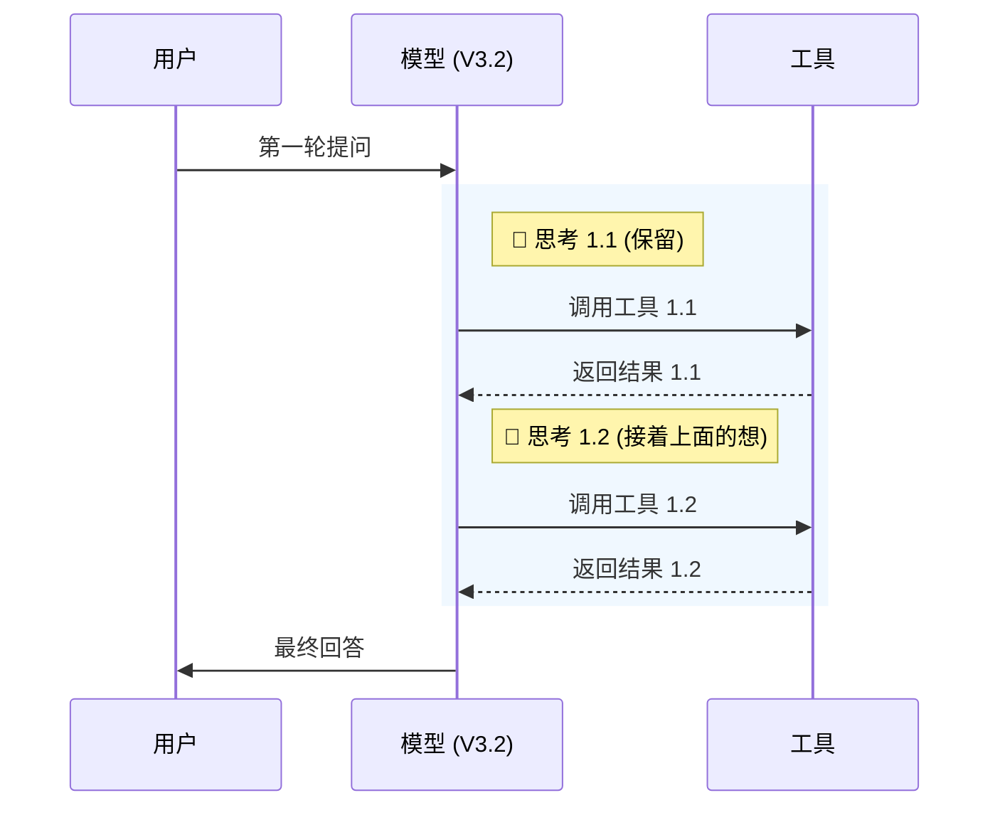

## AI论文解读 | DeepSeek-V3.2: Pushing the Frontier of Open Large Language Models
        
### 作者        
digoal        
        
### 日期        
2025-12-02        
        
### 标签        
PostgreSQL , PolarDB , DuckDB , AI , 论文解读        
        
----        
        
## 背景  
      
https://huggingface.co/deepseek-ai/DeepSeek-V3.2/blob/main/assets/paper.pdf        
  
提示:          
```          
读懂《DeepSeek-V3.2: Pushing the Frontier of Open Large Language Models》这篇论文需要提前掌握哪些基础知识, 请使用中文通熟易懂的讲解这些基础知识, 可以引用论文中的图、表或使用Markdown支持的图形(text,mermaid等)增加解释性. 
  
使用中文通熟易懂的解读《DeepSeek-V3.2: Pushing the Frontier of Open Large Language Models》这篇论文, 其中的关键内容请着重讲解, 可以引用论文中的图、表或使用Markdown支持的图形(text,mermaid等)增加解释性. 
  
提取《DeepSeek-V3.2: Pushing the Frontier of Open Large Language Models》这篇论文中的重要术语, 使用中文对这些术语进行通熟易懂的讲解, 可以引用论文中的图、表或使用Markdown支持的图形(text,mermaid等)增加解释性. 
```     
  
## 1 前置知识 
  
阅读这就好比在看一部高科技电影的续集，如果没看过前作或者不懂设定，可能会觉得云里雾里。要读懂《DeepSeek-V3.2》这篇论文，你需要掌握三大块核心基础知识： **大模型架构与效率（Attention机制）、强化学习（RL）进阶、以及智能体（Agent）的工作流**。

我将用通俗易懂的语言为你拆解这些概念，并结合论文中的核心图表来辅助理解。

-----

### 第一块基石：模型如何“阅读”与“提速” (Attention & Efficiency)

这篇论文在架构上最大的改进是引入了 **DeepSeek Sparse Attention (DSA)** 。要理解它，你需要先懂“注意力机制”和“长文本挑战”。

#### 1\. 标准注意力机制 (Attention) vs. 稀疏注意力 (Sparse Attention)

  * **基础概念**：想象你在读一本几百页的书（长文本）。
      * **标准注意力（Vanilla Attention）** ：就像你为了回答一个问题，必须把书里**每一个字**都重新读一遍，并计算它们之间的关联。这非常精准，但随着书越厚（Context越长），计算量呈指数级爆炸（ $O(L^2)$ ）。
      * **稀疏注意力（Sparse Attention）** ：这是DeepSeek-V3.2的核心武器。它像是有了一个“超级目录”或“速读助手”。它不读全文，而是先快速扫描，只挑选出和当前问题**最相关**的几页内容进行精读 。

#### 2\. 论文中的 DSA 是如何工作的？

论文中的 **Figure 2** 展示了这个过程。我们可以用一个简单的流程图来解释它：    



  * **Lightning Indexer (闪电索引器)** ：这是论文提出的新组件 。它极其轻量，作用就是快速判断“哪些内容值得读”。
  * **核心价值**：这种机制让模型在处理长达 128K Token（约十几万字）的文本时，计算成本大幅降低，从 $O(L^2)$ 降到了 $O(Lk)$ （k是选中的少量内容）。

-----

### 第二块基石：如何教模型“思考” (Post-Training & RL)

DeepSeek-V3.2 之所以强，很大程度上归功于它的 **后训练 (Post-Training)** 阶段，特别是**强化学习 (RL)** 。

#### 1\. 强化学习 (RL) 与 GRPO 算法

  * **基础概念**：
      * **RLHF (人类反馈强化学习)** ：传统的做法是，模型写好回答，人类打分，模型根据分数调整。
      * **GRPO (Group Relative Policy Optimization)** ：这是DeepSeek自家的绝活 。它不需要这就好比老师（Reward Model）不给每个学生打绝对分数，而是让一组学生（Group）回答同一个问题，然后**把他们互相比对**，谁答得好谁就获得奖励，谁答得差就受惩罚。
  * **论文中的升级**：V3.2 扩大了 RL 的规模，让 RL 的计算量占到了整个训练成本的 10% 以上 。这意味着模型花了更多时间在“自我反思”和“刷题”上，而不仅仅是死记硬背。

#### 2\. 思维链 (Chain-of-Thought, CoT)

  * **基础概念**：让模型在给出答案前，先写出推理步骤（即 `<think>` 标签里的内容）。
  * **论文中的应用**：DeepSeek-V3.2 不仅在做数学题时思考，甚至在 **调用工具（查网页、写代码）** 时也在思考 。这就引出了下一个知识点。

-----

### 第三块基石：智能体与工具使用 (Agents & Tool Use)

这篇论文花了大量篇幅讲 **Agentic Capabilities**（智能体能力）。你需要理解模型是如何变成“代理人”的。

#### 1\. 工具调用 (Tool Calling)

  * **基础概念**：模型本身无法联网或运行代码。工具调用就是模型输出一个特定的指令（比如 `Call: Search("DeepSeek V3.2")`），然后由外部程序执行并把结果返回给模型。
  * **论文痛点**：以前的模型（如 DeepSeek-R1）在思考和行动之间容易断片。要么思考完忘了用工具，要么用了工具忘了之前的思考 。

#### 2\. 思考与行动的融合 (Thinking in Tool-Use)

DeepSeek-V3.2 提出了一种新的**上下文管理机制**，确保“思考”贯穿始终。让我们看论文 **Figure 4** 的逻辑，我将其转化为更直观的时序图：  



  * **关键点**：注意上面的流程中，**红色的“思考”部分并没有被丢弃**。论文特意提到，只有当新的用户消息进来时，旧的思考过程才会被折叠，但工具调用的结果会被保留 。这解决了“用一次工具就变笨”的问题。

-----

### 第四块基石：评估标准 (Benchmarks)

最后，读懂论文的“战报”部分，你需要了解几个名词：

1.  **Pass@1**：模型回答一次就正确的概率。数值越高越好 。
2.  **Codeforces Rating**：人类编程竞赛的积分系统。DeepSeek-V3.2 达到了 2386 分，这在人类选手中也是顶尖水平（橙名/红名大佬级别）。
3.  **AIME / IMO**：国际数学竞赛。论文提到的 **DeepSeek-V3.2-Speciale** 版本甚至拿到了金牌水平 ，这意味着它在数学推理上超越了绝大多数人类。

-----

### 总结与下一步

**一句话总结这篇论文的核心：**
DeepSeek-V3.2 通过**DSA（稀疏注意力）解决了长文本变慢变贵的问题，通过大规模强化学习（GRPO）让模型更聪明，最后通过合成数据和工作流优化**，让模型不仅会做题，还会像人一样一边思考一边使用工具解决复杂任务。

**如果您准备好开始阅读了，我建议您先看：**

  * **Figure 1** ：通过柱状图直观感受它在数学（AIME）和代码（Codeforces）上对标 GPT-5 和 Gemini-3.0 的表现。   
  * **Section 2.1** ：如果您对技术细节感兴趣，重点看 DSA 是如何通过“Lightning Indexer”选词的。

**您希望我为您详细解读论文中的某个具体章节（例如那个神秘的“DSA注意力机制”或者是“合成数据流水线”）吗？**
  
## 2 解读论文 
  
这也是一篇非常有分量的技术报告。简单来说，**DeepSeek-V3.2 是为了打破“开源模型不如闭源模型（如 GPT-5, Gemini-3.0）”这一局面而诞生的** 。

为了让你轻松读懂，我将这篇论文的核心突破归纳为三大“法宝”： **极速阅读能力（DSA）、超强解题大脑（Speciale模式）、以及会思考的打工人（Agent能力）** 。

以下是详细的通俗解读：

-----

### 法宝一：DSA —— 从“死记硬背”到“量子速读”

在过去，大模型处理长文本（比如读一本长篇小说）非常吃力，因为它会把每一个字和其它所有字都进行对比计算（这叫全注意力机制），计算量是指数级爆炸的 。

**DeepSeek-V3.2 发明了 DeepSeek Sparse Attention (DSA，稀疏注意力机制)** 。

  * **原理**：它不再傻乎乎地读所有内容，而是引入了一个极其轻量的“ **闪电索引器 (Lightning Indexer)** ” 。每当模型想回答问题时，索引器会先快速扫描，只挑出最关键的几段内容（Top-k），然后只对这几段内容进行精细计算 。
  * **效果**：计算复杂度从 $O(L^2)$ 骤降到 $O(Lk)$ （k是选中的少量内容）。这意味着处理长文本更快、更省钱。

我用一个图来展示这个变化：



-----

### 法宝二：强化学习 (RL) —— 题海战术与“特种兵”

DeepSeek 发现开源模型之所以在复杂任务上落后，是因为**后训练（Post-Training）阶段做的题不够多、不够难** 。于是他们在 V3.2 上下了血本：

1.  **加大训练量**：RL 阶段的计算成本占比超过了预训练成本的 10% 。这就像学生上完课（预训练）后，花了比以前多得多的时间做模拟题（RL）。
2.  **推出 Speciale 版本**：论文重点介绍了一个名为 **DeepSeek-V3.2-Speciale** 的版本 。
      * 这是一个“偏科天才”，通过极高强度的推理训练，虽然说话可能有点啰嗦（Token效率较低），但在逻辑推理上**超越了 GPT-5，并与谷歌最强的 Gemini-3.0-Pro 持平** 。
      * **战绩**：它在 2025 年的国际数学奥林匹克 (IMO) 和信息学奥林匹克 (IOI) 中都拿到了**金牌水平** 。

> **数据对比**：在 Codeforces（编程竞赛）评分中，V3.2-Speciale 达到了 **2701分**，而 GPT-5-High 是 2537分 。

-----

### 法宝三：会思考的智能体 (Agent) —— 边想边做

这是 V3.2 对比前代模型（如 DeepSeek-R1）最大的改进点： **它学会了在操作工具（比如写代码、查网页）的同时保持思考** 。

#### 1\. 痛点解决：记忆不丢失

以前的模型（如 R1）在思考一通后，一旦去调用工具，往往会把之前的推理过程丢掉，导致拿到工具结果后“失忆”了 。
V3.2 采用了一种新的**上下文管理策略**：

  * **思考保持 (Reasoning Persistence)** ：即使在使用工具期间，之前的 `<think>` 思考过程也会被保留，直到用户开启新一轮对话 。

#### 2\. 工作流演示 (Mermaid图解)

根据论文图 4 ，V3.2 的工作流是这样的：    



#### 3\. 大规模合成数据

为了训练这种能力，DeepSeek 并没有只依赖人类数据，而是构建了一个庞大的**合成流水线** 。

  * 他们生成了 1800 多个虚拟环境和 8.5 万个复杂任务（比如虚拟订票、修代码BUG）让模型在虚拟世界里反复练习 。

-----

### 总结：它到底有多强？

根据论文中的评测图表（Figure 1 和 Table 2）：

  

  

1.  **综合能力**：标准版 DeepSeek-V3.2 在大多数任务上已经**赶超 GPT-5-High**，略逊于 Gemini-3.0-Pro 。
2.  **代码能力**：在 SWE-Verified（解决真实软件工程问题）榜单上，它得分为 73.1%，超过了 GPT-5-High (74.9% - 这里的原文数据其实是 GPT-5 更高一点点，但 V3.2 在开源模型里是第一，Speciale版本可能有不同表现，但在SWE榜单主要对比标准版) 。*注：此处需纠正，根据图1，V3.2 (73.1) 略低于 GPT-5-High (74.9)，但大幅领先其他开源模型。*
3.  **性价比**：它是一个极其高效的“开源平替”。虽然在绝对百科知识上可能不如闭源巨头（因为训练计算量还是少一些），但在**推理和智能体任务**上，它已经把开源模型的边界推到了和闭源顶流同一个起跑线上 。

**一句话总结**：这篇论文宣告了开源模型不再只是“跟随者”，DeepSeek-V3.2 通过更聪明的注意力机制（DSA）和更刻苦的强化学习（RL），在逻辑推理和工具使用上已经可以和世界最强的闭源模型“掰手腕”了。
  
## 3 术语 
  
这篇论文充满了前沿的技术概念。为了让你能够轻松理解《DeepSeek-V3.2》的核心创新，我从架构、训练方法到应用场景提取了 6 个最重要的关键术语，并用通俗的语言配合图表进行解读。

-----

### 1\. DeepSeek Sparse Attention (DSA) —— 模型的“智能速读”系统

  * **学术定义**：一种高效的注意力机制，旨在减少计算复杂度，同时保持长文本场景下的性能 。
  * **通俗解读**：
    传统的模型读长文章时，会将每一个字都和其他所有字进行对比（全注意力），这就像学生为了回答一个问题，把整本书每一页都精读一遍，字数越多越慢（ 复杂度 $O(L^2)$ ）。
    **DSA** 就像是给模型装了一个“速读挂”。它不读全书，而是先快速扫描，挑出和问题最相关的几段话进行精读。
  * **核心优势**：让模型处理十几万字（128K context）的长文档时，速度更快，成本更低 。

### 2\. Lightning Indexer —— 极其敏锐的“图书管理员”

  * **学术定义**：DSA 的核心组件，用于计算查询（Query）和前文（Key）之间的索引分数，决定选择哪些 Token 。
  * **通俗解读**：
    如果要实现“速读”，谁来决定读哪几页？这就是 **Lightning Indexer（闪电索引器）** 的工作。
    它是一个极其轻量级的小助手。当模型想回答问题时，它会先“闪电般”地看一眼全文，迅速打分，告诉模型：“第5页和第100页的内容最重要，你只用仔细看这两页就行了” 。




### 3\. DeepSeek-V3.2-Speciale —— 专攻难题的“奥赛金牌选手”

  * **学术定义**：一种高计算量的变体模型，专门用于推理任务，在强化学习（RL）期间放宽了长度限制 。
  * **通俗解读**：
    这是 DeepSeek 家族中的“特种部队”版。
      * **普通版 (V3.2)** ：讲究效率和性价比，既聪明又快。
      * **Speciale版**：为了解出最难的题，哪怕说话啰嗦一点（生成很长的思考过程）也没关系。它专注于数学和编程推理，就像一个为了解题写满好几张草稿纸的学霸 。
  * **战绩**：它在 2025 年国际数学奥林匹克 (IMO) 和信息学奥林匹克 (IOI) 中都拿到了**金牌水平**，甚至超越了 GPT-5 。

### 4\. Thinking in Tool-Use —— “带脑子干活”的工作流

  * **学术定义**：一种上下文管理机制，保留推理过程（Thinking process）直到用户输入新信息，确保持续的推理能力 。

  * **通俗解读**：
    以前的模型（如 DeepSeek-R1）有个毛病：思考一通后去查个网页（使用工具），查完回来就把刚才思考的内容忘了（丢弃 Context），导致接不上思路。
    **Thinking in Tool-Use** 解决了这个问题。它强行规定：只要用户没说话，模型自己在那儿反复查资料、写代码的过程中，**所有的思考记录必须保留** 。

    *下图复刻了论文 Figure 4 的逻辑：*    




### 5\. GRPO (Group Relative Policy Optimization) —— “小组赛马”训练法

  * **学术定义**：一种强化学习算法，通过对一组输出结果计算相对优势来进行优化，不仅奖励结果，还奖励过程的一致性 。
  * **通俗解读**：
    怎么教模型变得更聪明？DeepSeek 不采用“老师打分制”（传统的 Reward Model 打绝对分），而是采用“小组排名制”。
    给同一个问题，让模型生成 10 个不同的答案（一组）。谁在这个小组里表现最好，谁就获得奖励；谁表现差就受罚。这样做的好处是训练更稳定，而且不再单纯依赖这就好比一个可能带有偏见的“老师” 。

### 6\. Synthetic Agentic Tasks —— “虚拟练兵场”

  * **学术定义**：通过自动化流水线生成的大规模合成任务，包括 1800 多个环境和 8.5 万个复杂提示词，用于强化学习 。
  * **通俗解读**：
    要让模型学会当“智能体（Agent）”（比如帮你订票、修电脑），真实世界的数据太少且很难验证对错。
    DeepSeek 于是造了一个**巨大的虚拟世界**。他们用算法自动生成了成千上万个虚拟任务（比如“帮我规划一个如果不坐飞机怎么去巴黎的路线”），并自动配备了验证程序。模型在这个虚拟练兵场里反复训练，学会了如何在复杂环境中遵循指令 。

-----

**总结**：
这篇论文通过 **DSA** 让模型“读得快”，通过 **GRPO** 和 **Speciale模式** 让模型“想得深”，最后通过 **Thinking in Tool-Use** 和 **虚拟练兵场** 让模型学会了“手脑并用”。这就是 DeepSeek-V3.2 能够挑战闭源顶尖模型的秘密武器。
  
## 参考        
         
https://huggingface.co/deepseek-ai/DeepSeek-V3.2/blob/main/assets/paper.pdf    
        
<b> 以上内容基于DeepSeek、Qwen、Gemini及诸多AI生成, 轻微人工调整, 感谢杭州深度求索人工智能、阿里云、Google等公司. </b>        
        
<b> AI 生成的内容请自行辨别正确性, 当然也多了些许踩坑的乐趣, 毕竟冒险是每个男人的天性.  </b>        
  
    
#### [PolarDB 学习图谱](https://www.aliyun.com/database/openpolardb/activity "8642f60e04ed0c814bf9cb9677976bd4")
  
  
#### [PostgreSQL 解决方案集合](../201706/20170601_02.md "40cff096e9ed7122c512b35d8561d9c8")
  
  
#### [德哥 / digoal's Github - 公益是一辈子的事.](https://github.com/digoal/blog/blob/master/README.md "22709685feb7cab07d30f30387f0a9ae")
  
  
#### [About 德哥](https://github.com/digoal/blog/blob/master/me/readme.md "a37735981e7704886ffd590565582dd0")
  
  

  
