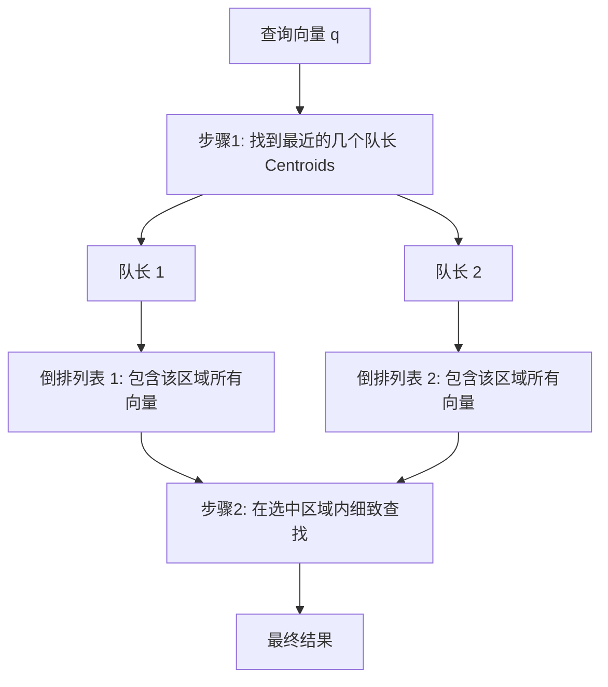
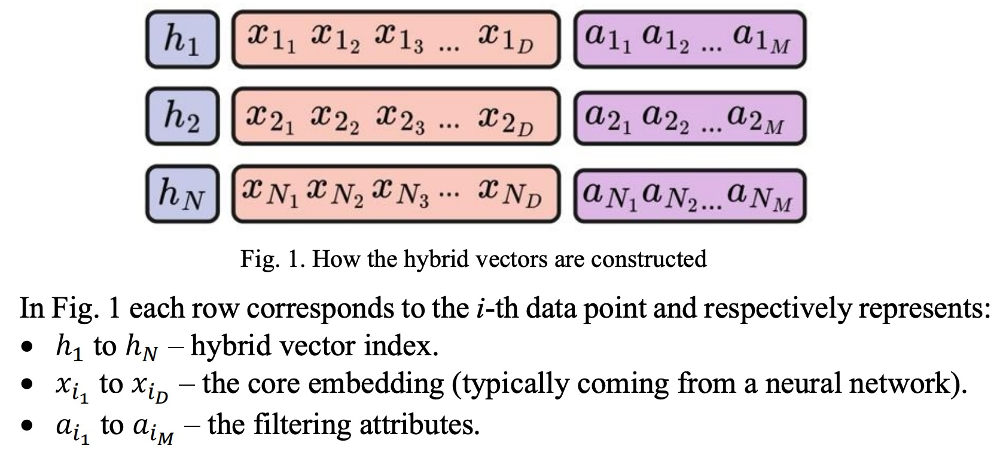
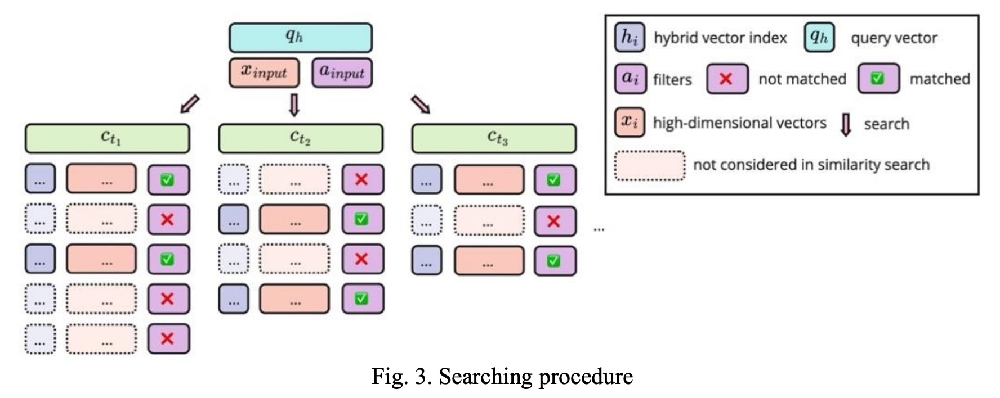
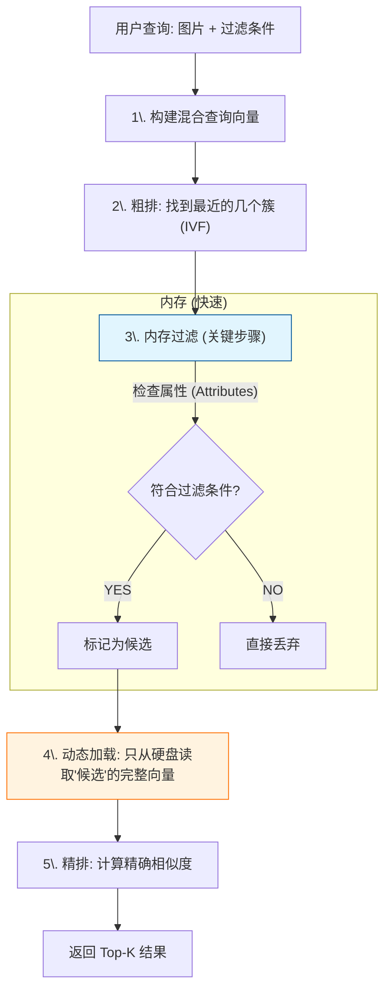
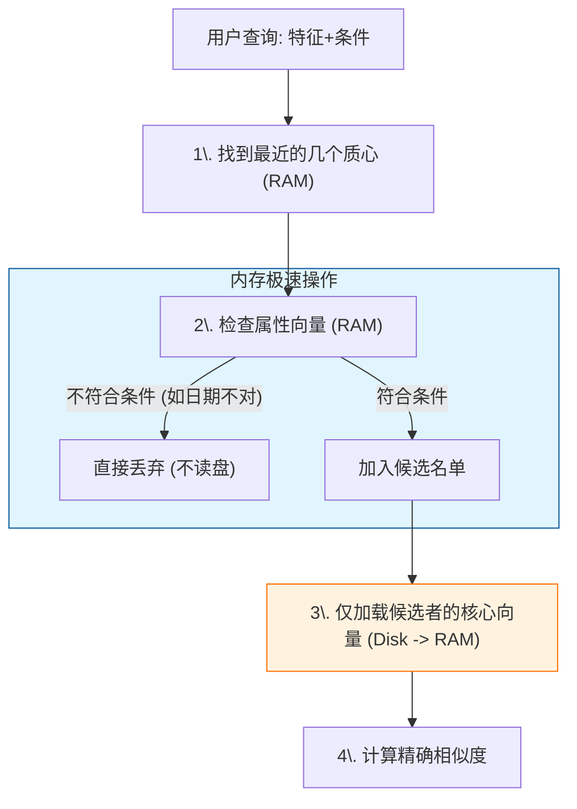

## AI论文解读 | Billion-Scale Similarity Search Using a Hybrid Indexing Approach with Advanced Filtering
        
### 作者        
digoal        
        
### 日期        
2025-12-02        
        
### 标签        
PostgreSQL , PolarDB , DuckDB , AI , 论文解读        
        
----        
        
## 背景  
      
https://arxiv.org/pdf/2501.13442        
  
提示:          
```          
读懂《Billion-Scale Similarity Search Using a Hybrid Indexing Approach with Advanced Filtering》这篇论文需要提前掌握哪些基础知识, 请使用中文通熟易懂的讲解这些基础知识, 可以引用论文中的图、表或使用Markdown支持的图形(text,mermaid等)增加解释性. 
  
使用中文通熟易懂的解读《Billion-Scale Similarity Search Using a Hybrid Indexing Approach with Advanced Filtering》这篇论文, 其中的关键内容请着重讲解, 可以引用论文中的图、表或使用Markdown支持的图形(text,mermaid等)增加解释性. 
  
提取《Billion-Scale Similarity Search Using a Hybrid Indexing Approach with Advanced Filtering》这篇论文中的重要术语, 使用中文对这些术语进行通熟易懂的讲解, 可以引用论文中的图、表或使用Markdown支持的图形(text,mermaid等)增加解释性. 
```     
  
## 1 前置知识 
  
要读懂这篇题为《Billion-Scale Similarity Search Using a Hybrid Indexing Approach with Advanced Filtering》（基于混合索引方法的十亿级高级过滤相似度搜索）的论文，你需要掌握以下几个核心基础知识领域。

我将用通俗易懂的语言为你拆解这些概念，并结合论文中的定义和图表进行辅助解释。

-----

### 1\. 向量嵌入与高维空间 (Vector Embeddings & High-Dimensional Space)

**通俗解释：**
计算机无法直接理解图片或文本的含义。为了让计算机处理它们，我们通过AI模型（如论文中提到的 CLIP 模型 ）将这些数据转换成一串数字。这串数字就叫“向量”（Vector）或“嵌入”（Embedding）。

  * **维度 ( Dimensions, $D$ ):** 这串数字的长度。比如论文中使用的向量长度是 768 个数字，这就是 768 维空间 。
  * **核心向量 ( Core Vector, $x_i$ ):** 论文中指代表数据原始内容（如图片语义）的向量部分 。

**为什么重要？**
这是所有相似度搜索的基础。如果两个向量在空间中的距离很近，代表它们原本的图片或文本在含义上很相似。

### 2\. 近似最近邻搜索 (ANN - Approximate Nearest Neighbor)

**通俗解释：**
在十亿级（Billion-scale）的海量数据中 ，想要找到和目标最相似的向量，如果逐个对比（暴力搜索），速度会慢到无法接受。
为了快，我们愿意牺牲一点点精度，不再追求“绝对”最近，而是找“大约”最近。这类算法统称为 **ANN**。

**论文背景：**
论文提到，随着维度增加，会出现“维数灾难”（Curse of Dimensionality），导致传统搜索变慢 。因此需要高效的索引结构。

### 3\. 倒排文件索引与沃罗诺伊单元 (IVF & Voronoi Cells)

这是本论文最核心的算法基础，论文是在 **IVF-Flat** 架构上进行改进的 。

**通俗解释：**
想象你在一个巨大的广场上找人。

1.  **聚类 (Clustering):** 我们先把广场划分成很多个小区域。每个区域选一个“队长”（ 即论文中的 **Centroid / 质心**, $C$ ）。
2.  **沃罗诺伊单元 (Voronoi Cells):** 每个队长负责一片区域，这片区域里的所有人离这个队长最近。这一片区域就叫沃罗诺伊单元 。
3.  **倒排列表 (Inverted Lists):** 队长手里有个名单，记录了归他管的所有人的位置 。

**搜索过程：**
当你要找某个人时，先看你在哪个队长附近（或者离哪几个队长最近），然后只在这些队长负责的区域里找，这样就不用跑遍整个广场了。

**Mermaid 图解 IVF 逻辑：**



### 4\. 混合向量与过滤 (Hybrid Vectors & Filtering)

**通俗解释：**
现实中的搜索往往带有条件。比如：“找一双看起来像这张照片的鞋子（**相似度搜索**），但价格必须在 500元以下（**过滤属性**）”。
传统的做法往往顾此失彼：要么先按价格筛，再算相似度；要么先算相似度，再看价格。在海量数据下这两种都很慢。

**论文的创新点：**
论文提出了一种 **“混合向量” ( Hybrid Vector, $h_i$ )** 的概念。
它把“代表样子的数字”（Core Vector）和“代表价格/属性的数字”（Attribute Vector）直接**拼接**在一起 。

**引用论文图解 (基于 Fig 1 ):**     

论文中的 **Fig. 1** 清晰地展示了这种拼接结构：

| 混合向量 ( $h_i$ ) | 核心向量部分 ( $x_i$ ) | 属性向量部分 ( $a_i$ ) |
| :--- | :--- | :--- |
| **$h_1$** | $[1.2, 0.5, ... , 3.4]$ (比如代表图片特征) | $[1, 2024, ...]$ (比如代表颜色ID, 年份) |
| **$h_2$** | $[0.9, 4.1, ... , 2.2]$ | $[5, 2023, ...]$ |

这样做的目的是让索引结构（IVF）能同时处理相似度和过滤条件，而不需要建立两套索引 。

### 5\. 两种索引模式：IVF-Flat vs. HNSW

虽然论文主要改进的是 IVF-Flat，但了解它们的区别有助于理解论文的取舍。

  * **HNSW (图索引):** 像导航地图一样，点与点之间有连线。搜索速度极快，精度高 ，但非常**吃内存 (RAM)** 。
  * **IVF-Flat (倒排索引):** 像图书馆目录。它把向量存在磁盘上，只把“目录”（Centroids）加载到内存。
      * **优点：** 可以在有限的内存下处理十亿级数据（Billion-scale），适合 **CPU 服务器** 。
      * **缺点：** 每次搜索可能需要从磁盘读取数据，如果不优化会很慢。

**论文的选择：**
论文明确选择 **IVF-Flat** 并进行优化，是为了在**没有昂贵 GPU** 的情况下，利用 CPU 和磁盘实现低成本的大规模搜索 。

### 6\. 搜索流程总结 (Search Workflow)

理解了以上概念，你就能看懂论文 **Fig. 3**  描述的搜索步骤了：    

1.  **拼接查询：** 把你的查询图片和过滤条件拼成一个“混合查询向量” ( $q_h$ ) 。
2.  **粗搜 (Coarse Search):** 用向量部分找到最近的几个“队长” ( $T$ nearest centroids ) 。
3.  **内存过滤 (Filtering):** 在这些队长管辖的列表里，先把**不符合属性条件**（如价格不对）的向量直接扔掉，不加载到内存中计算距离 。这一步叫“动态内存管理” 。
4.  **精搜 (Refinement):** 对剩下的符合条件的向量，计算精确的相似度距离，返回结果 。

### 总结

要读懂这篇论文，你主要需要理解： **如何把图片变成向量**，**IVF索引是如何通过“划分区域”来加速搜索的**，以及**为什么把属性和向量拼在一起（混合向量）能解决“既要搜图又要筛选”的难题**。掌握这些后，你就可以顺畅地阅读关于其具体实现和性能优化的章节了。
  
## 2 解读论文 
  
这篇论文介绍了一种在**普通 CPU 服务器**上，对**十亿级（Billion-scale）数据进行带复杂过滤条件的相似度搜索**的高效方法。

简单来说，它的目标是解决：“我想找一张像这张图的图片（相似度搜索），但必须是2023年拍摄且文件小于5MB的（复杂过滤）”这一难题，而且不需要昂贵的 GPU 显卡。

以下是对该论文核心内容的通俗解读：

### 1\. 核心痛点：为什么这很难？

在海量数据中，单纯找“最相似”已经很成熟了（比如用 HNSW 或 IVF 算法）。单纯做“SQL 筛选”也很成熟。
但当你要把两者结合时，传统方法往往会失效：

  * **先筛选再搜索**：如果筛选后数据太少或分布太散，索引就失效了，只能暴力扫描，速度极慢 。
  * **先搜索再筛选**：可能找出了100个最相似的，结果一筛选，发现这100个都不符合条件（比如都不是2023年的），导致结果为空 。
  * **硬件昂贵**：现有的十亿级方案通常需要消耗大量内存（RAM）或依赖昂贵的 GPU 。

### 2\. 核心创新：混合向量 (Hybrid Vectors)

这是论文最关键的设计。作者没有把“图像特征”和“筛选属性”分开存，而是把它们**拼**在了一起。

  * **传统做法**：向量存在向量数据库，属性存在关系型数据库，查的时候两边跑。
  * **论文做法**：创建一个**混合向量 ( $h_i$ )** 。
      * 前半部分是**核心向量 ( $x_i$ )** ：比如代表图片内容的768维数字。
      * 后半部分是**属性向量 ( $a_i$ )** ：比如代表日期、大小、标签的数字编码 。

**图解混合向量结构** (基于论文 Fig. 1 ):    

````
```mermaid
block-beta
  columns 3
  block:hybrid["混合向量 (Hybrid Vector)"]:3
  end
  space:3
  block:core["核心向量 (Core Embedding)"]:2
  block:attr["属性向量 (Attributes)"]
  end
  space:3
  block:desc1["图片语义 (768维)"]:2
  block:desc2["日期/标签/ID (M维)"]
  end
  style hybrid fill:#f9f,stroke:#333,stroke-width:2px
  style core fill:#bbf,stroke:#333
  style attr fill:#dfd,stroke:#333
```
````

这种结构的好处是： **一份索引，搞定两件事**。不需要维护多套复杂的索引结构 。

### 3\. 架构设计：改进版 IVF-Flat

作者选择了一种经典的索引结构 **IVF-Flat** 并进行了针对性改造，使其适合运行在 CPU 和硬盘上。

  * **聚类 (Centroids)** ：把十亿个数据分成几万个“簇”（Cluster）。比如分成了 32,000 个簇 。每个簇有一个中心点（质心）。
  * **存储策略**：
      * **内存 (RAM)** ：只存放这几万个中心点的位置，以及每个数据的属性信息（这部分很小）。
      * **硬盘 (Disk)** ：存放那十亿个完整的庞大向量数据 。

这种设计是为了**省钱**。内存放不下十亿个高维向量，所以把大头扔在硬盘上，内存只负责“导航” 。

### 4\. 搜索流程：智能过滤 (Smart Filtering)

这是整个系统跑得快的秘诀。搜索时，系统不会傻傻地把硬盘上的数据都读出来，而是分步走：

**搜索步骤图解** (基于论文 Fig. 3 ):    



**关键点解释：**

1.  **先找簇**：根据图片相似度，快速定位到可能包含目标的几个簇（比如最近的7个簇）。
2.  **先过滤，后读取**：这是最聪明的地方。在去硬盘读取庞大的向量数据**之前**，先在内存里检查这些数据的“属性向量”。如果一个数据的属性不符合条件（比如日期不对），就**根本不从硬盘读它** 。
3.  **按需加载**：只有既在相似簇里，又符合过滤条件的数据，才会被加载到内存进行最终计算。这大大减少了硬盘 IO 和 CPU 计算量 。

### 5\. 实验效果

作者使用了一个包含 **10亿张图片** (LAION-5B 的子集) 的数据集进行测试 。

  * **硬件配置**：一台普通的服务器（Intel Xeon CPU, 64GB 内存），没有使用 GPU 。
  * **速度**：在十亿级数据上，一次带过滤的搜索大约只需要 **1.4秒** 。
      * 其中大部分时间（1.09秒）花在属性过滤上，这是因为属性检查是在大量候选集中进行的，但这避免了更慢的磁盘读取 。
  * **对比**：作者尝试用流行的 `pgvector` 工具做同样的事，结果在 CPU 硬件上根本跑不动（系统无响应） 。

### 总结

这篇论文提出了一种**务实**的工程方案。它不追求纯算法理论的突破，而是通过**数据结构的重组（混合向量）和流程的优化（先在内存过滤再读盘）** ，实现了一个**低成本、高性能**的十亿级带过滤相似度搜索引擎 。
  
## 3 术语 
  
这篇论文的核心在于解决“如何在普通硬件上高效处理带复杂过滤条件的十亿级向量搜索”。为了让你更轻松地理解其中的技术细节，我提取了文中的关键术语，并用通俗的语言配合图表进行解读。

### 1\. 核心数据结构：混合向量 (Hybrid Vector)

这是论文最核心的创新点。通常我们在搜索时，图片特征（向量）和图片信息（如日期、标签）是分开存储的。但这篇论文提出将它们“缝合”在一起。

  * **定义**：将代表数据语义的“核心向量”和代表过滤条件的“属性向量”拼接成一个新的长向量 。
  * **通俗解释**：
    想象你要存一个人的档案。
      * **核心向量 ( $x_i$ )** ：是这个人的“长相特征”（一串主要是 AI 算出来的复杂数字）。
      * **属性向量 ( $a_i$ )** ：是这个人的“身份标签”（比如年龄、性别ID、居住地ID）。
      * **混合向量 ( $h_i$ )** ：把“长相特征”和“身份标签”粘在一起，变成一条完整的数据 。

**Mermaid 图解 (基于论文 Fig. 1 的逻辑)：**    

````
```mermaid
block-beta
  columns 3
  block:hybrid["混合向量 (Hybrid Vector)"]:3
  end
  space:3
  block:core["核心向量 (Core Vector)"]:2
  block:attr["属性向量 (Attribute Vector)"]
  end
  space:3
  block:desc1["AI生成的特征数据 (例如 768维)"]:2
  block:desc2["用于过滤的标签数据 (例如 10维)"]
  end
  style hybrid fill:#f9f,stroke:#333,stroke-width:2px
  style core fill:#bbf,stroke:#333
  style attr fill:#dfd,stroke:#333
```
````

*引用依据：论文 Fig. 1 展示了核心向量与属性向量的拼接方式 。*

-----

### 2\. 空间划分：沃罗诺伊单元 (Voronoi Cells) 与 质心 (Centroids)

这是为了解决“数据太多搜不过来”的问题。

  * **质心 (Centroids)** ：通过聚类算法（如 K-Means），从十亿个数据中选出的几万个“代表点” 。
  * **沃罗诺伊单元 (Voronoi Cells)** ：每个“代表点”负责管理一片区域。这片区域里所有的点，离这个代表点的距离都比离其他代表点更近 。
  * **通俗解释**：
    想象一个巨大的广场上站了10亿人。为了方便管理，我们在广场上插了 32,000 面旗子（**质心**）。
    即使没有画线，大家也会默认自己属于“离自己最近的那面旗子”管辖。每一面旗子管辖的这块地盘，就叫**沃罗诺伊单元**。搜索时，你只要先找到最近的旗子，就不用满广场乱跑了 。

-----

### 3\. 索引架构：IVF-Flat (倒排文件-平铺索引)

这是论文选择的基础索引结构，专门为了适应磁盘存储。

  * **定义**：一种将向量空间划分为多个倒排列表（Inverted Lists）的索引方法，每个列表对应一个质心 。
  * **“Flat”的含义**：表示列表里存储的是**原始的、未压缩的**完整向量数据，而不是压缩后的近似值 。
  * **通俗解释**：
      * **IVF (倒排)** ：就像图书馆的分类目录。书（向量）不是乱放的，而是按照类别（质心）分好类，记录在目录里。
      * **Flat (平铺)** ：书架上放的是**原版真书**，而不是缩印版或者摘要。虽然占地方（占硬盘空间），但是一旦找到，内容是最清晰准确的。

-----

### 4\. 关键流程：高级过滤 (Advanced Filtering) 与 动态内存管理

这是该论文让系统跑得快的秘诀。

  * **问题**：如果在搜索前就加载所有数据，内存（RAM）会爆；如果每次都从硬盘读所有数据，速度会慢死。
  * **解决方案**：
    1.  **RAM 中只存属性**：内存里只加载那些轻量级的“属性向量”和“质心” 。
    2.  **先过滤，后读盘**：在去硬盘读取庞大的“核心向量”之前，先在内存里快速检查“属性向量”是否符合条件（比如“必须是2024年的”） 。
    3.  **动态加载**：只有那些**既**属于目标区域，**又**符合过滤条件的向量，才会被从硬盘加载到内存里进行精细计算 。

**Mermaid 流程图解 (基于论文 Fig. 3 的搜索逻辑)：**    



*引用依据：论文 Fig. 3 展示了在加载向量前先进行匹配（matched）与不匹配（not matched）的判断过程 。*

### 5\. 两种向量类型对比

为了防止混淆，这里特别对比一下论文中提到的两个概念：

| 术语 | 英文 | 含义 | 存储位置 |
| :--- | :--- | :--- | :--- |
| **核心向量** | Core Vector ( $x_i$ ) | 数据的“长相”，通常维度很高（如768维），体积大。 | **硬盘 (Disk)** (通过 IVF-Flat 存储) |
| **属性向量** | Attribute Vector ( $a_i$ ) | 数据的“标签”，通常维度低（如10维），体积小。 | **内存 (RAM)** (为了快速过滤) |

通过这种 **“内存存属性，硬盘存实体”** 的策略，论文成功实现了在普通服务器上对十亿级数据的低成本、高性能搜索。
  
## 参考        
         
https://arxiv.org/pdf/2501.13442    
        
<b> 以上内容基于DeepSeek、Qwen、Gemini及诸多AI生成, 轻微人工调整, 感谢杭州深度求索人工智能、阿里云、Google等公司. </b>        
        
<b> AI 生成的内容请自行辨别正确性, 当然也多了些许踩坑的乐趣, 毕竟冒险是每个男人的天性.  </b>        
  
    
#### [PolarDB 学习图谱](https://www.aliyun.com/database/openpolardb/activity "8642f60e04ed0c814bf9cb9677976bd4")
  
  
#### [PostgreSQL 解决方案集合](../201706/20170601_02.md "40cff096e9ed7122c512b35d8561d9c8")
  
  
#### [德哥 / digoal's Github - 公益是一辈子的事.](https://github.com/digoal/blog/blob/master/README.md "22709685feb7cab07d30f30387f0a9ae")
  
  
#### [About 德哥](https://github.com/digoal/blog/blob/master/me/readme.md "a37735981e7704886ffd590565582dd0")
  
  

  
