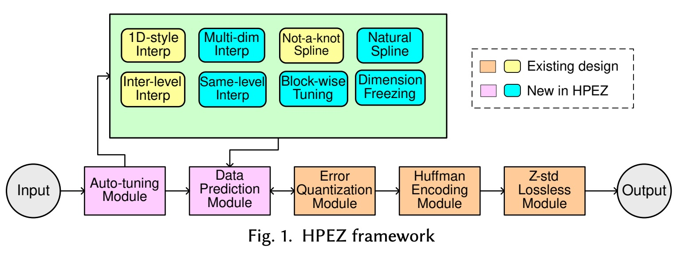
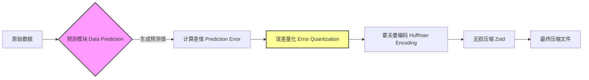
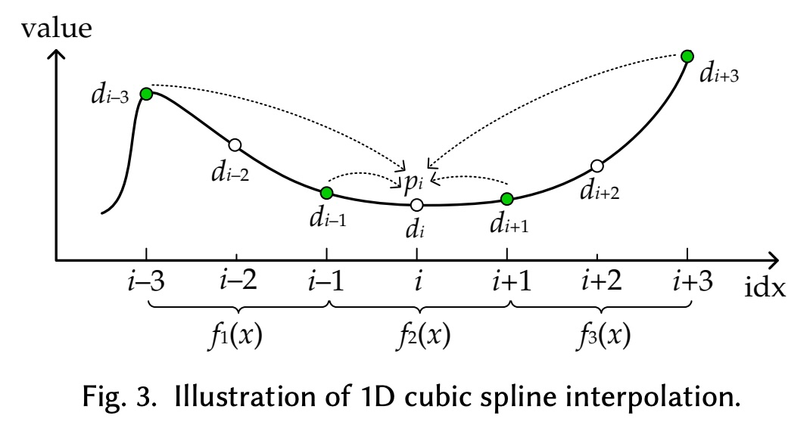
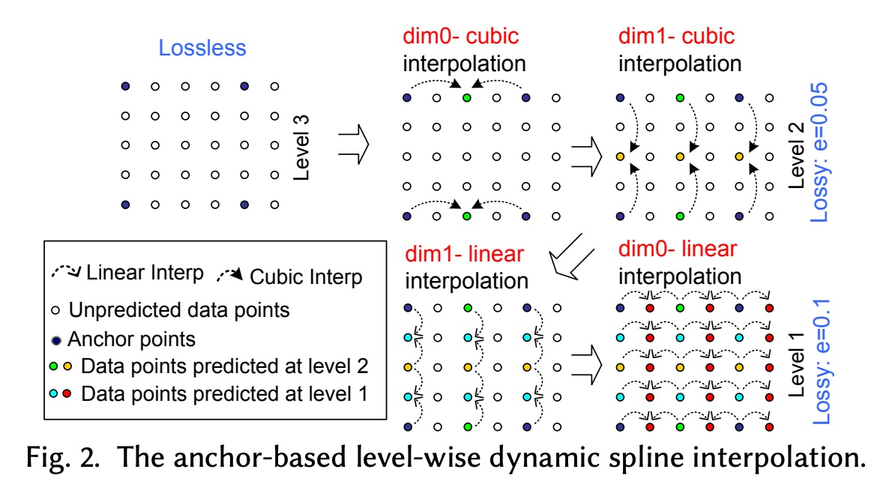
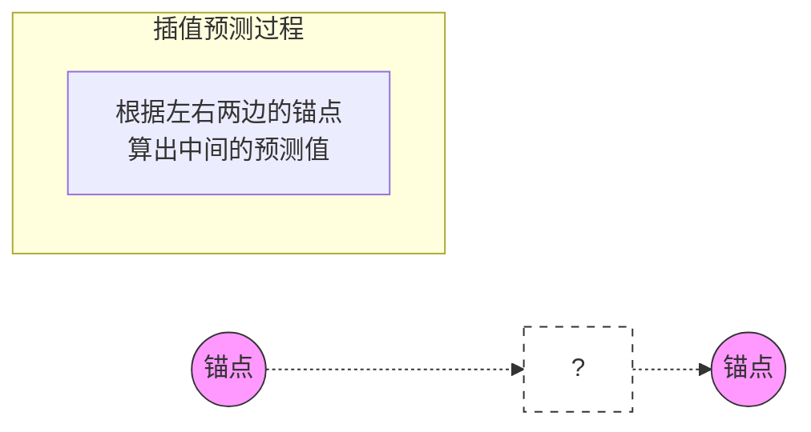

## AI论文解读 | High-performance Effective Scientific Error-bounded Lossy Compression with Auto-tuned Multi-component Interpolation
        
### 作者        
digoal        
        
### 日期        
2025-12-02        
        
### 标签        
PostgreSQL , PolarDB , DuckDB , AI , 论文解读        
        
----        
        
## 背景  
      
https://arxiv.org/pdf/2311.12133        
  
提示:          
```          
读懂《High-performance Effective Scientific Error-bounded Lossy Compression with Auto-tuned Multi-component Interpolation》这篇论文需要提前掌握哪些基础知识, 请使用中文通熟易懂的讲解这些基础知识, 可以引用论文中的图、表或使用Markdown支持的图形(text,mermaid等)增加解释性. 
  
使用中文通熟易懂的解读《High-performance Effective Scientific Error-bounded Lossy Compression with Auto-tuned Multi-component Interpolation》这篇论文, 其中的关键内容请着重讲解, 可以引用论文中的图、表或使用Markdown支持的图形(text,mermaid等)增加解释性. 
  
提取《High-performance Effective Scientific Error-bounded Lossy Compression with Auto-tuned Multi-component Interpolation》这篇论文中的重要术语, 使用中文对这些术语进行通熟易懂的讲解, 可以引用论文中的图、表或使用Markdown支持的图形(text,mermaid等)增加解释性. 
```     
  
## 1 前置知识 
  
阅读这篇论文《High-performance Effective Scientific Error-bounded Lossy Compression with Auto-tuned Multi-component Interpolation》（高性能且有效的科学数据误差有界有损压缩：基于自动调优的多组件插值），你需要掌握以下四大块基础知识。

为了让你更容易理解，我将用通俗的语言配合图表进行讲解。

-----

### 1\. 科学数据与“误差有界”有损压缩

**（Scientific Data & Error-bounded Lossy Compression）**

  * **什么是科学数据？**
    这篇论文处理的不是我们常见的JPEG图片或MP3音乐，而是**科学模拟数据**（如气象预测、地震波模拟、量子物理计算等）。这些数据通常是巨大的多维数组（3D或4D网格），里面填满了浮点数（Floating Point，例如 `0.0001234...`）。
  * **为什么是有损压缩？**
    因为这些数据量太大了（达到PB级别），无损压缩（像ZIP）压缩率太低，存不下也传不动。
  * **核心概念：误差有界 (Error-bounded)**
    这是科学压缩与普通图片压缩最大的区别。科学家必须保证压缩后的数据是可信的。
      * **绝对误差界限 ( Absolute Error Bound, $\epsilon$ )** ：承诺解压后的每一个数值与原数值的偏差不超过 $\epsilon$ 。例如，如果原值是 `100`，设定 $\epsilon=0.1$ ，那么解压后的值必须在 `99.9` 到 `100.1` 之间 。

-----

### 2\. 基于预测的压缩流程 (SZ模型)

**（Prediction-based Compression Pipeline）**

这篇论文提出的 **HPEZ** 压缩器是基于经典的 **SZ3** 框架构建的。你需要理解这类压缩器的“流水线”是如何工作的。论文中的 **图1 (Fig. 1)** 展示了这个流程。    

我们可以用一个简单的流程图来理解核心逻辑：



  * **预测 (Prediction)** ：这是HPEZ最核心的改进点。压缩器并不直接存数据，而是去“猜”数据。比如通过周围的点推算出当前点应该是多少。
  * **差值 (Residual/Error)** ：记录“真实值”减去“预测值”的差。如果预测得越准，差值就越接近0。
  * **量化 (Quantization)** ：把连续的浮点差值转化为整数（例如，差值 `0.003` 在误差允许范围内被记为 `0`，差值 `0.12` 被记为 `1`）。这步把数据变得更有规律。
  * **编码 (Encoding)** ：因为量化后会出现大量的 `0` 或小整数，用霍夫曼编码可以极大地压缩存储空间 。

> **通俗理解**：这就好比你要记一串数字 `10, 11, 12, 13`。  
> 普通记录：存四个数。  
> 预测记录：我猜下一个数比前一个大1。那么我只需要存第一个数 `10`，剩下的记为 `0, 0, 0`（即误差为0）。存三个 `0` 比存 `11, 12, 13` 省空间多了。  

-----

### 3\. 插值法与样条函数

**（Interpolation & Spline Functions）**

这是论文数学部分的核心（Section 5）。HPEZ 的名字里就有“Multi-component Interpolation”。

  * **插值 (Interpolation)** ：利用已知的点来估算未知的点。
  * **线性插值 (Linear)** ：这就是“连线”。看图上两点，中间的点就认为在连线上。公式简单，速度快，但不够平滑 。
  * **三次样条插值 (Cubic Spline)** ：用一条平滑的曲线来连接点。它利用了更远处的邻居点（比如利用4个点来预测中间的点），预测得更准，但计算更复杂。
      * 参见论文 **Fig. 3**，展示了利用 $d_{i-3}$ 到 $d_{i+3}$ 来预测 $d_i$ 的过程 。    
  * **难点知识：边界条件 (Boundary Conditions)**
    论文提到了两种特定的三次样条配置：
    1.  **Not-a-knot (非节点条件)** ：SZ3/QoZ 原有的方法，假设在端点处三阶导数连续 。
    2.  **Natural (自然边界条件)** ：HPEZ 新引入的，假设端点的二阶导数为0（即曲线在端点处变直） 。
      
      * **为什么重要？** 不同的数据形状（平缓或剧烈波动）适合不同的曲线画法。HPEZ 会自动挑最好的那一种。

-----

### 4\. 高性能计算 (HPC) 与自动调优

**（HPC Context & Auto-tuning）**

  * **压缩率 vs. 速度 (Rate-Distortion vs. Throughput)**
      * **高压缩率**：存得越小越好（如 SPERR, TTHRESH），但通常算得很慢。
      * **高速度**：存取极快（如 SZ, ZFP），适合超算实时运行，但压缩率稍差。
      * **HPEZ的目标**：它是想在保持高速度（High-performance）的同时，极大提高压缩质量 。
  * **自动调优 (Auto-tuning)**
    科学数据每一块的特征都不一样。HPEZ 包含了一个“智能大脑”（Section 6），它会先采样一小部分数据进行测试，然后决定：
      * 用线性插值还是三次样条？
      * 用自然边界还是非节点边界？
      * 甚至可以决定“冻结”某个维度（Dimension Freezing），如果那个维度的数据乱得无法预测 。

-----

### 总结：阅读路线图

当你阅读这篇论文时，请带着以下思维框架：

1.  **问题**：现在的压缩器要么快但压得不狠（SZ/ZFP），要么压得狠但太慢（SPERR）。
2.  **方案**：改进“预测”环节。不再只用一种插值，而是搞一堆插值工具箱（多维、自然样条等），让程序自动挑最准的那个工具（Auto-tuning）。
3.  **结果**：预测准了 -\> 差值小了 -\> 压缩率高了，而且因为插值计算主要是加减乘除，所以速度依然很快。

掌握了这些，你就可以顺畅地阅读 Section 4（架构）、Section 5（具体的插值数学公式）和 Section 7（看PSNR和吞吐量图表）了。

    
  
## 2 解读论文 
  
这篇论文介绍了一个名为 **HPEZ** (High-Performance Effective Compressor，也称为 QoZ 2.0) 的新型科学数据压缩器 。

简单来说，它的核心目标是解决当前科学数据压缩领域的**最大痛点**： **“跑得快的压缩率不够高，压缩率高的跑得太慢”** 。HPEZ 试图做到“鱼和熊掌兼得”：既保持极高的压缩与解压速度，又能获得顶级的压缩质量（高压缩率和低失真）。

以下是这篇论文的通俗解读与核心技术拆解：

-----

### 1\. 为什么我们需要 HPEZ？（背景与动机）

超级计算机（如模拟宇宙、气候变化）产生的数据量是惊人的（PB级别）。为了存储和传输这些数据，科学家必须使用**有损压缩**（允许极微小的误差，换取极大的空间节省）。

目前的压缩器分为两派：

  * **速度派 (High-performance)** ：如 SZ, ZFP。速度极快，适合实时运行，但压缩率（省空间的能力）有瓶颈 。
  * **质量派 (High-ratio)** ：如 SPERR, TTHRESH。能把数据压得非常小，但计算太复杂，速度很慢，像蜗牛一样 。

**HPEZ 的定位**：它是“速度派”里的新王者。它的速度依然很快（属于 High-performance 阵营），但它的压缩质量却通过算法优化，追平甚至超越了“质量派” 。

| 压缩器类型 | 代表软件 | 优点 | 缺点 | HPEZ 的位置 |
| :--- | :--- | :--- | :--- | :--- |
| **变换基 (Transform-based)** | ZFP | 极快 | 压缩率低 | |
| **小波/SVD基 (Wavelet/SVD)** | SPERR, TTHRESH | 压缩率极高 | **极慢** | |
| **预测基 (Prediction-based)** | SZ3, QoZ | 平衡 | 有提升空间 | **HPEZ (在此基础上大幅增强)** |

-----

### 2\. HPEZ 的核心魔法：如何预测数据？

HPEZ 的核心逻辑是 **“基于插值的预测” (Interpolation-based Prediction)** 。
简单理解：压缩器不直接存储每一个数据点，而是根据周围已知的点去“猜”当前点的值。猜得越准，需要记录的“误差值”就越小，压缩文件就越小。

HPEZ 在“怎么猜”这件事上做了三个重大升级：

#### 魔法一：多维插值 (Multi-dimensional Interpolation)

以前的压缩器（如 SZ3/QoZ）通常只在**一维线**上进行预测（比如先横着猜，再竖着猜）。这浪费了多维数据的空间相关性。
HPEZ 引入了真正的**多维插值**，同时利用数据点在 X轴、Y轴、Z轴 的邻居来综合预测 。


  * **效果**：利用更多维度的信息，猜测更准确，误差更小 。

#### 魔法二：更平滑的曲线 (Natural Cubic Spline)

在进行三次样条插值（画曲线预测）时，需要设定边界条件。

  * **旧方法 (Not-a-knot)** ：假设曲线在连接处非常连续，适合某些数据。
  * **新加入 (Natural Spline)** ：HPEZ 新增了“自然样条”条件（假设端点二阶导数为0），这让曲线在某些剧烈变化的数据段表现更稳健 。
  * HPEZ 会自动在这两种数学模型中挑选最适合当前数据的那一个 。

#### 魔法三：插值重排序 (Re-ordering)

这主要是为了**提速**。HPEZ 改变了计算顺序，优先沿着内存中变化最快的维度（Fast-varying dimension）进行处理。

  * **通俗解释**：就像吃自助餐，顺着盘子摆放的顺序拿菜（内存连续访问），比跑来跑去拿菜（内存跳跃访问）要快得多。这极大地优化了 CPU 缓存的使用 。

-----

### 3\. HPEZ 的智慧大脑：自动调优 (Auto-tuning)

只有好的数学公式还不够，HPEZ 还装配了一个非常智能的**自动调优模块**，它能根据数据特征“看菜下饭” 。

#### 1\. 动态维度冻结 (Dynamic Dimension Freezing)

这是 HPEZ 非常聪明的一点。有些科学数据在某个方向上非常平滑，但在另一个方向上乱七八糟（比如地震波数据）。

  * **策略**：HPEZ 会检测哪个维度“最乱”（非平滑），然后**冻结**该维度，不沿着那个方向去猜数据 。
  * **结果**：避免了“强行预测”带来的巨大误差，反而提高了整体压缩率 。

#### 2\. 分块调优 (Block-wise Tuning)

大块的科学数据，不同区域的特征可能完全不同（比如台风中心和边缘）。
HPEZ 不再对整个数据用一套参数，而是把数据切成小块（Block），对每一块单独进行“体检”，通过采样一小部分数据来决定这一块用什么插值策略最好 。

#### 3\. 洛伦佐预测器 (Lorenzo Predictor) 备选

虽然插值法很强，但对于极高精度要求的情况，传统的 Lorenzo 预测器可能更好。HPEZ 会自动测试并在两者之间切换，确保永远使用最优解 。

-----

### 4\. 实测效果：碾压级的表现

论文使用了 6 个真实的科学数据集（包括气象、地震、湍流等）进行了详尽的测试 。

#### (1) 压缩质量 (PSNR & 压缩率)

在同等误差限制下，HPEZ 的压缩率极其惊人：

  * 比第二好的高性能压缩器（通常是 QoZ 或 SZ3），压缩率提升了 **20% 到 140%** 不等。
  * 在保证同等图像质量（PSNR）的情况下，压缩率甚至能提升 **360%** 。
  * **结论**：在“速度派”压缩器里，HPEZ 的画质和压缩率是断层第一 。

#### (2) 速度 (Speed)

  * HPEZ 的速度大约是 SPERR（高压缩率代表）的 **2倍到6倍** 。
  * HPEZ 的速度是 TTHRESH 的 **4倍到17倍** 。
  * 虽然比最简单的 SZ3 稍慢一点点（因为算法更复杂了），但依然处于同一数量级，完全满足高性能计算的需求。

#### (3) 实际应用：跨洋数据传输

论文模拟了在两个超级计算机（Anvil 和 Bebop）之间传输数据。

  * 因为 HPEZ 压得更小，且解压够快，它使得总的数据传输时间减少了 **40%** 。这证明了它在分布式数据库中的巨大实用价值。

-----

### 总结

**HPEZ (QoZ 2.0)** 是一次显著的技术飞跃。它通过引入**多维插值**、**自然样条函数**以及**智能的维度冻结**技术，成功打破了“速度”与“质量”的对立。

对于科学家来说，这意味着：

1.  **省硬盘**：存同样的数据，占用空间更小。
2.  **省时间**：数据传输更快，且读写速度依然能够跟上超级计算机的计算步伐。
  
## 3 术语 
  
根据论文《High-performance Effective Scientific Error-bounded Lossy Compression with Auto-tuned Multi-component Interpolation》，以下是核心术语的通俗解读。

-----

### 1\. Error-bounded Lossy Compression (误差有界有损压缩)

**通俗解释**：
这不是普通的压缩（如ZIP），而是一种允许数据有极微小偏差的压缩技术。但在压缩前，用户会设定一个“红线”（Error Bound，误差界限）。
压缩器向用户保证：无论怎么压缩，解压后的每一个数据点，与原始数据的差值绝对不会超过你划定的这条红线 。

  * **应用场景**：比如气象预测中，温度是 `25.12345` 度，如果误差界限设为 `0.001`，那么解压后的数据在 `25.12245` 到 `25.12445` 之间科学家都能接受，因为这对预测结果影响微乎其微，但能节省巨大的存储空间。

### 2\. HPEZ (High-Performance Effective Compressor)

**通俗解释**：
这是论文提出的主角，也叫 **QoZ 2.0** 。
它是一个像瑞士军刀一样的压缩器，旨在解决当前的一个两难困境：有的压缩器跑得快但压不小，有的压缩器压得小但跑得慢。HPEZ 的目标是**跑得跟最快的压缩器差不多，但压缩率要比它们高得多**（在某些情况下压缩率提升高达 140%）。

### 3\. Interpolation-based Prediction (基于插值的预测)

**通俗解释**：
这是 HPEZ 的核心魔法。压缩器不直接存储数据，而是去“猜”数据。
想象你在画图，纸上只有几个稀疏的点（被称为 **Anchor Points 锚点** ）。

  * **怎么猜？** HPEZ 利用这些锚点，画出曲线来推测中间空缺位置的数据应该是多少。
  * **为什么要猜？** 如果猜得准，我只需要存“原本的数据”减去“猜的数据”的差值（这个差值通常接近0）。存一堆接近0的小数字比存原始大数字要省空间得多。




### 4\. Multi-dimensional Spline Interpolation (多维样条插值)

**通俗解释**：
传统的插值是“一根筋”的，比如先横着猜一行，再竖着猜一列（这叫 1D-style 插值 ）。
HPEZ 发明了**多维插值**。它在猜一个点时，会同时参考它在上下左右（甚至前后）所有方向的邻居。

  * **好处**：就像如果你只有左边的邻居告诉你房价，你可能猜不准；但如果你左边、右边、楼上、楼下的邻居都告诉你房价，你综合起来猜，准确率就高得多。预测越准，压缩率越高 。

### 5\. Natural Cubic Spline (自然三次样条)

**通俗解释**：
在用曲线连接数据点时，曲线两端的形状很难确定。

  * **旧方法 (Not-a-knot)** ：假设曲线在连接处非常顺滑，适合大多数平缓数据 。
  * **新方法 (Natural)** ：HPEZ 引入了这种新画法，它强制让曲线在端点处变直（二阶导数为0） 。
    **HPEZ 的智慧**：它不强行规定用哪种，而是看哪种画出来的线更贴合数据，就自动选哪种 。

### 6\. Dynamic Dimension Freezing (动态维度冻结)

**通俗解释**：
有些科学数据在某个方向上非常乱（不平滑）。如果在乱的方向上强行去猜数据，误差会很大。
HPEZ 能够自动检测哪个方向最乱。如果发现某个维度“路况太差”，它就会**冻结**这个维度，不在这个方向上进行插值预测，而是直接记录数据点 。

  * **比喻**：开车去目的地，如果发现直走的那条路全是坑（数据不平滑），HPEZ 就会决定封路（冻结），宁愿绕路或者用别的方式，也不走那条破路，从而避免颠簸（预测误差）。

### 7\. Block-wise Interpolation Tuning (分块插值调优)

**通俗解释**：
科学数据通常很大，不同区域的特征不一样（比如这一块是平原，那一块是高山）。
HPEZ 不会“一刀切”地用一套参数处理所有数据。它把数据切成一个个小方块（Block），对每一个小方块单独进行“体检”，在这个方块内挑选最适合它的插值工具 。

### 8\. PSNR (峰值信噪比)

**通俗解释**：
这是衡量压缩质量的尺子。数值越大，代表压缩后的数据和原始数据越像，失真越小。
论文中提到，在同样的 PSNR 下，HPEZ 能把文件压得更小；或者在同样的文件大小下，HPEZ 的 PSNR 更高（画面更清晰） 。
  
## 参考        
         
https://arxiv.org/pdf/2311.12133    
        
<b> 以上内容基于DeepSeek、Qwen、Gemini及诸多AI生成, 轻微人工调整, 感谢杭州深度求索人工智能、阿里云、Google等公司. </b>        
        
<b> AI 生成的内容请自行辨别正确性, 当然也多了些许踩坑的乐趣, 毕竟冒险是每个男人的天性.  </b>        
  
    
#### [PolarDB 学习图谱](https://www.aliyun.com/database/openpolardb/activity "8642f60e04ed0c814bf9cb9677976bd4")
  
  
#### [PostgreSQL 解决方案集合](../201706/20170601_02.md "40cff096e9ed7122c512b35d8561d9c8")
  
  
#### [德哥 / digoal's Github - 公益是一辈子的事.](https://github.com/digoal/blog/blob/master/README.md "22709685feb7cab07d30f30387f0a9ae")
  
  
#### [About 德哥](https://github.com/digoal/blog/blob/master/me/readme.md "a37735981e7704886ffd590565582dd0")
  
  

  
