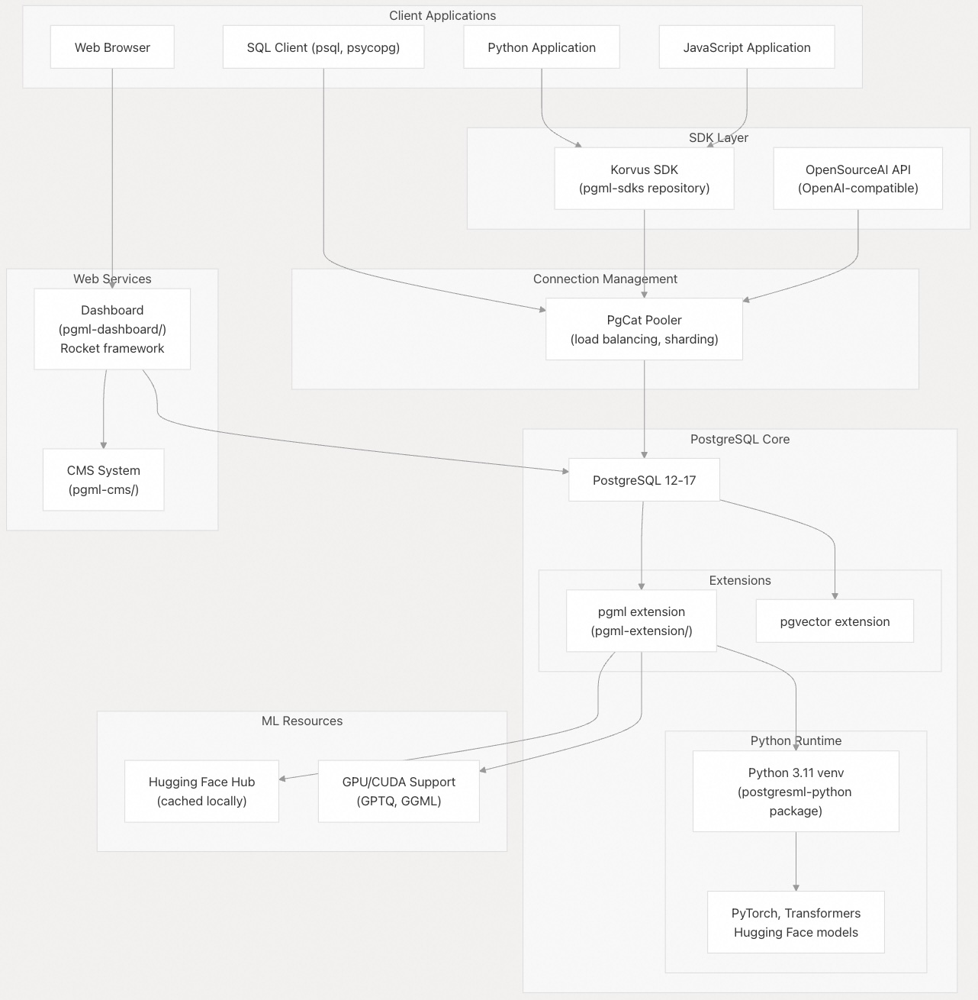
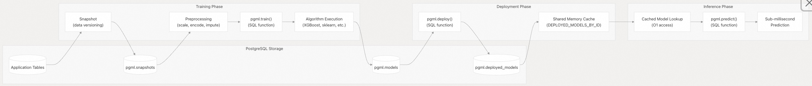
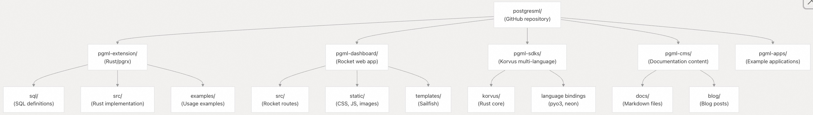

## postgresml 源码学习: 1 概览  
        
### 作者        
digoal        
        
### 日期        
2025-12-02        
        
### 标签        
PostgreSQL , postgresml , 内置AI , AI 原生数据库         
        
----        
        
## 背景  
本文档对 **PostgresML** (PostgresML) 进行了高层介绍。**PostgresML** 是一个 **MLOps platform**（机器学习运维平台），它将机器学习和 **AI** 能力直接引入 **PostgreSQL** (PostgreSQL) 数据库中。本概览涵盖了系统的核心理念、架构组件、关键能力和部署选项。  
  
**来源:**  
[`README.md` 1-241](https://github.com/postgresml/postgresml/blob/caf2b6cc/README.md#L1-L241)  
[`pgml-cms/docs/README.md` 1-54](https://github.com/postgresml/postgresml/blob/caf2b6cc/pgml-cms/docs/README.md#L1-L54)  
  
-----  
  
## 核心理念: Data-Centric ML (以数据为中心的机器学习)  
  
**PostgresML** 遵循一个基本的架构原则，它颠覆了传统的 **ML** 基础设施模式：  
  
> **将模型移至数据库，而不是不断地将数据移至模型。**  
  
这种设计选择的动机是观察到用于 **ML** 和 **AI** 系统的数据本质上比模型本身更大且更具动态性。通过将模型与数据共同置于 **PostgreSQL** 内部，该系统消除了：  
  
  * **网络延迟**：由于应用、数据库和模型服务器之间持续的数据传输。  
  * **数据一致性问题**：由于维护独立的数据存储和模型服务基础设施。  
  * **基础设施复杂性**：由于管理多个分布式系统。  
  * **安全边界**：数据在系统间传输时暴露。  
  
数据库成为特征存储和 **inference engine**（推理引擎），能够在实时数据上实现亚毫秒级（sub-millisecond）的预测，并提供 **ACID guarantees**（ACID 保证）。  
  
**来源:**  
[`README.md` 18-21](https://github.com/postgresml/postgresml/blob/caf2b6cc/README.md#L18-L21)  
[`pgml-cms/docs/README.md` 8-12](https://github.com/postgresml/postgresml/blob/caf2b6cc/pgml-cms/docs/README.md#L8-L12)  
  
-----  
  
## 系统架构概览  
  
### 高层组件拓扑  
  
    
  
**图表：带有代码实体映射的组件拓扑**  
  
此图表将 **PostgresML** 的逻辑组件映射到它们在仓库结构中的具体实现。每个组件对应于代码库中的特定目录或包。  
  
**来源:**  
[`README.md` 37-49](https://github.com/postgresml/postgresml/blob/caf2b6cc/README.md#L37-L49)  
[`pgml-cms/docs/README.md` 24-29](https://github.com/postgresml/postgresml/blob/caf2b6cc/pgml-cms/docs/README.md#L24-L29)  
  
-----  
  
## 核心组件  
  
### PostgreSQL Extension: `pgml` (PostgreSQL 扩展: `pgml`)  
  
`pgml` **extension**（扩展）是基础组件，它在 **PostgreSQL** 内部实现了 **ML** 操作。它使用 **pgrx** (pgrx) 框架构建，暴露了用于训练、**inference**（推理）和数据转换的 **SQL** 函数。  
  
| 组件 | 位置 | 目的 |  
| :--- | :--- | :--- |  
| 扩展代码 | `pgml-extension/` | 使用 `pgrx` 的 Rust 实现 |  
| SQL API | `pgml-extension/sql/` | 函数定义 |  
| Python 绑定 | `pgml-extension/src/bindings/` | 基于 `pyo3` 的 Python 集成 |  
  
**关键 SQL 函数:**  
  
  * `pgml.train()` - 训练**监督学习**（supervised learning）模型  
  * `pgml.predict()` - 对部署的模型运行**推理**  
  * `pgml.deploy()` - 激活训练好的模型用于生产使用  
  * `pgml.transform()` - 应用 **Transformer Models**（Transformer 模型）进行 **NLP** 任务  
  * `pgml.embed()` - 使用深度学习模型生成 **Embeddings**（嵌入）  
  * `pgml.chunk()` - 将文本分割成片段用于 **RAG pipelines**（RAG 管道）  
  
**来源:**  
[`README.md` 66-67](https://github.com/postgresml/postgresml/blob/caf2b6cc/README.md#L66-L67)  
[`pgml-extension/examples/vectors.sql` 1-47](https://github.com/postgresml/postgresml/blob/caf2b6cc/pgml-extension/examples/vectors.sql#L1-L47)  
[`pgml-extension/sql/setup_examples.sql` 1-29](https://github.com/postgresml/postgresml/blob/caf2b6cc/pgml-extension/sql/setup_examples.sql#L1-L29)  
  
### Dashboard: `pgml-dashboard` (仪表盘: `pgml-dashboard`)  
  
**Dashboard**（仪表盘）是基于 Web 的管理界面，使用 Rocket Web 框架构建。它提供了用于 **ML** 工作流管理、笔记本和内容交付的 **UI**。  
  
| 组件 | 技术 | 目的 |  
| :--- | :--- | :--- |  
| Web 框架 | Rocket (Rust) | HTTP 服务器和路由 |  
| 模板 | Sailfish | 服务器端渲染 |  
| 前端 | Stimulus JS, SCSS | 交互式组件 |  
| 数据库访问 | SQLx | 异步 PostgreSQL 查询 |  
  
**Dashboard** 服务于多种目的：  
  
  * **笔记本界面**：用于交互式 **ML** 实验的 **SQL** 和 **Markdown** 单元格  
  * **项目管理**：组织 **ML** 实验和部署  
  * **模型注册表 UI**：浏览已训练的模型和部署历史  
  * **CMS**：文档和博客内容交付  
  
**来源:**  
[`README.md` 96-98](https://github.com/postgresml/postgresml/blob/caf2b6cc/README.md#L96-L98)  
[`pgml-cms/docs/README.md` 32-36](https://github.com/postgresml/postgresml/blob/caf2b6cc/pgml-cms/docs/README.md#L32-L36)  
  
### SDK: Korvus (SDK: Korvus)  
  
**Korvus SDK**（软件开发工具包）为常见 **ML** 任务提供了具有统一 **API** 的原生语言绑定（Python, JavaScript, Rust, C）。该 **SDK** 建立在 Rust 核心之上，为其他语言生成绑定。  
  
**架构模式:**  
  
```  
Rust Core (pgml-sdks/korvus/src/)   
    → Python bindings (pyo3)  
    → JavaScript bindings (neon)  
    → C bindings (FFI)  
```  
  
**高层抽象:**  
  
  * `Collection` - 文档和**嵌入**管理  
  * `Pipeline` - 可组合的处理工作流  
  * `Model` - **嵌入**模型配置  
  * `Splitter` - 文本分块策略  
  * `OpenSourceAI` - 适用于开源模型的 **OpenAI-compatible API**（OpenAI 兼容 API）  
  
**来源:**  
[`README.md` 95-97](https://github.com/postgresml/postgresml/blob/caf2b6cc/README.md#L95-L97)  
[`pgml-cms/docs/README.md` 31-36](https://github.com/postgresml/postgresml/blob/caf2b6cc/pgml-cms/docs/README.md#L31-L36)  
  
### Connection Pooler: PgCat (连接池: PgCat)  
  
**PgCat** (PgCat) 是一个 **PostgreSQL** **connection pooler**（连接池），提供负载均衡、分片和故障转移功能。虽然在架构上与 **PostgresML** 分离，但它设计用于配合**扩展**进行横向扩展。  
  
**来源:**  
[`README.md` 99-100](https://github.com/postgresml/postgresml/blob/caf2b6cc/README.md#L99-L100)  
[`pgml-cms/docs/README.md` 27-28](https://github.com/postgresml/postgresml/blob/caf2b6cc/pgml-cms/docs/README.md#L27-L28)  
  
-----  
  
## ML 执行流程  
  
### 训练和 Inference Pipeline (推理管道)  
  
    
  
**图表：带有数据库实体的 ML 训练和推理流程**  
  
此图表说明了数据如何流经 **PostgresML** 的 **ML** 生命周期，并将每个阶段映射到特定的数据库表和 **SQL** 函数。共享内存缓存（`DEPLOYED_MODELS_BY_ID`）通过避免重复的模型反序列化来实现高性能**推理**。  
  
**来源:**  
[`README.md` 206-225](https://github.com/postgresml/postgresml/blob/caf2b6cc/README.md#L206-L225)  
[`pgml-extension/sql/setup_examples.sql` 17-28](https://github.com/postgresml/postgresml/blob://caf2b6cc/pgml-extension/sql/setup_examples.sql#L17-L28)  
  
-----  
  
## 关键能力  
  
### Supervised Learning (监督学习)  
  
**PostgresML** 通过 `pgml.train()` 函数提供了 47 种以上的**监督学习算法**，用于**分类**、**回归**和**聚类**。支持的算法系列包括：  
  
  * **Gradient Boosting**（梯度提升）：XGBoost, LightGBM  
  * **Scikit-learn**：Random Forest, SVM, Linear models  
  * **Rust-native**：Linfa 库实现  
  
示例工作流：  
  
1.  将数据加载到 **PostgreSQL** 表中  
2.  调用 `pgml.train()` 并选择算法和超参数  
3.  系统创建快照，训练模型，并将其存储在 `pgml.models` 表中  
4.  使用 `pgml.deploy()` 进行部署，使其可用于 `pgml.predict()`  
  
**来源:**  
[`README.md` 198-225](https://github.com/postgresml/postgresml/blob/caf2b6cc/README.md#L198-L225)  
[`pgml-extension/examples/vectors.sql` 6-33](https://github.com/postgresml/postgresml/blob/caf2b6cc/pgml-extension/examples/vectors.sql#L6-L33)  
  
### Transformer Models and Embeddings (Transformer 模型和嵌入)  
  
该系统集成了 Hugging Face，提供了数千种**预训练模型**的访问权限，用于：  
  
  * **Text Embeddings**（文本嵌入）：将文本转换为**密集向量**用于 **Semantic Search**（语义搜索）  
  * **Text Generation**（文本生成）：基于 **LLM**（大型语言模型）的补全和聊天  
  * **Text Classification**（文本分类）：情感、主题分类  
  * **Token Classification**：命名实体识别  
  * **Cross-Encoding**（交叉编码）：用于重排序的语义相似性评分  
  
模型从 Hugging Face 下载，在本地缓存，并通过 `pyo3` 绑定加载到 Python 运行时。对于适用于 VRAM 的模型，支持通过 **CUDA** 进行 **GPU acceleration**（GPU 加速），并支持更大模型的量化（GPTQ, GGML）。  
  
**来源:**  
[`README.md` 102-123](https://github.com/postgresml/postgresml/blob/caf2b6cc/README.md#L102-L123)  
[`README.md` 227-241](https://github.com/postgresml/postgresml/blob/caf2b6cc/README.md#L227-L241)  
  
### RAG (Retrieval-Augmented Generation) (RAG (检索增强生成))  
  
**PostgresML** 通过四个**原语操作**实现了完整的 **RAG pipelines**（RAG 管道）：  
  
| 函数 | 目的 | 典型用途 |  
| :--- | :--- | :--- |  
| `pgml.chunk()` | 将文本分割成片段 | 准备文档进行**嵌入** |  
| `pgml.embed()` | 生成**向量嵌入** | 创建可搜索的表示 |  
| `pgml.rank()` | **交叉编码**评分 | **重排序**搜索结果 |  
| `pgml.transform()` | 应用 **LLM 转换** | 从上下文生成响应 |  
  
这些函数可以在 **SQL** 查询中组合，以实现完整的 **RAG** 工作流，无需外部服务。**向量存储**使用 `pgvector` **扩展**，带有 **HNSW 索引**，用于高效的 **Similarity Search**（相似性搜索）。  
  
**来源:**  
[`README.md` 125-196](https://github.com/postgresml/postgresml/blob/caf2b6cc/README.md#L125-L196)  
  
### Vector Operations (向量操作)  
  
该**扩展**为 **ML** 工作流提供了优化的**向量操作**：  
  
**算术**：元素级和成对操作  
  
  * `pgml.add()`, `pgml.subtract()`, `pgml.multiply()`, `pgml.divide()`  
  
**范数**：各种**向量大小**计算  
  
  * `pgml.norm_l0()`, `pgml.norm_l1()`, `pgml.norm_l2()`, `pgml.norm_max()`  
  
**归一化**：将**向量**缩放到**单位范数**  
  
  * `pgml.normalize_l1()`, `pgml.normalize_l2()`, `pgml.normalize_max()`  
  
**距离度量**：相似性和距离计算  
  
  * `pgml.distance_l1()`, `pgml.distance_l2()`, `pgml.cosine_similarity()`, `pgml.dot_product()`  
  
**聚合**：批处理向量操作  
  
  * `pgml.sum()`, `pgml.min()`, `pgml.max()`, `pgml.min_abs()`, `pgml.max_abs()`  
  
**来源:**  
[`pgml-extension/examples/vectors.sql` 5-46](https://github.com/postgresml/postgresml/blob/caf2b6cc/pgml-extension/examples/vectors.sql#L5-L46)  
  
-----  
  
## 部署选项  
  
**PostgresML** 可以通过三种主要的配置进行部署：  
  
### Managed Cloud (托管云服务)  
  
**PostgresML** 团队运营一个**托管云服务**，分为三个等级：  
  
  * **Serverless**（无服务器）：自动扩展，按使用量付费  
  * **Dedicated**（专用）：预留计算和 **GPU 资源**  
  * **Enterprise**（企业）：**VPC 隔离**，团队管理，**SLA 保证**  
  
用户可以在 `postgresml.org/signup` 注册以立即访问，无需安装。  
  
### Docker  
  
用于开发和自托管的单命令行部署：  
  
```bash  
docker run -it -v postgresml_data:/var/lib/postgresql \
    -p 5433:5432 -p 8000:8000 \
    ghcr.io/postgresml/postgresml:2.10.0 \
    sudo -u postgresml psql -d postgresml  
```  
  
**Docker 镜像**包括：  
  
  * 预安装了 `pgml` **扩展**的 **PostgreSQL**  
  * 带有 **ML 依赖**的 **Python 3.11 venv**  
  * **Dashboard** 服务（在端口 8000 上）  
  * **GPU 支持**（如果 **NVIDIA runtime** 可用）  
  
### APT Packages (APT 软件包)  
  
适用于 **Ubuntu 20.04**, **22.04**, 和 **24.04** (**amd64** 和 **arm64**）：  
  
  * `postgresql-pgml-{12..17}` - 适用于特定 **PostgreSQL** 版本的**扩展**  
  * `postgresml-python` - **Python runtime** 及其**依赖**  
  * `postgresml-dashboard` - **Web dashboard binary**  
  * `postgresml` - 安装所有组件的**元软件包**  
  
Repository：`apt.postgresml.org` (**S3** 支持的 **APT 仓库**)  
  
**来源:**  
[`README.md` 69-89](https://github.com/postgresml/postgresml/blob/caf2b6cc/README.md#L69-L89)  
[`pgml-cms/docs/README.md` 51-54](https://github.com/postgresml/postgresml/blob/caf2b6cc/pgml-cms/docs/README.md#L51-L54)  
  
-----  
  
## 集成模式  
  
### Direct SQL Access (直接 SQL 访问)  
  
任何 **PostgreSQL** 客户端都可以通过标准的 **SQL** 连接使用 **PostgresML**：  
  
  * `psql` 命令行界面  
  * Python: `psycopg`, `asyncpg`  
  * Node.js: `pg`, `node-postgres`  
  * Ruby: `pg` gem  
  * Java: JDBC drivers  
  
所有 **ML** 操作都作为 **SQL 函数**暴露，可从任何具有 **PostgreSQL 驱动程序**的语言中调用。  
  
### SDK Integration (SDK 集成)  
  
对于需要更高级别**抽象**的应用，**Korvus SDK** 提供了**惯用** **API**：  
  
  * Python: `pip install korvus`  
  * JavaScript: `npm install korvus`  
  * Rust: `cargo add korvus`  
  
该 **SDK** 处理**连接池**、**查询构建**和**结果解析**，同时在 **PostgreSQL** 中**服务器端**执行所有操作。  
  
### Dashboard Web UI (仪表盘 Web UI)  
  
基于**浏览器**的**仪表盘**提供：  
  
  * **可视化模型管理**  
  * **交互式 SQL 笔记本**  
  * **项目和实验跟踪**  
  * **CMS** 用于**文档浏览**  
  
通过 **HTTP** 在端口 8000（默认）或**云部署**中的自定义**域名**访问。  
  
**来源:**  
[`README.md` 91-98](https://github.com/postgresml/postgresml/blob/caf2b6cc/README.md#L91-L98)  
[`pgml-cms/docs/README.md` 31-46](https://github.com/postgresml/postgresml/blob/caf2b6cc/pgml-cms/docs/README.md#L31-L46)  
  
-----  
  
## 性能特点  
  
**PostgresML** 通过其**数据库内置架构**实现了显著的**性能优势**：  
  
  * **推理速度快 8-40 倍**：相比基于 **HTTP** 的模型服务（消除了**网络序列化**）  
  * **每秒数百万次请求**：通过**连接池**和**共享内存缓存**  
  * **亚毫秒级预测**：通过 `DEPLOYED_MODELS_BY_ID` 缓存中的 **O(1) 模型查找**  
  * **GPU 加速**：当有 **CUDA** 功能的硬件可用时，用于 **Transformer models**  
  * **横向可扩展性**：通过 **PgCat** 在多个 **PostgreSQL 实例**之间进行**分片**  
  
**来源:**  
[`README.md` 59](https://github.com/postgresml/postgresml/blob/caf2b6cc/README.md#L59-L59)  
[`README.md` 202-204](https://github.com/postgresml/postgresml/blob://caf2b6cc/README.md#L202-L204)  
  
-----  
  
## 仓库结构  
  
    
  
**图表：仓库组织**  
  
**单体仓库**（monorepo）结构按功能组件组织代码，每个主要系统都在其自身的**顶层目录**中。构建和打包配置集中在**根级别**。  
  
**来源:**  
[`README.md` 1-241](https://github.com/postgresml/postgresml/blob/caf2b6cc/README.md#L1-L241)  
[`pgml-cms/docs/README.md` 1-54](https://github.com/postgresml/postgresml/blob://caf2b6cc/pgml-cms/docs/README.md#L1-L54)  
  
  
-----  
  
# 附录1: 架构师/运维角度: 资源隔离与横向扩展的细节  
  
**背景痛点:** 将计算密集型的机器学习（ML）任务（如 GPU 加速的 **Transformer Models** 推理或模型训练）放在主数据库内核中，传统上会与数据库的**事务性**和**并发读写**产生严重的资源竞争，影响 **ACID 保证**和延迟。  
  
**关键问题:**  
  
**PostgresML 如何在 PostgreSQL 内部**实现 sub-millisecond（亚毫秒级）的推理，并结合 **PgCat** 实现横向扩展，同时确保模型训练、GPU 推理等**高资源消耗操作不会对数据库的 ACID 事务性、核心延迟或吞吐量造成负面影响？** 具体的**资源隔离机制**（例如，模型运行是否在单独进程或沙箱中）和 **PgCat** 在支持 **ML** 负载时的**分片策略**（Sharding Strategy）是什么？  
  
## 回答  
  
PostgresML 通过 PostgreSQL 的进程架构和 PgCat 的连接池管理实现资源隔离和横向扩展，确保 ML 任务不影响 ACID 事务性能。  
  
## 核心机制  
  
### 资源隔离  
PostgresML 利用 PostgreSQL 的 fork/multiprocessing 架构实现天然的资源隔离  ：  
- 每个客户端连接启动独立的 PostgreSQL 进程  
- 模型在连接进程内存空间中加载  
- 各进程拥有独立的模型副本，避免锁竞争  
  
### 性能优化  
- 模型通过共享内存缓存（ `DEPLOYED_MODELS_BY_ID`) 实现 O(1) 访问    
- GPU 推理比 CPU 快 4 倍（ LLM 推理 45ms vs 165ms)    
- 数据与计算同进程，消除网络序列化开销    
  
## PgCat 横向扩展  
  
### 分片策略  
PgCat 支持多种分片策略  ：  
1. **基于分片键的路由**：从查询中提取分片键（路由到正确分片  
2. **并行查询**：无分片键时并行查询所有分片并合并结果  
3. **元数据标注**：客户端手动添加分片标注  
  
### 负载均衡  
PgCat 提供三种负载均衡策略  ：  
- Random（随机）：平均分配，推荐大多数工作负载  
- Round robin（轮询）：假设查询成本相等  
- Least active connections（最少活跃连接）：适应不同查询成本和服务器容量  
  
### 连接池配置  
对于 LLM 工作负载，PgCat 配置为事务模式  ：  
```toml  
pool_mode = "transaction"  
pool_size = 1  # 单连接共享 LLM 模型缓存  
```  
  
## 扩展性能  
PostgresML + PgCat 架构实现了线性扩展  ：  
- 5 个副本实现接近 100 万预测/秒  
- 平均延迟低于 1ms  
- 2000 客户端达到 1,021,692.7 req/sec  
  
## Notes  
PostgresML 的资源隔离主要依赖 PostgreSQL 的进程架构而非容器化沙箱。每个连接进程独立加载模型，这种设计在保证 ACID 性能的同时，通过 PgCat 的连接池和分片能力实现了横向扩展。对于大型 LLM 模型，建议使用事务模式池化以最大化模型缓存利用率。  
  
  
  
  
-----  
  
# 附录2: 开发者角度: RAG 管道的抽象与可维护性  
  
**背景痛点:** **RAG**（检索增强生成）工作流涉及文本分块、嵌入生成、向量搜索和 **LLM** 转换等多个步骤。虽然 **PostgresML** 通过一系列 **SQL** 函数（如 `pgml.chunk()`, `pgml.embed()`, `pgml.transform()`）实现了这些功能，但复杂的业务逻辑如果完全用 **SQL** 语句组合来编写和维护，难度会很高且难以调试。  
  
**关键问题:**  
  
**Korvus SDK** 在构建和维护 **RAG pipelines**（RAG 管道）时，提供了哪些比直接 **SQL** 访问**更高层、更惯用**的抽象来简化开发？开发者在日常工作中如何有效地**管理、调试和版本控制**这些由 **SQL** 函数调用组合而成的复杂 **ML** 工作流？  
  
## 回答  
  
## Korvus SDK 的高级抽象与工作流管理  
  
Korvus SDK 通过提供面向对象的高级抽象，显著简化了 RAG 管道的开发和管理，相比直接使用 SQL 函数组合，它提供了更直观、更易维护的接口。  
  
### 核心高级抽象  
  
**1. Collection 和 Pipeline 抽象**  
- `Collection` 类封装了文档管理、索引和查询操作    
- `Pipeline` 类定义了文档处理流程，包括分块、嵌入和索引配置    
- 这些抽象将复杂的 SQL 表创建、索引管理和数据迁移操作封装为简单的方法调用  
  
**2. 统一的 RAG 查询接口**  
- `collection.rag()` 方法将整个 RAG 流程（嵌入生成、向量搜索、上下文注入、LLM 生成）封装为单次调用    
- `collection.rag_stream()` 提供流式响应能力，适用于长文本生成场景    
  
**3. 查询构建器模式**  
- 使用 JSON 配置而非 SQL 语句来定义查询参数，提高了可读性和可维护性    
  
### 工作流管理策略  
  
**1. 版本控制**  
- Pipeline 配置可以作为代码进行版本控制，所有参数都在 JSON 中明确定义  
- Collection 和 Pipeline 的创建脚本可以存储在代码仓库中，便于追踪变更  
  
**2. 调试支持**  
- SDK 生成的 SQL 查询可以通过数据库日志查看，便于性能调优  
- 分步执行支持：可以先使用 `vector_search()` 验证检索结果，再进行完整的 RAG 操作    
  
**3. 开发工作流**  
```python  
# 典型的开发流程  
collection = pgml.Collection("my_collection")  
pipeline = pgml.Pipeline("v1", pipeline_config)  
await collection.add_pipeline(pipeline)  
await collection.upsert_documents(documents)  
results = await collection.rag(query, pipeline)  
```  
  
### 性能优势  
  
Korvus SDK 的单查询 RAG 实现比传统的多步骤方法快近一个数量级，因为它避免了：  
- 多次网络往返（嵌入 API 调用  
- 数据在不同服务间的传输  
- 复杂的协调逻辑    
  
## Notes  
  
- Korvus SDK 支持多种语言（Python、JavaScript、Rust 和 C），所有语言都基于相同的 Rust 核心实现，确保了 API 的一致性  
- 虽然抽象了 SQL 复杂性，但开发者仍可以直接访问底层数据表进行自定义查询  
- SDK 不支持闭源模型（如 OpenAI），但可以用于检索部分，与第三方 LLM 服务结合使用    
  
  
  
  
  
-----  
  
# 附录3: 日常维护角度: 外部依赖和安全管理  
  
**背景痛点:** **PostgresML** 作为一个**数据库扩展**，集成了包括 **Hugging Face** 模型、**Python venv**（Python 3.11 运行时）和 **CUDA** 驱动等大量**外部 ML 依赖**。在数据库环境中管理这些依赖的**版本兼容性**和**安全补丁**，是一个重大的运维挑战，远比在标准容器中管理复杂。  
  
**关键问题:**  
  
**从日常维护角度，**PostgresML 团队是如何处理 **Hugging Face** 模型、**Python venv** 和 **CUDA** 依赖关系的**版本兼容性、安全更新和漏洞管理**的？在数据库内核中运行外部依赖的部署模式，相比于传统容器化微服务，其**升级和回滚**（例如 Python 运行时升级）的日常维护操作流程有何不同和需要特别注意的地方？  
  
## 回答  
  
PostgresML通过包管理系统、版本锁定和配置控制来处理复杂的ML依赖管理，相比传统容器化部署具有独特的运维特点。  
  
## 依赖版本管理策略  
  
### Python环境固定  
PostgresML使用Python 3.11作为固定运行时版本，通过APT包管理和虚拟环境隔离依赖  。CI/CD流程中明确安装Python 3.11以确保兼容性  。  
  
### 架构特定依赖锁定  
为不同CPU架构维护独立的依赖文件：  
- `requirements.amd64.txt`：x86_64架构的199个包，包括torch==2.5.1、transformers==4.48.0    
- `requirements.arm64.txt`：ARM64架构的111个包，使用较旧版本如torch==2.3.0    
  
### CUDA版本管理  
Docker镜像基于`nvidia/cuda:12.6.3-devel-ubuntu24.04`，确保CUDA驱动版本一致性  。  
  
## 安全控制机制  
  
### 模型白名单系统  
通过GUC配置参数控制模型访问：  
- `pgml.huggingface_whitelist`：限制可下载的模型    
- `pgml.huggingface_trust_remote_code`：控制远程代码执行    
  
### 分层安全策略  
实现两阶段验证：模型必须在白名单中，且如需执行远程代码还需额外的信任白名单许可  。  
  
## 升级与回滚流程  
  
### 包管理驱动的更新  
通过APT仓库统一分发更新，使用`apt update && apt upgrade`批量更新所有组件  。  
  
### 数据库内扩展更新  
使用`ALTER EXTENSION pgml UPDATE;`进行模式迁移，通过版本化SQL文件处理架构变更  。  
  
## 与容器化微服务的差异  
  
### 优势  
- **原子性更新**：通过包管理器确保所有组件同时更新，避免版本不匹配  
- **存储计算分离**：数据持久化独立于计算实例，升级时无需数据迁移    
- **配置继承**：数据库配置自动传递到ML环境，减少配置错误  
  
### 特别注意事项  
- **数据库重启依赖**：Python运行时更新需要重启PostgreSQL服务  
- **共享内存影响**：扩展加载到共享内存，版本变更可能影响所有连接  
- **模型缓存管理**：更新后需要重新加载GPU内存中的模型权重  
  
### 运维复杂度  
相比容器化部署，数据库内ML需要更严格的版本控制和测试，因为依赖变更直接影响数据库核心功能，但提供了更低延迟和更高数据安全性的优势  。  
  
## Notes  
  
PostgresML的依赖管理策略体现了"将模型移至数据"的设计理念，通过牺牲部分部署灵活性换取了数据安全性和查询性能。架构特定的requirements文件确保了跨平台兼容性，而GUC配置系统提供了细粒度的安全控制。升级流程虽然需要数据库重启，但通过包管理器简化了操作复杂度。  
  
-----  
  
# 附录4: 如果能下载到股票数据, 应该如何使用postgresml训练基于股票数据的预测模型?  
  
PostgresML 提供了完整的机器学习工作流，可以直接在 PostgreSQL 中训练股票预测模型。以下是具体步骤：  
  
## 核心步骤  
  
### 1. 数据准备  
将股票数据导入 PostgresML：  
```sql  
-- 创建股票数据表  
CREATE TABLE stock_data (  
    date DATE,  
    symbol TEXT,  
    open_price FLOAT,  
    high_price FLOAT,  
    low_price FLOAT,  
    close_price FLOAT,  
    volume BIGINT,  
    -- 技术指标  
    moving_avg_5 FLOAT,  
    moving_avg_20 FLOAT,  
    rsi FLOAT,  
    -- 目标变量  
    next_day_change FLOAT  
);  
  
-- 导入数据（CSV格式）  
COPY stock_data FROM '/path/to/stock_data.csv' WITH CSV HEADER;  
```  
  
### 2. 特征工程  
创建技术指标和特征：  
```sql  
-- 计算移动平均线  
UPDATE stock_data   
SET moving_avg_5 = (  
    SELECT AVG(close_price)   
    FROM stock_data s2   
    WHERE s2.symbol = stock_data.symbol   
    AND s2.date BETWEEN stock_data.date - INTERVAL '4 days' AND stock_data.date  
);  
  
-- 计算RSI等其他指标...  
```  
  
### 3. 模型训练  
使用 `pgml.train()` 训练预测模型  ：  
  
```sql  
-- 训练回归模型预测次日涨跌幅  
SELECT * FROM pgml.train(  
    project_name => 'Stock Price Prediction',  
    task => 'regression',  
    relation_name => 'stock_data',  
    y_column_name => 'next_day_change',  
    algorithm => 'xgboost',  
    hyperparams => '{  
        "n_estimators": 100,  
        "max_depth": 5,  
        "learning_rate": 0.1  
    }'  
);  
```  
  
### 4. 模型预测  
使用训练好的模型进行预测  ：  
  
```sql  
-- 预测最新数据  
SELECT   
    date,  
    symbol,  
    close_price,  
    pgml.predict(  
        'Stock Price Prediction',  
        ARRAY[  
            open_price,  
            high_price,  
            low_price,  
            volume,  
            moving_avg_5,  
            moving_avg_20,  
            rsi  
        ]  
    ) AS predicted_change  
FROM stock_data  
WHERE date = CURRENT_DATE - INTERVAL '1 day';  
```  
  
## 高级功能  
  
### 算法选择  
PostgresML 支持50+种算法  ：  
- `xgboost` - 适用于时序数据  
- `lightgbm` - 快速梯度提升  
- `random_forest` - 随机森林  
- `linear` - 线性回归  
  
### 时间序列处理  
对于时间序列数据，建议：  
1. 使用时间窗口特征  
2. 添加滞后变量  
3. 考虑使用 `test_sampling => 'last'` 确保测试集为最新数据    
  
### 模型评估  
查看模型性能指标  ：  
```sql  
SELECT   
    algorithm,  
    metrics->>'r2' AS r2_score,  
    metrics->>'mse' AS mean_squared_error  
FROM pgml.models   
JOIN pgml.projects ON models.project_id = projects.id  
WHERE projects.name = 'Stock Price Prediction'  
ORDER BY created_at DESC;  
```  
  
## Notes  
  
- 股票预测属于时间序列问题，建议使用回归任务而非分类  
- 特征工程对模型性能至关重要，包括技术指标、历史价格、成交量等  
- 可以定期重新训练模型以适应市场变化  
- PostgresML 支持GPU加速训练，适合大规模数据集  
- 所有操作都在数据库内完成，无需数据传输，提高效率  
  
    
#### [PolarDB 学习图谱](https://www.aliyun.com/database/openpolardb/activity "8642f60e04ed0c814bf9cb9677976bd4")
  
  
#### [PostgreSQL 解决方案集合](../201706/20170601_02.md "40cff096e9ed7122c512b35d8561d9c8")
  
  
#### [德哥 / digoal's Github - 公益是一辈子的事.](https://github.com/digoal/blog/blob/master/README.md "22709685feb7cab07d30f30387f0a9ae")
  
  
#### [About 德哥](https://github.com/digoal/blog/blob/master/me/readme.md "a37735981e7704886ffd590565582dd0")
  
  

  
