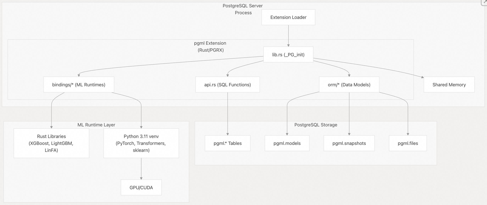
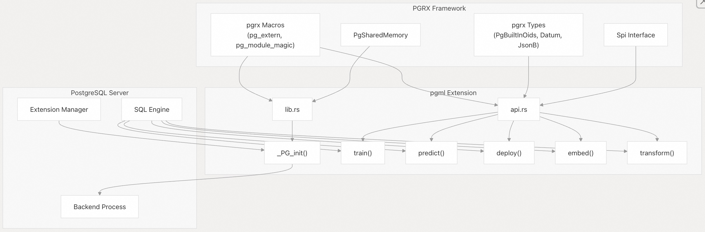
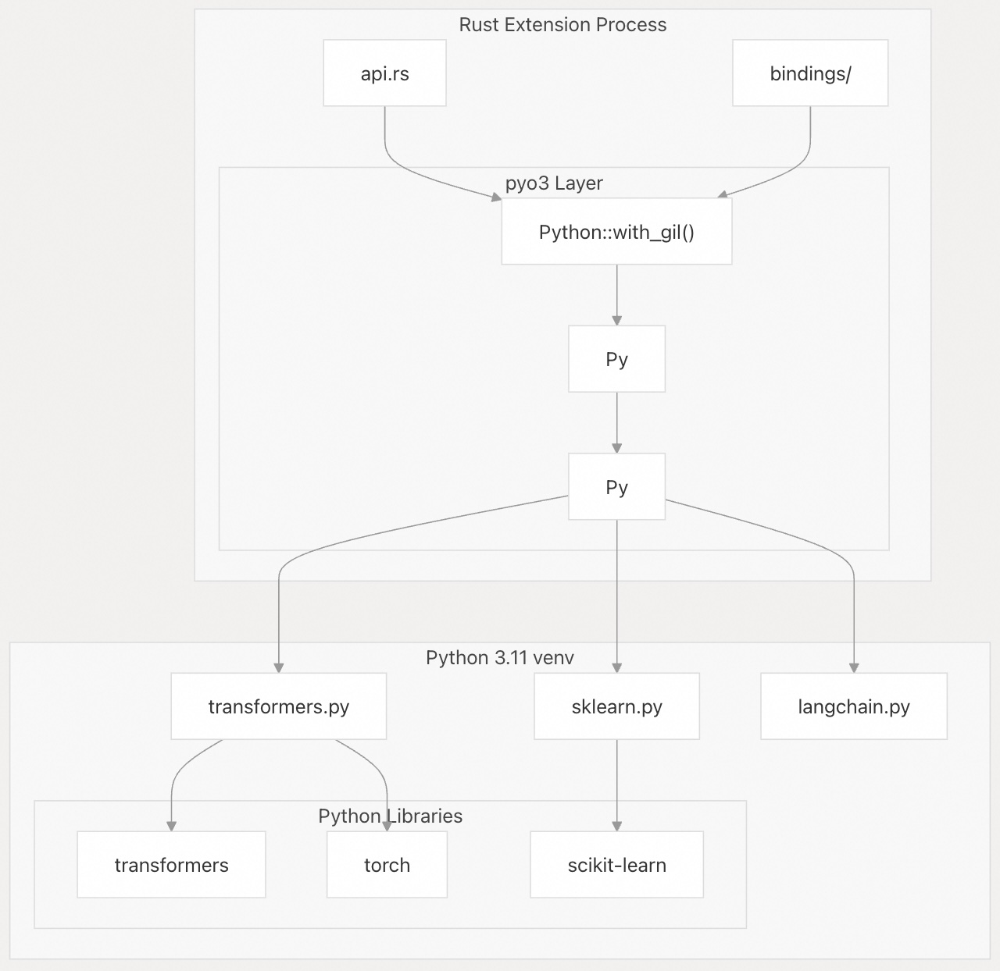
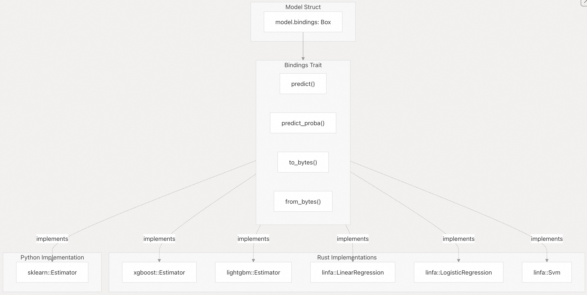
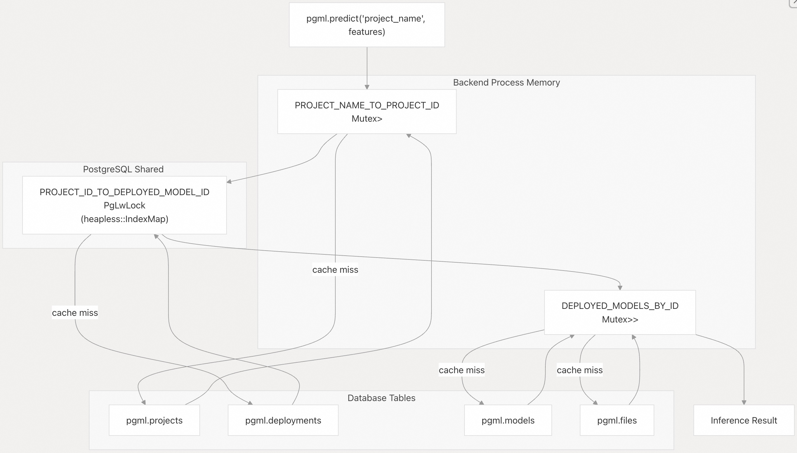
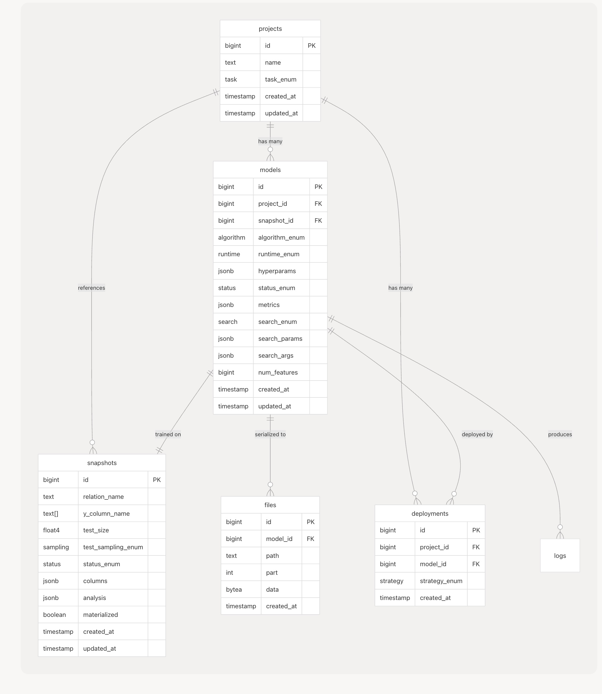
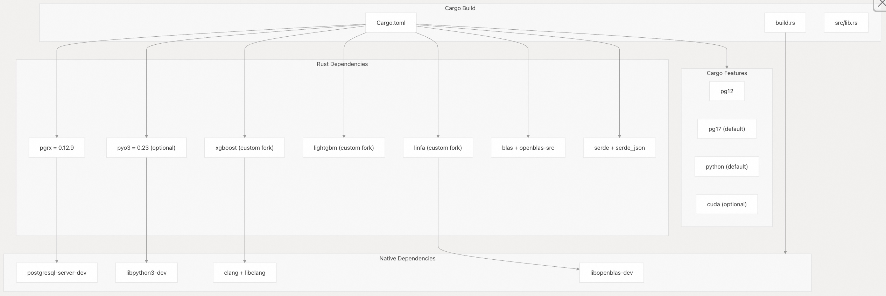
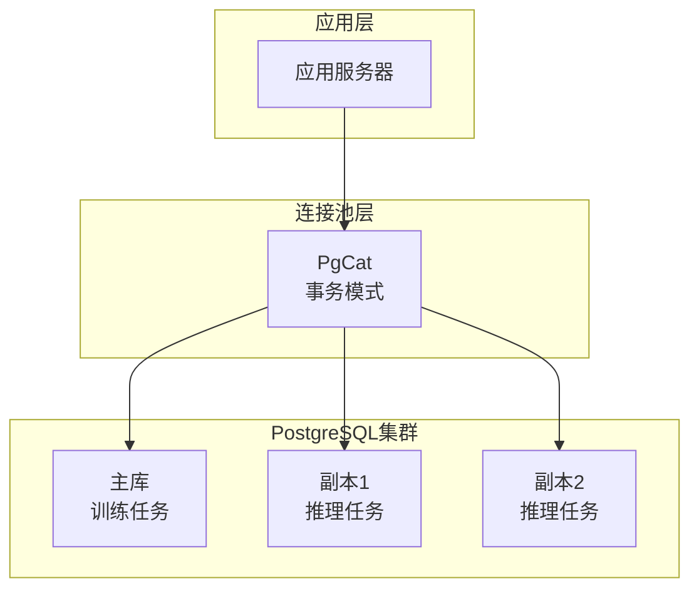

## postgresml 源码学习: 2 核心系统架构（Core System Architecture）  
  
### 作者  
digoal  
  
### 日期  
2025-12-02  
  
### 标签  
PostgreSQL , postgresml , 内置AI , AI 原生数据库  
  
----  
  
## 背景  
本文档概述了 **PostgresML** 的核心架构组件，包括其**扩展系统（Extension System）** 、**Python 集成（Python Integration）** ，以及以**数据库为中心的设计模式（Database-Centric Design Patterns）** 。它解释了 PostgresML **扩展（Extension）** 的内部结构如何与 **PostgreSQL** 集成，以及各个组件如何协同工作。  
  
-----  
  
## 数据库中心架构（Database-Centric Architecture）  
  
PostgresML 的构建原则是让数据保留在其所在的位置——即数据库中。该系统被设计为一个 **PostgreSQL 扩展（PostgreSQL Extension）** ，它将 **ML/AI 计算（compute）** 直接带到数据所在之处，而不是将数据移动到外部服务。  
  
**数据库中心架构图**   
  
  
  
关键的架构原则包括：  
  
1.  **数据库内处理（In-Database Processing）** ：机器学习操作在 **PostgreSQL 后端进程（backend processes）** 内执行。  
2.  **模型无共享（Shared Nothing for Models）** ：每个后端进程将模型加载到自己的内存中。  
3.  **持久化存储（Persistent Storage）** ：模型、快照（snapshots）和元数据存储在 **PostgreSQL 表**中。  
4.  **多运行时支持（Multi-Runtime Support）** ：同时支持 Rust 原生和基于 Python 的 **ML 库**。  
  
**来源:**  
  
  * [`pgml-extension/src/lib.rs` 1-69](https://github.com/postgresml/postgresml/blob/caf2b6cc/pgml-extension/src/lib.rs#L1-L69)  
  * [`pgml-extension/Cargo.toml` 1-76](https://github.com/postgresml/postgresml/blob/caf2b6cc/pgml-extension/Cargo.toml#L1-L76)  
  * [`README.md` 18-49](https://github.com/postgresml/postgresml/blob/caf2b6cc/README.md#L18-L49)  
  
-----  
  
## PGRX 扩展框架（PGRX Extension Framework）  
  
PostgresML 使用 **PGRX**（以前称为 **pgx**）构建，这是一个用于创建 **PostgreSQL 扩展**的 **Rust 框架（Rust framework）** 。PGRX 为 **Rust 代码**与 **PostgreSQL** 的 **C API** 集成提供了基础。  
  
**PGRX 集成架构图**   
  
  
  
### 扩展入口点（Extension Entry Point）  
  
当扩展加载时，[`pgml-extension/src/lib.rs` 25-30](https://github.com/postgresml/postgresml/blob/caf2b6cc/pgml-extension/src/lib.rs#L25-L30) 中的 `_PG_init()` 函数会被调用：  
  
1.  **服务器参数初始化**：通过 `config::initialize_server_params()` 注册 **GUC 参数**。  
2.  **Python 环境激活**：调用 `bindings::python::activate()` 初始化 **Python 运行时（Python runtime）** 。  
3.  **共享内存设置**：通过 `orm::project::init()` 初始化 `PROJECT_ID_TO_DEPLOYED_MODEL_ID` 映射。  
  
### SQL 函数注册（SQL Function Registration）  
  
像 `#[pg_extern]` 这样的 **PGRX 宏**会自动将 **Rust 函数**注册为 **PostgreSQL 函数**。例如，[`pgml-extension/src/api.rs` 91-330](https://github.com/postgresml/postgresml/blob/caf2b6cc/pgml-extension/src/api.rs#L91-L330) 定义了 `train()` 函数，它在 SQL 中可以作为 `pgml.train()` 调用。  
  
该框架处理：  
  
  * **PostgreSQL** 类型和 **Rust** 类型之间的类型转换。  
  * **FFI 边界（FFI boundary）** 上的内存管理。  
  * 错误处理和事务安全。  
  * 并行查询执行的安全注解。  
  
**来源:**  
  
  * [`pgml-extension/src/lib.rs` 1-69](https://github.com/postgresml/postgresml/blob/caf2b6cc/pgml-extension/src/lib.rs#L1-L69)  
  * [`pgml-extension/src/api.rs` 1-850](https://github.com/postgresml/postgresml/blob/caf2b6cc/pgml-extension/src/api.rs#L1-L850)  
  * [`pgml-extension/Cargo.toml` 26-56](https://github.com/postgresml/postgresml/blob/caf2b6cc/pgml-extension/Cargo.toml#L26-L56)  
  
-----  
  
## 模块结构与组织（Module Structure and Organization）  
  
代码库被组织成不同的模块，每个模块处理系统的一个特定方面。  
  
**模块组织表**  
  
| 模块 | 路径 | 用途 |  
| :--- | :--- | :--- |  
| 入口点（Entry Point） | `src/lib.rs` | 扩展初始化、模块导出 |  
| **API 层**（API Layer） | `src/api.rs` | SQL 可访问函数（`train`、`predict` 等） |  
| **数据模型**（Data Model） | `src/orm/` | **Project**、**Model**、**Snapshot**、**Dataset** 抽象 |  
| **ML 绑定**（ML Bindings） | `src/bindings/` | 与 **XGBoost**、**LightGBM**、**sklearn**、**transformers** 的集成 |  
| **向量操作**（Vector Ops） | `src/vectors.rs` | 向量算术和距离函数 |  
| **评估指标**（Metrics） | `src/metrics.rs` | 混淆矩阵（Confusion matrix）、F1、准确率（accuracy）计算 |  
| **配置**（Config） | `src/config.rs` | 用于扩展配置的 **GUC 参数** |  
  
### API 模块（`api.rs`）  
  
**API 模块** [`pgml-extension/src/api.rs` 1-850](https://github.com/postgresml/postgresml/blob/caf2b6cc/pgml-extension/src/api.rs#L1-L850) 通过 **SQL 函数**暴露主要的用户界面：  
  
**核心训练和推理（Core Training & Inference）**  
  
  * `train()` - 在 **PostgreSQL 数据**上训练 **ML 模型**  
  * `predict()` - 使用已部署的模型执行**推理（Inference）**  
  * `deploy()` - 激活一个特定模型的项目  
  
**Transformer 和嵌入函数（Transformer & Embedding Functions）**  
  
  * `embed()` - 通过 **Hugging Face 模型**生成**嵌入（Embeddings）**  
  * `transform()` - 应用 **transformers** 进行 **NLP** 任务  
  * `rank()` - 用于搜索的 **交叉编码器（Cross-encoder）** 排序  
  * `chunk()` - 用于 **RAG 管道（RAG pipelines）** 的文本分割  
  
**实用函数（Utility Functions）**  
  
  * `validate_python_dependencies()` - 检查 **Python 环境**  
  * `python_version()` - 返回 **Python 运行时版本**  
  * `load_dataset()` - 导入标准 **ML 数据集**  
  
### ORM 模块  
  
**对象关系映射（ORM）抽象层 [`pgml-extension/src/orm/`](https://github.com/postgresml/postgresml/blob/caf2b6cc/pgml-extension/src/orm/) 提供了对数据库模式的类型安全接口（type-safe interface）** ：  
  
**核心类型**  
  
| 类型 | 文件 | 用途 |  
| :--- | :--- | :--- |  
| `Project` | `project.rs` | 按任务（分类、回归等）对模型进行分组 |  
| `Model` | `model.rs` | 表示一个经过训练的模型，包含**超参数（hyperparameters）和评估指标** |  
| `Snapshot` | `snapshot.rs` | 带有 **预处理配置（preprocessing config）** 的不可变训练数据集 |  
| `Dataset` | `dataset.rs` | 特征和标签的内存表示 |  
| `Column` | `snapshot.rs` | 带有统计数据和预处理规则的特征元数据 |  
  
这些类型负责处理：  
  
  * 从 `pgml.*` 表中加载和缓存元数据  
  * 管理模型生命周期（训练 → 评估 → 部署）  
  * 根据快照配置预处理数据  
  * 序列化/反序列化**模型工件（model artifacts）**  
  
### Bindings 模块  
  
**Bindings 模块** [`pgml-extension/src/bindings/`](https://github.com/postgresml/postgresml/blob/caf2b6cc/pgml-extension/src/bindings/) 为多个 **ML 运行时**提供了一个统一的接口（`Bindings` **特征**）：  
  
**Bindings 特征** [`pgml-extension/src/bindings/mod.rs` 98-112](https://github.com/postgresml/postgresml/blob/caf2b6cc/pgml-extension/src/bindings/mod.rs#L98-L112) (代码省略)  
  
```rust  
pub trait Bindings: Send + Sync + Debug {  
    fn predict(&self, features: &[f32], num_features: usize, num_classes: usize) -> Result<Vec<f32>>;  
    fn predict_proba(&self, features: &[f32], num_features: usize) -> Result<Vec<f32>>;  
    fn to_bytes(&self) -> Result<Vec<u8>>;  
    fn from_bytes(bytes: &[u8], hyperparams: &JsonB) -> Result<Box<dyn Bindings>>;  
}  
```  
  
这种抽象允许系统以一致的接口支持**异构 ML 库（heterogeneous ML libraries）** 。  
  
**来源:**  
  
  * [`pgml-extension/src/api.rs` 1-850](https://github.com/postgresml/postgresml/blob/caf2b6cc/pgml-extension/src/api.rs#L1-L850)  
  * [`pgml-extension/src/orm/project.rs` 1-250](https://github.com/postgresml/postgresml/blob/caf2b6cc/pgml-extension/src/orm/project.rs#L1-L250)  
  * [`pgml-extension/src/orm/model.rs` 1-900](https://github.com/postgresml/postgresml/blob/caf2b6cc/pgml-extension/src/orm/model.rs#L1-L900)  
  * [`pgml-extension/src/orm/snapshot.rs` 1-1000](https://github.com/postgresml/postgresml/blob/caf2b6cc/pgml-extension/src/orm/snapshot.rs#L1-L1000)  
  * [`pgml-extension/src/bindings/mod.rs` 1-232](https://github.com/postgresml/postgresml/blob/caf2b6cc/pgml-extension/src/bindings/mod.rs#L1-L232)  
  
-----  
  
## 通过 pyo3 实现 Python 集成（Python Integration via pyo3）  
  
PostgresML 使用 **pyo3**（一个 **Rust-Python 互操作性框架**）与 **Python 生态系统（Python ecosystem）** 集成。这使得它能够访问 **Transformers**、**scikit-learn** 和 **PyTorch** 等库。  
  
**Python 集成架构图**   
  
  
  
### Python 环境初始化（Python Environment Initialization）  
  
**Python 运行时**在 `_PG_init()` [`pgml-extension/src/lib.rs` 25-30](https://github.com/postgresml/postgresml/blob/caf2b6cc/pgml-extension/src/lib.rs#L25-L30) 中被激活：  
  
此函数 [`pgml-extension/src/bindings/python/mod.rs`](https://github.com/postgresml/postgresml/blob/caf2b6cc/pgml-extension/src/bindings/python/mod.rs) 执行以下操作：  
  
1.  检查 `pgml.venv` **GUC 参数**。  
2.  激活**虚拟环境（virtual environment）** 。  
3.  初始化 **pyo3 嵌入（pyo3 embedding）** 。  
4.  验证所需的 **Python 包**。  
  
### Python 模块加载（Python Module Loading）  
  
**Python 代码**使用 `create_pymodule!` 宏 [`pgml-extension/src/bindings/mod.rs` 39-54](https://github.com/postgresml/postgresml/blob/caf2b6cc/pgml-extension/src/bindings/mod.rs#L39-L54) 嵌入到扩展中。例如，**transformers** 支持：  
  
```rust  
bindings::python::activate().expect("Error setting python venv");  
```  
  
该宏：  
  
1.  在编译时将 **Python 源代码**作为 **字符串字面量（string literal）** 包含进来。  
2.  创建 **惰性初始化（Lazy-initialized）** 的 **Python 模块**。  
3.  将 **Rust 回调函数**（`r_insert_logs`、`r_log`）添加到模块中。  
  
### 从 Rust 调用 Python（Calling Python from Rust）  
  
调用 **Python 代码**的典型模式 [`pgml-extension/src/api.rs` 591-596](https://github.com/postgresml/postgresml/blob/caf2b6cc/pgml-extension/src/api.rs#L591-L596)：  
  
```rust  
pub fn embed(transformer: &str, text: &str, kwargs: JsonB) -> Vec<f32> {  
    match crate::bindings::transformers::embed(transformer, vec![text], &kwargs.0) {  
        Ok(output) => output.first().unwrap().to_vec(),  
        Err(e) => error!("{e}"),  
    }  
}  
```  
  
实现 [`pgml-extension/src/bindings/transformers/mod.rs`](https://github.com/postgresml/postgresml/blob/caf2b6cc/pgml-extension/src/bindings/transformers/mod.rs) 过程：  
  
1.  获取 **Python GIL（全局解释器锁）** ：`Python::with_gil(|py| { ... })`  
2.  获取 **Python 模块**的引用：`get_module!(PY_MODULE)`  
3.  调用 **Python 函数**：`module.getattr(py, "function_name")?.call1(py, args)?`  
4.  将结果转换回 **Rust 类型**。  
  
### 错误处理（Error Handling）  
  
`TracebackError` **特征** [`pgml-extension/src/bindings/mod.rs` 114-128](https://github.com/postgresml/postgresml/blob/caf2b6cc/pgml-extension/src/bindings/mod.rs#L114-L128) 格式化 **Python 异常**并带有完整的**回溯信息（tracebacks）** ，使调试更容易。  
  
**来源:**  
  
  * [`pgml-extension/src/bindings/mod.rs` 1-232](https://github.com/postgresml/postgresml/blob/caf2b6cc/pgml-extension/src/bindings/mod.rs#L1-L232)  
  * [`pgml-extension/src/bindings/python/mod.rs` 1-150](https://github.com/postgresml/postgresml/blob/caf2b6cc/pgml-extension/src/bindings/python/mod.rs#L1-L150)  
  * [`pgml-extension/src/api.rs` 589-708](https://github.com/postgresml/postgresml/blob/caf2b6cc/pgml-extension/src/api.rs#L589-L708)  
  * [`pgml-extension/Cargo.toml` 48](https://github.com/postgresml/postgresml/blob/caf2b6cc/pgml-extension/Cargo.toml#L48-L48)  
  
-----  
  
## ML 绑定架构（ML Bindings Architecture）  
  
**PostgresML** 通过一个统一的 `Bindings` **特征（trait）** 支持多个 **ML 运行时（ML runtimes）** 。这种架构允许在 **Rust 原生（Rust-native）** 和 **Python** 实现之间实现无缝切换。  
  
**绑定实现映射图**   
  
  
  
### 运行时选择（Runtime Selection）  
  
`Model::create()` 函数 ([`pgml-extension/src/orm/model.rs` 59-158](https://github.com/postgresml/postgresml/blob/caf2b6cc/pgml-extension/src/orm/model.rs#L59-L158)) 根据算法和任务选择运行时：  
  
**运行时选择逻辑** ([`pgml-extension/src/orm/model.rs` 72-89](https://github.com/postgresml/postgresml/blob/caf2b6cc/pgml-extension/src/orm/model.rs#L72-L89))  
  
| 算法 (Algorithm) | 任务 (Task) | 运行时 (Runtime) |  
| :--- | :--- | :--- |  
| xgboost | 任意 (any) | Rust |  
| lightgbm | 任意 (any) | Rust |  
| linear | 回归 (regression) | Rust (**LinFA**) |  
| linear | 分类 (classification) | Python (**sklearn**) |  
| svm | 任意 (any) | Rust (**LinFA**) |  
| Others | 任意 (any) | Python (**sklearn**) |  
  
### 拟合函数（Fit Functions）  
  
每个绑定都实现了一个 `fit()` 函数，该函数返回 `Box<dyn Bindings>`：  
  
**XGBoost 示例** ([`pgml-extension/src/bindings/xgboost.rs` 140-302](https://github.com/postgresml/postgresml/blob/caf2b6cc/pgml-extension/src/bindings/xgboost.rs#L140-L302))  
  
  * 从训练数据创建 `DMatrix`  
  * 根据超参数（hyperparams）配置 **booster** 参数  
  * 调用 `Booster::train()`  
  * 返回 `Box::new(Estimator { estimator: booster })`  
  
**Scikit-learn 示例** ([`pgml-extension/src/bindings/sklearn/mod.rs` 119-155](https://github.com/postgresml/postgresml/blob/caf2b6cc/pgml-extension/src/bindings/sklearn/mod.rs#L119-L155))  
  
  * 使用超参数调用 Python `estimator()` 函数  
  * 通过 Python 训练模型  
  * 将 **Python 对象**封装在 **Rust 结构体**中  
  * 返回 `Box::new(Estimator { estimator, predict, predict_proba })`  
  
### 序列化（Serialization）  
  
模型被序列化以存储在 `pgml.files` 表中：  
  
**Rust 模型** ([`pgml-extension/src/bindings/xgboost.rs` 304-340](https://github.com/postgresml/postgresml/blob/caf2b6cc/pgml-extension/src/bindings/xgboost.rs#L304-L340))  
  
  * `to_bytes()`: 将 **booster** 序列化到文件，读取字节  
  * `from_bytes()`: 将字节写入文件，加载 **booster**  
  
**Python 模型** ([`pgml-extension/src/bindings/sklearn/mod.rs` 156-230](https://github.com/postgresml/postgresml/blob/caf2b6cc/pgml-extension/src/bindings/sklearn/mod.rs#L156-L230))  
  
  * `to_bytes()`: 对 **Python 对象**进行 **Pickles** 操作  
  * `from_bytes()`: 对 **Python 对象**进行 **Unpickles** 操作  
  
**来源:**  
  
  * [`pgml-extension/src/bindings/mod.rs` 79-112](https://github.com/postgresml/postgresml/blob/caf2b6cc/pgml-extension/src/bindings/mod.rs#L79-L112)  
  * [`pgml-extension/src/bindings/xgboost.rs` 1-420](https://github.com/postgresml/postgresml/blob/caf2b6cc/pgml-extension/src/bindings/xgboost.rs#L1-L420)  
  * [`pgml-extension/src/bindings/lightgbm.rs` 1-121](https://github.com/postgresml/postgresml/blob/caf2b6cc/pgml-extension/src/bindings/lightgbm.rs#L1-L121)  
  * [`pgml-extension/src/bindings/linfa.rs` 1-280](https://github.com/postgresml/postgresml/blob/caf2b6cc/pgml-extension/src/bindings/linfa.rs#L1-L280)  
  * [`pgml-extension/src/bindings/sklearn/mod.rs` 1-230](https://github.com/postgresml/postgresml/blob/caf2b6cc/pgml-extension/src/bindings/sklearn/mod.rs#L1-L230)  
  * [`pgml-extension/src/orm/model.rs` 59-158](https://github.com/postgresml/postgresml/blob/caf2b6cc/pgml-extension/src/orm/model.rs#L59-L158)  
  
-----  
  
## 模型缓存与内存管理（Model Caching and Memory Management）  
  
**PostgresML** 采用**两级缓存策略**，旨在最大限度地减少数据库查询和模型加载的开销。  
  
**模型缓存架构图**  
  
  
  
### 共享内存缓存（Shared Memory Caching）  
  
`PROJECT_ID_TO_DEPLOYED_MODEL_ID` 映射表 ([`pgml-extension/src/orm/project.rs` 14-86](https://github.com/postgresml/postgresml/blob/caf2b6cc/pgml-extension/src/orm/project.rs#L14-L86)) 存储在 **PostgreSQL 共享内存（shared memory）** 中：  
  
#### 实现细节（Implementation Details）  
  
  * **类型**: `PgLwLock<ProjectIdMap>` 封装了 `heapless::IndexMap<i64, i64, BuildHasherDefault<FnvHasher>, 1024>`。  
  * **容量**: **1024** 个条目。  
  * **访问**: 使用 PostgreSQL **轻量级锁（lightweight locks）** 锁定，以确保线程安全。  
  * **清理**: 当达到容量限制时，整个缓存将被清除，并发出警告。  
  
#### 初始化（Initialization）  
  
初始化代码 ([`pgml-extension/src/orm/project.rs` 92-95](https://github.com/postgresml/postgresml/blob/caf2b6cc/pgml-extension/src/orm/project.rs#L92-L95)):  
  
```rust  
pub fn init() {  
    pg_shmem_init!(PROJECT_ID_TO_DEPLOYED_MODEL_ID);  
}  
```  
  
该函数在 `_PG_init()` 中被调用 ([`pgml-extension/src/lib.rs` 29](https://github.com/postgresml/postgresml/blob/caf2b6cc/pgml-extension/src/lib.rs#L29))。  
  
### 进程级缓存（Process-Level Caching）  
  
#### 项目名称查找（Project Name Lookup）  
  
`PROJECT_NAME_TO_PROJECT_ID: Lazy<Mutex<HashMap<String, i64>>>` ([`pgml-extension/src/orm/project.rs` 88](https://github.com/postgresml/postgresml/blob/caf2b6cc/pgml-extension/src/orm/project.rs#L88))  
  
  * 缓存了**项目名称 → 项目 ID** 的映射。  
  * 作用域限定在**单个后端进程**内。  
  
#### 模型加载（Model Loading）  
  
`DEPLOYED_MODELS_BY_ID: Lazy<Mutex<HashMap<i64, Arc<Model>>>>` ([`pgml-extension/src/orm/model.rs` 24](https://github.com/postgresml/postgresml/blob/caf2b6cc/pgml-extension/src/orm/model.rs#L24))  
  
  * 缓存了已加载的模型，包括其 **反序列化（deserialized）** 后的绑定。  
  * 使用 `Arc<Model>` 允许廉价地进行克隆，以实现**并发访问**。  
  
### 缓存查找流程（Cache Lookup Flow）  
  
`Project::get_deployed_model_id()` 函数 ([`pgml-extension/src/orm/project.rs` 117-150](https://github.com/postgresml/postgresml/blob/caf2b6cc/pgml-extension/src/orm/project.rs#L117-L150)) 实现了查找逻辑：  
  
1.  检查 `PROJECT_NAME_TO_PROJECT_ID` 中是否有项目名称。  
2.  如果未命中，则查询数据库获取项目 ID 和模型 ID。  
3.  检查 **共享内存** `PROJECT_ID_TO_DEPLOYED_MODEL_ID` 中是否有模型 ID。  
4.  如果未命中，则插入到共享内存映射中。  
5.  返回模型 ID。  
  
随后是 `Model::find_cached()` ([`pgml-extension/src/orm/model.rs` 435-448](https://github.com/postgresml/postgresml/blob/caf2b6cc/pgml-extension/src/orm/model.rs#L435-L448)) 的流程：  
  
1.  检查 `DEPLOYED_MODELS_BY_ID` 中是否有该模型。  
2.  如果未命中，则从数据库加载：  
      * 查询 `pgml.models` 获取**元数据**。  
      * 查询 `pgml.files` 获取**序列化模型**。  
      * 通过 `from_bytes()` **反序列化**绑定。  
      * 封装在 `Arc<Model>` 中。  
      * 插入到缓存并返回。  
  
### 内存影响（Memory Implications）  
  
每个后端进程都维护了：  
  
  * 其使用的**每个模型的一个副本**。  
  * 对于 **LLMs（大型语言模型）** 等（可能占用多 GB 内存的模型），这可能占用大量内存。  
  * 因此，通过 **连接池（connection pooling）** （例如使用 pgcat）来**限制加载副本的数量**至关重要。  
  
**来源:**  
  
  * [`pgml-extension/src/orm/project.rs` 1-250](https://github.com/postgresml/postgresml/blob/caf2b6cc/pgml-extension/src/orm/project.rs#L1-L250)  
  * [`pgml-extension/src/orm/model.rs` 24-448](https://github.com/postgresml/postgresml/blob/caf2b6cc/pgml-extension/src/orm/model.rs#L24-L448)  
  * [`pgml-extension/src/orm/file.rs` 1-133](https://github.com/postgresml/postgresml/blob/caf2b6cc/pgml-extension/src/orm/file.rs#L1-L133)  
  * [`pgml-extension/src/lib.rs` 25-30](https://github.com/postgresml/postgresml/blob/caf2b6cc/pgml-extension/src/lib.rs#L25-L30)  
  
## 数据模型和模式（Data Model and Schema）  
  
**PostgresML** 将所有 **ML 元数据（ML metadata）** 和**工件（artifacts）** 存储在 **PostgreSQL** 数据库的 `pgml` 模式下的表格中。  
  
**Schema Entity Relationships**  
  
  
  
### 核心表（Core Tables）  
  
#### `projects`  
  
  * **路径/描述:** [`pgml-extension/sql/schema.sql`](https://github.com/postgresml/postgresml/blob/caf2b6cc/pgml-extension/sql/schema.sql)  
  * **目的:** **按任务（task）对模型进行分组**（如回归、分类等）。每个项目代表一个 **ML 问题**，并由**唯一的名称**标识。  
  
#### `snapshots`  
  
  * **路径/描述:** [`pgml-extension/src/orm/snapshot.rs` 363-438](https://github.com/postgresml/postgresml/blob/caf2b6cc/pgml-extension/src/orm/snapshot.rs#L363-L438)  
  * **目的:** 训练数据在某一时间点的**不可变视图（Immutable view）** 。存储**列元数据**、**统计信息**和**预处理配置**。`columns` **JSONB 字段**包含**序列化**的 `Column` 结构体。物化（Materialized）后的快照存储在 **`pgml.snapshot_<id>`** 表中。  
  
#### `models`  
  
  * **路径/描述:** [`pgml-extension/src/orm/model.rs` 26-56](https://github.com/postgresml/postgresml/blob/caf2b6cc/pgml-extension/src/orm/model.rs#L26-L56)  
  * **目的:** 代表一个**已训练的模型**。`hyperparams` 存储**算法特定的配置**；`metrics` 存储**评估结果**（如准确率、F1、R2 等）；`num_features` 跟踪**输入维度**。  
  
#### `files`  
  
  * **路径/描述:** [`pgml-extension/src/orm/file.rs` 1-133](https://github.com/postgresml/postgresml/blob/caf2b6cc/pgml-extension/src/orm/file.rs#L1-L133)  
  * **目的:** 存储**序列化的模型绑定（serialized model bindings）** 。大型模型被分割成 **100MB 的数据块**（`part` 列）。`data` **bytea 列**包含**序列化的估算器（serialized estimator）** 。  
  
#### `deployments`  
  
  * **路径/描述:** [`pgml-extension/src/orm/deployment.rs`](https://github.com/postgresml/postgresml/blob/caf2b6cc/pgml-extension/src/orm/deployment.rs)  
  * **目的:** 跟踪**部署历史**。每个项目**最新部署**的模型即为**活动模型**。`strategy` 指示部署方法（`best_score`、`most_recent`、`rollback`、`specific`）。  
  
### 预处理配置（Preprocessing Configuration）  
  
`Snapshot` 结构体 ([`pgml-extension/src/orm/snapshot.rs` 363-438](https://github.com/postgresml/postgresml/blob/caf2b6cc/pgml-extension/src/orm/snapshot.rs#L363-L438)) 包含以下配置：  
  
#### 列统计信息（Column Statistics）  
  
位于 [`pgml-extension/src/orm/snapshot.rs` 23-66](https://github.com/postgresml/postgresml/blob/caf2b6cc/pgml-extension/src/orm/snapshot.rs#L23-L66) 的 `Statistics` 结构体：  
  
```rust  
struct Statistics {  
    min: f32,  
    max: f32,  
    mean: f32,  
    median: f32,  
    mode: f32,  
    variance: f32,  
    std_dev: f32,  
    missing: usize,  
    distinct: usize,  
    histogram: Vec<usize>,  
    ventiles: Vec<f32>,  
    categories: Option<HashMap<String, Category>>,  
}  
```  
  
#### 预处理器配置（Preprocessor Configuration）  
  
位于 [`pgml-extension/src/orm/snapshot.rs` 111-119](https://github.com/postgresml/postgresml/blob/caf2b6cc/pgml-extension/src/orm/snapshot.rs#L111-L119) 的 `Preprocessor` 结构体：  
  
```rust  
struct Preprocessor {  
    encode: Encode,  // native, target, one_hot, ordinal  
    impute: Impute,  // error, mean, median, mode, min, max, zero  
    scale: Scale,    // preserve, standard, min_max, max_abs, robust  
}  
```  
  
这些配置在**训练**和**推理**期间应用，以确保**数据转换的一致性**。  
  
**来源:**  
  
  * [`pgml-extension/src/orm/snapshot.rs` 1-1000](https://github.com/postgresml/postgresml/blob/caf2b6cc/pgml-extension/src/orm/snapshot.rs#L1-L1000)  
  * [`pgml-extension/src/orm/model.rs` 26-56](https://github.com/postgresml/postgresml/blob/caf2b6cc/pgml-extension/src/orm/model.rs#L26-L56)  
  * [`pgml-extension/src/orm/project.rs` 97-114](https://github.com/postgresml/postgresml/blob/caf2b6cc/pgml-extension/src/orm/project.rs#L97-L114)  
  * [`pgml-extension/src/orm/file.rs` 1-133](https://github.com/postgresml/postgresml/blob/caf2b6cc/pgml-extension/src/orm/file.rs#L1-L133)  
  
-----  
  
## SQL API 接口 (SQL API Surface)  
  
PostgresML 的功能通过 `pgml` **模式 (schema)** 中的 **SQL 函数 (SQL functions)** 暴露出来。这些函数为用户提供了主要的接口。  
  
SQL 函数分类 (**SQL Function Taxonomy**)  
  
| 类别 (Category) | 函数 (Functions) | 目的 (Purpose) |  
| :--- | :--- | :--- |  
| **训练 (Training)** | `train()`、`train_joint()` | 在数据库表上训练 **ML 模型 (ML models)** |  
| **部署 (Deployment)** | `deploy()` (`model_id`)、`deploy()` (`strategy`) | 激活已训练的模型 |  
| **推理 (Inference)** | `predict()`、`predict_proba()`、`predict_batch()`、`predict_joint()` | 进行预测 |  
| **嵌入 (Embedding)** | `embed()` (single)、`embed()` (batch) | 生成 **向量嵌入 (vector embeddings)** |  
| **转换 (Transformation)** | `transform()` (string)、`transform()` (json)、`transform()` (conversational) | 应用 **转换器模型 (transformer models)** |  
| **排序 (Ranking)** | `rank()` | **交叉编码器评分 (Cross-encoder scoring)** |  
| **分块 (Chunking)** | `chunk()` | 文本拆分 |  
| **实用程序 (Utilities)** | `version()`、`validate_python_dependencies()`、`load_dataset()` | 系统信息和辅助功能 |  
| **GPU** | `clear_gpu_cache()` | **GPU 内存管理 (GPU memory management)** |  
  
-----  
  
### 训练函数 (**Training Functions**)  
  
#### `pgml.train()`  
  
[`pgml-extension/src/api.rs` 91-134](https://github.com/postgresml/postgresml/blob/caf2b6cc/pgml-extension/src/api.rs#L91-L134)  
  
**签名 (Signature):**  
  
```sql  
pgml.train(  
    project_name TEXT,  
    task TEXT DEFAULT NULL,  
    relation_name TEXT DEFAULT NULL,  
    y_column_name TEXT DEFAULT NULL,  
    algorithm pgml.algorithm DEFAULT 'linear',  
    hyperparams JSONB DEFAULT '{}',  
    search pgml.search DEFAULT NULL,  
    search_params JSONB DEFAULT '{}',  
    search_args JSONB DEFAULT '{}',  
    test_size FLOAT4 DEFAULT 0.25,  
    test_sampling pgml.sampling DEFAULT 'stratified',  
    runtime pgml.runtime DEFAULT NULL,  
    automatic_deploy BOOL DEFAULT true,  
    materialize_snapshot BOOL DEFAULT false,  
    preprocess JSONB DEFAULT '{}'  
)  
```  
  
**过程 (Process)** [`pgml-extension/src/api.rs` 163-330](https://github.com/postgresml/postgresml/blob/caf2b6cc/pgml-extension/src/api.rs#L163-L330):  
  
1.  按名称查找或创建 **`Project` (项目)**  
2.  使用预处理配置，从 `relation_name` 表创建 **`Snapshot` (快照)**  
3.  使用指定的**算法 (algorithm)** 创建和训练 **`Model` (模型)**  
4.  在测试集上评估模型  
5.  如果指标有所改善，则可选地进行**自动部署 (auto-deploy)**  
  
#### `pgml.train_joint()`  
  
[`pgml-extension/src/api.rs` 137-330](https://github.com/postgresml/postgresml/blob/caf2b6cc/pgml-extension/src/api.rs#L137-L330)  
  
与 `train()` 相同，但接受 `y_column_name TEXT[]` 用于**多输出回归 (multi-output regression)** 。  
  
### 部署函数 (**Deployment Functions**)  
  
#### `pgml.deploy(model_id)`  
  
[`pgml-extension/src/api.rs` 332-361](https://github.com/postgresml/postgresml/blob/caf2b6cc/pgml-extension/src/api.rs#L332-L361)  
  
通过 **ID** 部署特定的模型。在您需要明确控制使用哪个模型版本时使用。  
  
#### `pgml.deploy(project_name, strategy, algorithm)`  
  
[`pgml-extension/src/api.rs` 363-437](https://github.com/postgresml/postgresml/blob/caf2b6cc/pgml-extension/src/api.rs#L363-L437)  
  
根据**策略 (strategy)** 部署模型：  
  
  * **`best_score`**: 任务的最高指标（例如，回归的最高 R2）  
  * **`most_recent`**: 最新训练的模型  
  * **`rollback`**: 上一个部署  
  * **`new_score`**: 供内部自动部署使用  
  
### 推理函数 (**Inference Functions**)  
  
#### `pgml.predict()`  
  
[`pgml-extension/src/api.rs` 439-540](https://github.com/postgresml/postgresml/blob/caf2b6cc/pgml-extension/src/api.rs#L439-L540)  
  
针对不同的输入类型具有**多重重载 (Multiple overloads)** ：  
  
  * `predict(project_name, features FLOAT4[])` - 单个预测  
  * `predict(project_name, features FLOAT8[])` - **Float64** 输入  
  * `predict(project_name, features INT[])` - 整数输入  
  * `predict(project_name, row ANYELEMENT)` - **复合类型 (Composite type)** 输入  
  * `predict(model_id, features)` - 指定模型  
  
#### `pgml.predict_proba()`  
  
[`pgml-extension/src/api.rs` 469-509](https://github.com/postgresml/postgresml/blob/caf2b6cc/pgml-extension/src/api.rs#L469-L509)  
  
返回**分类模型 (classification models)** 的类别概率 (**class probabilities**)。  
  
#### `pgml.predict_batch()`  
  
[`pgml-extension/src/api.rs` 479-485](https://github.com/postgresml/postgresml/blob/caf2b6cc/pgml-extension/src/api.rs#L479-L485)  
  
返回用于**批处理 (batch processing)** 的一组预测结果。  
  
### 转换器函数 (**Transformer Functions**)  
  
#### `pgml.embed()`  
  
[`pgml-extension/src/api.rs` 590-610](https://github.com/postgresml/postgresml/blob/caf2b6cc/pgml-extension/src/api.rs#L590-L610)  
  
使用 **Hugging Face 模型 (Hugging Face models)** 生成嵌入 (**embeddings**):  
  
```sql  
-- Single embedding  
SELECT pgml.embed('intfloat/e5-small-v2', 'Hello world');  
  
-- Batch embeddings  
SELECT * FROM pgml.embed('intfloat/e5-small-v2', ARRAY['doc1', 'doc2']);  
```  
  
#### `pgml.transform()`  
  
[`pgml-extension/src/api.rs` 671-729](https://github.com/postgresml/postgresml/blob/caf2b6cc/pgml-extension/src/api.rs#L671-L729)  
  
应用**转换器模型 (transformer models)** 执行各种 **NLP 任务 (NLP tasks)** ：  
  
```sql  
-- Text generation  
SELECT pgml.transform(  
    task => 'text-generation',  
    args => '{"max_new_tokens": 50}',  
    inputs => ARRAY['Once upon a time']  
);  
  
-- Conversational (chat)  
SELECT pgml.transform(  
    task => '{"task": "conversational", "model": "meta-llama/Llama-2-7b-chat-hf"}',  
    inputs => ARRAY['[{"role": "user", "content": "Hello"}]'::JSONB]  
);  
```  
  
## 实用函数 (**Utility Functions**)  
  
#### `pgml.version()`  
  
[`pgml-extension/src/api.rs` 85-88](https://github.com/postgresml/postgresml/blob/caf2b6cc/pgml-extension/src/api.rs#L85-L88) 返回 PostgresML 版本和 **git 提交哈希值 (git commit hash)** 。  
  
#### `pgml.validate_python_dependencies()`  
  
[`pgml-extension/src/api.rs` 30-37](https://github.com/postgresml/postgresml/blob/caf2b6cc/pgml-extension/src/api.rs#L30-L37) 检查 **Python 环境 (Python environment)** 是否已正确配置。  
  
#### `pgml.load_dataset()`  
  
[`pgml-extension/src/api.rs` 561-587](https://github.com/postgresml/postgresml/blob/caf2b6cc/pgml-extension/src/api.rs#L561-L587) 导入标准 **ML 数据集 (ML datasets)** （如 iris、diabetes、breast\_cancer 等）或 Hugging Face 数据集。  
  
#### `pgml.clear_gpu_cache()`  
  
[`pgml-extension/src/api.rs` 642-648](https://github.com/postgresml/postgresml/blob/caf2b6cc/pgml-extension/src/api.rs#L642-L648) 清除用于**转换器模型 (transformer models)** 的 **GPU 内存缓存 (GPU memory cache)** 。  
  
**来源:**  
  
  * [`pgml-extension/src/api.rs` 1-850](https://github.com/postgresml/postgresml/blob/caf2b6cc/pgml-extension/src/api.rs#L1-L850)  
  * [`README.md` 126-240](https://github.com/postgresml/postgresml/blob/caf2b6cc/README.md#L126-L240)  
  
-----  
  
## 配置系统 (`Configuration System`)  
  
PostgresML 使用 **PostgreSQL** 的 **GUC (Grand Unified Configuration)** 系统来提供运行时配置选项。  
  
**配置参数 (`Configuration Parameters`)**  
  
| 参数 (Parameter) | 类型 (Type) | 默认值 (Default) | 用途 (Purpose) |  
| :--- | :--- | :--- | :--- |  
| `pgml.venv` | string | `NULL` | **Python 虚拟环境** (Python virtual environment) 的路径 |  
| `pgml.omp_num_threads` | integer | `NULL` | **OpenBLAS** 线程数 |  
  
### GUC 注册 (`GUC Registration`)  
  
配置参数是在 `config::initialize_server_params()` 中注册的：  
来源: [`pgml-extension/src/config.rs`](https://github.com/postgresml/postgresml/blob/caf2b6cc/pgml-extension/src/config.rs#L1-L50)  
  
该函数在 `_PG_init()` 调用时执行。  
  
**Python 虚拟环境 (`pgml.venv`)**  
  
设置包含所需软件包（`transformers`、`torch`、`scikit-learn`）的 **Python 虚拟环境**的路径。如果未设置，则使用系统 **Python**。  
  
示例 `postgresql.conf`:  
  
```  
shared_preload_libraries = 'pgml'  
pgml.venv = '/var/lib/postgresql/.local/share/postgresml/python'  
```  
  
**OpenBLAS 线程 (`pgml.omp_num_threads`)**  
  
控制 **BLAS** (Basic Linear Algebra Subprograms) 操作的并行性。默认值由系统确定。设置为 `1` 有利于基准测试或运行大量并发查询时。  
  
示例:  
  
```  
pgml.omp_num_threads = '4'  
```  
  
### 扩展程序初始化 (`Extension Initialization`)  
  
`_PG_init()` 函数在 **PostgreSQL** 加载扩展程序时被调用：  
来源: [`pgml-extension/src/lib.rs` 25-30](https://github.com/postgresml/postgresml/blob/caf2b6cc/pgml-extension/src/lib.rs#L25-L30)  
  
```rust  
#[pg_guard]  
pub extern "C" fn _PG_init() {  
    config::initialize_server_params();  
    bindings::python::activate().expect("Error setting python venv");  
    orm::project::init();  
}  
```  
  
此函数执行以下操作：  
  
  * 注册 **GUC 参数**  
  * 激活 **Python 虚拟环境**  
  * 初始化用于项目到模型映射的共享内存  
  
### 共享预加载库 (`Shared Preload Libraries`)  
  
PostgresML **必须**添加到 `shared_preload_libraries` 中：  
  
```  
shared_preload_libraries = 'pgml'  
```  
  
这是必需的，原因在于：  
  
  * 共享内存分配发生在服务器启动时  
  * **Python** 必须在分叉工作进程之前完成初始化  
  * 扩展程序需要注册信号处理程序  
  
**来源:**  
  
  * [`pgml-extension/src/lib.rs` 25-30](https://github.com/postgresml/postgresml/blob/caf2b6cc/pgml-extension/src/lib.rs#L25-L30)  
  * [`pgml-extension/src/config.rs` 1-50](https://github.com/postgresml/postgresml/blob/caf2b6cc/pgml-extension/src/config.rs#L1-L50)  
  * [`pgml-extension/src/bindings/python/mod.rs` 1-150](https://github.com/postgresml/postgresml/blob/caf2b6cc/pgml-extension/src/bindings/python/mod.rs#L1-L150)  
  * [`.github/workflows/ci.yml` 56](https://github.com/postgresml/postgresml/blob/caf2b6cc/.github/workflows/ci.yml#L56)  
  
-----  
  
## 构建系统和依赖项 (`Build System and Dependencies`)  
  
PostgresML 的构建系统负责编译 **Rust** 代码、链接本地库，并生成 **PostgreSQL** 扩展程序工件。  
  
**Build Dependency Graph**  
  
  
  
### Cargo 配置 (`Cargo Configuration`)  
  
**Cargo.toml** 文件定义了以下内容：  
来源: [`pgml-extension/Cargo.toml` 1-76](https://github.com/postgresml/postgresml/blob/caf2b6cc/pgml-extension/Cargo.toml#L1-L76)  
  
#### 特征标志 (`Feature Flags`)  
  
  * `pg12` 到 `pg17`: **PostgreSQL** 版本选择  
  * `python`: 启用 **pyo3** 和 **Transformer** 支持（默认为开启）  
  * `cuda`: 启用 **XGBoost**/**LightGBM** 的 **GPU** 加速  
  * `use_as_lib`: 用于嵌入到其他 **Rust** 项目中  
  * `pg_test`: 用于 **PGRX** 测试框架  
  
#### 关键依赖项 (`Key Dependencies`)  
  
  * `pgrx = "=0.12.9"`: **PostgreSQL** 扩展程序框架  
  * `pyo3 = { version = "0.23", features = ["anyhow", "auto-initialize"], optional = true }`  
  * `xgboost`, `lightgbm`, `linfa`: 带有 PostgresML 修改的自定义分支  
  * `blas-src = { version = "0.10", features = ["openblas"] }`: **BLAS** 后端  
  * `serde`, `serde_json`: 用于超参数和指标的序列化  
  
### 构建脚本 (`Build Script`)  
  
`build.rs` 构建脚本：  
来源: [`pgml-extension/build.rs` 1-35](https://github.com/postgresml/postgresml/blob/caf2b6cc/pgml-extension/build.rs#L1-L35)  
  
  * 使用 `vergen-git2` 嵌入版本信息  
  * 设置 **Git SHA** 和构建元数据的环境变量  
  * 可通过代码中的 `env!("VERGEN_GIT_SHA")` 访问  
  
### 编译过程 (`Compilation Process`)  
  
**步骤 1: 本地依赖项 (`Native Dependencies`)**  
  
安装系统软件包（以 **Ubuntu** 为例）：  
  
```bash  
apt-get install -y \
    libopenblas-dev \
    clang \
    libclang-dev \
    python3-dev \
    libpython3-dev \
    postgresql-server-dev-17  
```  
  
**步骤 2: PGRX 安装 (`PGRX Installation`)**  
  
```bash  
cargo install cargo-pgrx --version "0.12.9" --locked  
cargo pgrx init  # Downloads and compiles PostgreSQL versions  
```  
  
**步骤 3: 扩展程序编译 (`Extension Compilation`)**  
  
```bash  
cd pgml-extension  
cargo pgrx package --pg-config $(which pg_config)  
```  
  
这将生成：  
  
  * `target/release/pgml-pg17/usr/share/postgresql/17/extension/pgml.control`  
  * `target/release/pgml-pg17/usr/lib/postgresql/17/lib/pgml.so`  
  * `target/release/pgml-pg17/usr/share/postgresql/17/extension/pgml--*.sql`  
  
### 测试 (`Testing`)  
  
  * **单元测试** (`Unit Tests`)  
      * **Rust** `#[test]` 函数  
      * 通过 `cargo test` 运行  
  * **PGRX 集成测试** (`PGRX Integration Tests`)  
      * `#[pg_test]` 函数  
      * 在实时 **PostgreSQL** 实例中执行  
      * 通过 `cargo pgrx test pg17` 运行  
      * 来源: [`pgml-extension/src/bindings/mod.rs` 131-231](https://github.com/postgresml/postgresml/blob/caf2b6cc/pgml-extension/src/bindings/mod.rs#L131-L231), [`pgml-extension/src/bindings/mod.rs` 135-231](https://github.com/postgresml/postgresml/blob/caf2b6cc/pgml-extension/src/bindings/mod.rs#L135-L231)  
  * **SQL 测试** (`SQL Tests`)  
      * 完整的 **SQL** 脚本  
      * 通过 `psql -f tests/test.sql` 运行  
      * 来源: [`pgml-extension/tests/test.sql`](https://github.com/postgresml/postgresml/blob/caf2b6cc/pgml-extension/tests/test.sql) (链接未在原文中提供行号，假设为全文件)  
  * **CI 管道** (`CI Pipeline`)  
      * 安装依赖项  
      * 缓存 **Cargo** 和 **PGRX** 工件  
      * 运行更新测试（安装旧版本，升级到新版本）  
      * 运行单元测试  
      * 运行集成测试  
      * 来源: [`.github/workflows/ci.yml` 1-76](https://github.com/postgresml/postgresml/blob/caf2b6cc/.github/workflows/ci.yml#L1-L76)  
  
**来源:**  
  
  * [`pgml-extension/Cargo.toml` 1-76](https://github.com/postgresml/postgresml/blob/caf2b6cc/pgml-extension/Cargo.toml#L1-L76)  
  * [`pgml-extension/Cargo.lock` 1-100](https://github.com/postgresml/postgresml/blob/caf2b6cc/pgml-extension/Cargo.lock#L1-L100)  
  * [`pgml-extension/build.rs` 1-35](https://github.com/postgresml/postgresml/blob/caf2b6cc/pgml-extension/build.rs#L1-L35)  
  * [`.github/workflows/ci.yml` 1-76](https://github.com/postgresml/postgresml/blob/caf2b6cc/.github/workflows/ci.yml#L1-L76)  
  
-----  
  
## 结论 (`Conclusion`)  
  
PostgresML 的架构旨在将机器学习功能直接集成到 **PostgreSQL** 中，允许用户在不将数据移出数据库的情况下训练模型、进行预测和使用 **LLM**。该扩展程序利用 **Rust** 和 **Python** 组件，为以数据库为中心的机器学习提供了一个全面的解决方案。  
  
核心组件协同工作，以提供：  
  
  * 传统的 **ML** 模型训练和推理  
  * **嵌入**生成和向量搜索  
  * 用于文本生成和转换的 **LLM** 集成  
  * 高效的模型缓存内存管理  
  * 用于生产环境的可扩展部署选项  
  
这种架构使 PostgresML 能够兑现其承诺，将 **ML** 和 **AI** 功能带到您的数据所在地，从而实现性能、安全性和操作简易性方面的优势。  
  
-----  
  
# 附录1: 架构师/运维人员角度：如何量化和控制“模型无共享”架构带来的内存资源消耗和并发性能瓶颈？  
  
* **背景痛点：** 数据库中心架构的原则之一是 **“模型无共享”** （每个后端进程将模型加载到自己的内存中）。同时，文档提到每个后端进程维护了其使用的**每个模型的一个副本**，特别是对于 **LLMs（大型语言模型）** ，这可能占用**多 GB 内存**。  
* **展开细节：**  
    * 在生产环境中，如果使用连接池（如 pgcat）限制连接数，假设有 $N$ 个并发连接，部署了一个内存占用 $M$ GB 的 LLM，那么服务器的总内存需求将至少是 $N \times M$ GB。如何**动态监控**和**预估**这种内存压力？  
    * **日常使用/维护动作：** 架构师需要了解，除了通过连接池限制连接数外，是否有 **GUC 参数**（如 `pgml.max_concurrent_models` 或类似机制）来限制**单个后端进程加载的模型数量**，或者是否有机制在进程空闲时**卸载**模型以释放内存？  
* **价值：** 这个问题直接触及了这种“在数据库内处理”架构在面对 LLM 时的**资源可扩展性**和**成本控制**，是生产部署中必须解决的核心运维问题。  
  
## 回答  
  
## 核心发现  
  
PostgresML的"模型无共享"架构确实存在内存消耗挑战，但提供了多种控制机制：  
  
1. **模型缓存机制**：每个后端进程通过 `DEPLOYED_ESTIMATORS_BY_MODEL_ID` 和 `DEPLOYED_MODELS_BY_ID` 静态缓存维护模型副本     
  
2. **连接池控制**：PgCat连接池通过 `pool_size` 参数限制并发连接数，是控制内存消耗的主要手段    
  
3. **模型优化**：支持GPTQ和GGML量化技术，可将LLM内存占用减少4-8倍    
  
## 详细分析  
  
### 内存消耗量化  
  
**计算公式**：总内存需求 = `pool_size × 模型内存占用`  
  
例如：  
- Llama 3 70B模型：~140GB (fp16)    
- 使用4-bit量化：~35GB (减少75%)    
  
### 监控机制  
  
**进程级监控**：  
```sql  
-- 查看当前连接的模型缓存  
SELECT * FROM pgml.models WHERE status = 'deployed';  
```  
  
**系统级监控**：  
- 通过 `ps` 命令监控Postgres进程内存使用  
- 使用 `nvidia-smi` 监控GPU内存占用  
  
### 控制机制  
  
**1. 连接池配置**：  
```toml  
[pools.postgresml.users.0]  
pool_size = 1  # 限制为单个连接加载LLM  
```    
  
**2. 模型卸载**：  
目前没有自动卸载机制，但可以通过以下方式手动控制：  
- 设置 `server_lifetime` 参数定期重启连接    
- 使用事务模式确保模型在事务结束后释放  
  
**3. 量化优化**：  
```sql  
SELECT pgml.transform(  
    task => '{  
        "model": "TheBloke/robin-7B-v2-GGML",  
        "torch_dtype": "bfloat16"  
    }'::JSONB,  
    inputs => ARRAY['text']  
);  
```    
  
### 性能优化建议  
  
1. **使用连接池**：强制所有查询通过PgCat，确保模型复用    
  
2. **选择合适模型**：根据硬件限制选择模型大小  
   - RTX 4080：建议使用7B模型  
   - A100：可加载70B模型  
  
3. **启用量化**：优先使用GPTQ/GGML量化版本    
  
## Notes  
  
- 目前没有发现 `pgml.max_concurrent_models` 这样的GUC参数  
- 模型缓存是进程级别的，无法跨进程共享  
- PgCat的 `pool_mode = "transaction"` 设置对LLM部署至关重要    
- 服务器版本支持更大的GPU内存（高达256GB）    
  
  
  
-----  
  
# 附录2: 用户/开发者角度：如何保证 Python 依赖环境和 Rust 扩展之间的版本一致性及隔离性，以确保 ML 预测的可重现性？  
  
* **背景痛点：** PostgresML 严重依赖 **Python 集成**（通过 `pyo3`）来支持 `scikit-learn`、`transformers` 等库。如果底层 Python 库版本发生变化（即使是次要版本），可能会导致**模型行为或预测结果不一致**。  
* **展开细节：**  
    * 文档提到使用 `pgml.venv` **GUC 参数**来指定**虚拟环境**的路径。在日常模型训练和部署中，用户如何确保**训练时**和**推理时**所用的 Python 依赖环境是完全一致的？  
    * 当模型（特别是 Python Pickles 序列化的模型）被反序列化时，它是否会**严格检查**并**拒绝**加载与训练时所使用的库版本不匹配的模型？如果 Python 虚拟环境更新了，旧模型是否会失效？  
    * **日常使用/维护动作：** 用户如何使用 `pgml.validate_python_dependencies()` 和 `pgml.python_version()` 等实用函数来**快速诊断**环境不一致的问题？  
* **价值：** 这个问题关注了 ML 工程实践中的**可重现性**和**环境管理**的痛点。对于依赖 Python 生态系统的数据库扩展来说，依赖隔离和版本控制至关重要。  
  
## 回答  
  
## Python 依赖环境版本一致性保证机制  
  
PostgresML 通过虚拟环境隔离和 GUC 参数配置来确保 Python 依赖的版本一致性，但**不会自动检查模型训练时的依赖版本**，需要用户主动管理环境一致性。     
  
### 虚拟环境隔离机制  
  
PostgresML 使用 `pgml.venv` GUC 参数指定 Python 虚拟环境路径，实现依赖隔离：    
  
```sql  
-- 在 postgresql.conf 中设置  
pgml.venv = '/var/lib/postgresml-python/pgml-venv'  
```  
  
虚拟环境在扩展初始化时激活：    
  
### 训练与推理环境一致性  
  
**关键点**：PostgresML **不会自动验证**模型训练时和推理时的依赖版本是否一致。用户需要：  
  
1. **使用相同的虚拟环境**：确保训练和推理时 `pgml.venv` 指向同一路径  
2. **锁定依赖版本**：使用架构特定的 requirements 文件：    
   - `requirements.amd64.txt` (x86_64)  
   - `requirements.arm64.txt` (ARM64)  
  
3. **避免环境更新**：虚拟环境更新后，旧模型可能因依赖版本变化而产生不同预测结果  
  
### 模型反序列化版本检查  
  
**重要限制**：PostgresML **不会严格检查**反序列化时的库版本匹配。Python Pickle 模型加载时：    
  
- 仅检查包是否存在（如 `sklearn`、`xgboost` 等）    
- 不验证版本号是否与训练时一致  
- 版本不匹配可能导致预测结果差异或运行时错误  
  
### 环境诊断工具  
  
使用以下函数快速诊断环境问题：  
  
1. **验证 Python 依赖**：    
   ```sql  
   SELECT pgml.validate_python_dependencies();  
   ```  
  
2. **检查 Python 版本**：    
   ```sql  
   SELECT pgml.python_version();  
   ```  
  
3. **查看具体包版本**：    
   ```sql  
   SELECT pgml.python_package_version('sklearn');  
   ```  
  
4. **列出所有安装的包**：    
   ```sql  
   SELECT * FROM pgml.python_pip_freeze();  
   ```  
  
### 最佳实践建议  
  
1. **环境快照**：训练后记录 `pip freeze` 输出  
2. **版本锁定**：使用精确版本号的 requirements 文件  
3. **环境备份**：备份整个虚拟环境目录  
4. **定期验证**：部署前运行 `validate_python_dependencies()`  
5. **文档记录**：在模型元数据中记录依赖版本信息  
  
## Notes  
  
- PostgresML 的 Python 依赖管理依赖于用户主动维护，系统本身不提供自动版本验证  
- 虚拟环境路径通过 `pgml.venv` GUC 参数控制，支持运行时切换  
- 模型序列化使用 Python pickle，对版本变化敏感但不进行严格检查  
- 实用函数主要用于环境诊断，不能防止版本不一致导致的预测差异  
  
-----  
  
# 附录3: 开发者角度：在事务安全和 FFI 边界内存管理的复杂性下，如何确保 Rust 扩展中训练/推理操作的**事务原子性**和**长期运行任务的可靠性**？  
  
* **背景痛点：** 机器学习操作（特别是 `pgml.train()` 和 `pgml.load_dataset()`）可能涉及长时间运行的计算和大量数据的读写，这些操作在 **PostgreSQL 后端进程**内执行，并需要通过 **PGRX 框架**处理 Rust 与 C API 之间的 **FFI 边界**和**内存管理**。  
* **展开细节：**  
    * 训练一个模型（`pgml.train()`）是一个长时间运行的操作。如果在这个操作过程中，**PostgreSQL 事务被中止**、**连接断开**或**数据库崩溃**，如何确保模型、快照和文件表中的**部分数据不会污染数据库**？  
    * PGRX 宏处理了“错误处理和**事务安全**”。具体是如何实现长时间运行的训练任务的事务安全（例如，训练失败时，是否能确保 `pgml.models` 和 `pgml.files` 中的数据被回滚）？  
    * **日常使用/维护动作：** 对于开发者来说，是否有推荐的模式（例如，使用 PostgreSQL 的**后台工作进程**而不是直接在用户连接的后端进程中运行训练）来确保这些任务的**隔离性**和**可靠性**？  
* **价值：** 这是一个涉及核心**可靠性**和**数据一致性**的架构问题。在数据库事务的严格要求下，集成非事务性的 ML 密集型计算是一个重要的工程挑战。  
  
## 回答  
  
## 核心答案  
  
PostgresML通过PGRX框架的事务集成和PostgreSQL的进程隔离机制来确保事务原子性和长期运行任务的可靠性  。  
  
### 事务安全机制  
  
**PGRX框架集成**：PostgresML使用PGRX框架处理Rust与PostgreSQL C API之间的FFI边界，PGRX提供了`#[pg_guard]`宏来确保函数在PostgreSQL异常处理机制中安全运行  。  
  
**训练函数的事务处理**：`pgml.train()`函数在PostgreSQL事务上下文中执行，如果事务中止或连接断开，所有未提交的更改（包括模型和快照数据）会被自动回滚  。  
  
### 长期运行任务的可靠性  
  
**进程隔离**：PostgreSQL使用fork/multiprocessing架构，每个客户端连接成为独立的OS进程，这为ML操作提供了天然的隔离  。  
  
**模型存储策略**：模型数据存储在`pgml.models`和`pgml.files`表中，只有在训练成功完成后才会提交，确保失败时不会产生部分数据  。  
  
### 推荐的开发模式  
  
**连接池使用**：对于生产环境，推荐使用PgCat等连接池器在事务模式下运行，这可以重用缓存的模型并提供高并发  。  
  
**水平扩展**：通过PostgreSQL副本和PgCat的负载均衡功能，可以将推理任务分布到多个服务器，提高可靠性  。  
  
## 详细分析  
  
### 事务原子性实现  
  
PostgresML的训练操作完全依赖PostgreSQL的ACID事务特性。当调用`pgml.train()`时：  
  
1. **数据一致性**：训练数据快照在事务开始时创建，确保训练过程中数据视图的一致性  
2. **失败回滚**：如果训练过程中发生错误，所有中间结果都不会提交到数据库  
3. **模型部署**：只有训练成功且模型验证通过后，才会更新`pgml.models`表中的部署状态  
  
### FFI边界内存管理  
  
PGRX框架处理了大部分内存管理复杂性：  
  
- **自动内存管理**：PGRX提供了Rust与PostgreSQL之间的安全内存转换  
- **异常安全**：`#[pg_guard]`宏确保Rust函数在PostgreSQL异常处理中正确清理资源  
- **类型安全**：通过Rust的类型系统防止内存安全问题  
  
### 长期运行任务的最佳实践  
  
对于长时间运行的训练任务，建议：  
  
1. **使用专用连接**：避免在用户交互连接中运行长时间训练  
2. **监控和超时**：设置适当的语句超时和资源限制  
3. **异步处理**：考虑使用PostgreSQL的后台工作进程或作业队列系统  
  
PostgresML的架构设计充分利用了PostgreSQL的成熟特性，通过进程隔离和事务机制确保了ML操作的安全性和可靠性  。  
  
## Notes  
  
- 当前代码中没有直接使用PostgreSQL后台工作进程的实现，训练操作在用户连接的后端进程中执行  
- PGRX版本0.12.9提供了稳定的事务集成和错误处理机制  
- 对于超大规模训练任务，建议考虑使用外部作业调度系统与PostgresML集成  
  
-----  
  
# 附录4: PostgreSQL 不适合“长期训练任务”和“更新/删除偏多的OLTP业务”并存  
  
长事务往往会导致PostgreSQL数据库膨胀, 原因是vacuum进程只能回收最老事务之前产生的dead tuple, 如果数据库中存在长事务, 那么在这个事务未结束前, 这个事务开始后所有数据库中的dead tuple都无法被回收. 不仅导致膨胀, 还会导致性能下降(访问更多的block), 占用shared buffer更多, CPU和IO升高(由于vacuum进程不断扫描无法回收垃圾且超过autovacuum触发阈值的表).  
  
## 回答  
  
您提出了一个非常重要的PostgreSQL性能问题。长事务确实会导致数据库膨胀和性能下降。让我分析PostgresML如何缓解这个问题以及推荐的最佳实践。  
  
## 核心解决方案  
  
PostgresML通过**分批处理**和**连接池事务模式**来缓解长事务问题  。  
  
### 分批处理策略  
  
对于大规模数据操作（如生成嵌入），PostgresML推荐使用小批次处理：  
  
```postgresql  
DO $$  
BEGIN  
    FOR i in 1..(SELECT max(id) FROM pgml.amazon_us_reviews) by 10 LOOP  
        UPDATE pgml.amazon_us_reviews  
        SET review_embedding_e5_large = pgml.embed(  
                'Alibaba-NLP/gte-base-en-v1.5',  
                'passage: ' || review_body  
            )  
        WHERE id BETWEEN i AND i + 10  
            AND review_embedding_e5_large IS NULL;  
          
        COMMIT; -- 关键：每个批次单独提交  
    END LOOP;  
END;  
$$;  
```  
  
这种方法确保每个小事务快速完成，允许vacuum进程及时清理死元组  。  
  
### 连接池优化  
  
使用PgCat连接池的**事务模式**（`pool_mode = "transaction"`）可以有效管理连接生命周期  。  
  
## 具体缓解措施  
  
### 1. 训练任务优化  
  
- **快照隔离**：`pgml.train()`在开始时创建数据快照，训练过程中不影响主表    
- **模型存储延迟**：只有训练成功后才写入`pgml.models`表  
  
### 2. 推理任务优化  
  
- **连接复用**：通过PgCat复用已加载模型的连接，避免重复加载    
- **水平扩展**：使用PostgreSQL副本分散负载    
  
### 3. 监控和维护  
  
- **语句超时**：设置合理的`statement_timeout`防止意外长事务  
- **定期VACUUM**：对高频更新的ML表执行定期维护  
- **连接限制**：通过连接池控制并发连接数  
  
## 推荐架构模式  
  

  
这种架构通过读写分离和连接池管理，有效减少了长事务对数据库的影响  。  
  
## Notes  
  
- 对于超大规模训练任务，建议考虑使用外部作业调度系统（如Apache Airflow）与PostgresML集成  
- PostgreSQL的`autovacuum`配置可能需要针对ML工作负载进行调整  
- 监控`pg_stat_activity`视图以及时发现长事务  
  
  
    
#### [PolarDB 学习图谱](https://www.aliyun.com/database/openpolardb/activity "8642f60e04ed0c814bf9cb9677976bd4")
  
  
#### [PostgreSQL 解决方案集合](../201706/20170601_02.md "40cff096e9ed7122c512b35d8561d9c8")
  
  
#### [德哥 / digoal's Github - 公益是一辈子的事.](https://github.com/digoal/blog/blob/master/README.md "22709685feb7cab07d30f30387f0a9ae")
  
  
#### [About 德哥](https://github.com/digoal/blog/blob/master/me/readme.md "a37735981e7704886ffd590565582dd0")
  
  

  
