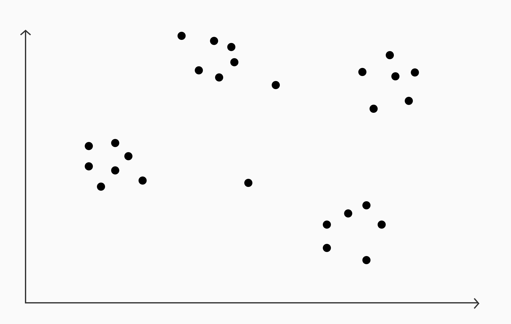
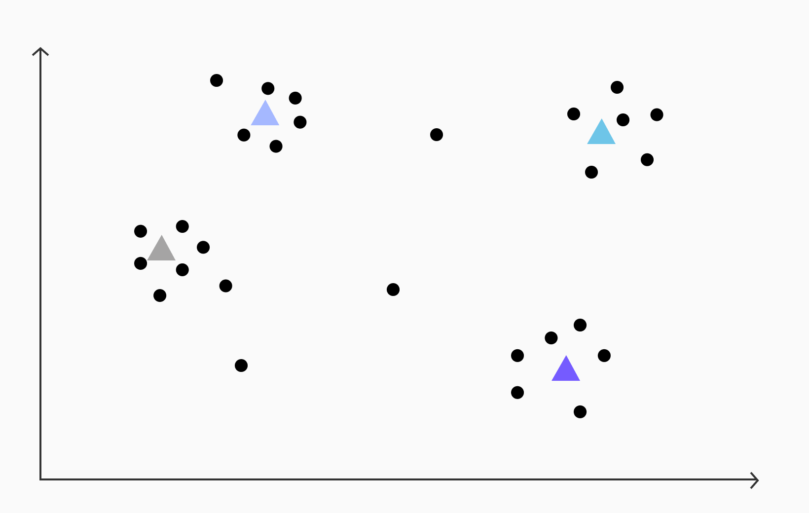
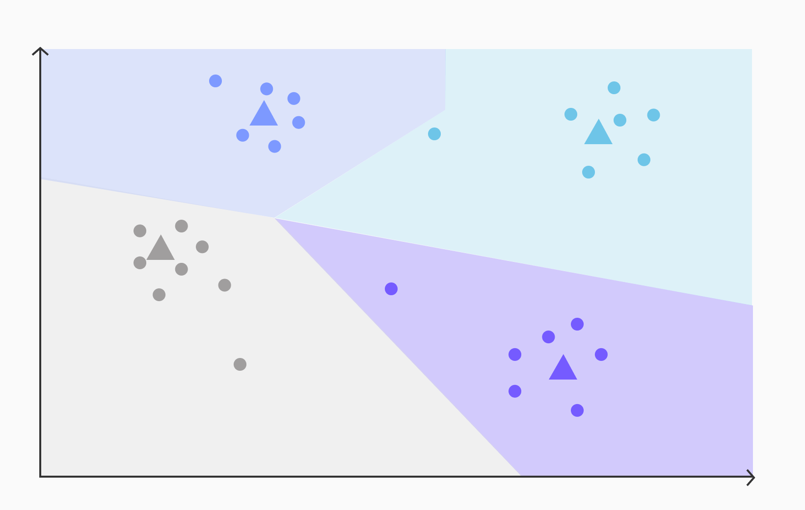
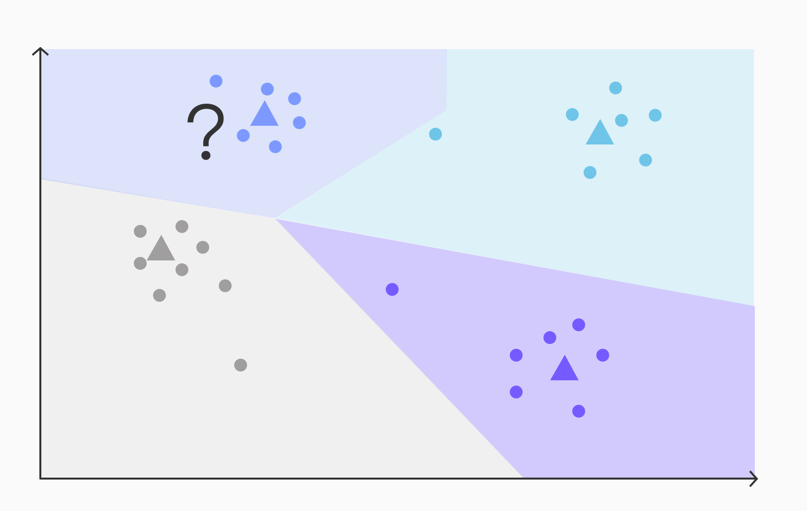
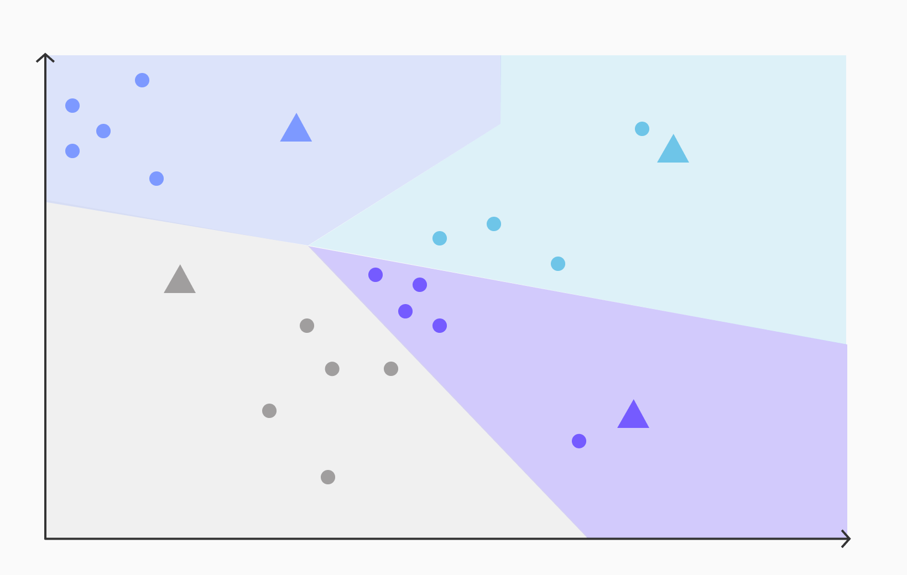

## 最近邻索引 (Nearest Neighbor Indexes)：Pgvector 中的 IVFFlat 索引是什么，它们如何工作   
       
### 作者       
digoal       
       
### 日期       
2025-12-02       
       
### 标签       
PostgreSQL , 语义搜索 , 向量搜索 , embedding , 倒排向量索引 , Ivfflat , 量化 , rabitq , sbq , 二值量化 , 相关性 , 相似性 , 召回率     
       
----       
       
## 背景    
这篇文章翻译自 tigerdata, 可作为了解 Ivfflat 倒排向量索引原理的入门文章.    
- https://www.tigerdata.com/blog/nearest-neighbor-indexes-what-are-ivfflat-indexes-in-pgvector-and-how-do-they-work    
   
内容如下   
```   
01 IVFFlat 索引是什么？(What Are IVFFlat Indexes?)   
02 为什么要在 Pgvector 中使用 IVFFlat 索引 (Why Use the IVFFlat Index in Pgvector)   
03 IVFFlat 索引在 pgvector 中如何工作 (How the IVFFlat Index Works in pgvector)   
04 Pgvector IVFFlat 实现的参数 (Parameters for Pgvector's IVFFlat Implementation)   
05 在 Pgvector 中使用 IVFFlat (Using IVFFlat in Pgvector)   
06 总结 (Summing It Up)   
```   
   
ChatGPT、OpenAI 和大语言模型（**LLMs**，Large Language Models）应用的日益普及，将**近似最近邻搜索**（**ANN**，Approximate Nearest Neighbor search）的概念推向了前沿，并由于**嵌入**（**Embeddings**，即向量化表示）的使用( https://platform.openai.com/docs/guides/embeddings )，重新点燃了人们对向量数据库的兴趣。嵌入是短语的数学表示，它将**语义含义**（semantic meaning）捕获为一组数值向量。   
   
这种表示法之所以引人入胜且实用，是因为含义相似的短语将具有相似的向量表示，这意味着它们各自向量之间的距离会很小。我们最近讨论了这些嵌入的一个应用：**检索增强生成**（Retrieval-Augmented Generation） ( https://www.tigerdata.com/blog/postgresql-as-a-vector-database-create-store-and-query-openai-embeddings-with-pgvector/ ) —— 用未经训练的知识来增强基础 LLM——但它还有许多其他应用。   
   
**语义相似度搜索 (Semantic similarity search)**   
   
嵌入的一个常见应用正是**语义相似度搜索**（Semantic similarity search） ( https://en.wikipedia.org/wiki/Semantic_search )。这种方法的基本概念是：如果我有一个包含各种短语的知识库，并且我收到了用户的一个问题，我可以通过找到与用户查询最相似的数据来定位知识库中最相关的信息。   
   
这与**词汇或全文搜索**（lexical or full-text search）形成对比，后者只返回查询的精确匹配项。这项技术最了不起的地方在于，由于嵌入表示的是短语的语义，而非其具体的措辞，因此即使信息是用完全不同的词语表达的，我也能找到相关的信息！   
   
**大规模下的速度挑战 (The challenge of speed at scale)**   
   
语义相似度搜索涉及为用户的提问计算一个嵌入，然后在我的知识库中搜索，以找到与该问题最相关的 **K** 个项目——即其嵌入与问题嵌入最接近的 **K** 个项目。然而，当处理大型知识库时，高效、快速地执行此搜索变得至关重要。在向量数据库领域，这个问题被称为“**查找 k 个最近邻**”（**KNN**，Finding the k nearest neighbors） ( https://en.wikipedia.org/wiki/K-nearest_neighbors_algorithm )。   
   
本文讨论了一种在使用 PostgreSQL 和 pgvector ( https://www.timescale.com/ai ) 存储向量嵌入时提高搜索速度的方法：用于**近似最近邻搜索**（Approximate nearest neighbor search）的 **倒排文件平面**（**IVFFlat**，Inverted File Flat）算法 ( https://github.com/pgvector/pgvector#indexing )。我们将介绍 IVFFlat 的用途、工作原理，以及在 pgvector 中使用它的最佳实践，以实现对嵌入向量的快速相似度搜索。   
   
开始吧！   
   
PS：如果您正在寻找 PostgreSQL 上最快的向量搜索索引，请查阅 pgvectorscale 项目 ( https://www.tigerdata.com/blog/how-we-made-postgresql-as-fast-as-pinecone-for-vector-data/ )。     
   
或者 vectorchord , 都是不错的选择.     
   
图结构向量索引的搜索性能更好, 但是更新/删除时的性能更差, build索引也需要耗费更多时间, 当向量记录数较大时, 并且对搜索性能要求更高, 建议选择hnsw, diskann等图结构索引.   
   
ivfflat这种倒排索引, 要提升性能的话, 可考虑多层级结构(可大幅度减少搜索时需要计算的向量个数), 而不是仅仅一个层级, 参考 vectorchord 项目.     
   
-----   
   
### IVFFlat 索引是什么？ (What Are IVFFlat Indexes?)   
   
**IVFFlat 索引**，全称为 **带平面压缩的倒排文件**（**I**nverted **F**ile with **F**lat compression），是 PostgreSQL 的 pgvector 扩展中使用的一种向量索引，用于加速相似度搜索，以找到接近给定查询的向量。这种索引类型使用**近似最近邻搜索**（**ANNS**，Approximate nearest neighbor search）来提供快速搜索。   
   
这些索引的工作原理是将向量划分为多个列表，称为**簇**（clusters）。每个簇代表一个相似向量的区域，并构建一个**倒排索引**（inverted index）来将每个区域映射到其对应的向量。当一个查询到来时，会识别出离查询最近的簇，并仅搜索这些簇中的向量。因此，这种方法通过排除所有不接近查询的簇中的向量，显著减少了相似度搜索的范围。   
   
-----   
   
### 为什么要在 Pgvector 中使用 IVFFlat 索引 (Why Use the IVFFlat Index in Pgvector)   
   
搜索 k 个最近邻对于 PostgreSQL 来说并不是一个新问题。PostGIS（一个用于处理位置数据的 PostgreSQL 扩展）将其数据点存储为二维向量（经度和纬度）。定位附近的地点在该领域是一个关键查询。   
   
PostGIS 通过采用一种名为 **R 树**（**R-Tree**）的索引来解决这一挑战，该索引可以为 k 个最近邻查询产生精确的结果。类似的技术，如 **KD 树**（**KD-Trees**）和 **球树**（**Ball Trees**），也用于其他数据库中的此类搜索。   
   
**“维度灾难” (The curse of dimensionality)**   
   
然而，有一个问题。当处理大于约 10 个维度的数据时，由于“**维度灾难**”（The curse of dimensionality），这些方法就会失效。 警钟敲响！本质上，当你增加更多维度时，可用空间呈指数级增长，导致数据呈指数级稀疏。这种密度的降低使得现有的依赖于空间划分的索引技术（如前面提到的 R 树、KD 树和球树）变得无效。（想了解更多，我建议观看这两个视频：1、2）。   
   
鉴于嵌入通常包含一千多个维度（OpenAI 的嵌入有 1,536 个维度），因此必须开发新的技术。目前尚无已知的精确算法可以高效地在如此**高维空间**（high-dimensional spaces）中搜索。不过，有出色的**近似算法**（approximate algorithms）属于**近似最近邻算法**（approximate nearest neighbor algorithms）的范畴。存在许多此类算法，但在本文中，我们将深入研究 pgvector 提供的 **倒排文件平面**（Inverted File Flat）或 **IVFFlat** 算法。   
   
-----   
   
### IVFFlat 索引在 pgvector 中如何工作 (How the IVFFlat Index Works in pgvector)   
   
#### IVFFlat 如何划分空间 (How IVFFlat divides the space)   
   
为了直观地理解 IVFFlat 的工作原理，让我们考虑一组表示在二维空间中的向量作为以下点：   
   
   
   
*一组表示为二维空间中的点的向量*   
   
在 IVFFlat 算法中，第一步涉及对向量应用 **k-均值聚类**（**k-means clustering**）以找到**簇质心**（cluster centroids）。对于给定的向量，假设我们执行 k-均值聚类并识别出四个簇，具有以下质心。   
   
   
   
*k-均值聚类后，我们识别出由彩色三角形表示的四个簇*   
   
计算出质心后，下一步是将每个向量分配给其最近的质心。这是通过计算向量与每个质心之间的距离，并选择距离最小的质心作为最接近的质心来完成的。这个过程概念上将空间中的每个点根据接近度映射到最近的质心。   
   
通过建立这种映射，空间被划分成围绕每个质心的不同区域（从技术上讲，这种划分被称为 **沃罗诺伊图**，**Voronoi Diagram**） ( https://en.wikipedia.org/wiki/Voronoi_diagram )。每个区域代表具有相似特征或语义含义相近的向量簇。   
   
这种划分使得在后续搜索操作中能够高效地组织和检索近似最近邻，因为同一区域内的向量比不同区域的向量更可能相似。   
   
   
   
*将每个向量分配给其最近质心的过程概念上将空间划分为围绕每个质心的不同区域*   
   
#### 在 pgvector 中构建 IVFFlat 索引 (Building the IVFFlat index in pgvector)   
   
IVFFlat 接着创建一个**倒排索引**（inverted index） ( https://en.wikipedia.org/wiki/Inverted_index )，将每个质心映射到相应区域内的一组向量。用伪代码表示，该索引可以如下表示：   
   
```   
inverted_index = {   
  centroid_1: [vector_1, vector_2, ...],   
  centroid_2: [vector_3, vector_4, ...],   
  centroid_3: [vector_5, vector_6, ...],   
  ...   
}   
```   
   
这里，每个质心充当倒排索引中的一个键，相应的值是属于该质心关联区域的向量列表。这种索引结构允许在执行相似度搜索时高效地检索一个区域内的向量。   
   
#### 在 pgvector 中搜索 IVFFlat 索引 (Searching the IVFFlat index in pgvector)   
   
假设我们有一个查询，用于查找一个由问号表示的向量的最近邻，如下所示：   
   
   
   
*我们想找到由问号表示的向量的最近邻*   
   
要使用 IVFFlat 查找近似最近邻，该算法基于一个假设：最近的向量将位于与查询向量相同的区域内。基于此假设，IVFFlat 采用以下步骤：   
   
1.  计算查询向量（红色问号）与索引中每个质心之间的距离。   
2.  选择距离最小的质心作为最接近查询的质心（本例中为蓝色质心）。   
3.  从倒排索引中检索与最接近质心对应的区域相关联的向量。   
4.  计算查询向量与检索到的集合中每个向量之间的距离。   
5.  选择距离最小的 K 个向量作为查询的**近似最近邻**（approximate nearest neighbors）。   
   
在 IVFFlat 中使用索引通过将搜索限制在与最接近质心关联的区域，从而加速了搜索过程。这导致在搜索过程中需要检查的向量数量显著减少。具体来说，如果我们有 C 个簇（质心），平均而言，我们可以将搜索的向量数量减少 **1/C** 的系数。   
   
#### 在边界进行搜索 (Searching at the edge)   
   
最近的向量将在与查询向量相同的区域中找到的假设，可能会在 IVFFlat 中引入**召回错误**（recall errors）。考虑以下查询：   
   
   
   
*当搜索向量空间两个区域边界上的点的最近邻时，IVFFlat 有时会出错*   
   
从目视检查来看，很明显，其中一个浅蓝色向量比任何深蓝色向量更接近查询向量，尽管查询向量落在了深蓝色区域内。这说明了假设最近的向量将始终在与查询向量相同的区域内，可能是一个潜在的错误。   
   
为了减轻这种类型的错误，一种方法是不仅搜索最接近质心的区域，还搜索接下来的 **R** 个最接近质心的区域。这种方法扩大了搜索范围，提高了找到**真实最近邻**（true nearest neighbors）的机会。   
   
在 pgvector 中，此功能通过 `probes` 参数实现，该参数指定了在搜索过程中要考虑的质心数量，如下所述。   
   
-----   
   
### Pgvector IVFFlat 实现的参数 (Parameters for Pgvector's IVFFlat Implementation)   
   
在 pgvector 的 IVFFlat 实现中，暴露了两个关键参数：**lists**（列表数）和 **probes**（探针数）。   
   
#### pgvector 中的 Lists 参数 (Lists parameter in pgvector)   
   
`lists` 参数决定了在索引构建过程中创建的簇的数量（之所以称为 lists，是因为每个质心在其区域中都有一个向量列表）。增加此参数会减少每个列表中的向量数量，并导致更小的区域。   
   
它提供了以下需要权衡的因素：   
   
  * **更高的 `lists` 值**通过减少查询时的搜索空间来**加速查询**。   
  * 然而，它也会**缩小区域大小**，这可能会通过排除某些点而导致**更多召回错误**（recall errors）。   
  * 此外，在查询过程的第一步中，需要**更多距离比较**才能找到最接近的质心。   
   
以下是设置 `lists` 参数的一些建议：   
   
  * 对于行数少于一百万的数据集，使用 `lists = rows / 1000`。   
  * 对于行数多于一百万的数据集，使用 `lists = sqrt(rows)`。   
  * 通常建议至少有 10 个簇。   
   
#### pgvector 中的 Probes 参数 (Probes parameter in pgvector)   
   
`probes` 参数是一个**查询时参数**（query-time parameter），它决定了在查询过程中要考虑的区域数量。默认情况下，只搜索与最接近质心对应的区域。通过增加 `probes` 参数，可以搜索更多区域，以**提高召回率**（recall），但**代价是查询速度**。   
   
`probes` 参数的推荐值为 `probes = sqrt(lists)`。   
   
-----   
   
### 在 Pgvector 中使用 IVFFlat (Using IVFFlat in Pgvector)   
   
#### 创建索引 (Creating an index)   
   
创建索引时，建议表中有**现有数据**，因为 **k-均值**（k-means）将利用这些数据来推导簇的质心。   
   
pgvector 中的索引提供了三种不同的方法来计算向量之间的距离：**L2**（欧几里得距离）、**内积**（inner product）和**余弦**（cosine）。在索引创建和查询操作中，选择相同的方法至关重要。下表说明了查询操作符及其对应的索引方法：   
   
| 距离类型 (Distance type) | 查询操作符 (Query operator) | 索引方法 (Index method) |   
| :--- | :--- | :--- |   
| **L2 / 欧几里得** (Euclidean) | `<->` | `vector_l2_ops` |   
| **负内积** (Negative Inner product) | `<#>` | `vector_ip_ops` |   
| **余弦** (Cosine) | `<=>` | `vector_cosine_ops` |   
   
**注意：** OpenAI 建议为其嵌入使用**余弦距离**（cosine distance）。   
   
要在 pgvector 中使用 IVFFlat 创建索引，您可以使用以下形式的语句：   
   
```sql   
CREATE INDEX ON <table name> USING ivfflat (<column name> <index method>) WITH (lists = <lists parameter>);   
```   
   
将 `<table name>` 替换为您的表名，将 `<column name>` 替换为包含向量类型的列名。   
   
例如，如果我们的表名为 `embeddings`，并且我们的嵌入向量位于名为 `embedding` 的列中，我们可以按如下方式创建 IVFFlat 索引：   
   
```sql   
CREATE INDEX ON embeddings USING ivfflat (embedding vector_cosine_ops) WITH (lists = 100);   
```   
   
这是一个简单的 Python 函数，您可以使用它来创建具有正确 `lists` 和 `probes` 参数的 IVFFlat 索引，如上所述：   
   
```python   
def create_ivfflat_index(conn, table_name, column_name, query_operator="<=>"):    
    index_method = "invalid"   
    if query_operator == "<->":   
        index_method = "vector_l2_ops"   
    elif query_operator == "<#>":   
        index_method = "vector_ip_ops"   
    elif query_operator == "<=>":   
        index_method = "vector_cosine_ops"   
    else:   
        raise ValueError(f"unrecognized operator {query_operator}")   
   
    with conn.cursor() as cur:   
        cur.execute(f"SELECT COUNT(*) as cnt FROM {table_name};")   
        num_records = cur.fetchone()[0]   
   
        num_lists = num_records / 1000   
        if num_lists < 10:   
            num_lists = 10   
        if num_records > 1000000:   
            num_lists = math.sqrt(num_records)   
   
        cur.execute(f'CREATE INDEX ON {table_name} USING ivfflat ({column_name} {index_method}) WITH (lists = {num_lists});')   
        conn.commit()   
```   
   
#### 查询 (Querying)   
   
只要存在 `ORDER BY` 形式为 `column <query operator> <some pseudo-constant vector>` 并伴随 `LIMIT k;`，就可以使用索引。   
   
**一些示例 (Some examples)**   
   
获取与常量向量最接近的两个向量：   
   
```sql   
SELECT * FROM my_table ORDER BY embedding_column <=> '[1,2]' LIMIT 2;   
```   
   
这是在使用 LLM 进行**检索增强生成**（retrieval augmented generation）时的常见用法模式，我们找到在语义含义上与用户查询最接近的嵌入向量。在这种情况下，常量向量将是代表用户查询的嵌入向量。   
   
您可以在我们的指南中看到一个示例：使用 pgvector 创建、存储和查询 OpenAI 嵌入，我们在其中使用此 Python 函数从数据库中查找与给定用户查询最相似的三个文档：   
   
```python   
# Helper function: Get top 3 most similar documents from the database   
def get_top3_similar_docs(query_embedding, conn):   
    embedding_array = np.array(query_embedding)   
    # Register pgvector extension   
    register_vector(conn)   
    cur = conn.cursor()   
    # Get the top 3 most similar documents using the KNN <=> operator   
    cur.execute("SELECT content FROM embeddings ORDER BY embedding <=> %s LIMIT 3", (embedding_array,))   
    top3_docs = cur.fetchall()   
    return top3_docs   
```   
   
获取与某一行最接近的向量：   
   
```sql   
SELECT * FROM my_table WHERE id != 1 ORDER BY embedding_column <=> (SELECT embedding_column FROM my_table WHERE id = 1) LIMIT 2;   
```   
   
**提示：** PostgreSQL 使用索引的能力并不能保证它的使用！**基于成本的规划器**（cost-based planner）会评估查询计划，并可能确定**顺序扫描**（sequential scan）或不同的索引对于特定查询更有效。您可以使用 `EXPLAIN` 命令查看所选的执行计划。要测试使用索引的可行性，您可以修改规划器成本参数，直到实现所需的计划。对于小型数据集，将 `enable_seqscan = 0` 可以特别有利于测试可行性，因为它避免了顺序扫描。   
   
要调整 `probes` 参数，您可以设置 `ivfflat.probes` 变量。例如，要将其设置为 '5'，请在运行查询之前执行以下语句：   
   
```sql   
SET ivfflat.probes = 5;   
```   
   
#### 处理数据变化 (Dealing with data changes)   
   
随着您的数据通过插入、更新和删除而演变，IVFFlat 索引将相应更新。新向量将被添加到索引中，而不再使用的向量将被移除。   
   
然而，**聚类质心**（clustering centroids）将**不会**更新。随着时间的推移，这可能导致初始在索引创建时建立的聚类不再准确地代表数据。这可以如下可视化：   
   
   
   
*随着数据从索引中插入或删除，如果不重建索引，pgvector 中的 IVFFlat 索引可能会由于聚类质心不再很好地拟合数据而返回不正确的近似最近邻*   
   
要解决此问题，唯一的解决方案是**重建索引**（rebuild the index）。   
   
关于此问题，这里有两个重要要点：   
   
1.  一旦您拥有了所有想要在其中引用的**代表性数据**（representative data），就构建索引。这与大多数可以在空表上构建的索引不同。   
2.  建议**定期重建索引**。   
   
重建索引时，强烈建议使用 **`CONCURRENTLY` 选项**（并发选项）以避免干扰正在进行的操作。   
   
因此，要重建索引，请在 cron job 中运行以下命令：   
   
```sql   
REINDEX INDEX CONCURRENTLY <index name>;   
```   
   
-----   
   
### 总结 (Summing It Up)   
   
pgvector 中的 IVFFlat 算法为像**嵌入**（embeddings）这样的**高维数据**（high-dimensional data）上的**近似最近邻搜索**（approximate nearest neighbor search）提供了一个高效的解决方案。它的工作原理是将相似的向量**聚类**（clustering）到区域中，并构建一个**倒排索引**（inverted index）来将每个区域映射到其向量。这使得查询能够集中在数据的一个子集上，从而实现快速搜索。通过调整 `lists` 和 `probes` 参数，IVFFlat 可以平衡数据集的速度和**准确性**（accuracy）。   
   
总而言之，IVFFlat 使 PostgreSQL 能够对复杂数据执行快速**语义相似度搜索**（semantic similarity search）。通过简单的查询，应用程序可以在数百万个高维向量中找到查询向量的最近邻。对于**自然语言处理**（natural language processing）、**信息检索**（information retrieval）等领域，IVFFlat 是一个引人注目的解决方案。通过了解 IVFFlat 如何将向量空间划分为区域并构建其倒排索引，您可以优化其性能以满足您的需求，并在其之上构建强大的应用程序。   
   
✨ **进一步学习的资源 (Resources for further learning):** 既然您对 pgvector 中的 IVFFlat 索引有了更多了解，这里有一些资源可供您进一步学习：   
   
  * 了解用于向量搜索的其他 PostgreSQL 索引，如 **HNSW**  ( https://www.tigerdata.com/blog/vector-database-basics-hnsw/ ) 。    
  * 了解我们如何使 PostgreSQL 的向量数据搜索速度与 Pinecone 一样快 ( https://www.tigerdata.com/blog/how-we-made-postgresql-as-fast-as-pinecone-for-vector-data/ )。   
  * 遵循我们的教程：使用 PostgreSQL 作为向量数据库创建、存储和查询 OpenAI 嵌入。    
  * 了解如何在 LangChain 中使用 pgvector 作为向量存储。   
  * 或者了解如何使用 pgvector 中的时间过滤器通过单个 SQL 查询来优化向量搜索查询。   
   
如果您正在为您的 AI 应用程序的向量、关系和时间序列数据寻找一个生产就绪的 PostgreSQL 数据库，请尝试 Timescale Cloud。   
   
        
#### [PolarDB 学习图谱](https://www.aliyun.com/database/openpolardb/activity "8642f60e04ed0c814bf9cb9677976bd4")
  
  
#### [PostgreSQL 解决方案集合](../201706/20170601_02.md "40cff096e9ed7122c512b35d8561d9c8")
  
  
#### [德哥 / digoal's Github - 公益是一辈子的事.](https://github.com/digoal/blog/blob/master/README.md "22709685feb7cab07d30f30387f0a9ae")
  
  
#### [About 德哥](https://github.com/digoal/blog/blob/master/me/readme.md "a37735981e7704886ffd590565582dd0")
  
  

  
