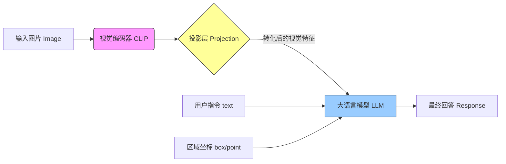
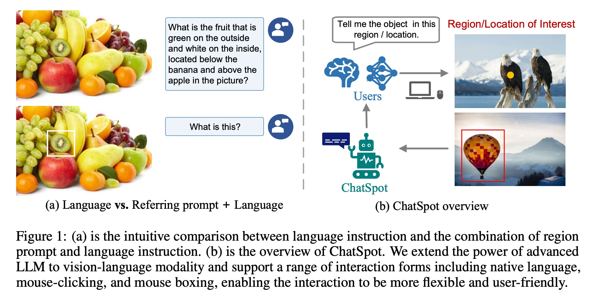
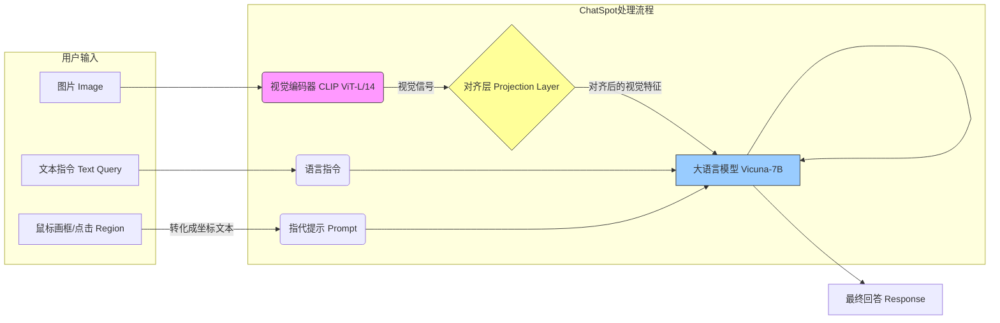
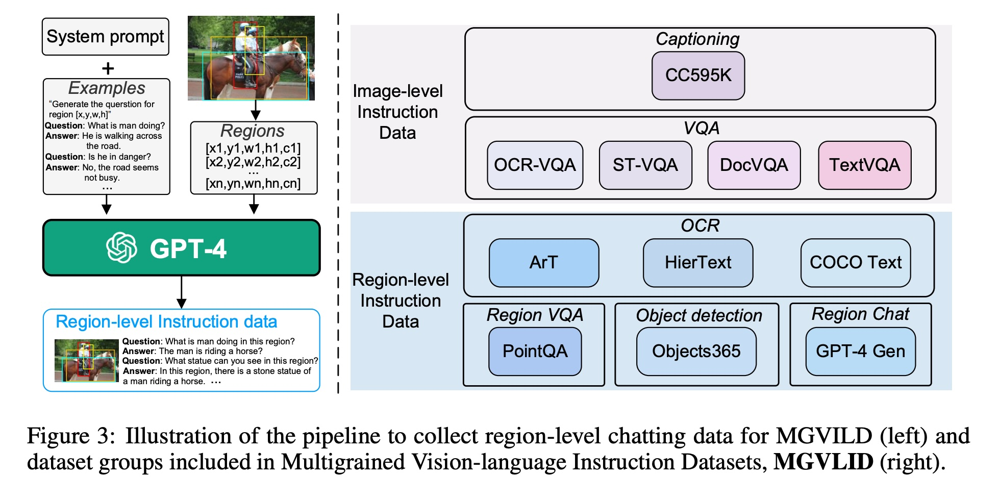
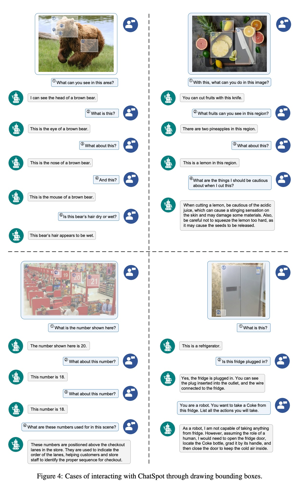

## AI论文解读 | ChatSpot: Bootstrapping Multimodal LLMs via Precise Referring Instruction Tuning
        
### 作者        
digoal        
        
### 日期        
2025-12-03        
        
### 标签        
PostgreSQL , PolarDB , DuckDB , AI , 论文解读        
        
----        
        
## 背景  
      
https://arxiv.org/pdf/2307.09474        
  
提示:          
```          
读懂《ChatSpot: Bootstrapping Multimodal LLMs via Precise Referring Instruction Tuning》这篇论文需要提前掌握哪些基础知识, 请使用中文通熟易懂的讲解这些基础知识, 可以引用论文中的图、表或使用Markdown支持的图形(text,mermaid等)增加解释性. 
  
使用中文通熟易懂的解读《ChatSpot: Bootstrapping Multimodal LLMs via Precise Referring Instruction Tuning》这篇论文, 其中的关键内容请着重讲解, 可以引用论文中的图、表或使用Markdown支持的图形(text,mermaid等)增加解释性. 
  
提取《ChatSpot: Bootstrapping Multimodal LLMs via Precise Referring Instruction Tuning》这篇论文中的重要术语, 使用中文对这些术语进行通熟易懂的讲解, 可以引用论文中的图、表或使用Markdown支持的图形(text,mermaid等)增加解释性. 
```     
  
## 1 前置知识 
  
要读懂《ChatSpot: Bootstrapping Multimodal LLMs via Precise Referring Instruction Tuning》这篇论文，你需要理解它是如何让大模型不仅能“看图说话”，还能通过**鼠标点击或画框**来精确讨论图片中**某个区域**的。

为了让你轻松上手，我将基础知识分为五个核心板块进行通俗讲解，并结合论文中的架构图来辅助理解。

-----

### 1\. 什么是多模态大语言模型 (MLLM)？

**通俗解释：**
想象一个超级博学的“大脑”（LLM），它原本只懂文字（比如 GPT-3 或 LLaMA）。为了让它能看懂图片，我们需要给它装上一双“眼睛”（视觉编码器），并打通眼睛和大脑之间的神经（模态对齐）。
这篇论文中的 **ChatSpot** 就是这样一个拥有视觉能力的模型，属于 **端到端（End-to-End）** 的架构。

  * **基础概念：**
      * **LLM (Large Language Model)：** 纯文本的大模型，如 ChatGPT。本文使用的是 **Vicuna-7B** ，它是基于 LLaMA 微调的开源模型。
      * **Multimodal (多模态)：** 指同时处理多种媒体信息（如：文本+图像）。

### 2\. 视觉编码器与 CLIP (给模型装上眼睛)

**通俗解释：**
计算机看不懂图片里的猫和狗，它只看得到一堆像素点。我们需要一个翻译官，把图片翻译成电脑能理解的一串数字（向量）。本文用的是 **CLIP ViT-L/14** 。

  * **CLIP 的作用：** 它是一个被训练过能理解图片和文字对应关系的模型。在这篇论文里，它负责把用户上传的图片变成“视觉特征（Visual Tokens）”，喂给后面的大模型吃。

### 3\. 模态对齐与投影层 (打通视觉与语言的桥梁)

**通俗解释：**
CLIP 翻译出来的“视觉数字”和 LLM 脑子里的“文字数字”是两种不同的语言。为了让它们能对话，中间需要一个适配器。
这篇论文参考了 **LLaVA**  的做法，用了一个简单的**线性层（Linear Layer/MLP）**  作为“连接器”。

**Mermaid 图解 ChatSpot 架构 (基于论文 Figure 2 )：**  



  * **核心知识点：** 你需要理解图像通过编码器变成向量，再通过投影层调整形状，最后像普通的单词一样被输入进 LLM。

### 4\. 指令微调 (Instruction Tuning)

**通俗解释：**
光有大模型还不够，它可能只会“续写小说”。为了让它乖乖听话（比如：“请描述这张图”），我们需要用问答对（Q\&A）的数据集来特训它。
这篇论文的特训分为两个阶段 ：

1.  **第一阶段：** 冻结大脑，只训练“眼睛到大脑的连接神经”（投影层），让它学会看图。
2.  **第二阶段：** 解冻大脑，用更复杂的对话数据训练，让它学会根据指令完成特定任务。

### 5\. 精确指代与坐标表示 (Precise Referring) —— **这是本文的核心**

**通俗解释：**
以前的模型只能聊整张图。如果你想问“图中这只红色的杯子是什么？”，模型可能不知道你在指哪只。
这篇论文引入了 **Region of Interest (RoI)** 的概念。它允许用户画一个框或点一个点，模型就能知道你在问哪里。

  * **如何实现？**
      * **坐标归一化：** 无论图片多大，都把左上角当 (0,0)，右下角当 (1,1)。
      * **文本化坐标：** 具体的坐标 $[x_1, y_1, x_2, y_2]$ 被转化成特殊的文本 Token（例如 `<box>0.1, 0.2, 0.3, 0.4</box>`） 。
      * **提示 (Prompting)：** 将这些坐标像文字一样插入到问题里，例如：“在这个区域 `<box>...</box>` 里有什么？”

**图解指代差异 (基于论文 Figure 1 )：**  

| 传统交互 (Language-only) | ChatSpot 交互 (Referring Prompt) |
| :--- | :--- |
| **用户：** “图中香蕉下面、苹果上面的那个外绿内白的水果是什么？” | **用户：** (鼠标画个框) + “这个区域是什么？” |
| **痛点：** 描述太费劲，容易产生歧义。 | **优势：** 直观、精确、高效。 |

-----

### 总结：阅读路线图

当你阅读这篇论文时，请带着以下认知：

1.  **架构基础：** 它是一个 **CLIP + LLaMA/Vicuna** 的组合，中间有个简单的连接层。
2.  **核心创新：** 它解决的是“怎么告诉模型我看的是图片的哪一部分”这个问题。
3.  **方法论：** 它通过把**坐标变成文字**，让 LLM 能理解空间位置，并通过专门构造的数据集（MGVLID ）教会模型理解这些坐标。

如果你对以上任何一个概念（如 Transformer, Embedding, Fine-tuning）感到陌生，建议先询问我具体细节，然后再深入阅读论文。
  
## 2 解读论文 
  
这篇论文介绍了一个名为 **ChatSpot** 的多模态大语言模型（MLLM）。为了让你轻松读懂，我将它比作一个不仅能“看图说话”，还能通过“手指”与你互动的智能助手。

以下是论文的核心解读，分为四个关键部分： **解决的问题**、**核心原理**、**如何训练**以及**它能做什么**。

-----

### 1\. 核心痛点：为什么我们需要 ChatSpot？

**现状：**
目前的大多数多模态模型（如早期的 LLaVA 或 MiniGPT-4）只能进行“全图对话”。也就是说，你发一张图，只能用文字问它问题。

**问题：**
如果图片很复杂（比如上面有几十种水果），你想问其中某一个特定的苹果，光靠文字描述会非常费劲（例如：“那个在香蕉下面、梨子左边的红苹果是什么？”）。

**解决方案：**
ChatSpot 引入了 **精确指代指令（Precise Referring Instruction）** 。它允许用户通过 **鼠标点击（Point）** 或 **画框（Box）** 来告诉模型：“我问的是这一块区域。” 。

-----

### 2\. 核心原理：它是怎么“看懂”你指哪里的？

这是论文最关键的技术创新点。模型本身只懂文本（Token），不懂鼠标的坐标。ChatSpot 发明了一种方法，把你的“鼠标动作”翻译成“外星语言”给模型听。

#### 2.1 坐标文本化 (Referring Prompt)

当你在图片上画了一个框，系统会捕捉到四个坐标点 $(x_1, y_1, x_2, y_2)$ 。
ChatSpot 会做两步处理 ：

1.  **归一化：** 把坐标变成 0 到 1 之间的小数。
2.  **文本化：** 把这些数字变成特殊的文本符，嵌入到你的问题里。

**举个例子：**

  * **你的操作：** 在猫的脸上画了个框。
  * **你的问题：** “这是什么？”
  * **模型实际收到的输入：**
    `Given an image <image>. What is this? <box>0.12, 0.34, 0.56, 0.78</box>`

#### 2.2 模型架构 (The Architecture)

ChatSpot 的“身体构造”非常简洁，采用了端到端（End-to-End）的设计 。



  * **眼睛 (Image Encoder):** 使用 CLIP 模型提取图片特征 。
  * **大脑 (LLM):** 使用 Vicuna-7B（基于 LLaMA 微调的模型）处理逻辑和语言 。
  * **神经连接 (Projection):** 一个简单的线性层，把“视觉信号”转换成“大脑”能懂的格式 。

-----

### 3\. 数据集构建：它是怎么学会“指哪打哪”的？

为了让模型学会理解坐标，作者发现现有的数据不够用，于是构建了一个名为 **MGVLID** (Multi-grained Vision-language Instruction-following Dataset) 的数据集 。

#### 数据构建流水线 (基于图 3) ：



作者利用了 **GPT-4** 强大的生成能力来制造训练数据。

1.  **原材料：** 拿现有的数据集（如 Visual Genome），里面有图片物体和对应的坐标框。
2.  **加工厂：** 把物体的名字和坐标喂给 GPT-4，让 GPT-4 编写一段“人类与 AI 关于这个区域的对话”。
3.  **成品：** 生成了约 120 万张图片和 300 万组问答对。

**数据分为两类：**

  * **全图级 (Image-level):** 描述整张图，用来打基础 。
  * **区域级 (Region-level):** 针对特定坐标框的问答，用来练神功 。

-----

### 4\. 关键能力展示：ChatSpot 能干什么？



论文通过定性和定量实验展示了 ChatSpot 的几大绝活（基于论文 Figure 4）：

#### 4.1 细粒度感知 (Region Perception)

它能区分物体极其细微的部分。

  * **场景：** 一张棕熊的照片。
  * **操作：** 框选熊的眼睛、鼻子、嘴巴。
  * **结果：** ChatSpot 能准确识别出“这是棕熊的眼睛”、“这是棕熊的鼻子”，甚至还能判断“熊的毛看起来是湿的” 。

#### 4.2 区域推理 (Special Reasoning)

它不仅能认出物体，还能结合常识进行推理。

  * **场景：** 一个插着电线的冰箱。
  * **问：** “这冰箱插电了吗？”
  * **答：** “是的，能看到插头插在插座上。”
  * **问：** “我是个机器人，我想拿可乐，该怎么做？”
  * **答：** 它能给出“打开门 -\> 抓住把手 -\> 关门”的具体步骤 。

#### 4.3 区域 OCR (文字识别)

它能读出特定区域里的文字。

  * **场景：** 超市收银台通道上方的数字牌。
  * **问：** “这个数字是多少？”
  * **答：** “18” 。

#### 4.4 鲁棒性 (Robustness)

作者做了一个有趣的测试：故意把用户画的框弄得不准一点（加入噪声），看看模型会不会瞎说。结果发现，即使框稍微偏一点，ChatSpot 依然能准确识别目标，说明它很“抗造” 。

-----

### 总结

《ChatSpot》这篇论文提出了一种通过**精确指代指令微调**的方法，成功让大模型拥有了“空间感知”能力。

  * **以前的模型：** 只能“泛泛而谈”（聊整张图）。
  * **ChatSpot：** 可以“有的放矢”（聊你鼠标指的地方）。

它通过简单的架构（CLIP+LLM）和精心构建的数据集（MGVLID），实现了用户通过鼠标点击、画框与 AI 进行精准交互的新范式 。
  
## 3 术语 
  
这篇论文《ChatSpot: Bootstrapping Multimodal LLMs via Precise Referring Instruction Tuning》涉及许多前沿的人工智能术语。为了帮助你深入理解，我将这些核心术语分为**核心概念、交互机制、模型架构、数据与现象**四个维度进行通俗讲解。

-----

### 一、 核心概念 (Core Concepts)

#### 1\. Precise Referring Instruction (精确指代指令)

  * **通俗解释：** 以前的模型像是一个眼神不太好的解说员，只能笼统地描述“整张图片”。而这个术语指的是给模型装上“手指”，让它可以听懂类似“**这个**方框里的东西是什么？”这样具体的指令 。
  * **作用：** 它是 ChatSpot 的核心能力，让多模态大模型（MLLM）不仅能理解全图，还能聚焦于用户感兴趣的特定区域（RoI）进行细粒度的互动 。
  * **对比图解 (基于 Figure 1)：**  
    ```mermaid
    graph TD
    A[用户需求] --> B{指令类型}
    B -- 传统指令 --> C["语言描述: 图片里香蕉下面那个绿皮白心的水果..."]
    B -- 精确指代指令 --> D["指代提示: 鼠标画框 + 这个区域是什么?"]
    C --> E[费劲, 容易有歧义]
    D --> F[精准, 高效, 直观]
    ```

#### 2\. End-to-End MLLM (端到端多模态大语言模型)

  * **通俗解释：** 这是一种“一站式”的模型架构。
      * **非端到端（Plugin-based）：** 像是一个包工头（LLM）指挥外面的几个临时工（专门做物体检测的小模型）干活，效率低且容易出错 。
      * **端到端（End-to-End）：** 整个模型是一个整体的大脑，视觉信号直接流进大脑，大脑直接输出结果。ChatSpot 就是这种类型，更加灵活且无缝 。

-----

### 二、 交互机制 (Interaction Mechanism)

#### 3\. Region of Interest (RoI) / Special Region (感兴趣区域/特殊区域)

  * **通俗解释：** 就是用户在图片上特别想了解的那一小块地方。用户可以通过鼠标点击（点）或拖拽（画框）来选定这个区域 。
  * **应用场景：** 比如在一张复杂的超市图片里，你只想知道“这个收银台上的数字 20 代表什么”，那个画着“20”的小方框就是 RoI 。

#### 4\. Referring Prompts & Coordinate Normalization (指代提示与坐标归一化)

  * **通俗解释：** 模型其实看不懂鼠标动作，它只认识数字和文字。ChatSpot 用了一套翻译机制：
    1.  **归一化 (Normalization)：** 不管图片多大，都把左上角当 (0,0)，右下角当 (1,1)。你画的框就被转换成类似 `[0.1, 0.2, 0.5, 0.6]` 的相对坐标 。
    2.  **文本化 (Tokenization)：** 把这些坐标变成类似文字的符号（Token），嵌入到你的问题里喂给模型 。
  * **流程图解：**
    ```text
    用户动作: 鼠标画框 
       ↓
    物理坐标: x=100, y=200 (假设图片 1000x1000)
       ↓
    归一化: x=0.1, y=0.2 
       ↓
    指代提示: "<box>0.1, 0.2...</box>" 
       ↓
    模型输入: "这个区域 <box>...</box> 里有什么?"
    ```

-----

### 三、 模型架构与数据 (Architecture & Data)

#### 5\. Modality-align Projector (模态对齐投影层)

  * **通俗解释：** 这是一个“翻译官”。
      * 图片的特征是“视觉语言”（Visual Tokens）。
      * 大模型（LLM）只懂“人类语言”。
      * 这个投影层（ChatSpot 中用的是一个简单的线性层/MLP）负责把视觉语言翻译成大模型能懂的格式，把它们连接起来 。

#### 6\. MGVLID (Multi-Grained Vision-Language Instruction-following Dataset)

  * **通俗解释：** 这是作者为了训练 ChatSpot 专门造的一个“教材库”。
  * **含义：** “多粒度视觉语言指令跟随数据集”。
      * **多粒度 (Multi-Grained)：** 既包含整张图的描述（粗粒度），也包含特定小框框里的对话（细粒度）。
      * **来源：** 结合了现有的数据集（如 Visual Genome），并利用 GPT-4 生成了大量高质量的问答对话 。
  * **组成 (基于 Figure 3)：**  
      * **Image-level Data:** 针对全图的问答（如“描述这张图”）。
      * **Region-level Data:** 针对特定坐标的问答（如“坐标 [x,y] 里的这个人在干嘛？”）。

-----

### 四、 现象与评估 (Phenomena & Evaluation)

#### 7\. Zero-shot Recognition (零样本识别)

  * **通俗解释：** 指模型在没有专门见过某些特定类别的训练数据的情况下，依然能认出它们的能力。
  * **论文中的表现：** 作者没有给模型专门训练 COCO 数据集里的分类标签，但 ChatSpot 依然能看着框框准确说出“这是个苹果”或“这是个键盘”，展示了强大的泛化能力 。

#### 8\. Region Referring Hallucination (区域指代幻觉)

  * **通俗解释：** 这是模型可能会犯的一种“看走眼”的错误。
  * **定义：** 当用户指着一个区域问“这是什么”，模型如果把**在这个区域旁边**的东西当成了答案，就叫“区域指代幻觉” 。
  * **举例：** 你框选了“人”，但因为旁边有条“狗”，模型错误地回答“这是一条狗”。
  * **结论：** 论文测试发现 ChatSpot 这种错误很少（只有约 2%），说明它眼神很准 。

#### 9\. Robustness (鲁棒性/抗干扰能力)

  * **通俗解释：** 指模型“皮实”的程度。
  * **实验：** 作者故意把用户画的框弄歪一点（加入噪声），看看模型会不会乱说。结果发现，即使框得不准，ChatSpot 依然能猜对你想问的是什么，说明它非常耐用 。
  
## 参考        
         
https://arxiv.org/pdf/2307.09474    
        
<b> 以上内容基于DeepSeek、Qwen、Gemini及诸多AI生成, 轻微人工调整, 感谢杭州深度求索人工智能、阿里云、Google等公司. </b>        
        
<b> AI 生成的内容请自行辨别正确性, 当然也多了些许踩坑的乐趣, 毕竟冒险是每个男人的天性.  </b>        
  
    
#### [PolarDB 学习图谱](https://www.aliyun.com/database/openpolardb/activity "8642f60e04ed0c814bf9cb9677976bd4")
  
  
#### [PostgreSQL 解决方案集合](../201706/20170601_02.md "40cff096e9ed7122c512b35d8561d9c8")
  
  
#### [德哥 / digoal's Github - 公益是一辈子的事.](https://github.com/digoal/blog/blob/master/README.md "22709685feb7cab07d30f30387f0a9ae")
  
  
#### [About 德哥](https://github.com/digoal/blog/blob/master/me/readme.md "a37735981e7704886ffd590565582dd0")
  
  

  
