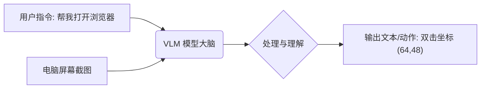
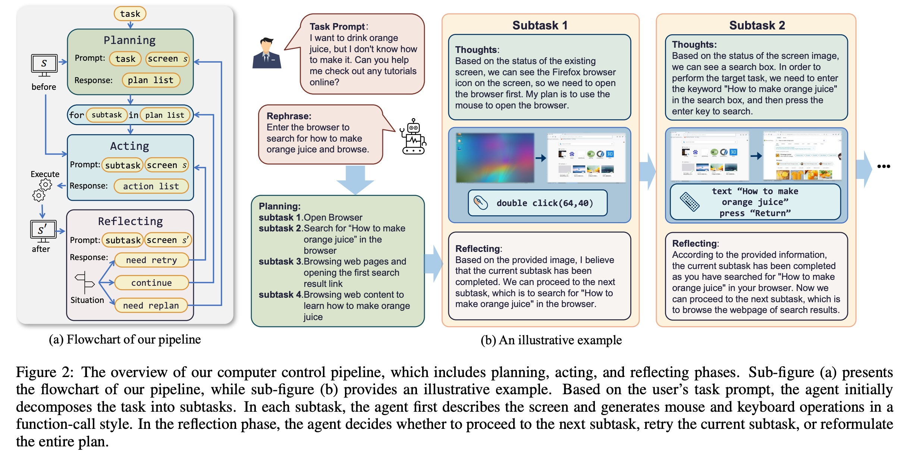
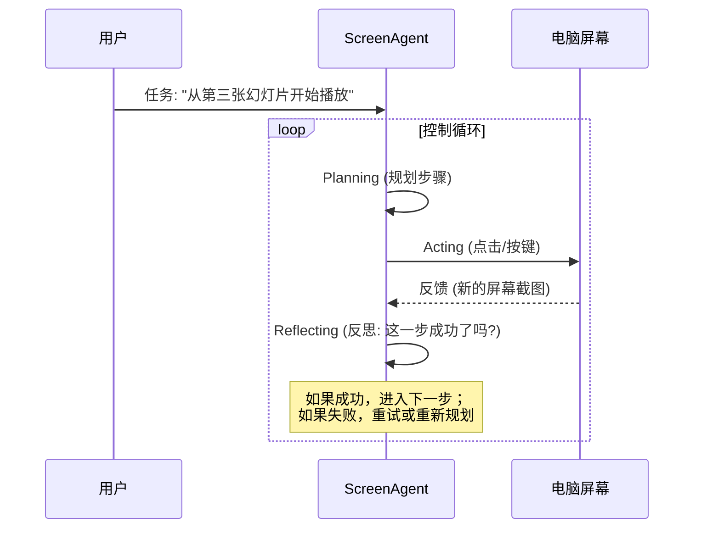
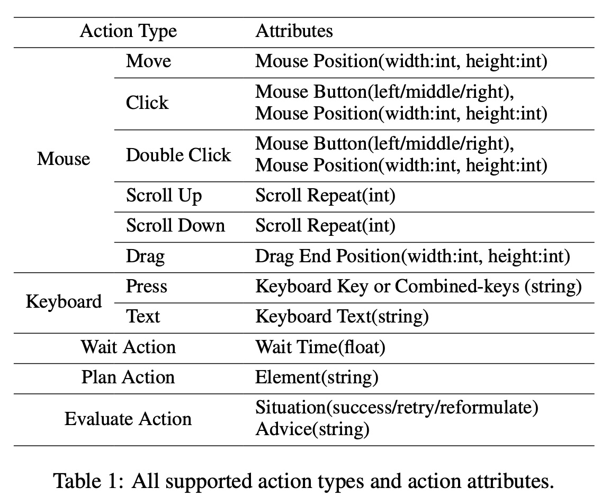
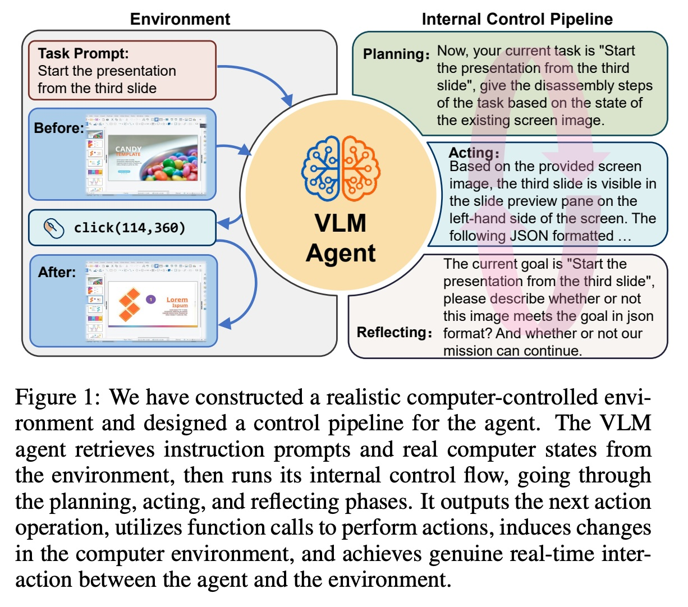
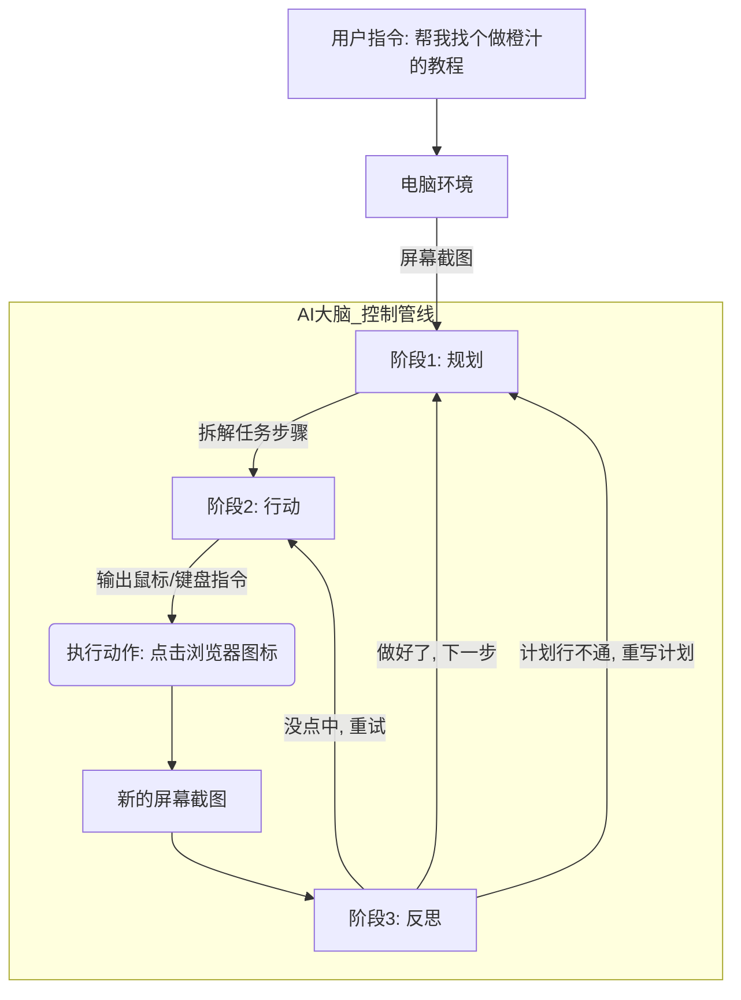
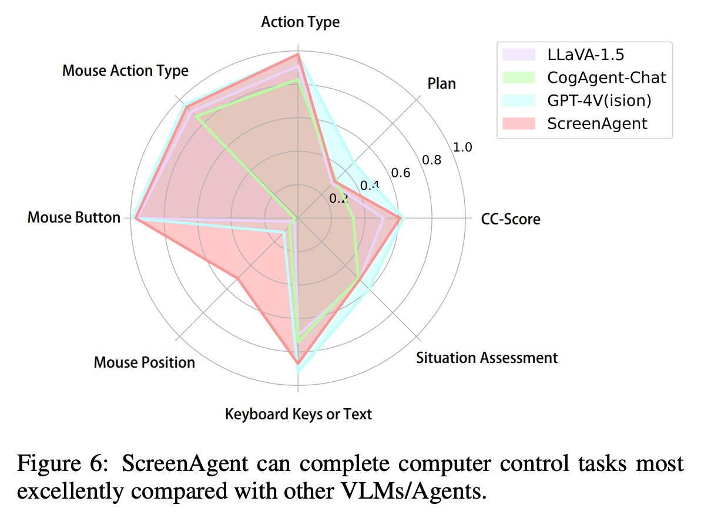
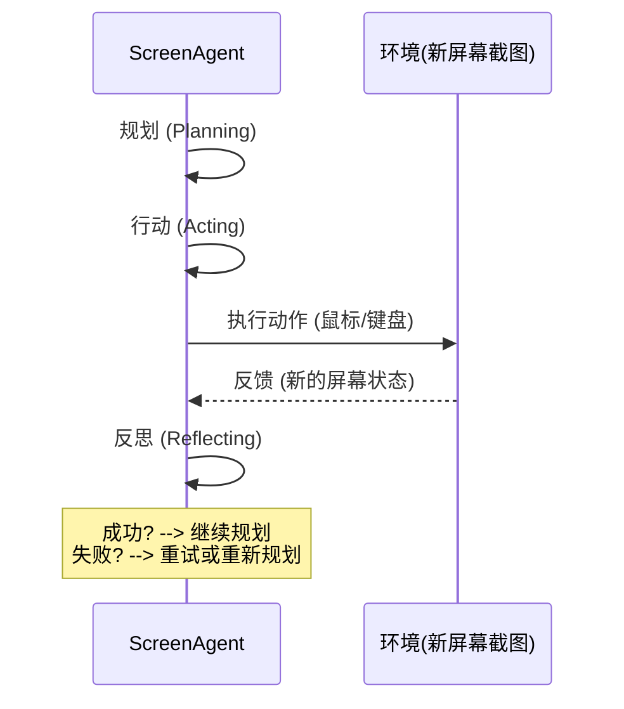

## AI论文解读 | ScreenAgent: A Vision Language Model-driven Computer Control Agent
        
### 作者        
digoal        
        
### 日期        
2025-12-03        
        
### 标签        
PostgreSQL , PolarDB , DuckDB , AI , 论文解读        
        
----        
        
## 背景  
      
https://arxiv.org/pdf/2402.07945        
  
提示:          
```          
读懂《ScreenAgent: A Vision Language Model-driven Computer Control Agent》这篇论文需要提前掌握哪些基础知识, 请使用中文通熟易懂的讲解这些基础知识, 可以引用论文中的图、表或使用Markdown支持的图形(text,mermaid等)增加解释性. 
  
使用中文通熟易懂的解读《ScreenAgent: A Vision Language Model-driven Computer Control Agent》这篇论文, 其中的关键内容请着重讲解, 可以引用论文中的图、表或使用Markdown支持的图形(text,mermaid等)增加解释性. 
  
提取《ScreenAgent: A Vision Language Model-driven Computer Control Agent》这篇论文中的重要术语, 使用中文对这些术语进行通熟易懂的讲解, 可以引用论文中的图、表或使用Markdown支持的图形(text,mermaid等)增加解释性. 
```     
  
## 1 前置知识 
  
要读懂《ScreenAgent: A Vision Language Model-driven Computer Control Agent》这篇论文，你需要理解它是如何让 AI 像人一样“看”着屏幕、“操作”电脑的。

这篇论文的核心在于结合了**视觉语言模型（VLM）与智能体（Agent）技术，并在一个交互式环境**中进行训练和评测。

以下是阅读该论文前需要掌握的 5 个关键基础知识模块，我会用通俗的语言配合图表进行讲解。

-----

### 1\. 核心大脑：视觉语言模型 (VLM)

**基础概念：**
传统的大语言模型（LLM，如早期的 GPT-3）只能“读”文字。而**VLM（Vision Language Model）** 是给模型装上了“眼睛”。它可以同时接收**图片**和**文字**作为输入，理解图片内容，并用文字回答或执行指令。

**在论文中的应用：**
ScreenAgent 需要“看”电脑屏幕截图，理解现在的状态（比如：网页打开了吗？按钮在哪里？），然后决定下一步怎么做 。论文中对比了 GPT-4V, LLaVA 和 CogAgent 等著名模型 。

**简单理解图示：**



> **注意：** 论文提到 CogAgent 尤其擅长 GUI（图形用户界面）的理解，这是因为它能处理高分辨率图像，看清屏幕上的小字和图标 。

-----

### 2\. 行为模式：智能体（AI Agent）与控制流

**基础概念：**
普通的 AI 是“你问我答”。**Agent（智能体）** 则是“你给目标，我自己想办法搞定”。它不仅能思考，还能使用工具（鼠标、键盘）去改变环境。

**在论文中的应用：**
这篇论文设计了一个类人的“思考-行动”循环，称为 **"Internal Control Pipeline" (内部控制管线)** 。这个管线分为三个阶段，正如论文 Figure 2 所示：    

  * **Planning (规划)** ：把大任务拆解成小步骤（例如：任务是“买巧克力”，第一步先“打开亚马逊”）。
  * **Acting (行动)** ：执行具体的鼠标点击或键盘输入。
  * **Reflecting (反思)** ：看一眼执行后的屏幕，判断刚才那步做对了吗？需要重试吗？ 。

**控制流可视化 (基于论文 Figure 2):**



-----

### 3\. 交互环境：VNC 与 动作空间 (Action Space)

**基础概念：**
AI 没有实体手，它怎么控制电脑？它需要通过**VNC (Virtual Network Computing)** 协议。这就像你在用 TeamViewer 或向日葵远程控制另一台电脑一样，只不过这里是 AI 在远程控制。

  * **状态空间 ( State Space $S$ )** ：指 AI 看到的“当前情况”，在这里就是**屏幕截图** 。
  * **动作空间 ( Action Space $A$ )** ：指 AI 能做的“所有动作的集合”。

**在论文中的应用：**
论文定义了一套具体的动作指令（见论文 Table 1 ）。为了让 AI 能操作，必须把动作变成代码格式（JSON Function Call）。    

**主要动作类型：**

  * **Mouse (鼠标)** : 移动 (Move)、点击 (Click)、双击 (Double Click)、拖拽 (Drag)、滚动 (Scroll)。
  * **Keyboard (键盘)** : 敲字 (Text)、按功能键 (Press, 如 Enter, Ctrl+C)。

> **例子：** AI 想点击屏幕左下角的“开始”菜单，它输出的代码不是“去点开始”，而是类似 `click(10, 760)` 的指令 。

-----

### 4\. 计算机视觉基础：定位与坐标 (Localization)

**基础概念：**
对于人类来说，说“点击那个红色的按钮”很简单。但对于计算机，这需要**定位 (Localization)** 能力。

  * **坐标 (Coordinates)** ：通常以屏幕左上角为原点 $(0,0)$ ，向右是 $x$ 轴（宽度），向下是 $y$ 轴（高度）。
  * **边界框 (Bounding Box)** ：用来框住一个按钮或图标的矩形区域。

**在论文中的应用：**
这是现有大模型（如 GPT-4V）的弱点，它们虽然知道“要点搜索框”，但经常给不出精准的像素坐标（例如 `(525, 120)`） 。
ScreenAgent 的一大贡献就是通过微调（Fine-tuning），让模型能输出非常精准的 $(x, y)$ 坐标，从而准确点击到按钮中心 。

**图解定位问题：**

```text
(0,0) --------------------------> X轴 (Width)
  |
  |      [ 搜索框 ]
  |      目标: 点击这里
  |      坐标: (525, 120)
  |
  |
  v
 Y轴 (Height)
```

*如果 AI 预测成 (530, 200)，可能就点到外面去了，这就是定位误差。*

-----

### 5\. 机器学习评估指标：BLEU, F1 与 CC-Score

**基础概念：**
训练好模型后，怎么知道它好不好？需要打分。

  * **BLEU**: 本来是用来给翻译打分的（看翻译的句子和标准答案重合多少）。在这里用来衡量 AI 输入的**文本**对不对 。
  * **F1 Score**: 衡量分类任务的准确率（既要准，又要全）。在这里用来衡量 AI 是否选对了**动作类型**（比如该“点击”时是不是选了“点击”，而不是“双击”） 。

**在论文中的应用：**
作者发现传统的指标不够用，因为操作电脑是一个**序列 (Sequence)** 过程（先点A，再点B，再输入C）。如果顺序错了，任务就失败了。
因此，论文提出了 **CC-Score (Computer Control Score)** 。

  * **通俗解释 CC-Score：** 就像老师批改解题步骤。不仅看最后答案对不对，还要看中间每一步（动作类型、鼠标位置、输入文本）是不是都跟标准答案（Golden Label）对得上 。

-----

### 总结：读这篇论文的思维导图

当你阅读时，可以把论文内容对应到这个框架中：

1.  **Who (谁在做)?** -\> **ScreenAgent** (基于 VLM 的智能体)。
2.  **Where (在哪做)?** -\> **Computer Control Environment** (通过 VNC 连接的 OS 界面)。
3.  **How (怎么做)?** -\> **Pipeline** (规划-行动-反思) + **Fine-tuning** (为了更准的坐标)。
4.  **How well (做得怎样)?** -\> **CC-Score** (自定义的评分标准) + **Benchmark** (与 GPT-4V 等对比)。

掌握这些，你就可以流畅地阅读这篇论文了。可以重点关注论文的 **Figure 1**（整体架构）和 **Figure 2**（工作流程细节）。      
  
## 2 解读论文 
  
这是一篇关于让 AI 像人类一样真正“操作”电脑的论文。简单来说，作者开发了一个名为 **ScreenAgent** 的智能体，它不仅能“看懂”你的电脑屏幕，还能直接控制鼠标和键盘来帮你完成各种任务（比如“帮我在亚马逊上买最便宜的巧克力”）。

以下是对这篇论文《ScreenAgent: A Vision Language Model-driven Computer Control Agent》的深度解读。

-----

### 1\. 核心目标：为什么要做 ScreenAgent？

现在的 AI（如 ChatGPT）虽然很聪明，但通常只能陪你聊天。如果你让它“帮我把这几张幻灯片删了”，它做不到，因为它没有“手”。

这篇论文的目标就是给 AI 装上“眼睛”和“手” ：

  * **眼睛**：通过视觉语言模型（VLM）看懂电脑屏幕截图。
  * **手**：通过模拟鼠标点击、键盘输入来操作电脑。
  * **大脑**：通过一个自动化的流程来规划任务、执行动作并自我反思。

-----

### 2\. 它是怎么工作的？（核心架构）

ScreenAgent 的工作流程非常像人类，作者设计了一个 **“规划 - 行动 - 反思” (Planning-Acting-Reflecting)** 的循环机制 。

#### 工作流程图解



1.  **规划 (Planning)** ：
    AI 看到屏幕，结合你的指令，把大任务拆解成小步骤。
      * *例子*：用户说“我想喝橙汁”，AI 规划：1. 打开浏览器；2. 搜索教程；3. 打开第一个链接 。
2.  **行动 (Acting)** ：
    AI 根据当前步骤，决定鼠标点哪里（精确的 x,y 坐标）或键盘敲什么字。
      * *技术细节*：动作被定义为 JSON 格式的代码，例如 `click(64,48)` 。
3.  **反思 (Reflecting)** ：
    这一步是亮点。动作执行后，AI 会看一眼新的屏幕，判断刚才那一下是不是成功了。
      * *如果成功*：继续下一步。
      * *如果失败*：比如网页没加载出来，它会决定重试 。

-----

### 3\. 为什么现有的 GPT-4V 做不到？

论文对比了 GPT-4V（目前最强的多模态模型之一）。结果发现：

  * **脑子好使**：GPT-4V 在“规划”任务上很强，知道该干什么。
  * **手太笨**：GPT-4V **无法给出精确的屏幕坐标**。它知道要点“搜索框”，但给出的坐标往往偏离目标，导致点在空地上 。

为了解决这个问题，作者做了两件大事： **造数据** 和 **特训模型**。

-----

### 4\. 关键贡献：ScreenAgent 数据集与特训

#### A. ScreenAgent Dataset (数据集)

作者收集了真实的人类操作电脑的数据。涵盖了 Linux 和 Windows 系统上的各种日常任务，比如办公、修图、玩游戏、写代码等 。

  * **规模**：包含 3000 多张截图和对应的操作指令 。
  * **特点**：真实、连续的操作序列。

#### B. 训练策略 (怎么把 AI 教会？)

作者使用了一个名为 **CogAgent** 的模型作为底座，然后分四个阶段“特训”它的定位能力（Curriculum Learning）：

| 阶段 | 训练内容 | 目的 |
| :--- | :--- | :--- |
| **1. 物体检测** | 使用 COCO 数据集 (找图片里的猫、狗等) | 让 AI 学会“看图找物”并画框  |
| **2. 界面元素** | 使用 Widget Captions (找按钮、图标) | 让 AI 熟悉软件界面的元素  |
| **3. 网页操作** | 使用 Mind2Web (网页上的点击任务) | 让 AI 学会网页浏览的基本操作  |
| **4. 真机实操** | 使用 **ScreenAgent Dataset** | 让 AI 学会真实的系统级操作和连续决策  |

通过这种循序渐进的训练，ScreenAgent 终于学会了**精确点击**。

-----

### 5\. 实验结果：谁更好用？

为了公平比较，作者发明了一个新的评分标准： **CC-Score (Computer Control Score)** ，专门用来给 AI 的操作打分，看它动作对不对、位置准不准 。

#### 核心对比结果 ：

  * **GPT-4V**：规划能力强，但定位太差。它经常拒绝给出坐标，或者给错。
  * **ScreenAgent (本文模型)** ：
      * **定位能力碾压 GPT-4V**：在鼠标点击位置的准确性上表现极好 。
      * **指令跟随能力**：和 GPT-4V 一样好，能乖乖输出 JSON 格式 。
      * **规划能力**：略弱于 GPT-4V（毕竟 GPT-4V 见多识广），但在具体操作执行上更靠谱 。

**雷达图总结 (基于论文 Figure 6):**    

```text
       规划能力 (Plan)
          ^
          |      GPT-4V (高)
          |    /
          |  /   ScreenAgent (中高)
          |/
<---------+---------> 点击精准度 (Mouse Position)
 ScreenAgent (极高)      GPT-4V (极低/无法完成)
          |
          |
          v
```

-----

### 6\. 总结

这篇论文的意义在于，它证明了**大模型不仅可以“聊天”，还可以经过训练变成一个能干活的“电脑操作员”** 。

  * **最大的突破**：解决了大模型“眼高手低”的问题——通过特训，让 AI 能精准地点击屏幕上的每一个小按钮。
  * **未来的想象**：以后你可能只需要对电脑说：“帮我把上周所有的发票整理到 Excel 里并发给财务”，ScreenAgent 这样的 AI 就能自动控制你的鼠标键盘，在几秒钟内搞定。
  
## 3 术语 
  
好的，要读懂《ScreenAgent: A Vision Language Model-driven Computer Control Agent》这篇论文，理解其中的关键技术术语是第一步。

以下是论文中最重要的核心术语，我将使用中文进行通俗易懂的讲解，并引用论文中的概念进行辅助说明。

-----

### 1\. Vision Language Model (VLM) 视觉语言模型

  * **中文解释：** 模型的“视觉+听力”大脑。它结合了处理**图像**的能力和处理**文本/语言**的能力。
  * **通俗理解：** 传统的大语言模型（LLM）只能“读”字，而 VLM 既能“看”图（理解屏幕截图），又能“听”和“说”话（理解指令、输出动作）。ScreenAgent 就是基于 VLM 来工作的。
  * **论文关联：** 论文中对比了 GPT-4V, LLaVA, CogAgent 等模型，这些都是 VLM 的代表。ScreenAgent 最终选择并改进了 **CogAgent** 作为其核心基础模型。

-----

### 2\. Agent (Intelligent Agent) 智能体

  * **中文解释：** 能够感知环境、进行思考、并根据目标自主做出行动的实体。
  * **通俗理解：** AI 的升级版。它不是简单的问答机器，而是一个能自主完成任务的“执行者”。你给它一个目标（例如“打开我的邮件”），它会自己决定并执行一系列动作（找到图标 → 点击图标）。
  * **论文关联：** ScreenAgent 就是一个专门用于计算机控制环境的智能体。它的智能体行为体现在下一条——“控制管线”中。

-----

### 3\. Automated Control Pipeline (规划-行动-反思) 自动化控制管线

  * **中文解释：** 智能体为了完成多步骤复杂任务而设计的一套标准、循环的工作流程。
  * **通俗理解：** 这是 AI 解决问题的“三段论”思考模式，模仿人类操作电脑时的心智过程。
  * **论文关联（重点）：** 这是 ScreenAgent 的“软件”核心，保证了它能连续、可靠地完成任务（如论文 Figure 2 所示）。   
      * **Planning (规划)** ：根据当前屏幕和目标，将任务分解成一个个小步骤。
      * **Acting (行动)** ：执行当前的步骤，输出一个具体的动作指令（例如点击、输入文本）。
      * **Reflecting (反思)** ：行动后，检查新的屏幕状态。判断上一步是否成功？需要重试？还是可以进入下一步？




-----

### 4\. Action Space (动作空间)

  * **中文解释：** 智能体被允许执行的所有可能动作的集合。
  * **通俗理解：** AI 的“工具箱”。它能做的事都列在里面了。
  * **论文关联：** 为了控制电脑，ScreenAgent 的动作空间被设计成一系列基于**鼠标**和**键盘**的原子操作（原子操作指不可再分的最小动作单位）。
      * **鼠标动作**：`Click(x, y)`（点击坐标）、`Scroll`（滚动）、`Drag`（拖拽）。
      * **键盘动作**：`Text("输入文本")`（输入文字）、`Press(Key)`（按功能键，如 Enter/Ctrl）。

-----

### 5\. Localization (定位) / Precise Coordinate (精确坐标)

  * **中文解释：** 确定屏幕上特定目标（如按钮、输入框）精确位置的能力。
  * **通俗理解：** 计算机视觉中的“瞄准”能力。对于 AI 来说，知道“要点这个按钮”远远不够，它必须知道按钮中心在屏幕的哪个**像素坐标**上（例如 `(525, 120)`）。
  * **论文关联（关键难点）：** 论文指出，像 GPT-4V 这样的通用 VLM 最大的弱点就是定位能力差，给出的坐标往往不准。ScreenAgent 通过专门的**多阶段训练（Curriculum Learning）** ，极大地提高了坐标输出的精确度，这是它能成功操作电脑的关键。

-----

### 6\. ScreenAgent Dataset (ScreenAgent 数据集)

  * **中文解释：** 论文作者专门收集并标注的、用于训练 AI 学习电脑操作的真实数据集合。
  * **通俗理解：** 一本给 AI 学习“如何操作电脑”的教科书。它记录了人类在执行各种日常任务时（如写文档、浏览网页、编辑图片等）的**屏幕截图**和对应的**操作序列**。
  * **论文关联：** 这个数据集的构建是为了弥补现有通用数据集（如 Mind2Web 仅限网页操作）的不足，使其能够覆盖整个操作系统级别的交互。高质量的标注数据是训练出精确 VLM 的基础。

-----

### 7\. CC-Score (Computer Control Score) 电脑控制评分

  * **中文解释：** 论文作者提出的一种新的评估指标，专门用来衡量 AI 在完成计算机控制任务时的表现。
  * **通俗理解：** 传统的 AI 评分（如 BLEU, F1）只看“答案”或“一句话”对不对。但操作电脑是**连续的**。如果 AI 走错了一步，即使后续步骤都对，任务也失败了。CC-Score 就像一个苛刻的老师，它不仅检查你每一步的**动作类型**（是点击还是输入），还要检查你的**坐标位置**（点击准不准），并考虑整个**动作序列**的正确性。
  * **论文关联：** CC-Score 的使用保证了对 ScreenAgent 及其竞争对手（如 GPT-4V）的评估是公正和全面的，因为它惩罚了任何步骤中的不准确和错误。
  
## 参考        
         
https://arxiv.org/pdf/2402.07945    
        
<b> 以上内容基于DeepSeek、Qwen、Gemini及诸多AI生成, 轻微人工调整, 感谢杭州深度求索人工智能、阿里云、Google等公司. </b>        
        
<b> AI 生成的内容请自行辨别正确性, 当然也多了些许踩坑的乐趣, 毕竟冒险是每个男人的天性.  </b>        
  
    
#### [PolarDB 学习图谱](https://www.aliyun.com/database/openpolardb/activity "8642f60e04ed0c814bf9cb9677976bd4")
  
  
#### [PostgreSQL 解决方案集合](../201706/20170601_02.md "40cff096e9ed7122c512b35d8561d9c8")
  
  
#### [德哥 / digoal's Github - 公益是一辈子的事.](https://github.com/digoal/blog/blob/master/README.md "22709685feb7cab07d30f30387f0a9ae")
  
  
#### [About 德哥](https://github.com/digoal/blog/blob/master/me/readme.md "a37735981e7704886ffd590565582dd0")
  
  

  
