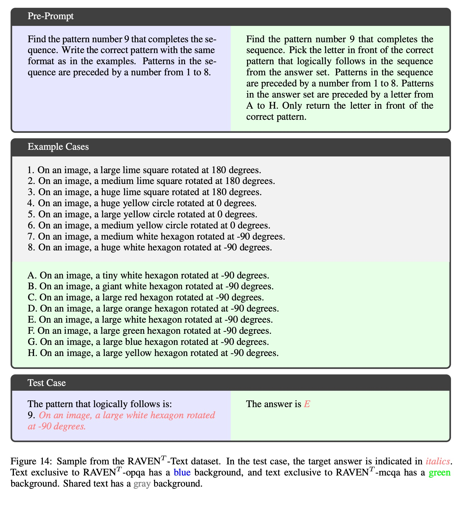
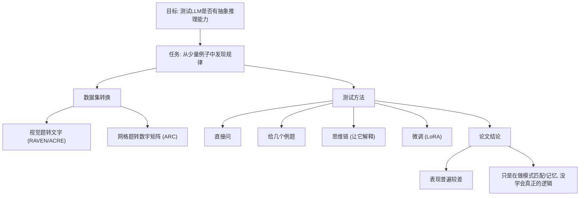
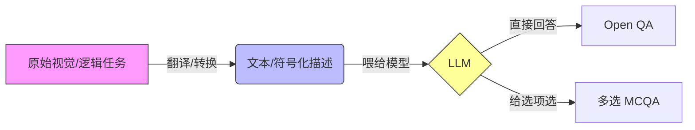
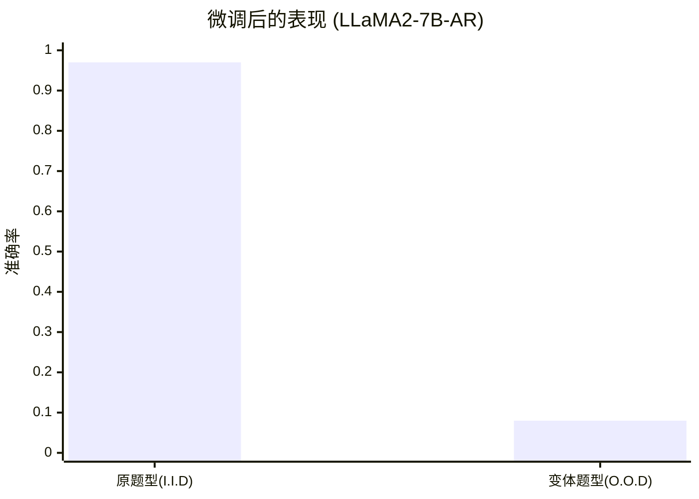
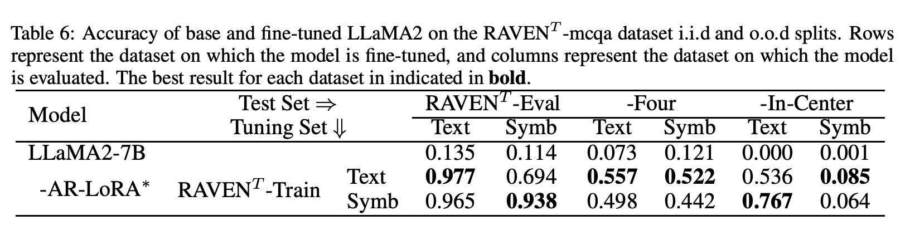
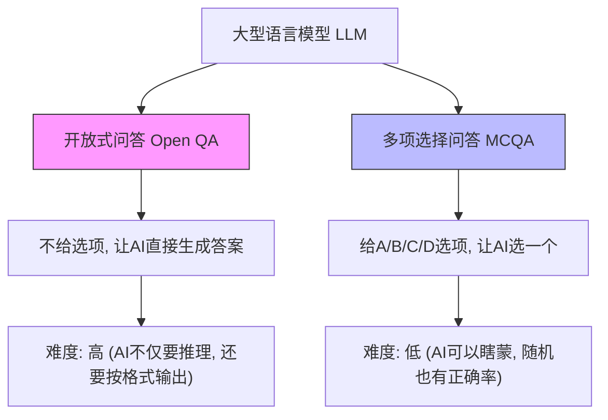

## AI论文解读 | Large Language Models Are Not Strong Abstract Reasoners
        
### 作者        
digoal        
        
### 日期        
2025-12-03        
        
### 标签        
PostgreSQL , PolarDB , DuckDB , AI , 论文解读        
        
----        
        
## 背景  
      
https://arxiv.org/pdf/2305.19555        
  
提示:          
```          
读懂《Large Language Models Are Not Strong Abstract Reasoners》这篇论文需要提前掌握哪些基础知识, 请使用中文通熟易懂的讲解这些基础知识, 可以引用论文中的图、表或使用Markdown支持的图形(text,mermaid等)增加解释性. 
  
使用中文通熟易懂的解读《Large Language Models Are Not Strong Abstract Reasoners》这篇论文, 其中的关键内容请着重讲解, 可以引用论文中的图、表或使用Markdown支持的图形(text,mermaid等)增加解释性. 
  
提取《Large Language Models Are Not Strong Abstract Reasoners》这篇论文中的重要术语, 使用中文对这些术语进行通熟易懂的讲解, 可以引用论文中的图、表或使用Markdown支持的图形(text,mermaid等)增加解释性. 
```     
  
## 1 前置知识 
  
要读懂论文《Large Language Models Are Not Strong Abstract Reasoners》（大型语言模型不是强大的抽象推理者），你需要掌握以下几个核心领域的通俗基础知识。这篇论文主要在探讨目前最先进的AI（如GPT-4）虽然很强，但在“举一反三”的抽象逻辑能力上是否真的具备人类般的智慧。

以下是分类讲解，配合了论文中的图表和可视化解释：

### 1\. 什么是大型语言模型 (LLM) 与“下一个词预测”

**通俗解释：**
想象一个读过互联网上几乎所有书籍和文章的“超级鹦鹉”。当你给它上半句话，它能根据概率猜出下半句话。这就是LLM（Large Language Model）的基础。

  * **论文中的角色：** 论文测试了多个著名的模型，包括 GPT-3.5, GPT-4, LLaMA 等 。
  * **核心机制：** 它们本质上是 **自回归（Autoregressive）** 模型，即根据前面的内容预测下一个字。论文探讨这种机制是否限制了它们进行复杂规划和回溯的能力 。

### 2\. 什么是“抽象推理” (Abstract Reasoning)

**通俗解释：**
这是人类智力的核心。它不是考你死记硬背的知识（比如“法国首都是哪里”），而是考你能否从几个从未见过的例子中**找到规律**，并应用到新情况中。

  * **例子：** 看下面这一串数字：`2, 4, 8, 16`。下一个是多少？你猜是`32`，因为你发现了“乘以2”这个**抽象规则**。
  * **论文定义：** 抽象推理是从少量数据中发现通用模式并应用的过程 。这通常用来测试系统是否具有广泛的泛化能力（Generalization），即面对全新、未曾训练过的问题时的处理能力 。

### 3\. 测试基准 (Benchmark) 与 数据集转换

论文的一大创新是将原本给人做或是给视觉AI做的“图形智商题”，翻译成了“文字题”给LLM做。你需要了解以下几个著名的测试集：

#### A. Raven's Progressive Matrices (瑞文氏标准推理测验)

  * **原题样子：** 给出一组几何图形，让你按规律选出缺失的那一个（类似找规律）。
  * **论文处理：** LLM主要处理文字，所以作者将图形**文本化**或**符号化**。
      * 看下图论文中的例子，原本是图形，被转换成了文字描述（如“一个大的橙色圆圈旋转了90度”）。

  

> **论文图示 (Figure 14) - 瑞文测试的文本化：**
> *在此例中，模型需要阅读这些文字描述，找出形状、颜色、旋转角度的规律，选出第9个图案 。*

#### B. ARC (Abstract Reasoning Challenge)

  * **原题样子：** 一个网格游戏，输入是一个彩色格子图，输出是变化后的格子图（比如“把所有红色方块向下移一格”）。
  * **论文处理：** 将彩色网格转换成数字矩阵（二维数组）喂给AI 。

#### C. 少样本学习 (Few-Shot Learning)

  * **通俗解释：** 考试时，老师先给你看3个例题（Input -\> Output），然后再出第4题让你做。这在论文中被称为“Example Cases” 。
  * **In-Context Learning：** 模型不需要重新训练，只是通过提示词（Prompt）里的例子来临时“学习”规律。


### 4\. 提示工程技术 (Prompting Techniques)

为了让AI表现更好，研究人员使用了不同的“提问技巧”。

#### A. 思维链 (Chain-of-Thought, CoT)

  * **通俗解释：** 不让AI直接报答案，而是强迫它“把思考过程写下来”。
  * **论文应用：** 作者尝试用CoT（后缀 `-cot`）看能否提高推理能力 。例如提示词写：“Describe every step of your reasoning...”（描述你推理的每一步）。
  * **结果：** 令人惊讶的是，CoT在这些抽象推理任务上并没有显著提升性能，有时甚至更差 。

#### B. 代码生成 (Program-of-Thought / Code Generation)

  * **通俗解释：** 既然直接推理很难，不如让AI写一段Python代码来解决这个问题。
  * **论文应用：** 让模型生成一个Python函数来代表它发现的规律，然后运行代码得出答案 。
  * **结果：** 这种方法（后缀 `-code`）通常比直接回答更差，说明AI很难将抽象规律转化为严谨的代码 。

### 5\. 微调 (Fine-tuning) 与 LoRA

当模型天生能力不足时，可以通过“补习班”来提升。

  * **微调 (Fine-tuning)：** 在特定数据集上进一步训练模型。
  * **LoRA (Low-Rank Adaptation)：** 一种**省钱省力**的微调技术。不用调整模型所有的参数（那太贵了），只调整极小一部分参数 。
  * **论文发现：** 即使经过微调（如 `LLaMA-AR-LoRA`），模型往往只是记住了“题型格式”（Syntax），一旦题目变一点花样（Out-of-Distribution），由于缺乏真正的抽象能力，表现依然会大幅下降 。

### 6\. 核心概念总结图解

为了帮你理清论文的逻辑链条，请看下图：



### 总结

读这篇论文时，你只需要记住：作者把 **“看图找规律”** 的智商题变成了 **“文字找规律”** ，然后用各种方法（给例题、让它写代码、特训）去考GPT-4等模型。结果发现，虽然这些AI很会说话，但在剥离了语言习俗后的纯逻辑抽象上，它们其实并不强，很可能是在“死记硬背”或“甚至不如乱猜” 。
  
## 2 解读论文 
  
这是一篇关于**大型语言模型（LLM）抽象推理能力**的深度评测论文。简单来说，论文的作者们想知道：像 GPT-4 这样厉害的 AI，究竟是真的“聪明”（会推理、懂逻辑），还是只是记性好（背下了很多答案）。

为了搞清楚这一点，作者们做了一套特别的“考卷”，并测试了当时最先进的模型。结论比较令人失望： **目前的 LLM 还算不上是强大的抽象推理者**。

以下是对这篇论文关键内容的通俗解读：

### 1\. 核心概念：什么是“抽象推理”？

在论文中，**抽象推理（Abstract Reasoning）** 被定义为“从少量例子中发现通用模式，并将其应用到新情况”的能力 。

  * **通俗比喻**： 这就像做智商测试里的“找规律”题。给你看 `2, 4, 6`，问你下一个数是多少？你不仅要认出这些数字，还要脑补出“+2”这个规则，然后算出 `8`。
  * **为什么重要？**： 这种能力是衡量真正的“智能”和“泛化能力”（遇到没见过的题也能做）的关键标准，而不仅仅是靠死记硬背 。

### 2\. 怎么考？（测试方法与数据集）

由于以前的抽象推理题大多是图形题（给人做的），LLM 看不懂图片。作者做了一件很重要的工作： **把图形题“翻译”成文字题** 。

他们构建了一个包含多种任务的基准测试集，主要包括：

1.  **$ACRE^T$** (因果推理)：原本是看图判断物体能否让灯亮，现在改成文字描述（如“一个红色球体出现了，灯亮了”）。
2.  **$RAVEN^T$** (瑞文推理矩阵)：经典的图形智商测试，被转换成文字描述（如“一个大三角形旋转了90度”）。
3.  **$ARC^T$** (抽象推理挑战)：原本是网格变色游戏，被转换成数字矩阵 。
4.  **BIG-Bench-F & PVR**：列表处理和指针检索任务，考查逻辑函数关系 。

为了让你直观理解，这里展示一个测试流程的图解：



### 3\. 考得怎么样？（关键实验结果）

作者测试了 GPT-3.5, GPT-4, LLaMA 等多个模型，结果发现它们普遍 **“偏科”严重且基础薄弱** 。

#### 关键发现一：整体成绩不及格

在开放式问答（不给选项，直接问结果）中，即使是当时最强的 **GPT-4**，在大多数任务上的准确率也并不高。

  * 在 $ARC^T$ （网格推理）上，GPT-4 只有 **11.9%** 的准确率 。
  * 在 $RAVEN^T$ （图形规律）上，LLaMA-7B 的准确率甚至是 **0%** 。
  * **结论**：LLM 目前还不能进行可靠的抽象推理 。

#### 关键发现二：“思维链” (CoT) 失灵了

我们通常认为，让 AI “把思考过程写出来”（Chain-of-Thought），它会变聪明。但这篇论文发现，在抽象推理任务上，**CoT 并没有显著提升表现**，甚至在某些任务上（如 BIG-Bench-F）表现更差 。
这说明模型并不是因为“没想清楚”才做错，而是根本就没“看懂”其中的抽象逻辑 。

#### 关键发现三：微调 (Fine-tuning) 的假象

作者尝试用特定数据去微调模型（比如训练 LLaMA 做瑞文推理）。

  * **乍一看**：微调后的模型在同类题目上表现神勇，准确率接近 97% 。
  * **换个题型**：一旦把题目稍微改一下（比如从1个图形变成2个图形，或者是没见过的组合），准确率瞬间暴跌 。

下图展示了这种“虚假的学会”：



*(注：数据基于论文 Table 6 中 LLaMA2 在 Text 格式下从训练集到 -In-Center 变体的表现 。)*

  

这说明微调只是让模型**背住了题目的格式**（Syntax），而不是学会了推理的逻辑 。

### 4\. 为什么会这样？（深度分析）

论文通过因果推理（Causal Induction）的视角进行了分析。他们发现模型在处理不同类型的逻辑路径时表现很不一致 ：

  * **直接路径 (Direct)** ：如果A直接导致B，模型还能凑合猜对。
  * **间接路径 (Indirect)** ：如果需要通过 A 推导 B，再推导 C，模型就很容易晕。
  * **干扰项 (Screening-off)** ：如果题目里有干扰信息，模型很容易被带偏，去关注那些只有“相关性”但没有“因果性”的假规律 。

### 5\. 总结

《Large Language Models Are Not Strong Abstract Reasoners》这篇论文给当时火热的 LLM 泼了一盆冷水。它告诉我们：

1.  **不要被流畅的语言欺骗**：LLM 说话好听，不代表它脑子好使（逻辑强）。
2.  **“举一反三”很难**：目前的模型更像是基于概率的“模仿者”，而不是理解世界运行规律的“思考者” 。
3.  **未来的方向**：仅仅靠堆数据（Pre-training）或微调（Fine-tuning）可能无法解决这个问题，未来可能需要结合**因果推理**或**程序归纳**等新方法 。
  
## 3 术语 
  
这篇论文《Large Language Models Are Not Strong Abstract Reasoners》主要探讨了大型语言模型（LLM）在面对需要“举一反三”的抽象推理任务时，表现究竟如何。为了读懂这篇论文，我们需要理解以下几个核心术语。

以下是论文中重要术语的通俗解读，配合图表解释：

### 1\. 核心概念

#### **抽象推理 (Abstract Reasoning)**

  * **通俗解释**：这是人类智力的核心能力之一。它不是考你死记硬背的知识（比如“拿破仑哪年出生”），而是给你看几个例子，让你自己**找规律**，然后把这个规律用到从没见过的新题目上 。
  * **例子**：看这串数字 `2, 4, 8`，下一个是多少？你猜 `16`。因为你发现了“乘以2”这个抽象规律，而不是因为你背过这串数字。
  * **论文观点**：这篇论文的核心结论就是：目前的 LLM 在这方面表现**不强**，它们更多是靠记忆而不是真的懂逻辑 。

#### **分布外泛化 (Out-of-Distribution / O.O.D Generalization)**

  * **通俗解释**：考试题目和课本例题长得不一样。
      * **I.I.D (独立同分布)** ：平时练“1+1”，考试考“1+2”。题目类型完全一样，只是数字换了。
      * **O.O.D (分布外)** ：平时练“1+1”，考试考“1+1+1”。题目难度升级了，或者规则变复杂了。
  * **论文中的实验**：作者训练模型识别“1个图形”的规律，然后测试它能不能识别“2个图形”或“4个图形”的规律 。结果发现模型在 O.O.D 任务上表现很差，说明它没学会真正的规则，只是背住了简单的题型 。

-----

### 2\. 测试数据集 (The Benchmarks)

由于以前的抽象推理测试大多是**图形题**（给人做的），LLM 看不懂图片。作者做了一个关键工作： **把图形翻译成文字** 。

#### **$ACRE^T$ , $RAVEN^T$ , $ARC^T$**

这些是被作者“文字化”后的经典测试集。右上角的 $^T$ 代表 Text（文本版）。

  * **$RAVEN^T$ (瑞文推理)** ：原本是经典的图形智商测试。作者把它变成了文字描述，比如把图形描述成“一个红色的大三角形旋转了90度” 。
  * **$ARC^T$ (抽象推理挑战)** ：原本是网格变色游戏。作者把它转换成了数字矩阵（二维数组）给 AI 看 。
  * **BIG-Bench-F**：一种函数猜谜游戏。给几个输入输出的列表，让 AI 猜中间发生了什么变化（比如“去掉最后两个数”） 。

**图解：原本的图形 vs 论文转换后的文字**
(以 $RAVEN^T$ 为例 )

| 原始概念 (图形) | 论文转换后的输入 (文本) |
| :--- | :--- |
|  (红色三角形) | `On an image, a large red triangle rotated at 90 degrees.` |
|  (蓝色圆形) | `On an image, a large blue circle rotated at -45 degrees.` |

-----

### 3\. 评估模式 (Evaluation Methods)

论文使用了两种方式来考 AI，逻辑关系如下图所示 ：



  * **Open QA (开放式)** ：就像填空题。模型必须自己生成答案文本 。
  * **MCQA (多选式)** ：就像选择题。模型只需要从给定选项中挑一个 。
  * **论文发现**：给选项（MCQA）确实能提高一点分数，但 AI 的表现依然很差，很多时候跟瞎蒙（随机猜测）差不多 。

-----

### 4\. 提示与优化技术 (Prompting & Tuning)

作者尝试用各种“补习”方法来提高 AI 的成绩，但发现效果都不好。

#### **思维链 (Chain-of-Thought / CoT)**

  * **通俗解释**：不让 AI 直接报答案，而是强迫它“把解题步骤一步步写出来”。通常这能让 AI 变聪明 。
  * **论文结论**：在抽象推理任务上，**CoT 失效了**。写出步骤并不能提高准确率，有时反而更低。这说明 AI 不是“没想清楚”，而是根本“没懂逻辑” 。

#### **代码生成 (Code Generation / Program-of-Thought)**

  * **通俗解释**：让 AI 不写文字答案，而是写一段 Python 代码来解决这个问题 。
  * **论文结论**：也没用。虽然 AI 能写出可以运行的代码，但代码里的逻辑是错的 。

#### **微调 (Fine-tuning) 与 LoRA**

  * **通俗解释**：给模型“开小灶”，专门拿这类题目训练它。LoRA 是一种省钱高效的训练技术 。
  * **论文结论**：这是 **“假懂”** 。微调后的模型在见过的题型上分数很高，但稍微改一下题目规则（O.O.D），分数就暴跌。说明它只是死记硬背了题目的格式，没学会推理 。

-----

### 5\. 因果归纳分析 (Causal Induction)

为了搞清楚 AI 到底哪里笨，作者把推理题分成了四类难度 ：

1.  **Direct (直接推理)** ：A 导致 B。这是最简单的，AI 表现相对最好。
2.  **Indirect (间接推理)** ：A 导致 B，B 导致 C。需要绕个弯，AI 表现开始下降。
3.  **Screening-off (屏蔽/干扰项)** ：题目里混入了无关信息（干扰项）。AI 很容易被这些假线索骗走 。
4.  **Backward-blocking (反向阻断)** ：一种复杂的逻辑排除法。AI 在处理文字版题目时，特别容易在这种路径上“过拟合”（钻牛角尖），但在处理符号版题目时稍微好一点，说明**人类语言本身可能对 AI 的纯逻辑推理产生了干扰** 。
  
## 参考        
         
https://arxiv.org/pdf/2305.19555    
        
<b> 以上内容基于DeepSeek、Qwen、Gemini及诸多AI生成, 轻微人工调整, 感谢杭州深度求索人工智能、阿里云、Google等公司. </b>        
        
<b> AI 生成的内容请自行辨别正确性, 当然也多了些许踩坑的乐趣, 毕竟冒险是每个男人的天性.  </b>        
  
    
#### [PolarDB 学习图谱](https://www.aliyun.com/database/openpolardb/activity "8642f60e04ed0c814bf9cb9677976bd4")
  
  
#### [PostgreSQL 解决方案集合](../201706/20170601_02.md "40cff096e9ed7122c512b35d8561d9c8")
  
  
#### [德哥 / digoal's Github - 公益是一辈子的事.](https://github.com/digoal/blog/blob/master/README.md "22709685feb7cab07d30f30387f0a9ae")
  
  
#### [About 德哥](https://github.com/digoal/blog/blob/master/me/readme.md "a37735981e7704886ffd590565582dd0")
  
  

  
