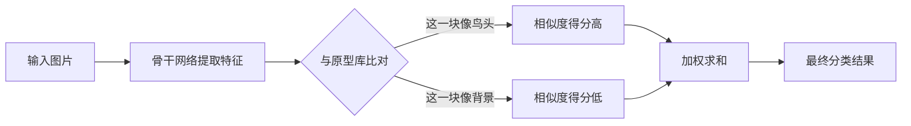
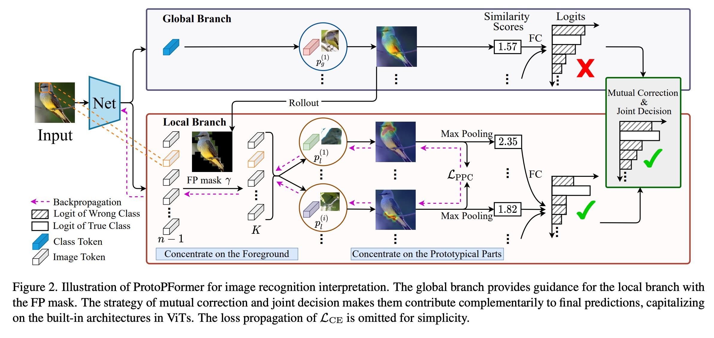
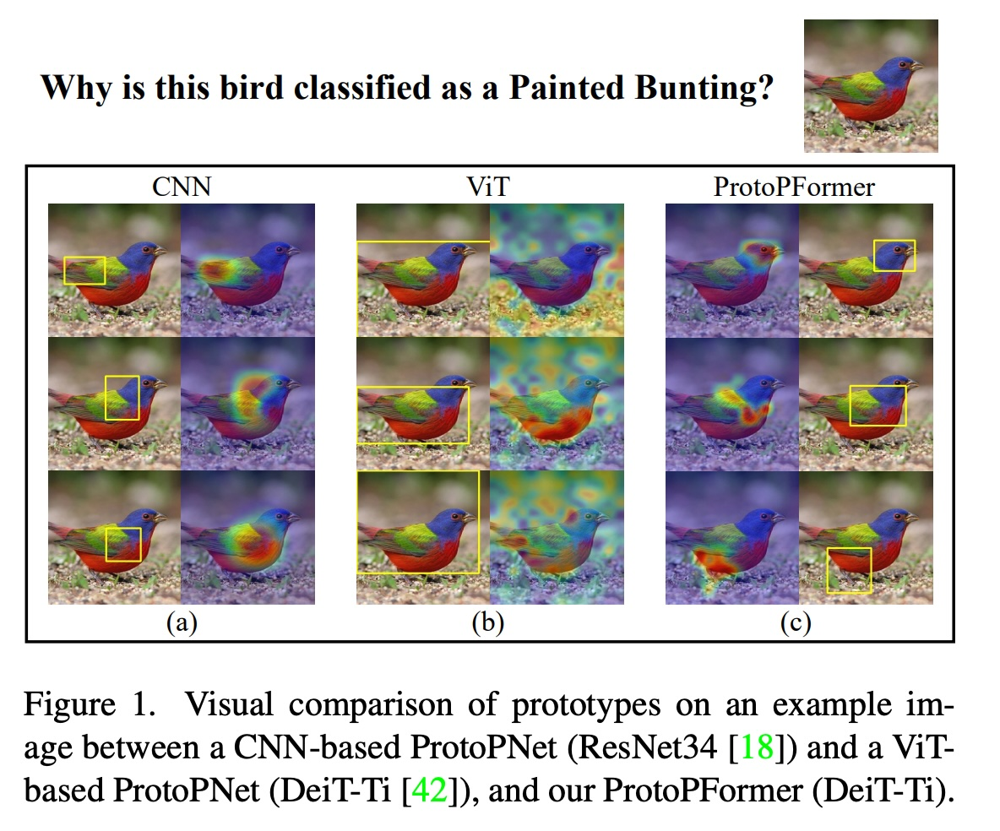
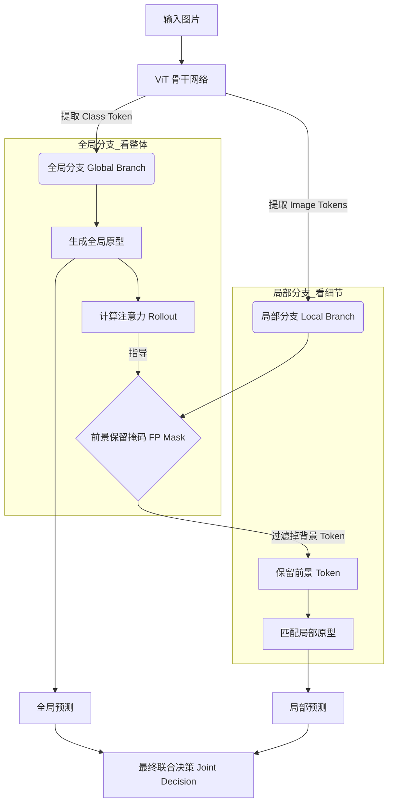
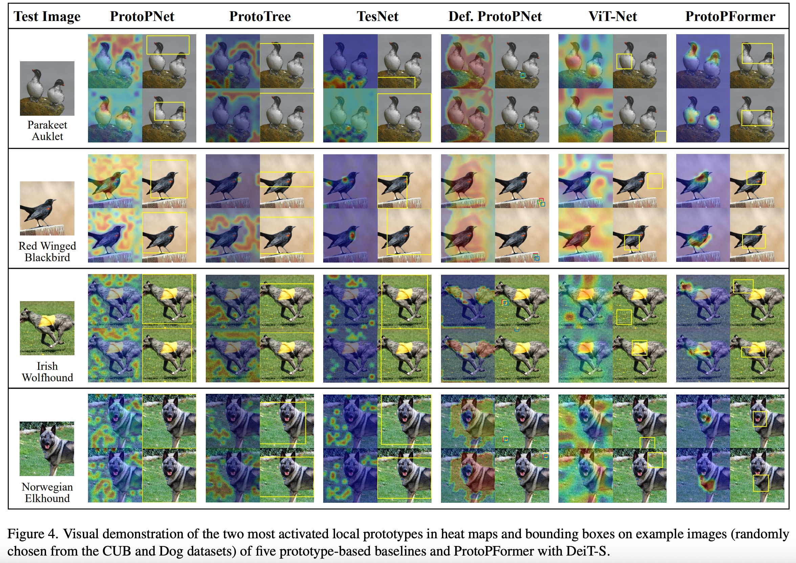
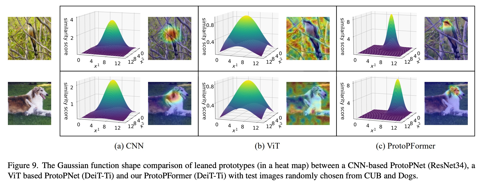
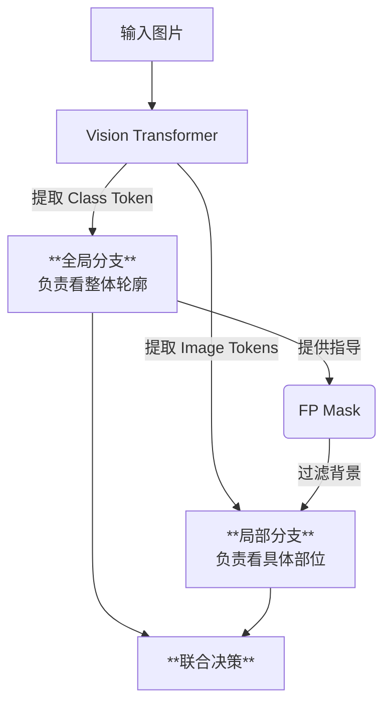
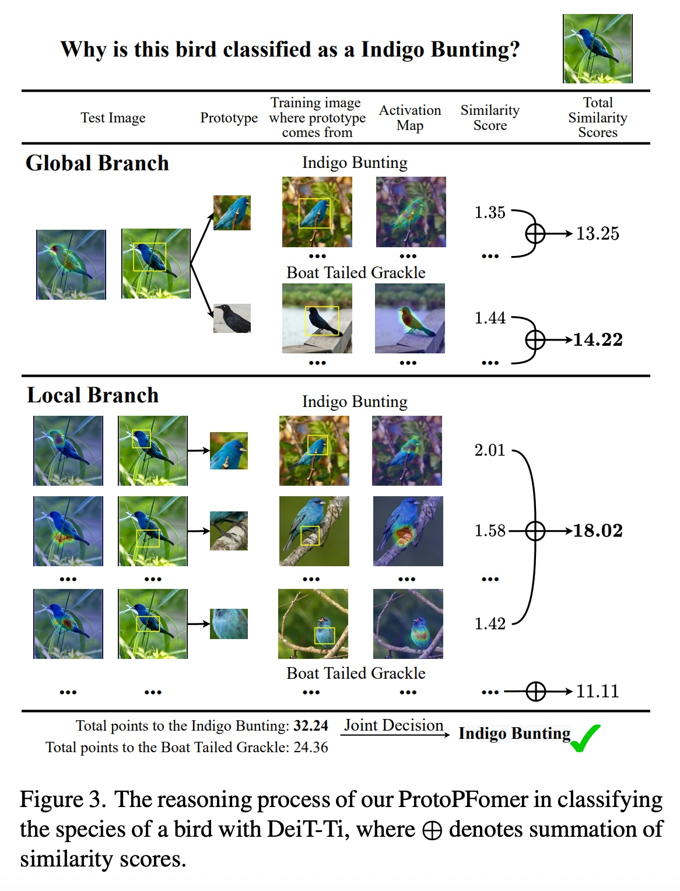

## AI论文解读 | ProtoPFormer: Concentrating on Prototypical Parts in Vision Transformers for Interpretable Image Recognition
        
### 作者        
digoal        
        
### 日期        
2025-12-03        
        
### 标签        
PostgreSQL , PolarDB , DuckDB , AI , 论文解读        
        
----        
        
## 背景  
      
https://arxiv.org/pdf/2208.10431        
  
提示:          
```          
读懂《ProtoPFormer: Concentrating on Prototypical Parts in Vision Transformers for Interpretable Image Recognition》这篇论文需要提前掌握哪些基础知识, 请使用中文通熟易懂的讲解这些基础知识, 可以引用论文中的图、表或使用Markdown支持的图形(text,mermaid等)增加解释性. 
  
使用中文通熟易懂的解读《ProtoPFormer: Concentrating on Prototypical Parts in Vision Transformers for Interpretable Image Recognition》这篇论文, 其中的关键内容请着重讲解, 可以引用论文中的图、表或使用Markdown支持的图形(text,mermaid等)增加解释性. 
  
提取《ProtoPFormer: Concentrating on Prototypical Parts in Vision Transformers for Interpretable Image Recognition》这篇论文中的重要术语, 使用中文对这些术语进行通熟易懂的讲解, 可以引用论文中的图、表或使用Markdown支持的图形(text,mermaid等)增加解释性. 
```     
  
## 1 前置知识 
  
要读懂《ProtoPFormer》这篇论文，你需要理解它是为了解决一个特定矛盾而诞生的： **Vision Transformer (ViT) 的强大全局能力** vs **原型网络 (ProtoPNet) 所需的局部聚焦能力**。

以下是阅读这篇论文前需要掌握的 4 个核心基础知识模块，我将用通俗的语言配合图表进行讲解。

-----

### 1\. 什么是“可解释性人工智能” (XAI)？

**核心概念：** 也就是回答“AI 为什么这么判断？”。

  * **黑盒模型 (Black Box)：** 传统的深度神经网络（DNN）像一个黑盒子。你给它一张鸟的照片，它告诉你“这是靛蓝彩鹀（Indigo Bunting）”。你问“为什么？”，它无法回答，只给你一堆数字。
  * **自解释模型 (Self-Interpretable)：** 这篇论文研究的类型。模型不仅给出结果，还能告诉你判据。例如：“我判断这是靛蓝彩鹀，因为它的**头部**像A图中的鸟，**翅膀**像B图中的鸟。”

> **论文中的体现：**
> 论文的目标就是为了让 Vision Transformer (ViT) 也能像人一样，通过通过对比特征（鸟嘴、羽毛等）来识别物体 。

-----

### 2\. 原型网络 (ProtoPNet) 的工作原理

这是这篇论文的基础架构。理解了 ProtoPNet，你就理解了 ProtoPFormer 的一半。

**通俗解释：**
想象你在指认嫌疑人。你不会只看一眼就说是谁，你会对比特征：

1.  **提取特征：** 把输入图片变成一堆特征块。
2.  **原型对比 (Prototype Matching)：** 你的脑子里有一本“典型特征字典”（原型库），比如“典型的鸟头”、“典型的鸟爪”。你拿图片里的特征去和字典里的**原型**比对。
3.  **打分与决策：**
      * 如果图片里某块区域和“靛蓝彩鹀的头”很像，得分就高。
      * 最后把所有相似度得分加起来，谁的分高，就是哪种鸟。

**流程图解：**



> **论文中的体现：**
> ProtoPNet 通过“原型相似度（prototypes' similarity）”的线性组合来进行预测 。在论文的图 2 中，可以看到 `Similarity Scores` 这一步，就是核心机制 。

  

-----

### 3\. Vision Transformer (ViT) 与 CNN 的区别

这是论文要解决的“麻烦制造者”。

  * **CNN (卷积神经网络)：** 像拿着放大镜一点点扫描图片。它天生擅长捕捉**局部**特征（比如边缘、纹理）。
  * **ViT (视觉 Transformer)：**
      * **切块 (Patching)：** 把图片切成许多小方块（Patches），变成一串序列（Tokens）。
      * **自注意力 (Self-Attention)：** 每一个小方块都会去“看”其他所有小方块。这让 ViT 极其擅长捕捉**全局**关系（Long-range dependency）。
      * **Class Token：** ViT 有一个特殊的 Token，专门用来汇总所有信息做分类。

**基础冲突（论文的核心痛点）：**
ProtoPNet 需要模型盯着“鸟头”、“鸟嘴”这些**局部**看。但 ViT 因为有自注意力机制，它总是忍不住去看“全局”或者背景。

> **看图理解痛点：**  
> 请看论文中的 **Figure 1**。  
> * **(a) CNN：** 注意力集中在鸟身上（黄色框），很干净 。    
> * **(b) ViT：** 直接用 ViT 做原型网络，注意力是散的（Scattered），背景也被激活了，这就是论文说的 **"Distraction" (分心) 问题** 。  

   

*(该图展示了直接将 ViT 用于原型网络时，注意力分散且关注背景的问题)*

-----

### 4\. 全局特征 vs. 局部特征 (Global vs. Local)

为了修补 ViT “太爱看全局”的毛病，论文提出了把特征分成两类来处理。你需要理解这两者的物理意义：

  * **局部特征 (Local Features)：**

      * **对应：** 图片里的具体切片（Image Tokens）。
      * **作用：** 识别细节，比如鸟的颜色、嘴型。
      * **处理：** 论文通过算法（PPC Loss）强迫这些特征只关注物体（前景），别看背景 。

  * **全局特征 (Global Features)：**

      * **对应：** ViT 里的 Class Token。
      * **作用：** 宏观把控，看整体轮廓和姿态。
      * **处理：** 论文保留了这个分支，用来辅助局部特征，给它们提供一个“大局观” 。

> **图解架构：**  
> 在论文 **Figure 2** 中，你可以清晰地看到这两条路：  
> 1.  上面是 **Global Branch**（蓝色方块 Class Token），负责看整体 。  
> 2.  下面是 **Local Branch**（白色方块 Image Tokens），负责看细节，并且加了一个 `FP mask`（前景遮罩）来过滤背景 。  

   

-----

### 总结：阅读路径建议

带着这四个概念去读论文，你的思路应该是这样的：

1.  **目标：** 我们要让 AI 解释为什么它认出了这只鸟 (**XAI**)。
2.  **手段：** 我们用“找典型特征”的方法 (**ProtoPNet**)。
3.  **挑战：** 但是现在的最强模型 ViT 太爱看整体和背景了，导致特征找不准，太散了 (**ViT vs. CNN 的区别**)。
4.  **解决方案：** 作者设计了 ProtoPFormer，把 **Global** (整体) 和 **Local** (局部) 分开处理，还强制 Local 部分只看前景，最后两个人一起投票决定结果。

现在，你可以尝试阅读论文的 **Introduction** 和 **Method** 部分，会发现非常顺畅。
  
## 2 解读论文 
  
这篇论文提出了一种名为 **ProtoPFormer** 的新模型，旨在解决将“视觉 Transformer (ViT)”与“原型网络 (ProtoPNet)”结合时遇到的核心难题，从而实现既准确又可解释的图像识别 。

简单来说，它的目标是**让 AI 不仅能认出图里是什么（比如这只鸟是靛蓝彩鹀），还能像人一样指着图说：“我看的是它的头和翅膀，所以它是靛蓝彩鹀”** 。

以下是对这篇论文的通俗解读：

### 1\. 核心背景与痛点：为什么需要 ProtoPFormer？

在可解释人工智能 (XAI) 领域，**ProtoPNet** 是一种很火的方法。它通过对比图片中的局部特征（“原型”，比如鸟嘴、爪子）来进行分类 。

  * **过去的做法 (CNN + ProtoPNet)：** 在传统的卷积神经网络 (CNN) 上，这种方法效果很好，因为 CNN 天生关注局部 。
  * **遇到的问题 (ViT + ProtoPNet)：** 当研究人员想把这种方法用到更强大的 **Vision Transformer (ViT)** 上时，出了问题。ViT 擅长捕捉全局信息（长距离依赖），导致它“注意力不集中”，容易把背景（如树枝、草地）也当成识别依据。这被称为 **“原型分心 (Prototype Distraction)”** 问题 。

> **直观对比：**
>
>   * **CNN：** 像拿着放大镜，只看鸟的头部（聚焦准确）。
>     \* **普通 ViT：** 像在看风景，既看鸟也看背景的树叶（注意力由于全局机制而发散），导致解释性很差 。

### 2\. 解决方案：ProtoPFormer 的设计思路

ProtoPFormer 的核心思想是**顺应 ViT 的结构特性，将“看整体”和“看局部”的任务分开，并让整体指导局部** 。

论文设计了两个分支：

1.  **全局分支 (Global Branch)：** 利用 ViT 的 `Class Token`（分类标记），负责看整体轮廓和姿态 。
2.  **局部分支 (Local Branch)：** 利用 ViT 的 `Image Tokens`（图像块标记），负责看具体的身体部位（如头、腹部） 。

#### ProtoPFormer 架构图解

使用 Mermaid 流程图来展示其工作原理 ：



### 3\. 三大关键技术创新

为了让模型不再“分心”，论文引入了三个关键机制：

#### (1) 前景保留掩码 (Foreground Preserving Mask) —— 去除背景干扰

  * **原理：** 利用全局分支计算出的注意力图（Rollout），找出哪些区域是物体（前景），哪些是背景 。
  * **作用：** 就像给局部分支戴了一副滤镜，直接把背景区域（比如蓝天、草地）的信号屏蔽掉，强迫局部分支只在前景（鸟的身体）上寻找特征 。

#### (2) 原型部分集中损失 (PPC Loss) —— 聚焦核心部位

  * **原理：** 这是一个数学约束。它要求每一个“局部原型”在特征图上的激活区域必须是**紧凑的**（像一个高斯分布的圆），而不是散乱的一片 。
  * **作用：** 强迫模型把注意力集中在具体的器官上（如只看红色的头部），而不是模糊的一大片区域。同时，它还要求不同的原型要关注**不同**的部位，不能大家都只看头 。

#### (3) 相互校正与联合决策 (Mutual Correction & Joint Decision)

  * **原理：** 最终的分类结果是由“全局分支”和“局部分支”共同投票决定的 。
  * **案例：** 假设要识别一只“靛蓝彩鹀”。
      * 全局分支可能因为姿态像另一种鸟而犹豫 。
      * 但局部分支发现了标志性的“蓝色头部”和“黑色脚”，非常确信 。
      * 两者结合，局部分支修正了全局分支的偏差，给出了正确的判断 。

### 4\. 实验效果

论文在 CUB (鸟类)、Dogs (狗)、Cars (汽车) 三个数据集上进行了测试，结果表明 ：

  * **准确率更高：** 相比于其他尝试结合 ViT 和原型网络的方法（如 ViT-Net, ProtoPNet on ViT），ProtoPFormer 的准确率显著提升，甚至超过了一些非解释性的基线模型 。
  * **解释更清晰（可视化）：**
      * **对比图 (Figure 4)：** 其他方法的热力图（Heatmap）经常散落在背景上。而 ProtoPFormer 的热力图精准地落在了鸟头、鸟翅膀、狗头等关键部位 。     
      * **高斯分布对比 (Figure 9)：** ProtoPFormer 激活的特征区域非常集中（协方差小），证明了它确实是在“看”具体的部位 。     

### 总结

**ProtoPFormer** 成功地驯服了 Vision Transformer，通过 **“全局宏观把控 + 局部细节聚焦 + 强制去除背景”** 的策略，解决了 ViT 注意力发散的问题。它既保留了 Transformer 强大的识别能力，又赋予了模型像人一样“有理有据”的解释能力。
  
## 3 术语 
  
基于《ProtoPFormer》这篇论文，我为你提取了核心术语，并按逻辑顺序（从问题背景到解决方案再到核心机制）进行了通俗易懂的解读。

-----

### 1\. 基础与背景术语

#### **ProtoPNet (原型部分网络)**

  * **通俗解释：** 想象你在指认嫌疑人，不是凭空回忆，而是拿着一本“特征字典”对比。ProtoPNet 就是这样一个模型，它把图片拆成小块，然后去和它“脑子”里记好的**典型特征**（即**原型**，比如“典型的鸟嘴”、“典型的翅膀”）进行比对 。
  * **作用：** 它的最大优点是**可解释**——它能告诉你“我认出这是只鸟，因为这块区域像原型库里的鸟头” 。

#### **Prototype Distraction (原型分心)**

  * **通俗解释：** 这是论文要解决的**核心痛点**。当研究人员直接把强大的 Vision Transformer (ViT) 用在 ProtoPNet 上时，发现模型“注意力不集中”。
  * **现象：** 本来应该盯着“鸟头”看的原型，结果却盯着背景的树枝或天空，或者关注点散得到处都是，根本没法解释 。
  * **论文图示：** 论文 **Figure 1 (b)** 清楚地展示了这个问题：热力图散乱且覆盖了背景 。     

-----

### 2\. 核心架构术语

#### **ProtoPFormer (原型部分 Transformer)**

  * **通俗解释：** 这是论文提出的**新模型**。它专门为了解决“分心”问题而设计，能够既保留 ViT 的强大能力，又能像人一样专注地看细节 。

#### **Global Prototypes (全局原型) & Local Prototypes (局部原型)**

  * **通俗解释：** 论文把“看图”分成了两步。
      * **全局原型：** 负责“看大局”。它关注整体轮廓、姿态，不拘泥于细节 。
      * **局部原型：** 负责“看细节”。它专门盯着具体的身体部位（如头、脚、翅膀） 。
  * **技术实现：** 利用 ViT 自带的两种 Token（Class Token 用于全局，Image Tokens 用于局部）来实现分工 。

**架构逻辑图 (Mermaid):**



-----

### 3\. 关键机制术语 (如何解决“分心”?)

#### **Foreground Preserving (FP) Mask (前景保留掩码)**

  * **通俗解释：** 这是一个“去背景滤镜”。
  * **原理：** 全局分支先看一眼图，计算出哪里是物体（前景），哪里是背景。然后生成一个掩码（Mask），在局部分支处理之前，先把背景区域“切掉”或屏蔽掉 。
  * **目的：** 强迫局部原型只能在物体身上找特征，绝不让它盯着天空发呆 。
  * **论文图示：** 参见 **Figure 2** 中连接全局和局部分支的 `FP mask` 部分 。     

#### **Prototypical Part Concentration (PPC) Loss (原型部分集中损失)**

  * **通俗解释：** 这是一种数学上的“纪律约束”。
  * **原理：** 如果没有约束，模型关注的区域可能是一大片模糊的云。PPC Loss 强迫模型：
    1.  **聚光：** 关注点必须像高斯分布（Gaussian）一样集中，不能散开 。
    2.  **分散：** 不同的原型必须关注**不同**的地方（比如不能所有原型都盯着头看，有的要看脚，有的要看翅膀） 。
  * **效果：** 使得热力图从散乱变得紧凑精准（如论文 **Figure 9** 所示，使用了 PPC Loss 的高斯形状更尖锐、范围更小） 。     

#### **Attention Rollout (注意力展开)**

  * **通俗解释：** 这是一种计算“谁更重要”的方法。
  * **作用：** 在这篇论文里，它用来判断哪些图像块（Image Tokens）对全局分类最重要，从而确定哪些是前景，哪些是背景，进而生成上面的 FP Mask 。

-----

### 4\. 决策策略术语

#### **Mutual Correction & Joint Decision (相互校正与联合决策)**

  * **通俗解释：** “三个臭皮匠，顶个诸葛亮”。
  * **原理：** 最终的判断不是一个人说了算，而是全局分支和局部分支一起投票 。
      * **案例：** 比如识别一种鸟，全局分支可能觉得姿态像 A 鸟，但局部分支发现它的脚是黑色的（这是 B 鸟的特征）。两者结合，就能互相修正错误，得出正确结论 。
  * **论文图示：** 参见 **Figure 3**，展示了全局得分和局部得分如何相加得出最终判定 。     
  
## 参考        
         
https://arxiv.org/pdf/2208.10431    
        
<b> 以上内容基于DeepSeek、Qwen、Gemini及诸多AI生成, 轻微人工调整, 感谢杭州深度求索人工智能、阿里云、Google等公司. </b>        
        
<b> AI 生成的内容请自行辨别正确性, 当然也多了些许踩坑的乐趣, 毕竟冒险是每个男人的天性.  </b>        
  
    
#### [PolarDB 学习图谱](https://www.aliyun.com/database/openpolardb/activity "8642f60e04ed0c814bf9cb9677976bd4")
  
  
#### [PostgreSQL 解决方案集合](../201706/20170601_02.md "40cff096e9ed7122c512b35d8561d9c8")
  
  
#### [德哥 / digoal's Github - 公益是一辈子的事.](https://github.com/digoal/blog/blob/master/README.md "22709685feb7cab07d30f30387f0a9ae")
  
  
#### [About 德哥](https://github.com/digoal/blog/blob/master/me/readme.md "a37735981e7704886ffd590565582dd0")
  
  

  
