## Lance 源码学习: 2 核心架构 (Core Architecture)  
                                                  
### 作者                                                  
digoal                                                  
                                                  
### 日期                                                  
2025-12-03                                                  
                                                  
### 标签                                                  
Lance , AI 数据存储与搜索引擎 , 存储引擎 , 向量索引 , 标量索引 , 全文检索 , 多模态支持 , 零拷贝 , 版本控制 , 时间旅行 , 源码学习 , 随机访问加速 , Parquet                                 
                                                  
----                                                  
                                                  
## 背景           
本文档描述了 Lance 的高层架构，重点关注主要系统组件如何交互以及多语言绑定 (multi-language bindings) 的结构。它涵盖了 **Rust 核心** (Rust core) 工作空间结构、语言绑定机制（Python 和 Java）以及实现 Lance 功能的基础抽象概念。  
  
### 系统概述 (System Overview)  
  
Lance 是一种列式数据格式，实现为一个模块化的 Rust 代码库，并带有 Python 和 Java 语言绑定。该架构遵循**中心辐射模式** (hub-and-spoke pattern)，其中统一的 Rust 实现充当唯一的**事实来源** (single source of truth)，通过特定语言的 **FFI** (Foreign Function Interface，外部函数接口) 层进行访问。  
  
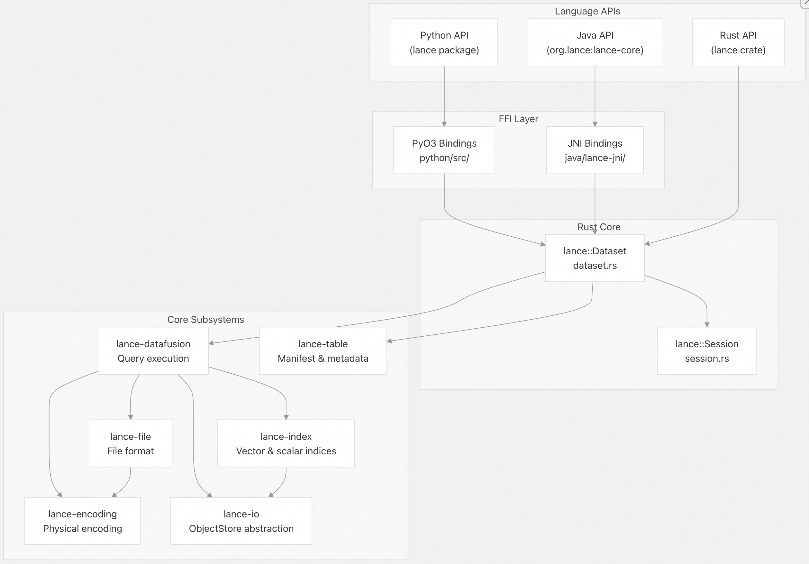    
  
| 原则 (Principle) | 实现 (Implementation) |  
| :--- | :--- |  
| 唯一事实来源 (Single source of truth) | 所有逻辑都在 Rust 核心 (`lance` Crate 和依赖项) 中 |  
| 语言中立性 (Language neutrality) | FFI 层暴露最小的表面积 |  
| 存储抽象 (Storage abstraction) | `ObjectStore` Trait 支持 S3、Azure、GCS、本地文件系统 (local FS) |  
| 格式版本控制 (Format versioning) | `LanceFileVersion` 实现向后兼容性 (backward compatibility) |  
| 事务语义 (Transactional semantics) | `CommitHandler` 确保 **ACID** 属性（原子性、一致性、隔离性、持久性） |  
  
来源:  
[`Cargo.toml` 1-239](https://github.com/lance-format/lance/blob/0204e7e2/Cargo.toml#L1-L239)  
[`rust/lance/Cargo.toml` 1-110](https://github.com/lance-format/lance/blob/0204e7e2/rust/lance/Cargo.toml#L1-L110)  
[`python/Cargo.toml` 1-95](https://github.com/lance-format/lance/blob/0204e7e2/python/Cargo.toml#L1-L95)  
[`java/lance-jni/Cargo.toml` 1-60](https://github.com/lance-format/lance/blob/0204e7e2/java/lance-jni/Cargo.toml#L1-L60)  
  
### Rust 核心工作空间 (Rust Core Workspace)  
  
Lance 的结构是一个 **Cargo 工作空间** (Cargo workspace)，包含实现不同功能层的专业 **Crate** (包)。这种模块化设计实现了清晰的关注点分离和可重用性。  
  
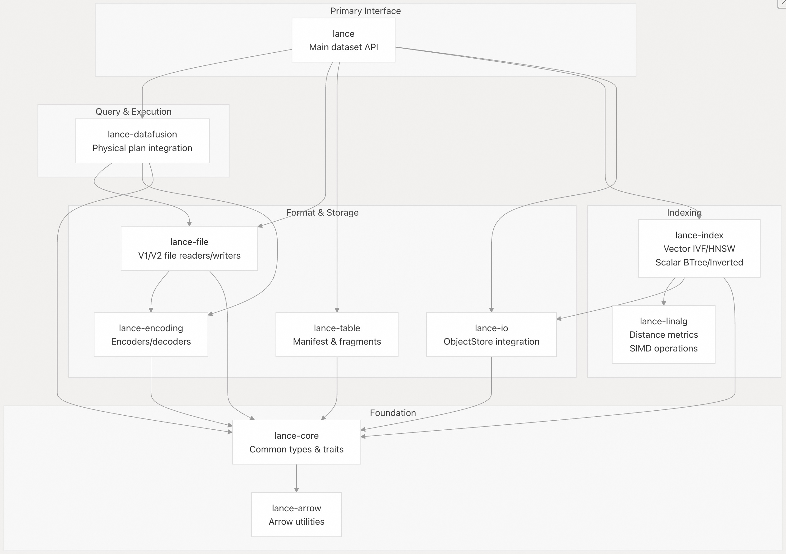    
  
| Crate (包) | 目的 (Purpose) | 关键导出 (Key Exports) |  
| :--- | :--- | :--- |  
| `lance` | 主要公共 API | `Dataset` (数据集), `Scanner` (扫描器), `WriteParams` (写入参数) |  
| `lance-core` | 通用类型和 Trait | `Schema` (模式), `Field` (字段), `DataType` (数据类型), `Error` (错误) |  
| `lance-file` | 文件格式实现 | `FileReader` (文件阅读器), `FileWriter` (文件写入器), `LanceFileVersion` |  
| `lance-encoding` | 数据编码/解码 | 编码器、解码器、压缩 |  
| `lance-io` | I/O 抽象 | `ObjectStore` (对象存储), `FileScheduler` (文件调度器), `ScanScheduler` (扫描调度器) |  
| `lance-table` | 元数据结构 | `Manifest` (清单), `Fragment` (数据片段), `DataFile` (数据文件) |  
| `lance-datafusion` | 查询引擎集成 | 物理计划节点, **下推优化** (pushdown optimizations) |  
| `lance-index` | 索引实现 | `VectorIndexParams` (向量索引参数), `ScalarIndexParams` (标量索引参数) |  
| `lance-linalg` | 线性代数 | 距离度量 (Distance metrics), 量化 (quantization) |  
| `lance-arrow` | Arrow 工具 | 模式扩展, 批处理操作 |  
  
来源:  
[`Cargo.toml` 1-239](https://github.com/lance-format/lance/blob/0204e7e2/Cargo.toml#L1-L239)  
[`rust/lance/Cargo.toml` 1-110](https://github.com/lance-format/lance/blob/0204e7e2/rust/lance/Cargo.toml#L1-L110)  
[`rust/lance-index/Cargo.toml` 1-88](https://github.com/lance-format/lance/blob/0204e7e2/rust/lance-index/Cargo.toml#L1-L88)  
  
### 数据集抽象 (Dataset Abstraction)  
  
`Dataset` (数据集) 结构体是 Lance 的核心抽象，代表一个具有 **ACID** 保证的带版本控制的数据集合。  
  
    
  
| 组件 (Component) | 类型 (Type) | 目的 (Purpose) |  
| :--- | :--- | :--- |  
| `object_store` | `Arc<ObjectStore>` | 处理所有存储 I/O 操作 |  
| `commit_handler` | `Arc<dyn CommitHandler>` | 管理原子提交 (atomic commits) 和冲突解决 |  
| `manifest` | `Arc<Manifest>` | 包含数据集元数据和数据片段列表 |  
| `manifest_location` | `ManifestLocation` | 当前清单文件的路径和元数据 |  
| `session` | `Arc<Session>` | 管理缓存和全局状态 |  
| `base` | `Path` | **对象存储** (object store) 中的基础路径 |  
| `uri` | `String` | 完整的数据集 URI（包括云存储桶） |  
| `refs` | `Refs` | 管理标签 (tags) 和分支 (branches) |  
  
**数据集生命周期 (Dataset Lifecycle)：**  
  
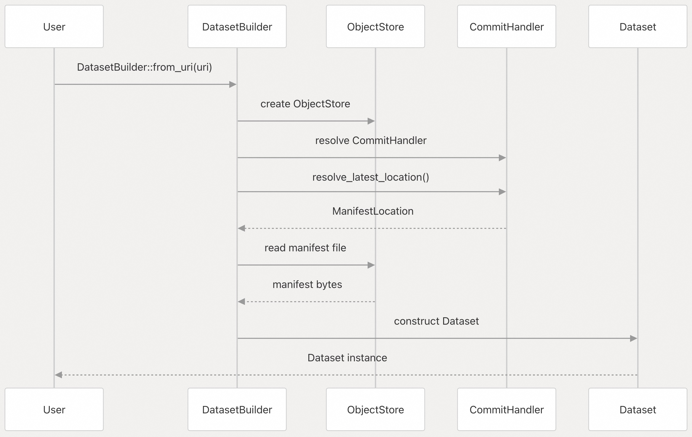    
  
来源:  
[`rust/lance/src/dataset.rs` 143-183](https://github.com/lance-format/lance/blob/0204e7e2/rust/lance/src/dataset.rs#L143-L183)  
[`rust/lance/src/dataset.rs` 439-490](https://github.com/lance-format/lance/blob/0204e7e2/rust/lance/src/dataset.rs#L439-L490)  
[`rust/lance/src/dataset.rs` 622-781](https://github.com/lance-format/lance/blob/0204e7e2/rust/lance/src/dataset.rs#L622-L781)  
  
### Python 绑定 (Python Bindings)  
  
Python 绑定使用 **PyO3** 将 Rust 功能暴露给 Python，通过编译成 `_lib.cpython-*.so` 的本地扩展模块实现。  
  
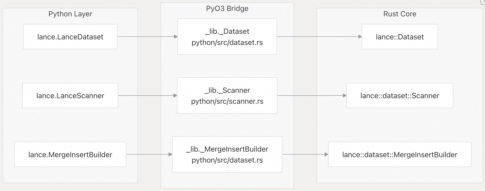    
  
**PyO3 绑定结构：**  
  
Python 包具有双层结构：  
  
1.  **本地层** (`_lib` 模块)：PyO3 生成的扩展模块，类名带有 `_` 前缀。  
2.  **Python 层** (`lance` 包)：Pythonic 包装器，添加了便利方法和文档。  
  
| Python 类 | 本地类 (Native Class) | Rust 类型 | 文件 (File) |  
| :--- | :--- | :--- | :--- |  
| `LanceDataset` | `_Dataset` | `Arc<lance::Dataset>` | [`python/src/dataset.rs` 448-454](https://github.com/lance-format/lance/blob/0204e7e2/python/src/dataset.rs#L448-L454) |  
| `LanceScanner` | `_Scanner` | `lance::dataset::Scanner` | [`python/src/scanner.rs`](https://github.com/lance-format/lance/blob/0204e7e2/python/src/scanner.rs) |  
| `MergeInsertBuilder` | `_MergeInsertBuilder` | `lance::dataset::MergeInsertBuilder` | [`python/src/dataset.rs` 126-130](https://github.com/lance-format/lance/blob/0204e7e2/python/src/dataset.rs#L126-L130) |  
  
**关键 PyO3 模式：**  
  
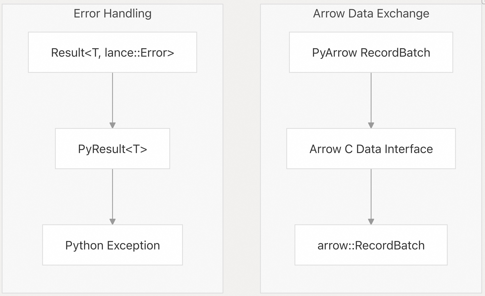    
  
这些绑定使用 Arrow 的 **C Data Interface** (C 数据接口) 来实现 Python 和 Rust 之间的**零拷贝** (zero-copy) 数据传输，避免了序列化开销。  
  
来源:  
[`python/Cargo.toml` 1-95](https://github.com/lance-format/lance/blob/0204e7e2/python/Cargo.toml#L1-L95)  
[`python/src/dataset.rs` 1-50](https://github.com/lance-format/lance/blob/0204e7e2/python/src/dataset.rs#L1-L50)  
[`python/src/dataset.rs` 448-584](https://github.com/lance-format/lance/blob/0204e7e2/python/src/dataset.rs#L448-L584)  
[`python/python/lance/dataset.py` 406-460](https://github.com/lance-format/lance/blob/0204e7e2/python/python/lance/dataset.py#L406-L460)  
  
### Java 绑定 (Java Bindings)  
  
Java 绑定使用 **JNI** (Java Native Interface，Java 本地接口) 创建与 Apache Arrow Java 集成的本地库。  
  
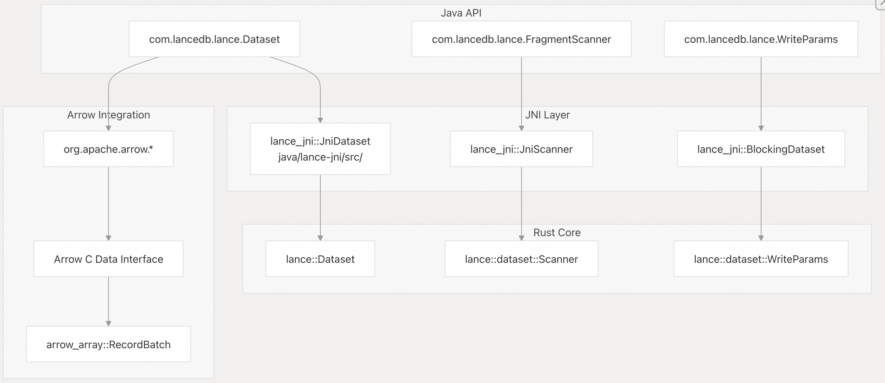    
  
**JNI 架构：**  
  
Java 绑定遵循与 Python 类似的模式，但使用 JNI 代替 PyO3：  
  
| 组件 (Component) | 目的 (Purpose) | 位置 (Location) |  
| :--- | :--- | :--- |  
| Java API | 面向用户的类 | `java/core/src/main/java/` |  
| JNI Rust 桥接 | 本地方法实现 | `java/lance-jni/src/` |  
| 本地库 | 编译后的 `.so`/`.dylib`/`.dll` | 通过 `System.loadLibrary()` 加载 |  
  
**构建过程：**  
  
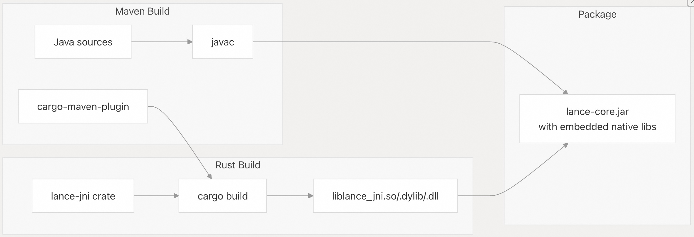    
  
来源:  
[`java/pom.xml` 1-300](https://github.com/lance-format/lance/blob/0204e7e2/java/pom.xml#L1-L300)  
[`java/lance-jni/Cargo.toml` 1-60](https://github.com/lance-format/lance/blob/0204e7e2/java/lance-jni/Cargo.toml#L1-L60)  
  
### 存储层 (Storage Layer)  
  
Lance 通过 `ObjectStore` Trait 抽象存储，从而以统一的接口支持多种后端。  
  
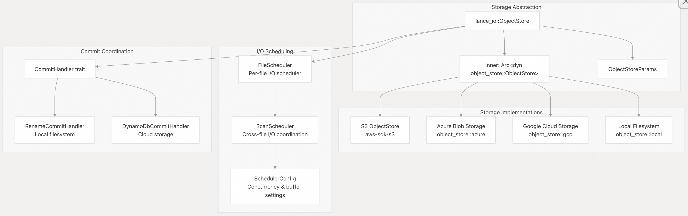    
  
**ObjectStore 配置：**  
  
| 参数 (Parameter) | 默认值 (Default) | 目的 (Purpose) |  
| :--- | :--- | :--- |  
| `block_size` | 系统相关 | I/O 操作的读取块大小 |  
| `s3_credentials_refresh_offset` | 300s | 提前多久刷新 S3 凭证 |  
| Custom `ObjectStore` | None | 用户提供的存储实现 |  
| Custom `CommitHandler` | 自动检测 | 原子提交协调 |  
  
**I/O 调度 (I/O Scheduling)：**  
  
Lance 使用复杂的 I/O 调度器来最大化吞吐量：  
  
  * **FileScheduler**：管理单个文件的 I/O，并进行请求优先级排序。  
  * **ScanScheduler**：协调跨多个文件/数据片段的 I/O。  
  * **IO buffer**：默认 2 GiB 缓冲区，用于排队读取（约 256 个并发 8 MiB 读取）。  
  
来源:  
[`rust/lance/src/dataset.rs` 145-173](https://github.com/lance-format/lance/blob/0204e7e2/rust/lance/src/dataset.rs#L145-L173)  
[`rust/lance/src/dataset.rs` 210-315](https://github.com/lance-format/lance/blob/0204e7e2/rust/lance/src/dataset.rs#L210-L315)  
  
### 外部依赖 (External Dependencies)  
  
Lance 与 **Apache Arrow** 和 **DataFusion** 深度集成，以提供高效的数据处理能力。  
  
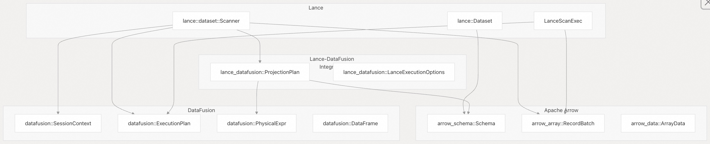    
  
**Arrow 集成：**  
  
Lance 使用 Arrow 作为其内存格式：  
  
  * **Schema** (模式)：Lance 的 `lance_core::datatypes::Schema` 包装了带有扩展功能的 `arrow_schema::Schema`。  
  * **RecordBatch** (记录批次)：所有数据都以 Arrow `RecordBatch` 的形式返回。  
  * **零拷贝** (Zero-copy)：FFI 使用 Arrow C Data Interface 进行零拷贝数据交换。  
  
**DataFusion 集成：**  
  
Lance 实现了 DataFusion 的 `ExecutionPlan` Trait，用于查询执行：  
  
  * **LanceScanExec**：用于扫描 Lance 数据集的物理计划节点。  
  * **TakeExec**：用于按行 ID 进行随机访问的物理计划节点。  
  * **Pushdowns** (下推)：将过滤 (Filter) 和投影 (Projection) **下推**到 Lance 文件读取器中。  
  * **Custom Functions** (自定义函数)：Lance 特定的标量/聚合函数。  
  
| 集成点 (Integration Point) | Lance 实现 (Lance Implementation) | DataFusion API |  
| :--- | :--- | :--- |  
| 物理规划 (Physical planning) | `LanceScanExec`, `TakeExec` | `ExecutionPlan` |  
| 表达式求值 (Expression evaluation) | `ProjectionPlan` | `PhysicalExpr` |  
| 类型系统 (Type system) | `lance_core::datatypes::Schema` | `arrow_schema::Schema` |  
| 数据交换 (Data exchange) | `RecordBatchStream` | `SendableRecordBatchStream` |  
  
来源:  
[`rust/lance/Cargo.toml` 40-68](https://github.com/lance-format/lance/blob/0204e7e2/rust/lance/Cargo.toml#L40-L68)  
[`rust/lance/src/dataset/scanner.rs` 1-100](https://github.com/lance-format/lance/blob/0204e7e2/rust/lance/src/dataset/scanner.rs#L1-L100)  
[`Cargo.toml` 72-128](https://github.com/lance-format/lance/blob/0204e7e2/Cargo.toml#L72-L128)  
  
### 会话与缓存 (Session and Caching)  
  
`Session` (会话) 对象管理跨数据集操作的全局状态和缓存。  
  
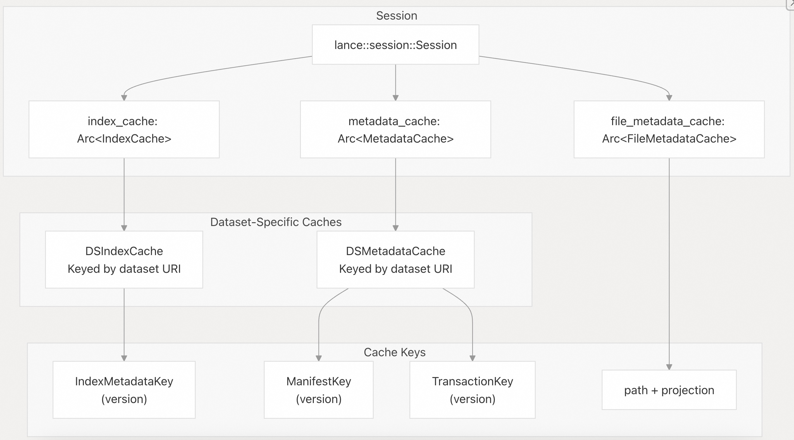    
  
**缓存配置：**  
  
| 缓存 (Cache) | 默认大小 (Default Size) | 目的 (Purpose) |  
| :--- | :--- | :--- |  
| `index_cache` | 6 GiB | 存储索引数据（IVF 分区等） |  
| `metadata_cache` | 1 GiB | 存储文件元数据、清单、事务 |  
| `file_metadata_cache` | 与元数据共享 | 存储每个文件的模式和统计信息 |  
  
**共享会话 (Shared Sessions)：**  
  
多个数据集可以共享同一个 `Session` 来汇集缓存资源：  
  
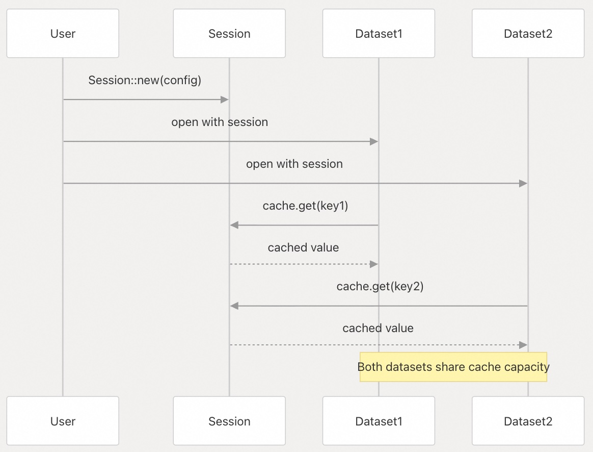    
  
来源:  
[`rust/lance/src/dataset.rs` 19-20](https://github.com/lance-format/lance/blob/0204e7e2/rust/lance/src/dataset.rs#L19-L20)  
[`rust/lance/src/dataset.rs` 157-165](https://github.com/lance-format/lance/blob/0204e7e2/rust/lance/src/dataset.rs#L157-L165)  
[`rust/lance/src/dataset.rs` 210-315](https://github.com/lance-format/lance/blob/0204e7e2/rust/lance/src/dataset.rs#L210-L315)  
  
  
-----  
  
# 附录1: 架构师/开发者角度：跨语言数据交互的效率与兼容性管理  
  
**背景痛点：** 跨语言的 **FFI** (外部函数接口) 和**零拷贝**数据传输（基于 Arrow C Data Interface）虽然承诺高性能，但在实际应用中，维护兼容性和避免性能损耗是巨大挑战。  
  
**关键问题：**  
  
> Lance 采用 **Rust 核心**和 **FFI**（PyO3/JNI）来实现多语言绑定，并依赖 Arrow C Data Interface 实现**零拷贝**数据交换。  
>  
> 1.  在日常维护中，如何有效管理 Arrow C Data Interface 的版本和兼容性，以确保不同语言（Python/Java）的 **`RecordBatch`** 流能持续高效且不出错地与 Rust 核心交互？  
> 2.  对于大规模数据操作，相比于纯 Rust 实现，Python/Java API 在**查询延迟**、**内存开销**和**垃圾回收压力**上，是否存在可量化的、用户必须考虑的性能瓶颈或差异？  
  
## 回答  
  
## Arrow C Data Interface 版本兼容性管理  
  
Lance 通过以下机制管理 Arrow C Data Interface 的版本兼容性：  
  
### 统一的 FFI 层  
Python 和 Java 绑定都使用相同的 Arrow C Data Interface 结构体：  
- Python 使用 `ArrowArrayStreamReader` 和 `FFI_ArrowArrayStream`    
- Java 使用相同的 `FFI_ArrowArrayStream` 和 `FFI_ArrowSchema`    
  
### 版本兼容性策略  
Arrow C Data Interface 的版本兼容性主要由 Arrow 项目自身保证。Lance 的实现：  
1. **依赖 Arrow 的稳定 ABI**：使用 Arrow 的 C Data Interface 作为跨语言通信的契约  
2. **最小化 FFI 边界**：只在必要时进行数据转换，如 `inner_open_stream` 中的转换    
3. **统一的 RecordBatch 处理**：Python 的 `LanceReader` 实现 Arrow 的 `RecordBatchReader` trait    
  
## 性能差异分析  
  
### 查询延迟  
FFI 绑定引入的延迟主要来自：  
- **语言切换开销**：Python/Java 与 Rust 之间的上下文切换  
- **内存管理差异**：Python 的 GIL 和 Java 的 GC 可能增加延迟  
  
### 内存开销  
根据性能指南，内存使用主要由以下因素决定：  
- **I/O 缓冲区**：默认 2GB，建议每 I/O 线程 32MB    
- **批处理大小**：默认 8192 行，大向量数据时需调整    
- **索引缓存**：默认 6GB，每个表独立    
  
### 垃圾回收压力  
- **Python**：通过 `LanceReader` 的异步流设计减少内存持有时间    
- **Java**：使用 `BlockingDataset` 包装器，需要显式资源管理    
  
### 量化差异  
扫描操作的内存使用公式：  
```  
总内存 ≈ (2 * io_buffer_size) + (batch_size * num_compute_threads)  
```    
  
## Notes  
  
- Lance 的 FFI 实现充分利用了 Arrow 的零拷贝特性，避免了数据序列化开销  
- Java 绑定需要特别注意资源管理，实现了 `Closeable` 接口    
- 性能调优建议参考 `docs/src/guide/performance.md` 中的详细配置指南  
  
  
  
  
-----  
  
# 附录2: 架构师/数据可靠性角度：分布式环境下的 ACID 事务隔离与并发处理  
  
**背景痛点：** Lance 旨在提供 **ACID** 保证，但在基于 **ObjectStore**（如 S3）这种**最终一致性**（Eventual Consistency）和高延迟的分布式存储之上实现强事务语义，技术挑战极大。  
  
**关键问题：**  
  
> 架构中指出 `CommitHandler` 负责确保 **ACID** 属性并处理**冲突解决**。  
>  
> 1.  Lance 如何在**对象存储**上实现强大的**快照隔离**（Snapshot Isolation）或更高级别的事务隔离级别？**清单** (`Manifest`) 文件是如何被原子性更新的？  
> 2.  在面对高并发写入（例如频繁的 **`merge_insert`** 或 **`update`** 操作）时，具体的冲突检测机制是什么（例如是否基于乐观锁），以及用户如何监控和处理事务失败导致的**版本回滚**或**数据不一致**风险？  
  
## 回答  
  
Lance 通过结合**乐观并发控制**（optimistic concurrency control）、**不可变清单版本控制**（immutable manifest versioning）和**可插拔的提交处理器**（pluggable commit handlers），在**对象存储**上实现了 **ACID** (原子性、一致性、隔离性、持久性) 保证。该系统通过确保每个事务从特定的**清单** (Manifest) 版本读取，并提交一个新的不可变版本来实现**快照隔离**（snapshot isolation），同时通过**兼容性矩阵**（compatibility matrix）和**事务重定基**（transaction rebase）机制执行冲突检测。  
  
## 1\. 快照隔离和原子清单更新 (Snapshot Isolation and Atomic Manifest Updates)  
  
### 清单版本控制系统 (Manifest Versioning System)  
  
Lance 通过**不可变清单文件**（immutable manifest files）实现快照隔离，这些文件按顺序进行版本控制。每个清单都代表了数据集在特定时间点的一个完整**快照**（snapshot）。清单包含以下内容：  
  
  * 模式定义 (Schema definition)  
  * 数据**片段**（Fragment）列表  
  * 单调递增的**版本号**（version number）  
  * 对**索引**（Indices）和事务文件的引用  
  
### 原子更新机制 (Atomic Update Mechanisms)  
  
清单更新的**原子性**（atomicity）由 **`CommitHandler`** Trait 处理，根据底层存储有不同的实现：  
  
1.  **ConditionalPutCommitHandler** (条件写入提交处理器)（S3、GCS、Azure 的默认值）：  
  
      * 使用 `put_opts` 配合 `PutMode::Create`，确保 **原子性的写入（如果不存在）** 语义（atomic write-if-not-exists semantics）。  
      * 首先写入临时路径，然后**有条件地**（conditionally）写入最终路径。  
  
2.  **RenameCommitHandler** (重命名提交处理器)（适用于文件系统）：  
  
      * 写入临时路径，然后使用 `rename_if_not_exists` 进行**原子重命名**。  
  
3.  **UnsafeCommitHandler** (不安全提交处理器)（回退方案）：  
  
      * 直接写入，**不提供原子性保证**（会记录警告）。  
  
### 快照隔离实现 (Snapshot Isolation Implementation)  
  
当一个事务开始时，它从特定的**清单版本**（`read_version`）读取。所有操作都基于此快照，并且提交会创建一个新版本（`read_version + 1`）。这确保了读取者始终看到一致的数据视图。  
  
## 2\. 冲突检测与高并发处理 (Conflict Detection and High-Concurrency Handling)  
  
### 乐观并发控制 (Optimistic Concurrency Control)  
  
Lance 使用**乐观并发控制**，结合冲突检测和重试机制：  
  
1.  **事务兼容性矩阵** (Transaction Compatibility Matrix)：系统定义了哪些操作可以共存，例如：  
      * **追加**（Append）操作与大多数其他操作兼容。  
      * **删除**（Delete）/**更新**（Update）操作根据修改的片段受到限制。  
      * **合并**（Merge）操作与大多数其他操作冲突。  
  
| | Append (追加) | Delete/Update (删除/更新) | Overwrite/Create (覆盖/创建) | Merge (合并) | ... |  
| :--- | :--- | :--- | :--- | :--- | :--- |  
| **Append** | ✅ | ✅ | ❌ | ❌ | ... |  
| **Delete/Update** | ✅ | 1️⃣ | ❌ | ❌ | ... |  
  
2.  **事务重定基机制** (TransactionRebase Mechanism)：当检测到冲突时，系统会尝试对事务进行**重定基**：  
    ```rust  
    let mut rebase = TransactionRebase::try_new(&original_dataset, transaction, affected_rows).await?;  
    for (other_version, other_transaction) in other_transactions.iter() {  
        rebase.check_txn(other_transaction, *other_version)?;  
    }  
    transaction = rebase.finish(&dataset).await?;  
    ```  
  
### 冲突检测逻辑 (Conflict Detection Logic)  
  
冲突解决程序通过检查以下方面来检测冲突：  
  
  * **片段修改** (Fragment modifications)：跟踪每个事务中修改了哪些**片段**（Fragment）。  
  * **操作类型** (Operation types)：对不同操作（追加、删除、更新、合并等）采用不同的冲突规则。  
  * **行级冲突** (Row-level conflicts)：使用 **`RowIdTreeMap`** 跟踪受影响的行，进行更细粒度的冲突检测。  
  
### 重试与错误处理 (Retry and Error Handling)  
  
提交过程包括带有**指数退避**（exponential backoff）的自动重试：  
  
```rust  
let mut backoff = SlotBackoff::default();  
while backoff.attempt() < num_attempts {  
    // 尝试提交并解决冲突  
    // ...  
    match result {  
        Ok(location) => return Ok((manifest, location)),  
        Err(CommitError::CommitConflict) => {  
            // 使用退避机制重试  
            tokio::time::sleep(backoff.next_backoff()).await;  
        }  
        Err(CommitError::OtherError(err)) => return Err(err),  
    }  
}  
```  
  
### 监控与失败处理 (Monitoring and Failure Handling)  
  
用户可以通过以下方式监控和处理事务失败：  
  
1.  **提交配置** (Commit configuration)：通过 `CommitConfig` 控制重试行为。  
2.  **错误类型** (Error types)：区分可重试的冲突和永久性错误。  
3.  **事务日志** (Transaction logs)：所有事务都记录在 `_transactions/` 目录下，以便进行审计。  
4.  **版本回滚** (Version rollback)：由于**清单**是**不可变**的，回滚只需检出（checkout）早期版本即可。  
  
## 备注 (Notes)  
  
  * 系统假设冲突解决的隔离级别为 **Serializable isolation**（可串行化隔离）。  
  * 对于 S3+DynamoDB 配置，Lance 使用**外部清单存储**（external manifest store）来提供更强的**一致性保证**（consistency guarantees）。  
  * **V2 清单命名方案**（V2 manifest naming scheme）通过反向排序，实现了在对象存储上 **O(1)** 复杂度的最新版本查找。  
  * **分离事务**（Detached transactions）使用随机版本号，以避免与主版本线（main lineage）产生冲突。  
  
-----  
  
# 附录3: 用户/运维角度：I/O 调度与缓存的精细化调优策略  
  
**背景痛点：** 缓存（`index_cache` 6 GiB，`metadata_cache` 1 GiB）和 I/O 调度是影响数据湖性能的关键，但默认配置往往不适用于所有工作负载，需要精细调优。  
  
**关键问题：**  
  
> Lance 使用了 **`ObjectStore`** 抽象、**`FileScheduler`** 和 **`ScanScheduler`** 来优化 I/O，并配置了默认大小的缓存。  
>  
> 1.  对于不同类型的工作负载（如**低延迟的向量相似性搜索** vs. **高吞吐量的大规模数据扫描**），用户应该如何根据**数据量和查询模式**来调整 I/O 调度策略和缓存大小，以避免**缓存抖动**或**内存溢出**？  
> 2.  如果用户使用非主流存储系统，**自定义** `ObjectStore` Trait 的开发难度和必要性如何？在实践中，是否有最佳实践来确保自定义存储与 Lance 的 **`CommitHandler`** 机制兼容？  
  
  
## 回答  
  
## I/O 调度和缓存调优指南  
  
### 1. 工作负载特定的调优策略  
  
#### 低延迟向量相似性搜索  
对于低延迟向量搜索，建议：  
- **增大 index_cache_size_bytes**：向量索引（如 IVF_PQ）需要常驻内存以避免重复加载，可设置为 8-12 GiB    
- **调整 metadata_cache_size_bytes**：保持默认 1 GiB 或适当增加到 2 GiB，确保快速访问索引元数据    
- **优化 I/O 线程数**：设置 `LANCE_IO_THREADS=128` 以增加并发度    
  
```python  
# Python 示例  
ds = lance.dataset(  
    "data.lance",  
    index_cache_size_bytes=8*1024*1024*1024,  # 8 GiB  
    metadata_cache_size_bytes=2*1024*1024*1024  # 2 GiB  
)  
```  
  
#### 高吞吐量大规模数据扫描  
对于高吞吐量扫描，建议：  
- **减小 index_cache_size_bytes**：可降低至 2-4 GiB，因为扫描操作对索引依赖较少    
- **增加 io_buffer_size**：通过环境变量 `LANCE_IO_BUFFER_SIZE` 设置为 4-8 GiB    
- **调整 batch_size**：对于大向量数据，减小 batch_size 至 1024-2048 行以控制内存使用    
  
### 2. 自定义 ObjectStore 实现  
  
#### 开发难度评估  
自定义 ObjectStore 的开发难度中等，主要需要实现：  
- 基础读写操作（`get`, `put`, `delete`）  
- 列表操作（`list_with_delimiter`）  
- 异步支持（所有操作必须是异步的）    
  
#### CommitHandler 兼容性最佳实践  
确保与 CommitHandler 兼容的关键点：  
  
1. **原子性支持**：ObjectStore 必须支持原子性的条件写入操作    
  
2. **实现 CommitLock trait**：如果存储不支持原子操作，需要实现分布式锁机制    
  
3. **配置正确的 CommitHandler**：  
```rust  
// 在 DatasetBuilder 中设置  
let builder = DatasetBuilder::from_uri("custom://bucket/data")  
    .with_commit_handler(custom_commit_handler);  
```  
  
4. **处理并发写入**：确保存储系统能够处理 `ConditionalPutCommitHandler` 的重试逻辑    
  
#### 实际实现示例  
参考 Lance 内置的云存储实现，注意：  
- 设置合适的默认并行度（云存储 64，本地存储 8）    
- 配置适当的块大小（云存储 64KB，本地存储 4KB）    
- 实现重试机制（默认重试 3 次）    
  
## Notes  
  
- 缓存大小调整需要根据实际可用内存谨慎设置，避免内存溢出  
- 自定义 ObjectStore 时，建议先测试基础的读写和列表操作  
- CommitHandler 的选择取决于存储系统的原子性支持能力  
- 生产环境中建议通过环境变量动态调整 I/O 参数而非硬编码  
    
#### [PolarDB 学习图谱](https://www.aliyun.com/database/openpolardb/activity "8642f60e04ed0c814bf9cb9677976bd4")
  
  
#### [PostgreSQL 解决方案集合](../201706/20170601_02.md "40cff096e9ed7122c512b35d8561d9c8")
  
  
#### [德哥 / digoal's Github - 公益是一辈子的事.](https://github.com/digoal/blog/blob/master/README.md "22709685feb7cab07d30f30387f0a9ae")
  
  
#### [About 德哥](https://github.com/digoal/blog/blob/master/me/readme.md "a37735981e7704886ffd590565582dd0")
  
  

  
