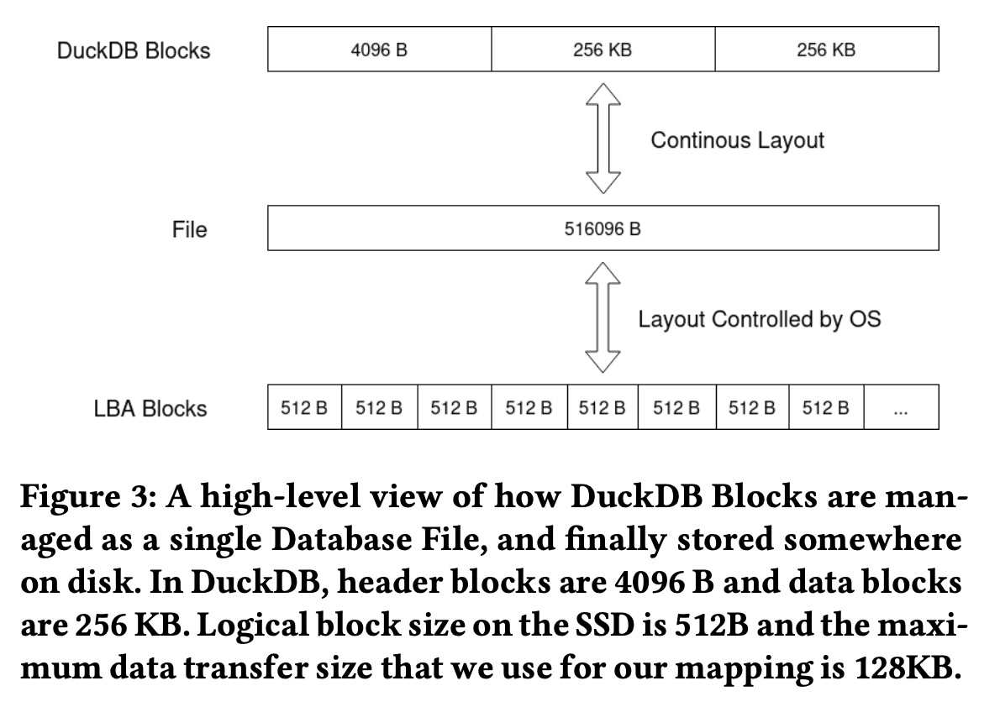
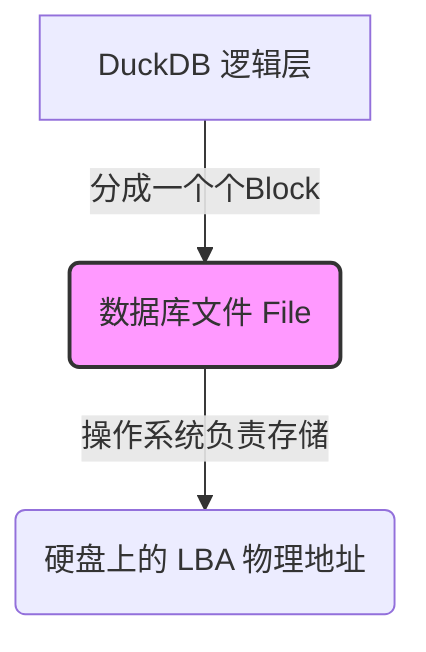
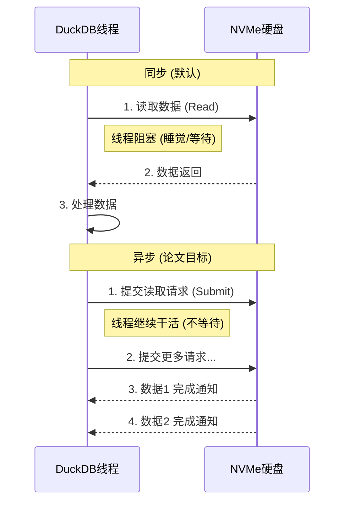
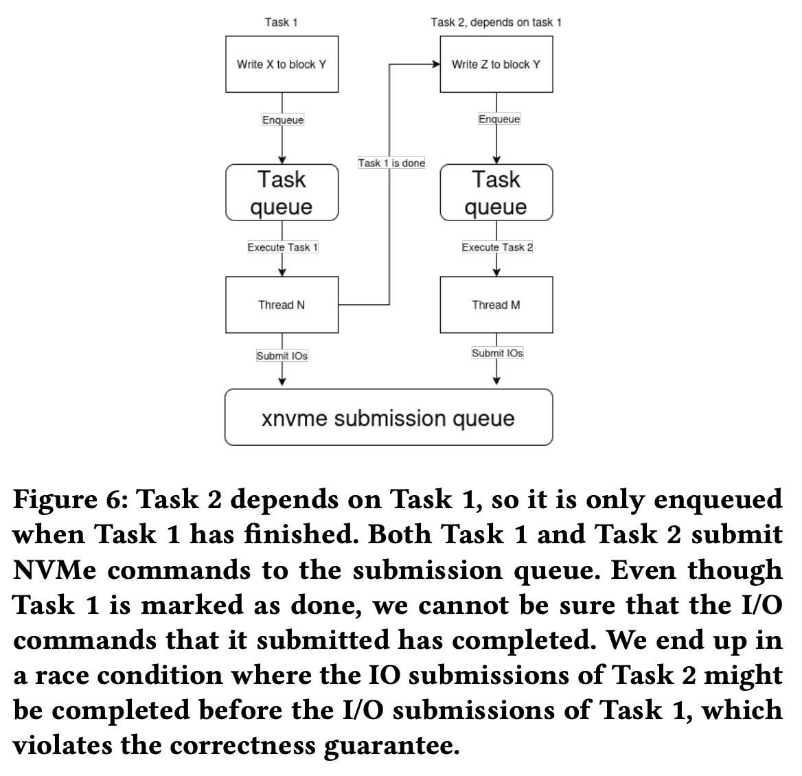
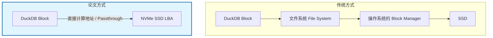
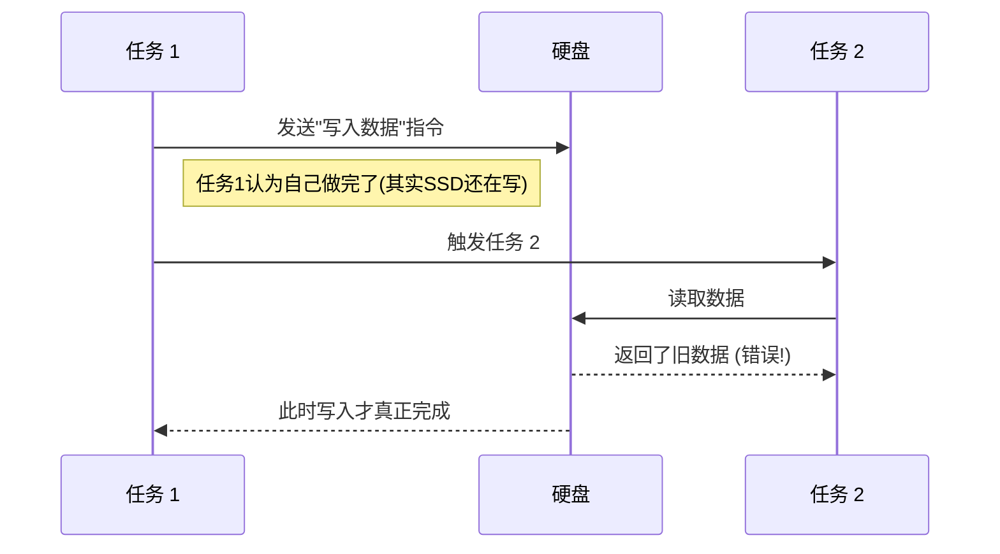
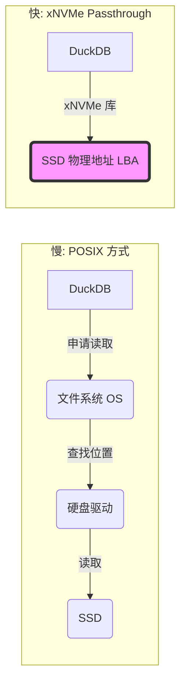
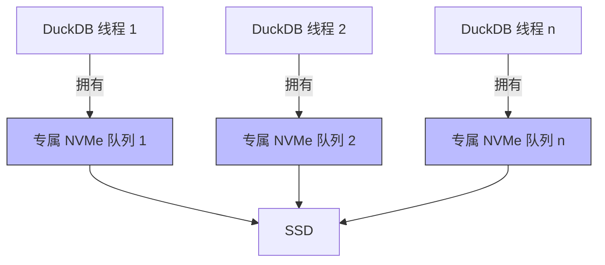

## AI论文解读 | DuckDB on xNVMe
        
### 作者        
digoal        
        
### 日期        
2025-12-04        
        
### 标签        
PostgreSQL , PolarDB , DuckDB , AI , 论文解读        
        
----        
        
## 背景  
      
https://arxiv.org/pdf/2512.01490        
  
提示:          
```          
读懂《DuckDB on xNVMe》这篇论文需要提前掌握哪些基础知识, 请使用中文通熟易懂的讲解这些基础知识, 可以引用论文中的图、表或使用Markdown支持的图形(text,mermaid等)增加解释性. 
  
使用中文通熟易懂的解读《DuckDB on xNVMe》这篇论文, 其中的关键内容请着重讲解, 可以引用论文中的图、表或使用Markdown支持的图形(text,mermaid等)增加解释性. 
  
提取《DuckDB on xNVMe》这篇论文中的重要术语, 使用中文对这些术语进行通熟易懂的讲解, 可以引用论文中的图、表或使用Markdown支持的图形(text,mermaid等)增加解释性. 
```     
  
## 1 前置知识 
  
要读懂《DuckDB on xNVMe》这篇论文，你需要理解**数据库内部原理**、**操作系统I/O栈**以及 **现代存储硬件（NVMe SSD）** 这三个领域的交叉知识。

这篇论文的核心在于： **如何修改DuckDB（一个数据库），让它绕过操作系统的文件系统，通过xNVMe（一个库）直接且异步地指挥NVMe SSD硬盘工作，从而提升性能。**

以下是分模块的通俗讲解，配合图表帮助你理解：

-----

### 1\. 基础主角：DuckDB 与 块管理 (Block Management)

**通俗理解：**
想象 DuckDB 是一个非常高效的图书管理员（OLAP数据库），它把所有数据都记在一个巨大的记事本里（单文件存储 ）。为了方便管理，它把这个大记事本撕成了很多页，每一页的大小是固定的（比如 256KB），这些页就叫**块（Block）** 。

**你需要知道的：**

  * **OLAP (联机分析处理):** DuckDB 擅长一次性读取大量数据进行分析（比如计算销售总额），而不是频繁修改单条记录。因此，读取速度（I/O）至关重要 。
  * **Buffer Manager (缓冲管理器):** 这是数据库的“内存中转站”。它负责把硬盘上的“块”搬到内存里让 CPU 处理。论文就在修改这个部分，让它搬运数据的方式更直接 。

**论文中的图解 (Figure 3):**
论文图3展示了这种映射关系。DuckDB 把所有数据看作连续的块，但实际上在硬盘（LBA）上，这些块是由操作系统负责摆放的。    



-----

### 2\. 操作系统 I/O 栈与 POSIX 接口

**通俗理解：**
在标准计算机中，软件（DuckDB）不能直接摸到硬件（SSD）。它必须填写申请单（**POSIX 接口**），交给管家（**操作系统内核/文件系统**），管家再把任务派给硬盘。

  * **优点：** 安全，通用。
  * **缺点：** 繁琐，管家处理申请单需要时间（系统调用开销），而且管家可能会自作聪明地做一些缓存，导致延迟 。

**论文的改进点：**
论文提出要“绕过管家”（**Bypass Kernel/File System**），直接跟硬件对话。这就是所谓的 **Passthrough (直通)** 。

  * **标准路径:** App -\> 文件系统 -\> 通用块层 -\> 驱动 -\> SSD
  * **论文路径:** App (DuckDB + xNVMe) -\> SSD 

-----

### 3\. 核心硬件：NVMe SSD 与 队列 (Queues)

**通俗理解：**
老式的硬盘（如HDD）像一个单窗口的售票处，你必须排队，处理完一个才能处理下一个。
**NVMe SSD** 像是一个拥有成千上万个窗口的超级售票大厅。它支持**多队列（Multi-Queue）** 。

**关键概念：**

  * **SQ (Submission Queue, 提交队列):** 你把任务（读/写）扔进这个队列。
  * **CQ (Completion Queue, 完成队列):** 硬盘做完任务后，把结果通知单扔进这个队列。
  * **并行性:** 现代 SSD 可以同时处理成千上万个读写请求。如果软件一次只发一个请求（同步），就浪费了 SSD 的能力 。

-----

### 4\. 关键技术差异：同步 I/O vs 异步 I/O (Sync vs Async)

这是论文最核心的改动点。

#### A. 同步 I/O (Synchronous, DuckDB 默认)

**场景：** 你去咖啡店点单。

1.  你点了一杯拿铁。
2.  **你站在柜台前傻等**，什么也不干，直到咖啡做好。
3.  拿到咖啡，你才去处理下一件事。

<!-- end list -->

  * **缺点：** 你的时间（CPU线程）被浪费在等待上 。

#### B. 异步 I/O (Asynchronous, 论文引入)

**场景：** 你去咖啡店点单。

1.  你点了一杯拿铁，拿到一个取餐器（Promise/Future）。
2.  **你回到座位继续写代码**（处理其他任务）。
3.  取餐器响了（Callback/Interrupt），你去拿咖啡。


  * **优点：** 你的时间被充分利用了。论文利用 xNVMe 实现了这一点 。

**图解区别：**



-----

### 5\. 并发难题：竞争条件 (Race Condition)

**通俗理解：**
当 DuckDB 变成异步（同时做很多事）后，会遇到新问题。
假设任务 B 依赖任务 A 的数据。

  * 在**同步**模式下，A 做完才做 B，没问题。
  * 在**异步**模式下，线程发出了 A 的请求，还没等硬盘做完，线程就可能误以为 A 搞定了，接着发出了 B 的请求。如果 B 比 A 先执行完（或者 B 读到了 A 还没写完的旧数据），数据就错了 。

**论文中的图解 (Figure 6):**
论文图6非常重要，它展示了这种风险：    

  * **Task 1** 发出写请求。
  * **Task 2** 依赖 Task 1，但也发出了请求。
  * 如果 Task 2 的请求在 SSD 内部比 Task 1 先执行（因为是异步的），程序逻辑就崩了。

**解决方案：** 论文尝试了多种策略，最终发现给**每个线程分配一个独立的 NVMe 队列 (Thread-owned Queues)** 是最好的办法，并在需要时强制等待（Drain queue）来保证顺序 。

-----

### 6\. 工具介绍：xNVMe 和 io\_uring

  * **xNVMe:** 可以把它理解为一个**万能遥控器**。它帮程序员屏蔽了底层操作系统的复杂性。你想用 Linux 的旧接口（libaio）还是新接口（io\_uring），或者直接发 NVMe 指令，只需要改一行配置，不用重写整个数据库代码 。
  * **io\_uring:** Linux 上最新的高性能异步 I/O 接口。论文实验证明，用 `io_uring` 配合 Passthrough（直通）模式效果最好 。

-----

### 总结：阅读路线建议

在阅读论文时，请按以下思维路径进行：

1.  **现状：** DuckDB 很快，但它用传统方式（POSIX 同步文件读取）访问硬盘，这在超高速 NVMe SSD 上成了瓶颈。
2.  **目标：** 让 DuckDB 直接指挥 NVMe SSD，并且一次发一堆指令（异步）。
3.  **手段：** 使用 xNVMe 库作为中介。
4.  **挑战：** 异步会导致乱序（竞争条件），怎么保证数据不出错？（看论文第5章的设计方案）。
5.  **结果：** 哪种设计方案最快？（看论文第7章的实验图表，重点关注 **Async Thread Queues**）。
  
## 2 解读论文 
  
这篇论文《DuckDB on xNVMe》探讨了一个核心问题： **当数据库（DuckDB）遇上超高速硬盘（NVMe SSD）时，传统的操作系统文件管理方式是否成了拖后腿的“中间商”？如果让数据库直接指挥硬盘，速度会不会更快？**

以下是这篇论文的通俗解读：

### 1\. 背景：为什么要折腾 DuckDB 的底层？

**DuckDB** 是一个非常流行的分析型数据库，设计初衷是“在任何地方运行”，因此它默认使用通用的 **POSIX 接口**来读写文件 。

  * **现状：** DuckDB 也就是像普通软件一样，通过操作系统（OS）的文件系统（如 EXT4, NTFS）来存取数据。
  * **问题：** 现代的 **NVMe SSD** 速度极快，且支持并行处理成千上万个请求。但操作系统的文件系统层级繁琐，而且传统的读写方式（同步 I/O）往往一次只做一个动作，浪费了 SSD 的性能 。

**论文的目标：**
利用 **xNVMe**（一个能让软件直接跟 SSD 对话的库），绕过操作系统的文件系统，让 DuckDB 直接对 SSD 的物理扇区进行读写，看看能快多少 。

-----

### 2\. 核心设计：如何“去中间商化”？

论文没有改变 DuckDB 管理数据的方式（依然是分成一块一块的），而是改变了数据**传输**的方式。

#### 2.1 映射机制：把硬盘当成裸设备

DuckDB 内部把数据切分成固定大小的“块”（Blocks，通常 256KB）。

  * **以前：** DuckDB 告诉 OS：“请把这个块写到 `db.file` 文件的第 1000 字节处。” OS 再去算这到底在硬盘哪里。
  * **现在（论文方案）：** 论文去掉了“文件”的概念。他们直接把 DuckDB 的块映射到 SSD 的 **逻辑块地址 (LBA)** 上 。

**图解：直接映射 (基于论文 Figure 3 & 5)**

  

  



#### 2.2 关键挑战：同步 vs 异步 (Sync vs Async)

这是论文最硬核的部分。DuckDB 默认是**同步**的（做完一步再做下一步），这保证了数据不出错，但慢。NVMe SSD 擅长**异步**（一次发一堆指令，不傻等，回头再收结果）。

论文尝试了三种“让 DuckDB 变异步”的方案，这也是实验的重点 ：

| 方案名称 | 通俗解释 | 结果评价 |
| :--- | :--- | :--- |
| **单队列 (Single Queue)** | 所有线程排同一个队去读写硬盘。 | **慢**。因为要加锁（Mutex），大家互相等待，浪费了并行能力 。 |
| **队列池 (Queue Pool)** | 开多个窗口（队列），线程随机挑一个用。 | **一般**。虽然比单队列好，但管理这些窗口依然有开销 。 |
| **线程独占队列 (Thread Queues)** | **(冠军方案)** 给每个工作线程分配一个专属的 NVMe 队列。 | **最快**。完全不需要加锁，每个线程自己管自己的硬盘通道 。 |

-----

### 3\. 遇到的最大坑：竞争条件 (Race Condition)

当把 DuckDB 改成异步时，出现了一个严重的逻辑漏洞。

**问题描述（基于 Figure 6）：**
DuckDB 依赖任务之间的顺序。比如，“任务2”必须等“任务1”写完数据才能开始。    

  * 在**同步**模式下，任务1结束就是真的结束了。
  * 在**异步**模式下，任务1把“写数据”的指令扔给硬盘就认为自己结束了（其实硬盘还在后台写）。此时任务2启动，可能会读到旧数据，导致数据库崩溃或结果错误 。

**图解：异步带来的风险**



**解决方案：**
在每个 DuckDB 块处理完之后，强制进行 **Drain（排空/等待）** 操作。也就是线程必须确认“刚才发给硬盘的活儿全干完了”，才能标记任务结束。这虽然牺牲了一点点异步的自由度，但找回了数据的正确性 。

-----

### 4\. 实验结果：到底快了多少？

研究团队使用 **TPC-H**（标准的数据库测试集）进行了测试，对比了标准 DuckDB 和改造后的版本 。

**主要结论：**

1.  **直通模式 (Passthrough) 有效：** 使用 Linux 的 `io_uring` 接口配合 NVMe 直通（Passthrough），比经过文件系统层要快 。
2.  **线程独占队列是赢家：** 实验证明，给每个线程分配独立 NVMe 队列的方案（Async Thread Queues），在绝大多数数据规模下都是最快的，显著优于标准版 DuckDB 。
3.  **大有潜力：** 随着数据量（Scale Factor）增大，性能提升越明显 。

### 5\. 总结

这篇论文通过实战证明了： **对于高性能数据库，操作系统通用的文件管理有时是累赘。**

通过 **xNVMe** 库实现**垂直整合（Vertical Integration）** ，让 DuckDB 能够像拥有“私人通道”一样直接、异步地访问 NVMe SSD，可以显著提升查询速度。最有效的手段是 **“每个线程配一个专属硬盘队列”** ，这样既发挥了 SSD 的并行能力，又避免了软件层面的锁竞争 。
  
## 3 术语 
  
这篇论文《DuckDB on xNVMe》探讨了如何通过绕过操作系统文件系统，让数据库（DuckDB）直接与高速硬盘（NVMe SSD）通信来提升性能。

为了读懂这篇论文，以下是其中最关键术语的**通俗易懂版**讲解：

-----

### 1\. 核心主角

#### **DuckDB (分析型数据库)**

  * **学术定义：** 进程内（In-process）的 OLAP（联机分析处理）数据库管理系统 。
  * **通俗讲解：** 想象它是一个**不仅能存数据，还能极速做复杂计算的“超级 Excel”** 。它不作为一个独立的服务器运行（像 MySQL 那样），而是直接嵌入在你的程序里运行。
  * **在这篇论文中：** 作者试图改造 DuckDB 的底层，让它存取数据的方式更现代化 。

#### **xNVMe (跨平台存储库)**

  * **学术定义：** 一个用于管理 NVMe SSD 设备的库，提供 I/O 独立性，允许运行时动态选择 I/O 接口 。
  * **通俗讲解：** 这是一个 **“万能遥控器”** 。通常程序员要跟硬盘打交道很麻烦，因为不同操作系统（Windows, Linux）方法不一样。xNVMe 帮程序员屏蔽了这些差异，而且允许程序员直接按“快进键”（直接发指令给硬盘），而不必经过操作系统的繁琐审核 。

-----

### 2\. 两种截然不同的“工作方式”

#### **POSIX I/O (传统方式)**

  * **学术定义：** DuckDB 默认使用的同步文件接口，依赖操作系统的文件系统 。
  * **通俗讲解：** 这是 **“走公文流程”** 。DuckDB 想读数据，必须填单子交给操作系统（OS），操作系统查文件表、检查权限、调度，最后才去读硬盘。
  * **缺点：** 流程太长，中间商（操作系统）赚差价（延迟），而且通常一次只能办一件事（同步） 。

#### **NVMe Passthrough (直通模式)**

  * **学术定义：** 绕过文件系统和块管理器，直接向 SSD 发出异步 I/O 指令 。
  * **通俗讲解：** 这是 **“走 VIP 快速通道”** 。DuckDB 不再把数据看作“文件”，而是直接对硬盘说：“把第 500 号格子的数据给我”。这种方式完全绕过了操作系统的文件系统层，减少了开销 。

**图解对比：**



-----

### 3\. 关键技术概念

#### **LBA (Logical Block Address, 逻辑块地址)**

  * **学术定义：** SSD 暴露出的逻辑块地址空间，DuckDB 的块被直接映射到这里 。
  * **通俗讲解：** 硬盘像一个巨大的**蜂巢快递柜**，每个格子都有一个唯一的编号（0, 1, 2, 3...），这个编号就是 LBA。
  * **论文的做法：** 以前 DuckDB 是把数据存在 `db.file` 这个文件里（由操作系统决定文件存在哪个柜子）。现在，DuckDB 直接霸占整个快递柜，自己算数据该放哪个编号的格子里 。

#### **Asynchronous I/O (异步 I/O)**

  * **学术定义：** 使用提交队列和完成队列来处理 I/O，不阻塞主线程 。
  * **通俗讲解：**  
      * **同步 (Sync):** 你去奶茶店点单，**站着死等**，直到奶茶做好拿到手，才去处理下一件事 。  
      * **异步 (Async):** 你去奶茶店点单，拿到一张小票（请求提交），**然后回座位玩手机**（处理其他任务）。等叫号了（完成通知），再去拿奶茶 。  
  * **论文发现：** 异步能让 CPU 不闲着，但也带来了复杂的“数据竞争”问题 。

#### **Race Condition (竞争条件)**

  * **学术定义：** 由于异步执行，后续任务可能在先决任务的 I/O 完成之前就开始执行，违反了正确性保证 。
  * **通俗讲解：** 这是一个 **“抢跑事故”** 。
      * 任务 A 说：“我要把数据写入硬盘。”（扔进队列，还没写完）
      * 任务 B 紧接着说：“我要读刚才任务 A 那个数据。”
      * 因为是异步的，任务 A 还在排队，任务 B 可能先跑去读了，结果读到了空的或者是旧的数据。
      * **解决：** 必须显式地确认“任务 A 真的做完了”才能开始任务 B 。

#### **Thread-Local Queues (线程独占队列)**

  * **学术定义：** 每个线程初始化并拥有自己的 NVMe 队列，无需互斥锁（Mutex）即可提交命令 。
  * **通俗讲解：** 这是论文中**性能最好**的方案。
      * **共享队列（旧方案）：** 就像只有一个点餐窗口，所有线程都要排队，还要争抢窗口的使用权（加锁），效率低 。
      * **线程独占队列（新方案）：** **给每个线程开一个专属的点餐窗口**。完全不需要排队争抢，大家各干各的，速度最快 。

#### **MDTS (Maximum Data Transfer Size, 最大数据传输大小)**

  * **学术定义：** 设备单次命令能处理的最大数据量，论文中为 128 KB 。
  * **通俗讲解：** 这是 **“一口能吃多少”** 的限制。虽然 DuckDB 的一个数据块是 256 KB，但这个硬盘（SSD）一口只能吃 128 KB。所以，DuckDB 必须把一个大块切成两半（两个 128 KB）喂给硬盘 。

-----

### 总结图：论文的终极方案 (Design 3)



**解释：** 这种“每人一个专用通道”的设计  避免了所有人都挤在一个门口（锁竞争），是论文实验中速度最快的方法 。
  
## 参考        
         
https://arxiv.org/pdf/2512.01490    
        
<b> 以上内容基于DeepSeek、Qwen、Gemini及诸多AI生成, 轻微人工调整, 感谢杭州深度求索人工智能、阿里云、Google等公司. </b>        
        
<b> AI 生成的内容请自行辨别正确性, 当然也多了些许踩坑的乐趣, 毕竟冒险是每个男人的天性.  </b>        
  
    
#### [PolarDB 学习图谱](https://www.aliyun.com/database/openpolardb/activity "8642f60e04ed0c814bf9cb9677976bd4")
  
  
#### [PostgreSQL 解决方案集合](../201706/20170601_02.md "40cff096e9ed7122c512b35d8561d9c8")
  
  
#### [德哥 / digoal's Github - 公益是一辈子的事.](https://github.com/digoal/blog/blob/master/README.md "22709685feb7cab07d30f30387f0a9ae")
  
  
#### [About 德哥](https://github.com/digoal/blog/blob/master/me/readme.md "a37735981e7704886ffd590565582dd0")
  
  

  
