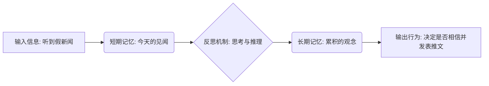
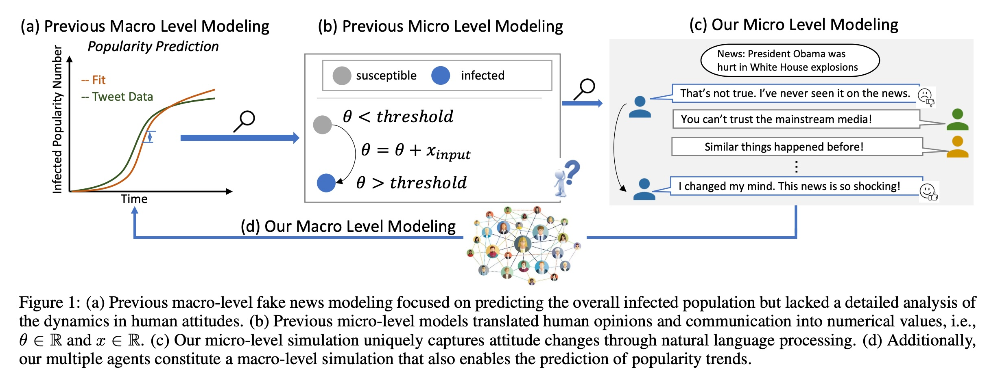
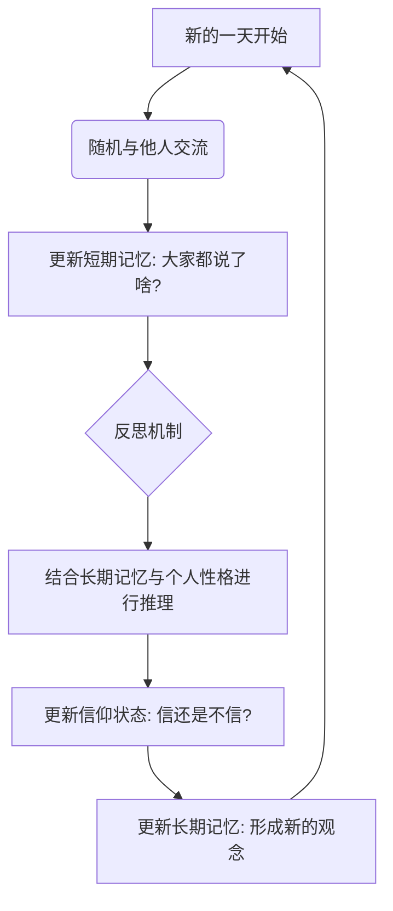
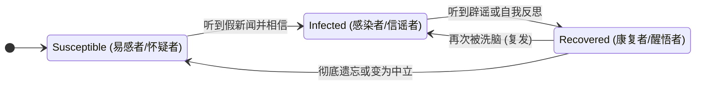

## AI论文解读 | From Skepticism to Acceptance: Simulating the Attitude Dynamics Toward Fake News
        
### 作者        
digoal        
        
### 日期        
2025-12-04        
        
### 标签        
PostgreSQL , PolarDB , DuckDB , AI , 论文解读        
        
----        
        
## 背景  
      
https://arxiv.org/pdf/2403.09498        
  
提示:          
```          
读懂《From Skepticism to Acceptance: Simulating the Attitude Dynamics Toward Fake News》这篇论文需要提前掌握哪些基础知识, 请使用中文通熟易懂的讲解这些基础知识, 可以引用论文中的图、表或使用Markdown支持的图形(text,mermaid等)增加解释性. 
  
使用中文通熟易懂的解读《From Skepticism to Acceptance: Simulating the Attitude Dynamics Toward Fake News》这篇论文, 其中的关键内容请着重讲解, 可以引用论文中的图、表或使用Markdown支持的图形(text,mermaid等)增加解释性. 
  
提取《From Skepticism to Acceptance: Simulating the Attitude Dynamics Toward Fake News》这篇论文中的重要术语, 使用中文对这些术语进行通熟易懂的讲解, 可以引用论文中的图、表或使用Markdown支持的图形(text,mermaid等)增加解释性. 
```     
  
## 1 前置知识 
  
要深入理解论文《From Skepticism to Acceptance: Simulating the Attitude Dynamics Toward Fake News》（从怀疑到接受：模拟对假新闻的态度动态），你需要掌握以下几个核心基础知识领域。这篇论文结合了**大语言模型（LLM）** 、**社会模拟（Agent-Based Modeling）以及传染病模型（SIR/SIS）** 。

为了让你更轻松地理解，我将用通俗易懂的语言为你拆解这些概念，并配合图表说明。

-----

### 1\. 核心概念：大语言模型智能体 (LLM-based Agents)

**通俗解释：**
想象你正在玩一个像《模拟人生》（The Sims）的游戏，但里面的角色（NPC）不再是只会说几句固定台词的机器人，而是每一个都装了一个像 ChatGPT 这样的大脑。

  * **传统模型**：以前的研究把人简化成一个数字（比如“0”代表不信谣，“1”代表信谣）。
  * **本论文模型**：把人看作“智能体（Agent）”。他们有名字、性格、学历，最重要的是，他们会**思考**、会**记忆**、会用**自然语言**说话 。

**论文中的关键设计：双重记忆与反思**
论文中提到的智能体像人一样，拥有“短期记忆”和“长期记忆” 。



  * **基础知识点**：你需要理解 LLM 不仅仅是聊天机器人，还可以被设定角色（Persona），并模拟人类的认知过程（听到 -\> 思考 -\> 改变观点）。

-----

### 2\. 核心数学模型：SIR 与 SIS 传染病模型

**通俗解释：**
在研究假新闻传播时，科学家通常把它比作**病毒传播**。这就用到了经典的传染病模型。你需要理解三个字母的含义：

  * **S (Susceptible, 易感者)** ：还没听到假新闻，或者听到了但还没信的人（持怀疑态度）。
  * **I (Infected, 感染者)** ：相信了假新闻，并且可能会传播给别人的人 。
  * **R (Recovered, 康复者)** ：以前信过，但后来意识到是假的，不再信了的人 。

**图解传统模型与论文模型的区别：**

  * **传统 SIR 模型**： $S \to I \to R$ （ 康复后通常有免疫力，不再变回 $I$ ）。
  * **论文使用的动态模型**：论文指出人的观点是**动态**的，今天信了辟谣（ 变回 $S$ 或 $R$ ），明天可能被洗脑又信了（ 变回 $I$ ）。这更接近 **SIS 模型**（ $S \leftrightarrow I$ ） 。

> **论文中的应用** ：  
> 论文使用微积分方程来描述这种变化速度：  
> $$\frac{dI}{dt} = \beta \cdot S \cdot I - \gamma \cdot I$$  
>  
>   * $\beta$ (beta)：传染率（不管信不信，一旦接触容易被洗脑的程度）。  
>   * $\gamma$ (gamma)：恢复率（如果不干预，人自己慢慢清醒的程度）。  

-----

### 3\. 微观建模 vs. 宏观建模 (Micro vs. Macro Level Modeling)

**通俗解释：**
这是研究复杂系统的两种视角，论文试图将二者结合。

  * **宏观 (Macro)** ：上帝视角。只看整体数据，比如“今天全网有 30% 的人信了谣言”。以前的研究多是这种，只能看到曲线图 。
  * **微观 (Micro)** ：个人视角。盯着某一个人（比如 Alice），看她听到了什么，心里怎么想，为什么改变主意。这是 LLM 的强项 。

**结合论文 Figure 1 进行解释：**    

| 视角 | 传统方法 (Previous Work) | 本论文方法 (Our Modeling) |
| :--- | :--- | :--- |
| **宏观** | **图 1(a)** : 只有一条曲线，预测感染人数。  | **图 1(d)** : 由无数个具体的“人”组成的网络图。  |
| **微观** | **图 1(b)** : 用公式计算概率 $\theta > \text{threshold}$ 。  | **图 1(c)** : **看具体的对话**。例如：“这不是真的！我看过新闻。” vs “你要相信我！”  |

-----

### 4\. 心理学基础：大五人格 (Big Five Traits)

**通俗解释：**
为什么同样的新闻，有人信，有人不信？论文引入了心理学中的**大五人格特质**来给智能体设定性格 。

你需要了解以下特质如何影响传播：

1.  **宜人性 (Agreeableness)** ：高分者倾向于相信别人，容易“随大流”。论文发现高宜人性的人更容易成为**轻信者 (Credulous)** 。
2.  **神经质 (Neuroticism)** ：情绪不稳定，容易焦虑。高分者也更容易受惊吓新闻的影响 。
3.  **开放性 (Openness)** 、**尽责性 (Conscientiousness)** 、**外向性 (Extraversion)** 。

**论文中的对比实验** ：

  * **Skeptical Trait (怀疑型性格)** ：低宜人性 + 低神经质 = 很难被忽悠。
  * **Credulous Trait (轻信型性格)** ：高宜人性 + 高神经质 = 容易成为谣言的温床。

-----

### 5\. 总结：阅读路径建议

掌握了以上知识后，你可以按照以下逻辑串联论文内容：

1.  **工具层**：论文利用 **LLM** 赋予了 NPC 说话和思考的能力 。
2.  **个体层 (Micro)** ：每个 NPC 根据自己的 **性格 (Big Five)** 和 **记忆**，决定是否相信假新闻 。
3.  **网络层 (Macro)** ：一群 NPC 互相聊天，形成了类似 **SIS 模型** 的传播曲线 。
4.  **干预层**：引入一个“官方号”发辟谣信息，观察能不能改变曲线 。

希望这些基础知识讲解能帮你更好地理解这篇论文！
  
## 2 解读论文 
  
这篇论文《From Skepticism to Acceptance: Simulating the Attitude Dynamics Toward Fake News》（从怀疑到接受：模拟对假新闻的态度动态）是一项非常有意思的研究。简单来说，作者们觉得以前研究假新闻传播的方法太“冷冰冰”了，只看数字，所以他们开发了一个基于 **大语言模型（LLM）** 的模拟系统，让 AI 扮演成百上千个有血有肉的“人”，在虚拟社区里聊天、传八卦，以此来观察假新闻到底是怎么骗过人类大脑的 。

以下是对这篇论文的通俗解读：

-----

### 1\. 核心痛点：为什么传统的模型不够好？

以前科学家研究假新闻传播，通常用数学公式（比如传染病模型 SIR）。

  * **传统做法**：把人简化成数字。比如， $0.6$ 代表怀疑， $0.8$ 代表相信。只要数字超过一个阈值，你就“被感染”了 。
  * **问题**：现实中，你相信一条新闻是因为它符合你的逻辑，或者因为你的朋友都在说，而不是因为你脑子里的某个数字加了 0.1。传统模型忽略了**语言的语义**和**人的复杂心理** 。

### 2\. 解决方案：FPS 框架 (Fake news Propagation Simulation)

作者提出了一个叫 **FPS** 的框架。你可以把它想象成一个**全是 AI 玩家的《模拟人生》游戏**。

#### 2.1 这里的“人”长什么样？ (微观层面)

每个智能体（Agent）都是一个独立的 ChatGPT (GPT-3.5) 。他们不像以前那样只是一个点，而是拥有丰富的人设：

  * **个人画像 (Persona)** ：有名字、年龄、学历，还有性格特质（基于大五人格理论，如是否容易焦虑、是否合群）。
  * **双重记忆系统 (Dual Memory)** ：这是为了模拟真实人类的遗忘和积累机制 。
      * **短期记忆**：记录今天听到了什么八卦。
      * **长期记忆**：经过反思后，将今天的信息总结并存入长期观念中。
  * **反思与推理 (Reasoning)** ：每天结束时，智能体会思考：“今天大家都说这件事是真的，虽然我之前不信，但好像有点道理……”然后决定是否改变观点 。

**智能体每日思考流程图：**



#### 2.2 宏观层面：社会网络

无数个这样的智能体组成了社会网络。论文使用了一个改进版的 **SIS 传染病模型** 。

  * **S (Susceptible)** ：易感者（持怀疑态度）。
  * **I (Infected)** ：感染者（信谣并传播）。
  * **R (Recovered)** ：康复者（以前信过，后来醒悟了）。
  * *特别之处*：论文认为人的观点是动态的，醒悟的人（R）如果周围环境变了，可能再次被洗脑变成感染者（I），这比传统的“免疫”模型更真实 。

-----

### 3\. 关键发现与实验结果

作者让这些 AI 在虚拟世界里跑了很多天，得出了几个非常符合现实的结论：

#### 3.1 政治新闻传播最快 (Topic Comparison)

实验对比了政治、科学、恐怖袭击等不同话题的假新闻。

  * **发现**：政治类假新闻（如关于奥巴马受伤的谣言）传播速度极快，感染人数在4天内就能达到顶峰，而且很难“康复” 。
  * **对比**：科学类假新闻（如飓风越过赤道）传播较慢，人们更容易保持理智或被辟谣 。

#### 3.2 性格决定命运 (Trait Comparison)

论文对比了两种极端的性格群体 ：

  * **轻信型 (Credulous)** ：高宜人性（老好人）、高神经质（情绪不稳定）。
      * *结果*：容易随大流，感染曲线飙升快，很难康复。
  * **怀疑型 (Skeptical)** ：低宜人性、低神经质（冷静、多疑）。
      * *结果*：会有很多人始终保持“康复”或“易感”状态，不容易完全信谣。

> **具体案例分析 (Case Study)** ：
>
>   * **Michael (轻信型)** ：在模拟中，第6天发现周围人都信了，他心想“大家都信，那我也信吧”，于是改变了立场。但他立场不坚定，很容易摇摆。
>   * **Sandra (怀疑型)** ：虽然听到了很多谣言，但她总是觉得“证据不足”，在15天里始终保持怀疑，非常淡定。

#### 3.3 如何干预最有效？ (Intervention Strategy)

论文引入了一个“官方辟谣账号”进入社区，测试了不同的辟谣策略 ：

| 策略 | 效果描述 | 结论 |
| :--- | :--- | :--- |
| **早期一次性辟谣** | 一开始效果很好，压制了谣言。但随着时间推移，大家**忘了**辟谣信息，谣言又反弹了 。 | 治标不治本 |
| **中期一次性辟谣** | 虽然能拉低感染人数，但因为此时信谣的人基数已经很大，效果有限 。 | 为时已晚 |
| **定期频繁辟谣** | 无论是每天还是每三天辟谣一次，都能将谣言控制在很低的水平 。 | **最佳策略** |

### 4\. 总结

这篇论文最大的贡献在于，它证明了**用大语言模型（LLM）来模拟人类社会传播是可行的**。它不仅能画出冷冰冰的传播曲线（宏观），还能让你点开每一个节点，看到那是 Michael 还是 Sandra，看到他们是因为什么具体的话语改变了想法（微观） 。

**给现实世界的启示**：

1.  **政治谣言最危险**，需要重点监控。
2.  **辟谣不能只做一次**，人类是健忘的，必须早期介入并持续重复辟谣信息才能生效 。
3.  **关注易感人群**，性格焦虑且容易轻信的人是假新闻的“易感体质”，可能需要定制化的干预手段 。
  
## 3 术语 
  
这篇论文《From Skepticism to Acceptance: Simulating the Attitude Dynamics Toward Fake News》构建了一个复杂的模拟系统来研究假新闻传播。为了让你轻松理解，我提取了其中的关键术语，并将其分为**系统架构**、**核心机制**和**社会动力学**三个部分进行通俗解读。

### 一、 系统架构：搭建虚拟世界

#### 1\. FPS (Fake news Propagation Simulation) —— 假新闻传播模拟框架

  * **通俗解释**：这是整篇论文打造的“虚拟沙盒”系统。你可以把它想象成一个**全是 AI 玩家的《模拟人生》游戏**。在这个框架里，研究人员不是用冷冰冰的公式算概率，而是让成百上千个 AI 角色互相聊天、发推特，以此来观察假新闻是怎么在一个社区里传开的 。
  * **作用**：它能同时看到宏观趋势（多少人信了）和微观细节（某个人为什么信了）。

#### 2\. LLM-based Agent (基于大语言模型的智能体)

  * **通俗解释**：这是虚拟世界里的“居民”。传统的模拟模型里，人只是一个数字节点；而在这里，每个居民背后都是一个 ChatGPT (GPT-3.5) 。
  * **特点**：他们会说话、会思考、有记忆，还能根据别人的话改变自己的想法。他们不是复读机，而是有“脑子”的虚拟人 。

#### 3\. DOA (Dynamic Opinion Agent) —— 动态观点智能体

  * **通俗解释**：这是指智能体在微观层面的“大脑运作机制”。
  * **核心逻辑**：它决定了一个人拥有什么样的性格、怎么处理记忆、以及如何根据听到的信息更新自己的观点（是信还是不信）。

#### 4\. AIS (Agent Interaction Simulator) —— 智能体交互模拟器

  * **通俗解释**：这是系统的“上帝之手”或者“调度员”。
  * **作用**：它负责安排谁和谁见面。比如今天安排 Alice 和 Bob 聊天，明天安排 Charlie 看到一条辟谣新闻。它还负责统计整个社区里有多少人被“感染”了 。

-----

### 二、 核心机制：让 AI 像人一样思考

#### 5\. Dual Memory (双重记忆系统)

  * **通俗解释**：人类不可能记住每一句闲聊，我们通常只记得“大概意思”。为了模拟这一点，论文设计了双重记忆 。
  * **图解机制**：


  * **短期记忆 ( $m^s$ )** ：像是一个临时的记事本，记录当天的所见所闻 。
  * **长期记忆 ( $m^l$ )** ：像是写进日记里的总结。每天晚上，智能体会反思当天的短期记忆，提取核心观点存入长期记忆，然后清空短期记忆 。

#### 6\. Persona & Big Five Traits (人设与大五人格)

  * **通俗解释**：为了不让所有 AI 都千篇一律，作者给他们设定了“性格身份证”。
  * **大五人格**：这是心理学中描述性格的五个维度（如外向性、宜人性、神经质等）。
      * **Credulous Trait (轻信型)** ：高宜人性（耳根子软）+ 高神经质（容易情绪化）= 容易信谣 。
      * **Skeptical Trait (怀疑型)** ：低宜人性（多疑）+ 低神经质（淡定）= 不容易被忽悠 。

-----

### 三、 社会动力学：谣言如何像病毒一样传播

#### 7\. Modified SIS/SIR Model (改进的传染病模型)

  * **通俗解释**：研究假新闻时，科学家通常把它比作病毒。论文使用了改进版的 SIS 模型来描述人群状态 。
  * **状态流转图**：




  * **S (Susceptible)** ：还没信谣，或者持怀疑态度的人 。
  * **I (Infected)** ：相信了假新闻，并且可能会传播给别人的人 。
  * **R (Recovered)** ：以前信过，但现在不信了。**关键点**：论文认为人的观点是动态的，"康复者"如果不坚定，过几天可能又变回"感染者" 。

#### 8\. Intervention (干预机制)

  * **通俗解释**：这是指“官方辟谣”。
  * **操作方式**：在模拟中引入一个特殊的“官方智能体 (Official Agent)”，向社区广播真相 。
  * **重要发现**：
      * **Early Intervention (早期干预)** ：一开始就辟谣，效果好但容易反弹（大家忘得快）。
      * **Frequent Intervention (频繁干预)** ：每隔几天辟谣一次，效果最好，能把谣言压制在低水平 。

#### 9\. Belief Average & Variance (信念均值与方差)

  * **通俗解释**：这是用来衡量最后大家“信得有多深”和“意见有多不统一”的指标。
  * **Belief Average**：分值越高，说明群体越相信假新闻（1.0代表全信，0.0代表全不信）。
  * **Belief Variance**：分值越高，说明大家吵得越凶，意见越不一致；分值低说明大家想法很统一（要么都信，要么都不信）。
  
## 参考        
         
https://arxiv.org/pdf/2403.09498    
        
<b> 以上内容基于DeepSeek、Qwen、Gemini及诸多AI生成, 轻微人工调整, 感谢杭州深度求索人工智能、阿里云、Google等公司. </b>        
        
<b> AI 生成的内容请自行辨别正确性, 当然也多了些许踩坑的乐趣, 毕竟冒险是每个男人的天性.  </b>        
  
    
#### [PolarDB 学习图谱](https://www.aliyun.com/database/openpolardb/activity "8642f60e04ed0c814bf9cb9677976bd4")
  
  
#### [PostgreSQL 解决方案集合](../201706/20170601_02.md "40cff096e9ed7122c512b35d8561d9c8")
  
  
#### [德哥 / digoal's Github - 公益是一辈子的事.](https://github.com/digoal/blog/blob/master/README.md "22709685feb7cab07d30f30387f0a9ae")
  
  
#### [About 德哥](https://github.com/digoal/blog/blob/master/me/readme.md "a37735981e7704886ffd590565582dd0")
  
  

  
