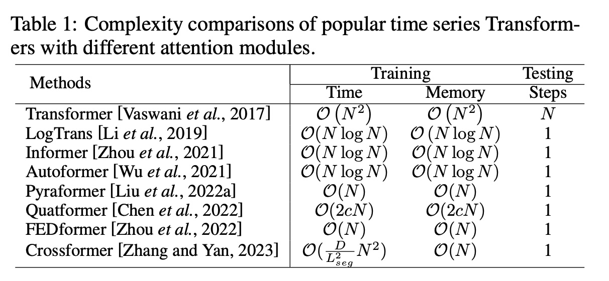
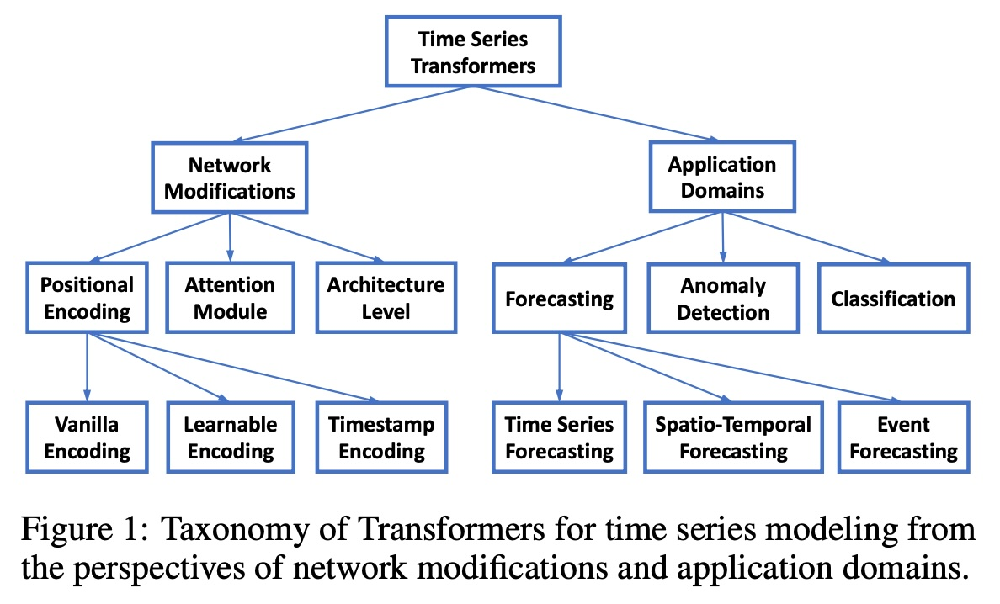
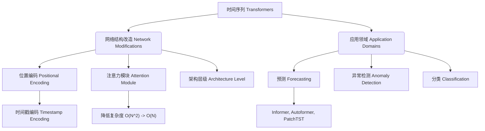
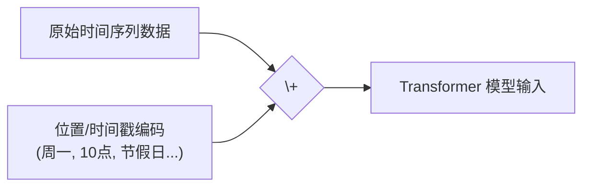
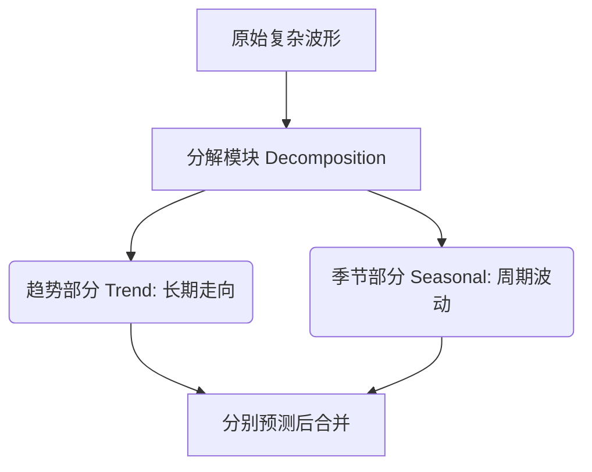

## AI论文解读 | Transformers in Time Series: A Survey
        
### 作者        
digoal        
        
### 日期        
2025-12-04        
        
### 标签        
PostgreSQL , PolarDB , DuckDB , AI , 论文解读        
        
----        
        
## 背景  
      
https://arxiv.org/pdf/2202.07125        
  
提示:          
```          
读懂《Transformers in Time Series: A Survey》这篇论文需要提前掌握哪些基础知识, 请使用中文通熟易懂的讲解这些基础知识, 可以引用论文中的图、表或使用Markdown支持的图形(text,mermaid等)增加解释性. 
  
使用中文通熟易懂的解读《Transformers in Time Series: A Survey》这篇论文, 其中的关键内容请着重讲解, 可以引用论文中的图、表或使用Markdown支持的图形(text,mermaid等)增加解释性. 
  
提取《Transformers in Time Series: A Survey》这篇论文中的重要术语, 使用中文对这些术语进行通熟易懂的讲解, 可以引用论文中的图、表或使用Markdown支持的图形(text,mermaid等)增加解释性. 
```     
  
## 1 前置知识 
  
阅读这篇综述论文《Transformers in Time Series: A Survey》，你需要掌握 **“时间序列分析基础”** 和 **“Transformer模型原理”** 这两大块核心知识。因为这篇论文主要探讨的是如何“改造”原本用于自然语言处理（NLP）的 Transformer，使其适应时间序列数据的特性。

以下是为你整理的通俗易懂的基础知识清单，结合了论文中的概念进行解释。

-----

### 第一部分：时间序列数据的“脾气” (Time Series Fundamentals)

在阅读论文探讨的各项任务（预测、异常检测、分类）之前，你需要理解时间序列数据本身有哪些核心特征。论文中提到的许多模型改进（如去平稳化、季节性分解）都是为了解决这些问题。

#### 1\. 趋势与季节性 (Trend & Seasonality)

  * **概念**：时间序列通常由不同成分组成。
      * **趋势 (Trend)** ：数据长期的上升或下降方向（例如：过去10年房价的总体上涨）。
      * **季节性 (Seasonality)** ：数据中重复出现的周期性模式（例如：冰淇淋销量在夏天高、冬天低）。
  * **论文关联**：论文提到，如何同时捕捉长距离依赖和短期的季节性是一个挑战 。许多改进模型（如 Autoformer）引入了“季节性-趋势分解”（Seasonal-Trend Decomposition）架构，把复杂的时间序列拆开来处理 。

#### 2\. 平稳性 (Stationarity)

  * **概念**：如果不平稳（Non-stationary），数据的统计特性（如均值、方差）会随时间改变，这会让模型很难预测未来。
  * **论文关联**：论文特别提到了 `Non-stationary Transformer` ，专门解决数据分布随时间变化的问题。理解这个概念有助于你读懂为什么模型需要做“归一化”或“去平稳化”处理。

#### 3\. 依赖关系 (Dependencies)

  * **长程依赖 (Long-range Dependency)** ：过去很久以前发生的事，依然影响现在。这是 Transformer 相比 RNN（循环神经网络）最大的优势 。
  * **多变量依赖 (Multivariate Dependency)** ：如果有多个变量（例如：温度、湿度、风速），它们之间也会互相影响。

-----

### 第二部分：Transformer 的“心脏” (Core Mechanism)

这是阅读论文最关键的门槛。你需要理解 Vanilla Transformer（原版 Transformer）是如何工作的，才能看懂论文中提到的各种“魔改”版本。

#### 1\. 编码器-解码器架构 (Encoder-Decoder Architecture)

  * **概念**：Transformer 通常由两部分组成。**编码器**负责“阅读”历史数据并提取特征，**解码器**负责根据这些特征“生成”未来的预测结果 。
  * **图解逻辑**：
    ```mermaid
    graph LR
        A[输入: 过去7天的气温] --> B(Encoder 编码器: 理解模式)
        B --> C{Latent Features 特征}
        C --> D(Decoder 解码器: 推理未来)
        D --> E[输出: 明天的气温]
    ```

#### 2\. 自注意力机制 (Self-Attention Mechanism) —— **核心中的核心**

  * **通俗解释**：想象你在读一句话，当读到某个词时，你的大脑会自动关注句子中其他相关的词。
      * Transformer 计算输入序列中每两个点之间的“相关性”。
      * 公式： $Attention(Q,K,V)=softmax(\frac{QK^{T}}{\sqrt{D_{k}}})V$ 。
      * **Q (Query)** ：我（当前的查询）。
      * **K (Key)** ：你（被查询的标签）。
      * **V (Value)** ：内容（实际的信息）。
  * **论文关联（重点）** ：原版 Attention 需要计算每两个点之间的关系，计算量是 $O(N^2)$ （N是序列长度）。当时间序列很长时，这太慢了 。
      * 论文中提到的 **LogTrans, Informer, Pyraformer** ，本质上都是在想办法**降低这个 $O(N^2)$ 的计算复杂度**（例如只算重要的点，或者用稀疏矩阵）。

#### 3\. 位置编码 (Positional Encoding)

  * **概念**：Transformer 是并行处理数据的（像一把抓），它本身不知道“昨天”在“今天”前面。所以必须给数据打上“时间戳”标记。
  * **原版做法**：使用正弦和余弦函数生成的固定向量 。
  * **论文关联**：时间序列有特殊的“时间戳”（如：周一、节假日、小时）。论文专门有一节讨论 **Network Modifications - Positional Encoding** ，介绍了如何把“日历信息”喂给模型（Timestamp Encoding）。

#### 4\. 多头注意力 (Multi-head Attention)

  * **概念**：相当于找了多个不同视角的“专家”来观察数据。一个头关注短期波动，另一个头关注长期趋势 。

-----

### 第三部分：高阶概念 (Advanced Concepts for Deep Understanding)

为了完全读懂论文中的模型对比（如 Table 1 ），你还需要了解一点点算法和信号处理知识。

  

#### 1\. 计算复杂度 (Big O Notation)

  * **概念**：衡量算法速度的指标。
  * **应用**：
      * $O(N^2)$ ：原版 Transformer。序列长度翻倍，计算量翻4倍（慢）。
      * $O(N \log N)$ ： **Informer** 模型的改进目标（较快）。
      * $O(N)$ ： **FEDformer** 或 **Pyraformer** 的目标（线性，最快）。
  * **为什么重要**：这是评估模型是否适合**长序列预测 (Long-term Forecasting)** 的核心指标。

#### 2\. 频域分析 (Frequency Domain / Fourier Transform)

  * **概念**：把时间序列波形转换成频率图谱。
  * **论文关联**：论文中提到的 **FEDformer** 利用了傅里叶变换（Fourier Transform）和小波变换，在频域中进行注意力计算 。如果你懂一点“时域转频域”的概念，就能理解它为什么能加速。

-----

### 总结：你的阅读路线图

为了最高效地阅读这篇论文，建议按以下步骤准备：

1.  **复习 Transformer 基础**：特别是 $Q, K, V$ 是怎么算的，以及为什么要除以 $\sqrt{D_k}$ 。
2.  **建立“问题意识”** ：带着问题去读——“时间序列和自然语言有什么不同？”
      * 答案预告：时间序列有连续性、周期性，而且不需要像NLP那样庞大的词汇表。
3.  **关注论文分类图 (Figure 1)** ：    
      * 论文把改进分成了 **网络结构修改 (Network Modifications)** 和 **应用领域 (Application Domains)** 。
      * 你可以先看 **Network Modifications** 中的 Attention Module ，这是百家争鸣最激烈的地方（如 LogTrans, Informer 等）。

| 知识模块 | 关键术语 | 论文对应章节 |
| :--- | :--- | :--- |
| **模型基础** | Self-Attention, Positional Encoding, Encoder-Decoder | Sec 2. Preliminaries |
| **核心痛点** | $O(N^2)$ Complexity, Long-range dependency | Sec 4.2 Attention Module |
| **数据特征** | Seasonality, Trend, Timestamp | Sec 4.1 Positional Encoding |
| **进阶优化** | Sparse Attention, Low-rank, Frequency Domain | Sec 5.1 Forecasting (Module-level) |

掌握了以上这些，你就能顺畅地理解为什么作者说“Transformer 在时间序列中展现了巨大的潜力” ，以及各种变体究竟“变”在哪里了。
  
## 2 解读论文 
  
这篇综述论文《Transformers in Time Series: A Survey》系统地回顾了 **Transformer** 架构在 **时间序列（Time Series）** 建模中的应用与发展 。

Transformer 原本是自然语言处理（NLP）领域的王者，但因为它擅长捕捉**长距离依赖关系（Long-range dependencies）** ，即“很久以前发生的事如何影响现在”，这一特性非常适合处理时间序列数据 。

以下是对这篇论文核心内容的通俗解读：

-----

### 1\. 全文概览：一张图看懂分类体系

论文提出了一个新的分类体系（Taxonomy），从**网络结构改造**和**应用领域**两个维度来分析现有的模型 。



*(基于论文图1整理 )*

  

-----

### 2\. 核心挑战与网络改造 (Network Modifications)

原版 Transformer 直接用于时间序列有几个“水土不服”的地方，论文总结了研究者们是如何解决这些问题的：

#### 关键点 A：位置编码 (Positional Encoding) —— 告诉模型“时间”是什么

  * **挑战**：Transformer 是并行处理数据的，它本身不知道数据的前后顺序。
  * **改进方案**：
      * **Vanilla（原版）** ：使用固定的正弦/余弦函数，效果一般 。
      * **Learnable（可学习）** ：让模型自己学习位置信息的最佳表达 。
      * **Timestamp Encoding（时间戳编码 - 重要）** ：这是时间序列独有的。利用现实中的日历信息（秒、分、时、周、月、节假日）作为额外的特征输入。例如 **Informer** 和 **Autoformer** 就在模型中加入了这种特殊的编码，让模型理解“今天是周五”这种隐含信息 。

#### 关键点 B：注意力模块 (Attention Module) —— 解决计算太慢的问题

  * **挑战**：原版 Transformer 的计算复杂度是 $O(N^2)$ 。当时间序列很长（例如预测未来1个月的每分钟数据）时，计算量会爆炸，内存和时间都耗不起 。
  * **改进方案**：这是论文中讨论最多的部分，目标是让计算变快（见下表）。

| 模型名称 | 核心机制 | 计算复杂度 | 解释 |
| :--- | :--- | :--- | :--- |
| **Transformer** | Vanilla | $O(N^2)$ | 每一个点都要和所有点算一次关系（慢）。 |
| **LogTrans** | 稀疏偏置 | $O(N \log N)$ | 只算一部分重要的关系，使用 LogSparse 掩码 。 |
| **Informer** | 概率稀疏 | $O(N \log N)$ | 挑选出“占主导地位”的查询（Query）进行计算 。 |
| **FEDformer** | 频域注意力 | $O(N)$ | 利用傅里叶变换，在频率域中计算注意力，速度极快（线性）。 |

-----

### 3\. 主要应用领域：预测 (Forecasting)

预测是时间序列中最热门的任务。论文详细对比了多个明星模型 。

#### 模块级改进 (Module-level Variants)

大部分模型是在原版 Transformer 基础上修改某个组件：

  * **Informer**：不仅降低了注意力复杂度，还设计了一个**生成式解码器 (Generative Style Decoder)** ，可以一次性输出长序列预测，避免了一步步预测带来的累积误差 。
  * **Autoformer**：引入了**季节性-趋势分解 (Seasonal-Trend Decomposition)** 。它强制模型把复杂的波形拆解成“长期趋势”和“周期性波动”两部分分别处理，极大地提高了准确性 。
  * **PatchTST**：最近的创新。它把时间序列切成一个个小片段（Patches），就像处理图像一样处理时间序列，并采用了通道独立（Channel-independent）策略，效果非常好 。

#### 解释性与结构 (Architecture-level)

  * **Pyraformer**：设计了金字塔形的层级结构，像是在不同分辨率下看数据（小时级、天级、周级），以此捕捉多尺度的依赖关系 。

-----

### 4\. 实验发现：打破常识的“真相” (Experimental Evaluation)

论文作者在 ETTm2 数据集上进行了大量实验，得出了一些发人深省的结论：

#### 1\. 鲁棒性分析：输入越长越好吗？

  * **常识**：输入给模型的历史数据越长，预测应该越准。
  * **发现**： **并不是！** 许多精心设计的 Transformer 模型（如 Informer, LogTrans），当输入序列变长时，性能反而下降或没有提升 。这意味着它们并没有像宣称的那样完美地利用长程信息。

#### 2\. 模型大小分析：越深越好吗？

  * **常识**：在 NLP（如 GPT-3）中，层数越多效果越好。
  * **发现**：在时间序列中，**浅层模型（3-6层）往往比深层模型效果更好** 。这说明简单的堆砌层数在时间序列任务上可能导致过拟合。

#### 3\. 季节性-趋势分解的作用

  * **实验**：作者尝试给普通模型加上简单的“移动平均分解”模块。
  * **发现**：仅仅加上这个简单的分解步骤，就能让模型性能提升 **50% 到 80%** 。这证明了在时间序列中，**显式地处理趋势和季节性**比单纯依赖注意力机制更重要。

-----

### 5\. 未来方向与总结

论文最后指出了几个非常有潜力的研究方向：

1.  **引入归纳偏置 (Inductive Biases)** ：时间序列有其独特的物理特性（如周期性）。未来的模型应该更聪明地利用这些特性，而不是像原版 Transformer 那样把数据当成白板 。
2.  **Transformer + GNN**：对于多变量或时空数据（如交通流），结合图神经网络（GNN）来处理空间依赖是必然趋势 。
3.  **预训练模型 (Pre-trained Transformers)** ：类似于 NLP 中的 BERT，时间序列领域目前还缺乏大规模的通用预训练模型 。

**总结**：这篇论文认为 Transformer 在时间序列领域潜力巨大，但不能生搬硬套 NLP 的做法。成功的关键在于**针对时间序列的特性（如季节性、多尺度、计算效率）进行特定的改造** 。
  
## 3 术语 
  
这篇论文《Transformers in Time Series: A Survey》主要探讨了如何将最初用于自然语言处理（NLP）的 Transformer 模型“改装”后应用于时间序列分析 。

为了读懂这篇论文，我们需要理解以下几个核心术语。我会用通俗的语言配合图示为你解读：

### 1\. 核心机制类术语

#### **自注意力机制 (Self-Attention)**

  * **通俗解释**：想象你在看过去一年的股价图。当你关注“今天”的价格时，你会下意识地去回看过去某些特定的日子（比如之前的最高点、最低点），而不是平均地关注每一天。自注意力机制就是让计算机模拟这个过程，自动计算出“过去的时间点”对“当前时间点”的重要性（权重） 。
  * **论文中的痛点**：原版的自注意力机制需要计算每两个时间点之间的关系，计算量非常巨大（ $O(N^2)$ ），这使得处理长序列变得很慢 。

#### **位置编码 (Positional Encoding)**

  * **通俗解释**：Transformer 是并行处理数据的（像一把抓），它天生不分“前后”。对于时间序列来说，“昨天”必须在“今天”前面。位置编码就像是给每个数据打上页码，告诉模型它们的顺序 。
  * **变体 - 时间戳编码 (Timestamp Encoding)** ：
      * 这是针对时间序列特有的改进。普通的页码是 1, 2, 3...，而时间戳编码则是把现实世界的日历信息（秒、分、时、周、月、节假日）编码进去 。
      * **作用**：让模型理解“今天是周五，流量通常比周一高”这种隐含的周期性规律 。




-----

### 2\. 效率与结构优化术语

#### **稀疏注意力 (Sparse Attention)**

  * **通俗解释**：既然计算所有点之间的关系太慢，那就只计算“重要”的关系。就像在一个大派对里，你不需要和几百个人都握手，只需要和几个核心人物（Key Persons）交流就能掌握全场动态 。
  * **代表模型**：
      * **LogTrans**：使用一种固定的稀疏模具（LogSparse mask）来减少计算量 。
      * **Informer**：它更聪明，通过概率计算筛选出那些“最重要”的查询（Dominant Queries），忽略不重要的部分 。

#### **计算复杂度 (Computational Complexity)**

  * **通俗解释**：衡量模型算得有多快、占多少内存的指标。
  * **论文数据对比**（参考论文 Table 1 ）：    
      * **$O(N^2)$**：原版 Transformer。序列长度翻倍，计算量翻4倍（慢，如 Vanilla Transformer）。
      * **$O(N \log N)$**：优化后的模型。速度显著提升（如 Informer, LogTrans）。
      * **$O(N)$**：线性复杂度。最快，序列多长，计算量就线性增加多少（如 FEDformer, Pyraformer）。

#### **分层/金字塔架构 (Hierarchical Structure)**

  * **通俗解释**：不仅看细节，也要看轮廓。就像看地图，既可以看街道（高分辨率），也可以看整个城市（低分辨率）。这种架构让模型同时捕捉短期波动和长期趋势 。
  * **代表模型**： **Pyraformer** 使用这种金字塔结构，越往上层，概括性越强，计算效率也越高 。

-----

### 3\. 时间序列特性术语

#### **季节性-趋势分解 (Seasonal-Trend Decomposition)**

  * **通俗解释**：把复杂的时间波形拆解成简单的零件。
      * **趋势 (Trend)** ：长期是涨还是跌？
      * **季节性 (Seasonal)** ：是不是每年夏天都高，冬天都低？
  * **论文发现**：论文特别指出，像 **Autoformer** 这样的模型，通过强制把这两部分分开处理，不仅让预测更准，还能让模型更容易理解 。
  * **实验结论**：论文中的实验表明，加上这个简单的分解步骤，能把模型性能提升 50% 到 80% 。




#### **平稳性 (Stationarity) 与 去平稳化 (De-stationary)**

  * **通俗解释**：
      * **平稳**：数据的统计规律（比如平均值）不随时间变化。
      * **非平稳**：现实中的数据往往是乱变的（比如突发的疫情导致数据分布完全改变）。
  * **重要改进**： **Non-stationary Transformer** 专门解决这个问题。它通过归一化模块让数据看起来“平稳”以便模型处理，处理完再把那些变化的统计特性加回去，从而提高预测准确度 。

-----

### 4\. 常见模型速查 (Model Showcase)

论文中反复提到几个名字，它们代表了不同的技术流派：

| 模型名称 | 核心绝招 (通俗版) | 引用 |
| :--- | :--- | :--- |
| **Informer** | **“抓重点”** ：只计算最重要的注意力连接，并能一次性生成长序列预测。 |  |
| **Autoformer** | **“拆解法”** ：把数据拆成趋势和周期分别看，并用自相关机制代替传统注意力。 |  |
| **FEDformer** | **“频域法”** ：把时间波形转换成频率图谱（傅里叶变换），在频率世界里找规律，速度极快。 |  |
| **Pyraformer** | **“金字塔”** ：用多层分辨率（像不同缩放倍数的地图）来捕捉长短期的关系。 |  |
| **PatchTST** | **“切片法”** ：把时间序列切成小块（Patches），像处理图片像素一样处理时间片段。 |  |

通过理解这些术语，你就能明白这篇论文其实是在讲：如何通过**降低计算复杂度**、**引入时间特有的编码**以及**利用分解和频率分析**，让 Transformer 这个语言模型的天才，变成时间序列分析的专家。
  
## 参考        
         
https://arxiv.org/pdf/2202.07125    
        
<b> 以上内容基于DeepSeek、Qwen、Gemini及诸多AI生成, 轻微人工调整, 感谢杭州深度求索人工智能、阿里云、Google等公司. </b>        
        
<b> AI 生成的内容请自行辨别正确性, 当然也多了些许踩坑的乐趣, 毕竟冒险是每个男人的天性.  </b>        
  
    
#### [PolarDB 学习图谱](https://www.aliyun.com/database/openpolardb/activity "8642f60e04ed0c814bf9cb9677976bd4")
  
  
#### [PostgreSQL 解决方案集合](../201706/20170601_02.md "40cff096e9ed7122c512b35d8561d9c8")
  
  
#### [德哥 / digoal's Github - 公益是一辈子的事.](https://github.com/digoal/blog/blob/master/README.md "22709685feb7cab07d30f30387f0a9ae")
  
  
#### [About 德哥](https://github.com/digoal/blog/blob/master/me/readme.md "a37735981e7704886ffd590565582dd0")
  
  

  
