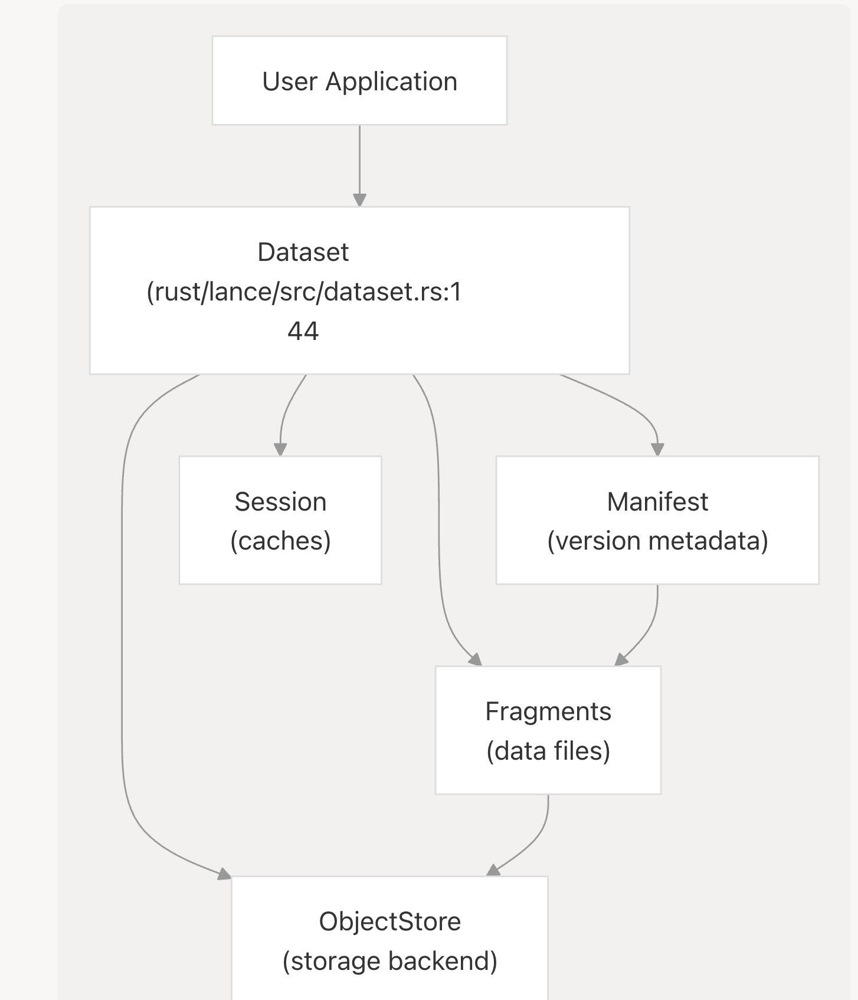
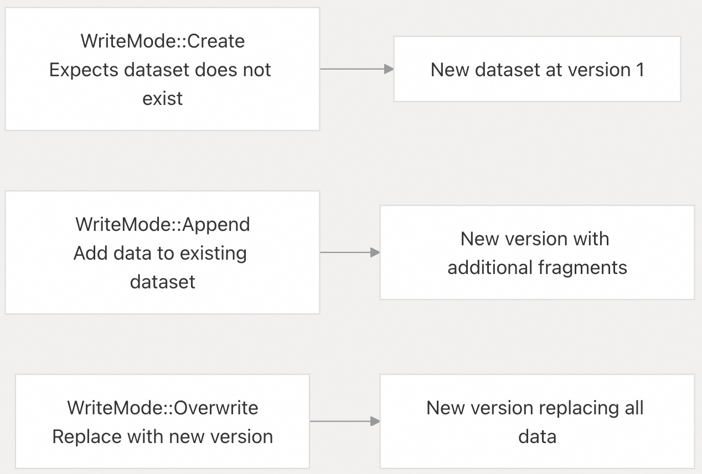
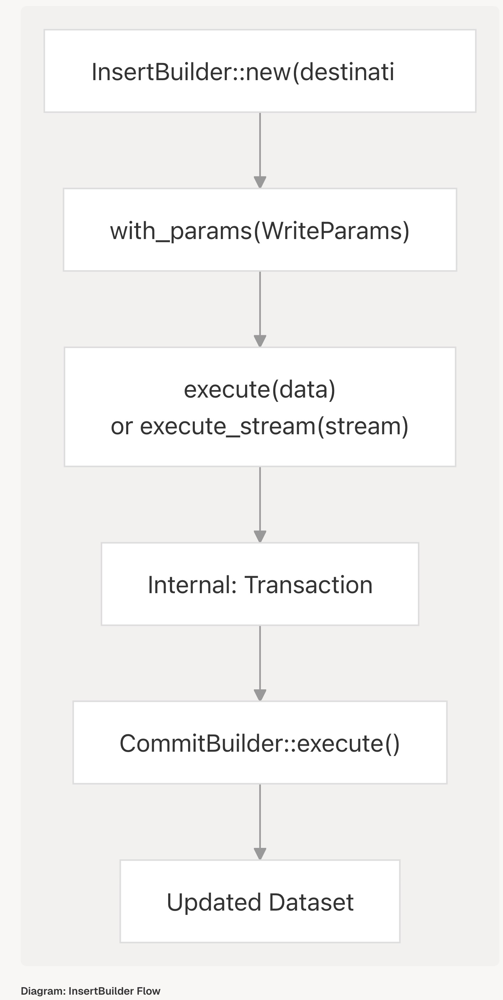
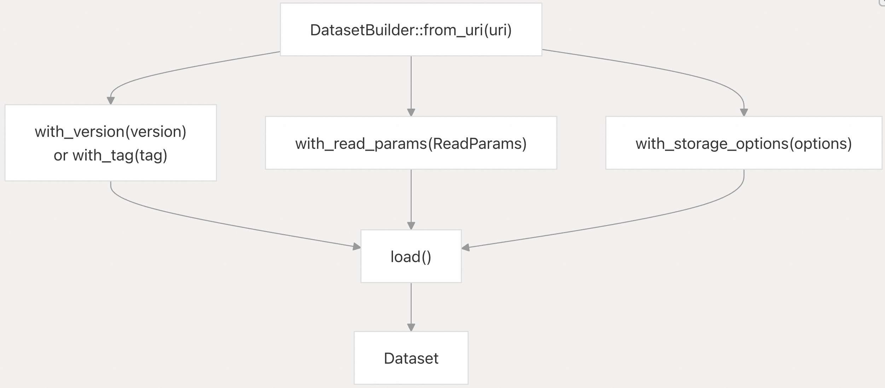
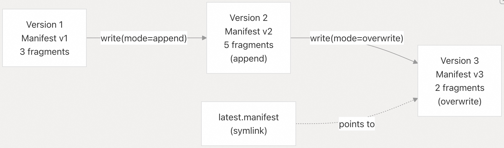
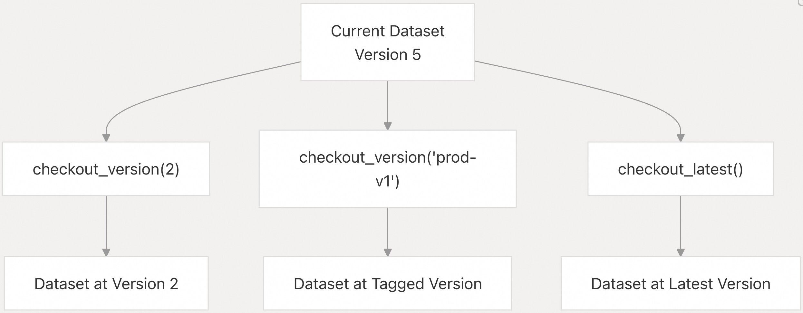
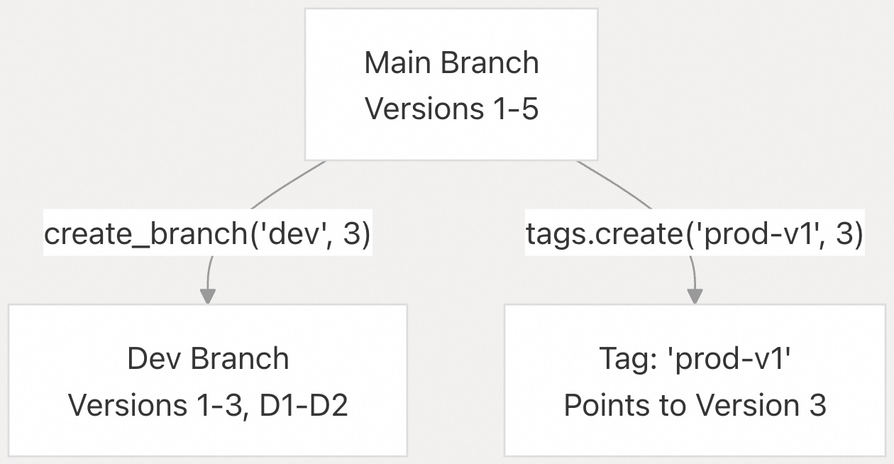
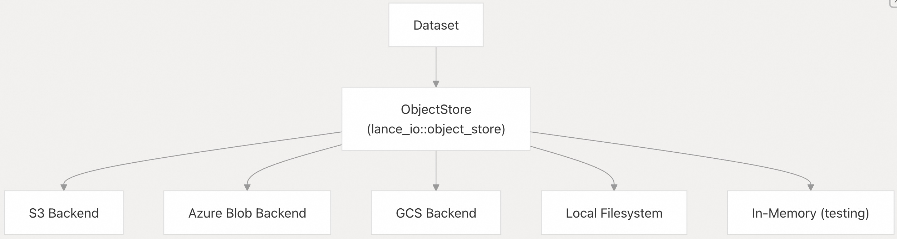
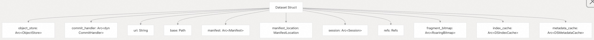
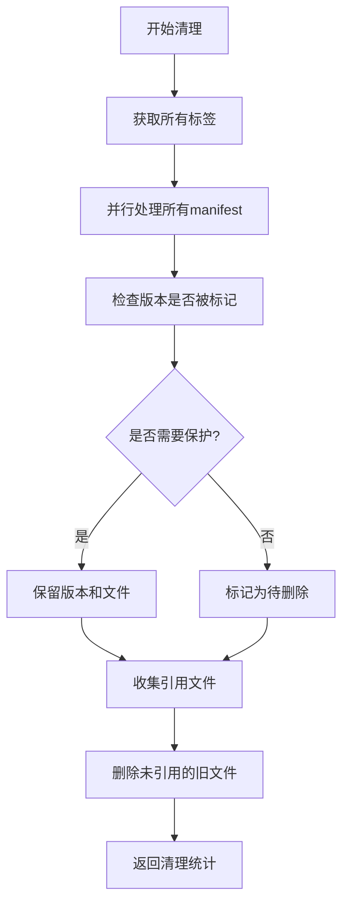

## Lance 源码学习: 3 Dataset Management (数据集管理)  
                                                    
### 作者                                                    
digoal                                                    
                                                    
### 日期                                                    
2025-12-04                                                    
                                                    
### 标签                                                    
Lance , AI 数据存储与搜索引擎 , 存储引擎 , 向量索引 , 标量索引 , 全文检索 , 多模态支持 , 零拷贝 , 版本控制 , 时间旅行 , 源码学习 , 随机访问加速 , Parquet                                   
                                                    
----                                                    
                                                    
## 背景             
本文解释了 **Dataset (数据集)** 这一抽象概念，它是与 Lance 数据进行交互的主要入口点。一个 **Dataset (数据集)** 代表了一个以 Lance 格式存储的**版本化 (versioned)** 、**列式表 (columnar table)** 。本文从高层次涵盖了数据集的创建、打开和管理。  
  
-----  
  
## 核心概念 (Core Concepts)  
  
### Dataset 抽象 (The Dataset Abstraction)  
  
`Dataset` 是 Lance 用于处理数据的主要接口。它代表了一个版本化的**数据片段 (fragment)** 集合，并通过 **清单 (manifest)** （描述当前状态的元数据）进行管理。每个数据集都由一个 **URI (统一资源标识符)** 标识，并存储在**对象存储 (object store)** 中。  
  
  
  
**图表: Dataset 核心组件**  
  
**来源:**  
[`rust/lance/src/dataset.rs` 142-173](https://github.com/lance-format/lance/blob/0204e7e2/rust/lance/src/dataset.rs#L142-L173)  
[`python/python/lance/dataset.py` 406-460](https://github.com/lance-format/lance/blob/0204e7e2/python/python/lance/dataset.py#L406-L460)  
  
### 关键数据结构 (Key Data Structures)  
  
| 组件 (Component) | Rust 类型 (Rust Type) | Python 类型 (Python Type) | 目的 (Purpose) |  
| --- | --- | --- | --- |  
| Dataset (数据集) | `lance::dataset::Dataset` | `lance.LanceDataset` | 数据集操作的主要接口 |  
| Manifest (清单) | `lance_table::format::Manifest` | 内部 (通过 `_Dataset`) | 版本元数据和模式 (schema) |  
| Fragment (数据片段) | `lance_table::format::Fragment` | `lance.LanceFragment` | 数据的水平分区 |  
| ObjectStore (对象存储) | `lance_io::object_store::ObjectStore` | 内部 | 存储抽象层 |  
| Session (会话) | `lance::session::Session` | `lance._Session` | 共享缓存和配置 |  
  
**来源:**  
[`rust/lance/src/dataset.rs` 142-173](https://github.com/lance-format/lance/blob/0204e7e2/rust/lance/src/dataset.rs#L142-L173)  
[`python/python/lance/dataset.py` 447-454](https://github.com/lance-format/lance/blob/0204e7e2/python/python/lance/dataset.py#L447-L454)  
  
### 基于 URI 的寻址 (URI-Based Addressing)  
  
数据集通过 **URI (统一资源标识符)** 进行寻址，该 URI 指定了存储位置和协议：  
  
  * **本地文件系统:** `file:///path/to/dataset` 或 `/path/to/dataset`  
  * **S3:** `s3://bucket/path/to/dataset`  
  * **Azure:** `az://container/path/to/dataset`  
  * **GCS:** `gs://bucket/path/to/dataset`  
  * **内存中 (测试):** `memory://dataset_name`  
  
**来源:**  
[`python/python/lance/dataset.py` 427-428](https://github.com/lance-format/lance/blob/0204e7e2/python/python/lance/dataset.py#L427-L428)  
[`rust/lance/src/dataset.rs` 147-151](https://github.com/lance-format/lance/blob/0204e7e2/rust/lance/src/dataset.rs#L147-L151)  
  
-----  
  
## 创建数据集 (Creating Datasets)  
  
### 写入模式 (Write Modes)  
  
Lance 支持三种**写入模式 (WriteMode)** ，由 `WriteMode` 枚举控制：  
  
  
  
**图表: 写入模式**  
  
**来源:**  
[`rust/lance/src/dataset/write.rs` 113-138](https://github.com/lance-format/lance/blob/0204e7e2/rust/lance/src/dataset/write.rs#L113-L138)  
  
| 模式 (Mode) | 行为 (Behavior) | 用例 (Use Case) |  
| --- | --- | --- |  
| `Create` | 创建新数据集，如果已存在则失败 | 初始数据集创建 |  
| `Append` | 向现有数据集追加**数据片段 (fragment)** | 增量数据摄取 (Incremental data ingestion) |  
| `Overwrite` | 用新版本替换数据 | 完全刷新、模式演变 (schema evolution) |  
  
**来源:**  
[`rust/lance/src/dataset/write.rs` 113-138](https://github.com/lance-format/lance/blob/0204e7e2/rust/lance/src/dataset/write.rs#L113-L138)  
[`python/python/tests/test_dataset.py` 96-109](https://github.com/lance-format/lance/blob/0204e7e2/python/python/tests/test_dataset.py#L96-L109)  
  
### InsertBuilder 模式 (InsertBuilder Pattern)  
  
`InsertBuilder` 提供了创建数据集的灵活接口：  
  
  
  
**图表: InsertBuilder 流程**  
  
**来源:**  
[`rust/lance/src/dataset/write/insert.rs` 45-62](https://github.com/lance-format/lance/blob/0204e7e2/rust/lance/src/dataset/write/insert.rs#L45-L62)  
  
**关键方法 (Key Methods):**  
  
  * `InsertBuilder::new(destination)` - 使用 **URI** 或现有数据集创建构建器  
  * `with_params(params)` - 配置写入参数  
  * `execute(data)` - 写入数据并提交**事务 (transaction)**  
  * `execute_stream(stream)` - 从流写入以支持大型数据集  
  * `execute_uncommitted(data)` - 在不提交的情况下写入 (高级)  
  
**来源:**  
[`rust/lance/src/dataset/write/insert.rs` 45-175](https://github.com/lance-format/lance/blob/0204e7e2/rust/lance/src/dataset/write/insert.rs#L45-L175)  
  
### 写入参数 (Write Parameters)  
  
`WriteParams` 控制数据集创建的各个方面：  
  
| 参数 (Parameter) | 类型 (Type) | 默认值 (Default) | 描述 (Description) |  
| --- | --- | --- | --- |  
| `max_rows_per_file` | `usize` | 1,048,576 | 单个文件中的最大行数 |  
| `max_rows_per_group` | `usize` | 1,024 | 每个行组 (row group) 的最大行数 |  
| `max_bytes_per_file` | `usize` | 90 GB | 文件大小的软限制 |  
| `mode` | `WriteMode` | `Create` | **写入模式 (WriteMode)** (Create/Append/Overwrite) |  
| `data_storage_version` | `Option<LanceFileVersion>` | 最新稳定版本 | 文件格式版本 |  
| `enable_stable_row_ids` | `bool` | `false` | 使用**稳定行 ID (stable row IDs)** (实验性) |  
| `enable_v2_manifest_paths` | `bool` | `false` | 使用 V2 **清单 (manifest)** 命名 |  
  
**来源:**  
[`rust/lance/src/dataset/write.rs` 156-280](https://github.com/lance-format/lance/blob/0204e7e2/rust/lance/src/dataset/write.rs#L156-L280)  
  
-----  
  
## 打开数据集 (Opening Datasets)  
  
### DatasetBuilder 模式 (DatasetBuilder Pattern)  
  
`DatasetBuilder` 提供了带配置的灵活数据集打开方式：  
  
  
  
**图表: DatasetBuilder 构造流程**  
  
**来源:**  
[`rust/lance/src/dataset/builder.rs`](https://github.com/lance-format/lance/blob/0204e7e2/rust/lance/src/dataset/builder.rs) (引用自 [`rust/lance/src/dataset.rs` 440-446](https://github.com/lance-format/lance/blob/0204e7e2/rust/lance/src/dataset.rs#L440-L446))  
  
**常见的打开模式 (Common Opening Patterns):**  
  
1.  **打开最新版本**  
  
```  
// Rust  
let dataset = Dataset::open("s3://bucket/dataset").await?;  
```  
  
```  
# Python  
dataset = lance.dataset("s3://bucket/dataset")  
```  
  
2.  **打开特定版本**  
  
```  
// Rust  
let dataset = DatasetBuilder::from_uri(uri)  
    .with_version(42)  
    .load().await?;  
```  
  
```  
# Python  
dataset = lance.dataset(uri, version=42)  
```  
  
3.  **按标签打开**  
  
```  
# Python  
dataset = lance.dataset(uri, version="prod-v1")  
```  
  
**来源:**  
[`rust/lance/src/dataset.rs` 440-446](https://github.com/lance-format/lance/blob/0204e7e2/rust/lance/src/dataset.rs#L440-L446)  
[`python/python/lance/dataset.py` 409-584](https://github.com/lance-format/lance/blob/0204e7e2/python/python/lance/dataset.py#L409-L584)  
  
### ReadParams 配置 (ReadParams Configuration)  
  
**ReadParams (读取参数)** 控制打开数据集时的缓存和存储行为：  
  
| 参数 (Parameter) | 类型 (Type) | 默认值 (Default) | 描述 (Description) |  
| --- | --- | --- | --- |  
| `index_cache_size_bytes` | `usize` | 6 GB | 索引缓存大小 |  
| `metadata_cache_size_bytes` | `usize` | 1 GB | 元数据缓存大小 |  
| `session` | `Option<Arc<Session>>` | None | 用于多数据集缓存的共享**会话 (Session)** |  
| `store_options` | `Option<ObjectStoreParams>` | None | 存储后端配置 |  
| `commit_handler` | `Option<Arc<dyn CommitHandler>>` | Auto | 自定义提交协调 (例如 DynamoDB) |  
  
**来源:**  
[`rust/lance/src/dataset.rs` 210-315](https://github.com/lance-format/lance/blob/0204e7e2/rust/lance/src/dataset.rs#L210-L315)  
  
-----  
  
## 数据集生命周期 (Dataset Lifecycle)  
  
### 版本和清单 (Versions and Manifests)  
  
每次写入操作都会创建数据集的一个新**版本 (version)** 。版本是**不可变 (immutable)** 的，并由从 1 开始的顺序整数标识。  
  
  
  
**图表: 数据集版本历史**  
  
**来源:**  
[`rust/lance/src/dataset.rs` 186-208](https://github.com/lance-format/lance/blob/0204e7e2/rust/lance/src/dataset.rs#L186-L208)  
[`python/python/tests/test_dataset.py` 273-294](https://github.com/lance-format/lance/blob/0204e7e2/python/python/tests/test_dataset.py#L273-L294)  
  
**版本结构 (Version Structure):**  
  
每个版本包含：  
  
  * **版本号** (顺序整数)  
  * **时间戳** (UTC 创建时间)  
  * **元数据** (键值属性)  
  * **数据片段列表 (Fragment list)** (此版本中的数据文件)  
  * **模式 (Schema)** (列定义)  
  * **索引元数据** (可用索引)  
  
**来源:**  
[`rust/lance/src/dataset.rs` 186-208](https://github.com/lance-format/lance/blob/0204e7e2/rust/lance/src/dataset.rs#L186-L208)  
  
### 清单存储 (Manifest Storage)  
  
**清单 (Manifest)** 存储在 `_versions` 目录中，有两种命名方案：  
  
| 方案 (Scheme) | 格式 (Format) | 示例 (Example) | 使用时机 (When Used) |  
| --- | --- | --- | --- |  
| V1 (遗留) | `{version}.manifest` | `42.manifest` | 较旧数据集的默认设置 |  
| V2 (新) | `{timestamp}.manifest` | `20240115120000000000.manifest` | 支持 O(1) 最新版本查找 |  
  
**来源:**  
[`python/python/tests/test_dataset.py` 404-426](https://github.com/lance-format/lance/blob/0204e7e2/python/python/tests/test_dataset.py#L404-L426)  
[`rust/lance/src/dataset.rs` 622-741](https://github.com/lance-format/lance/blob/0204e7e2/rust/lance/src/dataset.rs#L622-L741)  
  
### Checkout 操作 (Checkout Operations)  
  
`checkout_version()` 方法允许**时空穿梭 (time-travel)** 到以前的**版本 (version)** ：  
  
  
  
**图表: Checkout 操作**  
  
**来源:**  
[`rust/lance/src/dataset.rs` 448-484](https://github.com/lance-format/lance/blob/0204e7e2/rust/lance/src/dataset.rs#L448-L484)  
[`python/python/tests/test_dataset.py` 315-332](https://github.com/lance-format/lance/blob/0204e7e2/python/python/tests/test_dataset.py#L315-L332)  
  
### 标签和分支 (Tags and Branches)  
  
**标签 (Tags)** 为特定**版本 (version)** 提供命名引用：  
  
  * 不可变的引用 (类似于 Git 标签)  
  * 不受清理操作影响  
  * 通过 `dataset.tags` 属性访问  
  
**分支 (Branches)** 提供具有独立版本历史的**可变引用 (mutable references)** ：  
  
  * 独立版本谱系 (类似于 Git 分支)  
  * 通过**浅克隆 (shallow cloning)** 创建  
  * 通过 `dataset.branches` 属性管理  
  
  
  
**图表: 标签和分支**  
  
**来源:**  
[`rust/lance/src/dataset.rs` 463-549](https://github.com/lance-format/lance/blob/0204e7e2/rust/lance/src/dataset.rs#L463-L549)  
[`python/python/tests/test_dataset.py` 428-488](https://github.com/lance-format/lance/blob/0204e7e2/python/python/tests/test_dataset.py#L428-L488)  
  
-----  
  
## 存储架构 (Storage Architecture)  
  
### 对象存储抽象 (Object Store Abstraction)  
  
Lance 使用 **ObjectStore (对象存储)** 抽象来支持多个存储后端：  
  
  
  
**图表: 对象存储架构**  
  
**来源:**  
[`rust/lance/src/dataset.rs` 145](https://github.com/lance-format/lance/blob/0204e7e2/rust/lance/src/dataset.rs#L145-L145)  
[`rust/lance-io/src/object_store.rs`](https://github.com/lance-format/lance/blob/0204e7e2/rust/lance-io/src/object_store.rs)    
  
### 多基路径存储 (Multi-Base Storage)  
  
数据集可以通过使用**基路径 (base paths)** 跨越多个存储位置。这使得能够：  
  
  * **分层存储 (Tiered storage)** (热数据在快速存储上，冷数据在廉价存储上)  
  * **浅克隆 (Shallow cloning)** (在数据集之间共享基础数据)  
  * **存储迁移 (Storage migration)** (逐步迁移到新存储)  
  
  
  
**图表: 多基路径存储**  
  
**来源:**  
[`python/python/lance/dataset.py` 666-679](https://github.com/lance-format/lance/blob/0204e7e2/python/python/lance/dataset.py#L666-L679)  
[`rust/lance/src/dataset/write.rs` 452-556](https://github.com/lance-format/lance/blob/0204e7e2/rust/lance/src/dataset/write.rs#L452-L556)  
  
**基路径结构 (Base Path Structure):**  
  
每个 `BasePath` 包含：  
  
  * **ID** - 唯一标识符 (0 为默认/根)  
  * **Path** - 到存储位置的 **URI**  
  * **Name** - 可选的人类可读名称  
  * **is\_dataset\_root** - 这是否是主存储位置  
  
**来源:**  
[`python/python/lance/dataset.py` 390-445](https://github.com/lance-format/lance/blob/0204e7e2/python/python/lance/dataset.py#L390-L445)  
[`rust/lance/src/dataset/write.rs` 452-556](https://github.com/lance-format/lance/blob/0204e7e2/rust/lance/src/dataset/write.rs#L452-L556)  
  
-----  
  
## 数据集属性 (Dataset Properties)  
  
### 核心属性 (Core Properties)  
  
| 属性 (Property) | 类型 (Type) | 描述 (Description) |  
| --- | --- | --- |  
| `uri` | `str` | 数据集 **URI**/位置 |  
| `version` | `int` | 当前**版本号 (version number)** |  
| `latest_version` | `int` | 可用的最新版本 |  
| `schema` | `pa.Schema` | Arrow 数据集模式 |  
| `lance_schema` | `LanceSchema` | 带有元数据的 Lance 特有模式 |  
| `manifest` | `Manifest` | 当前**清单 (manifest)** (内部) |  
  
**来源:**  
[`python/python/lance/dataset.py` 536-938](https://github.com/lance-format/lance/blob/0204e7e2/python/python/lance/dataset.py#L536-L938)  
[`rust/lance/src/dataset.rs` 142-173](https://github.com/lance-format/lance/blob/0204e7e2/rust/lance/src/dataset.rs#L142-L173)  
  
### 统计信息 (Statistics)  
  
数据集跟踪各种统计信息：  
  
  * **行数 (Row count)** - 所有**数据片段 (fragment)** 的总行数  
  * **数据片段数 (Fragment count)** - 数据文件数量  
  * **数据文件数 (Data file count)** - 包括多文件**数据片段 (fragment)**  
  * **索引元数据 (Index metadata)** - 可用索引及其属性  
  
**来源:**  
[`python/python/lance/dataset.py` 943-1009](https://github.com/lance-format/lance/blob/0204e7e2/python/python/lance/dataset.py#L943-L1009)  
  
-----  
  
## 内部结构 (Internal Structure)  
  
### 内存表示 (In-Memory Representation)  
  
  
  
**图表: 数据集内部结构**  
  
**来源:**  
[`rust/lance/src/dataset.rs` 142-173](https://github.com/lance-format/lance/blob/0204e7e2/rust/lance/src/dataset.rs#L142-L173)  
  
### 关键内部字段 (Key Internal Fields)  
  
  * **`object_store`** - 用于读写文件的**对象存储 (ObjectStore)** 后端  
  * **`commit_handler`** - 管理原子版本更新  
  * **`manifest`** - 不可变的**版本 (version)** 元数据  
  * **`session`** - 跨数据集的共享缓存和配置  
  * **`fragment_bitmap`** - 快速查找**数据片段 (fragment)** ID  
  * **`index_cache`** - 用于快速查询的缓存索引数据  
  * **`metadata_cache`** - 缓存的文件元数据  
  
**来源:**  
[`rust/lance/src/dataset.rs` 142-173](https://github.com/lance-format/lance/blob/0204e7e2/rust/lance/src/dataset.rs#L142-L173)  
  
-----  
  
# 附录1: 数据生命周期管理与成本控制 (版本与维护角度)  
  
Lance 数据集的核心机制是**不可变（immutable）** 的**版本 (Version)** ，每次写入操作都会创建新的 **Fragment (数据片段)** 和 **Manifest (清单)** 。  
  
**关键问题：**  
  
> 基于版本化和不可变性的设计，数据工程师应如何管理随时间累积的旧版本数据，以避免存储成本失控？在日常**维护动作**中，清理操作（如过期版本删除或数据压缩）的触发机制和具体步骤是什么？该机制如何确保在清理物理文件时，不会破坏依赖于旧版本的 **Tags (标签)** 或 **Branches (分支)** 所支持的**时空穿梭 (time-travel)** 能力？  
  
*(此问题关注架构师和数据工程师的**背景痛点**：长期存储成本和维护复杂性。)*  
  
## 回答  
  
## 数据生命周期管理与成本控制  
  
Lance通过版本化的不可变设计提供了灵活的数据生命周期管理机制，主要包括手动清理、自动清理和标签保护三种策略。  
  
### 清理机制概述  
  
Lance的清理系统围绕`CleanupPolicy`构建，支持基于时间、版本号和保留数量的清理策略  。清理操作会删除旧的manifest文件、未被引用的数据文件、删除文件和索引文件  。  
  
### 触发机制  
  
#### 1. 手动清理  
通过`cleanup_old_versions`方法手动触发：  
  
```python  
# Python API  
stats = dataset.cleanup_old_versions(  
    older_than=timedelta(days=14),  
    delete_unverified=False,  
    error_if_tagged_old_versions=True  
)  
```    
  
#### 2. 自动清理  
在创建数据集时配置自动清理参数：  
  
```python  
# 写入时配置自动清理  
write_params = WriteParams(  
    auto_cleanup=AutoCleanupParams(  
        interval=1,  # 每1个版本触发一次  
        older_than=timedelta(days=7)  # 清理7天前的版本  
    )  
)  
```    
  
自动清理通过`auto_cleanup_hook`实现，每次提交时检查是否达到清理间隔  。  
  
### 清理策略配置  
  
`CleanupPolicy`提供多种配置选项：  
  
- **before_timestamp**: 清理指定时间之前的版本  
- **before_version**: 清理指定版本号之前的版本    
- **delete_unverified**: 是否删除未验证的文件（默认False，需7天以上）  
- **error_if_tagged_old_versions**: 遇到带标签的旧版本时是否报错（默认True）    
  
### Tags和Branches保护机制  
  
为确保时空穿梭能力，Lance实施了严格的保护机制：  
  
1. **标签保护**: 带标签的版本永远不会被清理，除非先删除标签    
  
2. **引用检查**: 清理前会收集所有有效manifest引用的文件，确保不删除仍在使用的数据    
  
3. **安全验证**: 未被任何manifest引用的文件必须至少7天 old 才能被删除，避免误删正在写入的文件    
  
### 清理流程  
  
清理操作的详细流程：  
  

  
### 实际使用建议  
  
1. **定期清理**: 建议配置自动清理，如保留最近30天的版本  
2. **标签管理**: 为重要版本创建标签，如生产模型检查点  
3. **监控成本**: 通过`CleanupStats`监控清理效果    
4. **渐进式清理**: 先设置`error_if_tagged_old_versions=False`测试，再启用严格模式  
  
## Notes  
  
- 清理操作不会删除当前最新版本，即使它满足清理条件    
- Java API提供相同的清理功能，通过`CleanupPolicy.builder()`配置    
- 索引文件也会被清理，但只有当它们不被任何有效版本引用时    
  
  
  
  
-----  
  
# 附录2: 分布式环境下的数据一致性与性能优化 (架构与配置角度)  
  
Lance 抽象了 **ObjectStore (对象存储)** 并支持 **Multi-Base Storage (多基路径存储)** ，能够应对分布式和分层存储的场景。  
  
**关键问题：**  
  
> 对于跨区域或跨存储后端（如 S3、GCS）部署的 Lance 数据集，**架构师**应如何配置 **ReadParams (读取参数)** （如缓存大小）或利用 **Commit Handler (提交协调器)** 来解决分布式环境下的**数据一致性痛点**？特别是在**多基路径存储**中，Lance 如何在不牺牲查询性能的前提下，确保**事务 (Transaction)** 的原子性和隔离性，以支持高效的**存储迁移**和**分层存储**策略？  
  
*(此问题关注架构师的**背景痛点**：跨存储的一致性保证和性能配置的细节展开。)*  
  
## 回答  
  
## 分布式环境下的数据一致性与性能优化配置指南  
  
### ReadParams 配置优化  
  
在分布式环境中，`ReadParams` 提供了关键的缓存和存储配置选项：  
  
```rust  
pub struct ReadParams {  
    /// 索引缓存大小（字节），默认 6 GiB  
    pub index_cache_size_bytes: usize,  
    /// 元数据缓存大小（字节），默认 1 GiB    
    pub metadata_cache_size_bytes: usize,  
    /// 提交处理器，用于解析最新版本  
    pub commit_handler: Option<Arc<dyn CommitHandler>>,  
    /// 文件读取选项  
    pub file_reader_options: Option<FileReaderOptions>,  
}  
```    
  
**缓存配置建议**：  
- **跨区域部署**：增加 `index_cache_size_bytes` 到 12-24 GiB 以减少网络往返  
- **高频查询场景**：设置 `metadata_cache_size_bytes` 为 2-4 GiB  
- **Python API 配置**：  
```python  
dataset = lance.dataset(  
    "s3://bucket/data.lance",  
    index_cache_size_bytes=12*1024*1024*1024,  # 12 GiB  
    metadata_cache_size_bytes=2*1024*1024*1024,  # 2 GiB  
    read_params={  
        "cache_repetition_index": True,  # 缓存大型字符串/二进制列  
        "validate_on_decode": False  # 生产环境可关闭验证提升性能  
    }  
)  
```    
  
### Commit Handler 配置  
  
Lance 根据存储后端自动选择合适的提交处理器：  
  
```rust  
pub async fn commit_handler_from_url(  
    url_or_path: &str,  
    options: &Option<ObjectStoreParams>,  
) -> Result<Arc<dyn CommitHandler>>  
```    
  
**不同存储后端的处理器选择**：  
- **本地文件系统**：`RenameCommitHandler` (Windows) 或 `ConditionalPutCommitHandler` (Linux/macOS)  
- **S3/GCS/Azure**：`ConditionalPutCommitHandler`   
- **S3+DynamoDB**：`ExternalManifestCommitHandler` 用于强一致性保证  
  
**配置示例**：  
```python  
# 使用 DynamoDB 作为外部提交存储  
dataset = lance.dataset(  
    "s3+ddb://my-bucket/data.lance?ddbTableName=lance-commits",  
    commit_lock=CustomCommitLock()  # 自定义提交锁（如需要）  
)  
```    
  
### 多基路径存储架构  
  
Lance 通过 `BasePath` 机制支持分层存储：  
  
```protobuf  
message BasePath {  
    uint32 id = 1;  
    string path = 2;  
    optional string name = 3;  
    bool is_dataset_root = 4;  
}  
  
// Manifest 中的基路径配置  
repeated BasePath base_paths = 18;  
```    
  
**多基路径配置**：  
```python  
# 创建时指定多个存储基路径  
initial_bases = [  
    DatasetBasePath(path="s3://hot-storage/data", name="hot"),  
    DatasetBasePath(path="s3://cold-storage/archive", name="cold")  
]  
  
dataset = lance.write_dataset(  
    data,  
    "s3://primary/data.lance",  
    mode="create",  
    initial_bases=initial_bases,  
    target_bases=["hot"]  # 新数据写入热存储  
)  
  
# 后续可添加新的基路径  
dataset.add_bases([  
    DatasetBasePath(path="gs://backup-storage/data", name="backup")  
])  
```    
  
### 事务原子性保证  
  
Lance 通过 MVCC 和原子提交确保事务的 ACID 特性：  
  
1. **乐观并发控制**：写入时不加锁，提交时验证冲突  
2. **原子提交**：通过 `CommitHandler` 确保清单文件原子更新  
3. **版本隔离**：每个版本独立，读取时指定版本号  
  
```python  
# 分布式写入示例  
fragments = lance.fragment.write_fragments(  
    data,   
    dataset_uri,  
    return_transaction=True  # 返回事务对象  
)  
  
# 收集所有片段后原子提交  
lance.LanceDataset.commit(  
    dataset_uri,  
    lance.LanceOperation.Append(schema, fragments),  
    read_version=current_version,  
    max_retries=10  # 冲突重试次数  
)  
```    
  
### 性能优化策略  
  
**1. 缓存优化**：  
- 共享 Session：多个数据集共享缓存  
```python  
session = lance.Session()  
dataset1 = lance.dataset("uri1", session=session)  
dataset2 = lance.dataset("uri2", session=session)  
```  
  
**2. I/O 并行度**：  
- 设置环境变量 `LANCE_IO_THREADS=128`（云存储）  
- 调整 `LANCE_CPU_THREADS` 控制计算并行度  
  
**3. 存储迁移策略**：  
```python  
# 通过基路径实现无缝迁移  
# 1. 添加新存储位置  
dataset.add_bases([new_base_path])  
  
# 2. 后台数据迁移（异步）  
# 3. 更新 target_bases 指向新位置  
# 4. 清理旧存储  
```  
  
## Notes  
  
- **跨区域一致性**：使用 `s3+ddb` 方案可获得最强一致性保证，但会增加延迟  
- **缓存共享**：通过 `Session` 对象在多个数据集间共享缓存，显著提升性能  
- **事务重试**：分布式环境下建议设置 `max_retries=10-20` 处理并发冲突  
- **基路径 ID**：基路径 ID 从 0 开始递增，需确保唯一性  
- **性能监控**：使用 `dataset.session().size_bytes()` 监控缓存使用情况  
  
  
  
  
-----  
  
# 附录3: 高并发写入与 Schema 演变 (开发者与使用角度)  
  
`InsertBuilder`、`WriteMode` 和 **Schema Evolution (模式演变)** 是开发者日常与数据集交互的核心。  
  
**关键问题：**  
  
> 当**开发者**使用 `WriteMode::Overwrite` 或进行复杂的 `Update`、`Merge Insert` 操作时，Lance 的**事务模型**具体如何确保操作的**原子性 (Atomicity)** ，尤其是在高并发**日常使用**场景下发生冲突时，是如何进行**冲突解决 (Conflict Resolution)** 的？此外，当需要执行非破坏性的 **Schema 演变**（例如添加可选列）时，**用户或开发者**的具体**使用动作**是什么，Lance 如何在不导致数据丢失的情况下，支持跨版本的模式兼容性？  
  
*(此问题关注开发者的**背景痛点**：数据操作的可靠性、并发控制，以及模式变更的简便性。)*  
  
## 回答  
  
## 事务原子性与冲突解决  
  
Lance 通过基于 MVCC 的事务模型确保操作的原子性。所有写操作（包括 `WriteMode::Overwrite`、`Update` 和 `Merge Insert`）都通过 `Transaction` 对象表示，并在提交时创建新的不可变 manifest 版本  。  
  
### 冲突解决机制  
  
事务兼容性矩阵定义了哪些操作可以并发执行  ：  
  
| 操作 | Append | Delete/Update | Overwrite | Merge |  
|------|--------|---------------|-----------|-------|  
| Append | ✅ | ✅ | ❌ | ❌ |  
| Delete/Update | ✅ | 1️⃣ | ❌ | ❌ |  
| Overwrite | ✅ | ✅ | ✅ | ✅ |  
| Merge | ❌ | ❌ | ❌ | ❌ |  
  
1️⃣ Delete、Update 和 Rewrite 仅在影响不同的 fragment 时兼容，否则冲突  。  
  
### 原子性保证  
  
每个事务通过 `TransactionBuilder` 创建，包含基础版本和操作类型  。提交时，Lance 使用乐观并发控制：  
1. 读取当前版本  
2. 验证操作兼容性  
3. 原子性写入新 manifest  
  
## Schema 演变机制  
  
Lance 的 schema 演变通过 fragment 级别的数据文件管理实现，避免全表重写  。  
  
### 添加列操作  
  
开发者可以通过 `add_columns` 方法添加新列：  
  
```python  
# 仅添加 schema（快速元数据操作）  
dataset.add_columns(pa.field("embedding", pa.list_(pa.float32(), 128)))  
  
# 添加列并回填数据  
dataset.add_columns({  
    "hash": "sha256(name)",  
    "status": "'active'",  
})  
```  
  
底层实现中，新列数据通过追加新数据文件到每个 fragment 实现，现有数据文件保持不变  。  
  
### 跨版本兼容性  
  
1. **字段 ID 管理**：每个字段分配唯一 ID，新字段递增分配    
2. **数据文件组织**：每个数据文件包含不同的字段 ID 子集，缺失字段读取为 NULL    
3. **删除标记**：使用 `-2` 作为墓碑值标记已删除的字段    
  
### 并发控制  
  
Schema 变更操作与大多数其他写操作冲突  。建议在没有其他写操作时执行 schema 变更。  
  
## Notes  
  
- Schema 演变操作（如 `add_columns`、`alter_columns`、`drop_columns`）在 `rust/lance/src/dataset.rs` 的 `Dataset` impl 中定义    
- Merge Insert 操作通过 `MergeInsertBuilder` 构建，支持复杂的 upsert 逻辑    
- 分布式写入场景下，可以通过 `LanceDataset.commit` 手动提交事务    
    
#### [PolarDB 学习图谱](https://www.aliyun.com/database/openpolardb/activity "8642f60e04ed0c814bf9cb9677976bd4")
  
  
#### [PostgreSQL 解决方案集合](../201706/20170601_02.md "40cff096e9ed7122c512b35d8561d9c8")
  
  
#### [德哥 / digoal's Github - 公益是一辈子的事.](https://github.com/digoal/blog/blob/master/README.md "22709685feb7cab07d30f30387f0a9ae")
  
  
#### [About 德哥](https://github.com/digoal/blog/blob/master/me/readme.md "a37735981e7704886ffd590565582dd0")
  
  

  
