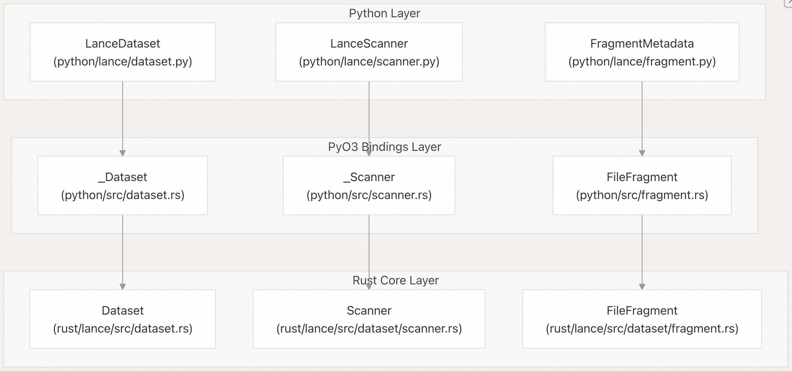
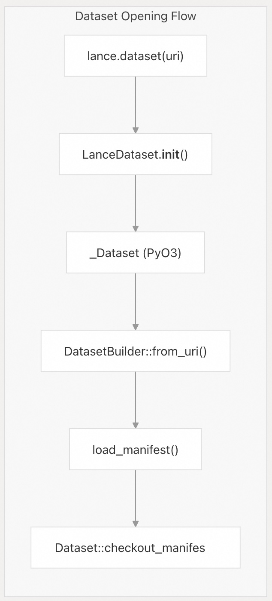
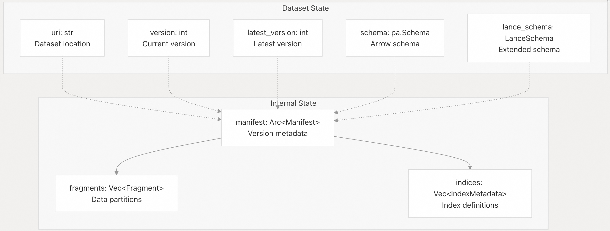
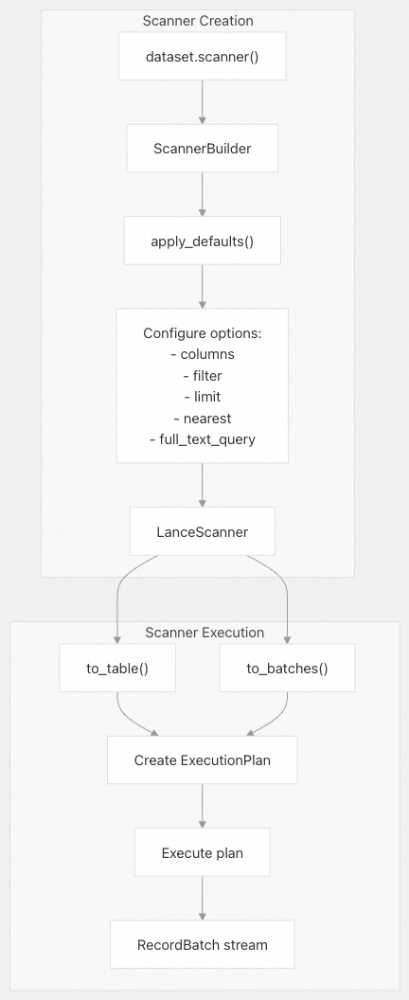
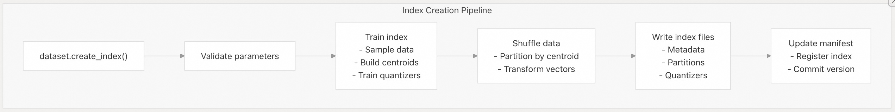

## Lance 源码学习: 3.1 数据集 API 参考 (Dataset API Reference)  
                                                      
### 作者                                                      
digoal                                                      
                                                      
### 日期                                                      
2025-12-04                                                      
                                                      
### 标签                                                      
Lance , AI 数据存储与搜索引擎 , 存储引擎 , 向量索引 , 标量索引 , 全文检索 , 多模态支持 , 零拷贝 , 版本控制 , 时间旅行 , 源码学习 , 随机访问加速 , Parquet                                     
                                                      
----                                                      
                                                      
## 背景               
本文提供了 `LanceDataset` 类及其方法、属性和配置选项的详细文档，供 Python 用户使用。`LanceDataset` 类是与 Lance Dataset (Lance 数据集) 交互的主要接口，提供数据读取、写入、Indexing (索引)、Versioning (版本控制) 和 Optimization (优化) 的方法。  
  
## Overview (概述)  
`LanceDataset` 类是底层 **Rust** 实现的 **Python Wrapper** (包装器)，为数据集操作提供高级、符合人体工程学的 **API**。其架构遵循三层设计：  
  
    
  
**Dataset API Architecture** (数据集 API 架构)  
  
来源:  
  
  * [`python/python/lance/dataset.py` 404-520](https://github.com/lance-format/lance/blob/0204e7e2/python/python/lance/dataset.py#L404-L520)  
  * [`python/src/dataset.rs` 446-582](https://github.com/lance-format/lance/blob/0204e7e2/python/src/dataset.rs#L446-L582)  
  * [`rust/lance/src/dataset.rs` 143-184](https://github.com/lance-format/lance/blob/0204e7e2/rust/lance/src/dataset.rs#L143-L184)  
  
## **Opening and Creating Datasets** (打开和创建数据集)  
  
### **Constructor Parameters** (构造函数参数)  
  
`LanceDataset` 类通过 `lance.dataset()` 或 `lance.open()` 函数实例化，这些函数接受以下参数：  
  
| 参数 (Parameter) | 类型 (Type) | 描述 (Description) |  
| :--- | :--- | :--- |  
| `uri` | `str \| Path` | 数据集的位置（本地路径或云 **URI**） |  
| `version` | `int \| str \| None` | 要打开的特定版本号或标签名称 |  
| `block_size` | `int \| None` | 对象存储的 **I/O** 块大小（以字节为单位） |  
| `index_cache_size_bytes` | `int \| None` | **Index Cache Size** (索引缓存大小)（以字节为单位，默认值：6 GiB） |  
| `metadata_cache_size_bytes` | `int \| None` | 元数据缓存大小（以字节为单位，默认值：1 GiB） |  
| `commit_lock` | `CommitLock \| None` | 用于原子操作的外部 **Commit Handler** (提交处理器) |  
| `storage_options` | `Dict[str, str] \| None` | **Storage Backend Configuration** (存储后端配置)（凭证、端点） |  
| `default_scan_options` | `Dict[str, Any] \| None` | 扫描操作的默认参数 |  
| `read_params` | `Dict[str, Any] \| None` | 低级文件读取器配置 |  
| `session` | `Session \| None` | 用于跨数据集缓存的共享会话 |  
  
    
  
**Dataset Opening Flow** (数据集打开流程)  
  
来源:  
  
  * [`python/python/lance/dataset.py` 407-459](https://github.com/lance-format/lance/blob/0204e7e2/python/python/lance/dataset.py#L407-L459)  
  * [`python/src/dataset.rs` 457-582](https://github.com/lance-format/lance/blob/0204e7e2/python/src/dataset.rs#L457-L582)  
  * [`rust/lance/src/dataset.rs` 438-445](https://github.com/lance-format/lance/blob/0204e7e2/rust/lance/src/dataset.rs#L438-L445)  
  
### **Opening Existing Datasets** (打开现有数据集)  
  
```python  
# Open latest version  
dataset = lance.dataset("s3://bucket/path/to/dataset")  
  
# Open specific version  
dataset = lance.dataset("s3://bucket/path/to/dataset", version=5)  
  
# Open by tag  
dataset = lance.dataset("s3://bucket/path/to/dataset", version="production")  
  
# Open with custom storage options  
dataset = lance.dataset(  
    "s3://bucket/path/to/dataset",  
    storage_options={  
        "aws_access_key_id": "...",  
        "aws_secret_access_key": "...",  
        "region": "us-west-2"  
    }  
)  
```  
  
来源:  
  
  * [`python/python/tests/test_dataset.py` 66-108](https://github.com/lance-format/lance/blob/0204e7e2/python/python/tests/test_dataset.py#L66-L108)  
  
### **Creating New Datasets** (创建新数据集)  
  
数据集使用 `lance.write_dataset()` 创建：  
  
```python  
# Create from PyArrow table  
table = pa.table({"a": [1, 2, 3], "b": [4, 5, 6]})  
dataset = lance.write_dataset(table, "path/to/dataset")  
  
# Create from Pandas DataFrame  
df = pd.DataFrame({"a": [1, 2, 3], "b": [4, 5, 6]})  
dataset = lance.write_dataset(df, "path/to/dataset")  
  
# Create with specific storage version  
dataset = lance.write_dataset(  
    table,   
    "path/to/dataset",  
    data_storage_version="2.1"  
)  
```  
  
来源:  
  
  * [`python/python/tests/test_dataset.py` 66-108](https://github.com/lance-format/lance/blob/0204e7e2/python/python/tests/test_dataset.py#L66-L108)  
  * [`python/python/lance/dataset.py` 789-800](https://github.com/lance-format/lance/blob/0204e7e2/python/python/lance/dataset.py#L789-L800)  
  
## **Dataset Properties** (数据集属性)  
  
### **Core Properties** (核心属性)  
  
| 属性 (Property) | 类型 (Type) | 描述 (Description) |  
| :--- | :--- | :--- |  
| `uri` | `str` | 数据集位置 |  
| `version` | `int` | 当前正在查看的 **Version Number** (版本号) |  
| `latest_version` | `int` | 数据集中最新的版本号 |  
| `schema` | `pa.Schema` | **PyArrow Schema** (PyArrow 模式) |  
| `lance_schema` | `LanceSchema` | 带有字段 **ID** 和元数据的扩展 Lance 模式 |  
| `data_storage_version` | `str` | 文件格式版本（例如，“2.1”，“legacy”） |  
| `has_index` | `bool` | 数据集上是否存在任何 **Index** (索引) |  
  
    
  
**Dataset Internal State Structure** (数据集内部状态结构)  
  
来源:  
  
  * [`python/python/lance/dataset.py` 534-680](https://github.com/lance-format/lance/blob/0204e7e2/python/python/lance/dataset.py#L534-L680)  
  * [`python/src/dataset.rs` 588-643](https://github.com/lance-format/lance/blob/0204e7e2/python/src/dataset.rs#L588-L643)  
  * [`rust/lance/src/dataset.rs` 143-184](https://github.com/lance-format/lance/blob/0204e7e2/rust/lance/src/dataset.rs#L143-L184)  
  
### **Version and Branch Management** (版本与分支管理)  
  
```python  
# Get current version  
current = dataset.version  # e.g., 5  
  
# Get latest version  
latest = dataset.latest_version  # e.g., 10  
  
# List all versions  
versions = dataset.versions()  
# Returns: [{"version": 1, "timestamp": datetime, "metadata": {}}, ...]  
  
# Access tags  
dataset.tags.create("v1.0", version=5)  
dataset.tags.list()  
dataset.tags.delete("v1.0")  
  
# Access branches  
dataset.branches.list()  
dataset.create_branch("experiment", reference=5)  
dataset.checkout_branch("experiment")  
```  
  
来源:  
  
  * [`python/python/lance/dataset.py` 541-585](https://github.com/lance-format/lance/blob/0204e7e2/python/python/lance/dataset.py#L541-L585)  
  * [`python/python/tests/test_dataset.py` 273-327](https://github.com/lance-format/lance/blob/0204e7e2/python/python/tests/test_dataset.py#L273-L327)  
  
## **Reading Data** (读取数据)  
  
### **Scanner API** (扫描器 API)  
  
`scanner()` 方法返回一个 `LanceScanner` 对象，该对象提供对数据检索的精细控制。  
  
    
  
**Scanner Creation and Execution Flow** (扫描器创建和执行流程)  
  
来源:  
  
  * [`python/python/lance/dataset.py` 687-919](https://github.com/lance-format/lance/blob/0204e7e2/python/python/lance/dataset.py#L687-L919)  
  * [`rust/lance/src/dataset/scanner.rs` 304-440](https://github.com/lance-format/lance/blob/0204e7e2/rust/lance/src/dataset/scanner.rs#L304-L440)  
  
### **Scanner Parameters** (扫描器参数)  
  
| 参数 (Parameter) | 类型 (Type) | 描述 (Description) |  
| :--- | :--- | :--- |  
| `columns` | `List[str] \| Dict[str, str]` | 要获取的列或 **SQL** 表达式 |  
| `filter` | `str \| pa.Expression` | **Row Filter Predicate** (行过滤谓词) |  
| `limit` | `int` | 返回的最大行数 |  
| `offset` | `int` | 要跳过的行数 |  
| `nearest` | `dict` | **Vector Search Configuration** (向量搜索配置) |  
| `batch_size` | `int` | 返回批次的目标大小 |  
| `batch_readahead` | `int` | 要预取的批次数量 |  
| `fragment_readahead` | `int` | 要并发读取的片段 (**Fragment**) 数量 |  
| `scan_in_order` | `bool` | 是否保持确定性顺序 |  
| `prefilter` | `bool` | 在向量搜索之前应用过滤器 |  
| `late_materialization` | `bool \| List[str]` | 控制何时获取列 |  
| `with_row_id` | `bool` | 包含 `_rowid` 系统列 |  
| `with_row_address` | `bool` | 包含 `_rowaddr` 系统列 |  
| `use_scalar_index` | `bool` | 启用 **Scalar Index** (标量索引) 的使用 |  
| `use_stats` | `bool` | 启用基于统计信息的优化 |  
| `full_text_query` | `str \| dict` | **Full-text Search Query** (全文搜索查询) |  
  
来源:  
  
  * [`python/python/lance/dataset.py` 715-893](https://github.com/lance-format/lance/blob/0204e7e2/python/python/lance/dataset.py#L715-L893)  
  
### **Basic Reading Operations** (基本读取操作)  
  
```python  
# Read entire dataset  
table = dataset.to_table()  
  
# Read with column projection  
table = dataset.to_table(columns=["col1", "col2"])  
  
# Read with filter  
table = dataset.to_table(filter="col1 > 100")  
  
# Read with limit  
table = dataset.to_table(limit=1000)  
  
# Read as batches  
for batch in dataset.to_batches(batch_size=1024):  
    process(batch)  
  
# Read specific rows by ID  
table = dataset.take([0, 5, 10])  
  
# Sample random rows  
table = dataset.sample(n=100, columns=["col1"])  
  
# Get first N rows  
table = dataset.head(10)  
  
# Count rows  
count = dataset.count_rows()  
count_filtered = dataset.count_rows(filter="col1 > 100")  
```  
  
来源:  
  
  * [`python/python/lance/dataset.py` 959-1105](https://github.com/lance-format/lance/blob/0204e7e2/python/python/lance/dataset.py#L959-L1105)  
  
### **Vector Search** (向量搜索)  
  
```python  
# Basic k-NN search  
results = dataset.to_table(  
    nearest={  
        "column": "embeddings",  
        "q": query_vector,  # np.ndarray or list  
        "k": 10  
    }  
)  
  
# Search with nprobes (for IVF indices)  
results = dataset.to_table(  
    nearest={  
        "column": "embeddings",  
        "q": query_vector,  
        "k": 10,  
        "nprobes": 20  # Number of partitions to search  
    }  
)  
  
# Search with refine factor (re-rank more candidates)  
results = dataset.to_table(  
    nearest={  
        "column": "embeddings",  
        "q": query_vector,  
        "k": 10,  
        "refine_factor": 5  # Re-rank top k * refine_factor candidates  
    }  
)  
  
# Force exact search (bypass index)  
results = dataset.to_table(  
    nearest={  
        "column": "embeddings",  
        "q": query_vector,  
        "k": 10,  
        "use_index": False  
    }  
)  
  
# Combine with filter  
results = dataset.to_table(  
    nearest={  
        "column": "embeddings",  
        "q": query_vector,  
        "k": 10  
    },  
    filter="category = 'books'",  
    prefilter=True  # Apply filter before search  
)  
```  
  
来源:  
  
  * [`python/python/lance/dataset.py` 731-856](https://github.com/lance-format/lance/blob/0204e7e2/python/python/lance/dataset.py#L731-L856)  
  * [`python/python/tests/test_vector_index.py` 125-170](https://github.com/lance-format/lance/blob/0204e7e2/python/python/tests/test_vector_index.py#L125-L170)  
  
### **Full-Text Search** (全文搜索)  
  
```python  
# Basic full-text search  
results = dataset.to_table(  
    full_text_query="machine learning"  
)  
  
# Search with column specification  
results = dataset.to_table(  
    full_text_query={  
        "columns": ["title", "description"],  
        "query": "machine learning"  
    }  
)  
  
# Combine with filters  
results = dataset.to_table(  
    full_text_query="machine learning",  
    filter="published_year > 2020"  
)  
```  
  
来源:  
  
  * [`python/python/lance/dataset.py` 794-816](https://github.com/lance-format/lance/blob/0204e7e2/python/python/lance/dataset.py#L794-L816)  
  
## **Writing Data** (写入数据)  
  
### **Write Modes** (写入模式)  
  
Lance 支持三种写入模式：  
  
| 模式 (Mode) | 描述 (Description) | 用例 (Use Case) |  
| :--- | :--- | :--- |  
| `create` | 创建新数据集，如果已存在则失败 | 初始数据集创建 |  
| `append` | 将新数据添加到现有数据集 | **Incremental Data Ingestion** (增量数据摄取) |  
| `overwrite` | 用新版本替换数据集 | 完整数据刷新 |  
  
    
  
**Write Mode Flow** (写入模式流程)  
  
来源:  
  
  * [`rust/lance/src/dataset/write.rs` 113-138](https://github.com/lance-format/lance/blob/0204e7e2/rust/lance/src/dataset/write.rs#L113-L138)  
  * [`rust/lance/src/dataset/write/insert.rs` 35-89](https://github.com/lance-format/lance/blob/0204e7e2/rust/lance/src/dataset/write/insert.rs#L35-L89)  
  
### **Insert Operations** (插入操作)  
  
```python  
# Insert new data (create mode)  
new_table = pa.table({"a": [1, 2], "b": [3, 4]})  
dataset = lance.write_dataset(new_table, "path/to/dataset")  
  
# Append to existing dataset  
dataset.insert(new_table)  # mode="append" is default  
  
# Append with custom write params  
dataset.insert(  
    new_table,  
    mode="append",  
    max_rows_per_file=100000,  
    max_rows_per_group=1024  
)  
  
# Overwrite dataset  
dataset.insert(new_table, mode="overwrite")  
  
# Use InsertBuilder for more control  
from lance.dataset import InsertBuilder  
transaction = InsertBuilder(dataset) \
    .with_params(write_params) \
    .execute_uncommitted(batches)  
```  
  
来源:  
  
  * [`python/python/lance/dataset.py` 1146-1299](https://github.com/lance-format/lance/blob/0204e7e2/python/python/lance/dataset.py#L1146-L1299)  
  * [`rust/lance/src/dataset/write/insert.rs` 35-89](https://github.com/lance-format/lance/blob/0204e7e2/rust/lance/src/dataset/write/insert.rs#L35-L89)  
  
### **Update Operations** (更新操作)  
  
```python  
# Update with SQL expressions  
dataset.update(  
    updates={"price": "price * 1.1"},  
    where="category = 'electronics'"  
)  
  
# Update with constant values  
dataset.update(  
    updates={"status": "'active'"},  
    where="last_activity > date('2024-01-01')"  
)  
  
# Update using UpdateBuilder  
from lance.dataset import UpdateBuilder  
UpdateBuilder(dataset) \
    .update({"price": "price * 1.1"}) \
    .where("category = 'electronics'") \
    .execute()  
```  
  
来源:  
  
  * [`python/python/lance/dataset.py` 1301-1369](https://github.com/lance-format/lance/blob/0204e7e2/python/python/lance/dataset.py#L1301-L1369)  
  
### **Delete Operations** (删除操作)  
  
```python  
# Delete rows matching predicate  
dataset.delete("age < 18")  
  
# Delete with complex filter  
dataset.delete("category = 'spam' OR (score < 0.5 AND verified = false)")  
  
# Count deleted rows  
num_deleted = dataset.delete("status = 'inactive'")  
```  
  
来源:  
  
  * [`python/python/lance/dataset.py` 1371-1443](https://github.com/lance-format/lance/blob/0204e7e2/python/python/lance/dataset.py#L1371-L1443)  
  
### **Merge Insert Operations** (合并插入操作)  
  
合并插入根据键匹配执行 **Upsert** (插入或更新) 操作。  
  
```python  
# Find-or-create (insert only)  
builder = dataset.merge_insert("id")  
stats = builder.execute(new_data)  
  
# Upsert (insert or update)  
builder = dataset.merge_insert("id") \
    .when_matched_update_all() \
    .when_not_matched_insert_all()  
stats = builder.execute(new_data)  
  
# Conditional update  
builder = dataset.merge_insert("id") \
    .when_matched_update_all("source.timestamp > target.timestamp") \
    .when_not_matched_insert_all()  
stats = builder.execute(new_data)  
  
# Replace data for a partition  
builder = dataset.merge_insert("id") \
    .when_matched_update_all() \
    .when_not_matched_insert_all() \
    .when_not_matched_by_source_delete("target.month = 'january'")  
stats = builder.execute(new_data)  
```  
  
来源:  
  
  * [`python/python/lance/dataset.py` 92-401](https://github.com/lance-format/lance/blob/0204e7e2/python/python/lance/dataset.py#L92-L401)  
  * [`rust/lance/src/dataset/write/merge_insert.rs` 1-450](https://github.com/lance-format/lance/blob/0204e7e2/rust/lance/src/dataset/write/merge_insert.rs#L1-L450)  
  
## **Indexing Operations** (索引操作)  
  
### **Creating Indices** (创建索引)  
  
```python  
# Create IVF-PQ vector index  
dataset.create_index(  
    column="embeddings",  
    index_type="IVF_PQ",  
    num_partitions=256,  
    num_sub_vectors=16,  
    metric="L2"  # or "cosine", "dot"  
)  
  
# Create with custom parameters  
dataset.create_index(  
    column="embeddings",  
    index_type="IVF_PQ",  
    num_partitions=256,  
    num_sub_vectors=16,  
    num_bits=8,  
    metric="L2",  
    accelerator="cuda"  # Use GPU acceleration  
)  
  
# Create scalar index  
dataset.create_index(  
    column="category",  
    index_type="BTREE"  
)  
  
# Create full-text search index  
dataset.create_index(  
    column="text",  
    index_type="INVERTED"  
)  
```  
  
来源:  
  
  * [`python/python/lance/dataset.py` 1445-1739](https://github.com/lance-format/lance/blob/0204e7e2/python/python/lance/dataset.py#L1445-L1739)  
  * [`python/python/tests/test_vector_index.py` 100-240](https://github.com/lance-format/lance/blob/0204e7e2/python/python/tests/test_vector_index.py#L100-L240)  
  
### **Managing Indices** (管理索引)  
  
```python  
# List indices  
indices = dataset.list_indices()  
# Returns: [{"uuid": "...", "name": "...", "type": "IVF_PQ", ...}]  
  
# Describe indices (lightweight)  
descriptions = dataset.describe_indices()  
  
# Get index statistics  
stats = dataset.stats.index_stats("vector_idx")  
  
# Optimize index  
dataset.optimize.optimize_indices()  
```  
  
来源:  
  
  * [`python/python/lance/dataset.py` 648-680](https://github.com/lance-format/lance/blob/0204e7e2/python/python/lance/dataset.py#L648-L680)  
  * [`rust/lance/src/dataset/index.rs`](https://github.com/lance-format/lance/blob/0204e7e2/rust/lance/src/dataset/index.rs)  
  
### **Index Types and Parameters** (索引类型和参数)  
  
| 索引类型 (Index Type) | 列类型 (Column Type) | 参数 (Parameters) |  
| :--- | :--- | :--- |  
| `IVF_PQ` | **Vector** (向量) | `num_partitions` (分区数), `num_sub_vectors` (子向量数), `metric` (指标) |  
| `IVF_HNSW_PQ` | Vector | `num_partitions`, `num_sub_vectors`, `max_level` (最大级别) |  
| `IVF_HNSW_SQ` | Vector | `num_partitions`, `max_level` |  
| `BTREE` | **Scalar** (标量) | None (无) |  
| `BITMAP` | Scalar | None |  
| `LABEL_LIST` | **List** (列表) | None |  
| `INVERTED` | **String** (字符串) | `tokenizer` (分词器), `with_position` (带位置信息) |  
  
  
  
**Index Creation Pipeline** (索引创建管道)  
  
来源:  
  
  * [`python/python/lance/dataset.py` 1445-1550](https://github.com/lance-format/lance/blob/0204e7e2/python/python/lance/dataset.py#L1445-L1550)  
  * [`rust/lance/src/dataset/index.rs`](https://github.com/lance-format/lance/blob/0204e7e2/rust/lance/src/dataset/index.rs)  
  
## **Versioning and Branching** (版本控制和分支)  
  
### **Version Operations** (版本操作)  
  
```python  
# Get all versions  
versions = dataset.versions()  
for v in versions:  
    print(f"Version {v['version']} at {v['timestamp']}")  
  
# Checkout specific version  
old_dataset = dataset.checkout_version(5)  
  
# Checkout latest  
dataset.checkout_latest()  
  
# Time-travel query  
import datetime  
ts = datetime.datetime(2024, 1, 1)  
dataset_at_time = lance.dataset(uri, asof=ts)  
```  
  
来源:  
  
  * [`python/python/lance/dataset.py` 942-957](https://github.com/lance-format/lance/blob/0204e7e2/python/python/lance/dataset.py#L942-L957)  
  * [`python/python/tests/test_dataset.py` 315-369](https://github.com/lance-format/lance/blob/0204e7e2/python/python/tests/test_dataset.py#L315-L369)  
  
### **Branch and Tag Operations** (分支和标签操作)  
  
```python  
# Create tag  
dataset.tags.create("production", version=10)  
  
# List tags  
tags = dataset.tags.list()  
  
# Get tag version  
version = dataset.tags.get_version("production")  
  
# Delete tag  
dataset.tags.delete("production")  
  
# Create branch  
experiment_ds = dataset.create_branch("experiment", reference=5)  
  
# List branches  
branches = dataset.branches.list()  
  
# Checkout branch  
experiment_ds = dataset.checkout_branch("experiment")  
  
# Delete branch  
dataset.delete_branch("experiment")  
```  
  
来源:  
  
  * [`python/python/lance/dataset.py` 541-648](https://github.com/lance-format/lance/blob/0204e7e2/python/python/lance/dataset.py#L541-L648)  
  * [`python/python/tests/test_dataset.py` 428-520](https://github.com/lance-format/lance/blob/0204e7e2/python/python/tests/test_dataset.py#L428-L520)  
  
## **Optimization and Maintenance** (优化与维护)  
  
### **Data Compaction** (数据紧凑化)  
  
```python  
# Compact small files  
metrics = dataset.optimize.compact_files(  
    target_rows_per_fragment=1000000,  
    max_rows_per_group=1024  
)  
  
# Compact with filters  
metrics = dataset.optimize.compact_files(  
    target_rows_per_fragment=1000000,  
    filters="category = 'active'"  
)  
```  
  
来源:  
  
  * [`python/python/lance/dataset.py` 1741-1888](https://github.com/lance-format/lance/blob/0204e7e2/python/python/lance/dataset.py#L1741-L1888)  
  
### **Cleanup Operations** (清理操作)  
  
```python  
# Cleanup old versions  
stats = dataset.cleanup_old_versions(  
    older_than=datetime.timedelta(days=7),  
    delete_unverified=False  
)  
  
# Get cleanup recommendations  
recommendations = dataset.stats.dataset_stats()  
  
# Configure auto-cleanup  
dataset.update_config({  
    "lance.auto_cleanup.interval": "20",  
    "lance.auto_cleanup.older_than": "14d"  
})  
```  
  
来源:  
  
  * [`python/python/lance/dataset.py` 1890-1999](https://github.com/lance-format/lance/blob/0204e7e2/python/python/lance/dataset.py#L1890-L1999)  
  
## **Configuration Options** (配置选项)  
  
### **Read Parameters** (读取参数)  
  
`ReadParams` 类控制数据集读取行为：  
  
| 参数 (Parameter) | 类型 (Type) | 默认值 (Default) | 描述 (Description) |  
| :--- | :--- | :--- | :--- |  
| `index_cache_size_bytes` | `int` | 6 GiB | 索引缓存大小 |  
| `metadata_cache_size_bytes` | `int` | 1 GiB | 元数据缓存大小 |  
| `session` | `Session` | `None` (无) | 用于缓存的共享会话 |  
| `store_options` | `ObjectStoreParams` | `None` | **Storage Backend Configuration** (存储后端配置) |  
| `commit_handler` | `CommitHandler` | `None` | 自定义 **Commit Handler** (提交处理器) |  
| `file_reader_options` | `FileReaderOptions` | `None` | 低级读取器选项 |  
  
来源:  
  
  * [`rust/lance/src/dataset.rs` 210-315](https://github.com/lance-format/lance/blob/0204e7e2/rust/lance/src/dataset.rs#L210-L315)  
  
### **Write Parameters** (写入参数)  
  
`WriteParams` 类控制数据集写入行为：  
  
| 参数 (Parameter) | 类型 (Type) | 默认值 (Default) | 描述 (Description) |  
| :--- | :--- | :--- | :--- |  
| `max_rows_per_file` | `int` | 1,048,576 | 每个文件的最大行数 |  
| `max_rows_per_group` | `int` | 1,024 | 每个组的最大行数 |  
| `max_bytes_per_file` | `int` | 90 GiB | 最大文件大小（软限制） |  
| `mode` | `WriteMode` | `Create` | 写入模式（create/append/overwrite） |  
| `data_storage_version` | `str` | latest (最新) | 文件格式版本 |  
| `enable_stable_row_ids` | `bool` | `False` (否) | 使用 **Stable Row IDs** (稳定行 ID) |  
| `enable_v2_manifest_paths` | `bool` | `False` | 使用 **v2** 清单命名路径 |  
  
来源:  
  
  * [`rust/lance/src/dataset/write.rs` 141-280](https://github.com/lance-format/lance/blob/0204e7e2/rust/lance/src/dataset/write.rs#L141-L280)  
  
### **Scanner Configuration** (扫描器配置)  
  
```python  
# Set default scan options  
dataset = lance.dataset(  
    uri,  
    default_scan_options={  
        "batch_size": 10240,  
        "batch_readahead": 16,  
        "fragment_readahead": 4,  
        "use_stats": True  
    }  
)  
  
# Override on specific scan  
table = dataset.to_table(  
    batch_size=1024,  # Override default  
    use_stats=False  
)  
```  
  
来源:  
  
  * [`python/python/lance/dataset.py` 417-457](https://github.com/lance-format/lance/blob/0204e7e2/python/python/lance/dataset.py#L417-L457)  
  * [`python/python/lance/dataset.py` 682-686](https://github.com/lance-format/lance/blob/0204e7e2/python/python/lance/dataset.py#L682-L686)  
  
## **Advanced Features** (高级功能)  
  
### **Blob Handling** (Blob 处理)  
  
```python  
# Take blobs by addresses  
blobs = dataset.take_blobs(  
    row_addresses=[...],  
    column="large_binary_field"  
)  
  
# Configure blob handling for scans  
scanner = dataset.scanner(  
    columns=["id", "blob_field"],  
    blob_handling="file"  # Write blobs to files  
)  
```  
  
来源:  
  
  * [`python/python/lance/dataset.py` 1083-1145](https://github.com/lance-format/lance/blob/0204e7e2/python/python/lance/dataset.py#L1083-L1145)  
  
### **Schema Evolution** (模式演进)  
  
```python  
# Add new columns with SQL expressions  
dataset.add_columns({  
    "full_name": "concat(first_name, ' ', last_name)",  
    "discounted_price": "price * 0.9"  
})  
  
# Add columns with UDF  
from lance import BatchUDF  
def compute_feature(batch):  
    # Process batch and return new columns  
    return result_batch  
  
dataset.add_columns(compute_feature)  
  
# Alter column names  
dataset.alter_columns({"old_name": "new_name"})  
  
# Drop columns  
dataset.drop_columns(["unused_column"])  
```  
  
来源:  
  
  * [`python/python/lance/dataset.py` 2001-2242](https://github.com/lance-format/lance/blob/0204e7e2/python/python/lance/dataset.py#L2001-L2242)  
  
### **Parallel Operations** (并行操作)  
  
```python  
# Use sharded batch iterator for parallel processing  
from lance.dataset import ShardedBatchIterator  
  
iterator = ShardedBatchIterator(  
    dataset,  
    columns=["id", "features"],  
    batch_size=1024,  
    num_shards=4,  # Split into 4 shards  
    shard_index=0  # Process shard 0  
)  
  
for batch in iterator:  
    process(batch)  
```  
  
来源:  
  
  * [`python/python/lance/_dataset/sharded_batch_iterator.py`](https://github.com/lance-format/lance/blob/0204e7e2/python/python/lance/_dataset/sharded_batch_iterator.py)  
  
### **Statistics and Metrics** (统计信息和指标)  
  
```python  
# Get dataset statistics  
stats = dataset.stats.dataset_stats()  
  
# Get index statistics  
index_stats = dataset.stats.index_stats("vector_idx")  
  
# Get scan statistics with callback  
def log_stats(stats):  
    print(f"Rows scanned: {stats.rows_scanned}")  
    print(f"Bytes read: {stats.bytes_read}")  
  
table = dataset.to_table(  
    scan_stats_callback=log_stats  
)  
```  
  
来源:  
  
  * [`python/python/lance/dataset.py` 2244-2312](https://github.com/lance-format/lance/blob/0204e7e2/python/python/lance/dataset.py#L2244-L2312)  
  
## **Error Handling** (错误处理)  
  
常见的异常及其含义：  
  
| 异常 (Exception) | 原因 (Cause) | 解决方案 (Solution) |  
| :--- | :--- | :--- |  
| `DatasetNotFound` | **URI** 指向不存在的数据集 | 检查 **URI** 或创建数据集 |  
| `DatasetAlreadyExists` | 尝试创建已存在的数据集 | 使用 **append/overwrite** 模式 |  
| `SchemaEvolutionError` | **Schema** (模式) 更改不兼容 | 调整模式或使用 **overwrite** |  
| `CommitConflictError` | **Concurrent Modification** (并发修改) | 重试并解决冲突 |  
| `IndexNotFound` | 引用不存在的索引 | 检查索引名称或创建索引 |  
  
来源:  
  
  * [`rust/lance/src/dataset.rs`](https://github.com/lance-format/lance/blob/0204e7e2/rust/lance/src/dataset.rs)  
  * [`python/python/tests/test_dataset.py`](https://github.com/lance-format/lance/blob/0204e7e2/python/python/tests/test_dataset.py)  
  
-----  
  
# 附录1: 架构师/用户角度：并发与事务一致性保证  
  
Lance 旨在作为高性能的数据湖格式，通常部署在云对象存储（如 S3/GCS）上。文档中提到了用于原子操作的 **`CommitLock`** 和可能出现的 **`CommitConflictError`**。  
  
**关键问题：**  
  
> 结合云对象存储的背景，Lance 如何通过 **`CommitLock`** 机制来**保证并发写入的事务原子性**，并确保数据一致性？尤其在发生 `CommitConflictError`（提交冲突）时，Lance 的**冲突解决策略**是基于简单的乐观并发控制（即通知用户失败并重试），还是提供了更智能、更高级的协调或合并机制来处理多个并发写入流？  
  
* **痛点背景：** 在多任务同时向数据集写入（`append` 或 `insert`）的场景中，事务的原子性和隔离性至关重要，直接关系到数据可靠性。  
  
## 回答  
  
Lance 通过 **CommitLock** 机制和 **TransactionRebase** 实现了智能的乐观并发控制，而非简单的失败重试。当发生 `CommitConflictError` 时，Lance 会自动尝试重新基于最新版本构建事务（rebase），并支持可配置的重试策略。    
  
  
## 详细机制  
  
### 1. CommitLock 架构  
  
Lance 定义了 `CommitLock` trait 作为并发控制的基础接口：    
  
```rust  
pub trait CommitLock: Debug {  
    type Lease: CommitLease;  
      
    async fn lock(&self, version: u64) -> std::result::Result<Self::Lease, CommitError>;  
}  
```  
  
该接口要求实现：  
- 获取指定版本的锁  
- 如果版本已存在，返回 `CommitConflict`  
- 支持超时机制防止锁中毒  
  
### 2. 默认提交策略  
  
不同对象存储使用不同的提交处理器：    
  
- **RenameCommitHandler**：大多数对象存储的默认选择，使用临时文件+原子重命名  
- **UnsafeCommitHandler**：AWS S3 的默认选择，直接写入（因为 S3 不支持原子重命名）  
  
### 3. 智能冲突解决机制  
  
当检测到冲突时，Lance 不是简单失败，而是执行 `TransactionRebase`：    
  
```rust  
let mut rebase = TransactionRebase::try_new(&original_dataset, transaction, affected_rows).await?;  
  
for (other_version, other_transaction) in other_transactions.iter() {  
    rebase.check_txn(other_transaction, *other_version)?;  
}  
  
transaction = rebase.finish(&dataset).await?;  
```  
  
这个过程：  
1. 加载自读取版本以来的所有新事务  
2. 检查当前事务与新事务的兼容性  
3. 如果兼容，重新构建事务以包含新变更  
  
### 4. 重试策略  
  
Lance 实现了带退避的重试机制：     
  
- 默认最大重试次数为 20 次（可在 Python API 中配置）  
- 使用 `SlotBackoff` 策略，根据首次提交时间动态调整退避间隔  
- 对于严格覆盖模式（`strict_overwrite`），禁用重试机制  
  
### 5. 冲突类型处理  
  
Lance 区分不同类型的冲突：    
  
- **CommitConflict**：普通冲突，可重试  
- **RetryableCommitConflict**：明确可重试的冲突  
- **TooMuchWriteContention**：写入竞争过于激烈，建议稍后重试  
  
### 6. Python API 集成  
  
在 Python 层，用户可以通过 `max_retries` 参数控制重试行为：    
  
```python  
dataset = lance.LanceDataset.commit(  
    base_uri, operation, read_version=1, max_retries=10  
)  
```  
  
## Notes  
  
- Lance 的冲突解决机制比简单的乐观并发控制更智能，通过 TransactionRebase 实现了自动的事务合并  
- 对于不支持原子操作的对象存储（如 S3），建议使用外部锁服务（如 DynamoDB）  
- 测试用例显示并发写入场景下，Lance 能够正确处理冲突并保证数据一致性    
  
  
  
-----  
  
# 附录2: 开发者/用户角度：复杂查询的性能调优与取舍  
  
`Scanner API` 提供了精细的控制参数，特别是针对向量搜索。其中，**`prefilter`**（在向量搜索前应用标量过滤器）和 **`late_materialization`**（延迟物化，控制何时获取非索引/非过滤列）是影响查询性能的关键。  
  
**关键问题：**  
  
> 在进行复杂的**向量搜索**时，`Scanner Parameters` 中的 **`prefilter`** 和 **`late_materialization`** 这两个优化手段应如何协同或取舍？开发者在日常使用中，如何针对不同场景（例如：标量过滤高度选择性 vs. 向量召回精度优先）进行配置，以确定何时**延迟物化**能带来最大的 **I/O** 收益，以及何时 **`prefilter`** 会导致更高的计算开销，从而实现最佳的端到端查询延迟？  
  
* **痛点背景：** 错误的 `Scanner` 配置可能导致数倍的查询延迟和不必要的存储 **I/O** 成本。  
  
## 回答  
  
`prefilter` 和 `late_materialization` 在向量搜索中是**互补的优化策略**，而非相互排斥。`prefilter` 控制过滤器的执行时机，`late_materialization` 控制列数据的获取时机。正确的配置取决于过滤器的选择性和查询模式。  
  
  
## 参数机制详解  
  
### `prefilter` 的工作原理  
  
`prefilter` 决定标量过滤器是在向量搜索**之前**还是**之后**执行  ：  
  
- **prefilter=True**: 先应用过滤器，再在过滤结果上进行向量搜索  
- **prefilter=False**: 先进行向量搜索，再对结果应用过滤器  
  
```python  
# 高选择性过滤器的推荐配置  
dataset.scanner(  
    nearest={"column": "vector", "q": query_vec, "k": 100},  
    filter="category = 'electronics' AND price > 1000",  
    prefilter=True  # 当过滤器高度选择性时  
)  
```  
  
### `late_materialization` 的控制策略  
  
`late_materialization` 控制非索引列的获取时机  ：  
  
- **True**: 所有列延迟物化（仅获取需要的行）  
- **False**: 所有列早期物化（获取整个列再过滤）  
- **List[str]**: 指定列延迟物化  
  
默认启发式策略假设过滤器选择约 0.1% 的行  。  
  
  
## 场景化配置指南  
  
### 场景1: 标量过滤高度选择性  
  
当过滤器能大幅减少数据集时（如 ID 查找、精确匹配）：  
  
```python  
# 推荐配置  
dataset.scanner(  
    filter="user_id = 12345",  # 高选择性  
    nearest={"column": "embedding", "q": query, "k": 10},  
    prefilter=True,           # 先过滤减少搜索空间  
    late_materialization=True # 延迟物化减少 I/O  
)  
```  
  
**原理**: `prefilter=True` 利用标量索引快速定位候选行，`late_materialization=True` 避免读取大量无关数据  。  
  
### 场景2: 向量召回精度优先  
  
当需要最大化召回率且过滤器选择性不高时：  
  
```python  
# 推荐配置  
dataset.scanner(  
    filter="price > 100",  # 低选择性  
    nearest={"column": "embedding", "q": query, "k": 100},  
    prefilter=False,       # 保证向量搜索完整性  
    late_materialization=False  # 早期物化可能更高效  
)  
```  
  
**原理**: `prefilter=False` 确保向量搜索在完整空间进行，避免因预过滤丢失相似向量  。  
  
### 场景3: 混合策略  
  
对于中等选择性的过滤器：  
  
```python  
# 精细化控制  
dataset.scanner(  
    filter="category IN ('electronics', 'books')",  
    nearest={"column": "embedding", "q": query, "k": 50},  
    prefilter=True,  
    late_materialization=["large_text_column", "metadata"]  # 仅大列延迟物化  
)  
```  
  
  
## 性能权衡分析  
  
### I/O 优化收益  
  
`late_materialization` 的 I/O 收益取决于：  
1. **列大小**: 大列（>1000 字节）延迟物化收益更明显    
2. **过滤选择性**: 选择性越高，延迟物化节省的 I/O 越多  
3. **存储类型**: 云存储比本地存储的延迟物化阈值更高  
  
### 计算开销考量  
  
`prefilter` 的计算开销包括：  
1. **标量索引查找**: 当有合适索引时开销很低  
2. **全表扫描**: 无索引时可能比向量搜索更昂贵  
3. **结果集大小**: 预过滤后仍需进行向量搜索  
  
测试显示，对于高度选择性查询，`prefilter=True` 能显著提升性能  。  
  
  
## 最佳实践建议  
  
1. **评估过滤器选择性**: 使用统计信息或 `EXPLAIN` 分析过滤效果  
2. **监控 I/O 指标**: 通过 `scan_stats_callback` 跟踪实际 I/O 使用    
3. **基准测试**: 针对特定工作负载测试不同配置组合  
4. **渐进优化**: 从默认设置开始，根据性能指标调整  
  
```python  
# 性能监控示例  
def scan_callback(stats):  
    print(f"I/O bytes read: {stats.io_bytes_read}")  
    print(f"Rows scanned: {stats.rows_scanned}")  
  
dataset.scanner(  
    # ... 其他参数  
    scan_stats_callback=scan_callback  
)  
```  
  
  
## Notes  
  
- 向量搜索和全文搜索**始终使用延迟物化**，`late_materialization` 参数主要影响普通扫描    
- 标量索引仅在 `prefilter=True` 或无非向量搜索时使用    
- 实际性能取决于数据分布、索引质量和存储特性，建议在生产环境中进行针对性测试  
  
  
  
  
-----  
  
# 附录3: 运维/用户角度：数据紧凑化和清理的策略制定  
  
文档提到了 **`Data Compaction`**（数据紧凑化）和 **`Cleanup Operations`**（清理操作）作为优化和维护措施。对于采用 `append` 模式进行增量数据摄取的大型数据集，文件碎片化和过期版本积累是必然的运维挑战。  
  
**关键问题：**  
  
> 对于一个频繁使用 `append` 模式的增量数据集，我们应如何**评估何时需要执行 `Data Compaction`**？是否存在量化指标（如：平均文件大小、存储碎片率、查询延迟增加百分比）来指导运维人员制定最佳的**紧凑化维护周期**？同时，**`Cleanup Operations`** 移除旧版本数据的默认保留策略是什么，是否能根据分支或标签进行细粒度配置以平衡查询回溯需求和存储成本？  
  
* **痛点背景：** 缺乏量化指标的维护会导致查询性能缓慢下降，或存储成本不必要的增加。  
  
  
## 回答  
  
## 评估数据紧凑化（Data Compaction）需求  
  
### 量化指标  
  
Lance 提供了两个核心量化指标来评估是否需要执行数据紧凑化：  
  
1. **片段行数指标**：当片段的行数少于 `target_rows_per_fragment`（默认 1,048,576 行）时，会成为紧凑化候选    
  
2. **删除行比例指标**：当片段中被软删除的行数比例超过 `materialize_deletions_threshold`（默认 0.1，即 10%）时，会触发紧凑化    
  
### 紧凑化决策逻辑  
  
紧凑化算法会评估每个片段的 `FragmentMetrics`，包括物理行数和删除行数  。只有相邻的片段都会被选中进行合并，以保持数据的插入顺序  。  
  
### 维护周期建议  
  
对于频繁 append 的数据集，建议：  
- 监控片段数量和平均大小  
- 当片段数量显著增长或平均片段大小远小于目标大小时触发紧凑化  
- 定期检查删除行比例，特别是在频繁执行删除操作的场景  
  
## 清理操作（Cleanup Operations）配置  
  
### 默认保留策略  
  
清理操作的默认策略是保留最近 14 天的版本  。`CleanupPolicy` 结构体提供了更细粒度的控制  ：  
  
- `before_timestamp`: 清理指定时间戳之前的版本  
- `before_version`: 清理指定版本号之前的版本    
- `delete_unverified`: 是否删除未验证的文件（默认 false）  
- `error_if_tagged_old_versions`: 遇到标记版本时报错（默认 true）  
  
### 标签和分支保护  
  
**标签保护**：被标记的版本默认不会被清理操作删除  。要清理标记版本，必须先删除标签  。  
  
**分支隔离**：每个分支有独立的版本历史，主数据集的清理操作不会影响分支  。但分支通过 `base_paths` 引用主数据集的数据文件，删除主数据集中的引用文件会破坏分支。  
  
### 实际配置示例  
  
```python  
# 保留最近 7 天的版本  
ds.cleanup_old_versions(older_than=timedelta(days=7))  
  
# 使用 CleanupPolicy 构建器进行更精细控制  
policy = CleanupPolicyBuilder().retain_n_versions(dataset, 10).build()  
ds.cleanup_with_policy(policy)  
```  
  
## 运维建议  
  
1. **监控指标**：定期检查片段数量、平均片段大小和删除行比例  
2. **紧凑化策略**：根据查询模式调整 `target_rows_per_fragment`，对于频繁查询的场景可适当增大目标片段大小  
3. **清理策略**：结合业务需求设置保留期限，重要版本使用标签保护  
4. **分支管理**：谨慎清理主数据集，确保分支的数据引用完整性  
  
---  
  
## Notes  
  
- Lance 的紧凑化主要基于结构化指标（片段大小、删除比例），而非查询性能指标  
- 清理操作无法直接基于分支名称进行配置，但可以通过分支隔离实现不同策略  
- 标签是保护重要版本免于清理的主要机制，需要在清理前主动管理  
    
#### [PolarDB 学习图谱](https://www.aliyun.com/database/openpolardb/activity "8642f60e04ed0c814bf9cb9677976bd4")
  
  
#### [PostgreSQL 解决方案集合](../201706/20170601_02.md "40cff096e9ed7122c512b35d8561d9c8")
  
  
#### [德哥 / digoal's Github - 公益是一辈子的事.](https://github.com/digoal/blog/blob/master/README.md "22709685feb7cab07d30f30387f0a9ae")
  
  
#### [About 德哥](https://github.com/digoal/blog/blob/master/me/readme.md "a37735981e7704886ffd590565582dd0")
  
  

  
