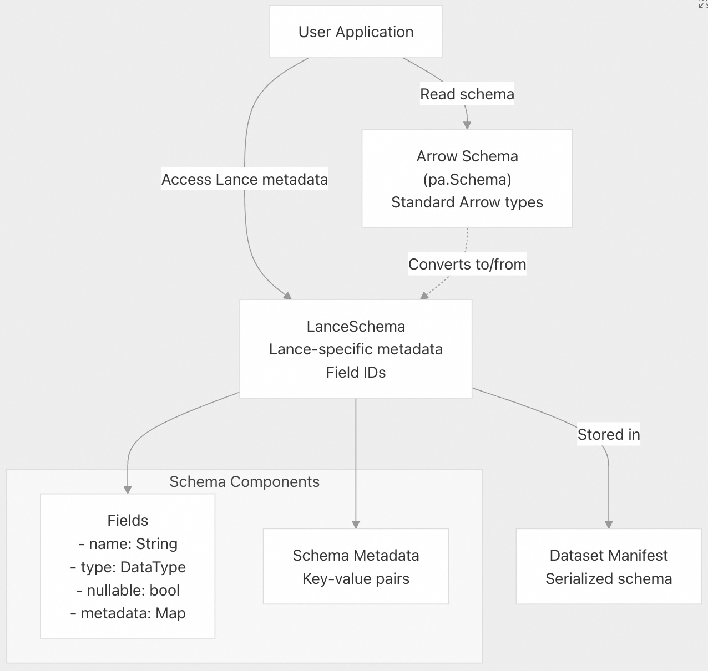
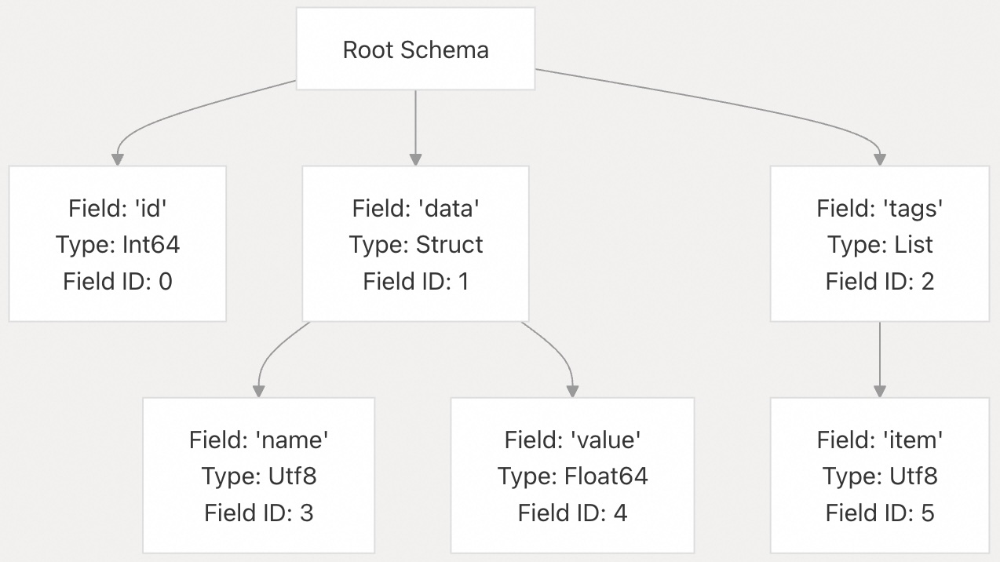
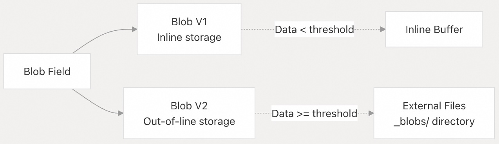
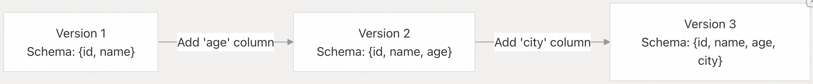
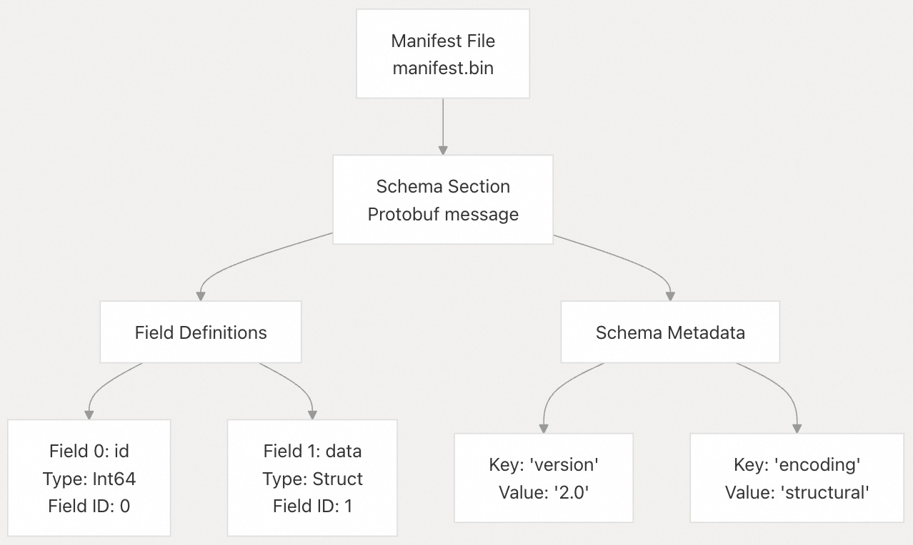

## Lance 源码学习: 3.2 模式与数据类型 (Schema and Data Types)  
                                                        
### 作者                                                        
digoal                                                        
                                                        
### 日期                                                        
2025-12-04                                                        
                                                        
### 标签                                                        
Lance , AI 数据存储与搜索引擎 , 存储引擎 , 向量索引 , 标量索引 , 全文检索 , 多模态支持 , 零拷贝 , 版本控制 , 时间旅行 , 源码学习 , 随机访问加速 , Parquet                                       
                                                        
----                                                        
                                                        
## 背景                 
本页描述了 Lance 的**类型系统**（type system）和**模式表示**（schema representation）。内容涵盖了 Lance 如何定义和管理模式、支持哪些数据类型，以及模式如何映射到 Arrow 的类型系统。  
  
-----  
  
## 概述  
  
Lance 使用建立在 Apache Arrow **类型系统**（type system）之上的模式系统。一个 Lance 模式包含：  
  
  * **字段 (Fields)** ：带名称、带类型的列，可包含可选的元数据  
  * **数据类型 (Data Types)** ：与 Arrow 兼容的类型，并带有 Lance 特定的扩展  
  * **元数据 (Metadata)** ：模式级别和字段级别的键值对  
  * **字段 ID (Field IDs)** ：用于内部列跟踪的每个字段的唯一标识符  
  
Lance 模式存储在数据集**清单文件**（manifest）中，并定义了所有**片段**（fragments）中的数据结构。模式可以通过添加列或更新元数据等操作，在数据集版本之间演进（evolve）。  
  
**关键设计点：**  
  
  * Lance 模式在一个版本内是**不可变**（immutable）的，但可以在不同版本之间更改  
  * 所有数据类型都基于 Arrow 的类型系统，以实现**互操作性**（interoperability）  
  * 模式支持**嵌套结构**（nested structures）（结构体 `structs`、列表 `lists`）和复杂类型  
  * 字段元数据（Field metadata）可用于存储额外信息，例如编码提示或统计信息  
  
来源:  
[`rust/lance/src/dataset.rs` 924-938](https://github.com/lance-format/lance/blob/0204e7e2/rust/lance/src/dataset.rs#L924-L938)  
[`python/python/lance/dataset.py` 596-604](https://github.com/lance-format/lance/blob/0204e7e2/python/python/lance/dataset.py#L596-L604)  
  
-----  
  
## 模式表示 (Schema Representation)  
  
### LanceSchema 与 Arrow Schema  
  
Lance 维护着两种模式表示：  
  
    
  
**Arrow 模式 (Arrow Schema)** （Python 中为 `pa.Schema`，Rust 中为 `ArrowSchema`）：  
  
  * 标准的 Apache Arrow 模式表示  
  * 用于**数据交换**（data interchange）和与 Arrow 生态系统的兼容性  
  * 通过 `dataset.schema` 属性返回  
  
**Lance 模式 (Lance Schema)** （`LanceSchema`）：  
  
  * 带有 Lance 特定功能的扩展模式  
  * 包含用于内部列跟踪的**字段 ID**（Field IDs）  
  * 存储**编码元数据**（encoding metadata）和数据集配置  
  * 通过 `dataset.lance_schema` 属性返回  
  
来源:  
[`python/python/lance/dataset.py` 924-938](https://github.com/lance-format/lance/blob/0204e7e2/python/python/lance/dataset.py#L924-L938)  
[`rust/lance/src/dataset.rs` 100-108](https://github.com/lance-format/lance/blob/0204e7e2/rust/lance/src/dataset.rs#L100-L108)  
  
### 字段结构 (Field Structure)  
  
Lance 模式中的每个字段包含：  
  
| 组件 | 描述 | 示例 |  
| :--- | :--- | :--- |  
| **名称 (Name)** | 列标识符 | `"embedding"`、`"price"` |  
| **数据类型 (Data Type)** | Arrow 数据类型 | `Float32`、`Utf8`、`List<Int32>` |  
| **可空性 (Nullable)** | 字段是否可以包含空值（nulls） | `true` 或 `false` |  
| **元数据 (Metadata)** | 字段级别的键值对 | `{"encoding": "dictionary"}` |  
| **字段 ID (Field ID)** | 内部唯一标识符 | `0`、`1`、`2` 等 |  
  
字段可以嵌套在**结构体**（structs）或**列表**（lists）中，形成树状结构：  
  
    
  
来源:  
[`rust/lance-core/src/datatypes.rs`](https://github.com/lance-format/lance/blob/0204e7e2/rust/lance-core/src/datatypes.rs)    
[`python/src/schema.rs` 92-603](https://github.com/lance-format/lance/blob/0204e7e2/python/src/schema.rs#L92-L603)  
  
-----  
  
## 支持的数据类型 (Supported Data Types)  
  
Lance 支持所有标准的 Arrow 数据类型以及 Lance 特定的扩展。  
  
### 基本类型 (Primitive Types)  
  
| 类型 (Type) | 描述 (Description) | 大小 (Size) | 示例值 (Example Values) |  
| :--- | :--- | :--- | :--- |  
| `Int8` | 8 位有符号整数 | 1 字节 | -128 到 127 |  
| `Int16` | 16 位有符号整数 | 2 字节 | -32768 到 32767 |  
| `Int32` | 32 位有符号整数 | 4 字节 | 标准整数 |  
| `Int64` | 64 位有符号整数 | 8 字节 | 大整数 |  
| `UInt8` | 8 位无符号整数 | 1 字节 | 0 到 255 |  
| `UInt16` | 16 位无符号整数 | 2 字节 | 0 到 65535 |  
| `UInt32` | 32 位无符号整数 | 4 字节 | 0 到 4B |  
| `UInt64` | 64 位无符号整数 | 8 字节 | 0 到 18E |  
| `Float16` | 16 位浮点数 | 2 字节 | 半精度 |  
| `Float32` | 32 位浮点数 | 4 字节 | 标准浮点数 |  
| `Float64` | 64 位浮点数 | 8 字节 | 双精度 |  
| `Boolean` | 布尔值 | 1 位 | true/false |  
  
来源:  
[`python/python/tests/test_dataset.py` 72-94](https://github.com/lance-format/lance/blob/0204e7e2/python/python/tests/test_dataset.py#L72-L94)  
[`python/python/tests/test_vector_index.py` 22-48](https://github.com/lance-format/lance/blob/0204e7e2/python/python/tests/test_vector_index.py#L22-L48)  
  
### 字符串和二进制类型 (String and Binary Types)  
  
| 类型 (Type) | 描述 (Description) | 最大大小 (Max Size) | 用例 (Use Case) |  
| :--- | :--- | :--- | :--- |  
| `Utf8` | UTF-8 字符串 | 2GB | 普通字符串 |  
| `LargeUtf8` | 大型 UTF-8 字符串 | 8EB | 超大字符串 |  
| `Binary` | 原始字节 | 2GB | 二进制数据 |  
| `LargeBinary` | 大型二进制数据 | 8EB | 大型二进制数据 |  
| `FixedSizeBinary(n)` | 固定大小的二进制 | n 字节 | 哈希值、**嵌入向量**（embeddings） |  
  
**字典编码 (Dictionary Encoding)** ：字符串和二进制类型可以进行**字典编码**（dictionary-encoded）以进行压缩：  
  
```  
# Dictionary-encoded string type  
pa.dictionary(pa.int8(), pa.string())  
pa.dictionary(pa.int8(), pa.large_string())  
```  
  
来源:  
[`python/python/tests/test_dataset.py` 75-86](https://github.com/lance-format/lance/blob/0204e7e2/python/python/tests/test_dataset.py#L75-L86)  
[`rust/lance-encoding/src/encodings/logical/primitive/dict.rs`](https://github.com/lance-format/lance/blob/0204e7e2/rust/lance-encoding/src/encodings/logical/primitive/dict.rs)  
  
### 列表类型 (List Types)  
  
Lance 支持三种用于可变长度数组（variable-length arrays）的列表类型：  
  
| 类型 (Type) | 偏移量大小 (Offset Size) | 最大元素数 (Max Elements) | 用例 (Use Case) |  
| :--- | :--- | :--- | :--- |  
| `List<T>` | 32 位 (i32) | 2B 个元素 | 标准列表 |  
| `LargeList<T>` | 64 位 (i64) | 无限制 | 超大型列表 |  
| `FixedSizeList<T>(n)` | 无 | n 个元素 | **固定大小向量**（Fixed-size vectors） |  
  
  
example schemas:  
  
```  
# Variable-length list of integers  
pa.list_(pa.int32())  
  
# Large list of strings  
pa.large_list(pa.string())  
  
# Fixed-size list (128-dim vector)  
pa.list_(pa.float32(), 128)  
```  
  
**嵌套列表 (Nested Lists)** ：列表可以嵌套用于多维数组：  
  
```  
# List of lists (jagged 2D array)  
pa.list_(pa.list_(pa.float32()))  
  
# Fixed-size multivector (5 vectors of 128 dims each)  
pa.list_(pa.list_(pa.float32(), 128), 5)  
```  
  
来源:  
[`rust/lance-encoding/src/encodings/logical/list.rs` 1-146](https://github.com/lance-format/lance/blob/0204e7e2/rust/lance-encoding/src/encodings/logical/list.rs#L1-L146)  
[`python/python/tests/test_vector_index.py` 51-90](https://github.com/lance-format/lance/blob/0204e7e2/python/python/tests/test_vector_index.py#L51-L90)  
  
### 结构体类型 (Struct Types)  
  
结构体（Structs）表示带有命名字段的记录（records）：  
  
```  
# Person struct with name and age  
person_type = pa.struct([  
    pa.field("name", pa.string()),  
    pa.field("age", pa.int32()),  
    pa.field("address", pa.struct([  
        pa.field("street", pa.string()),  
        pa.field("city", pa.string())  
    ]))  
])  
```  
  
结构体可以任意深度嵌套，并可以包含可空字段（nullable fields）。  
  
来源:  
[`rust/lance-encoding/src/encodings/logical/struct.rs` 1-50](https://github.com/lance-format/lance/blob/0204e7e2/rust/lance-encoding/src/encodings/logical/struct.rs#L1-L50)  
  
### 特殊类型：Blob  
  
Lance 有一个特殊的 **Blob** 类型，用于高效存储大型二进制对象：  
  
    
  
**Blob 版本**：  
  
  * **V1**：Blob 数据与**页数据**（page data）内联存储（遗留版本）  
  * **V2**：Blob 数据存储在 `_blobs/` 目录下的独立文件中（Lance 2.2+ 的默认设置）  
  
Blob 字段在 Arrow 中表示为 `Binary` 或 `LargeBinary`，但具有特殊的存储处理方式。  
  
来源:  
[`rust/lance-encoding/src/encodings/logical/primitive/blob.rs`](https://github.com/lance-format/lance/blob/0204e7e2/rust/lance-encoding/src/encodings/logical/primitive/blob.rs)  
[`rust/lance/src/dataset/write.rs` 45-51](https://github.com/lance-format/lance/blob/0204e7e2/rust/lance/src/dataset/write.rs#L45-L51)  
  
-----  
  
## 类型映射与兼容性 (Type Mapping and Compatibility)  
  
### Arrow 到 Lance 的映射  
  
Lance 在读写操作过程中保留 Arrow 类型：  
  
    
  
| Arrow 类型 (Arrow Type) | Lance 存储 (Lance Storage) | 备注 (Notes) |  
| :--- | :--- | :--- |  
| 基本类型 (Primitive types) | 直接映射 | 无转换 |  
| Utf8 | 存储为 Utf8 | 可以进行字典编码 |  
| LargeUtf8 | 存储为 LargeUtf8 | 在 V2.0+ 中保留 |  
| Dictionary | 字典或扩展 | 行为可配置 |  
| List | 带偏移量 (offsets) 的列表 | 存储了**重复级别**（repetition levels） |  
| Struct | 带可空性 (nullability) 的结构体 | 存储了**定义级别**（definition levels） |  
  
来源:  
[`rust/lance/src/dataset.rs` 413-424](https://github.com/lance-format/lance/blob/0204e7e2/rust/lance/src/dataset.rs#L413-L424)  
[`python/python/tests/test_dataset.py` 72-94](https://github.com/lance-format/lance/blob/0204e7e2/python/python/tests/test_dataset.py#L72-L94)  
  
### 模式兼容性检查 (Schema Compatibility Checking)  
  
在附加（appending）或更新数据时，Lance 会检查**模式兼容性**（schema compatibility）：  
  
**兼容性选项**：  
  
```  
pub struct SchemaCompareOptions {  
    pub on_missing: OnMissing,        // Error, Ignore, or Fill  
    pub on_type_mismatch: OnTypeMismatch,  // Error or Cast  
    pub nullability_comparison: NullabilityComparison, // Strict or Permissive  
}  
```  
  
**OnMissing 行为**（处理缺失列）：  
  
  * `Error`：如果缺少列则拒绝操作  
  * `Ignore`：跳过缺失的列  
  * `Fill`：用空值（nulls）填充  
  
**OnTypeMismatch 行为**（处理类型不匹配）：  
  
  * `Error`：如果类型不匹配则拒绝操作  
  * `Cast`：尝试**类型转换**（cast）为目标类型  
  
来源:  
[`rust/lance-core/src/datatypes.rs`](https://github.com/lance-format/lance/blob/0204e7e2/rust/lance-core/src/datatypes.rs) (引用)  
[`rust/lance/src/dataset/fragment.rs` 25-25](https://github.com/lance-format/lance/blob/0204e7e2/rust/lance/src/dataset/fragment.rs#L25-L25)  
  
-----  
  
## 模式操作 (Schema Operations)  
  
### 使用模式创建数据集  
  
**显式模式 (Explicit Schema)** ：  
  
```  
import pyarrow as pa  
import lance  
  
schema = pa.schema([  
    pa.field("id", pa.int64()),  
    pa.field("vector", pa.list_(pa.float32(), 128)),  
    pa.field("text", pa.string())  
])  
  
# Create with schema  
dataset = lance.write_dataset(data, "dataset.lance", schema=schema)  
```  
  
**模式推断 (Schema Inference)** ：  
  
```  
# Schema inferred from data  
table = pa.table({"id": [1, 2, 3], "value": [1.0, 2.0, 3.0]})  
dataset = lance.write_dataset(table, "dataset.lance")  
```  
  
来源:  
[`python/python/tests/test_dataset.py` 66-69](https://github.com/lance-format/lance/blob/0204e7e2/python/python/tests/test_dataset.py#L66-L69)  
[`rust/lance/src/dataset/write/insert.rs` 1-75](https://github.com/lance-format/lance/blob/0204e7e2/rust/lance/src/dataset/write/insert.rs#L1-L75)  
  
### 访问模式  
  
```  
import lance  
  
ds = lance.dataset("dataset.lance")  
  
# Get Arrow schema (for compatibility)  
arrow_schema = ds.schema  
print(arrow_schema)  # pyarrow.Schema  
  
# Get Lance schema (with metadata)  
lance_schema = ds.lance_schema  
print(lance_schema)  # LanceSchema  
  
# Access fields  
for field in arrow_schema:  
    print(f"{field.name}: {field.type}")  
```  
  
来源:  
[`python/python/lance/dataset.py` 924-938](https://github.com/lance-format/lance/blob/0204e7e2/python/python/lance/dataset.py#L924-L938)  
  
### 模式元数据操作 (Schema Metadata Operations)  
  
**模式级别元数据 (Schema-Level Metadata)** ：  
  
```  
# Read metadata  
metadata = ds.schema.metadata  
print(metadata)  # dict of bytes  
  
# Update schema metadata  
ds.update_schema_metadata({  
    "version": "1.0",  
    "description": "My dataset"  
}, replace=True)  
```  
  
**字段级别元数据 (Field-Level Metadata)** ：  
  
```  
# Update field metadata  
ds.update_field_metadata({  
    "vector": {"dimension": "128", "metric": "cosine"}  
}, replace=True)  
  
# Access field metadata  
field = ds.schema.field("vector")  
print(field.metadata)  
```  
  
来源:  
[`python/python/tests/test_dataset.py` 239-270](https://github.com/lance-format/lance/blob/0204e7e2/python/python/tests/test_dataset.py#L239-L270)  
[`python/python/lance/dataset.py` 606-640](https://github.com/lance-format/lance/blob/0204e7e2/python/python/lance/dataset.py#L606-L640)  
  
### 使用模式兼容性进行追加  
  
追加数据时，模式必须兼容：  
  
```  
# Original schema  
original = pa.schema([  
    pa.field("a", pa.int64()),  
    pa.field("b", pa.float64())  
])  
  
# Compatible: subset of columns (missing columns filled with null)  
subset = pa.schema([pa.field("a", pa.int64())])  
ds.insert(subset_data)  # OK - 'b' will be null  
  
# Incompatible: different column name  
different = pa.schema([  
    pa.field("c", pa.int64()),  
    pa.field("b", pa.float64())  
])  
ds.insert(different_data)  # Error - column 'a' missing  
```  
  
来源:  
[`python/python/tests/test_dataset.py` 111-131](https://github.com/lance-format/lance/blob/0204e7e2/python/python/tests/test_dataset.py#L111-L131)  
[`rust/lance/src/dataset/write/insert.rs` 90-150](https://github.com/lance-format/lance/blob/0204e7e2/rust/lance/src/dataset/write/insert.rs#L90-L150)  
  
-----  
  
## 模式演进 (Schema Evolution)  
  
### 添加列  
  
可以通过**转换**（transformations）添加新列：  
  
```  
# Add computed column  
ds.add_columns({  
    "price_squared": "price * price"  
})  
  
# Add column with UDF  
def compute_embedding(batch):  
    # Compute embeddings  
    return batch  
  
ds.add_columns(  
    transforms={"embedding": compute_embedding},  
    read_columns=["text"]  
)  
```  
  
来源:  
[`python/python/lance/dataset.py`](https://github.com/lance-format/lance/blob/0204e7e2/python/python/lance/dataset.py) (add\_columns 方法)  
[`rust/lance/src/dataset/schema_evolution.rs`](https://github.com/lance-format/lance/blob/0204e7e2/rust/lance/src/dataset/schema_evolution.rs)  
  
### 版本间的模式更改  
  
每个数据集版本可以有一个不同的模式：  
  
    
  
读取旧版本时，只有该版本模式中的列可用。  
  
来源:  
[`python/python/tests/test_dataset.py` 273-294](https://github.com/lance-format/lance/blob/0204e7e2/python/python/tests/test_dataset.py#L273-L294)  
[`rust/lance/src/dataset.rs` 448-461](https://github.com/lance-format/lance/blob/0204e7e2/rust/lance/src/dataset.rs#L448-L461)  
  
-----  
  
## 特定类型考量 (Type-Specific Considerations)  
  
### 字典类型 (Dictionary Types)  
  
**编码选项**：  
  
```  
# Write with dictionary encoding  
lance.write_dataset(  
    data,  
    "dataset.lance",  
    use_dictionary_encoding=True  
)  
```  
  
字典编码（Dictionary encoding）对于以下情况有益：  
  
  * 低**基数**（cardinality）的字符串列  
  * 重复的二进制值  
  * 分类数据  
  
字典的存储内容包括：  
  
  * `indices`：整数索引数组  
  * `values`：唯一值字典  
  
来源:  
[`rust/lance-encoding/src/encodings/logical/primitive/dict.rs` 69-70](https://github.com/lance-format/lance/blob/0204e7e2/rust/lance-encoding/src/encodings/logical/primitive/dict.rs#L69-L70)  
  
### 固定大小列表（向量） (Fixed-Size Lists (Vectors))  
  
固定大小列表（Fixed-size lists）通常用于**嵌入向量**（embedding vectors）：  
  
```  
# 128-dimensional vector type  
vector_type = pa.list_(pa.float32(), 128)  
  
# Create table with vectors  
vectors = np.random.randn(1000, 128).astype(np.float32)  
table = lance.vector.vec_to_table(vectors)  
```  
  
**约束**：  
  
  * 所有列表必须具有完全指定的长度  
  * 不允许缺少元素  
  * 可以通过向量索引（IVF\_PQ、HNSW 等）进行索引  
  
来源:  
[`python/python/tests/test_vector_index.py` 22-48](https://github.com/lance-format/lance/blob/0204e7e2/python/python/tests/test_vector_index.py#L22-L48)  
  
### 嵌套类型 (Nested Types)  
  
**结构体可空性 (Struct Nullability)** ：  
  
  * 结构体可以为空（整个结构体为 null）  
  * 结构体字段可以为空（单个字段为 null）  
  * 空值处理使用**定义级别**（definition levels）  
  
**列表可空性 (List Nullability)** ：  
  
  * 列表可以为空（不存在列表）  
  * 列表元素可以为空（列表中的空项）  
  * 空列表与空值列表是不同的  
  
```  
# Example with nested nulls  
data = pa.array([  
    {"name": "Alice", "age": 30},  
    None,  # Null struct  
    {"name": None, "age": 25}  # Null field  
])  
```  
  
来源:  
[`rust/lance-encoding/src/repdef.rs`](https://github.com/lance-format/lance/blob/0204e7e2/rust/lance-encoding/src/repdef.rs) (定义级别)  
[`rust/lance/src/dataset/fragment.rs` 25-25](https://github.com/lance-format/lance/blob/0204e7e2/rust/lance/src/dataset/fragment.rs#L25-L25)  
  
-----  
  
## 系统列 (System Columns)  
  
Lance 提供了不属于用户模式的**虚拟系统列**（virtual system columns）：  
  
| 列 (Column) | 类型 (Type) | 描述 (Description) |  
| :--- | :--- | :--- |  
| `_rowid` | `UInt64` | **稳定行标识符** (Stable row identifier) |  
| `_rowaddr` | `UInt64` | **物理行地址** (Physical row address) (`fragment_id` 左移 32 位再按位或 `row_offset`) |  
  
**访问系统列**：  
  
```  
# Include row IDs in query  
table = ds.scanner(  
    with_row_id=True,  
    with_row_address=True  
).to_table()  
  
print(table["_rowid"])  
print(table["_rowaddr"])  
```  
  
系统列可以包含在**投影**（projections）中，但默认不返回。  
  
来源:  
[`rust/lance-core/src/lib.rs`](https://github.com/lance-format/lance/blob/0204e7e2/rust/lance-core/src/lib.rs) (ROW\_ID, ROW\_ADDR 常量)  
[`python/python/tests/test_dataset.py` 371-401](https://github.com/lance-format/lance/blob/0204e7e2/python/python/tests/test_dataset.py#L371-L401)  
  
-----  
  
## 模式存储格式 (Schema Storage Format)  
  
### 清单模式部分 (Manifest Schema Section)  
  
模式使用 **Protocol Buffers** 在数据集**清单文件**（manifest）中序列化：  
  
    
  
模式包含：  
  
  * 字段定义（名称、类型、可空性、元数据、`field_id`）  
  * 模式级别元数据  
  * 最大字段 ID（用于生成新的 ID）  
  
来源:  
[`rust/lance/src/dataset.rs` 622-740](https://github.com/lance-format/lance/blob/0204e7e2/rust/lance/src/dataset.rs#L622-L740)  
[`rust/lance-table/src/format.rs`](https://github.com/lance-format/lance/blob/0204e7e2/rust/lance-table/src/format.rs)  
  
### 模式版本控制 (Schema Versioning)  
  
模式在数据集版本中是**不可变**（immutable）的：  
  
  * 每个版本只有一个模式  
  * 模式更改会创建新版本  
  * 旧版本保留其原始模式  
  
```  
# Version 1 schema  
v1 = ds.checkout_version(1)  
print(v1.schema)  # Original schema  
  
# Version 2 schema (after adding column)  
v2 = ds.checkout_version(2)  
print(v2.schema)  # Updated schema  
```  
  
来源:  
[`python/python/tests/test_dataset.py` 315-333](https://github.com/lance-format/lance/blob/0204e7e2/python/python/tests/test_dataset.py#L315-L333)  
[`rust/lance/src/dataset.rs` 448-461](https://github.com/lance-format/lance/blob/0204e7e2/rust/lance/src/dataset.rs#L448-L461)  
  
-----  
  
## 最佳实践 (Best Practices)  
  
### 模式设计  
  
1.  **选择合适的类型**：使用适合您数据的最小类型  
2.  **考虑可空性**：尽可能使字段**不可为空**（non-nullable），以获得更好的压缩效果  
3.  **对向量使用固定大小列表**：启用向量索引和更佳的性能  
4.  **尽早添加元数据**：在模式和字段元数据中添加文档和配置  
  
### 类型选择  
  
| 用例 (Use Case) | 推荐类型 (Recommended Type) | 原因 (Reason) |  
| :--- | :--- | :--- |  
| **嵌入向量**（Embeddings） | `FixedSizeList<Float32>(dim)` | 支持向量索引 |  
| 文本 (Text) | `Utf8` 或 `LargeUtf8` | 支持字符串索引 |  
| 类别 (Categories) | `Dictionary<Int8, Utf8>` | 压缩 |  
| ID | `UInt64` 或 `Int64` | 与行 ID 兼容 |  
| 时间戳 (Timestamps) | `Timestamp<unit>` | 时序查询 |  
| 大型二进制数据 | Blob 类型 | 高效存储 |  
  
### 模式演进  
  
  * **添加性更改**：添加列是安全且高效的  
  * **破坏性更改**（Breaking changes）：更改类型或删除列需要**完全重写**（full rewrite）  
  * **元数据更改**：无需重写数据即可完成  
  * **版本管理**：使用**标签**（tags）来标记模式里程碑  
  
  
-----  
  
# 附录1: 开发者角度：双模式系统的平衡与互操作性  
  
Lance 维护着 **Arrow Schema**（用于生态兼容）和 **Lance Schema**（包含 Field ID、编码元数据等内部信息）两种模式表示。  
  
> **问题:** 从**开发者**角度来看，在日常使用中如何有效地平衡和管理这两种模式？例如，如果通过 `LanceSchema` 或其 API 添加了特殊的**字段 ID** 或**编码元数据**，使用标准的 Arrow 生态工具读取 `dataset.schema` 返回的数据时，这些 Lance 特有的元数据（例如字典编码提示）** 是否会丢失、被忽略，还是会导致兼容性问题**？这对于依赖 Arrow 零拷贝（zero-copy）互操作性的应用会带来哪些挑战？  
  
## 回答  
  
Lance 通过双模式设计实现生态兼容性和内部优化：**Lance Schema** 存储完整的内部信息（字段ID、编码元数据），**Arrow Schema** 提供标准Arrow兼容性。当使用标准Arrow工具时，Lance特有的编码元数据会部分保留在字段metadata中，但字段ID等内部信息会丢失，这不会导致兼容性问题，但可能影响性能优化。  
  
  
## 详细说明  
  
### 1. 双模式架构设计  
  
Lance Schema 是内部完整表示，包含：  
- 字段ID（用于跨版本跟踪字段）    
- 编码元数据（压缩、字典编码等配置）    
- 父子关系和逻辑类型信息  
  
Arrow Schema 通过转换函数获得：    
```python  
pub fn to_pyarrow(&self) -> PyArrowType<ArrowSchema> {  
    PyArrowType(ArrowSchema::from(&self.0))  
}  
```  
  
### 2. 元数据保留机制  
  
**保留的元数据：**  
- 编码相关配置通过特定前缀键存储在字段metadata中    
  - `"lance-encoding:compression"`：压缩方案  
  - `"lance-encoding:dict-divisor"`：字典编码阈值  
  - `"lance-encoding:rle-threshold"`：RLE编码阈值  
  
**丢失的信息：**  
- 字段ID（Arrow Schema无此概念）    
- 父子关系和内部字段跟踪信息  
  
### 3. 兼容性分析  
  
使用标准Arrow工具读取时：  
- **不会导致兼容性问题**：Arrow Schema是标准格式，所有Arrow工具都能正常处理  
- **编码元数据被保留**：存储在字段metadata中，但需要工具主动读取才能利用  
- **字段ID丢失**：不影响数据读取，但影响Lance内部的优化操作  
  
### 4. 零拷贝互操作性挑战  
  
**主要挑战：**  
1. **性能优化限制**：丢失字段ID后，无法利用Lance的列式优化和增量更新特性    
2. **编码信息利用**：标准Arrow工具不会自动使用Lance的编码提示，可能无法获得最佳读取性能  
3. **版本演进支持**：无法跟踪字段变更历史，影响schema evolution功能  
  
**实际影响：**  
- 数据可以正常读取，无兼容性问题  
- 但无法获得Lance的完整性能优势  
- 写入操作需要通过Lance API才能保持优化  
  
### 5. 最佳实践建议  
  
```python  
# 读取数据 - 使用Arrow Schema进行兼容性操作  
arrow_schema = dataset.schema  # 标准Arrow兼容  
data = dataset.to_table()      # 零拷贝读取  
  
# 写入/更新数据 - 使用Lance Schema保持优化  
lance_schema = dataset.lance_schema  # 完整Lance信息  
# 通过Lance API操作以保持字段ID和编码元数据  
```  
  
## Notes  
  
- Lance的编码元数据使用`"lance-encoding:"`前缀避免与Arrow生态冲突    
- 字段ID分配采用深度优先顺序，后续添加的字段递增分配    
- Java绑定中也有类似的转换逻辑，通过`asArrowSchema()`方法提供兼容性    
  
  
-----  
  
# 附录2: 架构师角度：专用数据类型的性能和成本权衡  
  
Lance 引入了 **FixedSizeList**（专为向量嵌入设计）和 **Blob V2**（将大对象数据分离到独立 `_blobs/` 文件）等特定类型/存储结构，旨在优化性能。  
  
> **问题:** 从**架构师**角度，选择这些 Lance 特殊的数据结构（FixedSizeList 用于向量，Blob V2 用于大型二进制）相比于传统数据湖格式（如 Parquet/Delta Lake）中的标准 List 或 Binary 类型，在**查询延迟、存储 I/O 成本和数据写入的原子性**方面带来的具体收益和权衡（Trade-offs）是什么？在对象存储（如 S3）环境中，Blob V2 的分离存储是否会增加事务复杂性或读取时的文件查找开销？  
  
## 回答  
  
## 核心收益与权衡  
  
### FixedSizeList（向量嵌入）  
  
**收益：**  
- **查询延迟优化**：FixedSizeList 在结构编码层面被展平处理，消除了偏移量数组的间接访问  。这使得向量数据可以作为连续内存块访问，显著提升了向量相似性搜索的性能。  
- **存储效率**：对于固定维度的向量，无需存储每个向量的长度信息，减少了存储开销。编码器可以针对固定宽度数据进行优化压缩  。  
  
**权衡：**  
- **灵活性限制**：所有向量必须具有相同维度，不支持变长向量  
- **写入原子性**：需要预定义维度，后期修改维度需要重写整个数据集  
  
### Blob V2（大型二进制对象）  
  
**收益：**  
- **I/O 成本优化**：Blob V2 将大型二进制数据分离到独立的 `_blobs/` 文件中，主文件仅存储描述信息（position、size、blob_id、blob_uri）  。这避免了扫描时加载不必要的大对象。  
- **查询延迟**：对于只需要元数据的查询，可以完全避免读取实际的二进制内容  。  
- **存储效率**：支持惰性加载和流式访问，减少内存占用  。  
  
**权衡：**  
- **文件查找开销**：在对象存储环境中，确实增加了额外的文件查找操作。每个 blob 访问需要先读取描述信息，再访问独立的 blob 文件  。  
- **事务复杂性**：Blob V2 通过在 manifest 中配置 `BLOB_VERSION_CONFIG_KEY` 来管理版本  。写入操作需要协调主数据文件和 blob 文件的一致性。  
  
## 对象存储环境中的特殊考虑  
  
### 事务复杂性  
Blob V2 的事务处理通过以下机制保证原子性：  
- 描述信息和实际 blob 数据的写入在同一事务中协调  
- 使用 `BlobVersion` 配置确保版本一致性    
- V2 引入了额外的字段（blob_id、blob_uri）来跟踪外部文件位置    
  
### 文件查找开销  
在 S3 等对象存储中：  
- **优势**：可以并行化多个小文件的访问，对于大文件的随机访问场景更高效  
- **劣势**：增加了 HTTP 请求的数量，每个 blob 需要额外的 GET 操作  
- **优化**：Lance 通过 `take_blobs` API 批量处理 blob 访问，减少往返次数    
  
## 与传统格式的对比  
  
| 特性 | Lance FixedSizeList/Blob V2 | Parquet/Delta Lake |  
|------|----------------------------|-------------------|  
| 向量存储 | 连续内存，无偏移量开销 | 嵌套列表，需要偏移量数组 |  
| 大对象处理 | 外部存储，惰性加载 | 内联存储，全量加载 |  
| 随机访问 | 优化的 I/O 模式 | 需要扫描整个行组 |  
| 写入原子性 | 事务协调主文件和 blob 文件 | 单文件原子写入 |  
  
## Notes  
  
- FixedSizeList 的优化主要体现在向量索引和相似性搜索场景，对于一般的数组操作优势不明显  
- Blob V2 的分离存储设计特别适合 AI/ML 工作负载中的图像、视频、音频等多模态数据  
- 在高并发对象存储环境中，Blob V2 的文件查找开销可以通过缓存和批量访问模式来缓解  
- Lance 的版本管理系统（manifest + transaction）确保了 Blob V2 的 ACID 特性，但确实增加了实现的复杂性  
  
  
  
-----  
  
# 附录3: 数据工程师/用户角度：模式演进的量化成本与操作安全  
  
模式演进是数据湖维护的常见痛点。文档明确指出“更改类型或删除列”属于**破坏性更改**（Breaking changes），需要**完全重写**（full rewrite）。  
  
> **问题:** 对于一个 PB/TB 级的生产数据集，这种**完全重写**操作的**量化成本**（例如所需 I/O 吞吐量、完成时间、版本管理和存储冗余的复杂性）如何估算？作为**数据工程师**，是否有内置工具或最佳实践（例如使用标签 `tags` 或软删除）来**预先检测、隔离或最小化**这种破坏性更改的影响，从而保证在进行模式演进这一日常维护动作时的**安全性和效率**？  
  
## 回答  
  
## 模式演进的成本估算与最佳实践  
  
### 破坏性更改的量化成本  
  
对于PB/TB级数据集，破坏性更改的成本主要来自以下几个方面：  
  
**1. I/O吞吐量需求**  
- 更改列类型时，Lance需要重写该列的所有数据文件    
- 成本估算：`数据集大小 × 列占比 × 2`（读取+写入）  
- 例如：1TB数据集中某列占10%，则需要200GB的I/O吞吐量  
  
**2. 完成时间估算**  
- 取决于存储带宽和并行度  
- Lance使用`add_columns_impl`并行处理片段    
- 估算公式：`数据量 / (带宽 × 并行度)`  
  
**3. 存储冗余**  
- 旧版本数据保留直到`cleanup_old_versions()`执行    
- 临时存储需求：原数据集大小 + 新增数据文件大小  
  
### 内置工具与最佳实践  
  
**1. 使用Tags进行版本保护**  
```python  
# 创建标签保护重要版本  
ds.tags.create("stable-v1", version=10)  
```  
- 标签版本不会被`cleanup_old_versions()`删除    
- 提供回滚点  
  
**2. 利用Branches进行隔离测试**  
```python  
# 创建分支进行模式演进测试  
branch_ds = ds.create_branch("schema-evolution-test")  
```  
- 分支是独立的浅克隆，不影响主数据集    
- 可安全测试破坏性更改  
  
**3. 软删除策略**  
- `drop_columns()`是元数据操作，不立即删除数据    
- 延迟物理删除：先`compact_files()`再`cleanup_old_versions()`  
  
**4. 数据演进优化**  
- Lance支持高效的数据演进，添加列时无需重写整个表    
- 新列数据通过追加新数据文件实现  
  
### 推荐工作流程  
  
1. **预检测**：在分支上测试模式更改  
2. **隔离**：使用tags标记生产版本  
3. **最小化影响**：利用数据演进避免全表重写  
4. **渐进式清理**：分阶段执行compact和cleanup  
  
## Notes  
  
- Lance的模式演进设计旨在最小化重写需求，大部分操作是元数据级别的  
- 对于真正的破坏性更改（类型转换），建议在低峰期执行并使用分支进行测试  
- 存储成本是临时的，通过cleanup操作可以回收空间  
  
    
#### [PolarDB 学习图谱](https://www.aliyun.com/database/openpolardb/activity "8642f60e04ed0c814bf9cb9677976bd4")
  
  
#### [PostgreSQL 解决方案集合](../201706/20170601_02.md "40cff096e9ed7122c512b35d8561d9c8")
  
  
#### [德哥 / digoal's Github - 公益是一辈子的事.](https://github.com/digoal/blog/blob/master/README.md "22709685feb7cab07d30f30387f0a9ae")
  
  
#### [About 德哥](https://github.com/digoal/blog/blob/master/me/readme.md "a37735981e7704886ffd590565582dd0")
  
  

  
