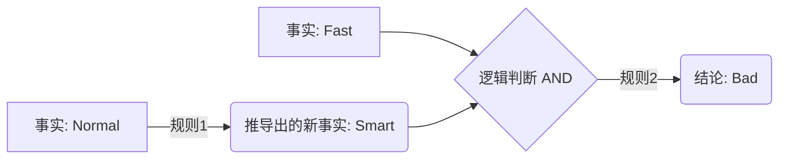
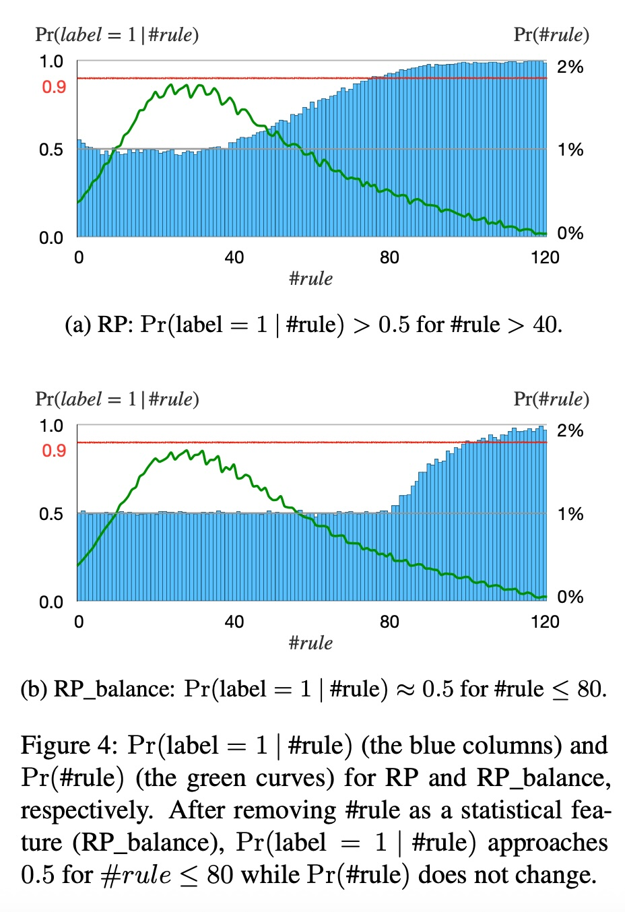
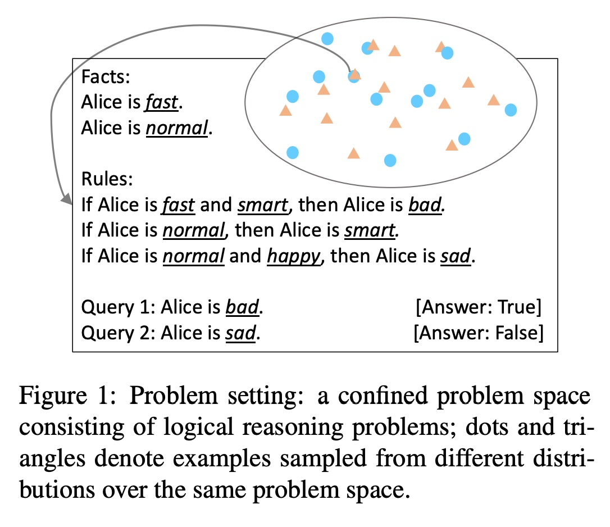
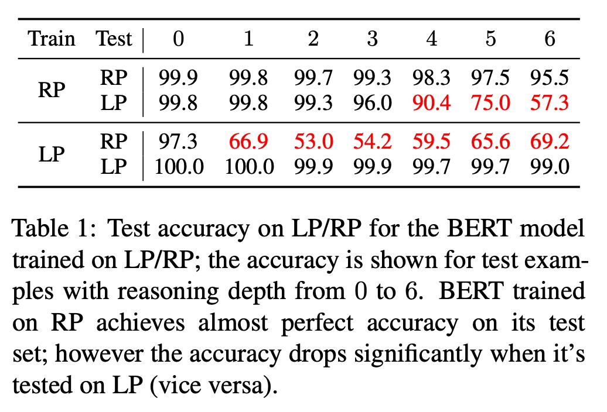
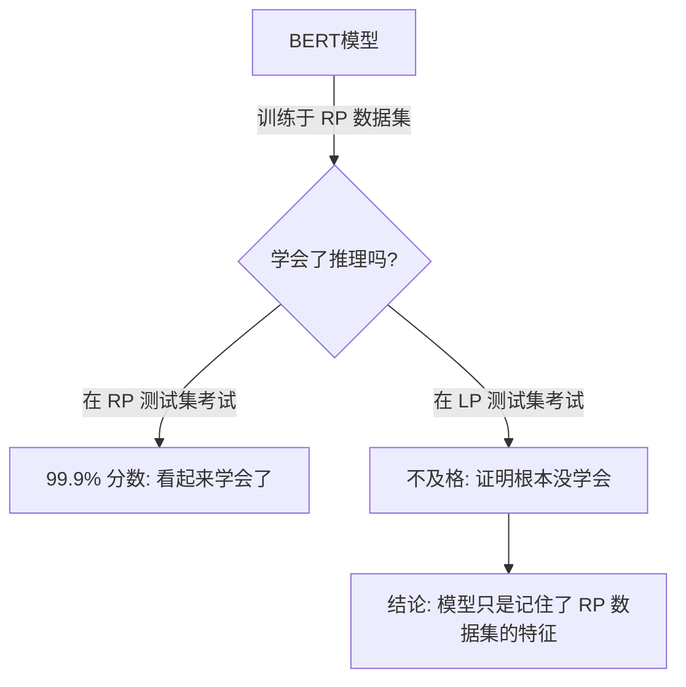

## AI论文解读 | On the Paradox of Learning to Reason from Data
        
### 作者        
digoal        
        
### 日期        
2025-12-05        
        
### 标签        
PostgreSQL , PolarDB , DuckDB , AI , 论文解读        
        
----        
        
## 背景  
      
https://arxiv.org/pdf/2205.11502        
  
提示:          
```          
读懂《On the Paradox of Learning to Reason from Data》这篇论文需要提前掌握哪些基础知识, 请使用中文通熟易懂的讲解这些基础知识, 可以引用论文中的图、表或使用Markdown支持的图形(text,mermaid等)增加解释性. 
  
使用中文通熟易懂的解读《On the Paradox of Learning to Reason from Data》这篇论文, 其中的关键内容请着重讲解, 可以引用论文中的图、表或使用Markdown支持的图形(text,mermaid等)增加解释性. 
  
提取《On the Paradox of Learning to Reason from Data》这篇论文中的重要术语, 使用中文对这些术语进行通熟易懂的讲解, 可以引用论文中的图、表或使用Markdown支持的图形(text,mermaid等)增加解释性. 
```     
  
## 1 前置知识 
  
这篇论文《On the Paradox of Learning to Reason from Data》（论从数据中学习推理的悖论）探讨了一个核心问题： **深度学习模型（如BERT）是在真正地“推理”，还是仅仅在“走捷径”？** 

为了读懂这篇论文，你需要掌握以下三个领域的基础知识。我将通过通俗易懂的语言，结合论文中的案例为你讲解。

-----

### 1\. 基础逻辑学概念：命题逻辑与演绎推理

论文的核心实验对象是“逻辑推理”问题 。你不需要懂高深的符号逻辑，但需要理解最基础的**命题逻辑（Propositional Logic）和演绎推理（Deductive Reasoning）** 。

#### **核心概念：**

  * **谓词（Predicates）：** 可以理解为描述状态的词，比如“Alice is **happy**（开心的）”。在论文中，True/False代表这些状态是否成立 。
  * **事实（Facts）：** 已知为真的条件。例如：`Alice is fast` 。
  * **规则（Rules）：** 也就是“如果...那么...”的逻辑链条。
      * 形式： $A \rightarrow B$ （如果A，那么B）。
      * 论文中称左边为**Body**（前件），右边为**Head**（后件）。
  * **前向链式推理（Forward Chaining）：** 这是一种基础的推理算法。从已知事实出发，应用规则，推导出新的事实，直到推导出目标或无法继续 。

#### **图解示例（Mermaid）：**

假设论文中的规则是：“如果Alice正常(normal)，那么她聪明(smart)”；“如果她聪明且快速(fast)，那么她就是坏的(bad)” 。



> **论文中的应用：**
> 论文构建了一个叫 **SimpleLogic** 的数据集，里面全是这种“事实+规则 -\> 结论”的问题 。模型需要判断查询（Query）是真（True）还是假（False）。

-----

### 2\. 深度学习与NLP模型基础（BERT）

论文研究的是**BERT**模型 。你需要了解BERT是什么，以及它是如何被训练的。

#### **核心概念：**

  * **Transformer架构：** BERT基于Transformer，拥有强大的语言理解能力。它通过“注意力机制”来处理输入文本 。
  * **输入格式：** 模型不能直接吃逻辑符号，需要把逻辑变成自然语言。
      * 论文把逻辑题变成了文本：“Alice is fast. If Alice is fast, then Alice is bad.” 这样的句子 。
  * **分类任务（Classification）：** 在这里，BERT被当作一个二分类器。给它一段逻辑文本，它输出“True”或“False” 。
  * **训练（Training）与泛化（Generalization）：**
      * **训练：** 给模型看大量例题和答案，让它学习参数。
      * **泛化：** 考试！给模型看它**没见过**的题目，看它能不能做对。如果做对了，叫“泛化能力强” 。

#### **论文中的“悖论”来源：**

通常我们认为，如果模型在考试（测试集）中拿了满分，它就学会了。但论文发现，模型可能只是在由某种特定算法（比如Rule-Priority, RP）生成的试卷上拿满分，换一种出题方式（比如Label-Priority, LP）生成的试卷（哪怕逻辑规则完全一样），模型就挂科了 。

-----

### 3\. 统计特征（Statistical Features）与“捷径”学习

这是论文最核心的洞察点。你需要理解 **相关性（Correlation）** 与 **因果性（Causality/Logic）** 的区别。

#### **核心概念：**

  * **统计特征（Statistical Features）：** 数据中存在的某种简单的统计规律，它和答案高度相关，但并不是真正的逻辑原因 。
  * **捷径（Shortcuts/Heuristics）：** 模型不走复杂的逻辑推理路径，而是偷懒看统计特征。

#### **通俗解释（结合论文案例）：**

想象你在做英语阅读理解，你发现了一个规律： **“只要文章很长，答案通常选A”** 。

  * **真正的推理：** 阅读文章 -\> 理解逻辑 -\> 选A。
  * **走捷径（学习统计特征）：** 看到长文章 -\> 选A。

**论文中的实际案例（规则数量 \#rule）：**
论文发现，在一个生成的数据集（RP）中，**规则越多（\#rule），答案是True的可能性就越大** 。

| 规则数量 (\#rule) | 答案是 True 的概率 | 模型的行为 |
| :--- | :--- | :--- |
| 少 (\<40) | 约 50% | 模型必须思考 |
| **多 (\>40)** | **\> 50% (甚至接近100%)** | **模型直接猜 True**  |

**图解统计特征（基于论文 Figure 4）：**

  

```text
       概率(Pr)
        ^
  100% -|                ++++++++ (当规则很多时，答案几乎全是True)
        |             +++
   50% -|-------------+++--------- (50%是瞎猜的基准线)
        |          +++
        |       +++
     0% +-------------------------> 规则数量 (#rule)
            (少)          (多)
```


#### **为什么这是个问题？**

因为逻辑是严密的，不依赖于规则的长短。一旦换了一套题库（比如LP数据集），这种“规则多=True”的统计规律消失了，只会走捷径的模型就会惨败。这就解释了为什么模型看似学会了（在原分布上准确率99%），实则没学会（换个分布就甚至不如瞎猜）。

-----

### 总结：读这篇论文的思维导图

当你阅读时，请时刻带着这个视角：

1.  **任务：** 用BERT做简单的逻辑题（A-\>B, B-\>C, 所以A-\>C）。
2.  **现象：** 训练集生成的题做得完美，换种生成方式的题（逻辑本质没变）就废了。
3.  **原因：** 模型是个“投机取巧”的学生。它没学会推理公式，而是死记硬背了“题干长短”、“词汇出现频率”等**统计特征**。
4.  **结论：** 即使是简单的问题空间，想让AI真正学会“推理”而不依赖“统计特征”是非常困难的 。

**下一步建议：**
如果你准备开始阅读论文，建议先看 **Figure 1**  理解题目长什么样，然后重点阅读 **Section 3.2**  理解那个令人震惊的实验结果（Table 1），最后细读 **Section 4.1**  理解那个“作弊”的统计特征是怎么回事。

  

  
  
## 2 解读论文 
  
这是一篇非常精彩且发人深省的论文，它揭示了深度学习模型（以BERT为例）在看似学会了“逻辑推理”的表象下，实际上是在“走捷径”的真相。

以下是关于这篇论文《On the Paradox of Learning to Reason from Data》（论从数据中学习推理的悖论）的通俗解读。

-----

### 1\. 核心论题：AI是真的学会了推理，还是在死记硬背？

**背景：**
大家都知道BERT等模型在自然语言处理（NLP）任务上表现出色。但一个根本性的问题是： **模型是真的像人类一样学会了逻辑推理规则，还是仅仅学会了利用数据中的统计规律来猜答案？** 

**论文的“打脸”结论：**
模型**并没有**学会推理。它只是学会了利用题目中隐藏的“统计特征”来作弊。一旦你换一种出题方式（哪怕逻辑规则完全不变），模型就彻底傻眼了。 

-----

### 2\. 实验环境：SimpleLogic（简单的逻辑世界）

为了验证这个问题，作者没有使用复杂的语言，而是构建了一个极其纯粹、没有任何语言歧义的逻辑环境，叫做 **SimpleLogic**。 

#### 长什么样？

这就是典型的“三段论”式推理。

  * **Facts (事实):** Alice is fast. Alice is normal.
  * **Rules (规则):**
    1.  If Alice is fast and smart, then Alice is bad.
    2.  If Alice is normal, then Alice is smart.
  * **Query (提问):** Alice is bad?
  * **Answer (答案):** True (因为 Normal -\> Smart, 然后 Fast + Smart -\> Bad)。 

**关键前提：** 作者通过数学证明了，BERT模型的容量完全足够完美解决这类问题，**理论上它可以拿100分**。 

-----

### 3\. 那个令人困惑的“悖论” (The Paradox)

为了测试模型，作者设计了两种不同的**生成数据的方法（Sampling Algorithms）** 。注意，这些方法生成的题目虽然分布不同，但背后的**逻辑规则是一模一样**的。 

1.  **Rule-Priority (RP模式):** 先随机生成规则和事实，再推导结论。
2.  **Label-Priority (LP模式):** 先预设结论的真假，反向倒推生成规则。 

#### 实验结果：虚假的学霸

作者做了一个交叉验证，结果非常震惊（见下表）：

| 训练数据来源 | 测试数据来源 | 准确率 (Accuracy) | 评价 |
| :--- | :--- | :--- | :--- |
| **RP模式** | **RP模式** | **99.9%** | 学霸！看似完美掌握。  |
| **RP模式** | **LP模式** | **66.9%** (甚至更低) | **学渣！完全不及格。**  |

**这就是悖论所在：**
如果模型真的学会了“推理”（即学会了 $A \rightarrow B$ 这种逻辑），那么无论题目是用 RP 方式生成的还是 LP 方式生成的，它都应该能做对，因为逻辑没变。
**模型在自己熟悉的题库里接近满分，换个题库就崩盘，说明它根本没学会“推理”这个技能。** 



-----

### 4\. 侦探破案：模型是怎么“作弊”的？

既然没学会推理，那它那99.9%的分数是怎么来的？
作者发现，模型是在利用**统计特征 (Statistical Features)** 进行预测。 

#### 什么是统计特征？（作弊的捷径）

统计特征就是数据中存在的某种“相关性”，它不是逻辑上的因果，但能帮你猜对答案。

**最典型的例子：规则的数量 (\#rule)**
作者分析 RP 数据集发现了一个惊人的规律：

  * **规则数量越多，答案是 True 的概率就越大。** 
  * 如下图所示（根据论文 Figure 4a 数据重绘）：

  

```text
       概率 Pr(Label=True)
        ^
  100% -|                         ************** (规则很多时，几乎全是True)
        |                     ****
   50% -|-----------------****------------------
        |             ****
     0% +-------------------------------------->
       0              40             80
                  规则数量 (#rule)
```

**BERT的策略：**
BERT发现：“我不需推导逻辑，我只要数数有多少条规则。如果规则很多，我就蒙 True。”

  * 这解释了为什么它在 RP 数据集上表现好（因为 RP 数据集里确实规则多的大多是 True）。
  * 这也解释了为什么它在 LP 数据集上表现差（因为 LP 数据集里没有这个规律）。 

#### 还有其他的作弊特征吗？

非常多。比如：

  * **\#fact (事实数量)** 
  * **branching\_factor (分支因子):** 规则左边包含的平均谓词数量。 

这些特征就像是考试里的“三长一短选最短”，模型极其擅长捕捉这些规律，而不是学习真正的解题思路。 

-----

### 5\. 为什么我们不能通过“清洗数据”来解决？

你可能会问：如果我们把这些统计特征去掉（比如强行平衡数据，让规则多的时候 True/False 各占一半），模型是不是就能学会推理了？

作者尝试了构建一个平衡的数据集 **RP\_balance**，去掉了“规则数量”这个捷径。
**结果：** 模型的泛化能力确实提高了一些（从烂得一塌糊涂变好了一点），但依然无法彻底解决。 

**根本性的困难 (The Dilemma)：**

1.  **特征太多了：** 除了“规则数量”，还有“分支因子”、“树的深度”等等无数种统计特征，甚至还有很多复杂的组合特征人类都想不到。 
2.  **计算代价太大：** 想要消除所有特征的偏差，需要生成海量的数据并进行复杂的筛选。作者估算，如果要同时消除三个简单的特征，计算量会呈指数级爆炸，实际上是不可行的。 

-----

### 6\. 总结与启示

这篇论文得出了一个悲观但清醒的结论：

1.  **BERT没有学会思考：** 在高分表象下，BERT实际上是一个通过统计规律“猜答案”的机器，而不是在进行逻辑推理。 
2.  **数据中的“捷径”无处不在：** 只要是从数据中学习，模型就会倾向于抓取统计特征，因为这比学习复杂的逻辑规则更容易。 
3.  **很难纠正：** 我们很难构建一个没有任何统计偏差的完美数据集来逼迫模型真正去“推理”。 

**一句话总结：**
如果你发现你的AI模型在逻辑题上拿了满分，别急着高兴，它可能只是发现了“题目越长答案越可能是A”这样的规律，换套卷子它就原形毕露了。
  
## 3 术语 
  
这篇论文《On the Paradox of Learning to Reason from Data》通过一系列严谨的实验，探讨了深度学习模型是否真的学会了逻辑推理。

为了帮助你更好地理解，我提取了论文中的核心术语，并按照**逻辑基础**、**实验方法**和**核心发现**三个维度进行了通俗易懂的解读。

-----

### 一、 逻辑基础术语：构建“微型逻辑世界”

为了不让语言的复杂性（比如同义词、复杂的句式）干扰实验，作者构建了一个极其纯粹的逻辑环境。

#### 1\. SimpleLogic (简单逻辑空间)

  * **定义：** 这是作者专门设计的一个**受控的逻辑推理问题集** 。
  * **通俗解释：** 想象一个只有“A是B”、“如果A则B”这种简单句子的世界。在这个世界里，没有复杂的修辞，只有纯粹的逻辑链条。所有的题目都遵循同一套基本的逻辑规则，没有语言陷阱 。
  * **目的：** 如果模型在这个简单的环境里都学不会推理，那在复杂的真实语言环境中就更不可能学会了。

#### 2\. Definite Clause (确定的子句/规则)

  * **定义：** 论文中使用的特定形式的逻辑规则，结构为 $A_1 \land A_2 \dots \land A_n \rightarrow B$ 。
  * **通俗解释：** 就是标准的“如果……那么……”句型。
      * **Body (前件/条件)：** “如果 Alice 既**聪明**又**勤奋**……” ( $A_1 \land A_2$ ) 。
      * **Head (后件/结论)：** “……那么 Alice 就是**成功**的。” ( $\rightarrow B$ ) 。
  * **图解逻辑链条：**
    ```mermaid
    graph LR
        A[事实: Alice is Fast] --> C{规则判定 AND}
        B[事实: Alice is Smart] --> C
        C -->|触发规则| D(结论: Alice is Bad)
    ```
    *(注：这是论文中常用的推理形式，即如果满足所有条件，就能推导出结论 )*

#### 3\. Forward-Chaining (前向链式推理)

  * **定义：** 一种推理算法，从已知的事实出发，应用规则推导出新事实，直到无法推导为止 。
  * **通俗解释：** 就像滚雪球。你手里有一把雪（事实），你根据滚雪球的规则（Rules），越滚越大，最后看能不能滚出你想要的那个形状（Query）。论文证明了BERT模型有能力模拟这个过程 。

-----

### 二、 实验方法术语：两套“试卷”，一种逻辑

这是论文最精彩的部分。作者用两种不同的方法生成了逻辑完全一样，但“长相”略有不同的数据。

#### 4\. Rule-Priority (RP, 规则优先采样)

  * **定义：** 一种数据生成算法。先随机生成大量的规则和事实，然后通过推理计算出结论（True/False）。
  * **通俗解释：** **“先出题，再算答案”** 。
    1.  机器先随机写下一堆规则：“如果A则B”，“如果B则C”……
    2.  然后看看根据这些规则，能不能推导出结论。
  * **后果：** 这种方式生成的题目有一个隐藏的统计规律——**规则越多，答案是“真”的可能性越大** 。

#### 5\. Label-Priority (LP, 标签优先采样)

  * **定义：** 另一种数据生成算法。先预设好结论是真还是假，然后反向生成能够支持这个结论的规则和事实 。
  * **通俗解释：** **“先定答案，再凑题目”** 。
    1.  先决定这道题的答案是“True”。
    2.  然后倒推：为了让答案是True，我需要编造哪些规则和事实来填空。
  * **重要性：** LP和RP覆盖的是**同一个**逻辑问题空间，但它们的统计特征（数据分布）完全不同 。

-----

### 三、 核心发现术语：揭露模型的“作弊”行为

#### 6\. Statistical Features (统计特征)

  * **定义：** 样本中某种与标签（答案）有强相关性的统计属性，但这种属性并非真正的逻辑因果 。
  * **通俗解释：** 这就是 **“作弊的捷径”** 。
      * **例子 (\#rule)：** 比如在RP数据集中，只要题目里的**规则数量超过40条**，答案就有超过90%的概率是**True** 。
      * **模型的行为：** 模型根本不看逻辑，它只要数数：“哇，这题规则好长，肯定选True！” 。
  * **图解统计特征的影响：**
    ```text
    规则数量 (#rule) 越多 --> 答案是 True 的概率越高
    (这是数据里的偏差，不是逻辑规则)
    ```

#### 7\. Branching Factor (分支因子)

  * **定义：** 这是一个更隐蔽的统计特征。它大致指规则左边（条件部分）平均有多少个谓词 。
  * **通俗解释：** 题目的“复杂度”或“分叉程度”。
      * 规则 $A \rightarrow B$ 比较简单。
      * 规则 $A \land B \land C \rightarrow D$ 就比较复杂（分支多）。
      * **发现：** 这种难以被人类一眼看穿的复杂特征，也会被模型利用来猜答案，阻碍真正的推理学习 。

#### 8\. Generalization Failure (泛化失败/悖论)

  * **定义：** 模型在训练集分布上表现完美，但在同一问题空间的其他分布上表现糟糕的现象 。
  * **通俗解释：** **“高分低能”** 。
      * 模型在RP题库里训练，RP考试拿99.9分 。
      * 给它做LP题库（逻辑完全一样，只是出题风格变了），模型瞬间不及格（66.9%甚至更低）。
  * **结论：** 这证明模型学到的不是通用的“逻辑推理能力”，而是特定数据集里的“统计特征” 。

#### 9\. The Dilemma (进退两难的困境)

  * **定义：** 想要在数据中去除所有统计特征在计算上是不可行的 。
  * **通俗解释：** 你可能会想：“把数据修补一下，去掉那些捷径不就好了？”
      * 论文告诉我们： **做不到。**
      * 统计特征成千上万，甚至相互组合。想要把它们全部消除，需要生成天文数字般的数据量，计算成本高到无法想象 。因此，想通过单纯喂数据让模型学会纯粹的逻辑推理，是一条走不通的路 。
  
## 参考        
         
https://arxiv.org/pdf/2205.11502    
        
<b> 以上内容基于DeepSeek、Qwen、Gemini及诸多AI生成, 轻微人工调整, 感谢杭州深度求索人工智能、阿里云、Google等公司. </b>        
        
<b> AI 生成的内容请自行辨别正确性, 当然也多了些许踩坑的乐趣, 毕竟冒险是每个男人的天性.  </b>        
    
#### [PolarDB 学习图谱](https://www.aliyun.com/database/openpolardb/activity "8642f60e04ed0c814bf9cb9677976bd4")
  
  
#### [PostgreSQL 解决方案集合](../201706/20170601_02.md "40cff096e9ed7122c512b35d8561d9c8")
  
  
#### [德哥 / digoal's Github - 公益是一辈子的事.](https://github.com/digoal/blog/blob/master/README.md "22709685feb7cab07d30f30387f0a9ae")
  
  
#### [About 德哥](https://github.com/digoal/blog/blob/master/me/readme.md "a37735981e7704886ffd590565582dd0")
  
  

  
