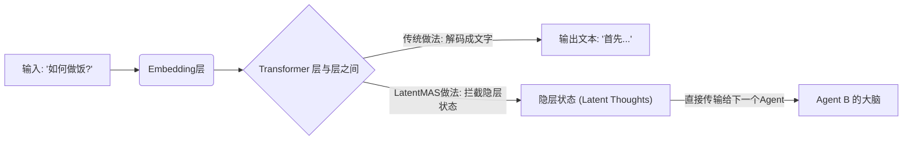
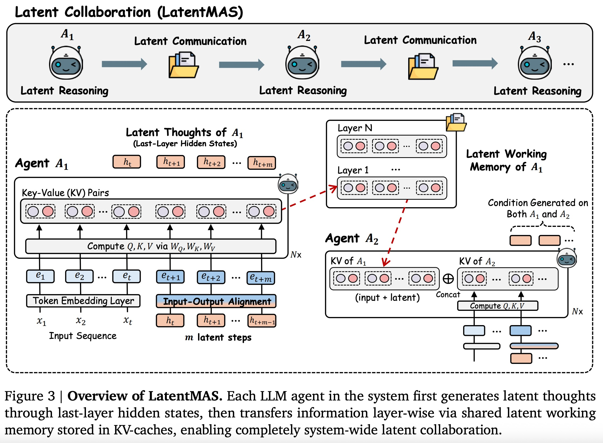
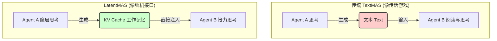
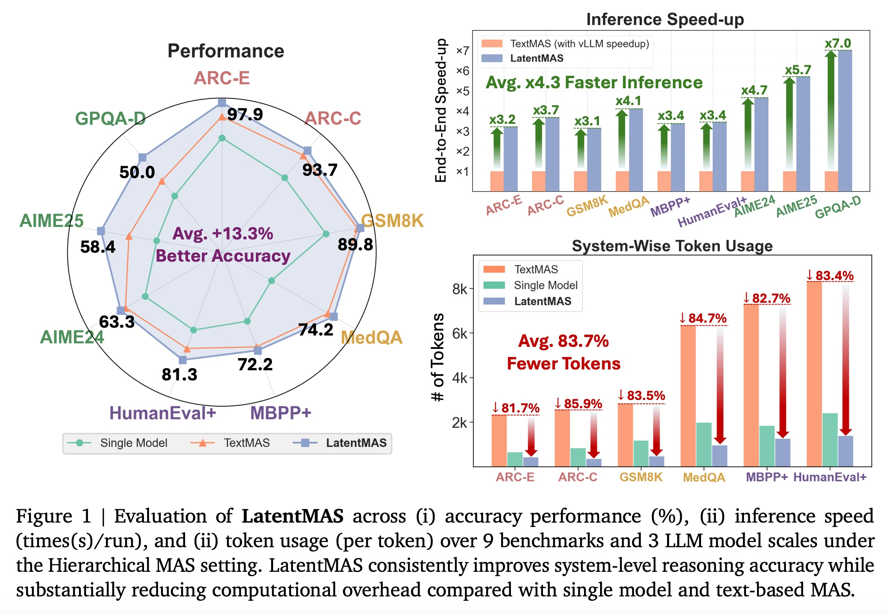
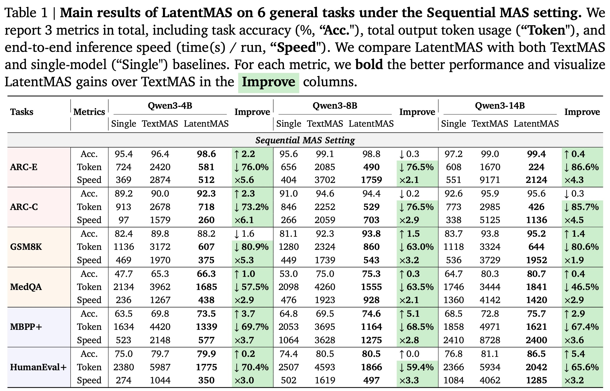
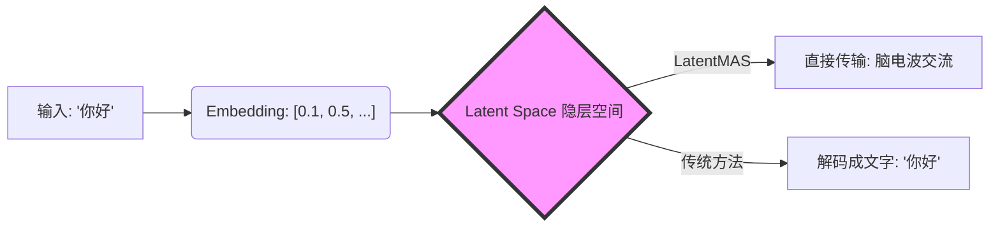
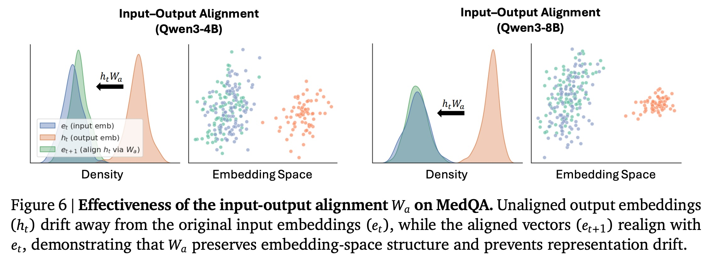

## AI论文解读 | Latent Collaboration in Multi-Agent Systems
        
### 作者        
digoal        
        
### 日期        
2025-12-07        
        
### 标签        
PostgreSQL , PolarDB , DuckDB , AI , 论文解读        
        
----        
        
## 背景  
      
https://arxiv.org/abs/2511.20639v1        
  
提示:          
```          
读懂《Latent Collaboration in Multi-Agent Systems》这篇论文需要提前掌握哪些基础知识, 请使用中文通熟易懂的讲解这些基础知识, 可以引用论文中的图、表或使用Markdown支持的图形(text,mermaid等)增加解释性. 
  
使用中文通熟易懂的解读《Latent Collaboration in Multi-Agent Systems》这篇论文, 其中的关键内容请着重讲解, 可以引用论文中的图、表或使用Markdown支持的图形(text,mermaid等)增加解释性. 
  
提取《Latent Collaboration in Multi-Agent Systems》这篇论文中的重要术语, 使用中文对这些术语进行通熟易懂的讲解, 可以引用论文中的图、表或使用Markdown支持的图形(text,mermaid等)增加解释性. 
```     
  
## 1 前置知识 
  
要读懂《Latent Collaboration in Multi-Agent Systems》（LatentMAS）这篇论文，你需要理解大语言模型（LLM）是如何工作的，以及它们是如何协作的。这篇论文的核心创新在于**让多个AI智能体直接通过“脑电波”（隐层状态）交流，而不是通过“说话”（文本）交流**。

为了帮助你更好地理解，我将基础知识分为四个关键模块进行通俗讲解，并配合可视化图表。

### 1\. Transformer 内部构造与“隐层状态” (Latent Hidden States)

这是理解本论文最核心的概念。

  * **通俗解释**：
    通常我们认为 AI 的输入和输出都是文字。但在 AI **内部**，文字并不存在，存在的是一串串数字（向量）。

      * **Embedding (嵌入)** ：把文字（比如 "Apple"）转换成一个数字列表（向量）。
      * **Hidden States (隐层状态)** ：当这个向量经过模型的每一层（Layer）处理时，它携带的信息越来越丰富（包含了上下文、逻辑等）。这些在模型内部流动的中间向量，就是“隐层状态”。
      * **Token (词元)** ：模型最终吐出来的文字单位。

  * **论文中的应用**：
    传统的 Multi-Agent（多智能体）是 Agent A 把想法转化成**文字**发给 Agent B，Agent B 再把文字读进去。
    **LatentMAS** 的做法是：Agent A 不转化成文字，直接把它脑子里的**隐层状态（High-level representations）** 传给 Agent B 。

  * **可视化流程图**：




> **论文佐证**：论文指出，隐层状态包含的信息比离散的文本更丰富，通过隐层交流可以减少信息损失 。

-----

### 2\. KV Cache (键值缓存) 与工作记忆

这是理解论文中“信息如何传递”的关键技术点。

  * **通俗解释**：
    大模型生成文字就像写文章，写第二句时必须记得第一句的内容。

      * **没有 KV Cache**：每写一个字，都要回头把前面的文章重新读一遍，计算量巨大。
      * **有了 KV Cache**：模型把之前读过、算过的内容的特征（Key 和 Value 矩阵）存下来。生成下一个字时，直接调用这个“记忆库”，不需要重新计算。

  * **论文中的应用**：
    LatentMAS 把 KV Cache 当作**共享的工作记忆（Shared Working Memory）** 。Agent A 思考完后，把它所有的 KV Cache 直接打包给 Agent B。Agent B 拿到这个 Cache，就好像自己刚刚经历了 Agent A 的思考过程一样，实现了无缝对接 。

  * **图解 KV Cache 传递 (参考论文 Figure 3)** ：    

| 阶段 | 传统方法 (TextMAS) | 本论文方法 (LatentMAS) |
| :--- | :--- | :--- |
| **Agent A 完成工作** | 输出一堆文字 "Plan: Step 1..." | 生成并保存内部的 KV Cache (记忆) |
| **传递方式** | 把文字复制粘贴给 Agent B | **直接把 KV Cache 注入 Agent B 的内存** |
| **Agent B 开始工作** | 重新阅读文字，重新计算特征 | **直接基于 A 的记忆继续思考，无需重算** |

-----

### 3\. 自回归生成 (Auto-regressive Generation)

这是理解模型如何“思考”的基础。

  * **通俗解释**：
    大模型是“接龙高手”。它永远是根据前面的内容预测**下一个**内容。

      * **Text Generation**：根据前面的字，预测下一个**字（Token）** 。
      * **Latent Generation (本论文特有)** ：根据前面的隐层向量，预测下一个**隐层向量**，而不解码成文字 。

  * **难点与解决方案（Input-Output Alignment）** ：
    论文中提到了一个技术难点：模型输出的“隐层向量”和模型输入的“Embedding向量”在数学空间上是不一样的。

      * *比喻*：就像 Agent A 输出的是“方言”，Agent B 的入口只能识别“普通话”。
      * *对策*：论文设计了一个线性变换矩阵 ( $W_a$ )，把输出的向量“翻译”回输入空间，让它们可以循环输入 。

-----

### 4\. 多智能体系统架构 (Multi-Agent Systems, MAS)

你需要了解多智能体通常是怎么分工的，才能看懂实验部分的设置。

  * **通俗解释**：
    一个 AI 很难解决复杂问题，所以我们要组建一个团队。

      * **Sequential (顺序式/链式)** ：流水线作业。
          * `Planner (策划)` -\> `Critic (批评家)` -\> `Refiner (修改者)` -\> `Solver (执行者)`。
      * **Hierarchical (层级式)** ：老板带专家。
          * `Summarizer (老板)` 分发任务给 `Math Agent`, `Code Agent`, `Science Agent`，最后由老板汇总。

  * **论文中的对比**：
    论文展示了在这些架构下，使用 LatentMAS（隐层协作）比使用 TextMAS（文本协作）速度更快，且消耗的 Token 更少（省钱）。

-----

### 总结：读这篇论文的心理模型

当你阅读这篇论文时，请在脑海中保持这个画面：

> **LatentMAS 就像是一群心灵相通的专家。**  
>  
> 1.  专家 A 不说话，他在脑子里思考（Latent Reasoning）。  
> 2.  他把脑子里的电流状态（KV Cache）直接“复制”给专家 B。  
> 3.  专家 B 不需要听 A 解释，瞬间就拥有了 A 的上下文和思路，然后继续往下想。  
> 4.  只有到最后一步，才由最后一个专家把结果写成文字（Text）给我们看。  

掌握了以上四点（隐层状态、KV Cache、自回归、MAS架构），你就可以顺畅地理解这篇论文的技术细节和贡献了。
  
## 2 解读论文 
  
这是一篇非常具有开创性的论文，来自普林斯顿大学、伊利诺伊大学香槟分校和斯坦福大学的研究团队 。

简单来说，**LatentMAS (Latent Multi-Agent Systems)** 提出了一种全新的 AI 协作方式：**让多个 AI 智能体直接通过“脑电波”（隐层状态）交流，而不是通过“说话”（文本）交流** 。

这种方法使得 AI 协作变得**更聪明、更快速、且更省钱** 。

-----

### 1\. 核心痛点：以前的 AI 是怎么协作的？(TextMAS)

在现有的多智能体系统（如 AutoGen, MetaGPT）中，AI 之间是通过 **自然语言（文本）** 来交流的 。

  * **过程**：Agent A 思考 -\> 把想法转化成文字 -\> 发送给 Agent B -\> Agent B 阅读文字 -\> 重新转化成自己的理解 -\> Agent B 开始思考。  
  * **缺点**：  
    1.  **信息丢失**：文字是离散的、有限的，无法完全承载模型内部复杂的思维向量（Latent Space）。  
    2.  **效率低**：把思维转化成文字（Decoding）再读回去（Encoding）非常慢 。  
    3.  **成本高**：生成大量中间过程的文字需要消耗大量的 Token 。  

-----

### 2\. 核心创新：LatentMAS 是怎么做的？

LatentMAS 抛弃了中间的“文本”，直接在 **隐层空间（Latent Space）** 进行协作。整个过程不需要任何额外的模型训练（Training-free）。

我们可以用 **“心灵感应”** 来比喻这种机制。

#### 关键技术一：隐层思考 (Latent Reasoning)

Agent 不再吐出文字（Token），而是吐出 **“思维流”** （隐层状态向量）。

  * **通俗解释**：就像你在心里默想问题，不需要把每一步都说出声来。模型直接生成其最后一层神经网络的隐藏状态（Hidden States），这些状态包含了比文字更丰富的信息 。

#### 关键技术二：无损记忆传递 (KV Cache Transfer)

这是本文最精妙的设计。LatentMAS 利用了 Transformer 架构中的 **KV Cache (键值缓存)** 作为共享的“工作记忆” 。

  * **通俗解释**：
    Agent A 思考完后，把它大脑当前的 **所有记忆状态（KV Cache）** 直接“复制粘贴”到 Agent B 的大脑里。
    Agent B 不需要重新阅读 Agent A 的报告，它瞬间就拥有了 Agent A 的所有上下文理解，然后接着往下想 。

  * **流程对比图**：




#### 关键技术三：输入-输出对齐 (Input-Output Alignment)

这是为了解决“语言不通”的技术细节。

  * **问题**：模型输出的是“高层思维向量”（Output Embedding），但模型下一层通常期待的是“底层词向量”（Input Embedding）。直接循环输入会导致分布不匹配，就像把方言直接当普通话听 。
  * **方案**：作者设计了一个简单的线性变换矩阵 ( $W_a$ )，把“思维向量”翻译回模型能听懂的“输入向量”，确保思考可以顺畅循环 。

-----

### 3\. LatentMAS 有多强？(实验结果)

论文在数学、科学、代码等 9 个基准测试上进行了评估，结果非常惊人 。

我们来看一下论文中的核心数据对比（引用自论文图表 Figure 1 和 Table 1）： 

  

  

| 指标 | 提升幅度 | 说明 |
| :--- | :--- | :--- |
| **准确率 (Accuracy)** | **+13.3%** | 平均比单模型提升 13.3%，比文本协作也有显著提升 。 |
| **推理速度 (Speed)** | **快 4.3 倍** | 因为不需要把思维解码成文字，速度极快 。 |
| **Token 消耗** | **减少 83.7%** | 省去了大量的中间废话，极大地降低了 API 成本 。 |

  

> **引用论文图表解释 (Figure 5)** ：  
> 论文甚至可视化了“隐层思维”和“文本思维”的分布。结果显示，LatentMAS 生成的隐层思维（红点）不仅覆盖了正确文本答案（蓝点）的语义空间，甚至表达能力更强（分布更广），证明了它不仅没丢信息，还想得更深 。  

-----

### 4\. 为什么这篇论文很重要？

1.  **打破了“语言”的限制**：证明了 AI 之间不需要像人类一样用语言交流，直接交换“脑电波”效率更高 。
2.  **即插即用**：它不需要重新训练模型，现有的开源大模型（如 Qwen）直接就能用这个框架 。
3.  **为未来 Agent 设计指路**：未来的多智能体系统可能会演变成一个巨大的“超级大脑”，不同的 Agent 只是这个大脑中不同的功能区，通过神经信号（Latent）高速互联。

### 总结

**LatentMAS** 就是让 AI 团队从“开会讨论”（TextMAS）进化到了“蜂巢思维”（Hive Mind）。

  * **Agent A** 想了一半，把“大脑状态”扔给 **Agent B**。
  * **Agent B** 接过状态，无缝继续思考。
  * 全程没有废话（Token），只有纯粹的信息流。

这是一种更符合 AI 本质的协作形态。
  
## 3 术语 
  
为了帮助你更好地理解《Latent Collaboration in Multi-Agent Systems》（简称 LatentMAS）这篇论文，我提取了其中的 5 个核心术语。

我会用**通俗的比喻**来解释它们，并结合图表说明，让你像看科普文章一样读懂这篇硬核论文。

-----

### 1\. Latent Space (隐层空间)

**—— AI 的“潜意识”或“脑电波”**

  * **学术定义**：指大模型内部的高维向量空间。在这个空间里，信息以连续的数值（Embedding）形式存在，而不是离散的文字（Token）。
  * **通俗解读**：
      * 平时我们看 AI 输出的是文字（比如“苹果”），这叫**显性空间**。
      * 但在 AI 内部，它处理的其实是一串串数字向量，这些向量包含了比文字更丰富、更细腻的信息（比如语境、逻辑关系）。这就好比人类说话前脑子里闪过的 **“念头”** 。
      * **论文核心观点**：让 AI 之间直接用“脑子里的念头”（隐层状态）交流，而不是非要转化成“嘴边的话”（文字）。




-----

### 2\. Auto-regressive Latent Thoughts (自回归隐层思维)

**—— 在脑海里默想，不发出声音**

  * **学术定义**：模型在不进行解码（Decoding）的情况下，将上一层的隐藏状态（Last-layer hidden states）直接作为下一步的输入，循环生成新的隐藏状态 。
  * **通俗解读**：
      * 普通的 AI 是“想一个字，说一个字”。
      * LatentMAS 的 AI 是 **“在肚子里打草稿”** 。它在内部连续推理好几步（生成 Latent Thoughts），但外界看不到任何文字输出，直到它想清楚为止。
      * 这使得 AI 的推理密度更高，且速度极快 。

> **论文图解**：
> 论文 **Figure 5** 展示了这种思维的强大：LatentMAS 生成的“隐层思维”在语义空间上不仅覆盖了正确答案的范围，甚至比文字表达得更丰富 。  

  

-----

### 3\. Latent Working Memory / KV Cache (隐层工作记忆)

**—— 能够无损传递的“记忆胶囊”**

  * **学术定义**：利用 Transformer 中的 Key-Value (KV) Cache 作为共享的工作记忆。它存储了之前所有步骤的中间计算结果 。

  * **通俗解读**：

      * 想象你在玩接力赛，普通 AI 接力（TextMAS）是把上一棒的过程写成一本书交给下一棒，下一棒得从头读一遍书才能接着跑。
      * LatentMAS 的接力是直接把 **“大脑记忆”** （KV Cache）拷贝给下一棒。下一棒 AI 瞬间就拥有了上一棒的所有上下文和推理状态，可以直接接着跑，没有任何信息损耗 。

  * **KV Cache 结构图 (参考 Figure 3)** ：    

      * **Layer 1...N**: 每一层的记忆都被打包。
      * **传递方式**: Agent A 的 KV Cache -\> 直接注入 -\> Agent B 的模型层中 。

-----

### 4\. Input-Output Alignment ( $W_a$ ) (输入-输出对齐)

**—— 内部思维的“翻译器”**

  * **学术定义**：一个线性投影矩阵 $W_a$ ，用于将模型输出的隐藏状态映射回有效的输入嵌入空间 。
  * **通俗解读**：
      * **问题**：AI “脑子想出来的信号”（Output）和它“耳朵能听懂的信号”（Input）在格式上有一点偏差。如果直接循环输入，AI 会“走火入魔”（分布漂移），导致逻辑混乱 。
      * **解决**：作者加了一个极其简单的 **“翻译器”** （ 即矩阵 $W_a$ ）。每当 AI 产生一个内部想法，先用这个翻译器微调一下，让它符合输入的格式，然后再喂回给自己或传给别人。
      * **效果**：论文 **Figure 6** 显示，没有这个对齐，思维向量会飘远；加了对齐，思维向量就回到了正常的轨道上 。    

-----

### 5\. TextMAS vs. LatentMAS (文本协作 vs. 隐层协作)

**—— “开会讨论” vs. “心灵互通”**

  * **TextMAS (基准线)** ：
      * 现有的主流方法。Agent 之间用自然语言（英语/中文）沟通。
      * **缺点**：慢、费 Token、信息在转化为文字时会丢失 。
  * **LatentMAS (本文方法)** ：
      * 本文提出的新框架。Agent 之间传递向量和 KV Cache。
      * **优点**：快（推理速度提升 4.3 倍）、省（Token 减少 83.7%）、强（准确率提升 13.3%）。

| 特性 | TextMAS (传统) | LatentMAS (本文) |
| :--- | :--- | :--- |
| **交流介质** | 📝 文本 (Text) | 🧠 隐层状态 (Latent Representations) |
| **信息传递** | 有损 (Lossy) | 无损 (Lossless)  |
| **计算复杂度** | 高 (需要反复解码编码) | 低 (直接复用计算结果)  |
| **训练需求** | 不需要 | **不需要 (Training-free)**  |

-----

### 总结

这篇论文创造了一套 **“AI 也就是这一套专门的脑机接口标准”** 。

通过 **Auto-regressive Latent Thoughts（隐层思维）** 让 AI 自己在肚子里想，通过 **KV Cache（记忆胶囊）** 把想过的东西直接塞给队友，最后通过 **Alignment（对齐翻译）** 保证大家都在同一个频道上思考。
  
## 参考        
         
https://arxiv.org/abs/2511.20639v1    
        
<b> 以上内容基于DeepSeek、Qwen、Gemini及诸多AI生成, 轻微人工调整, 感谢杭州深度求索人工智能、阿里云、Google等公司. </b>        
        
<b> AI 生成的内容请自行辨别正确性, 当然也多了些许踩坑的乐趣, 毕竟冒险是每个男人的天性.  </b>        
  
    
#### [PolarDB 学习图谱](https://www.aliyun.com/database/openpolardb/activity "8642f60e04ed0c814bf9cb9677976bd4")
  
  
#### [PostgreSQL 解决方案集合](../201706/20170601_02.md "40cff096e9ed7122c512b35d8561d9c8")
  
  
#### [德哥 / digoal's Github - 公益是一辈子的事.](https://github.com/digoal/blog/blob/master/README.md "22709685feb7cab07d30f30387f0a9ae")
  
  
#### [About 德哥](https://github.com/digoal/blog/blob/master/me/readme.md "a37735981e7704886ffd590565582dd0")
  
  

  
