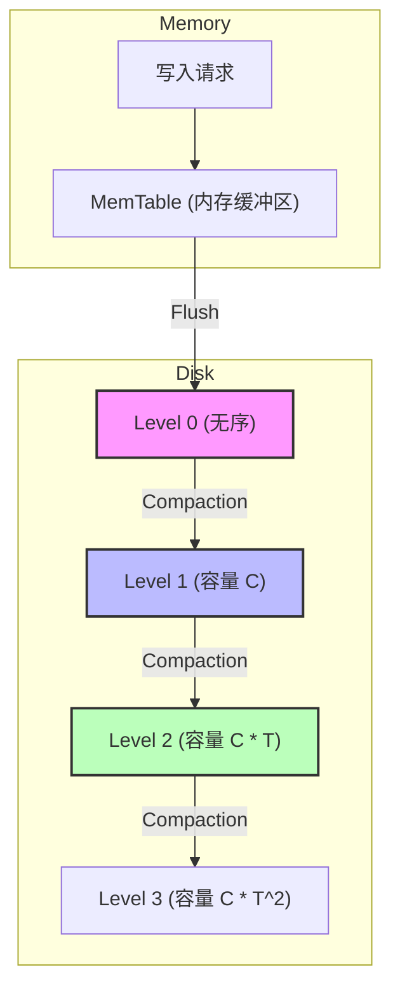
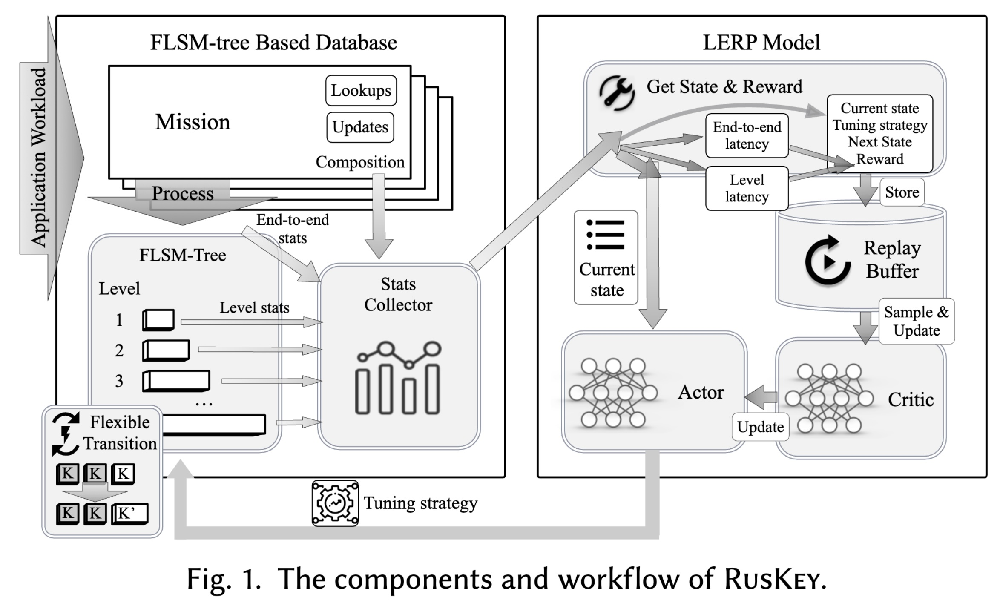
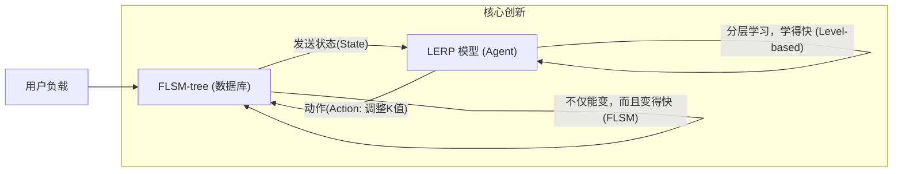
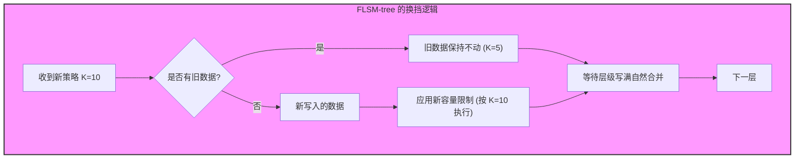
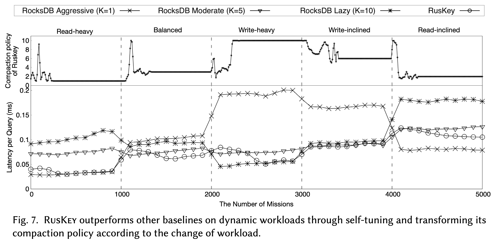
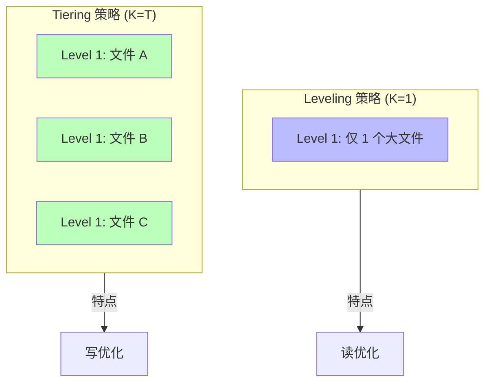
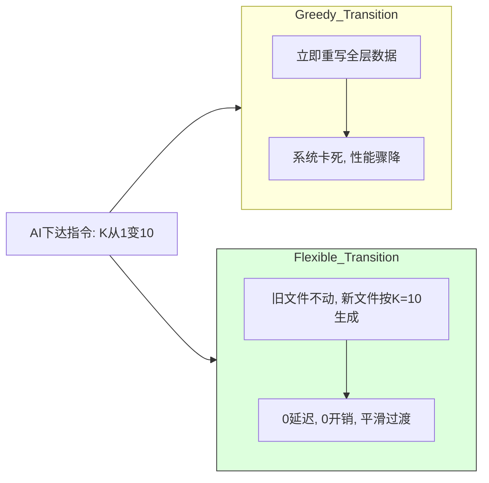

## AI论文解读 | Learning to Optimize LSM-trees: Towards A ReinforcementLearning based Key-Value Store for Dynamic Workloads
        
### 作者        
digoal        
        
### 日期        
2025-12-07        
        
### 标签        
PostgreSQL , PolarDB , DuckDB , AI , 论文解读        
        
----        
        
## 背景  
      
https://dl.acm.org/doi/epdf/10.1145/3617333        
  
提示:          
```          
读懂《Learning to Optimize LSM-trees: Towards A ReinforcementLearning based Key-Value Store for Dynamic Workloads》这篇论文需要提前掌握哪些基础知识, 请使用中文通熟易懂的讲解这些基础知识, 可以引用论文中的图、表或使用Markdown支持的图形(text,mermaid等)增加解释性. 
  
使用中文通熟易懂的解读《Learning to Optimize LSM-trees: Towards A ReinforcementLearning based Key-Value Store for Dynamic Workloads》这篇论文, 其中的关键内容请着重讲解, 可以引用论文中的图、表或使用Markdown支持的图形(text,mermaid等)增加解释性. 
  
提取《Learning to Optimize LSM-trees: Towards A ReinforcementLearning based Key-Value Store for Dynamic Workloads》这篇论文中的重要术语, 使用中文对这些术语进行通熟易懂的讲解, 可以引用论文中的图、表或使用Markdown支持的图形(text,mermaid等)增加解释性. 
```     
  
## 1 前置知识 
  
要深入理解论文《Learning to Optimize LSM-trees: Towards A Reinforcement Learning based Key-Value Store for Dynamic Workloads》（简称 RUSKEY），你需要掌握以下三个核心领域的基础知识： **LSM-tree 存储引擎原理**、**数据库性能指标（读写放大）** 以及 **强化学习（Reinforcement Learning, RL）的基本概念**。

以下是这些基础知识的通俗讲解，配合图表帮助理解。

-----

### 1\. 核心数据结构：LSM-tree (Log-Structured Merge-tree)

这是这篇论文的研究对象。现代 Key-Value 存储（如 RocksDB, LevelDB, Cassandra）都基于此结构 。

#### **基本原理**

LSM-tree 的设计哲学是“**将随机写转化为顺序写**”以提高写入性能。

  * **内存部分 (MemTable)** ：数据首先写入内存缓冲区。
  * **磁盘部分 (SSTables)** ：内存写满后，数据被“Flush”（刷盘）到磁盘，形成不可变的文件（Sorted Run）。磁盘上的数据分层管理（Level 0, Level 1, ... Level N），层级越深，容量越大 。

#### **核心操作：Compaction（合并/压缩）**

这是 LSM-tree 最关键的概念，也是论文优化的核心。

  * **问题**：随着数据写入，磁盘上会有很多重叠的、无序的文件，导致读取变慢（因为要查很多文件）。
  * **解决**：系统后台会将上层的小文件合并（Sort-Merge），清理掉无效数据，写入下层。这个过程叫 **Compaction** 。
  * **代价**：Compaction 会占用大量的磁盘 I/O 和 CPU，影响正常读写性能 。

#### **Compaction Policy（合并策略）**

论文中反复提到的 $K$ 值就是指代这个策略。

  * **Leveling ( $K=1$ )** ：每一层通常只有一个有序的大文件（Run）。
      * *优点*：读得快（也就是论文说的 read-optimized），因为查找时不需要跳跃多个文件。
      * *缺点*：写得慢，因为数据通过 Compaction 往下层移动时，需要频繁重写 。
  * **Tiering ( $K=T$ )** ：每一层允许有多个（ $T$ 个 ）文件（Runs）。
      * *优点*：写得快（write-optimized），因为可以推迟合并。
      * *缺点*：读得慢，因为读一个 Key 可能要查这一层的 $K$ 个文件 。

> **论文的创新点**：这篇论文提出了一种 **FLSM-tree**，允许在同一层内动态调整 $K$ 值（即 Runs 的数量），在读优化和写优化之间灵活切换 。



-----

### 2\. 性能评估指标：读写放大 (Amplification)

理解这些指标才能看懂论文中的“Cost Model”和优化目标。

  * **写放大 (Write Amplification)** ：
      * *定义*：用户写入 1KB 数据，硬盘实际发生了多少 I/O 写入。
      * *原因*：在 LSM-tree 中，一个数据从 Level 0 移动到 Level N，可能在中间的 Compaction 过程中被反复读取和重写多次。
      * *关系*：Compaction 越积极（ $K$ 越小 ），写放大越严重 。
  * **读放大 (Read Amplification)** ：
      * *定义*：用户读取 1 个数据，系统实际需要检查多少个磁盘页面。
      * *原因*：为了找到一个 Key，可能需要去 Level 0, Level 1... 每一层都查一遍，每一层内可能还要查多个文件。
      * *关系*：Compaction 越懒惰（ $K$ 越大 ），文件越多，读放大越严重 。
  * **空间放大 (Space Amplification)** ：
      * *定义*：存储 1GB 逻辑数据，实际占用了多少磁盘空间（包含旧版本、已删除但未清理的数据）。

> **论文的背景**：不同负载（Workload）对放大最敏感的点不同。**读多**的场景痛恨读放大，**写多**的场景痛恨写放大。传统数据库很难在运行时动态平衡这两者 。

-----

### 3\. 加速黑科技：Bloom Filter (布隆过滤器)

论文在计算 Cost 时频繁提到 Bloom Filter 和 FPR (False Positive Rate) 。

  * **是什么**：一个极小的内存结构，用来快速判断“某文件中**绝对不存在**这个 Key”。
  * **作用**：在去磁盘查文件之前，先问问 Bloom Filter。如果它说“没有”，就省了一次磁盘 I/O 。
  * **False Positive (假阳性)** ：Bloom Filter 可能会误报“有”（实际上没有），这会导致无谓的磁盘读取。
  * **Monkey Allocation**：论文中提到的 "Monkey" 是一种优化策略，指给底层的 Level 分配更少的 Bloom Filter 内存，给高层分配更多，以达到全局最优 。

-----

### 4\. 优化方法：强化学习 (Reinforcement Learning, RL)

论文的核心是使用 RL（具体是 DDPG 算法）来自动调整数据库参数 。

你需要理解 RL 的标准“交互循环”如何映射到数据库中：

| RL 概念 | 通俗解释 | 在 RUSKEY 论文中的映射 |
| :--- | :--- | :--- |
| **Agent (智能体)** | 做决策的大脑 | **LERP 模型** (论文提出的模型) |
| **Environment (环境)** | 交互的对象 | **LSM-tree 数据库** |
| **State (状态)** | 现在的状况 | 当前的 $K$ 值、读写比例、Level 的大小等  |
| **Action (动作)** | 采取的行动 | 修改某层的 Compaction Policy (即调整 $K$ 值)  |
| **Reward (奖励)** | 做得好不好 | 系统的**端到端延迟** (Latency) 和层级延迟  |

#### **Actor-Critic 网络**

论文使用了 DDPG (Deep Deterministic Policy Gradient)，它包含两个部分 ：

  * **Actor (演员)** ：根据当前状态，决定下一步做什么动作（调整 $K$ 为多少）。
  * **Critic (评论家)** ：评估这个动作好不好（预测能得到多少 Reward）。

> **论文的难点**：传统的 RL 需要大量试错，但数据库在运行时不能乱调整（会卡顿）。所以论文设计了 **Level-based Training**（分层训练）和 **Policy Propagation**（策略传播）来加速学习 。

-----

### 5\. 为什么要读这篇论文？(核心冲突)

在阅读前，理解以下场景能帮助你更好地带入论文的解决方案：

1.  **动态负载 (Dynamic Workloads)** ：
    现实世界的应用（如 Facebook 的 UDB），白天可能大家都在刷朋友圈（**读多写少**），晚上可能都在发状态（**写多读少**）。
2.  **静态策略的失败**：
    如果你配置 RocksDB 为写优化（Tiering），白天读性能就差；配置为读优化（Leveling），晚上写性能就崩。
3.  **动态调整的困难**：
    你想在运行时把策略从 $K=1$ 变成 $K=10$ ？通常这需要把整个层的数据重写一遍（**Greedy Transition**），会导致数据库卡死 。
4.  **论文的解法**：
    RUSKEY 提出了 **FLSM-tree**，允许“平滑过渡”，能在不重写旧数据的情况下，立即应用新策略（零切换成本）。

### 总结图：RUSKEY 的工作流

结合论文图 1 的简化版：    



掌握了以上知识（特别是 **LSM 的 Compaction 权衡** 和 **RL 的状态-动作-奖励循环**），你就可以顺畅地阅读这篇论文了。
  
## 2 解读论文 
  
这是一篇非常精彩的数据库系统优化论文。为了让你轻松读懂，我们可以把 **RUSKEY**（论文提出的系统）想象成一辆 **“自动驾驶”的赛车** ，而传统的 LSM-tree 数据库（如 RocksDB）则是**手动挡赛车**。

这篇论文的核心目标是解决一个痛点： **手动挡赛车（传统数据库）在路况（负载）不断变化时，无法及时换挡，导致性能不佳；而 RUSKEY 试图通过 AI 来自动、平滑地换挡。**

以下是该论文的深度通俗解读：

-----

### 1\. 核心背景：为什么我们需要 RUSKEY？

**现状（The Problem）：**
目前的 LSM-tree 键值存储（如 RocksDB, LevelDB）通常使用静态的“合并策略”（Compaction Policy）。

  * **Leveling ( $K=1$ )** ：像低挡位，写得很慢，但读得快（适合读多写少）。
  * **Tiering ( $K=T$ )** ：像高挡位，写得飞快，但读得慢（适合写多读少）。

**痛点：**
现实世界的应用负载是**动态变化**的（Dynamic Workloads）。比如白天大家都在刷帖（读多），晚上大家都在发帖（写多）。
传统的数据库一旦设定好策略（挡位），运行时很难改。如果强行改，通常需要把所有数据重写一遍，导致系统“卡顿”甚至停摆 。

**RUSKEY 的方案：**
RUSKEY 是一个基于**强化学习（RL）** 的键值存储系统，它能做到两件事：

1.  **自动决策**：利用 AI 实时判断当前应该挂几挡（调整 $K$ 值）。
2.  **平滑换挡**：发明了一种新结构 **FLSM-tree**，换挡时不需要停车（无数据重写，零延迟）。

-----

### 2\. 关键创新一：FLSM-tree —— 能“瞬时换挡”的变速箱

这是论文最硬核的系统设计部分。

在传统 LSM-tree 中，如果你想改变合并策略（ 比如从 $K=5$ 变成 $K=1$ ），通常有两种做法，但都有大问题：

  * **Greedy Transition (贪婪切换)** ：立即把这一层的所有数据重写整理。
      * *后果*：极高的 I/O 开销，导致系统性能暴跌（Write Stall）。
  * **Lazy Transition (懒惰切换)** ：新数据用新策略，旧数据不管，等它满了自然合并。
      * *后果*：反应太慢，可能等很久新策略才生效，AI 迟迟收不到反馈 。

**RUSKEY 的解法：FLSM-tree (Flexible LSM-tree)**

FLSM-tree 允许**同一层级内存在不同大小的文件（Runs）** 。当 AI 决定改变策略时：

  * 它**不动**已经写好的旧文件（Sealed Runs）。
  * 它只调整**当前正在写入**的文件（Active Run）的大小上限。

**效果对比：**

| 切换方式 | 切换成本 (Transition Cost) | 生效延迟 (Delay) | 说明 |
| :--- | :--- | :--- | :--- |
| **Greedy** | 高 (重写大量数据) | 0 | 性能会突然掉坑  |
| **Lazy** | 0 | 高 (需等待写满) | 反应迟钝  |
| **FLSM (本文)** | **0** | **0** | **既不重写数据，又立即生效**  |



*图解：FLSM 就像是一个灵活的容器，新旧策略可以在同一层暂时共存，从而实现零成本过渡。*

-----

### 3\. 关键创新二：LERP —— 懂“抄近道”的 AI 赛车手

如果直接用强化学习（RL）去训练数据库，通常效果很差，因为数据库的数据量太大，底层的变化传导到上层需要很久，导致 AI 很难学（样本稀疏，反馈延迟）。

RUSKEY 设计了一个名为 **LERP** (Level-based RL with Policy Propagation) 的模型，包含两个聪明的设计：

#### **1. 分层训练 (Level-based Training)**

它不是训练一个控制全局的大脑，而是给每一层（Level）都配一个小的 AI（Agent）。

  * 每一层只关心自己的状态和奖励。
  * 这样就把一个巨大的问题拆成了几个小问题，大大降低了学习难度（ 动作空间从 $O(2^L)$ 降到了 $O(L)$ ）。

#### **2. 策略传播 (Policy Propagation) —— 这里的“抄近道”最关键**

LSM-tree 的最底层（最大的层）数据量巨大，可能几天才发生一次合并。AI 根本等不起这个反馈。
RUSKEY 的做法是： **只训练上层（小层），下层直接靠“算”出来！**

  * **原理**：利用数学推导（基于 Monkey Cost Model ），上层的最佳策略和下层的最佳策略之间存在数学关系 。
  * **操作**：AI 只需要在 Level 1 和 Level 2 这种变化快的层进行试错学习。一旦学好了，直接套用公式算出 Level 3, Level 4... 应该用什么策略 。
  * **好处**：大大减少了训练所需的样本量，让系统能快速适应新负载 。

-----

### 4\. 实验效果：它真的快吗？

论文在 RocksDB 上实现了 RUSKEY，并进行了大量对比测试。

  * **静态负载表现**：

      * 在读多（Read-heavy）场景，它自动学会了 Aggressive 策略（ $K=1$ ）。
      * 在写多（Write-heavy）场景，它自动学会了 Lazy 策略（ $K=10$ ）。
      * **结论**：它能自动导航到该场景下的最优配置，性能与人工调优的最佳基准持平。

  * **动态负载表现（重头戏）** ：

      * 实验模拟了负载随时间变化：写多 -\> 平衡 -\> 读多。
      * **结果**：RUSKEY 的吞吐量比 RocksDB（使用固定策略） **高出 4 倍** 。
      * 下图（引用图 7 的数据趋势）展示了 RUSKEY 如何随着负载变化动态调整 $K$ 值：    

| 负载阶段 | 读多 (Read-heavy) | 平衡 (Balanced) | 写多 (Write-heavy) |
| :--- | :--- | :--- | :--- |
| **RUSKEY 自动调整的 K 值** | $K=1$ (Leveling) | $K=5$ | $K=10$ (Tiering) |
| **性能表现** | 最优 | 最优 | 最优 |
| **引用来源** |  |  |  |

  * **切换开销**：
      * 实验证明，使用 FLSM 切换策略时，不仅**没有延迟**（Zero Delay），而且**额外开销极低**，几乎不会引起性能毛刺（Spike）。

-----

### 5\. 总结

这篇文章解决了“数据库如何自适应动态负载”的难题。

  * **以前的困境**：要么忍受手动挡的低效，要么忍受换挡时的死火（重写数据）。
  * **RUSKEY 的突破**：
    1.  用 **FLSM-tree** 实现了“无离合换挡”，随时可以变策略且不卡顿。
    2.  用 **策略传播 (Policy Propagation)** 解决了“AI 反应慢”的问题，通过上层的经验推导下层的策略。

**一句话总结**：RUSKEY 是一个给 LSM-tree 数据库装上的**智能无级变速箱**，让数据库在读写负载剧烈波动时，始终保持最佳性能。
  
## 3 术语 
  
这篇论文《Learning to Optimize LSM-trees: Towards A Reinforcement Learning based Key-Value Store for Dynamic Workloads》中包含了许多存储系统和机器学习领域的专业术语。为了帮助你深入理解，我将这些术语分为**基础架构**、**性能指标**和**核心创新**三类进行通俗讲解。

### 一、 基础架构术语 (The "Stage")

这些是理解 LSM-tree 数据库如何工作的基石。

#### 1\. LSM-tree (Log-Structured Merge-tree)

  * **中文释义**：日志结构合并树
  * **通俗讲解**：这是现代 Key-Value 数据库（如 RocksDB）的骨架。它的设计哲学是“**写得快**”。
      * 数据来了先写进内存（**Buffer**）。
      * 内存满了，就打包成一个文件（**Sorted Run**）扔到硬盘上。
      * 硬盘上的文件分层存放（**Levels**），像金字塔一样，越到底层容量越大 。
  * **形象比喻**：就像你整理收据。刚拿到的收据先随手放在桌上（内存），桌上堆满了就整理成一叠放入抽屉的第一层（Level 1），第一层满了就合并整理放入更大的文件柜（Level 2）。

#### 2\. Sorted Run

  * **中文释义**：有序文件（或有序运行）
  * **通俗讲解**：这是 LSM-tree 在磁盘上存储数据的基本单位。在一个 Run 内部，所有的数据都是按照 Key 排序好的 。
  * **作用**：因为数据是有序的，查找起来可以使用二分查找，非常快。

#### 3\. Compaction

  * **中文释义**：合并（或压缩）
  * **通俗讲解**：这是 LSM-tree 最忙碌的后台工作。随着数据不断写入，硬盘上的小文件会越来越多且部分数据重复（比如你修改了同一个 Key）。Compaction 负责把上层的几个小文件拿出来，合并排序，清理掉无效的旧数据，然后写成一个大文件放到下一层 。
  * **代价**：这个过程非常消耗 CPU 和硬盘 I/O，会影响正常的读写速度 。

#### 4\. Compaction Policy ( $K$ )

  * **中文释义**：合并策略
  * **通俗讲解**：这是决定“什么时候触发合并”的规则。论文中用 $K$ 值表示每一层最多允许存在的 Sorted Run 的数量 。
      * **Leveling ( $K=1$ )** ：每层只能有一个文件。**读得快**（只用查一个文件），但**写得慢**（稍微有点数据就要疯狂合并）。
      * **Tiering ( $K=T$ )** ：每层可以有很多文件。**写得快**（攒很多文件才合并一次），但**读得慢**（要查很多文件）。




-----

### 二、 性能指标术语 (The "Scoreboard")

这部分术语用来衡量数据库“表现好不好”。

#### 5\. Read / Write Amplification

  * **中文释义**：读放大 / 写放大
  * **通俗讲解**：
      * **写放大**：你明明只写入了 1MB 数据，但在数据库内部，因为反复的 Compaction（搬运和重写），硬盘实际可能写入了 10MB 甚至 100MB 。
      * **读放大**：你明明只想找 1 个 Key，但数据库为了找到它，可能不得不去翻阅 5 个甚至 10 个不同的文件 。
  * **论文目标**：RUSKEY 试图在不同的负载下，动态平衡这两种放大，找到最佳平衡点 。

#### 6\. Bloom Filter & Monkey

  * **中文释义**：布隆过滤器 & Monkey 分配策略
  * **通俗讲解**：
      * **Bloom Filter**：一个放在内存里的小工具，能快速告诉你“某个文件里**肯定没有**你要找的 Key”，从而省去读硬盘的时间 。
      * **Monkey**：一种聪明的分配策略。它建议给 LSM-tree 的**上层**分配更多的 Bloom Filter 精度，给下层分配少一点，这样整体读性能最好。这是论文进行数学推导的基础 。

-----

### 三、 RUSKEY 核心创新术语 (The "Secret Weapons")

这是这篇论文独创或重点改进的概念。

#### 7\. FLSM-tree (Flexible LSM-tree)

  * **中文释义**：灵活 LSM 树
  * **通俗讲解**：这是论文提出的一种新型结构。
      * **传统 LSM**：一旦规定 $K=5$ ，该层所有文件的规格都得按这个来，想改 $K$ 值很难。
      * **FLSM**：允许同一层里混杂不同规格的文件。当策略改变时，它**不动旧文件**（Sealed Runs），只让新生成的文件（Active Run）遵守新规则 。
  * **价值**：它是实现“零成本切换”的基础。

#### 8\. Flexible Transition

  * **中文释义**：灵活切换
  * **通俗讲解**：指从一种策略（ 如 $K=1$ ）变到另一种策略（ 如 $K=10$ ）的过程。
      * **对比**：它比“贪婪切换”（Greedy，立刻重写所有数据，卡顿严重）和“懒惰切换”（Lazy，等很久才生效）都要好。FLSM 的灵活切换**即时生效**且**零 I/O 成本** 。




#### 9\. LERP (Level-based RL with Policy Propagation)

  * **中文释义**：带策略传播的分层强化学习模型
  * **通俗讲解**：这是 RUSKEY 的“大脑”。
      * **Level-based（分层）** ：它不试图一次性控制整个庞大的数据库，而是给每一层都配一个独立的 AI 训练员，简化问题 。
      * **Policy Propagation（策略传播）** ：这是最聪明的地方。因为底层数据量太大，AI 等不起反馈。LERP 选择**只训练最上层**，然后用数学公式（基于 Monkey 模型）推算出底层应该用什么配置，直接传导下去。这叫“上层学习，下层照做” 。

#### 10\. Zero-result lookup

  * **中文释义**：空查询（或无效查询）
  * **通俗讲解**：指用户查询了一个数据库里根本不存在的 Key。
  * **重要性**：对于这种查询，Bloom Filter 极其重要。论文在推导公式时，特别考虑了这种情况对性能的影响 。
  
## 参考        
         
https://dl.acm.org/doi/epdf/10.1145/3617333    
        
<b> 以上内容基于DeepSeek、Qwen、Gemini及诸多AI生成, 轻微人工调整, 感谢杭州深度求索人工智能、阿里云、Google等公司. </b>        
        
<b> AI 生成的内容请自行辨别正确性, 当然也多了些许踩坑的乐趣, 毕竟冒险是每个男人的天性.  </b>        
  
    
#### [PolarDB 学习图谱](https://www.aliyun.com/database/openpolardb/activity "8642f60e04ed0c814bf9cb9677976bd4")
  
  
#### [PostgreSQL 解决方案集合](../201706/20170601_02.md "40cff096e9ed7122c512b35d8561d9c8")
  
  
#### [德哥 / digoal's Github - 公益是一辈子的事.](https://github.com/digoal/blog/blob/master/README.md "22709685feb7cab07d30f30387f0a9ae")
  
  
#### [About 德哥](https://github.com/digoal/blog/blob/master/me/readme.md "a37735981e7704886ffd590565582dd0")
  
  

  
