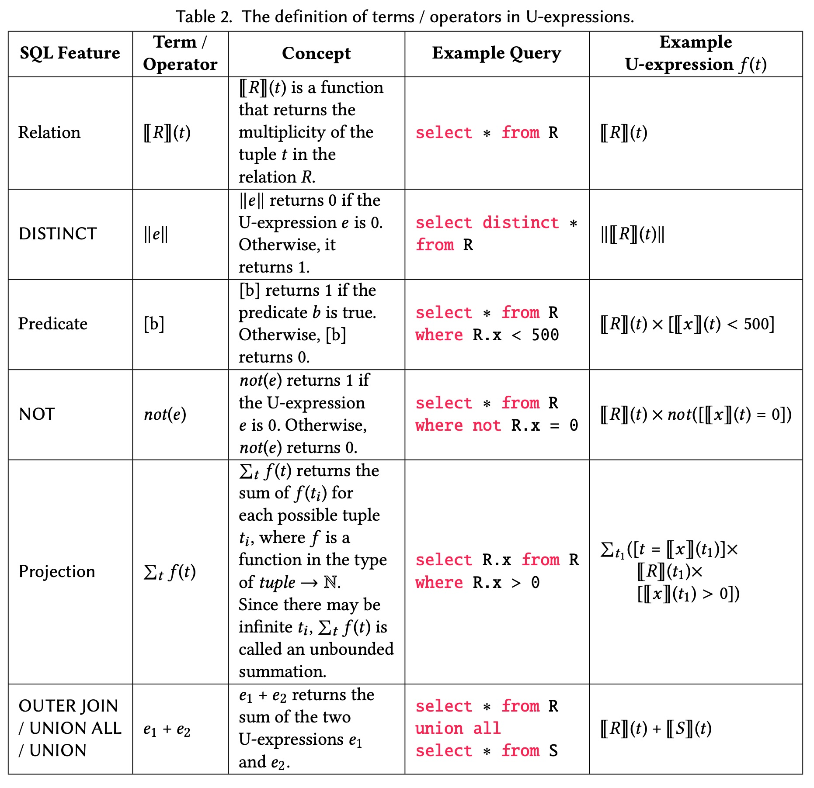
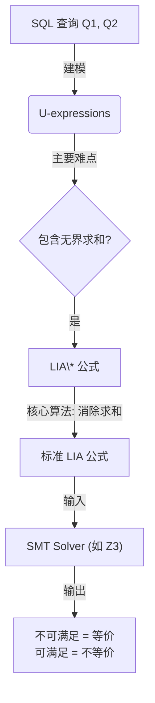
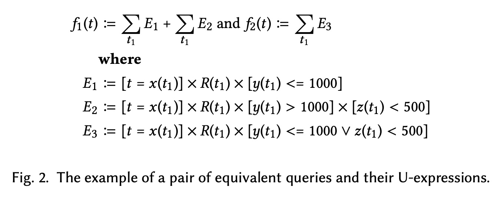
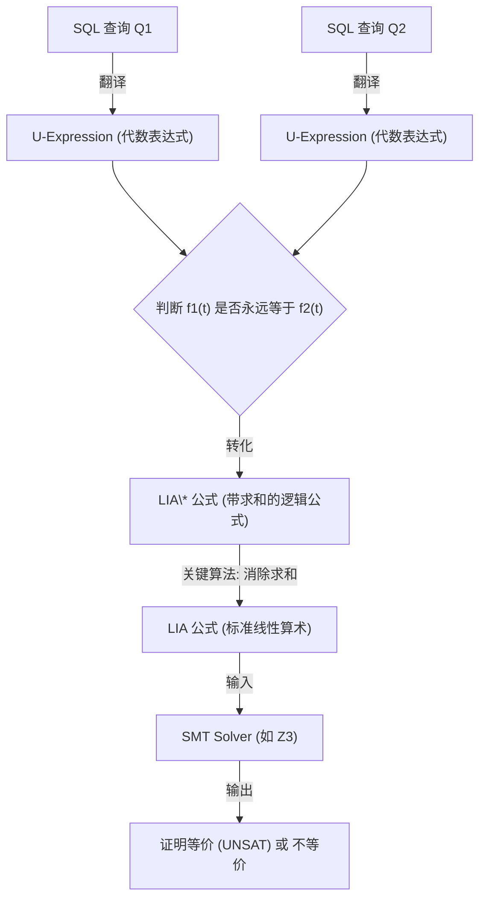
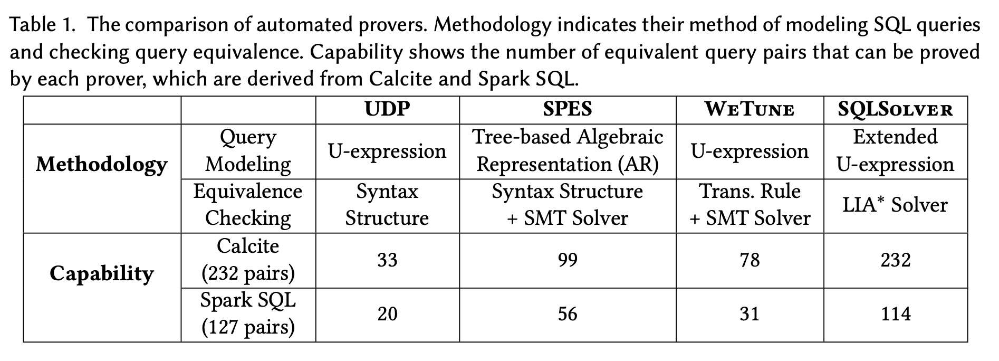
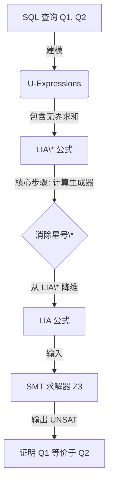

## AI论文解读 | Proving Query Equivalence Using Linear Integer Arithmetic
        
### 作者        
digoal        
        
### 日期        
2025-12-07        
        
### 标签        
PostgreSQL , PolarDB , DuckDB , AI , 论文解读        
        
----        
        
## 背景  
      
https://par.nsf.gov/servlets/purl/10548354        
  
提示:          
```          
读懂《Proving Query Equivalence Using Linear Integer Arithmetic》这篇论文需要提前掌握哪些基础知识, 请使用中文通熟易懂的讲解这些基础知识, 可以引用论文中的图、表或使用Markdown支持的图形(text,mermaid等)增加解释性. 
  
使用中文通熟易懂的解读《Proving Query Equivalence Using Linear Integer Arithmetic》这篇论文, 其中的关键内容请着重讲解, 可以引用论文中的图、表或使用Markdown支持的图形(text,mermaid等)增加解释性. 
  
提取《Proving Query Equivalence Using Linear Integer Arithmetic》这篇论文中的重要术语, 使用中文对这些术语进行通熟易懂的讲解, 可以引用论文中的图、表或使用Markdown支持的图形(text,mermaid等)增加解释性. 
```     
  
## 1 前置知识 
  
要深入理解《Proving Query Equivalence Using Linear Integer Arithmetic》（即 **SQLSolver**）这篇论文，你需要建立一个从**数据库理论**到**形式化验证**的知识金字塔。这篇论文的核心突破在于如何将复杂的 SQL 查询（特别是包含聚合函数的）转化为数学公式，并证明它们是等价的。

以下是阅读该论文前需要掌握的 4 个核心基础知识模块，我尽量用通俗的语言配合图表来解释。

-----

### 1\. SQL 语义：包语义 vs. 集合语义 (Bag vs. Set Semantics)

这是理解论文前提的关键。

  * **集合语义 (Set Semantics)** ：在数学集合中，元素是唯一的。例如 `{1, 1, 2}` 等同于 `{1, 2}`。
  * **包语义 (Bag Semantics / Multiset)** ：在 SQL 中，默认情况（不加 `DISTINCT`）是允许重复数据的。`{1, 1, 2}` 和 `{1, 2}` 是不一样的结果。

**为什么这很重要？**
论文提到现有的很多工具只能处理集合语义，或者在处理包语义时能力有限 。**SQLSolver** 的目标是精确处理**包语义**，这意味着它不仅要看“有没有这个数据”，还要算清楚“这个数据出现了几次”。

> **通俗理解**：
> 以前的工具只在乎“你有没有考及格”（集合语义）；这篇论文的工具在乎“你到底考了多少分”（包语义，关注具体的数量/多重性）。

-----

### 2\. U-表达式 (U-expressions)

这是论文将 SQL 代码转化为数学公式的“中间语言”。如果你看不懂 U-表达式，就无法理解论文的第 3、4 章节。

  * **定义**：U-expression 是一个函数 $f(t)$ ，它的返回值是一个整数，表示元组 $t$ 在查询结果中出现的次数（即多重性）。
  * **核心组件**：论文中的 **Table 2** 是理解这个概念的字典，建议对照阅读。    

**[Table 2: U-expression 速查表]** 

| SQL 特性 | U-expression 符号 | 通俗解释 |
| :--- | :--- | :--- |
| **基础表** | `[[R]](t)` | 在表 R 中，数据行 t 出现了几次？ |
| **过滤 (Where)** | $[b]$ | 如果条件 b 成立，结果是 1，否则是 0。 |
| **投影 (Select)** | $\Sigma_{t}f(t)$ | **核心难点**：这是“无界求和”。因为投影可能会把多行数据合并（比如只选一列），所以需要把所有相关来源行的出现次数加起来。 |
| **联合 (Union All)** | $e_1 + e_2$ | 出现的次数相加。 |
| **去重 (Distinct)** | $\|\|e\|\|$ | 如果次数 \> 0，则变成 1，否则是 0（压扁操作）。 |

**例子**：
查询 `SELECT x FROM R WHERE x > 0` 的 U-expression 是：
$$f(t) := \sum_{t_1} (R(t_1) \times [x(t_1) > 0] \times [t = x(t_1)])$$


> **解释**：在这个公式里，我们遍历原表 R 的每一行 $t_1$ （ 求和符号 $\Sigma$ ），如果这一行 $x>0$ （条件为 1）且投影出的值等于我们需要的值 $t$ ，我们就把它的出现次数加进去。

-----

### 3\. 线性整数算术 (LIA) 与 LIA\*

这是论文用来解题的“数学工具”。

#### (1) 线性整数算术 (Linear Integer Arithmetic, LIA)

这是逻辑学的一个分支。

  * **线性**：只有加法、减法，或者变量乘以常数（ 例如 $3x + 2y = 10$ ）。**不允许**变量乘以变量（例如 $x \times y$ ，这是非线性的）。
  * **整数**：所有的变量 $x, y$ 只能是整数。

#### (2) 带星号的 LIA (LIA\*)

这是本论文引用的核心理论 。

  * **问题**：标准的 LIA 只能处理固定数量的变量。但是 SQL 中的聚合函数（如 `SUM`, `COUNT`）是对表中的**任意多行**数据进行计算，这个数量是未知的（Unbounded）。
  * **LIA\* (LIA with Stars)** ：它引入了一个“闭包算子 (Star Operator)”，允许表示“对一组满足条件的向量进行任意次求和” 。

**Mermaid 流程图：论文的核心转换逻辑**



> **通俗理解**：  
>  
>   * **LIA** 就像解普通方程组。  
>   * **LIA**\* 就像解包含“ 求和符号 $\Sigma$ ”且项数未知的方程组。  
>     * 论文的贡献在于找到了一种方法，把复杂的 **LIA**\* 问题（难解）转化回了普通的 **LIA** 问题（好解） 。   

-----

### 4\. SMT Solver (可满足性模理论求解器)

这是论文使用的“计算器”。

  * **它做什么**：你给它一个逻辑公式（ 比如 $x > 5 \land x < 3$ ），它会告诉你这个公式是否有解（Satisfiable）还是无解（Unsatisfiable）。
  * **在论文中的作用**：
    要证明查询 $Q1$ 和 $Q2$ 等价，也就是证明它们的结果出现的次数永远相同： $f_1(t) = f_2(t)$ 。
    反过来，如果我们要证明它们等价，只需要证明“它们**不等**（ $f_1(t) \neq f_2(t)$ ）是**不可能的**（Unsatisfiable）” 。

**总结：阅读顺序建议**

1.  先理解 **Table 2** ，弄懂 SQL 是怎么变成带有 $\Sigma$ 的公式的。    
2.  关注论文 **Figure 2** ，看懂一个具体的例子：两个写法不同但结果相同的 SQL，它们的 U-expression 长什么样。    
3.  重点阅读 **4.1 和 4.2 节**，理解如何把带有 $\Sigma$ 的公式（LIA\*）变成没有 $\Sigma$ 的普通公式（LIA）。这就是论文标题中 "Using Linear Integer Arithmetic" 的真谛。
  
## 2 解读论文 
  
这篇论文《Proving Query Equivalence Using Linear Integer Arithmetic》（使用线性整数算术证明查询等价性）介绍了一个名为 **SQLSolver** 的工具。它的核心目标是解决数据库领域的一个经典难题： **如何自动证明两个复杂的 SQL 查询在语义上是完全等价的？**

这个问题对于数据库查询优化（Query Optimization）至关重要，因为优化器需要将慢查询重写为快查询，同时保证结果不变。

以下是对这篇论文的通俗解读：

-----

### 1\. 核心问题：为什么这很难？

在简单的 SQL 中，判断等价性很容易。但在处理包含 **投影 (Projection)** 和 **聚合函数 (Aggregation, 如 SUM/COUNT)** 的查询时，问题变得非常复杂。

  * **无界求和 (Unbounded Summations)** ：这是论文提到的最大挑战 。例如，`SELECT sum(x) FROM table` 需要对表中未知数量的行进行求和。
  * **现有工具的局限**：
      * **UDP 和 SPES**（基于语法的工具）：它们试图把查询“标准化”然后比较结构。如果两个查询写法差异太大（例如一个用了 `UNION`，另一个没用），它们就无法识别 。
      * **WeTune**（基于语义的工具）：虽然它尝试转换成逻辑公式，但无法很好地处理复杂的“无界求和”情况，只能依靠一些启发式规则（Heuristics），能力有限 。

### 2\. 解决方案：SQLSolver

**SQLSolver** 的核心洞察是利用数学逻辑中的 **LIA (Linear Integer Arithmetic, 线性整数算术)** 理论 。

#### 核心流程图解

论文的工作流程可以简化为以下步骤：



#### 关键技术点 1：U-Expression (U-表达式)

首先，SQLSolver 将 SQL 查询转换成一种数学表达式，称为 **U-Expression**。

  * **定义**：这是一个函数 $f(t)$ ，它计算元组 $t$ 在查询结果中出现了几次（即多重性，Bag Semantics）。
  * **例子**：
      * `SELECT * FROM R` 对应 $R(t)$ 。  
      * `SELECT distinct * FROM R` 对应 $||R(t)||$ （把次数压扁为 0 或 1）。  
      * `UNION ALL` 对应加法 $+$ 。  

论文中的 **Table 2** 展示了这种映射关系：    

| SQL 特征 | U-Expression 对应项 | 含义 |
| :--- | :--- | :--- |
| **关系表** | `[[R]](t)` | 返回元组 t 在表 R 中出现的次数 。 |
| **过滤 (Where)** | $[b]$ | 如果条件 b 为真返回 1，否则返回 0 。 |
| **投影/聚合** | $\Sigma_{t} f(t)$ | **无界求和**：把所有可能的来源元组产生的贡献加起来 。 |

#### 关键技术点 2：从 LIA\* 到 LIA

这是论文最硬核的部分。

  * **LIA**\*：包含“无界求和”（用星号 $*$ 表示闭包算子）的公式。它可以表达“对任意多行数据求和” 。
  * **转化**：直接解 LIA\* 很难。SQLSolver 利用现有理论，将 LIA\* 公式转化为等价的 **LIA** 公式（去掉了星号/无限求和，变成了有限的变量关系）。

> **通俗比喻**：  
> LIA\* 就像在问：“不管班里有多少学生（未知数量），他们的总分是否等于平均分乘以人数？”  
> SQLSolver 将其转化为 LIA：“只需要检查这种特定的数字关系（分数、平均值、人数）在数学上是否成立，而不需要模拟无限个学生的情况。”  

-----

### 3\. 主要创新：攻克复杂场景

为了让工具实用，SQLSolver 必须处理标准理论处理不了的“脏活累活”。论文详细介绍了三种特殊情况的处理：

#### A. 嵌套求和 (Nested Summations)

  * **场景**：子查询，例如 `SELECT count(*) FROM (SELECT sum(x) ...)`。
  * **处理**：递归处理。先把内部的求和转化成变量，像剥洋葱一样一层层向外转化 。

#### B. 参数化求和 (Parameterized Summations)

  * **场景**：求和内部引用了外部变量。例如 `SELECT ... WHERE R.x > S.y`，这里的求和依赖于外部的 `S.y`。
  * **处理**：将公式“解耦”（Decouple）。把依赖外部变量的部分（谓词）分离出来单独处理，剩下的部分作为标准的 LIA\* 处理 。

#### C. 非线性求和 (Non-linear Summations)

  * **场景**：变量相乘。例如 `JOIN` 操作或 `INTERSECT` 操作会导致两个表的出现次数相乘（ $R(t) \times S(t)$ ）。标准 LIA 不允许变量相乘 。
  * **处理**： **过近似 (Over-approximation)** 。
      * 如果不允许 $x \times y$ ，工具会引入一个新变量 $z$ 来代表乘积结果。
      * 并添加约束：当且仅当 $x$ 或 $y$ 为 0 时， $z$ 为 0。
      * **逻辑**：如果在这个宽松的约束下都能证明查询等价（公式不可满足），那么原查询一定等价 。

-----

### 4\. 扩展功能：聚合函数与排序

#### 具体的聚合函数 (Concrete Aggregate Functions)

以前的工具通常把 `SUM`, `MAX` 当作黑盒。SQLSolver 深入模拟了它们的语义。

  * **MAX/MIN**：不直接算值，而是转化为逻辑属性——“没有其他行比这个值更大”且“至少有一行等于这个值” 。
  * **AVG**：转化为 `SUM = COUNT * AVG` 的关系来验证 。

#### 排序 (ORDER BY)

U-Expression 基于“包语义”（Bag Semantics），只管元素出现几次，不管顺序。但 SQL 中 `ORDER BY` 很常见。

  * **策略**：分而治之 (Divide and Conquer)。
  * **方法**：
    1.  如果两个查询都有 `ORDER BY`，先检查它们排序的依据是否一致。
    2.  如果一致，把 `ORDER BY` 拿掉，检查剩下的子查询是否等价（回归到包语义问题） 。

-----

### 5\. 实验结果：吊打同行

论文使用了来自 **Calcite** 和 **Spark SQL** 的数百个等价查询对进行测试。

  * **能力对比**：
      * **Calcite 测试集**：232 对查询。SQLSolver 证明了 **232 对 (100%)** 。相比之下，WeTune 只证明了 78 对，UDP 33 对 。
      * **Spark SQL 测试集**：127 对查询。SQLSolver 证明了 **114 对**。其他工具表现最好的也只能证明一半左右 。

下表总结了各工具的能力对比（基于论文 Table 1）：    

| 工具 | 方法论 | Calcite (232对) | Spark SQL (127对) |
| :--- | :--- | :--- | :--- |
| **UDP** | 语法结构对比 | 33 | 20 |
| **SPES** | 语法结构 + SMT | 99 | 56 |
| **WeTune** | 语义转化规则 | 78 | 31 |
| **SQLSolver** | **语义 (LIA\* Solver)** | **232** | **114** |

### 总结

**SQLSolver** 的核心贡献在于它没有依赖脆弱的语法规则，而是建立了一套严谨的**数学转化路径**：
`SQL -> 多重性函数 (U-Expr) -> 带求和算术逻辑 (LIA*) -> 线性算术逻辑 (LIA)`。
这种方法让它能够处理以前无法自动证明的复杂 SQL 变换，特别是涉及子查询、聚合函数和数值计算的场景。
  
## 3 术语 
  
这篇论文《Proving Query Equivalence Using Linear Integer Arithmetic》引入了一套将 SQL 查询转化为数学公式并证明其等价性的方法。为了读懂它，我们需要理解以下几个核心术语。

我将这些术语分为**基础语义**、**核心模型**和**数学工具**三个部分进行解读。

-----

### 第一部分：基础语义与模型

#### 1\. 包语义 (Bag Semantics)

  * **定义**：在数据库查询中，允许结果中出现重复的行（元组）。这与“集合语义”（Set Semantics，元素唯一）相对 。
  * **通俗解读**：
      * **集合语义**像是一个“签到表”，只关心你**来没来**（存在性）。
      * **包语义**像是一个“购物车”，不仅关心你买了苹果，还关心你买了**几个**苹果（多重性）。
  * **论文中的作用**：现有的很多工具只能处理“签到表”问题，而 SQLSolver 能精准处理“购物车”问题，计算每个数据出现的具体次数。

#### 2\. U-表达式 (U-expressions)

  * **定义**：一种代数表达式，用来对 SQL 查询进行建模。给定一个元组 $t$ ，U-表达式 $f(t)$ 返回一个整数，表示 $t$ 在查询结果中出现的次数 。
  * **关键符号**（参考论文 Table 2 ）：    
      * **`[[R]](t)`**：基础表 R 中元组 t 的数量。
      * **$[b]$**：如果条件 b 成立，值为 1，否则为 0。
      * **$||e||$**： **Squash 操作**。模拟 `DISTINCT`。如果 $e > 0$ ，结果为 1，否则为 0 。
      * **$\Sigma$**：求和符号，模拟投影（Projection）或聚合。

> **图解 U-Expression**  
> 假设查询是 `SELECT x FROM R WHERE x > 0`  
>  
> $$f(t) = \sum_{t_1} ( R(t_1) \times [x(t_1) > 0] \times [t = x(t_1)] )$$  
>
>   * **翻译成白话**：我们要算结果 $t$ 出现了几次？  
>     1.  遍历表 R 的每一行 $t_1$ （ $\Sigma$ 求和 ）。  
>     2.  看这一行是否存在 ( $R(t_1)$ )。  
>     3.  看它是否大于 0 ( $[x > 0]$ )。  
>     4.  看它的 x 值是不是等于我们要找的 $t$ 。  
>     5.  把所有符合条件的次数加起来。  

#### 3\. 无界求和 (Unbounded Summations)

  * **定义**：指 U-表达式中对无限域或未知数量的元组进行的求和操作（即 $\Sigma$ 符号）。
  * **为什么难**：因为数据库表的大小是不确定的（Unbounded）。传统的求解器（SMT Solver）喜欢固定的公式，不喜欢“对未知数量的项求和”这种模糊的指令。这是现有工具（如 WeTune）失败的主要原因 。
  * **论文突破**：SQLSolver 找到了一种原则性的方法来消除这些求和符号 。

-----

### 第二部分：核心数学工具 (LIA 系列)

这是论文用来解题的“引擎”。

#### 4\. LIA (Linear Integer Arithmetic, 线性整数算术)

  * **定义**：一种一阶逻辑公式，只允许整数变量进行加法、减法、常数乘法以及比较大小（ $=, <$ ） 。
  * **特点**：不允许变量乘以变量（非线性）。现有的 SMT 求解器（如 Z3）非常擅长解 LIA 问题。

#### 5\. LIA\* (LIA with Stars, 带星号的 LIA)

  * **定义**：LIA 的扩展版本，增加了一个**加法闭包算子 (Additive Closure Operator)** ，用星号 $*$ 表示 。
  * **公式**： $\vec{v} \in \{\vec{x} | F(\vec{x})\}^*$
  * **通俗解读**：
      * LIA 只能描述“买 3 个苹果和 2 个香蕉”。
      * LIA\* 可以描述“从一个允许的水果清单里（比如只能买苹果或香蕉），**任意**挑选**任意**数量的水果组合在一起”。
      * 这个 $*$ 完美对应了 SQL 中的“无界求和”——把任意多行符合条件的数据加在一起。

#### 6\. 生成器 (Generators)

  * **定义**：给定一个 LIA 公式，生成器是一组基础向量，任何满足该公式的解都可以表示为这些生成器的线性组合 。
  * **作用**：它是将 **LIA**\* 降维打击成 **LIA** 的关键。
      * 如果我们找到了“生成器”，我们就不再需要处理那个复杂的“无界求和”符号，只需要说“结果是由这些生成器组合出来的”。
      * 论文使用**近似方法 (Approximation-based method)** 来计算生成器 。

-----

### 第三部分：高级处理策略

#### 7\. 嵌套求和 (Nested Summations)

  * **场景**：当 SQL 中有子查询时，U-表达式里会出现 $\Sigma$ 套着 $\Sigma$ 的情况 。
  * **处理**： **递归消除**。像剥洋葱一样，先用变量替换掉最里面的求和，把它变成一个 LIA\* 公式，解出来后再处理外层 。

#### 8\. 参数化求和 (Parameterized Summations)

  * **场景**：求和内部引用了外部的变量（Free variables）。例如 `SELECT ... WHERE a.x = b.y` 。
  * **处理**： **解耦 (Decoupling)** 。
      * 利用定理将公式拆成两部分：一部分是纯粹的 LIA\*（不含参数），另一部分是包含参数的逻辑判断。
      * 分别求解，最后合并 。

#### 9\. 过近似 (Over-approximation)

  * **场景**：处理**非线性操作**（ 如两个变量相乘 $x \times y$ ），常见于 `JOIN` 或 `INTERSECT` 。
  * **定义**：如果直接解很难，就构造一个更宽松的条件（即“过近似”）。
  * **逻辑**：如果在这个“宽松”的条件下都证明是“不可满足的”（即两个查询不可能不等价），那么在原条件下肯定也是“不可满足的” 。
  * **通俗解读**：
      * 你想证明“小明考不到 100 分”。
      * 精确算分很难（非线性）。
      * 你放宽条件：“假设这道难题全班都做对了，小明能考 100 吗？”
      * 如果即便在这么宽松的条件下，算出小明最高也只能得 98 分，那你就能自信地证明“小明考不到 100 分”。

-----

### 总结：SQLSolver 的工作流

结合上述术语，我们可以画出 SQLSolver 的核心工作流程：



通过这套流程，SQLSolver 成功地将复杂的 SQL 语义问题（Bag Semantics, Unbounded Summation）转化为了成熟的数学求解问题（LIA），从而证明了其他工具无法证明的等价关系。
  
## 参考        
         
https://par.nsf.gov/servlets/purl/10548354    
        
<b> 以上内容基于DeepSeek、Qwen、Gemini及诸多AI生成, 轻微人工调整, 感谢杭州深度求索人工智能、阿里云、Google等公司. </b>        
        
<b> AI 生成的内容请自行辨别正确性, 当然也多了些许踩坑的乐趣, 毕竟冒险是每个男人的天性.  </b>        
  
    
#### [PolarDB 学习图谱](https://www.aliyun.com/database/openpolardb/activity "8642f60e04ed0c814bf9cb9677976bd4")
  
  
#### [PostgreSQL 解决方案集合](../201706/20170601_02.md "40cff096e9ed7122c512b35d8561d9c8")
  
  
#### [德哥 / digoal's Github - 公益是一辈子的事.](https://github.com/digoal/blog/blob/master/README.md "22709685feb7cab07d30f30387f0a9ae")
  
  
#### [About 德哥](https://github.com/digoal/blog/blob/master/me/readme.md "a37735981e7704886ffd590565582dd0")
  
  

  
