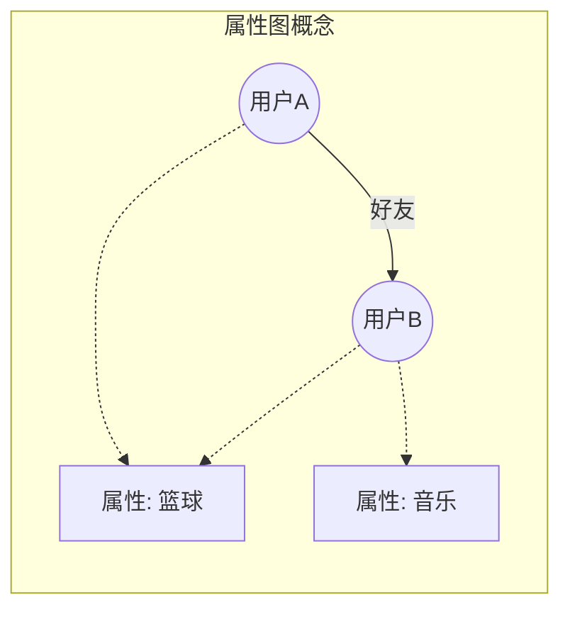
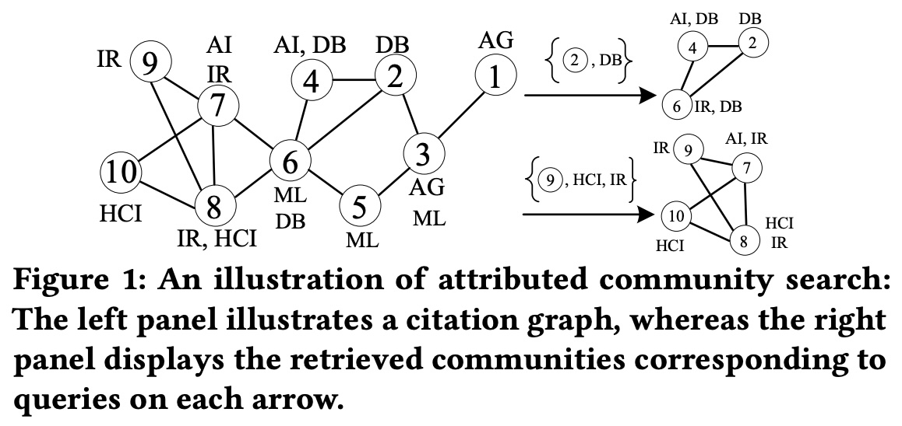
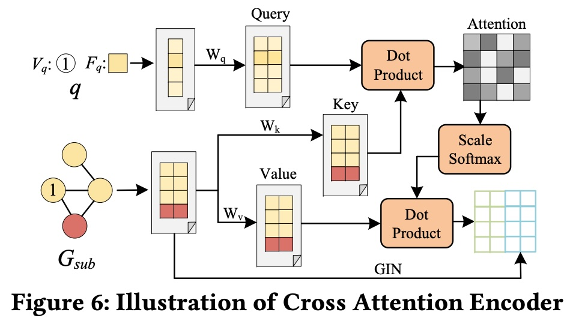
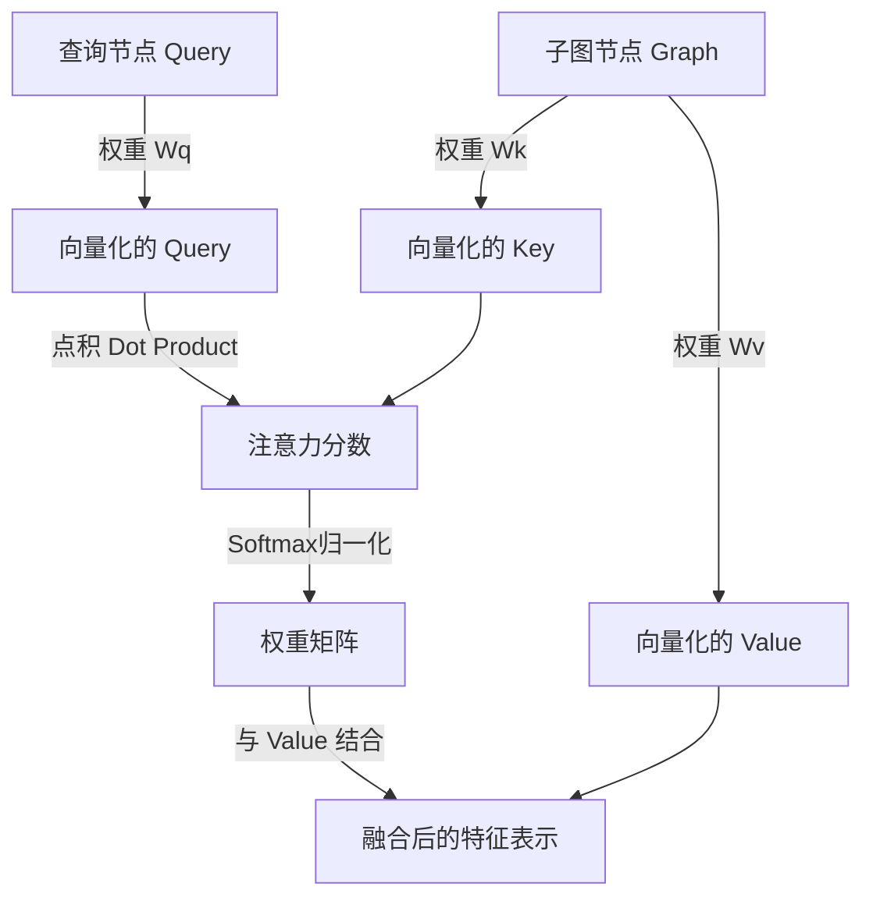
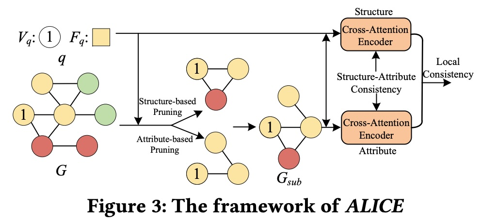
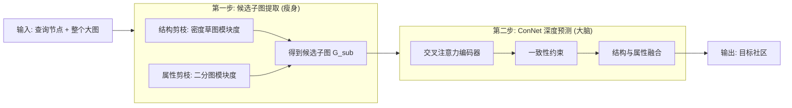
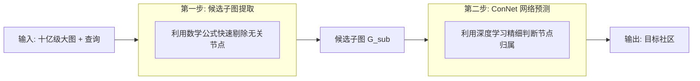
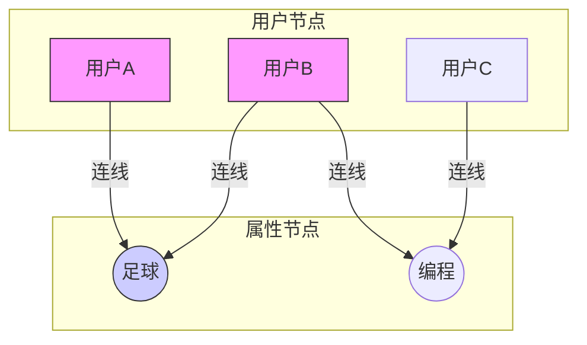

## AI论文解读 | Neural Attributed Community Search at Billion Scale
        
### 作者        
digoal        
        
### 日期        
2025-12-07        
        
### 标签        
PostgreSQL , PolarDB , DuckDB , AI , 论文解读        
        
----        
        
## 背景  
      
https://arxiv.org/pdf/2403.18874        
  
提示:          
```          
读懂《Neural Attributed Community Search at Billion Scale》这篇论文需要提前掌握哪些基础知识, 请使用中文通熟易懂的讲解这些基础知识, 可以引用论文中的图、表或使用Markdown支持的图形(text,mermaid等)增加解释性. 
  
使用中文通熟易懂的解读《Neural Attributed Community Search at Billion Scale》这篇论文, 其中的关键内容请着重讲解, 可以引用论文中的图、表或使用Markdown支持的图形(text,mermaid等)增加解释性. 
  
提取《Neural Attributed Community Search at Billion Scale》这篇论文中的重要术语, 使用中文对这些术语进行通熟易懂的讲解, 可以引用论文中的图、表或使用Markdown支持的图形(text,mermaid等)增加解释性. 
```     
  
## 1 前置知识 
  
要读懂这篇题为《Neural Attributed Community Search at Billion Scale (ALICE)》的论文，你需要掌握以下几个核心领域的某些基础概念。为了帮助你理解，我将把这些概念拆解为通俗易懂的解释，并结合图表说明。

### 1\. 属性图 (Attributed Graph) 与 二分图 (Bipartite Graph)

**基础概念：**

  * **属性图**：想象一个社交网络。
      * **节点 ( Node, $V$ )** ：代表用户。
      * **边 ( Edge, $E$ )** ：代表用户之间的关注或好友关系。
      * **属性 ( Attribute, $F$ )** ：每个用户身上的标签（如“喜欢篮球”、“程序员”、“住在上海”）。
      * 论文定义：图 $G(V, E, F)$ ，其中 $V$ 是节点， $E$ 是边， $F$ 是属性集合 。
  * **二分图**：这是一种特殊的图，节点分为两类（比如“人”和“兴趣”），连线只存在于不同类之间。
      * **论文中的应用**：为了处理属性，论文构建了一个“节点-属性二分图” 。即一边是图中的节点，另一边是属性节点，如果某人拥有某属性，就连一条线。

**图解 (Mermaid):**



### 2\. 社区搜索 (Community Search, CS) 与 属性社区搜索 (ACS)

**基础概念：**

  * **社区搜索 (CS)** ：在一个大图中，给定一个或几个**查询节点 (Query Nodes)** ，目标是找到包含这些节点的“小圈子”。这个圈子里的节点连接非常紧密 。
  * **属性社区搜索 (ACS)** ：这比普通的社区搜索更难。它要求找到的社区不仅结构紧密（大家互为好友），而且**属性相似**（大家有共同语言/标签）。
      * **例子**：如果你查询“张三”，CS 可能会找出他的家人和同事；但 ACS（如果我们指定属性“篮球”）只会找出他的球友。

**论文中的图示解释：**
论文图 1 展示了这一概念 。左边是引文网络，右边是根据不同查询（Query）找出的不同社区（如 AI 社区、DB 数据库社区）。

  

### 3\. 模块度 (Modularity)

**基础概念：**
这是衡量一个社区“抱团”程度的数学指标。

  * **通俗解释**：一个好的社区，内部的连线应该比随机瞎连的连线多得多。模块度越高，说明社区划分得越好，内部越紧密 。
  * **论文的改进**：传统的模块度有缺陷（比如会把不相关的人拉进来，称为“搭便车效应” ）。论文提出了一种新的**Density Sketch Modularity (密度草图模块度)** ，旨在更精准地筛选出紧密的候选子图，以此来“剪枝”（去掉不重要的节点，缩小搜索范围）。

### 4\. 图神经网络 (Graph Neural Networks, GNNs)

**基础概念：**
GNN 是深度学习在图数据上的应用。

  * **核心逻辑 - 消息传递 (Message Passing)** ：每个节点会收集邻居的信息来更新自己的特征。
      * 公式逻辑：你的特征 = (你现在的特征 + 你所有邻居特征的聚合) 。
  * **作用**：将复杂的图结构转化成计算机能理解的**向量 (Embeddings)** 。
  * **论文中的应用**：论文使用 GNN 来学习节点之间复杂的交互关系，而不仅仅是看它们连没连线 。

### 5\. 注意力机制 (Attention Mechanism) 与 Cross-Attention

**基础概念：**

  * **注意力机制**：模仿人类视觉，只关注重要的部分。在算法中，就是给不同的输入分配不同的权重。
  * **查询-键-值 (Query-Key-Value, QKV)** ：这是注意力机制的核心模型 。
      * **Query (查询)** ：你想要找什么？
      * **Key (键)** ：数据的索引或特征。
      * **Value (值)** ：数据的具体内容。
      * **过程**：看 Query 和 Key 的匹配度（相似度），匹配度越高，取出的 Value 权重越大。
  * **论文中的 Cross-Attention**：论文使用“交叉注意力”来处理**查询节点**和**全图节点**的关系。它计算查询节点（Query）与图中其他节点（Key）的关联度，从而更好地捕捉它们之间的互动 。

**图解 Cross-Attention (基于论文 Figure 6 ):**    



### 6\. 一致性学习与 Wasserstein 距离

**基础概念：**

  * **结构-属性一致性 (Structure-Attribute Consistency)** ：在图中，一个人的社交关系（结构）和他的标签（属性）通常是相关的。算法希望学到的“结构特征”和“属性特征”在数学空间里是接近的 。
  * **Wasserstein 距离 (推土机距离)** ：
      * **通俗解释**：这是一种衡量两个分布（两堆土）之间差异的方法。它的物理含义是：把一堆土推成另一堆土的形状，所需要花费的最小“功”（土量 × 距离）。
      * **论文用途**：论文用它来拉近“结构特征分布”和“属性特征分布”，让模型理解这两者的一致性 。

### 总结：ALICE 模型的逻辑流

读这篇论文时，你可以把整个流程看作两个阶段（如图 3 所示 ）：    

1.  **海选阶段 (Candidate Subgraph Extraction)** ：
      * 利用**模块度**知识，快速从十亿级大图中圈出一小块最有可能包含目标的“候选子图”，这就好比警察办案先划定嫌疑人范围 。
2.  **精选阶段 (ConNet)** ：
      * 在这个小范围内，利用 **GNN** 和 **Cross-Attention** 深入分析。
      * 同时使用 **Wasserstein 距离** 确保找到的人既在关系网中（结构），又符合特征描述（属性）。

理解了以上六点，你就可以顺畅地阅读这篇关于大规模属性社区搜索的论文了。
  
## 2 解读论文 
  
这篇论文介绍了一个名为 **ALICE** 的模型，旨在解决 **十亿级（Billion-scale）** 大图上的 **属性社区搜索（Attributed Community Search, ACS）** 问题 。

简单来说，这是一个在大数据海洋中“大海捞针”的技术：给定一个查询（比如某个用户和几个兴趣标签），在包含数十亿用户和关系的社交网络中，精准且快速地找到与该用户关系紧密、且兴趣相投的那个“小圈子” 。

以下是对论文核心内容的通俗解读：

-----

### 1\. 为什么要做这项研究？（背景与挑战）

现有的方法（特别是基于图神经网络 GNN 的方法，如 AQD-GNN）虽然准确，但在面对超大规模数据时有两个致命弱点：

1.  **太慢了（效率问题）** ：它们往往需要把整张图输入模型，或者针对每个新查询重新训练模型。在十亿级图上，这会让内存爆炸或耗时过长 。
2.  **太孤立了（交互问题）** ：它们通常把问题简单看作“节点分类”（这个节点是社区成员吗？），忽略了查询节点与图的深层互动，也忽略了结构（关系）和属性（兴趣）之间的一致性 。

**ALICE 的解决方案**是采用“两步走”策略：先**粗选**（缩小范围），再**精选**（深度预测） 。

-----

### 2\. 核心架构：ALICE 的“两步走”策略

为了让大家直观理解，我们可以用下图表示 ALICE 的工作流程：



#### 第一步：候选子图提取 (Candidate Subgraph Extraction) —— 极速瘦身

面对十亿级节点，直接上深度学习是不现实的。ALICE 的第一步是**自适应地**把搜索范围从全图缩小到一个极小的“候选子图” 。

**关键技术 1：密度草图模块度 (Density Sketch Modularity, DSM)**

  * **问题**：传统的筛选标准（模块度）要么太宽泛，把不相关的人拉进来（“搭便车效应”）；要么太严格，漏掉潜在成员 。
  * **创新**：论文设计了 DSM，这是一个平衡指标。它结合了传统模块度和密度模块度的优点。
  * **操作**：从查询节点开始，一圈圈向外（k-hop）探索。计算每一层的 DSM 分数，分数最高的那一层就是最完美的候选边界。这样就不需要人为设定必须查几层邻居了 。

**关键技术 2：基于属性的二分图剪枝**

  * **操作**：构建一个“节点-属性”二分图（一边是人，一边是属性标签）。通过计算二分图的模块度，把那些虽然关系不直接、但属性高度相关的节点也捞回来 。

> **效果**：这个步骤能极大减少计算量。例如在 Orkut 数据集（300万节点）上，只需要保留不到 **1%** 的节点进入下一阶段 。

-----

#### 第二步：一致性感知网络 (ConNet) —— 精准识别

拿到缩小的候选子图后，ConNet 负责精细地判断哪些节点真正属于社区。

**关键技术 3：交叉注意力编码器 (Cross-Attention Encoder)**

  * **原理**：不仅看图，更看“查询”与“图”的化学反应。
  * **类比**：就像搜索引擎。它不是单独分析所有的网页，而是计算“搜索词（Query）”和“网页内容（Key/Value）”之间的匹配度 。
  * **实现**：ALICE 设计了一个交叉注意力机制，分别处理结构（社交关系）和属性（特征），让查询节点的信息深度引导图的特征学习 。

**关键技术 4：双重一致性约束 (Two Consistency Constraints)**
为了训练出更好的模型，ALICE 引入了两个“指导老师”（损失函数）：

1.  **结构-属性一致性 (Structure-Attribute Consistency)** ：
      * **理念**：一个人的社交圈子（结构）和他的个人标签（属性）应该是一致的。
      * **方法**：使用 **Wasserstein 距离**（一种衡量两个分布差异的高级数学工具）。它强制让模型学到的“结构特征分布”和“属性特征分布”在空间上尽可能重合 。
2.  **局部一致性 (Local Consistency)** ：
      * **理念**：社区是抱团的。如果我是社区成员，我的邻居大概率也是。
      * **方法**：通过预测节点间的连边关系，强化邻居节点预测结果的一致性 。

-----

### 3\. 实验结果：真的更强吗？

论文在 11 个数据集上进行了测试，包括拥有 **6500 万节点、18 亿条边** 的 Friendster 巨型图 。

  * **准确率 (Accuracy)** ：
      * 在 F1-score 指标上，ALICE 比目前最先进的 AQD-GNN 平均提高了 **10.18%** 。
      * 下图展示了 ALICE (绿色) 在不同数据集上相比其他方法的优势：

| 模型 | F1-score 表现 | 备注 |
| :--- | :--- | :--- |
| 非学习型 (ACQ, ATC) | 较低 | 依赖固定的结构规则，不够灵活  |
| 现有学习型 (AQD-GNN) | 较高 | 但受限于计算瓶颈和简单的融合方式  |
| **ALICE** | **最高** | **结构属性双修，且使用了高级的一致性约束** |

  * **效率与可扩展性 (Efficiency & Scalability)** ：
      * 在 Reddit, Orkut 和 Friendster 这种大图上，AQD-GNN 经常因为内存不足（OOM）无法运行，而 ALICE 可以顺利在合理时间内完成训练 。
      * ALICE 的时间成本随节点/边增加的增长速度远低于对比算法 。

### 4\. 总结

ALICE 的成功秘诀在于：

1.  **不蛮干**：先用创新的 **DSM 模块度** 把大图切成小图，解决了“十亿级”的计算难题。
2.  **懂关联**：利用 **Cross-Attention** 和 **Wasserstein 距离**，深刻理解了“查询-图”、“结构-属性”之间复杂的相互依赖关系 。

这是一篇将传统图论指标（模块度）与现代深度学习（GNN, Attention）完美结合的范例。
  
## 3 术语 
  
这篇论文《Neural Attributed Community Search at Billion Scale》提出了一种名为 **ALICE** 的模型，用于解决超大规模图数据上的社区搜索问题。为了帮助你深入理解，我提取了其中的核心术语，并用通俗的语言配合图表进行解读。

### 1\. 核心问题与框架术语

#### **属性社区搜索 (Attributed Community Search, ACS)**

  * **通俗解释**：
    普通的社区搜索是在社交网络中找一群“互相关注”的人（结构紧密）。而 **ACS** 要求更高，它要找的人不仅要“互相关注”，还要“志同道合”（属性相似）。
      * **例子**：如果你查询“张三”和“编程”，ACS 不会把他那群爱打麻将的亲戚找出来，而是会找出他那群同样爱写代码的同事 。
  * **论文中的定义**：给定一个图 $G$ 和查询 $q$ （包含查询节点和查询属性），目标是找到一个既在结构上紧密连接，又在语义上属性相似的子图 。

#### **ALICE (The Proposed Model)**

  * **通俗解释**：
    这是论文提出的模型名称，全称是 "neur**AL** attr**I**buted **C**ommunity s**E**arch"。它是一个“两步走”的框架：先做减法（缩小范围），再做加法（深度学习预测）。
  * **工作流示意图**：





-----

### 2\. 关键技术术语：第一阶段（筛选）

#### **密度草图模块度 (Density Sketch Modularity, DSM)**

  * **通俗解释**：
    这是一个用来衡量“这个圈子有多紧密”的数学评分标准。
      * **背景**：以前的标准要么太松，容易把不相关的人拉进来（搭便车效应）；要么太严，漏掉潜在的朋友。
      * **创新**：DSM 就像一个可以调节焦距的镜头（ 通过参数 $\tau$ ），能够自适应地找到最合适的圈子大小，既不过大也不过小 。
  * **作用**：ALICE 利用它来决定第一步要圈出多大范围的“候选人” 。

#### **节点-属性二分图 (Node-Attribute Bipartite Graph)**

  * **通俗解释**：
    通常的图是“人连人”。二分图是把“人”和“属性”分在两边。如果张三喜欢足球，张三和“足球”之间就有一条连线。
  * **作用**：
    通过这种图，原本不认识的两个人，如果都连向“足球”这个属性，他们就有了间接联系。ALICE 用这个方法把那些虽然还没加好友、但兴趣高度一致的人也纳入候选范围 。
  * **图示**：





-----

### 3\. 关键技术术语：第二阶段（预测）

#### **ConNet (Consistency-aware Net)**

  * **通俗解释**：
    这是 ALICE 的“大脑”，一个专门设计的图神经网络。它的核心任务是判断候选子图里的每个节点，到底是不是目标社区的一员。它的特点是特别讲究“一致性” 。

#### **交叉注意力编码器 (Cross-Attention Encoder)**

  * **通俗解释**：
    大多数模型是各看各的（分别处理查询和图）。交叉注意力机制就像是让“查询”和“图”互相“对视”。
      * **过程**：查询节点会去“扫描”图中的每一个节点，根据相关性分配注意力（权重）。如果图里的某个节点和查询节点很像，它就会被重点关注 。
      * **论文图示**：论文 Figure 6 展示了 Query（查询）和 Key/Value（图数据）如何通过点积运算交互 。    

#### **结构-属性一致性 (Structure-Attribute Consistency) 与 Wasserstein 距离**

  * **通俗解释**：
      * **一致性**：一个人的社交关系（结构）和他的标签（属性）应该是指向同一个人的。不能说社交关系显示他是程序员，属性标签却显示他是厨师。
      * **Wasserstein 距离**：这是一个数学工具，也叫“推土机距离”。想象有两堆土（结构特征分布 vs 属性特征分布），要把一堆土铲成另一堆土的形状，花力气最小的方案就是这个距离。
      * **ALICE的做法**：强行拉近这两堆土的距离，让模型学到的结构特征和属性特征尽量重合，从而更准确 。

#### **局部一致性 (Local Consistency)**

  * **通俗解释**：
    这是一个“近朱者赤”的约束。如果一个人被预测为社区成员，那么他的邻居大概率也是。ALICE 利用这一点来平滑预测结果，防止出现孤立的预测（比如一群朋友里只有一个被选中） 。

### 总结

这篇论文通过 **DSM** 和 **二分图** 解决了“大图太慢”的问题（候选子图提取），通过 **ConNet** 和 **Wasserstein 距离** 解决了“预测不准”的问题（一致性约束）。这使得它能在 Friendster 这种拥有 18 亿条边的图上运行，而其他先进算法（如 AQD-GNN）会因为内存不足而失败 。
  
## 参考        
         
https://arxiv.org/pdf/2403.18874    
        
<b> 以上内容基于DeepSeek、Qwen、Gemini及诸多AI生成, 轻微人工调整, 感谢杭州深度求索人工智能、阿里云、Google等公司. </b>        
        
<b> AI 生成的内容请自行辨别正确性, 当然也多了些许踩坑的乐趣, 毕竟冒险是每个男人的天性.  </b>        
  
    
#### [PolarDB 学习图谱](https://www.aliyun.com/database/openpolardb/activity "8642f60e04ed0c814bf9cb9677976bd4")
  
  
#### [PostgreSQL 解决方案集合](../201706/20170601_02.md "40cff096e9ed7122c512b35d8561d9c8")
  
  
#### [德哥 / digoal's Github - 公益是一辈子的事.](https://github.com/digoal/blog/blob/master/README.md "22709685feb7cab07d30f30387f0a9ae")
  
  
#### [About 德哥](https://github.com/digoal/blog/blob/master/me/readme.md "a37735981e7704886ffd590565582dd0")
  
  

  
