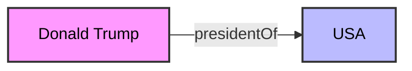
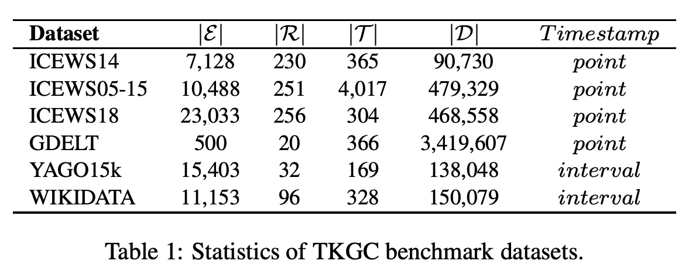
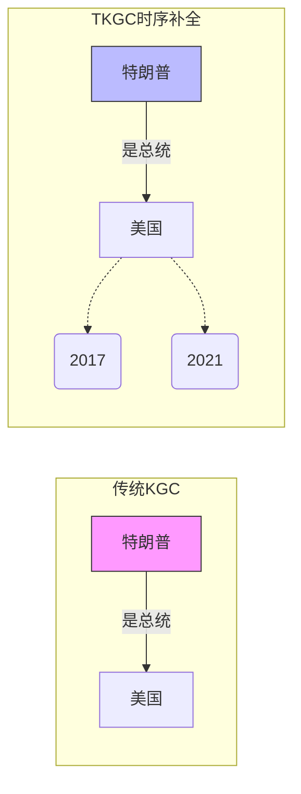
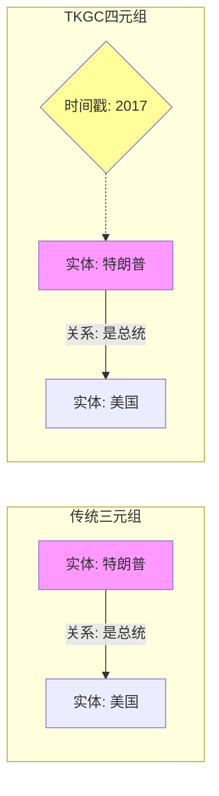
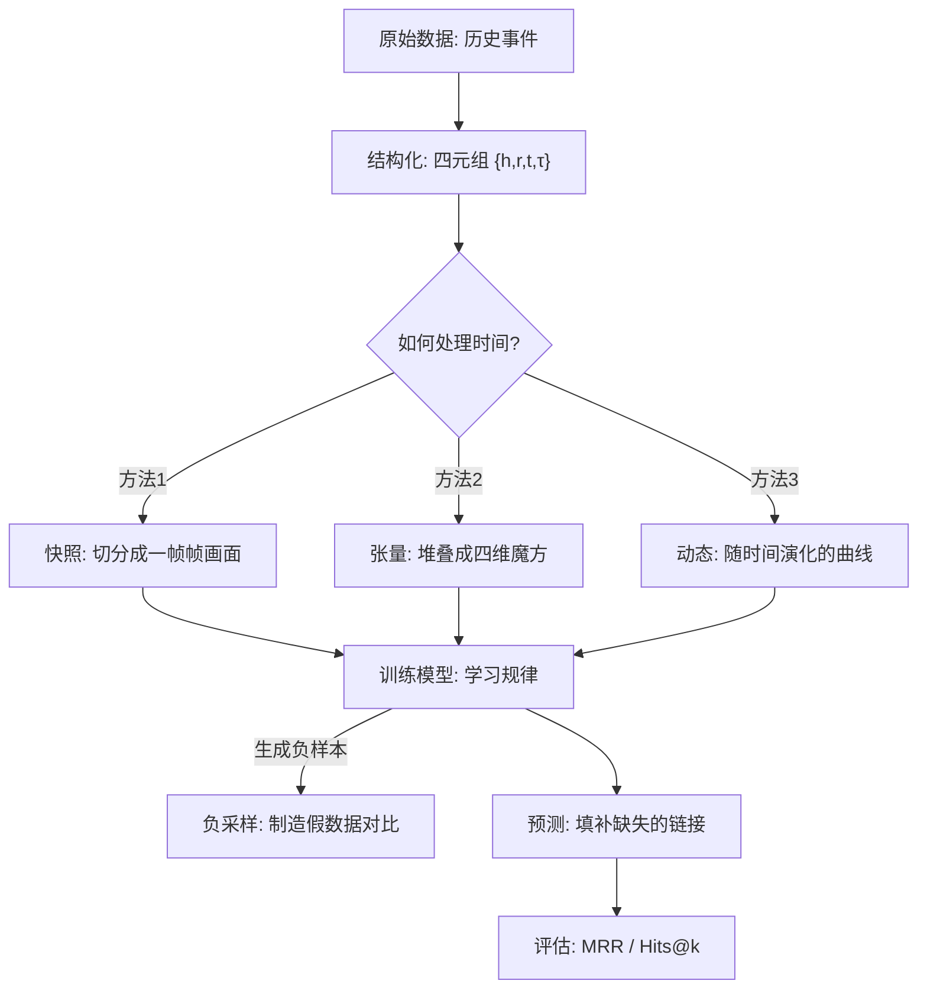

## AI论文解读 | Temporal Knowledge Graph Completion: A Survey
        
### 作者        
digoal        
        
### 日期        
2025-12-08        
        
### 标签        
PostgreSQL , PolarDB , DuckDB , AI , 论文解读        
        
----        
        
## 背景  
      
https://arxiv.org/pdf/2201.08236        
  
提示:          
```          
读懂《Temporal Knowledge Graph Completion: A Survey》这篇论文需要提前掌握哪些基础知识, 请使用中文通熟易懂的讲解这些基础知识, 可以引用论文中的图、表或使用Markdown支持的图形(text,mermaid等)增加解释性. 
  
使用中文通熟易懂的解读《Temporal Knowledge Graph Completion: A Survey》这篇论文, 其中的关键内容请着重讲解, 可以引用论文中的图、表或使用Markdown支持的图形(text,mermaid等)增加解释性. 
  
提取《Temporal Knowledge Graph Completion: A Survey》这篇论文中的重要术语, 使用中文对这些术语进行通熟易懂的讲解, 可以引用论文中的图、表或使用Markdown支持的图形(text,mermaid等)增加解释性. 
```     
  
## 1 前置知识 
  
要想读懂这篇关于 **时序知识图谱补全（Temporal Knowledge Graph Completion, TKGC）** 的综述论文，你需要掌握以下几个核心基础知识领域。为了让你更容易理解，我将通过通俗的语言、图表以及论文中的实例来为你拆解这些概念。

### 1\. 基础概念：什么是知识图谱（Knowledge Graph, KG）？

在进入“时序”之前，首先要理解什么是静态的知识图谱。

  * **通俗解释**：想象一张巨大的网，网上的节点是“实体”（Entity，如人、地点、事物），连接节点的线是“关系”（Relation，如“出生于”、“位于”）。
  * **数学表示**：一个事实通常被称为**三元组（Triple）** ，写作 $(h, r, t)$ 。
      * $h$ (Head Entity)：头实体（主语）
      * $r$ (Relation)：关系（谓语）
      * $t$ (Tail Entity)：尾实体（宾语）
  * **论文中的例子**：论文提到，传统的知识图谱假设事实是静态的 。但在现实中，很多事实是缺失的，例如 Freebase 数据库中超过 70% 的人没有出生地记录 。




*(这是一个典型的静态三元组示意图)*

### 2\. 核心问题：什么是知识图谱补全（KGC）？

  * **通俗解释**：因为知识图谱往往是不完整的（有缺失的连线），KGC 的任务就是通过已有的线索，像做“完形填空”一样，预测出缺失的链接 。
  * **常用方法**： **知识图谱嵌入（Embedding）** 。通过将实体和关系转换成低维向量（一串数字），计算它们之间的距离或得分来判断某个事实是否成立 。
      * 最经典的 TransE 模型认为： $头实体向量 + 关系向量 \approx 尾实体向量$ 。

### 3\. 进阶概念：什么是“时序”知识图谱（TKGC）？

这是本篇论文的主角。传统的 KGC 假设世界是不变的，但这会导致错误。

  * **为什么需要时间？**
    论文举例：事实 `{Donald Trump, presidentOf, USA}` 只有在 **2017 到 2021 年** 期间是真的 。如果不加时间限制，这个信息就是模糊甚至错误的。
  * **数据结构的变化**：
    事实从**三元组**变成了**四元组（Quadruple）** ： $(h, r, t, \tau)$ ，其中 $\tau$ 代表时间戳（Timestamp） 。
  * **时间的类型**：
      * **时间点 (Point)** ：例如 `2010年`。
      * **时间区间 (Interval)** ：例如 `2010-2013年`。
      * *注：为了处理方便，很多方法会将区间拆解为离散的时间点 。*

**论文中的数据集统计表（Table 1）展示了这一点：**

  

| 数据集名称 | 实体数 ( $\mathcal{E}$ ) | 关系数 ( $\mathcal{R}$ ) | 时间戳数 ( $\mathcal{T}$ ) | 事实类型 | 时间格式 |
| :--- | :--- | :--- | :--- | :--- | :--- |
| **ICEWS14** | 7,128 | 230 | 365 | 事件 | **时间点 (Point)** |
| **YAGO15K** | 15,403 | 32 | 169 | 事实 | **时间区间 (Interval)** |

*(数据来源: )*

### 4\. 关键技术：张量分解与向量空间

为了处理加上时间维度的知识图谱，你需要了解数学上的处理方式。论文将现有方法主要分为了几类，理解以下概念有助于阅读 Section 3：

#### A. 张量分解 (Tensor Decomposition)

  * **通俗解释**：
      * 如果是二维表格（矩阵），我们可以分解成两个小矩阵相乘。
      * 知识图谱加上时间后，就变成了一个三维甚至四维的“立方体”（张量）。
      * **CP 分解**和**Tucker 分解**就是把这个复杂的“立方体”拆解成简单的向量或核心张量，以便机器处理 。
  * **论文逻辑**：把知识图谱看作一个 4 维张量（头实体、关系、尾实体、时间），然后进行数学分解来学习特征 。

#### B. 向量变换与旋转 (Transformation & Rotation)

  * **通俗解释**：
      * 随着时间推移，实体的意义会变（例如“苹果”从水果变成了科技公司）。
      * 有些方法通过将向量在空间中进行“旋转”或“平移”来模拟这种随时间的变化 。

#### C. 序列模型 (RNN / Autoregressive)

  * **通俗解释**：
      * 历史会重演，或者历史会影响未来。
      * 这类方法利用处理时间序列的神经网络（如 RNN, LSTM, GRU），通过阅读过去的一系列事实（Snapshots），来预测下一个时刻会发生什么 。

### 5\. 评估标准：怎么算“预测准了”？

读论文实验部分（Evaluation Protocol）时，你需要懂以下指标：

  * **排名 (Ranking)** ：
    模型会给所有可能的答案打分。我们希望正确的答案得分最高（排在第1名）。
  * **MRR (Mean Reciprocal Rank)** ：
    平均倒数排名。如果正确答案排第1，得1分；排第2，得0.5分；排第10，得0.1分。分数越高越好 。
  * **Hits@k (例如 Hits@1, Hits@10)** ：
    正确答案是否出现在前 $k$ 名里？如果在，就算命中。Hits@10 越高，说明模型越靠谱 。

### 总结：你的阅读路线图

1.  **先读 Introduction (Section 1)** ：了解为什么静态图谱不够用，必须引入时间 。
2.  **细读 Background (Section 2)** ：熟悉符号定义 $\mathcal{G}=(\mathcal{E},\mathcal{R},\mathcal{T},\mathcal{F})$  和损失函数（Loss Function，即机器怎么知道自己错了） 。
3.  **核心部分 (Section 3)** ：这里是“八仙过海”，看不同的数学工具（张量、序列模型、动态嵌入）是如何解决同一个问题的。你可以根据上文的分类来对照阅读。

### 下一步建议

如果你对其中某个具体的数学模型（比如 CP 分解或 TransE 原理）特别感兴趣，我可以为你深入拆解其数学公式和直观含义。你想先了解哪一部分？
  
## 2 解读论文 
  
这篇论文《Temporal Knowledge Graph Completion: A Survey》是关于**时序知识图谱补全（TKGC）** 的第一篇全面综述 。

为了让你轻松读懂，我将这篇论文的核心逻辑拆解为**背景痛点**、**解决方案分类（核心）** 、**数据与评估**以及**未来方向**四个部分，并辅以图表解释。

-----

### 1\. 为什么我们需要“时序”知识图谱？（背景与痛点）

传统的**知识图谱补全（KGC）** 假设世界是**静态**的。

  * **传统做法**：只要事实存在，就永远为真。
  * **现实问题**：现实世界是动态的。
      * **论文举例**：事实 `{Donald Trump, presidentOf, USA}` 仅在 **2017 到 2021 年** 期间为真 。如果你问“2010年谁是美国总统？”，传统模型可能会因为缺乏时间概念而答错。
  * **TKGC 的任务**：在三元组 $(h, r, t)$ 的基础上引入时间 $\tau$ ，变成四元组 $(h, r, t, \tau)$ ，并利用这些时间信息来预测缺失的链接。




-----

### 2\. 核心干货：五大类解决方案 (Taxonomy)

这是论文最核心的部分（Section 3）。作者将现有的 TKGC 方法根据 **“如何利用时间戳”** 分为了五大流派 。

#### 流派 1：基于张量分解 (Timestamp-included Tensor Decomposition)

  * **原理**：把知识图谱看作一个高维的大魔方（张量）。
      * 传统 KGC 是 3 维张量（头实体 × 关系 × 尾实体）。
      * TKGC 把它扩展成 **4 维张量**（头实体 × 关系 × 尾实体 × **时间**） 。
  * **方法**：使用数学上的分解技术（如 CP 分解  或 Tucker 分解 ）将这个大魔方拆解成小的因子矩阵，从而学习时间特征。

#### 流派 2：基于时间戳的变换 (Timestamp-based Transformation)

  * **原理**：认为实体和关系的含义会随着时间发生“变形”或“位移”。
  * **常见手段**：
    1.  **合成关系**：把时间直接粘在关系上。例如，把 `championOf`（冠军是）和 `2010` 合并成一个新关系 `championOf:2010` 。
    2.  **空间变换**：把时间看作是一个超平面或旋转操作。比如，每一个时间点都对应一个“透镜”，把实体（如“苹果公司”）映射到该时间点下的具体状态 。

#### 流派 3：动态嵌入 (Dynamic Embedding)

  * **原理**：让实体和关系的向量表示（Embedding）本身这就具有流动性。
  * **类比**：一个人的生命周期是 $出生 \rightarrow 工作 \rightarrow 死亡$ ，这是不可逆的演化模式 。
  * **方法**：
      * 将向量设为时间的函数（如包含趋势项和周期项） 。
      * 利用 RNN（循环神经网络）捕捉实体随时间的演化状态 。

#### 流派 4：基于快照学习 (Learning from Snapshots)

  * **原理**：把时序知识图谱看作是一部“电影”，每一帧是一个**快照图（Snapshot）** 。
  * **方法**：
      * **马尔可夫过程**：今天的图谱状态决定了明天的状态 。
      * **自回归模型**：通过回顾过去几帧（例如过去5天的图谱）来生成今天的图谱 。

#### 流派 5：利用历史推理 (Reasoning with Historical Context)

  * **原理**：通过回溯历史记录来寻找线索，而不是仅仅依赖当前的向量计算。
  * **方法**：
      * **注意力机制**：模型会自动关注历史上最重要的那些事件 。
      * **启发式规则**：例如“历史往往会重读”。研究发现 ICEWS 数据集中 80% 的事件都是以前发生过的 。模型会分别学习“照抄历史”和“生成新预测”的概率 。

-----

### 3\. 数据集与现状 (Benchmark Datasets)

论文整理了当前主流的测试数据集，我们可以通过下表一目了然地看到它们的区别 ：

| 数据集 | 事实数量 | 时间类型 | 特点 |
| :--- | :--- | :--- | :--- |
| **ICEWS14** | \~9万 | **时间点** (如 2014-01-01) | 国际政治事件，按天记录  |
| **ICEWS18** | \~46万 | **时间点** | 数据量更大，覆盖时间更长 |
| **GDELT** | \~340万 | **时间点** | 规模最大，也是最难预测的（效果最差）  |
| **YAGO15K** | \~13万 | **时间区间** (如 2010-2012) | 维基百科类知识，许多事实没有时间戳  |
| **WIKIDATA** | \~15万 | **时间区间** | 同样包含时间段信息  |

**关键发现**：

  * **时间点 vs 时间区间**：大部分模型为了方便，会把“时间区间”切碎成离散的“时间点”来处理 。
  * **GDELT 的挑战**：尽管数据量最大，但因为包含很多抽象实体（如“GOVERNMENT”），导致预测很难对齐，现有模型表现最差 。

-----

### 4\. 总结与未来方向 (Future Directions)

论文最后指出了当前研究的不足和未来的机会：

1.  **引入外部知识**：目前的模型经常受限于数据稀疏。未来可以引入**预训练语言模型（如 BERT）** 来理解实体名称的语义，不再仅仅把它们当成冷冰冰的 ID 。
2.  **更聪明的负采样**：训练时需要告诉模型什么是“错”的（负样本）。在时序图谱中，生成高质量的负样本（例如：在这个时间点这件事是不可能发生的）非常重要，但这方面研究还很少 。
3.  **处理演化图谱**：现实中的图谱是不断更新的（增加新事实，删除旧事实）。目前的方法大多是在静态数据集上跑，未来需要通过**持续学习（Continual Learning）** 来避免模型“学了新的忘了旧的” 。

### 简而言之

这篇综述告诉我们，**时间**维度的加入让知识图谱变得更复杂但也更准确。解决这个问题的核心在于： **是用数学（张量分解）硬解，还是用物理（动态演化）模拟，亦或是用历史（序列推理）去推测。**
  
## 3 术语 
  
这篇论文《Temporal Knowledge Graph Completion: A Survey》中包含许多专业术语。为了让你不仅能看懂，还能理解其背后的直观逻辑，我将这些术语分为**基础概念**、**模型方法**和**评估指标**三类进行通俗解读。

### 1\. 基础概念类

#### **四元组 (Quadruple)**

  * **定义**：传统知识图谱使用三元组（头实体，关系，尾实体）来表示事实。而时序知识图谱（TKGC）为了引入时间信息，将其扩展为四元组： $\{h, r, t, \tau\}$ ，分别代表 $\{头实体, 关系, 尾实体, 时间戳\}$ 。
  * **通俗解读**：
      * **三元组**像是“静态照片”：`{特朗普, 是总统, 美国}`。这张照片里没有日期，容易让人误以为他永远是总统。
      * **四元组**像是“带日期的档案”：`{特朗普, 是总统, 美国, 2017}`。明确告诉你，这个关系是在2017年成立的。




#### **快照 (Snapshot)**

  * **定义**：将原来的时序知识图谱看作是一系列子图的集合 $\mathcal{G}=\{\mathcal{G}\_{1},\mathcal{G}\_{2},...,\mathcal{G}\_{|\mathcal{T}|}\}$ ，每一个子图 $\mathcal{G}\_{\tau}$ 只包含在该特定时间 $\tau$ 发生的事实 。
  * **通俗解读**：这就好比把一部电影（整个历史）拆成一帧一帧的**画面**。
      * $\mathcal{G}_{2010}$ 是“2010年世界状态”的快照。
      * $\mathcal{G}_{2011}$ 是“2011年世界状态”的快照。
      * 模型通过看前几帧画面，来推测下一帧会发生什么 。

#### **时间点 (Time Point) vs. 时间区间 (Time Interval)**

  * **定义**：
      * **时间点**：离散的时刻，如“2010年”或“2021年1月1日” 。
      * **时间区间**：持续的一段时间，如“2010-2013年” 。
  * **通俗解读**：
      * 如果数据是 **ICEWS**（国际危机预警系统），通常记录爆发性的事件（如“发生抗议”），用的是**时间点**。
      * 如果数据是 **WIKIDATA**，记录的是状态（如“某人担任CEO”），通常有开始和结束时间，即**时间区间**。
      * *注：为了计算方便，很多模型会把“区间”强行拆成一连串的“点”来处理 。*

-----

### 2\. 模型核心方法术语

论文将解决问题的方法分成了几大流派，这些术语描述了机器是如何“理解”时间的。

#### **张量分解 (Tensor Decomposition)**

  * **定义**：将知识图谱视为一个高维张量（多维数组），通过数学方法将其分解为几个低维矩阵或核心张量的乘积 。
  * **通俗解读**：
      * 想象一个魔方。如果不加时间，知识图谱是一个三维魔方（头、关系、尾）。
      * 加上时间后，它变成了一个**四维魔方**（头、关系、尾、时间）。
      * **CP分解** 或 **Tucker分解** 就是把这个复杂的四维魔方“拆解”成几个简单的长条积木。只要机器能学会这些积木的形状（低维向量），就能还原出整个魔方的全貌，甚至填补魔方上缺失的色块（预测缺失的链接） 。

#### **基于时间戳的变换 (Timestamp-based Transformation)**

  * **定义**：将时间戳视为一种转换函数，将实体或关系的表示映射到特定的时间空间 。
  * **通俗解读**：
      * 你可以把时间理解为一个“滤镜”或“透镜”。
      * 实体的本质（静态向量）是不变的，但加上“2010年”这个滤镜后，它呈现出的样子就变了。
      * 例如， 提到的方法将时间视为**超平面（Hyperplane）** 。实体像是一个物体，时间像是一把刀，把空间切成不同的切片，物体在不同切片上的投影是不同的。

#### **动态嵌入 (Dynamic Embedding)**

  * **定义**：实体和关系的向量表示不再是固定的，而是随时间变化的函数或序列 。
  * **通俗解读**：
      * **静态嵌入**：认为“苹果”这个词永远代表水果。
      * **动态嵌入**：认为“苹果”在1970年代表水果，在2010年代表科技巨头。
      * 这种方法通常使用 **RNN（循环神经网络）** 或 **ODE（常微分方程）** 来模拟这种“进化”过程。比如一个人从“出生”到“工作”再到“死亡”，这是一个不可逆的动态演化过程 。

#### **负采样 (Negative Sampling)**

  * **定义**：通过随机破坏真实的事实（例如替换头实体或尾实体）来生成虚假的“负样本” $s'$ ，目的是让模型区分真假 。
  * **通俗解读**：
      * 机器的学习方式是“找不同”。
      * 你告诉它：“{奥巴马, 出生于, 夏威夷, 1961}”是真的（正样本）。
      * 同时你要造一个假的：“{奥巴马, 出生于, **火星**, 1961}”是假的（负样本）。
      * **时序负采样**的难点在于，有些事只是在特定时间是错的（比如“2010年拜登是美国总统”是错的，但在2021年是对的），这比静态图谱更难 。

-----

### 3\. 评估指标术语

#### **MRR (Mean Reciprocal Rank)**

  * **定义**：平均倒数排名。对于每个查询，模型会给所有候选答案打分并排序。MRR 是正确答案排名的倒数的平均值 。
  * **通俗解读**：
      * 如果正确答案排第1名，得分为 $1/1 = 1$ 。
      * 如果正确答案排第10名，得分为 $1/10 = 0.1$ 。
      * **分数越接近 1，模型越准**。这个指标对“排得很靠前”的答案非常敏感。

#### **Hits@k (Hits at k)**

  * **定义**：正确答案出现在预测结果前 $k$ 名的比例 。
  * **通俗解读**：
      * **Hits@1**：机器必须**第一眼**就猜对，不仅要对，还要是第一名。这是最严苛的。
      * **Hits@10**：机器给出的前10个猜测里只要有正确答案就算过关。这类似于搜索引擎，只要第一页结果里有你要找的网页，体验就还不错。

### 总结图示

为了帮你把这些概念串起来，请看下图：


  
## 参考        
         
https://arxiv.org/pdf/2201.08236    
        
<b> 以上内容基于DeepSeek、Qwen、Gemini及诸多AI生成, 轻微人工调整, 感谢杭州深度求索人工智能、阿里云、Google等公司. </b>        
        
<b> AI 生成的内容请自行辨别正确性, 当然也多了些许踩坑的乐趣, 毕竟冒险是每个男人的天性.  </b>        
    
#### [PolarDB 学习图谱](https://www.aliyun.com/database/openpolardb/activity "8642f60e04ed0c814bf9cb9677976bd4")
  
  
#### [PostgreSQL 解决方案集合](../201706/20170601_02.md "40cff096e9ed7122c512b35d8561d9c8")
  
  
#### [德哥 / digoal's Github - 公益是一辈子的事.](https://github.com/digoal/blog/blob/master/README.md "22709685feb7cab07d30f30387f0a9ae")
  
  
#### [About 德哥](https://github.com/digoal/blog/blob/master/me/readme.md "a37735981e7704886ffd590565582dd0")
  
  

  
