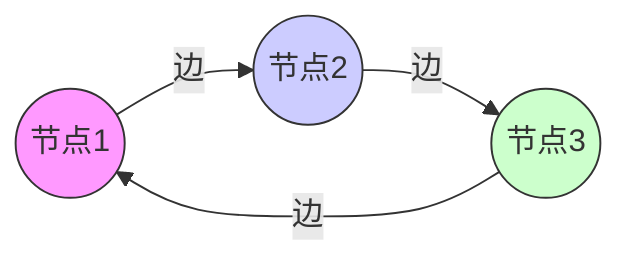
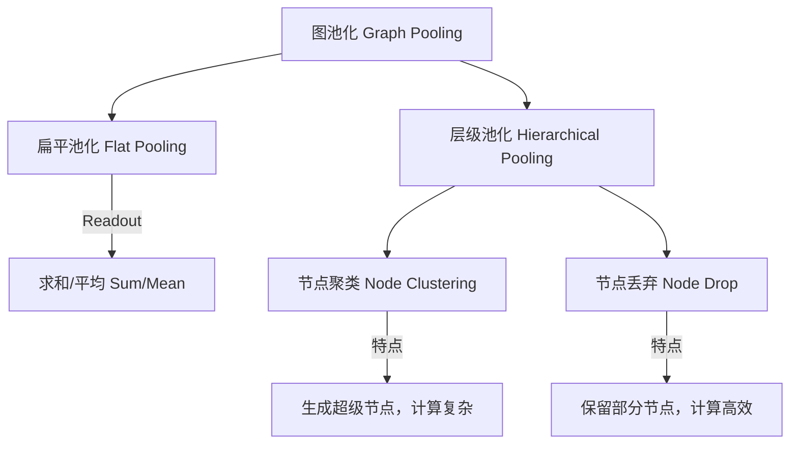
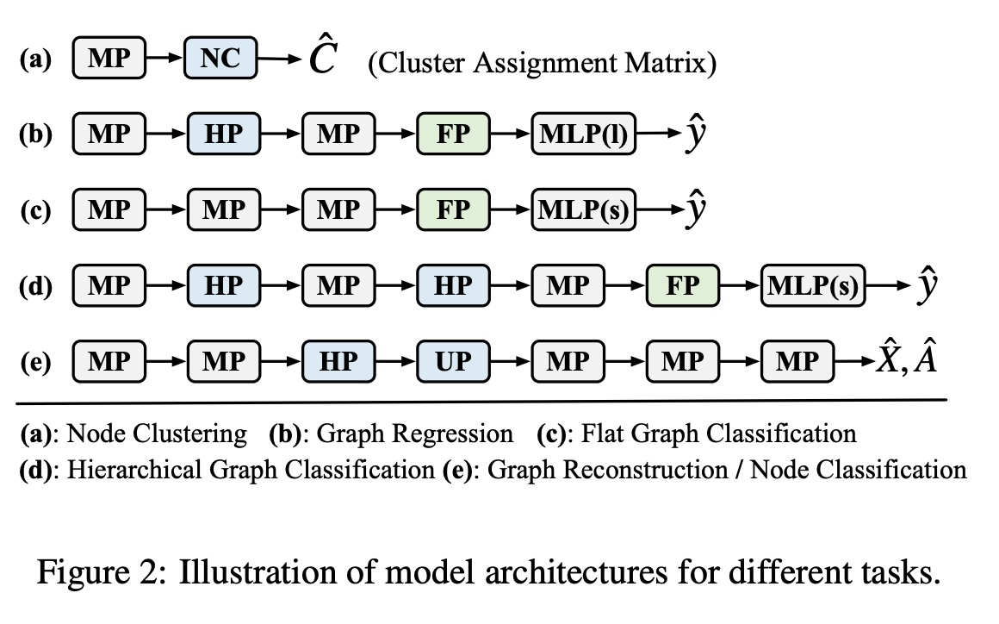
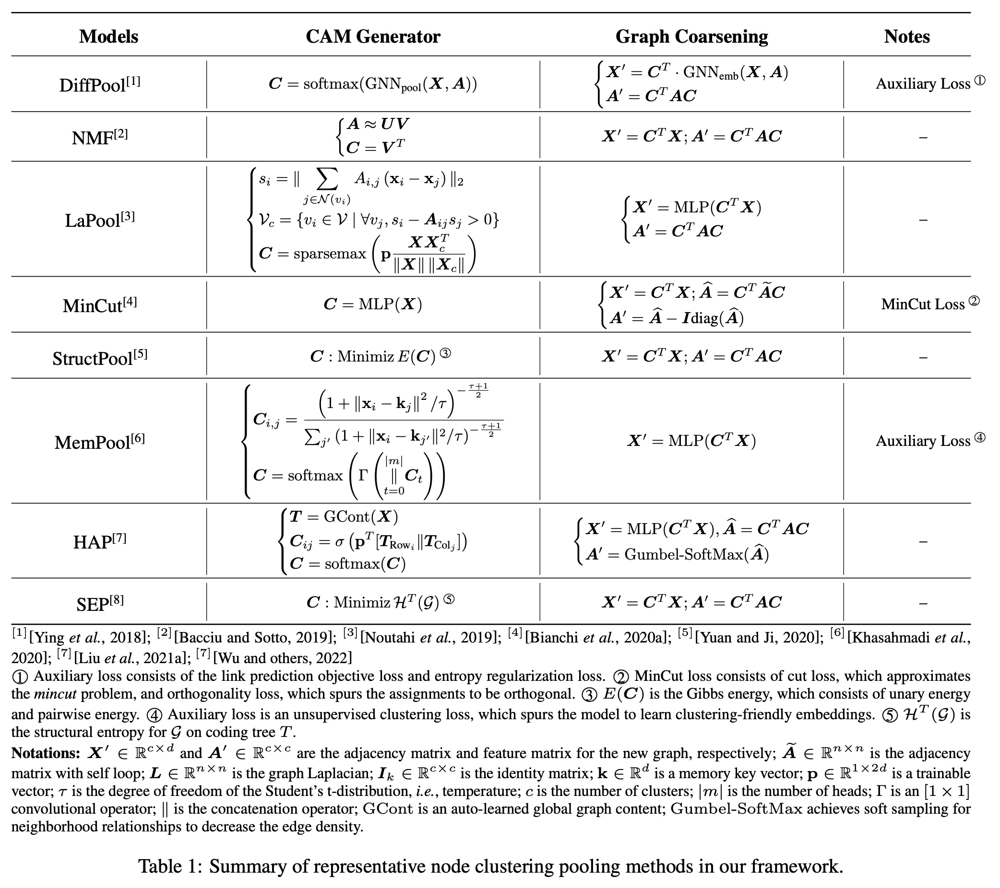
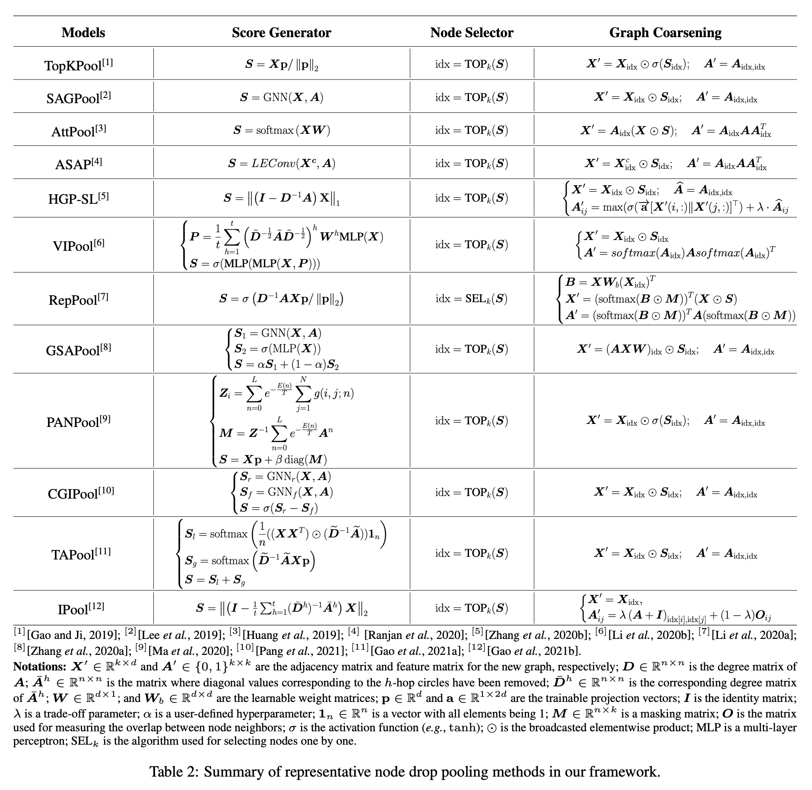
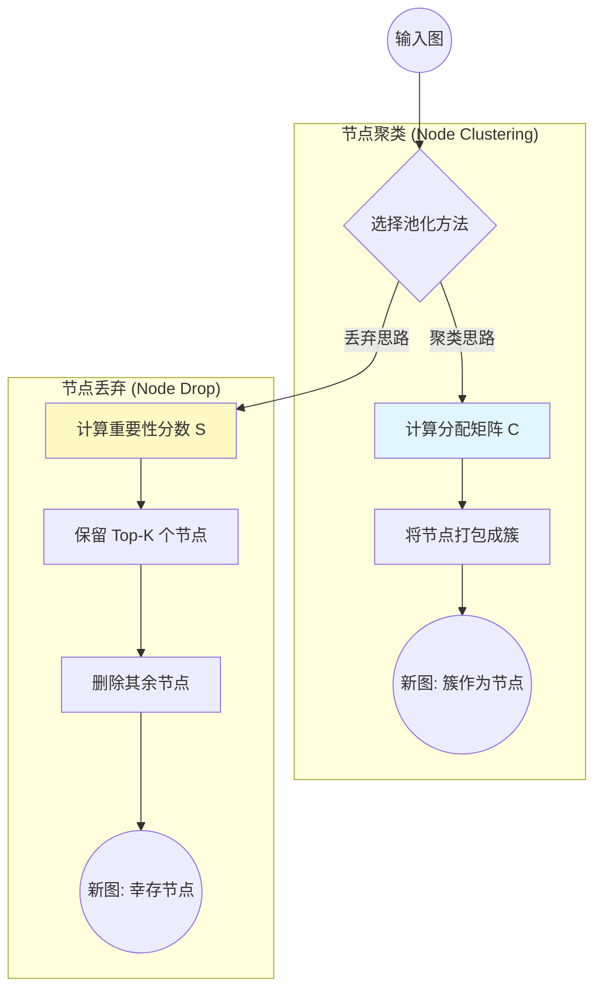
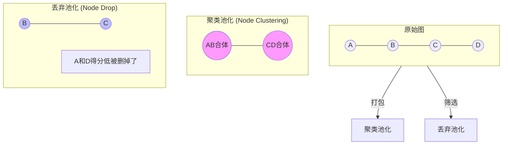
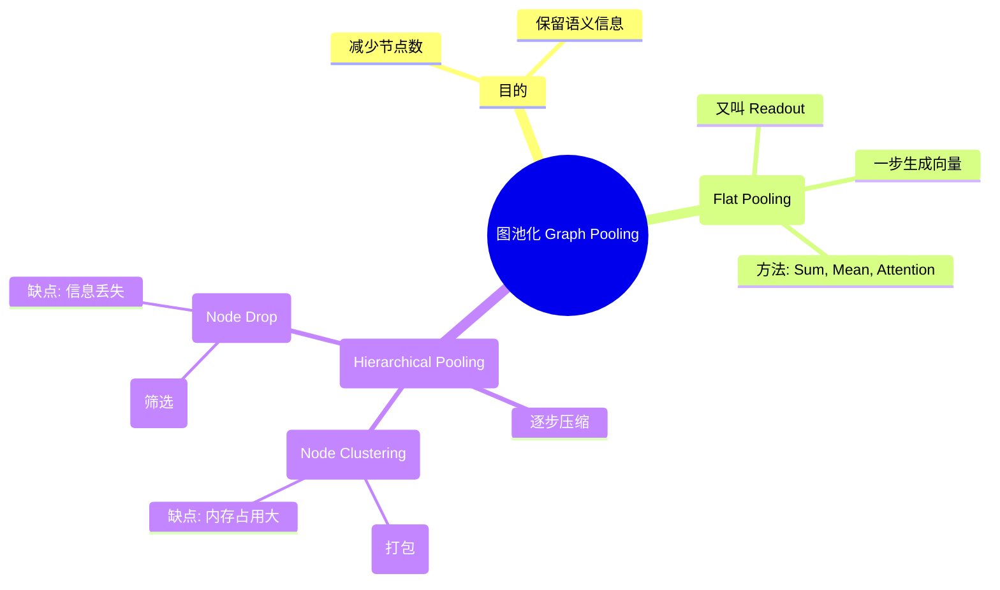

## AI论文解读 | Graph Pooling for Graph Neural Networks: Progress, Challenges, and Opportunities
        
### 作者        
digoal        
        
### 日期        
2025-12-08        
        
### 标签        
PostgreSQL , PolarDB , DuckDB , AI , 论文解读        
        
----        
        
## 背景  
      
https://arxiv.org/pdf/2204.07321        
  
提示:          
```          
读懂《Graph Pooling for Graph Neural Networks: Progress, Challenges, and Opportunities》这篇论文需要提前掌握哪些基础知识, 请使用中文通熟易懂的讲解这些基础知识, 可以引用论文中的图、表或使用Markdown支持的图形(text,mermaid等)增加解释性. 
  
使用中文通熟易懂的解读《Graph Pooling for Graph Neural Networks: Progress, Challenges, and Opportunities》这篇论文, 其中的关键内容请着重讲解, 可以引用论文中的图、表或使用Markdown支持的图形(text,mermaid等)增加解释性. 
  
提取《Graph Pooling for Graph Neural Networks: Progress, Challenges, and Opportunities》这篇论文中的重要术语, 使用中文对这些术语进行通熟易懂的讲解, 可以引用论文中的图、表或使用Markdown支持的图形(text,mermaid等)增加解释性. 
```     
  
## 1 前置知识 
  
阅读这就好比在学习怎么把一张复杂的“大网”（图结构）慢慢折叠、压缩，最后变成一个简单的“点”或“小网”，以便让计算机看懂。

这篇综述论文《Graph Pooling for Graph Neural Networks: Progress, Challenges, and Opportunities》非常系统地总结了图池化（Graph Pooling）技术。要读懂它，你需要掌握以下几个层面的基础知识。我会用通俗的语言配合图表为你讲解。

-----

### 1\. 数学与数据结构基础：图的“骨架”

首先，你需要理解计算机是如何“看到”一张图的。图不仅仅是画在纸上的圈圈和线，它在数学上通常表示为 $\mathcal{G}=(\mathcal{V},\mathcal{E})$ 。

  * **节点 ( Nodes, $\mathcal{V}$ ):** 图中的“点”。比如社交网络里的人，或者分子里的原子。
  * **边 ( Edges, $\mathcal{E}$ ):** 连接点的“线”。比如人与人的关注关系，原子间的化学键。
  * **邻接矩阵 ( Adjacency Matrix, $A$ ):** 这是计算机存储图结构的“地图”。如果节点 $i$ 和节点 $j$ 之间有连线，矩阵里的对应位置 $A_{ij}$ 就是 1，否则是 0 。
  * **特征矩阵 ( Feature Matrix, $X$ ):** 每个节点不仅有位置，还有属性（比如人的年龄、原子的电荷）。这些属性构成了特征矩阵 。

**可视化理解：**



*对应的邻接矩阵概念：*

$$
\begin{bmatrix}
0 & 1 & 1 \\
1 & 0 & 1 \\
1 & 1 & 0
\end{bmatrix}
$$

-----

### 2\. 深度学习类比：从 CNN 到 GNN

如果你了解计算机视觉中的 **卷积神经网络 (CNN)** ，那么理解图池化会非常容易。

  * **CNN 中的池化 (Pooling):** 在处理图片时，为了减少计算量并提取主要特征，我们会做 "Max Pooling"（最大池化），把图片缩小（比如 4个像素变1个）。
  * **GNN 中的池化:** 图池化的目的完全一样——**减少图中的节点数量，同时保留图的核心信息** 。

但是，图比图片难处理，因为图片是整齐的网格，而图的结构是千奇百怪、大小不一的 。这就是为什么这篇论文如此重要的原因——它总结了在不规则结构上做“压缩”的方法。

-----

### 3\. 图神经网络 (GNN) 的核心机制：消息传递 (Message Passing)

在进行“池化”（压缩）之前，节点之间通常需要先交流信息。这被称为 **消息传递 (Message Passing, MP)** 。

  * **通俗解释：** 每个节点看看自己的邻居是谁，把邻居的信息拿过来，和自己的信息融合，更新自己的状态。
  * **论文中的流程：** 论文中的模型通常遵循 `MP -> POOL -> MP -> POOL` 的三明治结构。即：先交流信息，压缩一下；再交流，再压缩。

-----

*(请参考论文原图 Figure 1，这是理解全篇最关键的流程图)*

  

> **图解 Figure 1:**  
>  
>   * **Input Graph:** 最左边是原始大图。  
>     * **MP (Message Passing):** 节点间交换信息 。  
>     * **POOL (Pooling):** 这是论文的主角。你看图中间，节点被染成了不同的颜色（聚类），或者某些节点消失了。图变得越来越小（节点数减少）。  
>     * **Readout:** 最后把剩下的节点捏成一个向量，用来做分类（比如判断这个分子是否有毒）。  

-----

### 4\. 核心概念区分：Flat vs. Hierarchical

论文将池化方法分为了两大类，这是你需要时刻记在心里的分类树 ：

#### A. Flat Pooling (扁平池化 / Readout)

  * **意思：** 一步到位。不管图多大，直接通过“求和”或“取平均”把所有节点变成**一个**向量 。
  * **场景：** 通常用在最后一步，生成整个图的“指纹”。

#### B. Hierarchical Pooling (层级池化)

  * **意思：** 像剥洋葱一样，一层层让图变小 。这篇论文主要讨论这类方法的两种流派：
    1.  **Node Clustering (节点聚类):** 把几个邻近的节点打包成一个“超级节点” 。
          * *比如：把“朝阳区”、“海淀区”等打包成“北京”。*
    2.  **Node Drop (节点丢弃):** 挑选重要的节点保留，把不重要的节点直接扔掉 。
          * *比如：只保留社交网络里的“大V”，忽略普通用户。*

**知识结构图：**



-----

### 5\. 下游任务：我们为什么要池化？

最后，你需要知道做了池化后能干什么。论文提到了几种任务（Task）：

  * **Graph Classification (图分类):** 给整个图打标签。
      * *例子：* 输入一个蛋白质分子的图，判断它是“酶”还是“非酶” 。这是池化最常用的场景。
  * **Graph Regression (图回归):** 预测图的一个数值属性。
      * *例子：* 预测分子的溶解度。
  * **Node Classification (节点分类):** 判断某个节点的属性。
      * *注意：* 如果任务是节点分类，通常需要用到 **Unpooling (反池化)** ，即把压缩的图再还原回去，类似图像分割中的 U-Net 结构 。

-----

*(参考论文 Figure 2，展示了不同任务对应的网络结构)*

  

> 论文 Figure 2 展示了不同任务的流水线 。  
>  
>   * **(b) Graph Regression:** 多次 MP 和 Hierarchical Pooling (HP)，最后接 Flat Pooling (FP)。  
>   * **(e) Node Classification:** 这是一个 Encoder-Decoder 结构。先池化变小（Encoder），再反池化变大（Decoder），最后给每个节点分类。  

-----

### 总结：读这篇论文的“通关秘籍”

1.  **心中有图：** 始终把图想象成 $A$ (连接关系) 和 $X$ (特征) 的组合。
2.  **抓住主线：** 论文就在讲如何把 $N$ 个节点的图，变成 $N'<N$ 个节点的图。
3.  **两个流派：** 看到一个新方法，先判断它是“聚类（打包）”还是“丢弃（筛选）”。
4.  **关注图表：** 论文中的 **Figure 1** (流程) 和 **Table 1 & 2** (方法分类) 是核心索引。

  

  

  

掌握了这些，你就可以顺畅地阅读这篇综述了！你可以让我进一步解释某个具体的数学公式（如 DiffPool 的分配矩阵）或者某个具体的算法细节。
  
## 2 解读论文 
  
这篇论文《Graph Pooling for Graph Neural Networks: Progress, Challenges, and Opportunities》是对图神经网络（GNN）中 **图池化（Graph Pooling）** 技术的一份非常详尽的综述 。

为了让你轻松读懂，我们可以把“图池化”想象成**把一张详细的地图缩放成简略图，最后浓缩成一个地标点**的过程。如果不做池化，GNN 只能看清每个路口（节点）；做了池化，GNN 才能看懂整个城市（全图）。

以下是这篇论文的核心内容解读：

-----

### 1\. 为什么我们需要图池化？

在图深度学习中，任务通常分为两类 ：

  * **节点级任务（Node-level）：** 比如判断社交网络里的某个人是不是僵尸粉。这只需要 GCN（图卷积）提取节点特征。
  * **图级任务（Graph-level）：** 比如判断一个药物分子（图结构）是否有毒。这需要把整个图的所有节点信息“压缩”成一个整体表示。

**图池化（Pooling）** 就是这个“压缩”的关键组件。它的作用是减少节点数量，保留核心结构信息，最终生成一个固定大小的向量用于分类或回归 。

> **图解流程 (参考论文 Figure 1 ):**  
> `输入大图` $\rightarrow$ `消息传递(GNN)` $\rightarrow$ **`池化(变小图)`** $\rightarrow$ `消息传递` $\rightarrow$ **`池化(变更小)`** $\rightarrow$ `读出(Readout)` $\rightarrow$ `预测结果`  
  
  

-----

### 2\. 图池化的核心分类体系

论文根据“怎么压缩图”，将现有的方法分为两大派系 ：

#### 第一派：扁平池化 (Flat Pooling / Readout)

这是最简单粗暴的方法。不管前面的图结构多复杂，最后直接“一步到位”压缩成一个向量。

  * **做法：** 比如把所有节点的特征数值加起来（Sum）或者取平均值（Mean）。
  * **优缺点：** 计算极快，但完全忽略了图的层次结构，容易丢失信息 。

#### 第二派：层级池化 (Hierarchical Pooling)

这是论文重点讨论的对象。它像剥洋葱一样，一层一层地把图变小（Coarsening），保留了中间的结构信息 。层级池化又细分为两个子流派：

##### A. 节点聚类池化 (Node Clustering Pooling)

  * **核心思想：** 把几个关系好的节点“打包”成一个超级节点（簇）。
  * **代表作：** DiffPool , MinCutPool 。
  * **通用框架：** 论文总结了一个公式，分两步走：
    1.  **生成分配矩阵 ( $CAM$ )：** 计算每个节点属于哪个簇。
    2.  **图粗化 ( $Coarsening$ )：** 根据分配矩阵，算出新簇的特征和新边的连接关系。
  * **痛点：** 需要计算一个很大的分配矩阵，存储和计算开销大（ $\mathcal{O}(n^2)$ ），不适合超大图 。

##### B. 节点丢弃池化 (Node Drop Pooling)

  * **核心思想：** 优胜劣汰。给每个节点打分，分数高的留下，分数低的直接删掉 。
  * **代表作：** TopKPool , SAGPool 。
  * **通用框架：** 同样分三步走 ：
    1.  **打分 ( $Score$ )：** 用神经网络算出每个节点的重要性。
    2.  **选择 ( `Select` )：** 选出前 $k$ 个高分节点。
    3.  **图粗化 ( $Coarsening$ )：** 重新构建由幸存节点组成的新图。
  * **痛点：** 虽然计算快、省内存，但直接删节点可能会导致图的信息（比如连通性）丢失 。

-----

### 3\. 图解：两种层级池化的区别

为了更直观地理解论文中的分类，我为你总结了下面的对比图：



-----

### 4\. 常用资源与数据集

论文整理了做图池化研究必备的“工具箱” ：

  * **数据集 (Datasets):**
      * **TUDataset:** 包含酶 (ENZYMES)、蛋白质 (PROTEINS)、社交网络 (IMDB) 等经典小图数据集 。
      * **OGB (Open Graph Benchmark):** 包含大规模的分子图和网络，是目前更权威的测试基准 。
  * **代码库:** 很多模型都在 PyTorch Geometric 或 Spektral 中有实现 。

-----

### 5\. 面临的挑战与未来机会 (核心总结)

论文在最后非常诚恳地指出了目前图池化技术面临的 6 大难点，这也是未来的研究方向 ：

| 挑战点 | 具体问题 | 未来机会/解决思路 |
| :--- | :--- | :--- |
| **1. 任务单一** | 目前大多用于图分类，很少用于节点分类 。 | 设计更好的“反池化”（Unpooling）操作，像 U-Net 一样还原图结构来做节点预测 。 |
| **2. 图类型受限** | 现有的池化大多针对普通图，处理异构图、动态图能力弱 。 | 针对时序图（Dynamic Graphs）或异构图开发专用的池化算子 。 |
| **3. 缺乏解释性** | 池化像是“黑盒”，我们不知道为什么它把这几个节点聚在一起 。 | 结合可视化技术，弄清楚模型到底学到了什么样的层次结构 。 |
| **4. 鲁棒性差** | 输入图稍微有一点噪声（干扰），池化结果可能就全乱了 。 | 引入对抗攻击防御机制，让池化过程更“抗造” 。 |
| **5. 大数据瓶颈** | 很多方法（特别是聚类法）太吃内存，跑不动大图 。 | 优化算法复杂度，在 OGB 等大规模数据集上验证效率 。 |
| **6. 理论表达力** | 我们大多靠直觉设计池化，缺乏数学证明它到底有多强 。 | 利用 WL 测试（Weisfeiler-Lehman test）等理论工具来证明池化的表达能力边界 。 |

-----

### 下一步建议

如果你想快速上手实验，我建议你从 **Node Drop** 类的方法开始，因为它们通常代码更简单，运行速度更快。

**是否需要我为你详细解释文中提到的某个具体算法（如 DiffPool 或 SAGPool）的数学推导细节？**
  
## 3 术语 
  
这篇论文《Graph Pooling for Graph Neural Networks: Progress, Challenges, and Opportunities》对图池化技术进行了非常系统的梳理。为了帮助你理解，我提取了文中的核心术语，并用通俗的语言配合图表进行讲解。

### 1\. 核心概念：什么是图池化？

#### **Graph Pooling (图池化)**

  * **通俗解释：** 想象你在看一张非常详细的城市地图。如果你只想知道这个城市的大致布局（比如哪里是商业区、哪里是住宅区），你不需要看清每一条小巷。**图池化**就是这个“把详细地图变成简略地图”的过程。
  * **论文定义：** 这是一个操作函数（Operator），它把一个大图 $\mathcal{G}$ 映射成一个新的、节点更少的小图 $\mathcal{G'}$ （或者直接映射成一个向量），同时还要保留原图的核心语义信息 。
  * **目的：** 减少节点数量，降低计算量，并提取更高层级的结构特征 。

#### **Message Passing (消息传递 / MP)**

  * **通俗解释：** 在做池化（压缩）之前，图中的节点往往需要先“交流一下”。比如节点 A 问节点 B：“你是什么特征？”，然后 A 结合 B 的信息更新自己。这就像开会讨论，大家交换信息后，每个人的认知都更全面了。
  * **论文中的位置：** 在论文的通用架构图中，通常是先做 MP（交流信息），再做 POOL（压缩），交替进行 。

-----

### 2\. 两个主要派系：扁平 vs. 层级

论文将图池化方法分为两大类 ：

#### **Flat Pooling (扁平池化)**

  * **别名：** Graph Readout (图读出) 。
  * **通俗解释：** **一步到位**。不管图有多大，直接把它压扁成**一个**特征向量。这就像把一整篇作文直接总结成一句话的中心思想。
  * **常见做法：**
      * **Sum/Mean Pooling:** 把所有节点的特征加起来或取平均值 。
      * **Attention:** 根据重要性加权求和（有的节点说话分量重，有的轻） 。
  * **特点：** 生成的新“图”只有一个节点 ( $|\mathcal{V}'|=1$ ) 。

#### **Hierarchical Pooling (层级池化)**

  * **通俗解释：** **循序渐进**。像剥洋葱或者公司的管理层级一样，一层一层地把图变小。
      * 原始图（员工） $\rightarrow$ 第一层池化（经理） $\rightarrow$ 第二层池化（总监）...
  * **特点：** 生成的新图节点数比原来少，但大于 1 ( $|\mathcal{V}'|>1$ )，保留了图的中间结构 。

-----

### 3\. 层级池化的两种手段：聚类 vs. 丢弃

这是论文最核心的分类部分，层级池化主要通过以下两种方式实现“图变小”（Graph Coarsening）：

#### **A. Node Clustering Pooling (节点聚类池化)**

  * **核心逻辑：** **打包**。把几个关系紧密的节点合并成一个新的“超级节点”。
  * **通俗解释：** 类似于把“北京”、“上海”、“广州”等节点打包成一个新节点叫“一线城市”。原来的节点消失了，变成了新的代表。
  * **关键步骤 ：**
    1.  **分配矩阵 (Assignment Matrix / CAM):** 计算每个节点属于哪个簇（Cluster）。
    2.  **生成新节点：** 新节点是旧节点特征的加权和。
  * **优缺点：** 能保留较多信息，但计算分配矩阵很占内存，速度慢 。

#### **B. Node Drop Pooling (节点丢弃池化)**

  * **核心逻辑：** **筛选**。给节点打分，分高的留下，分低的直接删掉。
  * **通俗解释：** 类似于选秀比赛，只保留前 10 名选手（Top-K），其他的淘汰。
  * **关键步骤 ：**
    1.  **评分 (Score Generator):** 算出每个节点的重要性分数。
    2.  **选择 (Node Selector):** 选出分数最高的 $k$ 个节点。
    3.  **重构：** 基于留下的节点构建新图。
  * **优缺点：** 计算效率高，省内存，但直接删节点可能会丢失连通性信息 。

**图解对比：**



-----

### 4\. 其他重要术语

#### **Graph Coarsening (图粗化)**

  * **解释：** 这是一个过程描述。指的是图的节点数逐渐减少，结构逐渐变粗糙的过程。这是层级池化的核心动作 。

#### **Unpooling (反池化)**

  * **通俗解释：** 池化的逆过程。如果池化是“压缩”，反池化就是“还原”。
  * **用途：** 在做节点分类（Node Classification）任务时，通常用 Encoder-Decoder 结构（类似 U-Net）。先池化把图变小提取抽象特征，再反池化把图还原回原来的大小，把特征传回给每个原始节点 。

#### **Weisfeiler-Lehman (WL) Test**

  * **解释：** 这是一个衡量图神经网络“表达能力”的数学标准。
  * **在论文中的意义：** 研究人员用这个测试来从理论上证明：设计的新池化方法到底有多强？能不能区分开两个结构不同但特征相似的图？ 。

#### **Readout (读出)**

  * **解释：** 即使是层级池化，在最后一步也需要把剩下的图变成一个固定长度的向量，以便输入到全连接层（MLP）进行分类。这个最后一步的扁平化操作通常被称为 Readout 。

### 总结图谱

你可以参考下面这个结构来记忆这篇论文的术语体系：


  
## 参考        
         
https://arxiv.org/pdf/2204.07321    
        
<b> 以上内容基于DeepSeek、Qwen、Gemini及诸多AI生成, 轻微人工调整, 感谢杭州深度求索人工智能、阿里云、Google等公司. </b>        
        
<b> AI 生成的内容请自行辨别正确性, 当然也多了些许踩坑的乐趣, 毕竟冒险是每个男人的天性.  </b>        
    
#### [PolarDB 学习图谱](https://www.aliyun.com/database/openpolardb/activity "8642f60e04ed0c814bf9cb9677976bd4")
  
  
#### [PostgreSQL 解决方案集合](../201706/20170601_02.md "40cff096e9ed7122c512b35d8561d9c8")
  
  
#### [德哥 / digoal's Github - 公益是一辈子的事.](https://github.com/digoal/blog/blob/master/README.md "22709685feb7cab07d30f30387f0a9ae")
  
  
#### [About 德哥](https://github.com/digoal/blog/blob/master/me/readme.md "a37735981e7704886ffd590565582dd0")
  
  

  
