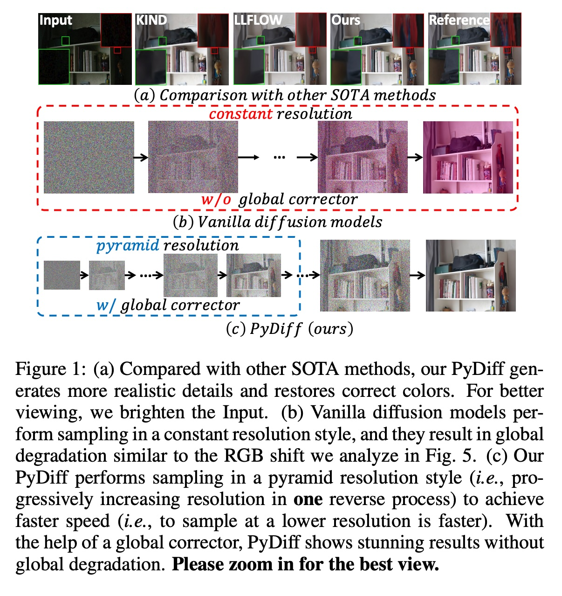
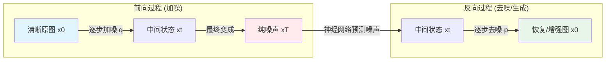
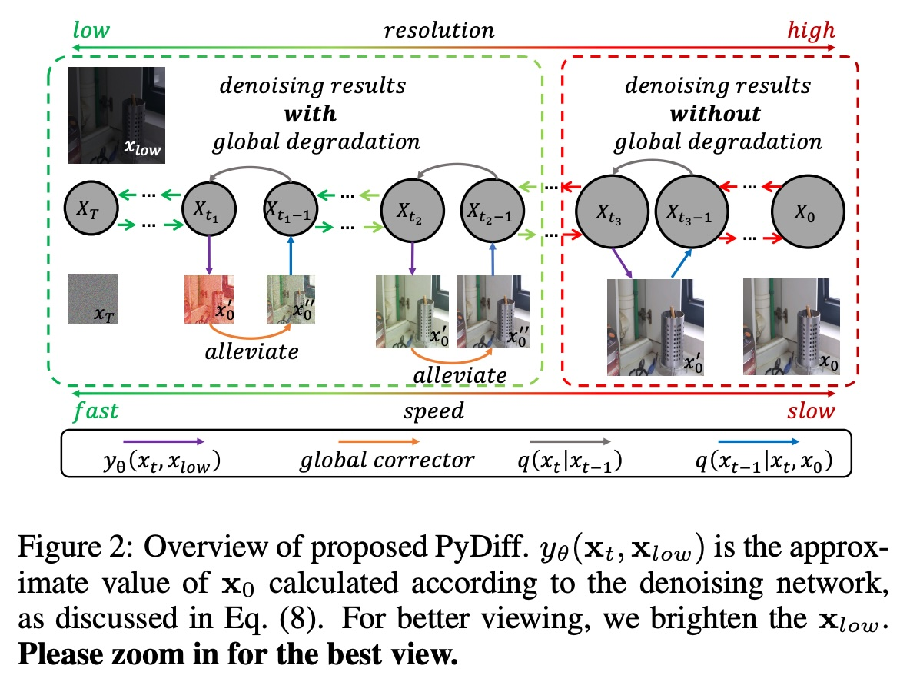
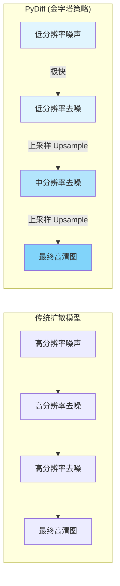
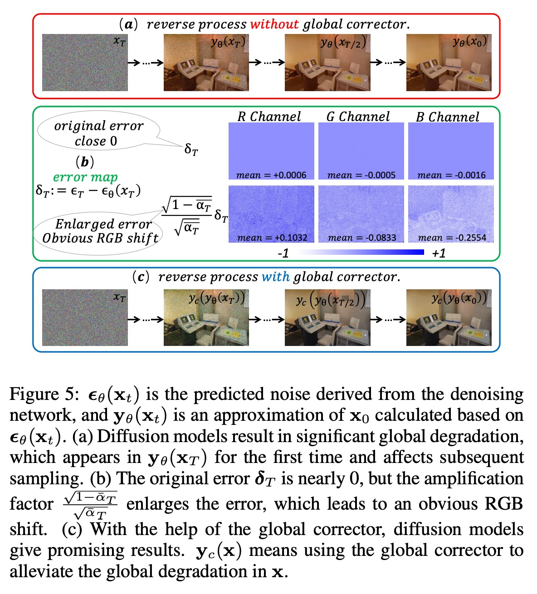
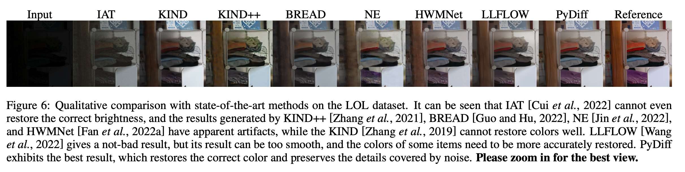
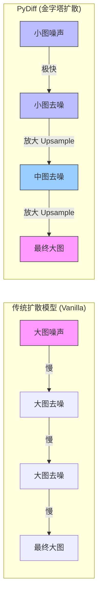

## AI论文解读 | Pyramid Diffusion Models For Low-light Image Enhancement
        
### 作者        
digoal        
        
### 日期        
2025-12-08        
        
### 标签        
PostgreSQL , PolarDB , DuckDB , AI , 论文解读        
        
----        
        
## 背景  
      
https://arxiv.org/pdf/2305.10028        
  
提示:          
```          
读懂《Pyramid Diffusion Models For Low-light Image Enhancement》这篇论文需要提前掌握哪些基础知识, 请使用中文通熟易懂的讲解这些基础知识, 可以引用论文中的图、表或使用Markdown支持的图形(text,mermaid等)增加解释性. 
  
使用中文通熟易懂的解读《Pyramid Diffusion Models For Low-light Image Enhancement》这篇论文, 其中的关键内容请着重讲解, 可以引用论文中的图、表或使用Markdown支持的图形(text,mermaid等)增加解释性. 
  
提取《Pyramid Diffusion Models For Low-light Image Enhancement》这篇论文中的重要术语, 使用中文对这些术语进行通熟易懂的讲解, 可以引用论文中的图、表或使用Markdown支持的图形(text,mermaid等)增加解释性. 
```     
  
## 1 前置知识 
  
阅读这篇论文《Pyramid Diffusion Models For Low-light Image Enhancement》（PyDiff），你需要掌握以下几个核心领域的“通俗版”基础知识。这篇论文主要解决的是**低光照图像增强**（把暗图变亮变清晰）的问题，利用了当下最火的**扩散模型**（Diffusion Models），并提出了 **金字塔（Pyramid）** 结构来加速和优化。

为了让你更轻松地读懂，我将这些前置知识拆解为四个部分，并结合论文内容进行图解。

-----

### 1\. 什么是“低光照图像增强” (Low-light Image Enhancement)?

**通俗解释：**
想象你在晚上关灯的房间里拍了一张照片。这张照片有两个主要毛病：

1.  **太黑了**：看不清物体（这是光照/Illumination的问题）。
2.  **噪点多**：放大看全是密密麻麻的杂色颗粒（这是噪声/Noise的问题）。

**论文背景：**
传统的修图方法（如论文中提到的Retinex理论 ）试图把“光照”和“物体本身的颜色（反射率）”分开处理。但深度学习时代，我们希望神经网络能自动学会“去噪”并“补光”。

  * **难点**：这是一个“盲人摸象”的问题（Ill-posed problem），因为一张黑图可能对应无数种正常的亮图，恢复出的细节很容易失真或颜色不对 。

> **论文中的例子：**
> 看下图 ，左上角是输入（黑图），右上角是参考图（正常图）。中间的 LLFLOW 和 KIND 是以前的方法，虽然变亮了，但细节可能模糊或颜色奇怪。

*(注：引用论文Figure 1(a))*

  

-----

### 2\. 核心引擎：扩散模型 (Diffusion Models)

这是理解这篇论文最关键的数学地基。

**通俗解释：**
扩散模型包含两个过程，就像“墨水滴入清水”和“时光倒流”。

1.  **前向过程 (Forward Process) - 搞破坏**：
    把一张清晰的照片（ $x_0$ ），一点点地加入高斯噪声（Gaussian Noise），重复很多步（比如 $T$ 步），最后这张图就变成了一张完全看不出原样的纯噪声图（ $x_T$ ）。

2.  **反向过程 (Reverse Process) - 搞创作**：
    神经网络的任务是学会“时光倒流”。给它一张纯噪声图，它一步步把噪声“预测”出来并减掉，最后还原出清晰的图像。这篇论文就是利用这个反向过程，从低质量的黑图中“生成”出高质量的亮图 。

**Mermaid 流程图解：**



**论文的痛点：**
虽然扩散模型效果好，但它有个大问题： **慢**。
因为它需要几百上千步的迭代去噪，而且每一步都在处理全分辨率的大图 。这篇论文就是为了解决“慢”的问题。

-----

### 3\. 什么是“图像金字塔” (Image Pyramid)?

**通俗解释：**
画画时，你是先画一个大概的轮廓（低分辨率），还是直接拿着放大镜画每一根睫毛（高分辨率）？通常是先画轮廓，再画细节。

**论文的核心创新 (Pyramid Diffusion)：**
传统的扩散模型每一步都用同样大小的画布（Constant Resolution）。
这篇论文提出：在反向过程的**早期**（图还很模糊、噪声很多的时候），我们不需要在那张大画布上浪费时间，可以用一张 **小图（低分辨率）** 来处理。随着图像越来越清晰，再逐渐把分辨率变大。

  * **前期（低分辨率）** ：处理速度快，而且能看到全局的样子（Receptive field大），适合定基调（颜色、亮度）。
  * **后期（高分辨率）** ：补全细节，适合精修。

> **看图理解：**
> 图中 (c) 就是 PyDiff 的做法。从小图开始去噪，慢慢变大。相比于 (b) 一直用大图，(c) 显然计算量更小，速度更快 。

*(注：引用论文Figure 1(b) vs 1(c))*

  

-----

### 4\. 什么是“全局退化”与“RGB偏移” (Global Degradation & RGB Shift)?

这是论文发现的一个很有趣的具体问题。

**通俗解释：**
作者发现，扩散模型在处理低光照图片时，有时候会“魔怔”了——它可能会把整张图的色调搞偏，比如把白墙变成了粉色或紫色。这被称为**RGB Shift**（颜色偏移）。

**原因：**
在反向过程的初期（也就是还在处理满是噪点的图时），网络的一点点小误差，经过数学公式（放大因子）的放大，会导致整张图的颜色基准跑偏 。这就好比你出发时指南针偏了1度，走了一公里后就差之千里了。

**论文的解法 (Global Corrector)：**
作者设计了一个轻量级的“全局校正器”（Global Corrector）。你可以把它理解为一个“监工”，它不看细节，只看整体颜色对不对。一旦发现颜色跑偏，立刻修正，然后再让扩散模型继续画细节 。

-----

### 总结：读这篇论文的知识清单

在开始阅读前，确认你理解了以下逻辑：

1.  **任务**：低光照图像增强 = 去噪 + 提亮 + 恢复色彩。
2.  **工具**：扩散模型（Diffusion Model）= 通过逐步去噪来生成图像，效果好但速度慢。
3.  **创新一（加速）** ： **Pyramid Diffusion** = 像画画一样，先在小图上搞定整体（快），再在大图上修细节。这叫“金字塔分辨率”。
4.  **创新二（纠错）** ： **Global Corrector** = 解决扩散模型容易出现的整体偏色（RGB Shift）问题。

**建议阅读顺序：**

1.  先看 **Figure 1**  和 **Figure 2** ，直观感受“金字塔”结构和“由小变大”的过程。        
2.  阅读 **Introduction** ，了解作者为什么要用扩散模型以及他发现了哪两个问题（慢、偏色）。
3.  跳过复杂的数学推导（Section 3），直接看 **Method** (Section 4) 中关于 **Pyramid Diffusion**  和 **Global Corrector**  的设计思想。
  
## 2 解读论文 
  
这也是一篇非常有意思的论文，它巧妙地结合了**图像金字塔（Image Pyramid）的思想和当下最火的扩散模型（Diffusion Models）** ，用来解决低光照图像增强（让暗图变亮、变清晰）的问题。

为了让你轻松读懂，我将这篇论文的核心逻辑拆解为“背景痛点”、“两大核心创新”和“效果验证”三个部分来讲解。

-----

### 1\. 背景与痛点：为什么要搞这个“PyDiff”？

**任务目标：**
低光照图像增强（Low-light Image Enhancement）。简单说，就是把你晚上拍的那些黑乎乎、全是噪点的照片，变成亮度正常、色彩自然、细节清晰的照片 。

**现有方法的局限：**

  * **传统方法（如LLFlow等）：** 虽然效果不错，但恢复出来的细节有时候不够逼真，或者颜色会怪怪的 。
  * **普通扩散模型（Vanilla Diffusion）：** 扩散模型虽然生成细节的能力很强，但直接拿来用有两个大问题：
    1.  **太慢了**：普通的扩散模型在整个去噪过程中，分辨率一直是不变的（Constant Resolution）。这意味着哪怕是刚开始的“打草稿”阶段，它也在全分辨率上跑计算，非常浪费时间 。
    2.  **容易偏色（全局退化）** ：作者发现，扩散模型有时候会把整张图的颜色搞偏（比如偏粉、偏紫），这被称为“RGB Shift”。一旦前面步骤搞偏了，后面很难救回来 。

**论文的解决方案：PyDiff**
为了解决“慢”和“偏色”的问题，作者提出了 **PyDiff (Pyramid Diffusion Model)** 。

-----

### 2\. 核心创新一：金字塔扩散 (Pyramid Diffusion) —— 解决“慢”

这是这篇论文名字的由来，也是它提速的关键。

**通俗解读：**
想象画画的过程。你是先在纸上画一个模糊的大概轮廓（不需要看清细节），然后再慢慢细化。
**PyDiff** 就是这个思路：在反向去噪过程的初期（噪声很大时），我们不需要处理高清大图，只需要处理**低分辨率的小图**。随着去噪的进行，图像越来越清晰，我们再一步步把分辨率变大。

  * **普通扩散模型**：全程都在画高清图，死板、慢。
  * **PyDiff**：从小图开始画，慢慢放大。小图计算极快，而且能更好地把握整体构图（全局信息） 。

**流程图解 (Mermaid):**



**论文证据：**
作者通过实验发现，反向过程的前半段（高噪点阶段）主要是在恢复亮度和色调等全局信息。在这个阶段用低分辨率处理，完全不会影响最终的细节质量，反而大大提升了速度 。

> **论文图表直观展示：**  
> 请看下图的对比。  
>  
>   * **(b) Vanilla diffusion**：可以看到中间过程始终是同样大小的方块（Constant Resolution），且容易出现偏紫（RGB Shift）。  
>   * **(c) PyDiff**：从左侧的小方块（低分辨率）开始，逐渐变大。这不仅快，而且配合矫正器解决了偏色问题。  
  
*引用自论文 Figure 1*

  

-----

### 3\. 核心创新二：全局校正器 (Global Corrector) —— 解决“偏色”

**痛点原理：**
作者经过数学推导发现，在扩散过程的早期，神经网络的一点点预测误差，会被一个巨大的系数放大。这导致图像整体的RGB通道均值发生偏移（比如整张图突然变红了）。这种全局性的错误，普通的去噪网络（Denoising Network）很难发现，因为它只盯着局部的噪点看 。

**通俗解读：**
普通的去噪网络像是一个 **“只会埋头干活的修图师”** ，它很擅长修掉脸上的痘痘（局部噪点），但有时候它会不小心把整张照片的滤镜调成了诡异的紫色，却完全没意识到。
全局校正器就像是一个 **“监工”** ，它不干修图的细活，只负责盯着整体颜色。一旦发现颜色跑偏（RGB Shift），立马纠正回来。

**工作机制：**
这是一个非常轻量级的模块。它只在扩散过程的早期（当误差放大系数很大时）介入工作。

  * 如果检测到偏色风险高 $\rightarrow$ 启动校正。
  * 如果风险低 $\rightarrow$ 休息，不增加计算负担 。

> **论文图表直观展示：**  
> 下图展示了全局校正器的作用。  
>  
>   * **(a) 没用校正器**：第一张小图就能明显看出偏色（粉色/紫色），导致最终结果颜色不对。  
>   * **(c) 用了校正器**：每一步的颜色都被修正得很自然。  
>


*引用自论文 Figure 5*

  

-----

### 4\. 效果与总结：PyDiff 到底有多好？

通过结合“金字塔加速”和“全局校正”，PyDiff 在性能和速度上都取得了很好的成绩。

**1. 速度更快：**
相比于之前的最强对手（SOTA）LLFlow，PyDiff 的速度快了接近 **2倍**（87% faster），而且所需的迭代步数更少 。

**2. 质量更高：**
在 LOL 和 LOL-v2 数据集上，PyDiff 在 PSNR（信噪比）、SSIM（结构相似性）等指标上都超越了现有方法。

  * **细节恢复**：能把暗处的字迹、纹理恢复得更清楚。
  * **色彩还原**：没有奇怪的色偏，颜色更接近真实（Reference）。

> **最终效果对比：**  
> 看下图最右侧的对比，中间的 LLFLOW 虽然亮了，但有些模糊。PyDiff (倒数第二列) 的细节最清晰，且颜色最正，最接近最右边的参考图（Reference）。  
  

*引用自论文 Figure 6*  
  
   

### 总结 (Takeaway)

读这篇论文，你只需要记住一句话：
**PyDiff 为了解决低光照增强问题，把扩散模型改造成了“从小图画到大图”的模式（金字塔）来提速，并请了一个“监工”（全局校正器）来防止颜色画歪，最终实现了又快又好的效果。**
  
## 3 术语 
  
这篇论文《Pyramid Diffusion Models For Low-light Image Enhancement》提出了一种名为 **PyDiff** 的新方法。为了让你透彻理解，我提取了其中的核心术语，并用通俗的语言配合图表进行解读。

-----

### 1\. 核心方法类术语

#### **Pyramid Diffusion (金字塔扩散)**

  * **通俗解读**：
    传统的扩散模型像是一个 **“死板的画家”** ，无论是在打草稿阶段还是在精修阶段，始终都用最大号的画布（高分辨率）在画，既慢又费力。
    金字塔扩散则像是一个 **“聪明的画家”** 。在起步阶段（图像还全是噪点时），它先在很小的画布（低分辨率）上快速确定大概的颜色和亮度；随着画作逐渐成型，再换成大画布（高分辨率）来刻画细节。这种“由小到大”的分层处理方式，就构成了像金字塔一样的结构 。
  * **作用**：
    大大加快了生成速度（因为小图计算快），同时没有降低画质 。




#### **Pyramid Resolution Style (金字塔分辨率风格)**

  * **通俗解读**：
    这指的是 PyDiff 具体的操作流程：在同一个反向去噪过程中，分辨率是**逐渐增加**的 。
  * **直观理解**：
    如果你看论文中的 **Figure 1(c)** ，你会发现它的处理过程是从左边的小方块（低分辨率）一步步变成右边的大方块（高分辨率）。而传统的扩散模型（Figure 1(b)）全程都是一样大的方块 。     

#### **Global Corrector (全局校正器)**

  * **通俗解读**：
    这是作者给扩散模型配备的一个 **“监工”** 。作者发现，扩散模型有时候会“钻牛角尖”，只顾着修补局部的噪点，结果把整张图的色调搞偏了（比如把白墙修成了粉色）。
    **全局校正器**是一个轻量级的小插件，它不负责修细节，只负责盯着整张图的颜色对不对。一旦发现颜色跑偏，它就立刻把方向扭转回来 。
  * **作用**：
    它解决了扩散模型容易出现的“全局退化”问题，而且计算量很小，不怎么占资源 。

-----

### 2\. 问题与现象类术语

#### **Global Degradation (全局退化)**

  * **通俗解读**：
    这是作者发现的一个主要毛病。在使用扩散模型修复暗图时，生成的图片有时候会出现整体性的崩坏，最常见的就是颜色不对劲（比如整张图泛紫或泛绿），或者亮度异常 。
  * **论文图示**：
    请看 **Figure 5(a)** ，中间那些图就是典型的全局退化，颜色完全失真了。这就像是相机的白平衡彻底坏掉了一样。     

#### **RGB Shift (RGB 偏移)**

  * **通俗解读**：
    这是“全局退化”的具体表现形式。指图像的红(R)、绿(G)、蓝(B)三个通道的数值整体发生了偏移 。
  * **原因分析**：
    作者通过数学推导发现，在去噪的早期阶段，神经网络的一点点小误差，会被数学公式中的一个“放大因子”无限放大，导致最终颜色差之千里 。就像是你出发时方向盘歪了1度，开出100公里后就偏离目标非常远了。

#### **Inception Field / Receptive Field (感受野)**

  * **通俗解读**：
    指神经网络“一眼能看到的范围”。
      * 在**高分辨率**下，神经网络就像拿着显微镜看图，只能看到局部的纹理，看不到整张图的布局（感受野小）。
      * 在**低分辨率**（小图）下，神经网络就像退后几步看图，虽然看不清细节，但能一眼看到整张图的构图和色调（感受野大） 。
  * **为什么重要**：
    PyDiff 利用低分辨率的大感受野，能更好地恢复图像的亮度和整体颜色（全局信息） 。

-----

### 3\. 基础技术类术语

#### **Reverse Process (反向过程)**

  * **通俗解读**：
    这是扩散模型“变魔术”的阶段。
      * **前向过程**是把一张好图不断加噪点，直到变成废图（纯噪声）。
      * **反向过程**就是这个的逆操作：AI 从一张纯噪点的废图开始，一步步猜出原本的图像长什么样，最后生成一张清晰的图 。
  * **论文中的创新**：
    普通的扩散模型反向过程很慢，PyDiff 就是通过“金字塔”策略加速了这个反向过程 。

#### **Downsampling / Upsampling (下采样 / 上采样)**

  * **通俗解读**：
      * **下采样 (Downsampling)** ：把大图缩小。比如把 1000x1000 的图缩小成 500x500。这会丢失细节，但能保留整体轮廓 。
      * **上采样 (Upsampling)** ：把小图放大。
  * **在论文中的应用**：
    PyDiff 定义了一个“下采样时间表（Downsampling Schedule）” ，规定在去噪的第几步用多大的缩放比例。例如前500步用小图（缩放因子大），后500步用大图（缩放因子小）。
  
## 参考        
         
https://arxiv.org/pdf/2305.10028    
        
<b> 以上内容基于DeepSeek、Qwen、Gemini及诸多AI生成, 轻微人工调整, 感谢杭州深度求索人工智能、阿里云、Google等公司. </b>        
        
<b> AI 生成的内容请自行辨别正确性, 当然也多了些许踩坑的乐趣, 毕竟冒险是每个男人的天性.  </b>        
    
#### [PolarDB 学习图谱](https://www.aliyun.com/database/openpolardb/activity "8642f60e04ed0c814bf9cb9677976bd4")
  
  
#### [PostgreSQL 解决方案集合](../201706/20170601_02.md "40cff096e9ed7122c512b35d8561d9c8")
  
  
#### [德哥 / digoal's Github - 公益是一辈子的事.](https://github.com/digoal/blog/blob/master/README.md "22709685feb7cab07d30f30387f0a9ae")
  
  
#### [About 德哥](https://github.com/digoal/blog/blob/master/me/readme.md "a37735981e7704886ffd590565582dd0")
  
  

  
