## AI论文解读 | Communication-Efficient Stochastic Gradient Descent Ascent with Momentum Algorithms
        
### 作者        
digoal        
        
### 日期        
2025-12-08        
        
### 标签        
PostgreSQL , PolarDB , DuckDB , AI , 论文解读        
        
----        
        
## 背景  
      
https://www.ijcai.org/proceedings/2023/0512.pdf        
  
提示:          
```          
读懂《Communication-Efficient Stochastic Gradient Descent Ascent with Momentum Algorithms》这篇论文需要提前掌握哪些基础知识, 请使用中文通熟易懂的讲解这些基础知识, 可以引用论文中的图、表或使用Markdown支持的图形(text,mermaid等)增加解释性. 
  
使用中文通熟易懂的解读《Communication-Efficient Stochastic Gradient Descent Ascent with Momentum Algorithms》这篇论文, 其中的关键内容请着重讲解, 可以引用论文中的图、表或使用Markdown支持的图形(text,mermaid等)增加解释性. 
  
提取《Communication-Efficient Stochastic Gradient Descent Ascent with Momentum Algorithms》这篇论文中的重要术语, 使用中文对这些术语进行通熟易懂的讲解, 可以引用论文中的图、表或使用Markdown支持的图形(text,mermaid等)增加解释性. 
```     
  
## 1 前置知识 
  
要读懂这篇论文《Communication-Efficient Stochastic Gradient Descent Ascent with Momentum Algorithms》，你需要掌握以下五个核心领域的背景知识。这篇论文主要解决的是在**分布式环境**下，如何通过**压缩数据传输**来高效地训练**极小极大（Minimax）模型**，同时利用 **动量（Momentum）** 加速收敛。

以下是通俗易懂的基础知识讲解：

### 1\. 极小极大优化问题 (Minimax Optimization)

这是论文的核心数学模型。传统的机器学习通常是“最小化”损失函数（Minimization），比如让预测误差越小越好。但这篇论文关注的是“极小极大”问题。

  * **通俗解释**：
    想象两个人在博弈。

      * **玩家 X (Minimizer)** ：想要让某个数值（ 目标函数 $f$ ）越小越好。
      * **玩家 Y (Maximizer)** ：想要让这个数值越大越好。
      * 最终目标是找到一个平衡点（鞍点），在这个点上，X 没法让它更小，Y 也没法让它更大。

  * **论文中的应用**：
    论文特别提到了 **AUC 最大化（AUC Maximization）** 用于非平衡数据分类 。为了优化 AUC 指标，科学家将其转化为了一个 Minimax 问题 。

      * 公式形式： $\min_{x} \max_{y} f(x, y)$ 。

  * **数学性质**：
    论文假设函数对于 $x$ 是非凸的（Nonconvex，形状复杂），对于 $y$ 是强凹的（Strongly-Concave，像一个倒扣的碗，只有一个最高点）。

### 2\. 随机梯度下降上升 (SGDA)

既然有两个玩家，优化方法就不再是单纯的梯度下降（SGD），而是**SGDA**。

  * **基本原理**：
      * 对于变量 $x$ ，我们要最小化，所以沿着梯度的**反方向**走（梯度下降）。
      * 对于变量 $y$ ，我们要最大化，所以沿着梯度的**正方向**走（梯度上升）。
      * **"Stochastic" (随机)** ：意味着每次更新不是用所有数据，而是随机抽取一小部分数据（mini-batch）来估算梯度，这样速度更快，但会有噪音。

### 3\. 分布式训练与通信瓶颈 (Distributed Training & Communication)

当数据量极其巨大时，一台机器跑不动，就需要很多台机器（Workers）一起跑，这就叫分布式训练。

  * **架构模式**：
    通常采用 **Parameter Server（参数服务器）** 架构。

    1.  **Workers**：计算数据的梯度，发给服务器。
    2.  **Server**：收集所有梯度，取平均，更新模型，再把新模型发回给 Workers。

  * **瓶颈在哪里？**
    论文指出，现在的模型参数量非常大（维度高），Workers 和 Server 之间频繁传输巨大的梯度向量，**通信时间**往往超过了计算时间，成为了瓶颈 。


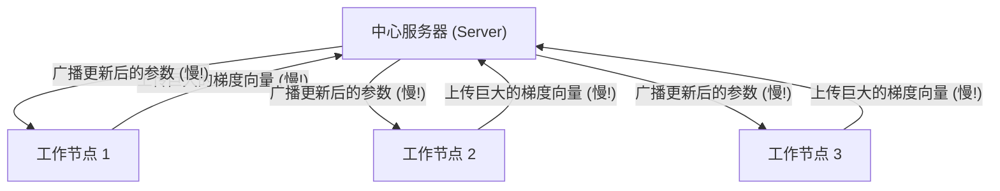

### 4\. 梯度压缩与误差反馈 (Compression & Error Feedback)

为了解决上面的通信慢问题，科学家想到了“压缩”。

  * **压缩 (Compression)** ：
    不发送完整的精确数字，而是发送“压缩版”。

      * **Top-k**：只发送数值最大的前 $k$ 个梯度，其他的当做 0。
      * **Quantization (量化)** ：把 32 位浮点数变成 8 位甚至更低。
      * 论文中提到的压缩算子 $\mathcal{C}$ 满足一定的数学性质（ $\alpha$-contraction ），即压缩后的向量与原向量差距不会太大 。

  * **误差反馈 (Error Feedback)** ：
    如果你每次都把“不重要”的小数值丢掉（比如 Top-k 丢掉的部分），累积起来就会造成巨大的**误差（Bias）** ，导致模型训练失败。

      * **解决方案**：把这轮没发送出去的“残差”（Error）记在小本本上，加到下一轮的梯度里一起发。这叫“误差反馈”或“误差补偿” 。

### 5\. 动量 (Momentum)

在优化过程中，为了防止震荡并加速收敛，引入了物理学中的“动量”概念。

  * **通俗解释**：
    就像开车，你不能只看当下的路况（当前的梯度），还要考虑之前的速度和惯性（之前的梯度）。

      * 公式体现： $m_t = (1-\rho)\cdot m_{t-1} + \rho \cdot \nabla f$ 。
      * 这里的 $m_t$ 是动量，它融合了历史信息。

  * **论文的创新点**：
    大多数以前的方法只压缩**梯度**。这篇论文提出要压缩**动量**（Compressed Momentum）。因为动量比单纯的梯度更平滑，但也引入了更复杂的理论分析难度。论文提出了两种算法：

    1.  **SGDAM-PEF**：使用普通的误差反馈压缩动量 。
    2.  **SGDAM-REF**：使用递归误差反馈（Recursive Error-Feedback）压缩动量，这种方法理论性质更好 。

### 总结：这篇论文在做什么？

把以上知识点串起来：
这篇论文提出了一种在**多台机器（分布式）上训练博弈模型（Minimax）的方法。为了跑得快，它使用了动量（Momentum）** 。为了不堵车（解决通信瓶颈），它把要传输的动量数据进行了**压缩**，并利用**误差反馈**技术保证压缩后模型依然能准确收敛。

-----

**我可以为您做的下一步：**
如果您已经理解了这些基础概念，我可以为您详细解析论文中的 **Algorithm 1 (SGDAM-PEF)** 或 **Algorithm 2 (SGDAM-REF)** 的具体执行步骤，或者解释作者是如何证明这些算法收敛的（Theorem 1 & 2）。您希望先了解哪部分？

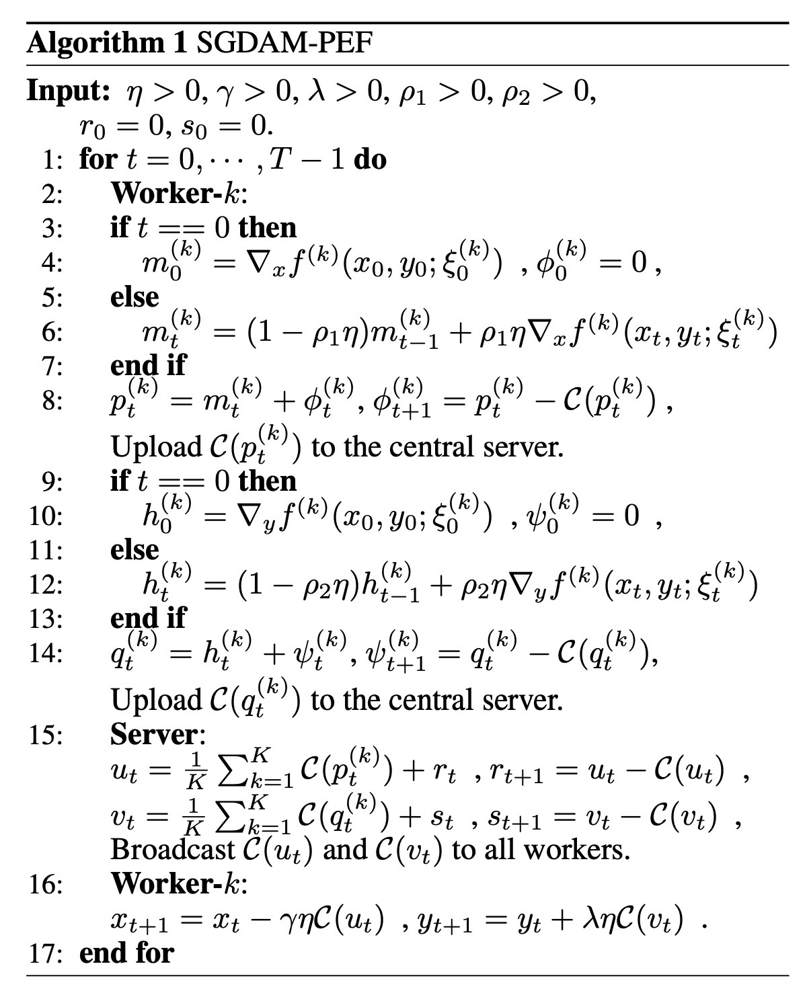   

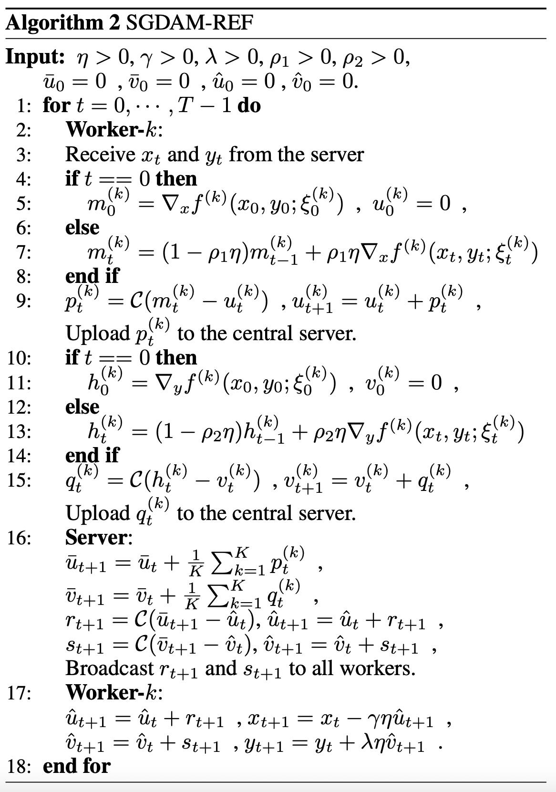   

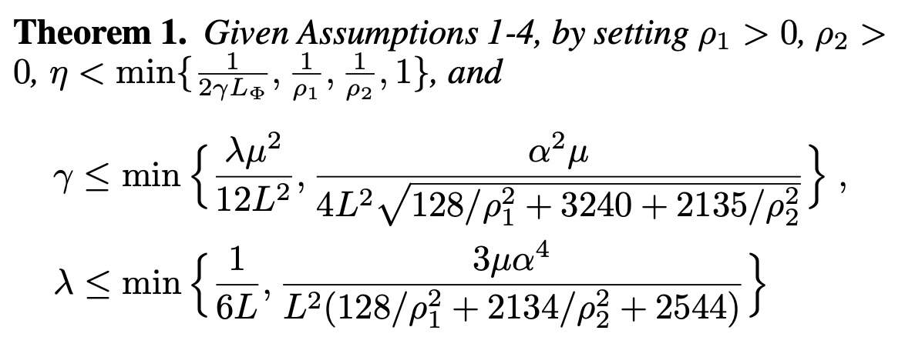   

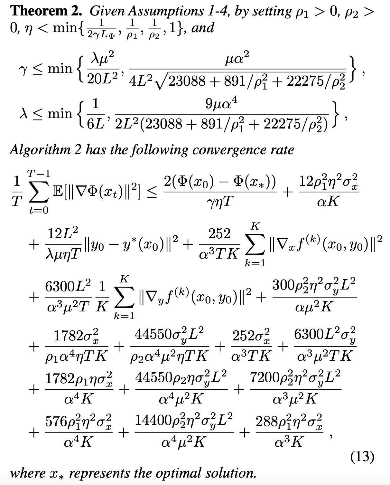   
  
## 2 解读论文 
  
这份论文《Communication-Efficient Stochastic Gradient Descent Ascent with Momentum Algorithms》（基于动量的通信高效随机梯度下降上升算法）主要解决了一个在**分布式机器学习**中非常具体且棘手的问题：

**“如何在多台机器上训练复杂的极小极大（Minimax）模型时，既能利用动量加速，又能把原本巨大的通信量压缩到最小，且不影响模型精度？”**

以下是对这篇论文的通俗易懂解读。

-----

### 1\. 背景与痛点：为什么要解决这个问题？

在理解算法之前，我们需要先明白作者面对的三个层层递进的难题：

1.  **极小极大问题 (Minimax Problem) 很重要：**
    很多现代机器学习模型（如对抗生成网络 GANs、针对不平衡数据的 AUC 最大化）本质上都是在找一个“鞍点”——即在某个维度上最小化误差，在另一个维度上最大化收益 。这比单纯的最小化问题（如普通分类）要难得多。
2.  **分布式训练通讯慢：**
    当数据量很大时，我们需要多台机器（Workers）一起算。但是，机器之间频繁传输巨大的参数或梯度（Gradient），这会导致“通信瓶颈”。算得快，传得慢，整体效率还是低 。
3.  **现有的“压缩技术”不够用：**
    为了传得快，大家通常会把数据“压缩”（比如只传最大的几个数，其他的丢掉）。但是，现有的压缩算法大多是针对普通“最小化”问题的，直接套用到“极小极大”问题上容易失效 。此外，如何在引入“动量（Momentum）”这种加速技巧的同时还能进行压缩，在理论上非常难证明 。

**这篇论文的创新点：** 提出了两种新算法（SGDAM-PEF 和 SGDAM-REF），实现了在 Minimax 问题中，对**动量**进行**双向压缩**（上传和下载都压缩），并给出了严格的数学证明 。

-----

### 2\. 核心解决方案：双向动量压缩

论文提出了两个算法，核心思想都是利用 **误差反馈（Error Feedback）** 机制来抵消压缩带来的精度损失。

#### 核心流程图解

传统的分布式训练是传输原始梯度，而这篇论文做的是传输“压缩后的动量”。

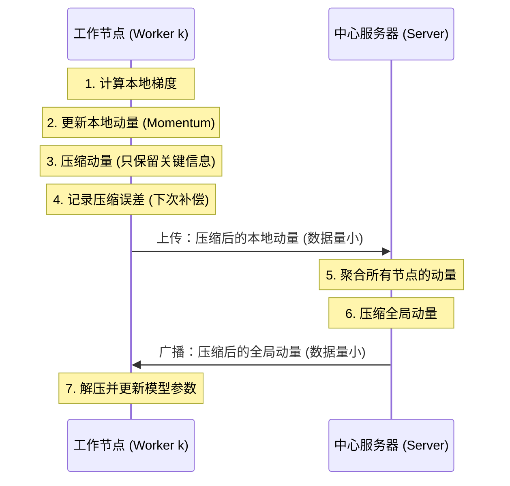

#### 算法 1：SGDAM-PEF (Plain Error Feedback) 

   

  * **直观理解：** “有借有还”。
  * **机制：**
    1.  Worker 计算出动量 $m$ 。
    2.  在发送给 Server 之前，加上还没有发出去的“旧账”（之前的压缩误差）。
    3.  进行压缩（比如只取最大的 1% 的数值），发送出去。
    4.  把这次没发出去的“残差”记在小本本上，留给下一次迭代用 。
    5.  **双向性：** Server 给 Worker 发回更新时，也用同样的逻辑进行压缩 。

#### 算法 2：SGDAM-REF (Recursive Error Feedback) 

   

  * **直观理解：** “只传变化量”。
  * **机制：**
      * 这是更高级的版本。它不直接压缩动量本身，而是压缩“当前动量”与“上一次估计的动量”之间的**差值** 。
      * **优势：** 这种方法的数学性质更好，理论上可以保证压缩带来的误差会随着训练逐渐收敛到 0，比第一种算法更稳定 。

-----

### 3\. 关键理论贡献：它真的收敛吗？

对于搞算法的人来说，最怕的就是用了压缩和动量后，模型震荡不收敛。作者在 **非凸-强凹（Nonconvex-Strongly-Concave）** 的假设下证明了：

1.  **收敛速度：** 算法的收敛速率可以达到 $O(1/\epsilon^4)$ ，这与不压缩的单机算法处于同一量级 。也就是说，压缩并没有破坏算法的根本收敛能力。
2.  **线性加速 (Linear Speedup)：** 如果你有 $K$ 个 Worker，收敛速度确实能提升 $K$ 倍。这证明了增加机器不仅能分摊存储，确实能加速训练 。
3.  **压缩代价：** 压缩操作确实会带来一点点额外的迭代次数成本（由压缩比 $\alpha$ 决定），但考虑到通信时间的大幅减少，总体时间是划算的 。

-----

### 4\. 实验验证：AUC 最大化任务

为了证明算法好用，作者选择了一个经典的 Minimax 应用场景： **不平衡数据的 AUC 最大化分类**（例如：在很多猫和狗的照片中，把本来就很少的某种样本识别出来）。

**实验设置：**

  * **数据集：** CIFAR10, CIFAR100, Melanoma（皮肤癌检测）等 。
  * **对比对象：**
      * SGDM (普通动量梯度下降，优化交叉熵)
      * SGDAM (不压缩的动量梯度下降上升)
      * SGDAM-NEF (压缩但不带误差反馈，用来做反面教材) 。

**实验结果图表解读：**

  * **图 1 (Epoch vs AUC)：** 展示了随着训练轮数增加，模型的准确率变化。  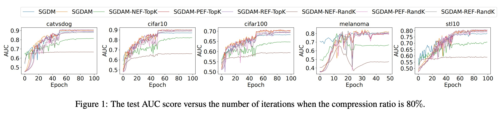   

      * **现象：** 使用 Top-k 压缩（只传最大的 k% 数据）的 SGDAM-PEF 和 SGDAM-REF 曲线，几乎和**完全不压缩**的基准线（SGDAM）重合 。
      * **结论：** 压缩没有降低模型最终的精度。

  * **图 2 (通信量 vs AUC)：**  这是最关键的图。  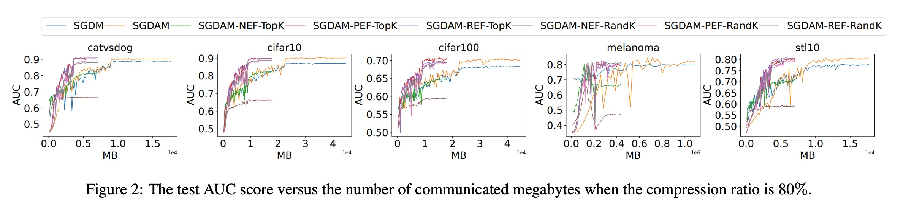   

      * **X轴：** 传输的数据量 (MB)。 **Y轴：** AUC 得分。
      * **现象：** 论文中的算法（红色和紫色的线）几乎是垂直上升的，意味着它们**只用了极少的流量**就达到了很高的精度。而传统算法（橙色线）因为传输数据太多，还在很右边慢慢爬坡 。
      * **结论：** 极其节省通信成本。

  * **图 3 (压缩比的影响)：**  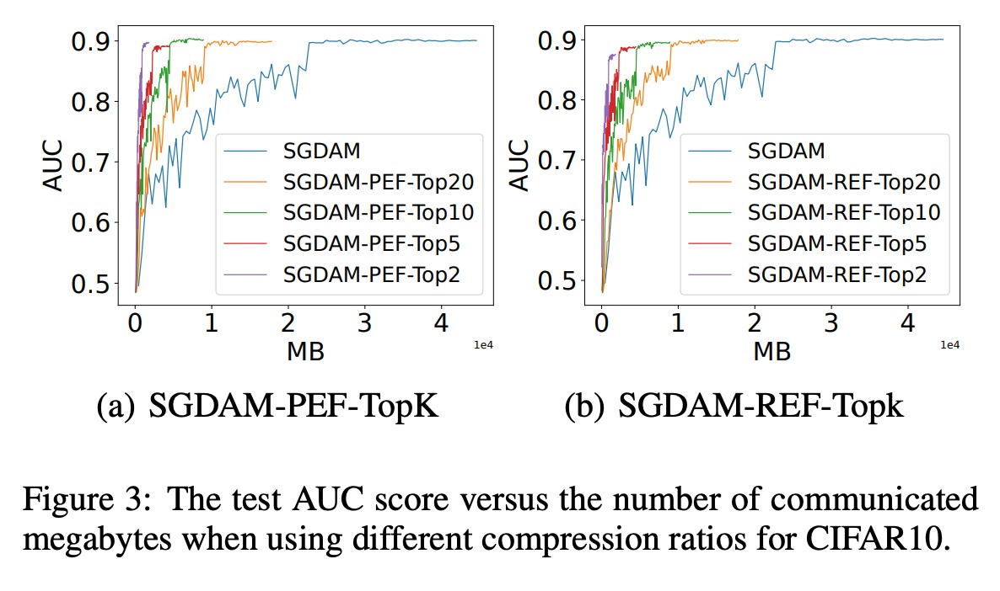   


* 作者尝试了极其激进的压缩，比如 Top-5% 甚至 Top-2%（丢掉 98% 的数据）。
* **结果：** 即使丢掉 95% 的数据，SGDAM-REF 依然能达到和全量数据几乎一样的效果 。


-----

### 5\. 总结与应用价值

**一句话总结：**
这篇论文告诉我们，在分布式训练复杂的对抗性模型（如 AUC 优化）时，你完全可以把传输的数据压缩掉 80% 甚至 95%，只要加上合理的**误差反馈机制**，模型照样能训练得又快又好。

**核心价值：**

1.  **首创性：** 第一个为分布式 Minimax 问题设计了带有理论保证的通信高效算法 。
2.  **双向压缩：** 不仅让 Worker 上传变快，也让 Server 广播变快，实现了全链路加速 。
3.  **实用性：** 在处理医疗图像（如 Melanoma 数据集）等正负样本严重不平衡的场景下，能通过优化 AUC 获得更好的分类器，且训练成本低 。
  
## 3 术语 
  
这篇论文《Communication-Efficient Stochastic Gradient Descent Ascent with Momentum Algorithms》主要讨论了如何在多台机器协同训练模型时，通过“压缩”传输数据来提高速度，同时保证模型效果。

以下是论文中的核心术语及其通俗易懂的中文解读：

### 1\. 核心问题与背景

#### **分布式极小极大优化 (Distributed Minimax Optimization)**

  * **原文引用**:
  * **通俗解读**:
    想象一群人（分布式的工作节点 Workers）和一个指挥官（服务器 Server）一起玩一个博弈游戏。
      * **极小极大 (Minimax)** : 游戏的目标很矛盾，一方面想让某个数值（损失）最小化，另一方面又想让另一个数值最大化。就像警察抓小偷，警察想缩短距离（最小化），小偷想拉大距离（最大化）。
      * **分布式**: 数据太多，一个人算不过来，所以分给好多人一起算，然后大家把结果汇总给指挥官。

#### **随机梯度下降上升 (SGDA - Stochastic Gradient Descent Ascent)**

  * **原文引用**:
  * **通俗解读**:
    这是解决上面那个博弈游戏的方法。
      * **随机**: 每次不看所有数据，只随机抽查一小部分数据来做决定（因为数据太多看不完）。
      * **下降上升**: 对于要最小化的目标（如警察），就往低处走（下降）；对于要最大化的目标（如小偷），就往高处走（上升）。

#### **非凸-强凹 (Nonconvex-Strongly-Concave)**

  * **原文引用**:
  * **通俗解读**:
    这是形容这个游戏的“地形”有多复杂。
      * **非凸**: 地形崎岖不平，有很多山谷和山峰，容易迷路（很难找到全局最优解）。
      * **强凹**: 在这就好比在某个方向上，地形像一个倒扣的很陡的碗，不仅只有一个最高点，而且很容易找到这个最高点。这是一种数学上的假设，能让证明算法有效性变得稍微容易一点。

-----

### 2\. 关键技术与创新

#### **动量 (Momentum)**

  * **原文引用**:
  * **通俗解读**:
    类似于物理中的惯性。在优化模型时，不要只看当前的下坡方向（梯度），还要看看之前的速度。如果之前一直往这个方向冲，那现在就继续借着惯性冲，哪怕遇到一点小坑也不容易被卡住。
      * **论文创新**: 以前的方法大多只压缩“梯度”，这篇论文挑战高难度，直接压缩“动量” 。

#### **通信压缩 (Communication Compression)**

  * **原文引用**:
  * **通俗解读**:
    Worker 和 Server 之间打电话汇报工作，但是电话费（通信带宽）很贵，或者信号不好（延迟高）。
      * **压缩**: 不把每句话都完整说出来，而是只挑最重要的几个字说（比如 Top-k 压缩，只传数值最大的前 k%）。
      * **双向压缩 (Two-way Compression)** : 以前很多方法只在 Worker 汇报给 Server 时压缩（上行）。这篇论文里，Server 给 Worker 下达指令时也压缩（下行），双向省流 。

#### **误差反馈 (Error Feedback)**

  * **原文引用**:
  * **通俗解读**:
    这就好比“记账”。因为压缩（比如只传最大的数）会丢掉一些信息，如果不理这些丢掉的信息，积少成多，模型最后这就歪了。
      * **机制**: 这次没传出去的信息（误差），我记在小本本上。下次传数据的时候，先把上次的欠账补上，再进行压缩。这样长期来看，所有信息都传出去了，没有丢失。


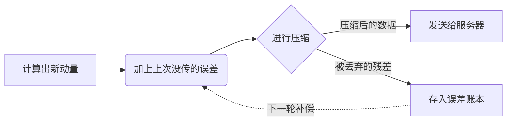

#### **递归误差反馈 (Recursive Error-Feedback, REF)**

  * **原文引用**:
  * **通俗解读**:
    这是误差反馈的升级版，对应论文中的 **Algorithm 2**。     
      * 普通误差反馈是“有借有还”。
      * 递归误差反馈是“只传变化”。它压缩的是“当前动量”和“上一次估计的动量”之间的**差值**。因为随着训练进行，动量变化会越来越小，这个差值也会越来越小，压缩起来更容易，误差收敛得更快 。

-----

### 3\. 应用场景

#### **AUC 最大化 (AUC Maximization)**

  * **原文引用**:
  * **通俗解读**:
    AUC 是衡量分类器好坏的一个指标。
      * 通常我们优化的是“准确率”，但在数据不平衡（比如 100 张图里只有 1 张是猫）的情况下，全猜“不是猫”准确率也有 99%，但这没意义。
      * AUC 能更好地衡量这种情况下模型能不能把猫排在非猫前面。论文通过把 AUC 计算转化成一个 Minimax 问题来优化它 。

#### **非平衡数据分类 (Imbalanced Data Classification)**

  * **原文引用**:
  * **通俗解读**:
    就是上面提到的情况，正样本（比如癌症病人）和负样本（健康人）数量差距巨大。论文用 AUC 最大化来解决这个问题，使得模型在少数类样本上也能表现良好 。

-----

### 总结图示 (论文算法架构)

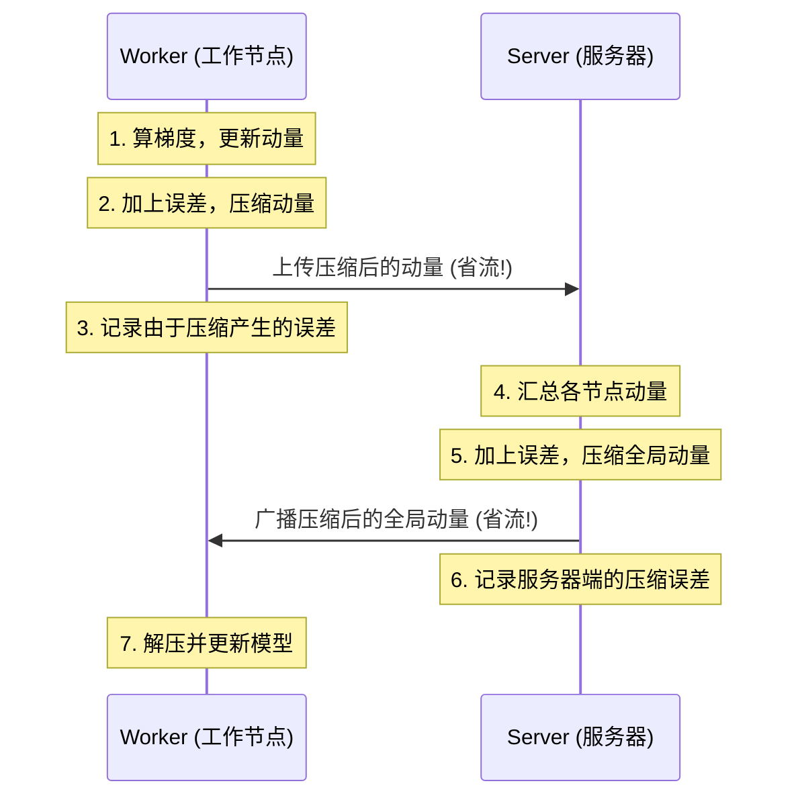

这篇论文的核心贡献就是证明了：即使你为了省流量把动量信息压缩得很厉害（比如只传 1% 的数据），只要配合**误差反馈**机制，在这个复杂的 Minimax 游戏中，大家依然能通过合作找到最优解（收敛），而且速度还很快（线性加速）。
  
## 参考        
         
https://www.ijcai.org/proceedings/2023/0512.pdf    
        
<b> 以上内容基于DeepSeek、Qwen、Gemini及诸多AI生成, 轻微人工调整, 感谢杭州深度求索人工智能、阿里云、Google等公司. </b>        
        
<b> AI 生成的内容请自行辨别正确性, 当然也多了些许踩坑的乐趣, 毕竟冒险是每个男人的天性.  </b>        
    
#### [PolarDB 学习图谱](https://www.aliyun.com/database/openpolardb/activity "8642f60e04ed0c814bf9cb9677976bd4")
  
  
#### [PostgreSQL 解决方案集合](../201706/20170601_02.md "40cff096e9ed7122c512b35d8561d9c8")
  
  
#### [德哥 / digoal's Github - 公益是一辈子的事.](https://github.com/digoal/blog/blob/master/README.md "22709685feb7cab07d30f30387f0a9ae")
  
  
#### [About 德哥](https://github.com/digoal/blog/blob/master/me/readme.md "a37735981e7704886ffd590565582dd0")
  
  

  
