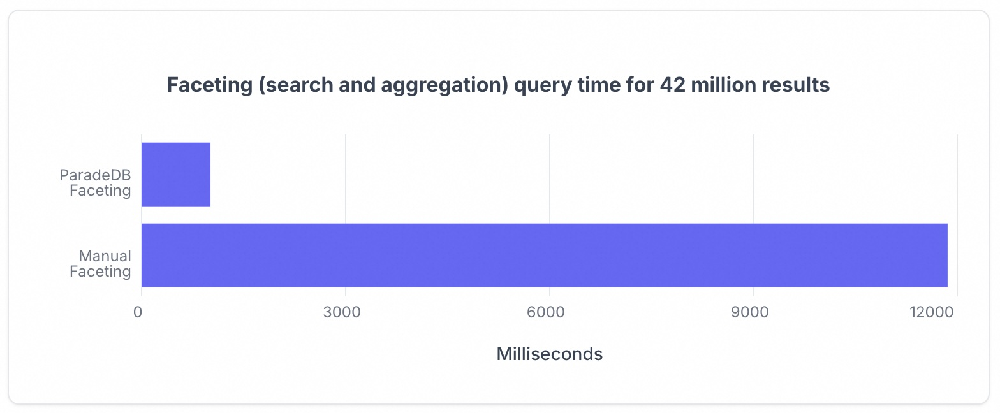
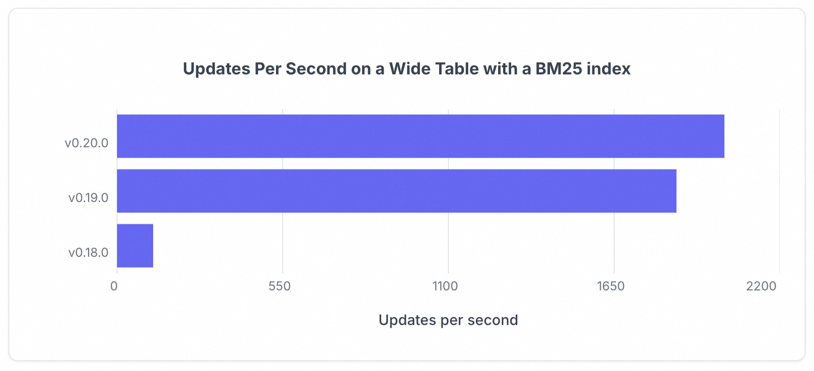

## PG搜索引擎插件 ParadeDB 发布 v0.20.0：更简洁，更快速       
        
### 作者        
digoal        
        
### 日期        
2025-12-08        
        
### 标签        
PostgreSQL , 搜索 , 全文检索 , pg_search , paradedb , tantivy       
        
----        
        
## 背景       
说起搜索, 大家脑子里会蹦出哪些关键词呢?  
  
全文检索 , 中文分词 , 分词矢量 , 搜索条件 , 关键词匹配 , tf/idf , ranking , bm25 , elasticsearch , tantivy , Lucene , tsvector , tsquery , GIN索引 , rum索引 , zoombdb索引   
  
可能差不多也就这些?  
  
虽然PG内置了全文检索功能, 但是中文分词要依赖外部, ranking也有其局限性, 所以在PG的插件生态中依旧有很多插件厂商前赴后继的推出高级的分词插件, 例如vectorchord-bm25, 专注于中文分词的pg_jieba. 还有本文提到的paradedb.  
  
让我们来看看 paradedb (号称PG用户的ElasticSearch替代品) 近期发布的 v0.20.0：更简洁，更快速! 到底如何?      
  
内容来自: https://www.paradedb.com/blog/paradedb-0-20-0  
  
## paradedb v0.20.0：更简洁，更快速!  
  
每一个构建现代化应用程序的开发者都面临着同样的困境：您的用户需要**实时搜索 (real-time search)** 和**分析 (analytics)** ，但您的数据库架构却迫使您在**一致性 (consistency)** 和**性能 (performance)** 之间做出选择。故事通常始于“只是一个简单的搜索框”，但不可避免地演变成复杂的**分布式架构 (distributed architecture)** ，带来**最终一致性 (eventual consistency)** 、**运营开销 (operational overhead)** ，以及对搜索结果是否反映现实的持续担忧。  
  
当 **Ming** 和我创立 **ParadeDB** 时，我们有一个简单的愿景：开发者不应该被迫在 **ACID 事务 (ACID transactions)** 的安全性与**现代搜索 (modern search)** 的强大功能之间做出选择。今天，通过 **ParadeDB 0.20.0**，我们正在使这个愿景变得更具**性能 (performant)** 且更易于使用。  
  
**ParadeDB 0.20.0** 在对实际应用程序至关重要的三个方面实现了突破：消除了**分析差距 (analytics gap)** 的**搜索聚合 (search aggregations)** 、减少**认知开销 (cognitive overhead)** 的更简洁 **API (Application Programming Interface)** ，以及随您的应用程序扩展而非反作用于它的**写入性能 (write performance)** 。  
  
### 搜索聚合：无需架构的分析  
  
现代应用程序通常需要的不仅仅是搜索：它们需要在搜索结果上进行**分面 (facets)** 、**计数 (counts)** 、**直方图 (histograms)** 和其他**分析 (analytics)** 。虽然**专用搜索引擎 (dedicated search engines)** 擅长**聚合 (aggregations)** ，但当您基于**事务型数据库 (transactional database)** 进行构建时，通常需要对**查询规划器 (query planner)** 进行一番“体操”，才能在不二次访问**索引 (indexes)** 的情况下让事情运转起来。  
  
我们有一段时间以来一直拥有基于搜索查询的快速**聚合 (aggregations)** 功能，但这并不是我们经常谈论的事情。在 **0.20.0** 版本中，我们彻底改进了这项功能，使**搜索分面 (search faceting)** （计算记录组的计数）成为**一等公民 (first-class citizen)** 。  
  
我们的**搜索分析 (search analytics)** 由一个新的 `pdb.agg()` 函数提供支持，该函数可以通过两种方式使用：  
  
1.  作为**聚合函数 (aggregate function)** 使用，运行搜索查询并提供**聚合结果 (aggregate results)** 。  
2.  作为**窗口函数 (window function)** 使用，运行搜索查询并在提供 **TopN 搜索结果 (TopN search result)** 的同时提供**聚合结果 (aggregate results)** 。  
  
这两种变体都接管了部分**查询规划和执行 (query planning and execution)** ，将尽可能多的工作推送到 **ParadeDB 索引 (ParadeDB index)** 内部。这消除了对多重查询、**公用表表达式 (CTEs)** 或手动**聚合 (manual aggregations)** 的需求。  
  
我们的**聚合 (aggregations)** 在大型搜索结果集（数百万条记录）方面表现出色，对于超过 4000 万条结果，**搜索分面 (search faceting)** 的性能比次优方法（**ParadeDB** 搜索返回所有结果，然后馈送到 **PostgreSQL 聚合器**）快了一个数量级（完整的详细信息将发布在另一篇**搜索聚合 (search aggregations)** 文章中）。  
  
**4200 万条结果的分面（搜索和聚合）查询时间**  
  
   
  
`pdb.agg()` 还可以与一个 **JSON** 参数一起使用，该参数与 **Elasticsearch 聚合 API (Elasticsearch aggregations API)** 非常相似，并且在许多情况下被映射到普通的 **SQL 结构 (plain SQL constructs)** （如 `COUNT(*)`）。  
  
让我们看一些示例。  
  
最基本的调用根本不使用 `pdb.agg()`，它只使用一个 `COUNT(*)`，该调用会被捕获并使用**搜索聚合 (search aggregation)** 进行规划。  
  
```sql  
SELECT count(*)  
FROM mock_items  
WHERE description ||| 'shoes';  
  
 count  
-------  
     3  
(1 row)  
```  
  
这也可以通过**窗口函数 (window function)** 来完成，它会添加一个额外的列，包含整个结果集的计数（而不仅仅是返回的行）。  
  
```sql  
SELECT id, description,  
       count(*) OVER (),  
FROM mock_items  
WHERE description ||| 'shoes'  
ORDER BY rating DESC  
LIMIT 2;  
  
 id |     description     | count  
----+---------------------+-------  
  3 | Sleek running shoes |     3  
  5 | Generic shoes       |     3  
(2 rows)  
```  
  
一个更复杂的示例使用了 **JSON API** 来表达对 **TopN 查询 (TopN query)** 的**术语分面 (terms facet)** ，然后也作为一个额外的 **JSON** 列添加（此数据在每行中重复，我们可能会在未来进行优化）。当您想要显示 **TopN 搜索结果 (TopN search results)** ，同时也展示整个搜索查询的**分布 (distribution)** 时，这非常有用。在一个高效的**索引遍历 (index pass)** 中完成此操作是 **Elasticsearch API** 的一个优点，我们很喜欢并将其在 **SQL** 中实现。  
  
```sql  
SELECT id, description,  
       pdb.agg('{"terms": {"field": "rating"}}') AS facets  
FROM mock_items  
WHERE description ||| 'shoes'  
ORDER BY rating DESC  
LIMIT 2;  
  
 id |     description     |                   facets  
----+---------------------+---------------------------------------------  
  3 | Sleek running shoes | {"buckets": [{"key": 4, "doc_count": 1},  
                                         {"key": 5, "doc_count": 1},  
                                         {"key": 3, "doc_count": 1} ]}  
  3 | Generic shoes       | {"buckets": [{"key": 4, "doc_count": 1},  
                                         {"key": 5, "doc_count": 1},  
                                         {"key": 3, "doc_count": 1} ]}  
(2 rows)  
```  
  
在幕后，这些查询使用我们的 **BM25 索引 (BM25 indexes)** 进行**全文搜索 (full-text search)** 和**列式分析 (columnar analytics)** 。您可以获得跨数百万文档的亚秒级**分面计算 (facet calculations)** ，同时保持与您的**事务性数据 (transactional data)** 的完美**一致性 (consistency)** 。  
  
### v2 API：更少魔法，更多清晰  
  
**v2 API: Less Magic, More Clarity**  
  
如果这些**聚合 (aggregation)** 功能难以使用，那么它们的重要性就会大打折扣。因此，在进行性能工作的同时，我们也将 **v2 API** 提升为默认体验，其差异在于更直观的 **SQL 用户体验 (SQL UX)** 立刻显现。  
  
**v2 API** 最显著的优势之一是它消除了大多数其他搜索系统中存在的**模式重复 (schema duplication)** 。使用 **Elasticsearch**，您必须定义两次数据结构：一次在您的**应用程序数据库 (application database)** 中，另一次在您的 **Elasticsearch 映射 (Elasticsearch mapping)** 中：  
  
```json  
// Elasticsearch mapping - separate from your database schema  
{  
  "mappings": {  
    "properties": {  
      "id": { "type": "integer" },  
      "description": { "type": "text", "analyzer": "english" },  
      "category": { "type": "keyword" }  
    }  
  }  
}  
```  
  
即使是我们自己的 **v1 API** 也需要单独的 **JSON 配置 (JSON configuration)** 来配置**索引 (indexes)** 。**v2 API** 倾向于我们对“ **搜索数据库 (search database)** ”的定义，并从您的 **PostgreSQL 表模式 (PostgreSQL table schema)** 中推断出大部分**索引模式 (index schema)** 。您直接在**索引创建语句 (index creation statement)** 中定义**文本处理 (text processing)** 和**搜索行为 (search behavior)** ，从而消除了维护并行**模式定义 (parallel schema definitions)** 的需要。  
  
许多用户由于**分词器 (tokenizers)** 配置不正确，在他们的前几个查询中看到了意外的行为。在 **v0.20.0** 中，我们改进了**分词器默认设置 (tokenizer defaults)** ，并使其在创建**索引 (indexes)** 时成为**第一方体验 (first-party experience)** ，消除了任何歧义。现在**索引创建 (Index creation)** 更简洁，在行内指定了**分词器 (tokenizers)** 和选项：  
  
```sql  
CREATE INDEX search_idx ON mock_items  
USING bm25 (id,  
           title,  
           (description::pdb.simple('stemmer=english',  
                                    'stopwords_language=english')),  
           category::pdb.literal)  
WITH (key_field='id');  
```  
  
搜索也得到了改进，引入了新的**合取 (conjunction)** 运算符 `&&&` 和**析取 (disjunction)** 运算符 `|||`，以及访问常见功能如**加权 (boosting)** 的简单方法。  
  
```sql  
SELECT id, pdb.score(id), description, category  
FROM mock_items  
WHERE description ||| 'shoes'::pdb.boost(2) OR category ||| 'footwear'  
ORDER BY score DESC  
LIMIT 5;  
  
 id |   score   |     description      | category  
----+-----------+----------------------+----------  
  5 |  7.660918 | Generic shoes        | Footwear  
  3 |  6.872712 | Sleek running shoes  | Footwear  
  4 |  6.872712 | White jogging shoes  | Footwear  
 13 | 1.9362776 | Sturdy hiking boots  | Footwear  
 23 | 1.9362776 | Comfortable slippers | Footwear  
(5 rows)  
```  
  
请关注另一篇展示所有新的 **v2 API** 功能的文章。现在，您可以在我们的**文档 (documentation)** 中探索完整的 **API 参考 (API reference)** 。  
  
### 写入性能：随您扩展的更新  
  
我们从 **0.19.0** 到 **0.20.0** 的**性能 (performance)** 故事揭示了我们对**事务性系统 (transactional systems)** 中搜索工作方式的看法的真相。传统的**搜索引擎 (Traditional search engines)** 将更新视为昂贵的操作，需要仔细的**批处理 (batching)** 和**预定的维护窗口 (scheduled maintenance windows)** 。乍一看，这似乎是合理的，因为**搜索索引 (search indexes)** 是复杂的数据结构，需要时间进行**重组 (reorganize)** 。  
  
潜在的问题源于像 **Lucene** 和 **Tantivy** 这样的**搜索引擎 (search engines)** 处理数据的方式。这些系统使用**不可变数据结构 (immutable data structures)** 来处理它们的**段 (segments)** ，这意味着更新文档中的单个字段需要重写该**段 (segment)** 中的所有其他字段，从而产生**写入放大 (write amplification)** 。  
  
但这对于实际应用程序来说恰恰是错误的。大多数**搜索工作负载 (search workloads)** 并不是**批量导入 (bulk imports)** ；它们是用户创建内容、修改记录和与您的系统交互时的**单个更新流 (streams of individual updates)** 。**ParadeDB** 将这些小型、频繁的更新视为**一等公民 (first-class citizens)** ，其性能应与**插入 (inserts)** 一样好。  
  
我们的解决方案基于 **0.19.0** 中的两个关键**优化 (optimizations)** ，现在在我们的 **LSM 引擎 (LSM engine)** 中默认启用：**可变段 (mutable segments)** 和**后台合并 (background merging)** 。  
  
**可变段 (Mutable segments)** 引入了一个专门为**写入 (writes)** 优化的**小型缓冲区 (small buffer)** 。我们不是立即将更改写入**不可变段 (immutable segments)** ，而是在此**缓冲区 (buffer)** 中存储指向新行的**指针 (pointer)** ，完全消除了**写入放大 (write amplification)** 问题。一旦**缓冲区 (buffer)** 变满，**后台合并 (background merging)** 会将其**序列化 (serialize)** 为**不可变结构 (immutable structure)** ，而不会阻塞正在进行的**写入操作 (write operations)** 。**后台合并 (Background merging)** 将所有**合并 (merging)** （ 包括**可变段合并 (mutable segment merging)** ）移至**后台 (background)** ，并增加了我们专用于此任务的**工作线程 (workers)** 数量。  
  
自从我们在 **0.19.0** 中首次引入这些功能以来，**单行更新性能 (single row update performance)** 提高了两个数量级以上；这种改进可以改变您对**事务性搜索 (transactional search)** 的看法。  
  
**具有 BM25 索引的宽表上的每秒更新次数 (Updates Per Second)**  
  
  
  
同样，您可以期待一篇包含所有**数据结构 (data-structure)** 详细信息的后续文章。  
  
### 为什么这很重要  
  
**版本 0.20.0** 通过直接在 **PostgreSQL** 中添加快速**搜索聚合 (search aggregations)** 、简化的 **v2 API** 和显着改进的**写入性能 (write performance)** ，巩固了 **ParadeDB** 作为 **Elasticsearch 替代品 (alternative to Elasticsearch)** 的地位。对于重视**事务一致性 (transactional consistency)** 和**运营简单性 (operational simplicity)** 的团队来说，我们提供了一种实现**现代搜索功能 (modern search capabilities)** 的途径，而无需管理**独立系统 (separate systems)** 的复杂性。  
  
准备好看到**搜索聚合 (search aggregations)** 和新的 **API** 投入实际应用了吗？试试 **ParadeDB 0.20.0**，体验**搜索 (search)** 、**分析 (analytics)** 和**事务 (transactions)** 无缝协作的感觉。  
  
最后, 希望PG的生态越来越发达, 让PG用户能在一个数据库中就完成所有业务需求, 即节省了数据库成本, 又减轻了运维负担和开发复杂度!    
     
#### [PolarDB 学习图谱](https://www.aliyun.com/database/openpolardb/activity "8642f60e04ed0c814bf9cb9677976bd4")
  
  
#### [PostgreSQL 解决方案集合](../201706/20170601_02.md "40cff096e9ed7122c512b35d8561d9c8")
  
  
#### [德哥 / digoal's Github - 公益是一辈子的事.](https://github.com/digoal/blog/blob/master/README.md "22709685feb7cab07d30f30387f0a9ae")
  
  
#### [About 德哥](https://github.com/digoal/blog/blob/master/me/readme.md "a37735981e7704886ffd590565582dd0")
  
  

  
