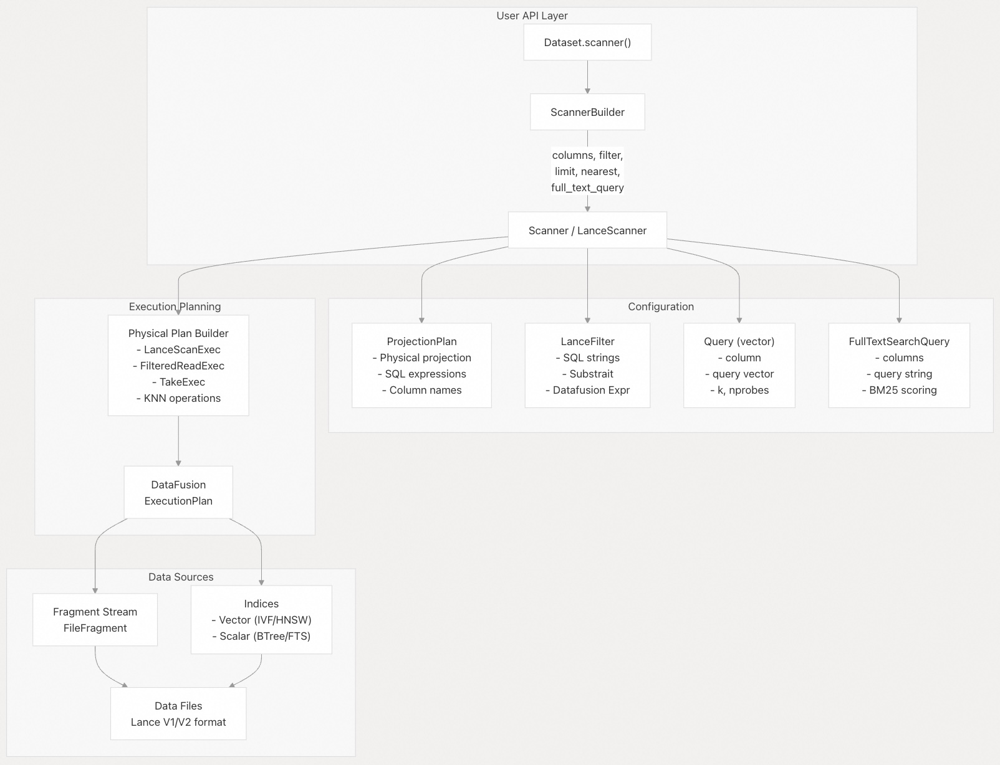
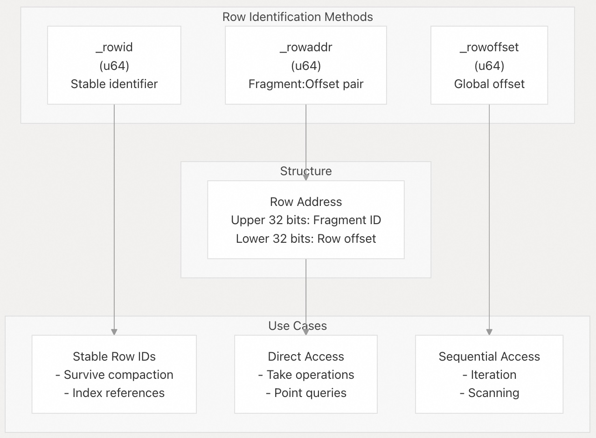
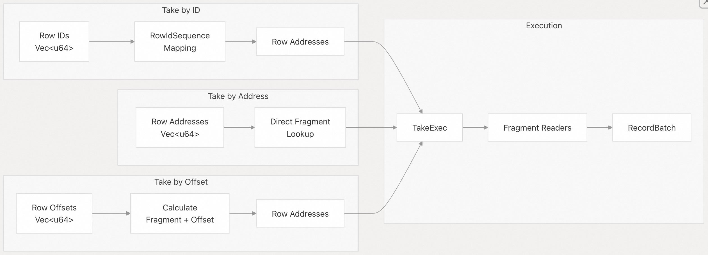
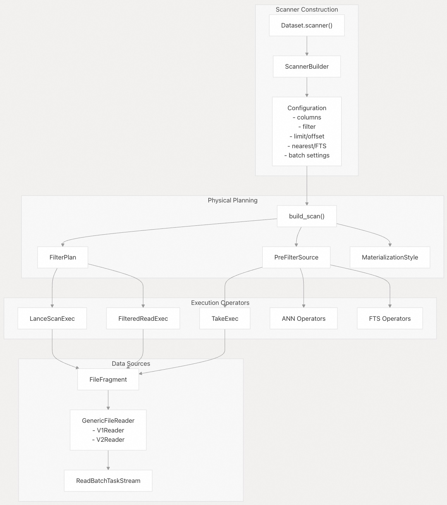

## Lance 源码学习: 4 读取数据 (Reading Data)  
                                                          
### 作者                                                          
digoal                                                          
                                                          
### 日期                                                          
2025-12-08                                                          
                                                          
### 标签                                                          
Lance , AI 数据存储与搜索引擎 , 存储引擎 , 向量索引 , 标量索引 , 全文检索 , 多模态支持 , 零拷贝 , 版本控制 , 时间旅行 , 源码学习 , 随机访问加速 , Parquet                                         
                                                          
----                                                          
                                                          
## 背景                   
本文档描述了如何从 **Lance 数据集** (**Lance Dataset**) 中查询和检索数据。它涵盖了**扫描器 API** (**Scanner API**)，这是读取数据的主要接口，包括基本扫描、**投影** (**Projection**)、**过滤** (**Filter**)、**向量搜索** (**Vector Search**) 和**全文搜索** (**Full-Text Search**) 操作。  
  
-----  
  
## 概述  
  
从 **Lance 数据集**中读取数据是通过 **`Scanner`**（**扫描器**）抽象来执行的，它提供了一个**构建器风格的 API**（**builder-style API**）用于配置查询。**扫描器**支持多种读取模式：  
  
  * **全表扫描**：读取所有行和列  
  * **投影读取**：选择特定列或 SQL 表达式  
  * **过滤读取**：应用谓词来减少返回的行  
  * **向量搜索**：对向量列进行 **k近邻**（**k-nearest neighbor**）查询  
  * **全文搜索**：使用**倒排索引**（**inverted indices**）进行 **BM25** 排名文本搜索  
  * **取操作** (**Take operations**): 通过行 ID、行地址或行偏移量直接检索行  
  
所有读取操作都将数据作为 **Apache Arrow** 的 **`RecordBatch`**（**记录批次**）对象返回，从而实现与 **Arrow 生态系统**的**零拷贝集成**。  
  
**来源:**  
[`rust/lance/src/dataset/scanner.rs` 304-441](https://github.com/lance-format/lance/blob/0204e7e2/rust/lance/src/dataset/scanner.rs#L304-L441)  
[`python/python/lance/dataset.py` 687-920](https://github.com/lance-format/lance/blob/0204e7e2/python/python/lance/dataset.py#L687-L920)  
  
-----  
  
## 扫描器架构  
  
    
  
**扫描器**是通过 **`Dataset.scanner()`** 创建的，它返回一个 **`ScannerBuilder`**（**扫描器构建器**）。配置选项通过构建器方法应用，然后 **`to_scanner()`** 创建一个**不可变**的**扫描器**。该**扫描器**将配置转换为 **DataFusion `ExecutionPlan`**（**执行计划**），该计划被执行以生成 **`RecordBatch`** 对象流。  
  
**来源:**  
[`python/python/lance/dataset.py` 687-920](https://github.com/lance-format/lance/blob/0204e7e2/python/python/lance/dataset.py#L687-L920)  
[`rust/lance/src/dataset/scanner.rs` 317-441](https://github.com/lance-format/lance/blob/0204e7e2/rust/lance/src/dataset/scanner.rs#L317-L441)  
[`rust/lance/src/dataset.rs` 438-920](https://github.com/lance-format/lance/blob/0204e7e2/rust/lance/src/dataset.rs#L438-L920)  
  
-----  
  
## 核心读取模式  
  
### 基本表扫描  
  
最简单的读取模式是检索所有行和列：  
  
```python  
dataset = lance.dataset("path/to/dataset")  
table = dataset.to_table()  
```  
  
这在内部创建并执行了一个具有默认设置的**扫描器**。等效的显式**扫描器**用法是：  
  
```python  
scanner = dataset.scanner()  
table = scanner.to_table()  
```  
  
**来源:**  
[`python/python/tests/test_dataset.py` 66-70](https://github.com/lance-format/lance/blob/0204e7e2/python/python/tests/test_dataset.py#L66-L70)  
[`rust/lance/src/dataset/scanner.rs` 687-920](https://github.com/lance-format/lance/blob/0204e7e2/rust/lance/src/dataset/scanner.rs#L687-L920)  
  
### 投影 (Projection)  
  
**投影**选择要返回哪些列。Lance 支持三种类型的**投影**：  
  
| 投影类型 (Projection Type) | 描述 (Description) | 示例 (Example) |  
| :--- | :--- | :--- |  
| **Column list** (列列表) | 简单列选择 | `columns=["id", "name"]` |  
| **Nested fields** (嵌套字段) | 访问结构体 (**struct**) 子字段 | `columns=["user.email"]` |  
| **SQL expressions** (SQL 表达式) | 计算列 | `columns={"total": "price * quantity"}` |  
  
**投影**在内部由 **`ProjectionRequest`** 表示，它可以是**基于模式的投影**（**schema-based projection**）或 **SQL 表达式**：  
  
```python  
scanner = dataset.scanner(columns=["id", "user.email"])  
# Or with SQL expressions (supported by DataFusion integration)  
scanner = dataset.scanner(columns={"id": "id", "total": "price * quantity"})  
```  
  
**来源:**  
[`rust/lance/src/dataset.rs` 317-424](https://github.com/lance-format/lance/blob/0204e7e2/rust/lance/src/dataset.rs#L317-L424)  
[`python/python/lance/dataset.py` 719-722](https://github.com/lance-format/lance/blob/0204e7e2/python/python/lance/dataset.py#L719-L722)  
  
### 过滤 (Filtering)  
  
**过滤器** (**Filters**) 减少返回的行数。Lance 支持多种**过滤**格式：  
  
    
  
**过滤处理管线 (Filter Processing Pipeline)**  
  
**过滤器**经过解析、优化并下推到尽可能低的级别。**基于统计信息的过滤**（**Statistics-based filtering**）可以跳过整个**数据片段** (**fragments**)，**标量索引** (**scalar indices**) 可以有效地消除行，剩余的谓词在文件读取期间应用。  
  
**来源:**  
[`rust/lance/src/dataset/scanner.rs` 230-302](https://github.com/lance-format/lance/blob/0204e7e2/rust/lance/src/dataset/scanner.rs#L230-L302)  
[`python/python/lance/dataset.py` 723-726](https://github.com/lance-format/lance/blob/0204e7e2/python/python/lance/dataset.py#L723-L726)  
  
-----  
  
## 高级查询类型  
  
### 向量搜索 (Vector Search)  
  
**向量搜索**使用**向量索引**（**vector indices**）或**暴力搜索**（**exhaustive search**）来查找查询向量的 **k近邻**（**k-nearest neighbors**）：  
  
```python  
scanner = dataset.scanner(  
    nearest={  
        "column": "embedding",  
        "q": query_vector,  
        "k": 10,  
        "nprobes": 20,  
        "refine_factor": 2  
    }  
)  
```  
  
**关键参数：**  
  
  * **`column`**: 向量列名称  
  * **`q`**: 查询向量 (**query vector**) (numpy array, pyarrow array, 等)  
  * **`k`**: **近邻**的数量  
  * **`nprobes`**: 要探测的 **IVF 分区**（**IVF partitions**）数量（**ANN 搜索**）  
  * **`refine_factor`**: 使用**精确距离**重新对顶尖候选者进行排名  
  * **`use_index`**: 如果为 `False`，则强制进行**暴力搜索**  
  
查询执行会创建利用**向量索引**的专用操作符（**`ANNIvfPartitionExec`**、**`ANNIvfSubIndexExec`**、**`KNNDistanceExec`**）。  
  
**来源:**  
[`python/python/lance/dataset.py` 731-743](https://github.com/lance-format/lance/blob/0204e7e2/python/python/lance/dataset.py#L731-L743)  
[`python/python/tests/test_vector_index.py` 125-169](https://github.com/lance-format/lance/blob/0204e7e2/python/python/tests/test_vector_index.py#L125-L169)  
[`rust/lance/src/dataset/scanner.rs` 367](https://github.com/lance-format/lance/blob/0204e7e2/rust/lance/src/dataset/scanner.rs#L367-L367)  
  
### 全文搜索 (Full-Text Search)  
  
**全文搜索**使用**倒排索引**来进行 **BM25** 排名检索：  
  
```python  
scanner = dataset.scanner(  
    full_text_query={  
        "columns": ["content"],  
        "query": "machine learning"  
    }  
)  
```  
  
搜索查询支持：  
  
  * **简单查询**：匹配任何术语  
  * **短语查询**：匹配确切的短语  
  * **布尔查询**：复杂的 **AND/OR/NOT** 逻辑  
  * **加权查询** (**Boost queries**): 对不同的术语赋予权重  
  
**来源:**  
[`python/python/lance/dataset.py` 794-803](https://github.com/lance-format/lance/blob/0204e7e2/python/python/lance/dataset.py#L794-L803)  
[`rust/lance/src/dataset/scanner.rs` 339-340](https://github.com/lance-format/lance/blob/0204e7e2/rust/lance/src/dataset/scanner.rs#L339-L340)  
  
-----  
  
## 行识别系统  
  
Lance 提供了多种识别和引用行的方式：  
  
    
  
**行识别机制 (Row Identification Mechanisms)**  
  
  * **`_rowid`**: 可选的**稳定标识符**（**stable identifier**），当 **`enable_stable_row_ids=True`** 时，在**数据压缩**（**compaction**）后仍然保留。  
  * **`_rowaddr`**: 物理地址，编码为 **`(fragment_id << 32) | row_offset`**。  
  * **`_rowoffset`**: **数据集**中的逻辑位置（内部使用）。  
  
使用 **`with_row_id=True`** 或 **`with_row_address=True`** 可以将它们包含在查询结果中：  
  
```python  
scanner = dataset.scanner(with_row_id=True, with_row_address=True)  
```  
  
**来源:**  
[`rust/lance/src/dataset/scanner.rs` 431-434](https://github.com/lance-format/lance/blob/0204e7e2/rust/lance/src/dataset/scanner.rs#L431-L434)  
[`python/python/lance/dataset.py` 702-703](https://github.com/lance-format/lance/blob/0204e7e2/python/python/lance/dataset.py#L702-L703)  
[`python/python/tests/test_dataset.py` 377-402](https://github.com/lance-format/lance/blob/0204e7e2/python/python/tests/test_dataset.py#L377-L402)  
  
### 取操作 (Take Operations)  
  
**取操作**通过行标识符检索特定行，无需扫描：  
  
    
  
**取操作流程 (Take Operation Flow)**  
  
**取操作**可以从 **`_rowid`**、**`_rowaddr`** 或 **`_rowoffset`** 上的**过滤器**中发起。**扫描器**会自动检测这些模式，并使用 **`TakeExec`** 将它们转换为高效的**取操作**。  
  
**来源:**  
[`rust/lance/src/dataset/scanner.rs` 443-611](https://github.com/lance-format/lance/blob/0204e7e2/rust/lance/src/dataset/scanner.rs#L443-L611)  
[`rust/lance/src/dataset/take.rs` 1-500](https://github.com/lance-format/lance/blob/0204e7e2/rust/lance/src/dataset/take.rs#L1-L500)  
  
-----  
  
## 批处理配置  
  
数据以**批次**（**batches**）形式返回，以实现高效的内存使用。关键参数：  
  
| 参数 (Parameter) | 默认值 (Default) | 描述 (Description) |  
| :--- | :--- | :--- |  
| **`batch_size`** | 依赖环境 | 目标每批行数 |  
| **`batch_readahead`** | 16 | 预取（**prefetch**）的**批次**数量 |  
| **`fragment_readahead`** | 4（传统）或取决于 CPU | 并发读取的**数据片段**数量 |  
| **`io_buffer_size`** | 2 GiB | 最大 **I/O** 缓冲内存 |  
| **`strict_batch_size`** | `False` | 强制执行精确的**批次大小**（使用缓冲） |  
  
### 批次大小行为 (Batch Size Behavior)  
  
当 **`strict_batch_size=False`**（默认）时，**批次大小**可能会根据**数据片段**边界而变化。当 **`strict_batch_size=True`** 时，**扫描器**会缓冲并**合并**（**coalesces**）数据，以精确返回每批次的 **`batch_size`** 行（最终批次除外）。  
  
**示例:**  
  
```python  
# Variable batch sizes (efficient)  
for batch in dataset.to_batches(batch_size=1024):  
    process(batch)  
  
# Strict batch sizes (predictable)  
for batch in dataset.to_batches(batch_size=1024, strict_batch_size=True):  
    assert batch.num_rows == 1024 or is_last_batch  
```  
  
**来源:**  
[`python/python/tests/test_dataset.py` 166-237](https://github.com/lance-format/lance/blob/0204e7e2/python/python/tests/test_dataset.py#L166-L237)  
[`rust/lance/src/dataset/scanner.rs` 343-407](https://github.com/lance-format/lance/blob/0204e7e2/rust/lance/src/dataset/scanner.rs#L343-L407)  
  
-----  
  
## 扫描排序与物化  
  
### 扫描排序 (Scan Ordering)  
  
扫描可以以两种模式执行：  
  
  * **有序扫描** (**Ordered scanning**，**`scan_in_order=True`**，默认）：按**数据集**顺序，逐个**数据片段**返回**批次**  
  * **无序扫描** (**Unordered scanning**，**`scan_in_order=False`**）：**批次**在可用时立即返回，最大化**吞吐量** (**throughput**)  
  
对于显式排序，请使用 **`order_by`** 参数：  
  
```python  
scanner = dataset.scanner(  
    order_by=[  
        {"column_name": "timestamp", "ascending": True, "nulls_first": False}  
    ]  
)  
```  
  
**来源:**  
[`rust/lance/src/dataset/scanner.rs` 131-174](https://github.com/lance-format/lance/blob/0204e7e2/rust/lance/src/dataset/scanner.rs#L131-L174)  
[`python/python/lance/dataset.py` 756-760](https://github.com/lance-format/lance/blob/0204e7e2/python/python/lance/dataset.py#L756-L760)  
  
### 延迟物化 (Late Materialization)  
  
**延迟物化**控制何时获取列：  
  
  * **早期物化** (**Early materialization**): 获取整个列，然后**过滤**  
  * **延迟物化** (**Late materialization**): 先**过滤**，然后只获取需要的行  
  
```  
# Automatic (heuristic-based)  
scanner = dataset.scanner(filter="price > 100")  
  
# Force all columns late  
scanner = dataset.scanner(filter="price > 100", late_materialization=True)  
  
# Late materialize specific columns  
scanner = dataset.scanner(  
    filter="price > 100",  
    late_materialization=["large_column"]  
)  
```  
  
该**启发式**（**heuristic**）方法对于**云存储**（**cloud storage**）上大于 1000 字节或**本地存储**（**local storage**）上大于 10 字节的列使用**延迟物化**，假设**过滤器**选择大约 0.1% 的行。  
  
**来源:**  
[`rust/lance/src/dataset/scanner.rs` 176-221](https://github.com/lance-format/lance/blob/0204e7e2/rust/lance/src/dataset/scanner.rs#L176-L221)  
[`python/python/lance/dataset.py` 777-793](https://github.com/lance-format/lance/blob/0204e7e2/python/python/lance/dataset.py#L777-L793)  
  
-----  
  
## 扫描器实现细节  
  
    
  
**扫描器规划与执行 (Scanner Planning and Execution)**  
  
**扫描器**首先根据**过滤器**、**索引**和配置确定**最优执行策略**（**optimal execution strategy**）。它创建一个 **`FilterPlan`**（**过滤计划**），决定是进行**全扫描**、**过滤读取**还是**取操作**。对于**向量/FTS (Full-Text Search) 查询**，专业的操作符首先处理**索引查找**，然后 **`TakeExec`** 检索实际的行。  
  
**来源:**  
[`rust/lance/src/dataset/scanner.rs` 613-1000](https://github.com/lance-format/lance/blob/0204e7e2/rust/lance/src/dataset/scanner.rs#L613-L1000)  
[`rust/lance/src/io/exec/mod.rs` 1-500](https://github.com/lance-format/lance/blob/0204e7e2/rust/lance/src/io/exec/mod.rs#L1-L500)  
  
### 关键类和方法  
  
### Python API  
  
  * **`LanceDataset.scanner()`** [`python/python/lance/dataset.py` 687-920](https://github.com/lance-format/lance/blob/0204e7e2/python/python/lance/dataset.py#L687-L920) - 使用配置选项创建**扫描器**  
  * **`Scanner.to_table()`** - 执行扫描并返回 **PyArrow Table**  
  * **`Scanner.to_batches()`** - 执行扫描并返回**批次迭代器**  
  * **`Scanner.to_reader()`** - 转换为 **PyArrow RecordBatchReader**  
  
### Rust 核心  
  
  * **`Scanner`** [`rust/lance/src/dataset/scanner.rs` 318-441](https://github.com/lance-format/lance/blob/0204e7e2/rust/lance/src/dataset/scanner.rs#L318-L441) - 带有配置的主**扫描器结构体**  
  * **`Scanner::try_into_stream()`** [`rust/lance/src/dataset/scanner.rs` 613-1000](https://github.com/lance-format/lance/blob/0204e7e2/rust/lance/src/dataset/scanner.rs#L613-L1000) - 转换为 **RecordBatch** 流  
  * **`build_plan()`** [`rust/lance/src/dataset/scanner.rs` 700-800](https://github.com/lance-format/lance/blob/0204e7e2/rust/lance/src/dataset/scanner.rs#L700-L800) - 构建 **DataFusion 执行计划**  
  * **`GenericFileReader`** [`rust/lance/src/dataset/fragment.rs` 78-139](https://github.com/lance-format/lance/blob/0204e7e2/rust/lance/src/dataset/fragment.rs#L78-L139) - V1/V2 文件读取器的抽象  
  * **`FileFragment::scan()`** [`rust/lance/src/dataset/fragment.rs` 400-600](https://github.com/lance-format/lance/blob/0204e7e2/rust/lance/src/dataset/fragment.rs#L400-L600) - 为**数据片段**创建流  
  
**来源:**  
[`python/python/lance/dataset.py` 687-920](https://github.com/lance-format/lance/blob/0204e7e2/python/python/lance/dataset.py#L687-L920)  
[`rust/lance/src/dataset/scanner.rs` 304-1000](https://github.com/lance-format/lance/blob/0204e7e2/rust/lance/src/dataset/scanner.rs#L304-L1000)  
[`rust/lance/src/dataset/fragment.rs` 65-500](https://github.com/lance-format/lance/blob/0204e7e2/rust/lance/src/dataset/fragment.rs#L65-L500)  
  
-----  
  
## 性能考量  
  
### I/O 优化  
  
  * **数据片段预读** (**Fragment readahead**): 控制并发的**数据片段**处理。更高的值可以提高**吞吐量**，但会增加内存使用。  
  * **批次预读** (**Batch readahead**): **预取**（**Prefetches**） **批次**以实现更流畅的迭代。  
  * **I/O 缓冲区大小** (**I/O buffer size**): 限制总排队的 **I/O**。默认 2 GiB 支持约 256 个并发的 8 MiB 读取。  
  
### 过滤器下推 (Filter Pushdown)  
  
**过滤器**通过多个层级**下推**（**pushed down**）：  
  
1.  **统计信息**：根据**最小值/最大值**（**min/max values**）跳过**数据片段**。  
2.  **标量索引**：使用 **BTree/Bloom 过滤器**来消除行。  
3.  **文件读取器**：在解码期间应用**谓词**（**predicates**）。  
  
### 索引使用 (Index Usage)  
  
**向量**和**标量索引**显著提高了查询性能：  
  
  * 使用 **IVF 索引**的**向量搜索**：O(k \* nprobes \* partition\_size) 对比 O(n \* d) 的暴力搜索。  
  * **标量索引**用于**相等/范围查询**：O(log n) 对比 O(n) 的表扫描。  
  
要禁用索引以进行调试：  
  
```python  
scanner = dataset.scanner(  
    nearest={"column": "vec", "q": query, "k": 10, "use_index": False},  
    use_scalar_index=False  
)  
```  
  
**来源:**  
[`rust/lance/src/dataset/scanner.rs` 369-379](https://github.com/lance-format/lance/blob/0204e7e2/rust/lance/src/dataset/scanner.rs#L369-L379)  
[`python/python/lance/dataset.py` 773-776](https://github.com/lance-format/lance/blob/0204e7e2/python/python/lance/dataset.py#L773-L776)  
[`python/python/lance/dataset.py` 804-856](https://github.com/lance-format/lance/blob/0204e7e2/python/python/lance/dataset.py#L804-L856)  
  
  
-----  
  
# 附录1: 性能优化与成本控制：如何在高并发和大规模数据场景下平衡 I/O 效率和云存储成本？  
  
### 角度：**架构师** / **开发者**  
  
### 背景痛点：  
  
Lance 格式旨在处理大规模数据（如向量数据库），这些数据通常存储在**云对象存储**（如 S3、GCS）上。云存储的成本与**请求次数**（尤其是小文件随机读）和**数据传输量**直接相关。如果数据读取效率低下，导致大量的**I/O 操作**和**数据浪费**（读取了不需要的列或行），会显著增加云成本和查询延迟。  
  
### 关键细节与展开：  
  
  * **问题核心：** 如何在不牺牲查询准确性的前提下，通过配置 **`Scanner`** 来最大化 I/O 效率和最小化云成本？  
  * **日常动作 / 考量点：**  
      * **I/O 配置的权衡：** 如何根据工作负载（例如，高并发点查 vs. 大规模批量扫描）配置 **`fragment_readahead`** 和 **`io_buffer_size`**？这些参数设置过高或过低分别会带来什么风险（内存消耗、吞吐量瓶颈）？  
      * **延迟物化（Late Materialization）的触发机制：** 扫描器如何**启发式地**判断一列是否应该被延迟物化（例如，基于列大小和估计的过滤选择率 0.1%）？开发者能否手动调整或覆盖这个启发式规则？  
      * **索引利用率：** 架构师如何确保 **`Filter Pushdown`** 机制（统计信息、标量索引）总是能最有效地工作，以避免进行不必要的全**数据片段**（Fragment）或全文件扫描？  
  
## 回答  
  
## 核心配置策略  
  
Lance 的 `Scanner` 提供了多个关键参数来平衡 I/O 效率和云存储成本。以下是针对高并发和大规模数据场景的优化策略：  
  
### I/O 配置权衡  
  
**`fragment_readahead` 参数**：  
- 控制并发读取的 fragment 数量，默认值基于 I/O 并行度的 2 倍    
- **高并发点查场景**：建议设置为较低值（如 1-4），减少内存占用和 I/O 争用  
- **批量扫描场景**：可设置较高值（如 io_parallelism * 2）提高吞吐量    
  
**`io_buffer_size` 参数**：  
- 默认 2GiB，支持 32-256 个并发 I/O 线程    
- **设置过低风险**：I/O 线程阻塞，吞吐量下降  
- **设置过高风险**：内存消耗过大，可能导致 OOM    
  
### 延迟物化机制  
  
**启发式判断逻辑**：  
- 基于 `MaterializationStyle` 枚举实现    
- 云存储：列宽度 < 1000 字节时使用早期物化    
- 本地存储：列宽度 < 10 字节时使用早期物化  
- 假设过滤选择率为 0.1%    
  
**手动控制选项**：  
```python  
# Python API 中的控制选项  
scanner = dataset.scanner(  
    late_materialization=True,  # 所有列延迟物化  
    # 或  
    late_materialization=["col1", "col2"]  # 指定列延迟物化  
)  
```    
  
### 索引利用率优化  
  
**Filter Pushdown 机制**：  
- 通过 `use_stats` 参数控制统计信息使用（默认 True）    
- 通过 `use_scalar_index` 参数控制标量索引使用（默认 True）    
  
**最佳实践**：  
1. 确保为常用过滤列创建标量索引  
2. 使用 `prefilter=True` 当过滤条件高选择性时    
3. 监控 I/O 统计信息验证索引效果    
  
## 配置建议总结  
  
| 场景 | fragment_readahead | io_buffer_size | late_materialization |  
|------|-------------------|----------------|---------------------|  
| 高并发点查 | 1-4 | 1-2GiB | True |  
| 批量扫描 | io_parallelism*2 | 2-4GiB | False |  
| 混合负载 | 4-8 | 2GiB | Heuristic（默认） |  
  
## Notes  
  
- `io_buffer_size` 不是硬性内存限制，实际使用可能略超设定值    
- 环境变量 `LANCE_IO_THREADS` 可调整 I/O 线程数，需相应调整 `io_buffer_size`    
- 向量搜索和全文搜索始终使用延迟物化    
  
  
  
-----  
  
# 附录2: 稳定性和事务一致性：`_rowid` 如何确保在版本和操作变更下的数据完整性？  
  
### 角度：**用户** / **开发者**  
  
### 背景痛点：  
  
在一个支持版本控制和数据修改（如更新、删除、压缩 **compaction**）的**数据集** (**Dataset**) 中，用户需要一种机制来稳定地引用特定的行。如果物理位置（如 `_rowaddr`）发生变化，用户如何追踪其逻辑记录？  
  
### 关键细节与展开：  
  
  * **问题核心：** **`_rowid`** 作为**稳定标识符**（**stable identifier**），其内部实现机制是什么？它如何与 Lance 的**版本控制**和**事务**（如 Versioning and Transactions）相结合？  
  * **日常动作 / 考量点：**  
      * **生命周期：** **`_rowid`** 是在数据写入时分配的吗？它在**压缩**（**compaction**）操作中如何维护，以确保对同一逻辑行引用不变？  
      * **启用成本：** 启用 **`enable_stable_row_ids=True`** 是否会带来额外的存储或计算开销（例如，需要在文件内存储额外的元数据或索引）？对于不需要行级跟踪的纯分析负载，是否应该禁用它？  
      * **Take Operation 的效率：** 用户在知道一批 `_rowid` 后，通过 **Take Operations** 检索数据，其性能瓶颈在哪里？与传统的索引查找（如 BTree 索引）相比，其复杂度如何？  
  
## 回答  
  
`_rowid` 稳定性和事务一致性机制  
  
## 核心机制概述  
  
`_rowid` 是 Lance 中的稳定行标识符，通过顺序分配的 64 位整数实现，在数据写入时分配，并在压缩（compaction）操作中保持不变，而物理地址（`_rowaddr`）可能会改变  。  
  
## 详细实现机制  
  
### 1. `_rowid` 的生命周期管理  
  
**分配时机**：`_rowid` 在数据写入时分配，通过 manifest 中的 `next_row_id` 字段跟踪下一个可用的行 ID  。每个新写入的行都会获得一个递增的唯一标识符。  
  
**版本控制集成**：在事务提交时，系统会为新的片段分配行 ID  。覆盖操作不会重置行 ID 计数器，确保全局唯一性  。  
  
### 2. 压缩操作中的稳定性保证  
  
在压缩过程中，`_rowid` 保持稳定而 `_rowaddr` 会改变。测试显示压缩前后行 ID 到地址的映射保持一致  。  
  
```python  
# Python 测试示例：压缩前后 rowid 保持不变  
ds.optimize.compact_files()  
assert table_before["_rowid"][0].as_py() == table_after["_rowid"][0].as_py()  
```    
  
### 3. 更新和删除操作的行为  
  
**更新操作**：更新的行会获得新的行 ID，因为它们被写入新的片段中  。未更新的行保持原有行 ID。  
  
**删除操作**：删除通过删除向量实现，不影响现有行的 ID  。  
  
### 4. 启用成本分析  
  
**存储开销**：  
- 需要在 manifest 中存储 `next_row_id` 字段  
- 需要维护行 ID 到物理地址的索引映射  
- 片段元数据中包含 `row_id_meta` 信息    
  
**计算开销**：  
- 写入时需要分配唯一的行 ID  
- Take 操作需要通过索引查找物理地址  
  
对于纯分析负载，如果不需要行级跟踪，可以禁用此功能以减少开销  。  
  
### 5. Take Operation 的效率  
  
**实现机制**：Take 操作通过 `RowIdIndex` 将 `_rowid` 映射到当前的 `_rowaddr`，然后直接访问数据  。  
  
**性能特点**：  
- 复杂度：O(1) 索引查找 + O(1) 数据访问  
- 相比 BTree 索引：减少了索引维护开销，特别是在压缩后不需要重建索引  
- 批量操作：支持高效的批量行 ID 查找    
  
## 使用建议  
  
1. **启用场景**：需要行级跟踪、频繁压缩、或需要稳定引用行的应用  
2. **禁用场景**：纯分析负载、一次性数据处理、或对存储成本敏感的场景  
3. **性能权衡**：稳定行 ID 通过增加少量存储开销，显著提升了压缩效率和索引维护成本    
  
## Notes  
  
- `_rowid` 的稳定性仅适用于压缩操作，更新操作会为更新的行分配新的 ID  
- 行 ID 是全局唯一的，跨片段和版本递增分配  
- Java API 也支持稳定行 ID 功能    
- 系统通过 `CapturedRowIds` 枚举处理稳定和非稳定行 ID 两种模式    
  
  
-----  
  
# 附录3: 复杂查询能力与 DataFusion 集成：Lance 如何扩展其核心查询语义？  
  
### 角度：**开发者** / **架构师**  
  
### 背景痛点：  
  
Lance 的核心价值在于其对**向量搜索**和**全文搜索**等复杂查询的优化。然而，许多数据科学和分析工作流需要标准的 SQL 能力（如 Join、Group By、自定义 UDF/UDAF）。Lance 提到它将配置转换为 **DataFusion `ExecutionPlan`**。  
  
### 关键细节与展开：  
  
  * **问题核心：** **DataFusion** 在 Lance 的查询执行管线中扮演了什么角色？哪些操作是在 **DataFusion** 中执行的（如上层聚合、Join），哪些操作是被下推到 Lance 存储核心层（如 **Projection**、**Filter**、**Vector Search**）？  
  * **日常动作 / 考量点：**  
      * **能力边界：** 除了文档中提到的基本 **Projection** 和 **Filter** 表达式外，**DataFusion** 还允许用户在 **`scanner`** 阶段使用哪些高级 SQL 表达式（例如，窗口函数、复杂数学运算）？  
      * **性能下推：** 如何确保 **Vector Search** 和 **Full-Text Search** 这类核心的、基于索引的操作，在转换成 **DataFusion ExecutionPlan** 的过程中，不会失去其高性能的索引查找优势？  
      * **可扩展性：** 如果开发者想在 Lance 数据上添加一个自定义的（非 SQL 标准的）查询优化器或执行节点，这个 **DataFusion** 集成层是否提供了足够的接口来进行扩展？  
  
  
## 回答  
  
Lance 通过与 Apache DataFusion 的深度集成来扩展其查询能力，同时保持向量搜索和全文搜索的性能优势。  
  
## DataFusion 在查询执行管线中的角色  
  
DataFusion 作为 Lance 的 SQL 查询引擎，负责 SQL 解析、逻辑计划生成和物理计划执行  。Lance 通过 `LanceTableProvider` 将数据集注册为 DataFusion 表  。  
  
### 操作分层  
  
**DataFusion 层执行的操作：**  
- Join 操作（如 HashJoinExec）    
- 聚合操作（AggregateExec）    
- 排序（SortExec）    
- 限制和偏移（GlobalLimitExec）    
  
**下推到 Lance 存储层的操作：**  
- 投影（Projection）    
- 过滤（Filter）    
- 向量搜索（KNN）    
- 全文搜索（FTS）    
  
## Scanner 阶段支持的高级表达式  
  
除了基本的投影和过滤，Scanner 还支持：  
- 复杂的数学运算（通过 DataFusion 表达式）  
- JSON 函数（json_extract、json_get 等）    
- 自定义 UDF（如 contains_tokens）    
- 窗口函数（通过 DataFusion 的窗口函数支持）  
  
## 性能下推机制  
  
向量搜索和全文搜索通过自定义 ExecutionPlan 节点保持性能：  
  
**向量搜索：**  
- `KNNVectorDistanceExec` 直接使用 Lance 的向量索引    
- 避免了全表扫描，利用 IVF、HNSW 等索引结构  
  
**全文搜索：**  
- `MatchQueryExec`、`PhraseQueryExec` 等直接使用倒排索引    
- BM25 算法在索引层面执行    
  
## 可扩展性接口  
  
DataFusion 集成层提供了多个扩展点：  
  
1. **自定义 ExecutionPlan：**  
   - 实现 `ExecutionPlan` trait 创建自定义执行节点  
   - 示例：`LanceScanExec`    
  
2. **自定义 UDF/UDAF：**  
   - 通过 `register_functions` 注册自定义函数    
   - 支持 ScalarUDF 和 AggregateUDF  
  
3. **表达式规划器：**  
   - `LanceContextProvider` 支持自定义表达式规划器    
  
4. **物理优化器：**  
   - 通过 `get_physical_optimizer` 添加自定义优化规则    
  
## Notes  
  
- Lance 的 DataFusion 集成在 `lance-datafusion` crate 中实现    
- SQL 查询通过 `SqlQueryBuilder` 构建    
- 过滤器支持精确下推（`TableProviderFilterPushDown::Exact`）    
- 向量搜索和全文搜索不能同时使用    
  
    
#### [PolarDB 学习图谱](https://www.aliyun.com/database/openpolardb/activity "8642f60e04ed0c814bf9cb9677976bd4")
  
  
#### [PostgreSQL 解决方案集合](../201706/20170601_02.md "40cff096e9ed7122c512b35d8561d9c8")
  
  
#### [德哥 / digoal's Github - 公益是一辈子的事.](https://github.com/digoal/blog/blob/master/README.md "22709685feb7cab07d30f30387f0a9ae")
  
  
#### [About 德哥](https://github.com/digoal/blog/blob/master/me/readme.md "a37735981e7704886ffd590565582dd0")
  
  

  
