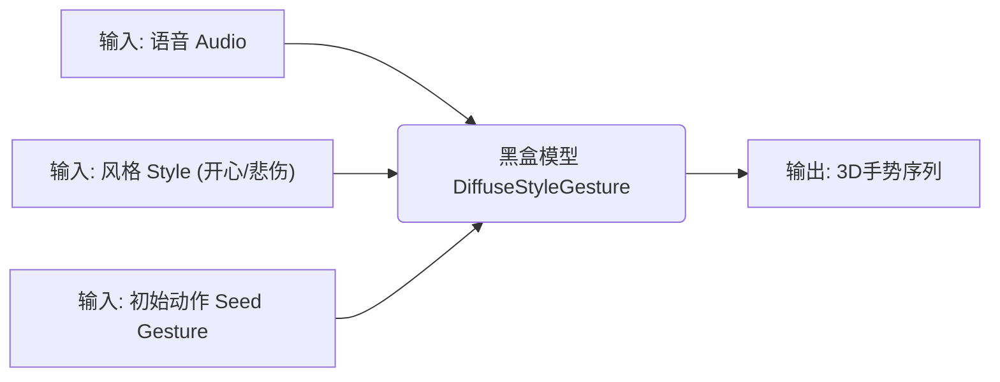
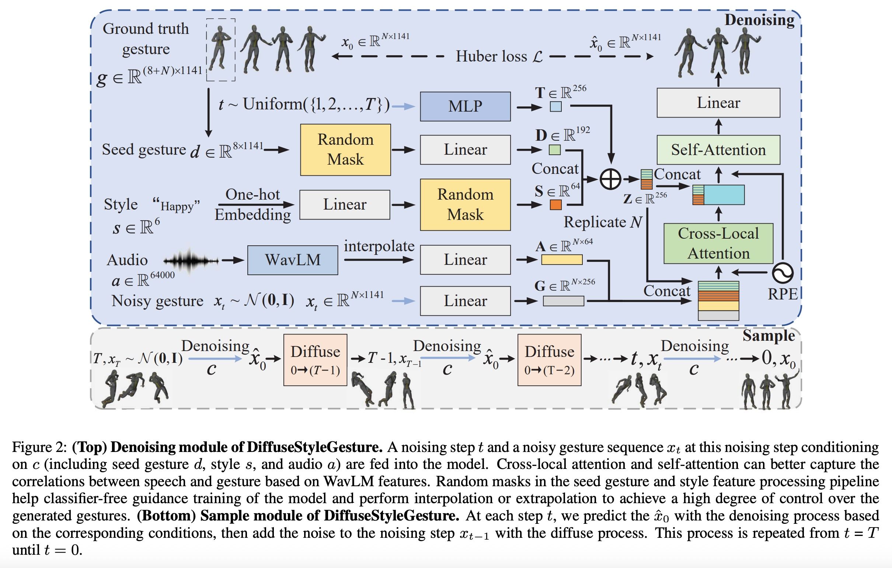
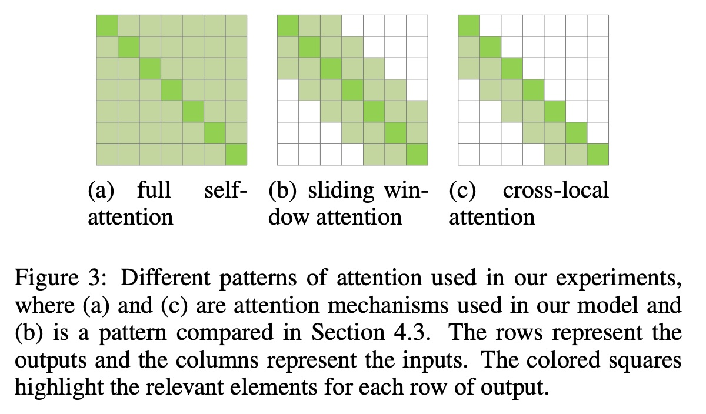
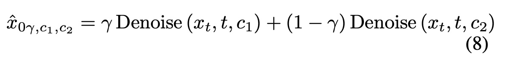
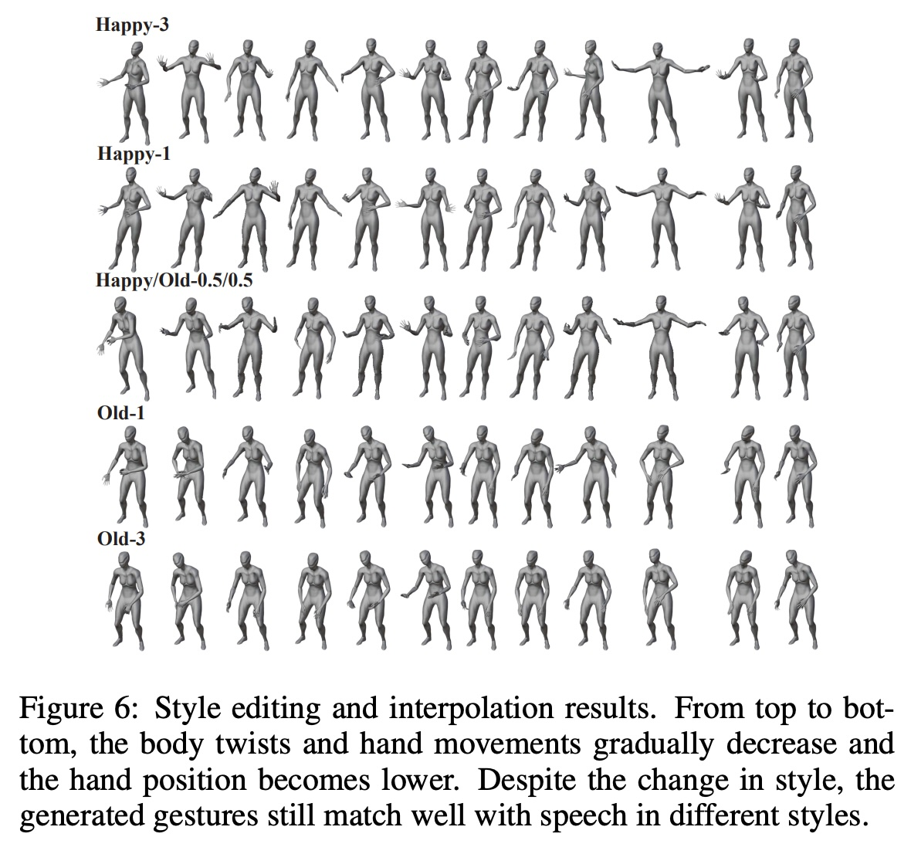
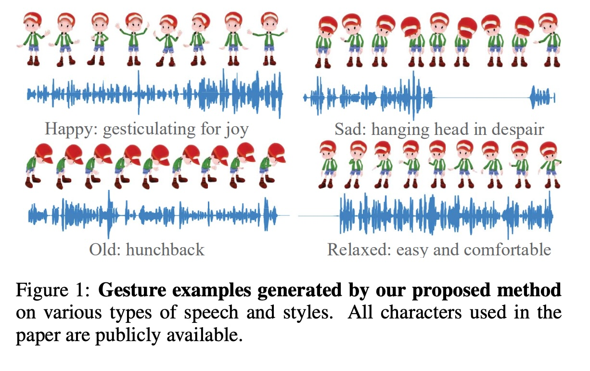
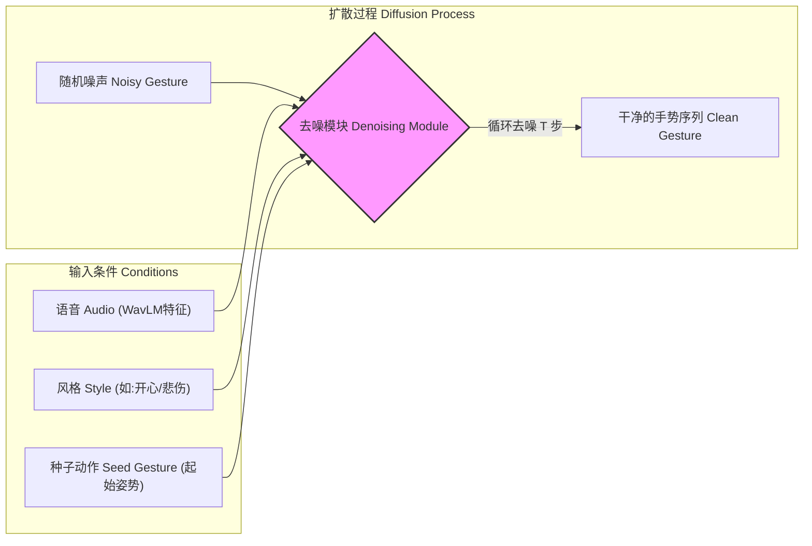
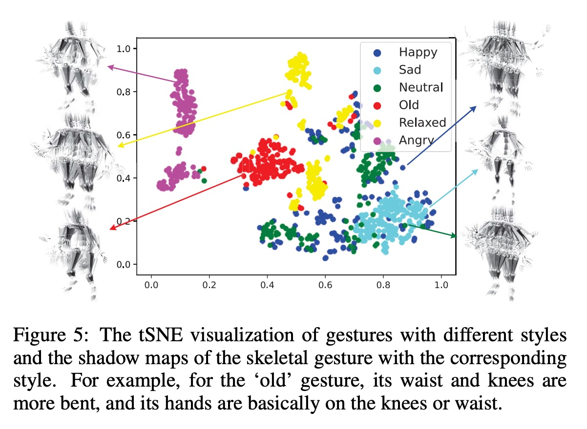
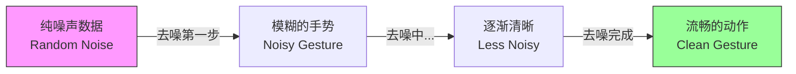

## AI论文解读 | DiffuseStyleGesture: Stylized Audio-Driven Co-Speech Gesture Generation with Diffusion Models
        
### 作者        
digoal        
        
### 日期        
2025-12-10        
        
### 标签        
PostgreSQL , PolarDB , DuckDB , AI , 论文解读        
        
----        
        
## 背景  
      
https://arxiv.org/pdf/2305.04919        
  
提示:          
```          
读懂《DiffuseStyleGesture: Stylized Audio-Driven Co-Speech Gesture Generation with Diffusion Models》这篇论文需要提前掌握哪些基础知识, 请使用中文通熟易懂的讲解这些基础知识, 可以引用论文中的图、表或使用Markdown支持的图形(text,mermaid等)增加解释性. 
  
使用中文通熟易懂的解读《DiffuseStyleGesture: Stylized Audio-Driven Co-Speech Gesture Generation with Diffusion Models》这篇论文, 其中的关键内容请着重讲解, 可以引用论文中的图、表或使用Markdown支持的图形(text,mermaid等)增加解释性. 
  
提取《DiffuseStyleGesture: Stylized Audio-Driven Co-Speech Gesture Generation with Diffusion Models》这篇论文中的重要术语, 使用中文对这些术语进行通熟易懂的讲解, 可以引用论文中的图、表或使用Markdown支持的图形(text,mermaid等)增加解释性. 
```     
  
## 1 前置知识 
  
要读懂《DiffuseStyleGesture: Stylized Audio-Driven Co-Speech Gesture Generation with Diffusion Models》这篇论文，你需要掌握以下几个核心领域的“基础知识”。为了让你更轻松地理解，我将这些复杂的概念转化为通俗易懂的语言，并结合论文中的插图进行解释。

这篇论文的核心任务是： **根据语音（Audio）生成对应风格的肢体手势（Gesture），并使用扩散模型（Diffusion Model）来实现。**

以下是你需要预先了解的五大知识模块：

-----

### 1\. 任务背景：语音驱动的共指手势生成 (Co-speech Gesture Generation)

**通俗解释：**
想象你在玩一款RPG游戏，里面的角色说话时不能像木头人一样站着，手得跟着动。这个技术就是“教”计算机：听到一段话（比如“你好，很高兴见到你”），应该配什么样的手势（比如挥手）。

**论文中的应用：**
这篇论文的输入不仅仅是**语音**（Audio），还增加了**风格**（Style，如开心、悲伤）和**种子手势**（Seed gesture，即动作的起始姿势），通过这些条件生成一段流畅的3D骨骼动画 。



-----

### 2\. 核心算法：扩散模型 (Diffusion Models)

这是这篇论文最核心的数学基础。如果不理解扩散模型，就看不懂论文的图2。    

**通俗解释：**
扩散模型的逻辑像是一个“破坏与重建”的过程：

  * **前向过程（加噪）：** 把一张清晰的照片（或者一段完美的手势数据），一点点撒上雪花点（高斯噪声），直到最后变成完全看不出原样的杂乱噪点。
  * **逆向过程（去噪）：** 也就是生成的时刻。模型学习如何把一堆杂乱的噪点，“脑补”回原本清晰的画面。

**论文中的具体实现：**
论文使用扩散模型来生成手势序列。请看论文中的 **Figure 2**：

  * **上图 (Denoising Module)：** 展示了模型如何训练。它接收当前的噪声手势 $x_t$ ，结合条件（ 语音 $a$ 、风格 $s$ ），预测出干净的手势 $\hat{x}_0$ 。
  * **下图 (Sample Module)：** 展示了生成过程。从最右边的纯噪声（ $x_T$ ）开始，一步步往左走，每一步都去一点噪，最后变成最左边清晰的人体动作（ $x_0$ ） 。

**你需要掌握的关键点：**

  * **加噪（ Diffusion Process $q$ ）：** 逐渐把真实动作变成随机噪声 。
  * **去噪（ Denoising Process $p_\theta$ ）：** 神经网络学习怎么从噪声中还原动作 。

-----

### 3\. 网络架构：Transformer 与 注意力机制 (Attention Mechanism)

论文在处理数据时，并没有使用简单的全连接层，而是设计了特殊的注意力机制。

**通俗解释：**
当你听别人说话时，你的手势通常只和**当下**或**刚才**说的那几个字有关（局部关联），但你的整体姿态（比如你是自信还是畏缩）需要贯穿**全程**（全局关联）。

  * **Cross-Attention（交叉注意力）：** 让动作去“看”语音，寻找对应关系。
  * **Self-Attention（自注意力）：** 让动作序列自己“看”自己，保证前后连贯。

**论文中的创新点：**
作者提出了一种结合机制，请看 **Figure 3**：    

  * **Cross-Local Attention (图c)：** 作者认为手势和语音的对应通常是“局部”的。比如说到“大”这个字，手就张开。所以不需要看完整的几分钟音频，只需要看这一小段窗口。图(c)中的色块只集中在对角线附近，代表只关注局部 。
  * **Self-Attention (图a)：** 用来捕捉全局信息，确保生成长动作时风格统一，不会前一秒像老人，后一秒像小孩 。

-----

### 4\. 音频特征提取：WavLM

为了让计算机“听懂”语音，需要先对声音文件进行预处理。

**通俗解释：**
早期的技术通常只提取声音的响度或频率（如MFCC），这就像只听到了“声音的大小”。
这篇论文使用了 **WavLM** ，这是一个在大规模语音数据上预训练过的模型。它不仅能听到声音大小，还能听出**情感**（Emotion）和**语义**（Semantics）。

**为什么这很重要？**
论文提到，使用 WavLM 可以让生成的手势更符合语音的情绪（比如悲伤的语调会生成垂头丧气的手势），比传统方法效果更好 。

-----

### 5\. 控制机制：无分类器引导 (Classifier-Free Guidance)

论文的一个亮点是可以随意调节手势的“风格强度”（比如“超级开心” vs “有点开心”）。

**通俗解释：**
假设你有一个绘画机器人。

  * **有条件生成：** 你告诉它“画一只**开心的**猫”。
  * **无条件生成：** 你告诉它“随便画一只猫”。
    **无分类器引导**就是训练时这两种都练。生成时，如果你想要“非常开心”，模型就会比较“有条件生成”和“无条件生成”的区别，并将这个特征放大。

**论文中的公式：**
文中提到了公式 (8)：    
$$\hat{x} = \gamma \cdot \text{Denoise}(c_1) + (1-\gamma) \cdot \text{Denoise}(c_2)$$
这里的 $\gamma$ 就是那个“调节旋钮”。

  * 如果 $\gamma = 1$ ，就是正常的带风格生成。
  * 如果 $\gamma > 1$ ，就是夸张风格（Extrapolation） 。

论文展示了调节 $\gamma$ 的效果，如下图 **Figure 6** 所示，随着 $\gamma$ 变大（Happy-3），动作幅度和手的位置都变大了 。    

-----

### 总结：读这篇论文的正确姿势

1.  **先看图 1 和 图 6：** 直观感受什么是“风格化手势生成”（能控制老迈、开心、悲伤等风格）。      
2.  **重点读 Section 3.1 和 3.2：** 对照 **Figure 2** 理解数据是怎么在“加噪”和“去噪”中流转的。    
3.  **理解 Figure 3：** 明白作者为什么要设计“Cross-Local Attention”（局部对齐语音）加上“Self-Attention”（全局连贯）。    
4.  **最后看 Section 3.3：** 理解怎么通过 $\gamma$ 参数来控制风格的强弱。

希望这些基础知识讲解能帮你扫清阅读障碍！如果你对其中某个数学公式（如扩散公式）的具体推导感兴趣，我可以为你进一步展开。
  
## 2 解读论文 
  
这篇论文 **《DiffuseStyleGesture: Stylized Audio-Driven Co-Speech Gesture Generation with Diffusion Models》** 主要解决的问题是： **如何让虚拟数字人（Avatar）在说话时，能够根据语音自动做出自然、对上节奏，并且带有特定情感风格（如开心、悲伤、年迈）的手势。**

为了让你轻松读懂，我将这篇论文拆解为**背景与痛点**、**核心方法（怎么做）** 、**两大关键创新**以及**效果展示**四个部分。

-----

### 1\. 为什么要做这个？（背景与痛点）

在游戏、虚拟主播或元宇宙中，如果角色说话时像个木头人，或者手势和话语完全不搭，体验会非常差。
以前的方法（基于GAN或VAE）存在两个主要问题：

  * **动作僵硬重复（Mode Collapse）：** 生成的手势往往千篇一律，缺乏变化 。
  * **质量与多样性的矛盾：** 很难同时做到既画质好（动作自然）又样多（不重复） 。
  * **节奏对不上：** 手势的高潮点往往和语音的重音对不齐 。

**本文方案：** 引入了**扩散模型（Diffusion Models）** 。这就好比与其让画家一次性画出一幅画（容易画坏），不如从一团杂乱的噪点中，一点点“雕刻”出清晰的动作序列，这样生成的动作既细腻又多样 。

-----

### 2\. 核心架构：它是如何工作的？

我们可以把这个模型看作一个 **“超级翻译机”** ：输入是声音和风格指令，输出是3D骨骼动作。

请看论文中的 **Figure 2**（模型架构图），我将其逻辑简化如下：   



**工作流程解析：**

1.  **输入准备：**
      * **听觉：** 使用 **WavLM** 提取语音特征。这比传统的声波特征更强，因为它不仅能听出声音大小，还能听出**语义和情感** 。
      * **风格：** 比如输入“开心”或“年迈”的标签 。
      * **种子动作：** 告诉模型动作从哪里开始（前8帧），保证动作连接顺滑 。
2.  **扩散去噪：** 模型从一堆随机乱动的骨骼数据开始，结合上面的条件，一步步修正，直到生成流畅的动作 。

-----

### 3\. 论文的两大核心创新（关键知识点）

这篇论文之所以效果好，主要归功于两个设计：

#### 创新点一：Cross-Local Attention（跨模态局部注意力机制）

**问题：** 说话时，手势通常只跟**当下**这一小段话有关，而不需要去管一分钟前说了什么。如果模型一次性看太长的音频，反而会被干扰。

**解决方案（见论文 Figure 3）：**    
作者设计了一种特殊的注意力机制。

  * **Cross-Local (局部关注)：** 让手势生成器只盯着当前时刻附近的音频片段。这就像打着手电筒看地图，只看脚下这一块，确保手势卡点精准 。
  * **Self-Attention (全局自洽)：** 同时保留一个全局的自我关注机制，确保整体动作风格统一，不会前一秒像老人，后一秒像小孩 。

> **论文原图解释 (Figure 3):**  
>  
>   * **(a) Full Self-attention:** 全局看，计算量大且容易模糊重点。  
>   * **(c) Cross-local attention (本文采用):** 就像图中的对角线色块一样，只关注局部窗口，大大提升了手势和语音的同步率 。  

#### 创新点二：基于无分类器引导的风格控制（Style Control）

**问题：** 以前的模型，你只能选“开心”或者“悲伤”。但如果你想要“**三分开心、七分悲伤**”或者“**极度夸张的开心**”怎么办？

**解决方案：**
利用**Classifier-free Guidance**。简单说，就是给风格加了一个“音量旋钮”（ 参数 $\gamma$ ）。

  * **训练时：** 随机把风格标签盖住（Mask），让模型学会“有风格”和“没风格”的区别 。
  * **生成时：** 通过调节 $\gamma$ 值，可以实现风格的**增强（Extrapolation）或混合（Interpolation）** 。

> **公式直觉：**    
> $\text{最终动作} = \text{普通动作} + \gamma \times (\text{风格化动作} - \text{普通动作})$    
> 当 $\gamma$ 越大，风格就越强烈。    

-----

### 4\. 效果展示（Result）

论文通过实验证明了该方法的优越性：

#### 风格可视化 (Figure 1 & Figure 5)

  

  

  * **Happy (开心):** 手势幅度大，手抬得高，有很多张开双臂的动作 。
  * **Old (年迈):** 弯腰驼背，手放在膝盖或腰上，动作缓慢 。
  * **Sad (悲伤):** 垂头丧气，手部下垂 。

#### 风格编辑能力 (Figure 6)

  

这是非常有意思的一个实验结果 。

  * **Happy-3 (强度3):** 极度开心，身体扭动很大。
  * **Happy-1 (强度1):** 正常开心。
  * **Happy/Old-0.5/0.5 (混合):** 既有点开心又有点老态。
  * **Old-3 (强度3):** 极度衰老，几乎动不了。

这证明了模型不仅能生成动作，还能精细控制动作的**风格强度** 。

-----

### 5\. 总结

**DiffuseStyleGesture** 这篇论文提出了一种基于扩散模型的手势生成新方法。它的核心贡献在于：

1.  用**扩散模型**替代了传统的GAN/VAE，生成的动作更自然、多样 。
2.  利用 **WavLM** 和 **Cross-Local Attention**，让手势完美卡点语音节奏和语义 。
3.  实现了灵活的**风格调节**，可以随意控制动作的情感浓度 。

这就好比给原本只能照稿念词的机器人，装上了一个懂情感、懂节奏、还能随意飙戏的“大脑”。
  
## 3 术语 
  
这篇论文《DiffuseStyleGesture: Stylized Audio-Driven Co-Speech Gesture Generation with Diffusion Models》涉及许多计算机视觉和生成式AI的专业术语。为了帮你更好地理解，我提取了其中最关键的术语，并用通俗易懂的语言配合图表进行解读。

### 1\. 核心任务类术语

#### **Co-Speech Gesture Generation (语音驱动的共指手势生成)**

  * **通俗解释：**
    这就好比你在玩RPG游戏或看虚拟主播直播。当角色说话时，身体不能像木头人一样僵硬，手得跟着动。这个技术的任务就是让计算机“听”一段声音（Audio），然后自动“编排”出一段合适的手势（Gesture），不仅要卡点（节奏对得上），动作还得符合语境（含义对得上）。
  * **难点：**
    同一个“你好”，你可以挥手，也可以点头，并没有标准答案（多样性）。而且动作必须和声音严丝合缝（同步性）。

#### **Seed Gesture (种子手势 / 初始手势)**

  * **通俗解释：**
    想象接力赛跑。生成新手势时，不能凭空开始，否则角色可能会突然从“手放下”的状态瞬间变成“手举高”，看起来会闪烁或瞬移。
    “种子手势”就是上一段动作的最后几帧（在论文中是前8帧）。它告诉模型：“这一段动作开始前，手是放在哪里的”，从而保证动作连接顺滑 。

-----

### 2\. 核心算法类术语

#### **Diffusion Model (扩散模型)**

这是本文的心脏，也是目前AI绘画（如Midjourney）背后的技术，这里被用到了动作生成上。

  * **通俗解释：**
    想象一块清晰的玻璃（完美的手势数据）。
    1.  **扩散过程（前向）：** 我们往玻璃上哈气，每哈一口气，玻璃就模糊一点（加噪），直到最后变成完全看不清的一片白雾（纯高斯噪声）。
    2.  **去噪过程（逆向）：** 模型的任务就是学习怎么把这片“白雾”擦干净，还原成原本清晰的画面。生成手势时，模型就是从随机的一团乱码数据中，一步步“擦除”噪声，最后变出一段流畅的人体骨骼动画 。




  

*(参考论文 Figure 2 的 Denoising 部分 )*

#### **Classifier-Free Guidance (无分类器引导)**

  * **通俗解释：**
    这是一个控制“风格浓度”的旋钮。
    以前的模型可能只能生成“开心”或“不开心”。有了这个技术，我们可以调节参数 $\gamma$ （Gamma）。
      * $\gamma=1$ ：正常的开心。
      * $\gamma=3$ ： **超级**开心（动作幅度被放大）。
      * $\gamma=0.5$ ：一点点开心。
        它通过在训练时故意随机丢弃风格标签（让模型学会“盲猜”和“看提示猜”的区别），从而在生成时能精准控制风格的强度 。

-----

### 3\. 模型架构类术语（论文的独门秘籍）

#### **WavLM (语音特征提取器)**

  * **通俗解释：**
    以前的技术像个只能听见“响度”的耳朵（只听得见大声小声）。
    **WavLM** 是一个在大规模语音数据上训练过的“超级耳朵”。它不仅能听出声音的节奏，还能听出**情感**（是悲伤还是愤怒）和**语义**（说了什么词）。
    论文发现，用 WavLM 提取的声音特征，比传统方法（如MFCC）能生成更像真人的手势 。

#### **Cross-Local Attention (跨模态局部注意力机制)**

这是论文为了解决“手势不卡点”问题设计的关键结构。

  * **通俗解释：**
    当你说话时，你当下的手势通常只跟**刚才说的这几个字**有关，而跟一分钟前说的话关系不大。

      * **全局注意力：** 像个泛光灯，照亮整段一分钟的音频，容易导致模型分心，抓不住重点。
      * **局部注意力 (Local Attention)：** 像个聚光灯（手电筒），只照亮当前时刻前后的一小段音频。
        **Cross-Local** 就是让生成的手势“只盯着”当前这一小段声音看，这样生成的动作节奏感更强，卡点更准 。

  * **图解对比 (基于论文 Figure 3):**    

    > **(a) 全局自注意力**：看所有人，容易眼花。
    > **(c) 跨模态局部注意力 (本论文)** ：只看对角线区域（当下时刻），专注力MAX 。

#### **Self-Attention (自注意力机制)**

  * **通俗解释：**
    虽然手势要看当下的声音（局部），但动作本身需要连贯（全局）。
    如果只看局部，可能导致前一秒像老爷爷（弯腰），后一秒突然像年轻人（挺胸）。
    **Self-Attention** 用来让动作序列“自己看自己”，确保整段动作的风格、姿态前后一致，不会出现精神分裂一样的突变 。

### 总结表

| 术语 | 核心作用 | 一句话比喻 |
| :--- | :--- | :--- |
| **Diffusion Model** | 生成动作 | 从一团乱麻中理出清晰的毛线球 |
| **WavLM** | 听懂声音 | 懂情感、懂语义的“顺风耳” |
| **Cross-Local Attention** | 动作卡点 | 只照亮脚下路的“手电筒” |
| **Classifier-Free Guidance** | 控制风格 | 调节情绪浓度的“音量旋钮” |
  
## 参考        
         
https://arxiv.org/pdf/2305.04919    
        
<b> 以上内容基于DeepSeek、Qwen、Gemini及诸多AI生成, 轻微人工调整, 感谢杭州深度求索人工智能、阿里云、Google等公司. </b>        
        
<b> AI 生成的内容请自行辨别正确性, 当然也多了些许踩坑的乐趣, 毕竟冒险是每个男人的天性.  </b>        
  
    
#### [PolarDB 学习图谱](https://www.aliyun.com/database/openpolardb/activity "8642f60e04ed0c814bf9cb9677976bd4")
  
  
#### [PostgreSQL 解决方案集合](../201706/20170601_02.md "40cff096e9ed7122c512b35d8561d9c8")
  
  
#### [德哥 / digoal's Github - 公益是一辈子的事.](https://github.com/digoal/blog/blob/master/README.md "22709685feb7cab07d30f30387f0a9ae")
  
  
#### [About 德哥](https://github.com/digoal/blog/blob/master/me/readme.md "a37735981e7704886ffd590565582dd0")
  
  

  
