## AI论文解读 | MM-PCQA: Multi-Modal Learning for No-reference Point Cloud Quality Assessment
        
### 作者        
digoal        
        
### 日期        
2025-12-10        
        
### 标签        
PostgreSQL , PolarDB , DuckDB , AI , 论文解读        
        
----        
        
## 背景  
      
https://arxiv.org/pdf/2209.00244        
  
提示:          
```          
读懂《MM-PCQA: Multi-Modal Learning for No-reference Point Cloud Quality Assessment》这篇论文需要提前掌握哪些基础知识, 请使用中文通熟易懂的讲解这些基础知识, 可以引用论文中的图、表或使用Markdown支持的图形(text,mermaid等)增加解释性. 
  
使用中文通熟易懂的解读《MM-PCQA: Multi-Modal Learning for No-reference Point Cloud Quality Assessment》这篇论文, 其中的关键内容请着重讲解, 可以引用论文中的图、表或使用Markdown支持的图形(text,mermaid等)增加解释性. 
  
提取《MM-PCQA: Multi-Modal Learning for No-reference Point Cloud Quality Assessment》这篇论文中的重要术语, 使用中文对这些术语进行通熟易懂的讲解, 可以引用论文中的图、表或使用Markdown支持的图形(text,mermaid等)增加解释性. 
```     
  
## 1 前置知识 
  
要读懂这篇名为《MM-PCQA: Multi-Modal Learning for No-reference Point Cloud Quality Assessment》的论文，你需要掌握以下几个关键的基础知识领域。为了让你更容易理解，我将这些概念拆解为通俗易懂的解释，并结合论文中的图表进行说明。

-----

### 1\. 什么是点云 (Point Cloud)？

**基础概念：**
想象一下，如果你想在电脑里通过画点的形式“画”出一只兔子。你在兔子的表面点了成千上万个点，每个点都有自己在空间中的坐标 $(X, Y, Z)$ ，如果它是彩色的，每个点还会有颜色信息 $(R, G, B)$ 。这堆点的集合就叫**点云**。

**论文中的应用：**
论文中提到的点云数据不仅仅是形状，还包含了颜色。

  * **3D Point Clouds (3D点云)** ：直接描述物体的几何结构。
  * **2D Projections (2D投影)** ：把3D点云从某个角度“拍”成一张2D照片。

> **为什么这很重要？**
> 论文的核心观点是：人眼看物体时，既能感知立体的结构（3D），也能感知平面的纹理（2D）。
>
>   * (对应论文 Figure 1)
>   * **3D点云**擅长捕捉**几何失真**（比如点变少了，形状歪了）。
>   * **2D投影**擅长捕捉**纹理噪声**（比如颜色变得模糊或有噪点）。

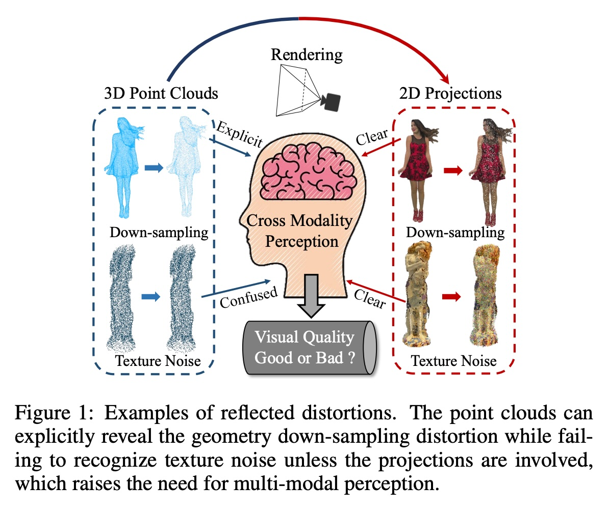  

### 2\. 无参考质量评价 (No-Reference Quality Assessment, NR-PCQA)

**基础概念：**

  * **全参考 (Full-Reference, FR)** ：就像“找茬”游戏。电脑同时看到“原本完美的图”和“坏掉的图”，通过对比来打分。
  * **无参考 (No-Reference, NR)** ：就像“鉴宝”。电脑看不到“原本完美的图”，只能对着“坏掉的图”凭经验判断它哪里不好，打多少分 。

**论文的挑战：**
在现实生活中（比如自动驾驶、VR游戏），我们往往拿不到“原始完美数据”，所以**无参考 (NR)** 方法更实用，但也更难，因为模型需要自己学会什么是“好”，什么是“坏” 。

### 3\. 多模态学习 (Multi-Modal Learning)

**基础概念：**
人类感知世界是多模态的（视觉、听觉、触觉）。在计算机视觉中，多模态意味着同时使用不同形式的数据来解决同一个问题。

**论文中的应用：**
这篇论文是**PCQA领域第一个**引入多模态学习的 。它不想只看3D点，也不想只看2D图，而是要把两者结合起来。

  * **模态 A**：3D点云本身（结构信息）。
  * **模态 B**：由点云渲染出的2D图像（纹理信息）。
  * **融合**：把两者的特征拼在一起，互相补充。

请看下方的流程简图（基于论文 Figure 2 的逻辑）：  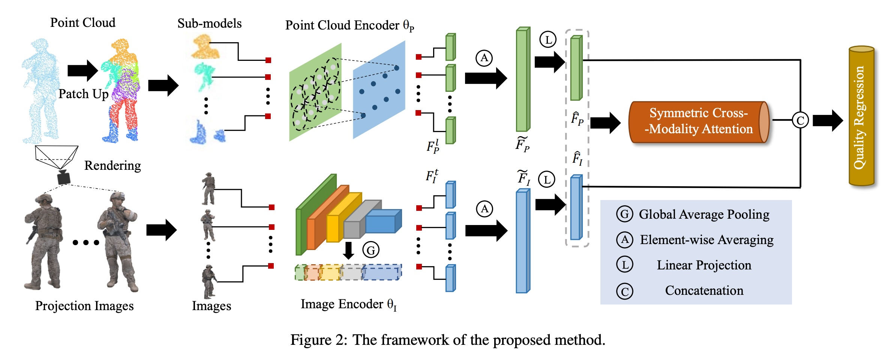  

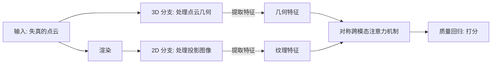

### 4\. 特征提取与编码器 (Feature Extraction & Encoders)

为了让电脑理解图片或点云，我们需要用神经网络把它们转换成数学上的“特征向量”。论文用到了两种经典的“骨干网络” (Backbones)：

1.  **针对2D图像：ResNet50**
      * 这是一个非常经典的卷积神经网络（CNN），专门用来“看图”。论文用它来提取2D投影图中的纹理特征 。
2.  **针对3D点云：PointNet++**
      * 这是一个专门用来处理无序点集的网络。它能理解点的局部结构。
      * **关键步骤：Patch-up (分块策略)** 。论文没有把整个巨大的点云直接扔进去，也没有只随机采样几个点（因为那样会破坏结构），而是把点云切成若干个**子模型 (Sub-models)** 。

> **理解 Figure 3 (Patch-up Process):**  
>  
>   * (a) 原始点云（比如一个乒乓球拍）。  
>   * (b) **FPS采样**：先选几个关键的中心点（Anchor points）。  
>   * (c) **KNN聚类**：把中心点周围的邻居点找出来，形成一个个局部的“小补丁” (Sub-models)。这样既保留了细节，又方便电脑处理 。  
  
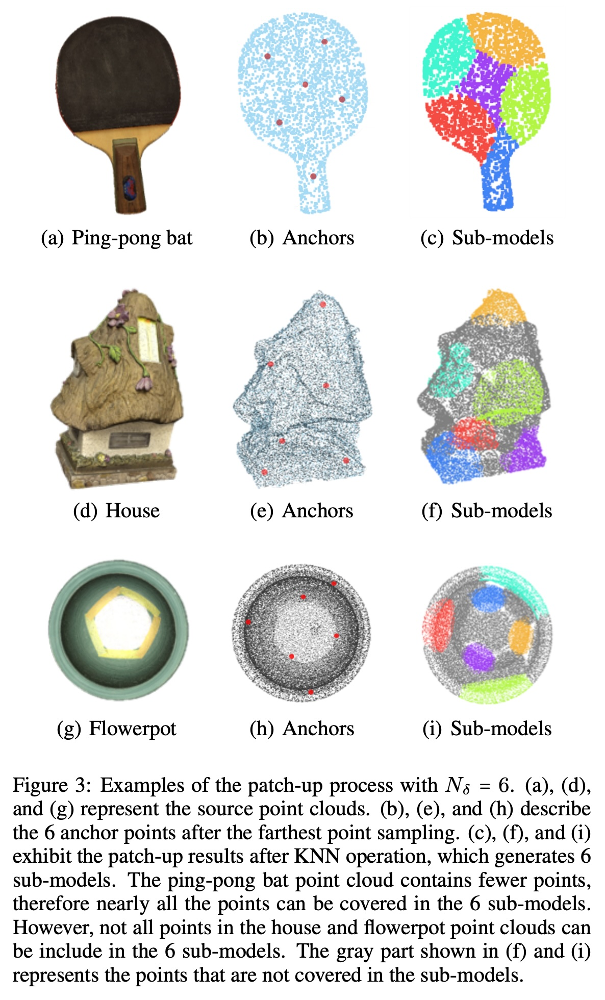    

### 5\. 注意力机制 (Attention Mechanism)

**基础概念：**
当你在这个回答中寻找重点时，你的眼睛会聚焦在加粗的字上，这就是“注意力”。在深度学习中，注意力机制让模型学会“该关注哪里”。

**论文中的创新：对称跨模态注意力 (Symmetric Cross-Modality Attention)**
模型不仅仅是把3D和2D特征简单拼起来，而是让它们“对话”。

  * 3D特征会告诉2D分支：“嘿，我这里有个几何变形，你看看对应的纹理有没有问题？”
  * 反之亦然。这在论文 Figure 5 中展示：Point Cloud Feature ( $\hat{F}_P$ ) 和 Image Feature ( $\hat{F}_I$ ) 互相作为 Query, Key, Value 进行交互 。  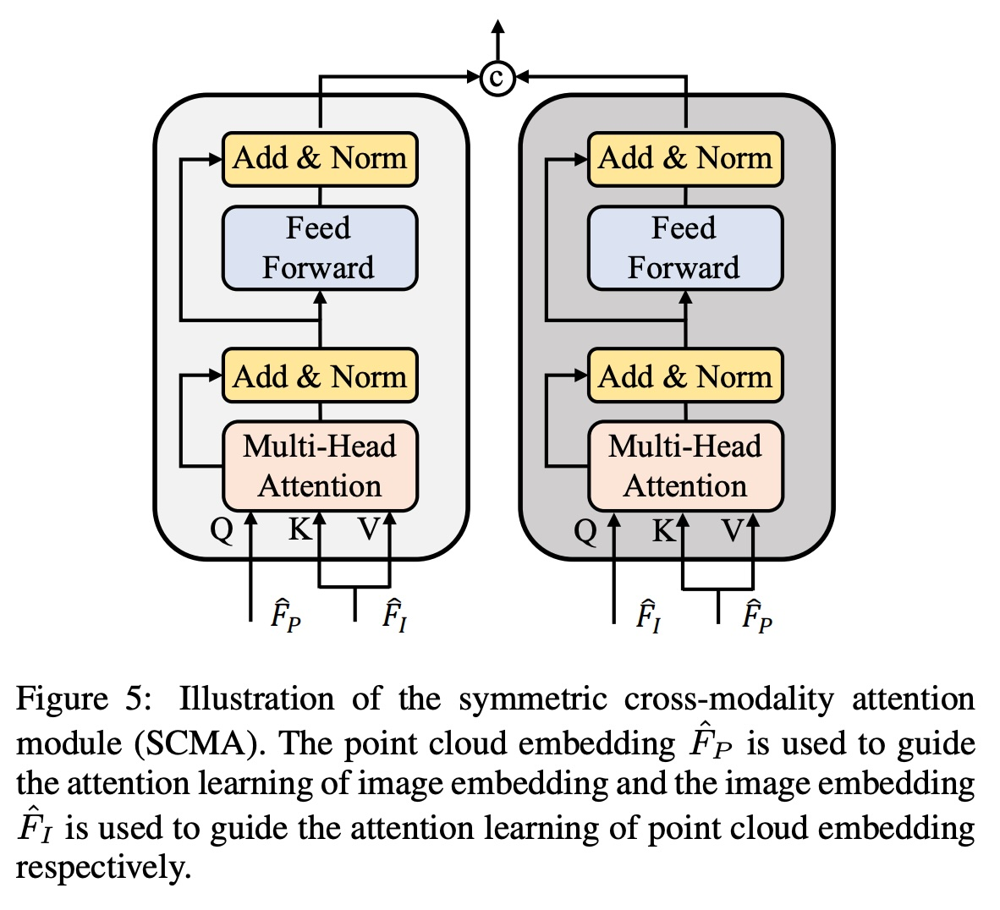    

### 6\. 评价指标 (Evaluation Metrics)

最后，你怎么知道这个模型好不好？通常使用相关性系数来衡量模型打分（预测分）和人类打分（主观分）的一致性：

  * **PLCC (Pearson Linear Correlation Coefficient)** ：衡量线性相关性（预测分和真实分是不是成比例）。
  * **SRCC (Spearman Rank Correlation Coefficient)** ：衡量排名相关性（分数的绝对值不重要，重要的是排名的先后顺序对不对）。
  * **值越接近 1，模型越准** 。

### 总结：阅读路线图

当你阅读这篇论文时，可以按照这个心理模型去理解：

1.  **输入**：一个看起来可能有点“烂”的彩色点云。
2.  **处理路径 1 (3D)** ：切成小块，用 PointNet++ 提取**形状**特征。
3.  **处理路径 2 (2D)** ：给点云拍照，用 ResNet50 提取**颜色/纹理**特征。
4.  **交互**：用**注意力机制**让形状和颜色特征互相“对齐”和“确认”。
5.  **输出**：一个代表质量分数的数字。

建议你重点关注论文的 **Figure 1**（理解为什么要用多模态）和 **Figure 2**（理解整个处理流程）。         
  
## 2 解读论文 
  
这篇论文《MM-PCQA: Multi-Modal Learning for No-reference Point Cloud Quality Assessment》提出了一种新的**点云质量评价方法**。

简单来说，它的核心思想是： **“兼听则明”** 。为了评价一个3D模型（点云）的质量好坏，它不再单单只看3D结构，也不单单只看渲染出来的2D图片，而是把两者结合起来，模拟人类大脑同时处理视觉和空间信息的方式。

以下是该论文的通俗解读：

-----

### 1\. 为什么要这么做？（背景与动机）

**问题：**
在虚拟现实（VR）或元宇宙应用中，点云数据（由无数个点组成的3D模型）很容易在传输或压缩时变糊、变形。我们需要一个AI模型来给这些点云打分（质量评价），告诉我们它现在的画质如何。这种情况通常是 **无参考（No-Reference）** 的，也就是说AI看不到“原版完美图”，只能凭经验判断。

**痛点：**
以前的方法通常“偏科”：

  * **只看2D投影图：** 能看清颜色、纹理是否模糊，但看不出形状是不是歪了 。
  * **只看3D点云：** 能看清形状结构，但对颜色噪声不敏感 。

**解决方案（Figure 1）：**
作者认为，人类看东西时，是同时结合了 **几何感（3D）** 和 **视觉纹理（2D）** 的。

  * 如图1所示，**3D点云**能很明显地反映出“下采样”（点变稀疏了）这种几何失真 。      
  * 而**2D投影**能很明显地反映出“纹理噪声”（颜色变脏了） 。
  * **MM-PCQA** 就是要把这两者结合起来（Multi-Modal 多模态），实现互补 。

-----

### 2\. 核心架构（怎么做的？）

整个模型的工作流程非常清晰，可以分为三步走。请参考论文的 **Figure 2**，我将其简化为下方的流程图：      

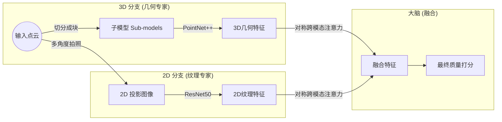

#### 第一步：3D几何特征提取 (Patch-up Strategy)

这是论文的一个创新点。

  * **传统做法的问题：** 为了喂给神经网络，通常会把点云通过“最远点采样(FPS)”变稀疏。但这会破坏局部的细腻纹理，比如原本光滑的表面采样后变得坑坑洼洼 。
  * **作者的做法 (Patch-up)：** 不直接扔掉点，而是把点云切成一个个小块（Sub-models）。
      * 先找几个中心点（Anchor points）。
      * 然后把中心点周围的邻居点都包进来（KNN算法），形成一个个局部的**子模型** 。
      * **效果：** 如图3所示，哪怕是像球拍、房子这样的物体，这种切块方式也能完美保留局部的几何纹理（平滑度、粗糙度） 。      

#### 第二步：2D纹理特征提取

  * **做法：** 围着点云转一圈，按固定间隔拍几张照（渲染出投影图） 。
  * **处理：** 使用经典的图像识别网络 **ResNet50** 来提取图片里的特征。这部分主要负责看“颜色对不对”、“画面糊不糊” 。

#### 第三步：对称跨模态注意力 (核心黑科技)

拿到3D特征和2D特征后，不能简单地加在一起。作者设计了一个**对称跨模态注意力模块 (SCMA)** （如图5）。      

  * **原理：** 让3D和2D特征互相“指导”。
      * 3D特征会作为引导，去查看2D特征中哪些部分更重要 。
      * 2D特征也会作为引导，去查看3D特征中哪里有问题 。
  * **目的：** 就像一个人拿着模型（3D）对着照片（2D）比对，确认哪里坏掉了，从而挖掘出单一模态发现不了的信息 。

-----

### 3\. 实验结果（效果好吗？）

论文在三个主流数据库（SJTU-PCQA, WPC, WPC2.0）上进行了测试，结果非常强劲。

#### 性能对比 (Table 1)
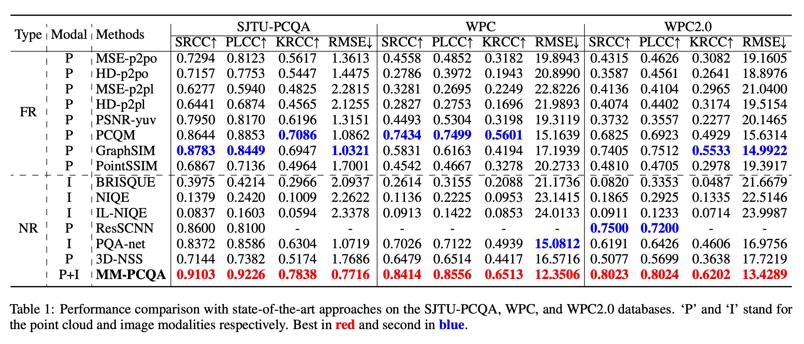    

  * **全面碾压：** MM-PCQA 在所有测试集上都取得了最好的成绩（红色数字），甚至超过了那些需要“参考原图”的方法（FR-PCQA） 。
  * **鲁棒性强：** 在面对更复杂的失真（如WPC数据库）时，其他方法的准确率掉得很厉害，但 MM-PCQA 依然很稳 。

#### 消融实验 (Table 2 & 3)

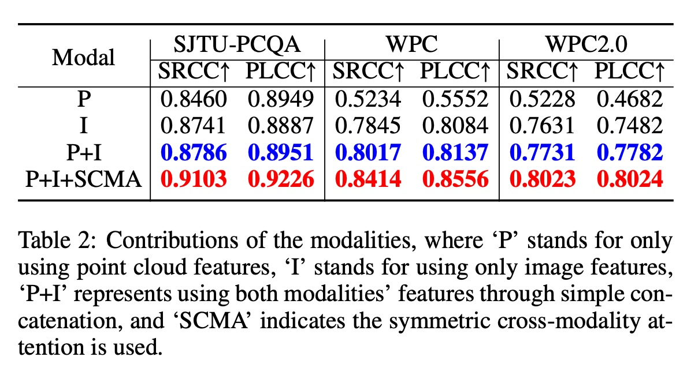    


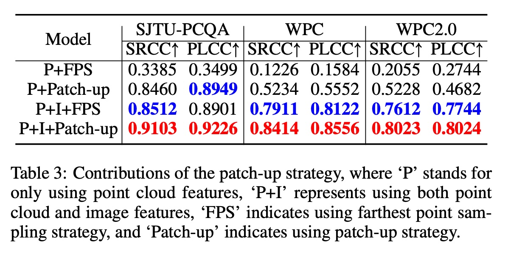    

为了证明“多模态”真的有用，作者做了测试：

  * **只用3D：** 效果一般。
  * **只用2D：** 效果一般。
  * **3D + 2D (简单拼接)：** 效果变好。
  * **3D + 2D + 跨模态注意力 (完整版)：** 效果最好 。

同时，实验也证明了**切块策略 (Patch-up)** 比单纯的采样 (FPS) 效果要好得多，因为它保留了更多细节 。

-----

### 4\. 总结与应用价值

**这篇论文解决了什么？**
它解决了点云质量评价中“顾此失彼”的问题。通过**MM-PCQA**框架，让计算机既像个雕塑家一样检查形状（3D），又像个摄影师一样检查画面（2D），最后给出一个非常接近人类主观感受的质量分数。

**关键创新点回顾：**

1.  **多模态融合 (Multi-Modal)：** 首次在无参考点云评价中结合了2D和3D信息 。
2.  **子模型切分 (Sub-models/Patch-up)：** 替代了粗暴的采样，保留了局部几何细节 。
3.  **对称注意力 (SCMA)：** 实现了跨模态信息的深度交互 。

**下一步动作：**
如果你对实现细节感兴趣，可以查看作者开源的代码：[https://github.com/zzc-1998/MM-PCQA](https://github.com/zzc-1998/MM-PCQA) 。
  
## 3 术语 
  
为了帮助你更好地理解《MM-PCQA: Multi-Modal Learning for No-reference Point Cloud Quality Assessment》这篇论文，我提取了其中的核心术语，并用通俗易懂的语言进行解读。

-----

### 1\. 核心概念类 (基础知识)

#### **Point Cloud (点云)**

  * **通俗解释：** 想象一下，如果你想用电脑记录一个雕塑的形状，你在雕塑表面点了无数个点，每个点都有自己的位置坐标 $(X, Y, Z)$ 和颜色 $(R, G, B)$ 。这一大堆点的集合就叫“点云”。它是3D世界的一种数字化表示 。
  * **论文中的角色：** 本文的研究对象。点云既可以直接看作3D模型，也可以投影成2D图片来看 。

#### **NR-PCQA (No-Reference Point Cloud Quality Assessment, 无参考点云质量评价)**

  * **通俗解释：**
      * **全参考 (FR)：** 就像老师改卷子，有“标准答案”对比，很容易打分。
      * **无参考 (NR)：** 就像鉴宝专家，没有“真品”在旁边对比，只能凭经验判断这件东西哪里坏了、哪里假了。
  * **论文中的角色：** 在现实生活中（如自动驾驶、VR），我们往往拿不到完美的原始数据，所以“无参考”方法更实用，但也更难 。

#### **Multi-Modal Learning (多模态学习)**

  * **通俗解释：** “模态”就是数据的表现形式。人类感知世界是多模态的（看、听、摸）。在本文中，多模态指的是同时利用 **3D点云（几何形状）** 和 **2D投影图（纹理颜色）** 两种信息来判断质量 。
  * **为什么要用：**
      * **3D点云**擅长发现“形状歪了”或“点变少了”（几何失真）。
      * **2D投影**擅长发现“颜色糊了”或“有噪点”（纹理失真）。
      * 两者结合，也就是“兼听则明” 。

-----

### 2\. 关键方法类 (论文的创新点)

#### **Sub-models & Patch-up Strategy (子模型与分块策略)**

  * **通俗解释：** 以前的方法为了减少计算量，会随机丢掉一些点（下采样），但这会破坏物体的细节。本文提出了一种“分块”策略：
    1.  先找几个中心点（Anchor points）。
    2.  把中心点周围的邻居点都“打包”在一起，形成一个个局部的“小补丁”或“子模型”。
  * **论文中的图示：** 参见 **Figure 3**。      
      * (b) 是选出的稀疏中心点。
      * (c) 是打包好的彩色子模型，它完美覆盖了原来的形状，保留了局部的粗糙度和平滑度 。


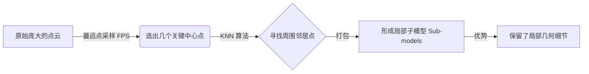

#### **Rendering & 2D Projections (渲染与2D投影)**

  * **通俗解释：** 就是给3D点云“拍照”。
  * **具体做法：** 设定一个圆形的轨道，让相机围着点云转一圈，每隔一定角度拍一张照（论文中是拍4张）。
  * **目的：** 把复杂的3D纹理问题转化成计算机擅长的2D图像识别问题 。

#### **Symmetric Cross-Modality Attention (SCMA, 对称跨模态注意力)**

  * **通俗解释：** 这是一个让3D信息和2D信息“互相交流”的机制。
      * 不是简单地把两个分数加起来。
      * 而是让3D特征去“看”2D特征，告诉2D模型：“我这里形状有点歪，你看看对应的照片那里是不是也有问题？”反之亦然。
  * **工作原理：** 这种机制利用了Transformer中的注意力原理，让两个模态的特征向量互相加权、融合 。

-----

### 3\. 模型架构类 (技术实现)

#### **Encoders (特征编码器)**

  * **通俗解释：** 负责把“图片”或“点云”翻译成计算机能理解的“数学密码”（特征向量）的工具。
  * **本文的选择：**
      * **3D编码器：** 使用 **PointNet++**，专门用来读懂点云的结构 。
      * **2D编码器：** 使用 **ResNet50**，专门用来读懂图片的纹理 。

#### **Quality Regression (质量回归)**

  * **通俗解释：** 模型的最后一步。把前面提取到的所有特征（密码）汇总，经过计算，直接输出一个分数（例如：这图质量是 8.5 分）。

#### **Loss Function (损失函数：MSE + Rank)**

  * **通俗解释：** 这是训练AI时的“奖惩规则”。
      * **MSE (均方误差)：** 如果AI打分是5分，实际是8分，误差大就要受罚，强迫AI打分更准 。
      * **Rank Loss (排序损失)：** 即使分数没打准，但如果AI能分辨出“A比B好”，那也算对。这帮助AI学会给质量排座次 。

-----

### 总结图示 (MM-PCQA 框架)

为了总结这些术语如何串联起来，我们可以参考论文 **Figure 2** 的逻辑：      

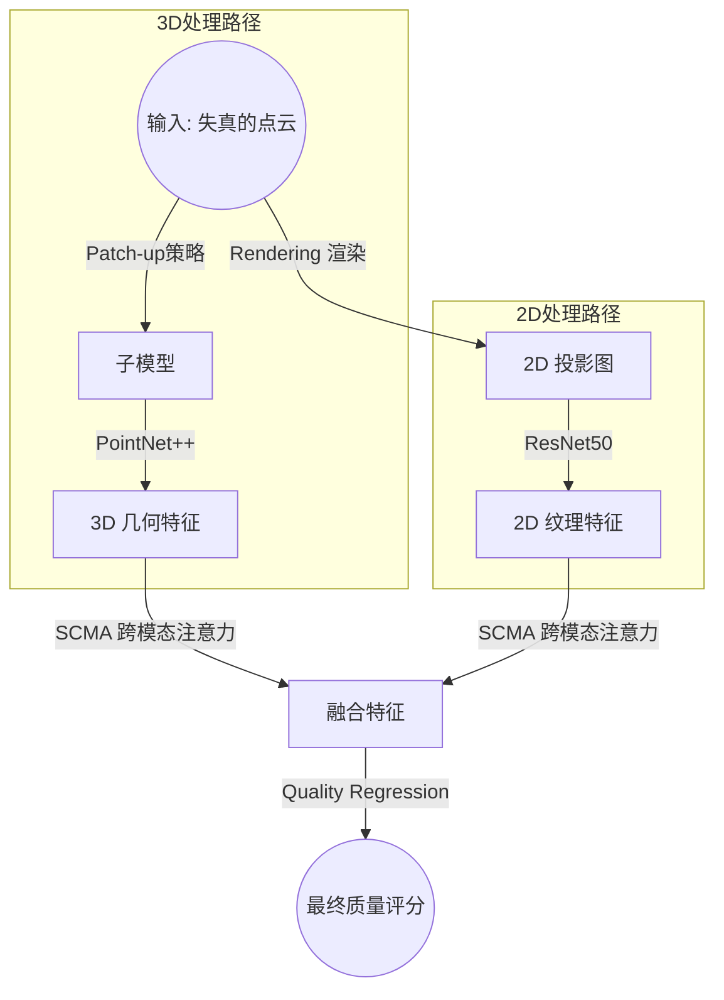

通过这个框架，**MM-PCQA** 成功地利用了**多模态 (Multi-Modal)** 信息，解决了**无参考 (No-Reference)** 场景下的点云质量评价难题 。
  
## 参考        
         
https://arxiv.org/pdf/2209.00244    
        
<b> 以上内容基于DeepSeek、Qwen、Gemini及诸多AI生成, 轻微人工调整, 感谢杭州深度求索人工智能、阿里云、Google等公司. </b>        
        
<b> AI 生成的内容请自行辨别正确性, 当然也多了些许踩坑的乐趣, 毕竟冒险是每个男人的天性.  </b>        
  
    
#### [PolarDB 学习图谱](https://www.aliyun.com/database/openpolardb/activity "8642f60e04ed0c814bf9cb9677976bd4")
  
  
#### [PostgreSQL 解决方案集合](../201706/20170601_02.md "40cff096e9ed7122c512b35d8561d9c8")
  
  
#### [德哥 / digoal's Github - 公益是一辈子的事.](https://github.com/digoal/blog/blob/master/README.md "22709685feb7cab07d30f30387f0a9ae")
  
  
#### [About 德哥](https://github.com/digoal/blog/blob/master/me/readme.md "a37735981e7704886ffd590565582dd0")
  
  

  
