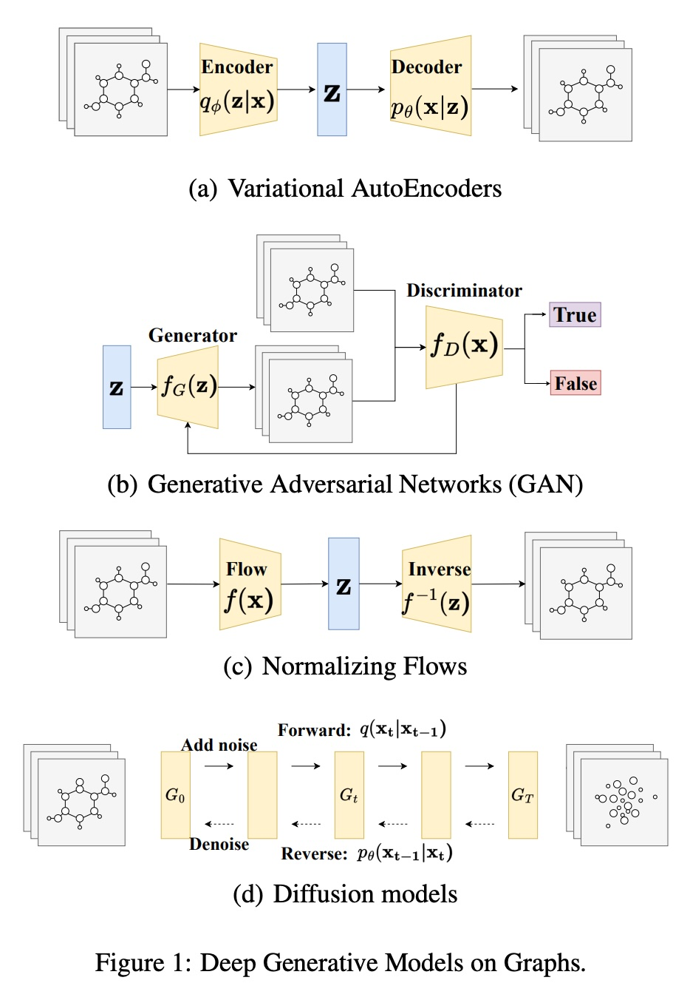
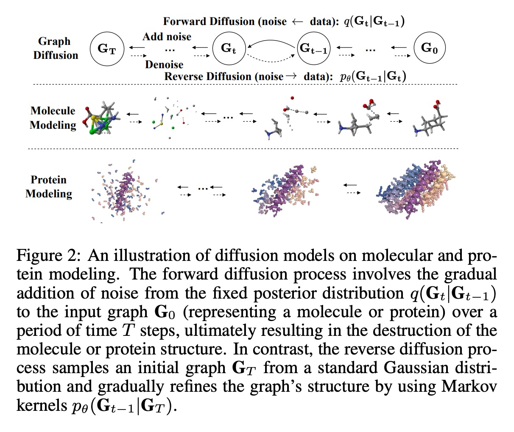
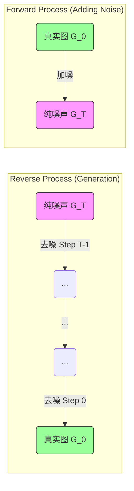
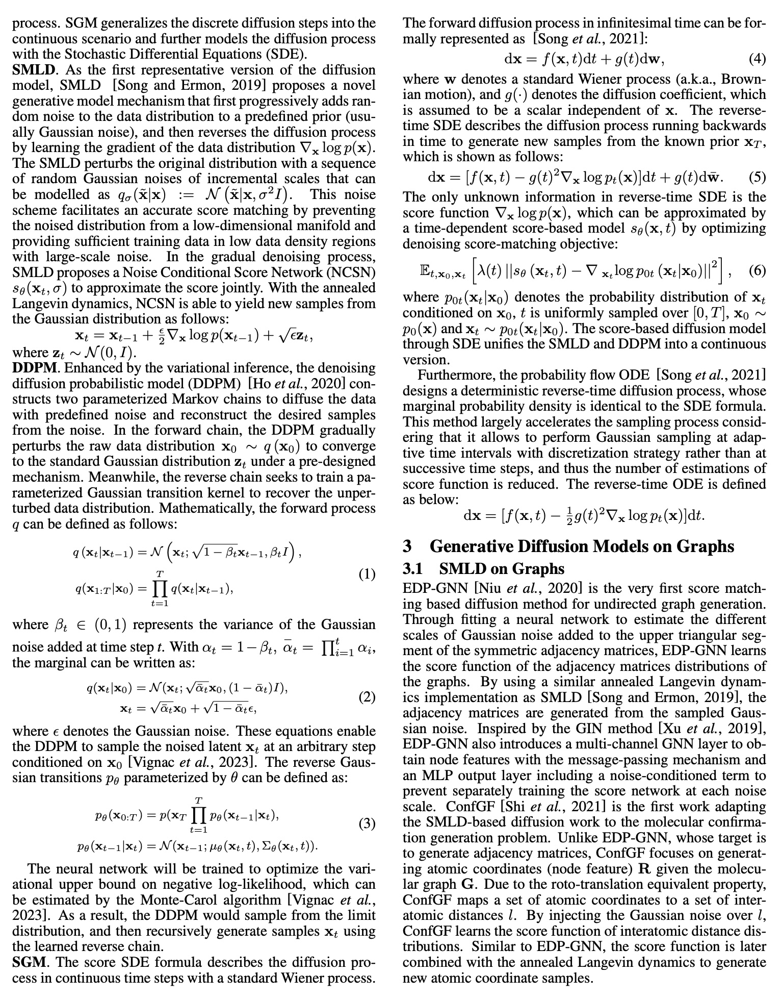
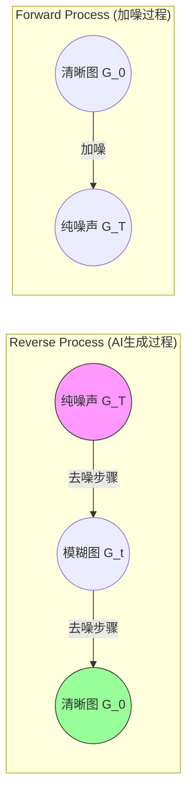
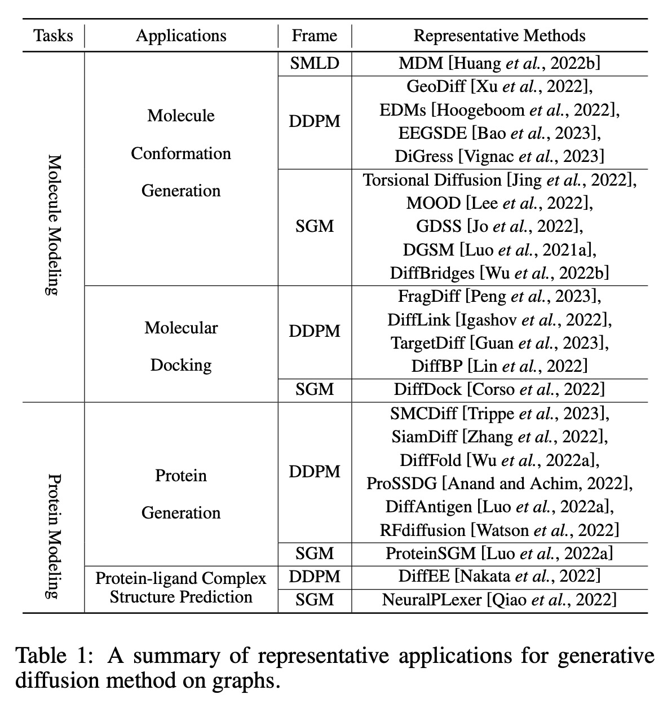
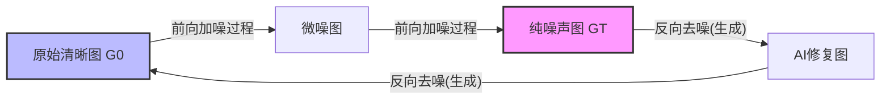

## AI论文解读 | Generative Diffusion Models on Graphs: Methods and Applications
        
### 作者        
digoal        
        
### 日期        
2025-12-10        
        
### 标签        
PostgreSQL , PolarDB , DuckDB , AI , 论文解读        
        
----        
        
## 背景  
      
https://www.ijcai.org/proceedings/2023/0751.pdf        
  
提示:          
```          
读懂《Generative Diffusion Models on Graphs: Methods and Applications》这篇论文需要提前掌握哪些基础知识, 请使用中文通熟易懂的讲解这些基础知识, 可以引用论文中的图、表或使用Markdown支持的图形(text,mermaid等)增加解释性. 
  
使用中文通熟易懂的解读《Generative Diffusion Models on Graphs: Methods and Applications》这篇论文, 其中的关键内容请着重讲解, 可以引用论文中的图、表或使用Markdown支持的图形(text,mermaid等)增加解释性. 
  
提取《Generative Diffusion Models on Graphs: Methods and Applications》这篇论文中的重要术语, 使用中文对这些术语进行通熟易懂的讲解, 可以引用论文中的图、表或使用Markdown支持的图形(text,mermaid等)增加解释性. 
```     
  
## 1 前置知识 
  
要读懂这篇关于**图上的生成式扩散模型（Generative Diffusion Models on Graphs）的综述论文，你需要建立三块核心知识基石：图神经网络（GNN）基础、传统的深度生成模型以及扩散模型的通用原理**。

为了让你更轻松地理解，我将用通俗的语言拆解这些概念，并配合论文中的图表进行解释。

-----

### 1\. 图数据的独特挑战：为什么图很难生成？

在阅读论文引言部分时，你会遇到 **“离散性（Discreteness）”** 和 **“置换不变性（Permutation Invariant）”** 这两个拦路虎 。

#### 基础概念：图的表示

  * **什么是图？** 图由 **节点（Nodes/Vertices）** 和 **边（Edges）** 组成。比如在分子图中，原子是节点，化学键是边。
  * **邻接矩阵 ( Adjacency Matrix, $A$ )** ：这是计算机“看”图的方式。如果节点 $i$ 和节点 $j$ 连着，矩阵里第 $i$ 行第 $j$ 列就是1，否则是0 。
  * **节点特征矩阵 ( $X$ )** ：描述每个节点的属性（比如原子的类型：碳、氧）。

#### 核心难点：置换不变性 (Permutation Invariant)

这是图生成模型中最绕的概念。

  * **通俗解释**：想象一个微信群聊（社交网络图）。如果把群里的“张三”和“李四”在列表里的顺序换一下，这个群聊的关系网（谁认识谁）变了吗？**没有变**。
  * **数学困境**：虽然图没变，但是表示它的**邻接矩阵变了**（行和列的顺序换了）。
  * **论文中的意义**：论文提到，对于 $N$ 个节点的图，可能有 $N!$ 种不同的矩阵代表同一个图 。一个好的生成模型必须认识到“这些矩阵其实是同一个东西”，这叫**置换不变性**。

-----

### 2\. 传统生成模型：扩散模型的前辈们

论文在第2部分通过 **Figure 1 (a, b, c)** 对比了扩散模型与其他模型 。你需要了解它们的基本逻辑，才能明白扩散模型好在哪里。      

#### (a) 变分自编码器 (VAE) 

  * **原理**：先把图“压缩”成一个简单的编码（Encoder），然后再尝试把它“解压”还原（Decoder）。
  * **缺点**：生成的图往往比较模糊，且难以处理大型图结构 。

#### (b) 生成对抗网络 (GAN) 

  * **原理**：像验钞机和造假币者的博弈。 **生成器（Generator）** 负责造假图， **判别器（Discriminator）** 负责识别真假。
  * **缺点**：在图数据上容易出现“模式坍塌”（Mode Collapse），即造出来的图千篇一律 。

#### (c) 归一化流 (Normalizing Flows) 

  * **原理**：通过一系列复杂的数学变换，把简单的分布（如高斯分布）直接变成图数据的分布。
  * **缺点**：结构限制较多，难以捕捉复杂的图结构依赖 。

*(论文中的 Figure 1 展示了这三种模型与扩散模型的架构对比)*

-----

### 3\. 扩散模型 (Diffusion Models)：核心主角

这是论文的重头戏（Figure 1(d) 和 Figure 2）。你需要理解“加噪”和“去噪”的过程。

    

#### 核心直觉：融化与重结晶

想象你要做一个冰雕（ 原本的数据 $G_0$ ）：

1.  **前向过程 (Forward Diffusion)** ：你不断地加热冰雕，它慢慢融化，最后变成了一滩完全随机的水（ 纯噪声 $G_T$ ）。这个过程是简单的、固定的（比如加高斯噪声）。
2.  **反向过程 (Reverse Diffusion)** ：这才是模型要学的本事。模型需要学会如何把这滩水，一步步“逆向”冻结回原来的冰雕形状 。

#### 论文提到的三大流派 

为了看懂论文第2.2节，你需要区分这三个缩写：

| 缩写 | 全称 | 通俗解释 |
| :--- | :--- | :--- |
| **DDPM** | 去噪扩散概率模型 | **步步为营**。把时间切成离散的步数（比如1000步），每一步预测怎么去除一点点噪音 。 |
| **SMLD** | 朗之万动力学分数匹配 | **找坡度**。它学习的是数据的“梯度场”（Score function），告诉数据“往哪个方向走”能变回真实的图 。 |
| **SGM** | 基于分数的生成模型 | **连续进化**。用微分方程（SDE/ODE）来描述加噪和去噪的过程，是前两者的连续版本 。 |



*(图解：扩散模型通过学习反向过程来从噪声中生成数据)*

-----

### 4\. 领域应用知识：分子与蛋白质

论文第4节大量讨论了应用 。如果不懂一点点生化背景，这部分会像天书。

  * **分子也是图**：在AI制药中，分子被视为图。
      * **节点** = 原子 (C, H, O...)
      * **边** = 化学键 (单键, 双键...)
  * **构象 (Conformation)** ：分子的**3D形状**。虽然化学式一样（图的拓扑结构一样），但在三维空间里的折叠方式不同，性质就完全不同。论文中提到的 **GeoDiff** 等模型就是为了生成分子的3D坐标 。
  * **蛋白质折叠**：蛋白质是由氨基酸长链组成的，它折叠成特定的3D结构才能发挥功能（如锁和钥匙）。扩散模型在这里被用来预测或生成这种复杂的3D结构 。

### 总结：阅读路线建议

1.  先看 **Figure 1** ，搞懂扩散模型（Step-by-step 去噪）和 VAE/GAN 的区别。      
2.  理解 **Section 1 Introduction** 中的“置换不变性”挑战。
3.  跳过繁杂的数学公式（如公式 1-6），直接看 **Figure 2** ，结合我上面的表格，理解 SMLD/DDPM/SGM 是处理同一问题的不同数学手段。          
4.  最后看应用部分，把分子想象成积木搭建的图，模型就是在学习如何从一堆散乱的积木（噪声）搭出稳定的结构。
  
## 2 解读论文 
  
这是一篇发表在 IJCAI-23 上的综述论文，标题为 **《图上的生成式扩散模型：方法与应用》**  (Generative Diffusion Models on Graphs: Methods and Applications)。

这篇论文的核心目的是： **总结如何将当下最火的“扩散模型”（Diffusion Models，比如由于DALL-E和Midjourney而闻名的技术）应用到“图数据”（Graphs，比如分子结构、社交网络）上。**

为了让你轻松读懂，我将这篇论文拆解为四个关键部分： **背景与挑战**、**核心原理**、**三大流派**以及**实际应用**。 

-----

### 1\. 为什么要用“扩散模型”生成图？

#### 背景：图数据无处不在

图（Graph）是描述事物关系的通用语言。

  * **微观世界**：分子是原子通过化学键连成的图。
  * **宏观世界**：社交网络是人与人关注关系的图。
    图生成（Graph Generation）的目标就是让AI学会这些图的规律，然后创造出**全新的、符合规律的**图（例如设计新药分子）。

#### 传统方法的局限

在扩散模型出现之前，我们主要用 VAE（变分自编码器）和 GAN（生成对抗网络）。但在图数据上，它们都有明显的短板：

  * **VAE**：生成的图往往比较模糊，难以处理大型图 。
  * **GAN**：容易出现“模式坍塌”（即造出来的图千篇一律），且训练不稳定 。

#### 图数据的三大拦路虎

相比于生成图片（像素矩阵），生成图非常难，论文总结了三个核心挑战 ：

1.  **离散性 (Discreteness)** ：图的边是“有”或“无”，不像图片的像素颜色是连续变化的数值，导致很难计算梯度。
2.  **复杂的依赖 (Complex Dependencies)** ：图中的节点不是独立的，牵一发而动全身。
3.  **置换不变性 (Permutation Invariant)** ：这是图最特殊的性质。你把图中的节点编号打乱（比如把节点1和节点2换个位置），虽然矩阵变了，但这还是同一个图。模型必须能识别这一点。

-----

### 2\. 什么是图扩散模型？（核心原理）

扩散模型的灵感来自热力学。想象一滴墨水滴入水中扩散开，最后变成均匀的浑水。
论文通过 **Figure 1 (d)** 展示了这一过程，我们可以将其分为两个阶段 ：      

  * **前向过程 (Forward / Diffusing)** ： **搞破坏**。
      * 把一张正常的图（ 比如一个药物分子 $G_0$ ），慢慢加上噪声。
      * 最后它变成了一个完全随机的、混乱的噪声图 $G_T$ 。
  * **反向过程 (Reverse / Denoising)** ： **搞修复**。
      * 让AI学习如何把这个噪声图 $G_T$ ，一步步“去噪”，还原回有意义的图 $G_0$ 。
      * **这就是生成的本质：从纯噪声中变出有意义的数据。**




-----

### 3\. 三大核心流派 (Technical Paradigms)

论文将目前的图扩散模型分为三类。虽然数学复杂，但通俗理解如下 ：

#### A. SMLD (基于分数匹配)

  * **核心逻辑**： **“找坡度”** 。
  * 它不预测具体的图长什么样，而是学习一个“分数函数”（Score Function），即告诉数据点：“往哪个方向走能让你看起来更像一张真实的图” 。
  * **代表作**： **EDP-GNN**（第一个生成邻接矩阵的方法）和 **ConfGF**（用于生成分子的3D坐标）。

#### B. DDPM (去噪扩散概率模型)

  * **核心逻辑**： **“步步为营”** 。
  * 它把去噪过程看作一个马尔可夫链（Markov Chain），训练AI一步一步地预测每一步加了多少噪，然后减去它 。
  * **突破点**：为了解决图的“离散性”，**DiGress** 等模型引入了离散状态的噪声（不再是加高斯白噪，而是以一定概率随机改变边的类型），让生成过程更符合图的特性 。

#### C. SGM (基于分数的生成模型 / SDE)

  * **核心逻辑**： **“连续进化”** 。
  * 它把离散的步骤变成了连续的时间流（就像把幻灯片变成了电影），用随机微分方程（SDE）来描述。这统一了上面两种方法 。
  * **代表作**： **GDSS**，它能同时对节点特征和邻接矩阵进行连续时间的扩散和去噪 。

-----

### 4\. 关键应用领域 (Applications)

这是论文最精彩的部分，主要集中在**AI制药**和**生物计算**。请参考论文中的 **Table 1** 和 **Figure 2**。          

#### 4.1 分子建模 (Molecule Modeling)

AI在这里的目标是设计新药。

  * **分子构象生成 (Conformation Generation)** ：
      * 不仅要生成化学式，还要生成分子的**3D形状**（因为形状决定药效）。
      * **GeoDiff** 把原子看作热力学粒子，通过逆转扩散过程，让原子从随机位置“归位”到稳定的3D结构 。
  * **分子对接 (Molecular Docking)** ：
      * 预测药物分子如何“插”入蛋白质的口袋里。
      * **DiffDock** 将其视为一个生成问题，生成药物在蛋白质表面的最佳结合姿态 。

#### 4.2 蛋白质建模 (Protein Modeling)

  * **蛋白质生成**：设计自然界不存在的蛋白质。
      * **RFdiffusion** 是目前的SOTA（最强）模型，它结合了扩散模型和RoseTTAFold，能设计出全新的蛋白质骨架 。
      * **DiffFold** 模拟蛋白质从无序链条折叠成稳定结构的过程 。

-----

### 5\. 总结与未来展望

这篇论文总结了图扩散模型的现状：

1.  **它比GAN和VAE更强**，能生成质量更高、更多样化的图。
2.  **核心在于如何处理图的结构**，特别是如何把“噪声”这一概念应用在离散的节点和边上。

**未来的方向 ：**

  * **可控生成**：我不仅要生成一个分子，我还要指定它必须无毒、水溶性好（Conditional Generation）。
  * **可信赖性**：AI生成的药物结构是否真的在物理上稳定？是否存在安全隐患？

**一句话总结：** 这篇论文告诉我们，扩散模型不仅能画画，还能当“分子建筑师”，通过从混沌中恢复秩序的方式，设计出全新的药物和蛋白质结构。
  
## 3 术语 
  
为了帮助你更好地理解《图上的生成式扩散模型：方法与应用》这篇论文，我提炼了其中的核心术语，并用通俗易懂的语言进行解读。

### 1\. 基础概念篇：什么是图扩散？

#### **Graph Generative Models (图生成模型)**

  * **通俗解释**：如果把图（Graph）比作积木搭建的城堡，图生成模型就是一个“甚至能自己设计图纸”的建筑师。
  * **目标**：它的任务是学习现有图数据的规律（分布），然后创造出全新的、但符合逻辑的图 。
  * **应用**：比如设计从未有过的新药物分子结构，或者构建新的社交网络模拟图 。

#### **Diffusion Models (扩散模型)**

  * **通俗解释**：这是一个“先破坏，再修复”的过程。想象你把一幅沙画（原始数据）慢慢吹散，直到变成一盘散沙（噪声）；然后，你训练一个AI，让它学会看着这盘散沙，逆向操作，把它吹回原来的沙画 。

  * **论文图示**：论文中的 **Figure 1 (d)** 清晰展示了这个过程。   

  * **Forward Diffusion (前向扩散/加噪)** ：

      * **破坏过程**。给一张清晰的图 $G_0$ 逐步添加噪声（通常是高斯噪声），直到它变成完全混乱的噪声图 $G_T$  。

  * **Reverse Diffusion (反向扩散/去噪)** ：

      * **创造过程**。模型学习如何一步步去除噪声，从混沌中恢复出有意义的图结构 $G_0$ 。




-----

### 2\. 核心难点篇：为什么在图上做扩散很难？

#### **Permutation Invariant (置换不变性)**

  * **通俗解释**：这是图数据最让人头疼的特性。想象一个微信群里有你、张三、李四。无论群成员列表里是按“张三、李四、你”排序，还是“你、张三、李四”排序，**这个群的社交关系网本质上是没变的**。
  * **技术含义**：对于一个有 $N$ 个节点的图，可能有 $N!$ （N的阶乘）种不同的矩阵写法来表示同一个图。模型必须能识别出这些不同的写法其实代表的是同一个东西 。

#### **Discreteness (离散性)**

  * **通俗解释**：图片的像素颜色是连续渐变的（从深灰到浅灰），但图的边是“非黑即白”的——两个节点之间要么有边（1），要么没边（0），不存在“0.5条边”。
  * **挑战**：传统的扩散模型喜欢处理连续变化的噪声（像水流一样），而图的这种“断断续续”的特性让数学计算（特别是梯度计算）变得很困难 。

-----

### 3\. 三大流派篇：论文介绍的解题思路

论文将现有的方法归纳为三种核心技术路线 ：

#### **1. SMLD (Score Matching with Langevin Dynamics)**

  * **中文名**：朗之万动力学分数匹配。
  * **核心逻辑**： **“找坡度”** 。它不直接预测图长什么样，而是学习一个“分数函数”（Score Function）。这个函数就像一个指南针，告诉数据点：“往哪个方向移动，你就能变得更像一张真实的图” 。

#### **2. DDPM (Denoising Diffusion Probabilistic Model)**

  * **中文名**：去噪扩散概率模型。
  * **核心逻辑**： **“步步为营”** 。它利用马尔可夫链（Markov Chains），把去噪过程拆解成几百上千个小步骤。AI只需要学会每一步怎么把当前的噪声减少一点点即可 。这是目前图像生成领域最火的方法之一。

#### **3. SGM (Score-based Generative Model)**

  * **中文名**：基于分数的生成模型。
  * **核心逻辑**： **“连续进化”** 。它用随机微分方程（SDE）把上述过程描述成一个随时间连续流动的过程，是前两种方法的统一和推广 。

-----

### 4\. 应用篇：这东西能干嘛？

论文重点介绍了在生物和化学领域的应用，见 **Figure 2**：  

#### **Molecule Conformation Generation (分子构象生成)**

  * **背景**：化学课本上的分子式是平面的（2D），但现实中的分子是立体的（3D）。
  * **解释**：利用扩散模型，输入一个平面的分子图，AI能“脑补”出它在三维空间中真实的折叠形状（原子坐标）。这对于研制新药至关重要，因为形状决定了药物能否起效 。
  * **代表方法**： **GeoDiff**，通过逆转热力学过程来预测原子位置 。

#### **Molecular Docking (分子对接)**

  * **通俗解释**： **“锁和钥匙”** 。如果蛋白质是体内的“锁”，药物分子就是“钥匙”。分子对接就是预测这把钥匙能不能插进锁孔，以及插进去的最佳姿势是什么。
  * **扩散模型的应用**：把这个过程看作一个生成过程，让药物分子在蛋白质的“口袋”里通过扩散过程找到最佳位置 。

#### **Protein Generation (蛋白质生成)**

  * **通俗解释**：设计自然界中不存在的全新蛋白质。
  * **代表方法**： **RFdiffusion**。这是一种结合了扩散模型和蛋白质预测网络的方法，可以像画图一样设计出全新的蛋白质骨架 。
  
## 参考        
         
https://www.ijcai.org/proceedings/2023/0751.pdf    
        
<b> 以上内容基于DeepSeek、Qwen、Gemini及诸多AI生成, 轻微人工调整, 感谢杭州深度求索人工智能、阿里云、Google等公司. </b>        
        
<b> AI 生成的内容请自行辨别正确性, 当然也多了些许踩坑的乐趣, 毕竟冒险是每个男人的天性.  </b>        
  
    
#### [PolarDB 学习图谱](https://www.aliyun.com/database/openpolardb/activity "8642f60e04ed0c814bf9cb9677976bd4")
  
  
#### [PostgreSQL 解决方案集合](../201706/20170601_02.md "40cff096e9ed7122c512b35d8561d9c8")
  
  
#### [德哥 / digoal's Github - 公益是一辈子的事.](https://github.com/digoal/blog/blob/master/README.md "22709685feb7cab07d30f30387f0a9ae")
  
  
#### [About 德哥](https://github.com/digoal/blog/blob/master/me/readme.md "a37735981e7704886ffd590565582dd0")
  
  

  
